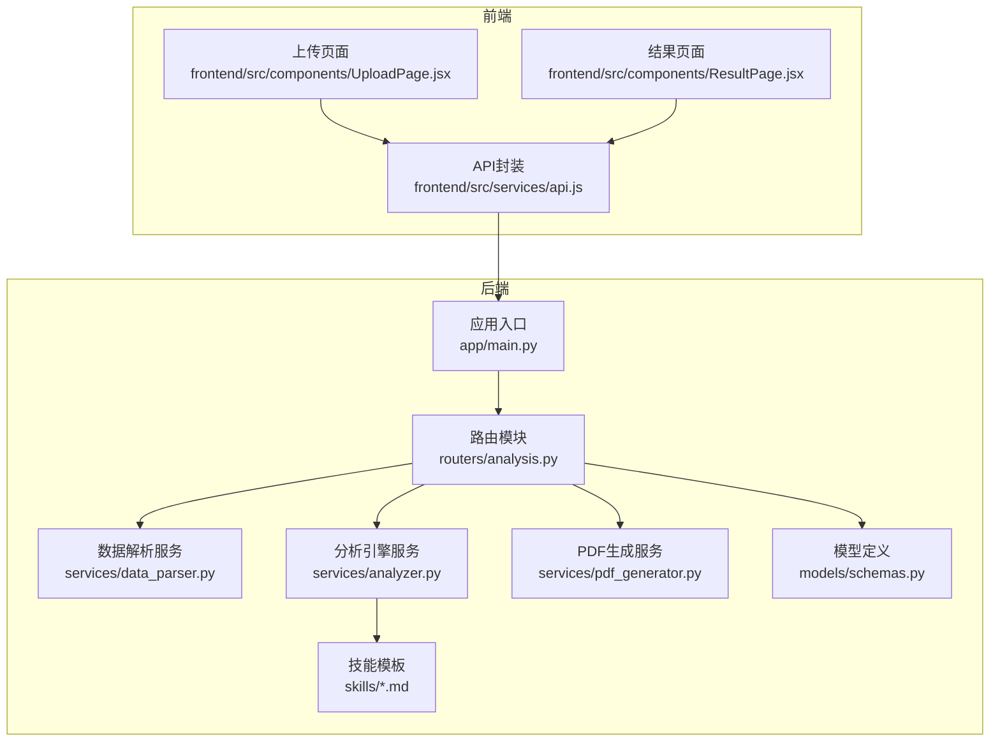
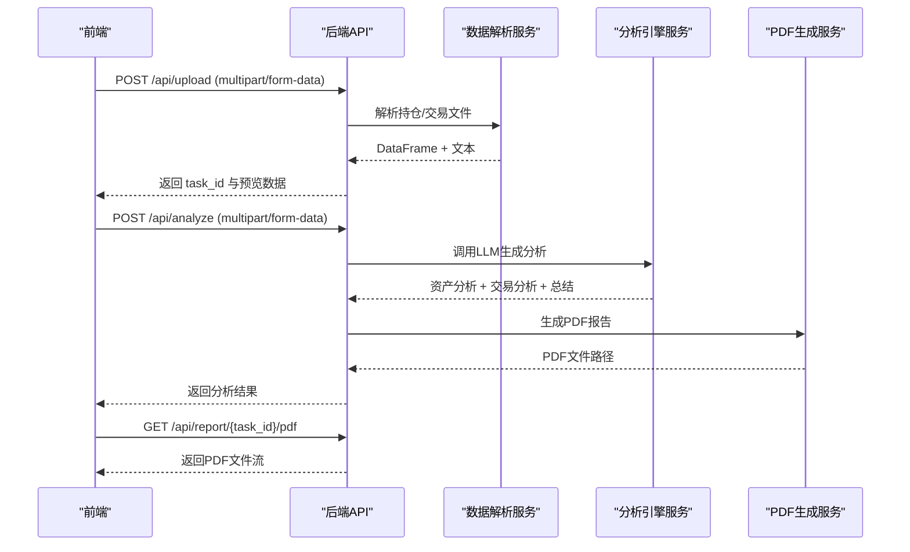
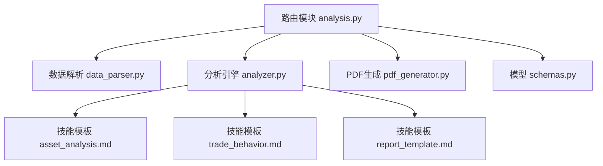

# API接口文档

<cite>
**本文档引用的文件**
- [backend/app/main.py](file://backend/app/main.py)
- [backend/app/routers/analysis.py](file://backend/app/routers/analysis.py)
- [backend/app/services/analyzer.py](file://backend/app/services/analyzer.py)
- [backend/app/services/data_parser.py](file://backend/app/services/data_parser.py)
- [backend/app/services/pdf_generator.py](file://backend/app/services/pdf_generator.py)
- [backend/app/models/schemas.py](file://backend/app/models/schemas.py)
- [backend/app/skills/report_template.md](file://backend/app/skills/report_template.md)
- [backend/app/skills/asset_analysis.md](file://backend/app/skills/asset_analysis.md)
- [backend/app/skills/trade_behavior.md](file://backend/app/skills/trade_behavior.md)
- [frontend/src/services/api.js](file://frontend/src/services/api.js)
- [frontend/src/components/UploadPage.jsx](file://frontend/src/components/UploadPage.jsx)
- [frontend/src/components/ResultPage.jsx](file://frontend/src/components/ResultPage.jsx)
- [backend/requirements.txt](file://backend/requirements.txt)
</cite>

## 目录
1. [简介](#简介)
2. [项目结构](#项目结构)
3. [核心组件](#核心组件)
4. [架构总览](#架构总览)
5. [详细组件分析](#详细组件分析)
6. [依赖关系分析](#依赖关系分析)
7. [性能考虑](#性能考虑)
8. [故障排除指南](#故障排除指南)
9. [结论](#结论)
10. [附录](#附录)

## 简介
本项目提供一套基于FastAPI的客户资产分析系统，支持文件上传、AI驱动的资产配置与交易行为分析、PDF报告生成与下载，以及任务状态查询与反馈重生成。系统通过RESTful API对外提供统一接口，前端通过Axios封装调用，后端采用OpenAI大模型进行智能分析，并使用ReportLab生成中文PDF报告。

## 项目结构
后端采用分层设计：
- 应用入口与路由注册：在应用入口中注册CORS中间件、静态文件目录，并挂载分析路由。
- 路由层：定义上传、分析、报告下载、任务查询、反馈重生成等API端点。
- 服务层：数据解析、分析引擎、PDF生成。
- 模型层：Pydantic模型定义任务状态与请求/响应结构。
- 技能模板：用于指导LLM分析的提示词模板。

**图表来源**
- [backend/app/main.py:1-28](file://backend/app/main.py#L1-L28)
- [backend/app/routers/analysis.py:1-218](file://backend/app/routers/analysis.py#L1-L218)
- [backend/app/services/data_parser.py:1-96](file://backend/app/services/data_parser.py#L1-L96)
- [backend/app/services/analyzer.py:1-93](file://backend/app/services/analyzer.py#L1-L93)
- [backend/app/services/pdf_generator.py:1-215](file://backend/app/services/pdf_generator.py#L1-L215)
- [backend/app/models/schemas.py:1-30](file://backend/app/models/schemas.py#L1-L30)
- [backend/app/skills/report_template.md:1-34](file://backend/app/skills/report_template.md#L1-L34)
- [backend/app/skills/asset_analysis.md:1-35](file://backend/app/skills/asset_analysis.md#L1-L35)
- [backend/app/skills/trade_behavior.md:1-34](file://backend/app/skills/trade_behavior.md#L1-L34)
- [frontend/src/services/api.js:1-48](file://frontend/src/services/api.js#L1-L48)
- [frontend/src/components/UploadPage.jsx:1-145](file://frontend/src/components/UploadPage.jsx#L1-L145)
- [frontend/src/components/ResultPage.jsx:1-193](file://frontend/src/components/ResultPage.jsx#L1-L193)

**章节来源**
- [backend/app/main.py:1-28](file://backend/app/main.py#L1-L28)
- [backend/app/routers/analysis.py:1-218](file://backend/app/routers/analysis.py#L1-L218)

## 核心组件
- 应用入口与中间件
  - 启动FastAPI应用，设置CORS允许跨域访问，注册静态文件目录，挂载分析路由。
  - 上传与报告目录初始化，确保工作目录存在。
- 路由模块
  - 定义任务内存存储，提供上传、分析、报告下载、任务查询、反馈重生成等端点。
  - 所有端点均位于/api前缀下，便于前端统一管理。
- 服务模块
  - 数据解析：支持CSV/Excel，自动标准化列名并计算衍生字段，输出结构化文本供LLM分析。
  - 分析引擎：加载技能模板，调用OpenAI大模型，生成资产配置分析、交易行为分析与综合报告。
  - PDF生成：注册中文字体，将Markdown内容渲染为PDF，包含封面、目录与免责声明。
- 模型定义
  - 定义任务状态枚举与请求/响应模型，确保接口契约清晰。
- 技能模板
  - 资产配置分析、交易行为分析与综合报告模板，指导LLM输出结构化内容。

**章节来源**
- [backend/app/main.py:1-28](file://backend/app/main.py#L1-L28)
- [backend/app/routers/analysis.py:1-218](file://backend/app/routers/analysis.py#L1-L218)
- [backend/app/services/data_parser.py:1-96](file://backend/app/services/data_parser.py#L1-L96)
- [backend/app/services/analyzer.py:1-93](file://backend/app/services/analyzer.py#L1-L93)
- [backend/app/services/pdf_generator.py:1-215](file://backend/app/services/pdf_generator.py#L1-L215)
- [backend/app/models/schemas.py:1-30](file://backend/app/models/schemas.py#L1-L30)
- [backend/app/skills/report_template.md:1-34](file://backend/app/skills/report_template.md#L1-L34)
- [backend/app/skills/asset_analysis.md:1-35](file://backend/app/skills/asset_analysis.md#L1-L35)
- [backend/app/skills/trade_behavior.md:1-34](file://backend/app/skills/trade_behavior.md#L1-L34)

## 架构总览
系统采用前后端分离架构，后端提供RESTful API，前端通过Axios发起请求。分析流程如下：
- 上传文件并预览
- 触发分析，调用LLM生成分析结果
- 生成PDF报告
- 下载PDF或根据反馈重生成

**图表来源**
- [backend/app/routers/analysis.py:35-152](file://backend/app/routers/analysis.py#L35-L152)
- [backend/app/services/data_parser.py:7-96](file://backend/app/services/data_parser.py#L7-L96)
- [backend/app/services/analyzer.py:41-93](file://backend/app/services/analyzer.py#L41-L93)
- [backend/app/services/pdf_generator.py:146-215](file://backend/app/services/pdf_generator.py#L146-L215)
- [frontend/src/services/api.js:10-45](file://frontend/src/services/api.js#L10-L45)

## 详细组件分析

### 接口总览
- 基础URL：/api
- 版本：1.0.0（应用标题中声明）
- 认证：未实现认证机制，建议在生产环境增加鉴权策略
- 请求头：Content-Type根据请求类型设置
  - 上传文件：multipart/form-data
  - 其他表单：application/x-www-form-urlencoded
- 超时：前端分析请求超时设为5分钟

**章节来源**
- [backend/app/main.py:8](file://backend/app/main.py#L8)
- [frontend/src/services/api.js:5-8](file://frontend/src/services/api.js#L5-L8)

### 1) 文件上传接口
- 方法与路径
  - POST /api/upload
- 功能
  - 接收持仓数据文件（必填，CSV/Excel），可选交易记录文件（CSV/Excel）
  - 自动解析并生成预览（前10条记录）
  - 生成任务ID，保存文件至本地临时目录
- 请求参数（multipart/form-data）
  - holdings_file: File（必填）
  - trades_file: File（可选）
  - customer_name: String（可选，默认“客户”）
- 成功响应
  - task_id: String
  - customer_name: String
  - holdings_preview: Array（最多10条记录）
  - trades_preview: Array（最多10条记录，若上传了交易文件）
  - message: String（提示信息）
- 错误码
  - 400：持仓/交易文件解析失败
  - 500：服务器内部错误
- 示例请求
  - 使用multipart/form-data，包含holding_file与可选trades_file
- 示例响应
  - 包含task_id、预览数据与消息

**章节来源**
- [backend/app/routers/analysis.py:35-83](file://backend/app/routers/analysis.py#L35-L83)
- [backend/app/services/data_parser.py:7-96](file://backend/app/services/data_parser.py#L7-L96)

### 2) 分析触发接口
- 方法与路径
  - POST /api/analyze
- 功能
  - 根据task_id触发分析，调用LLM生成资产配置分析、交易行为分析与综合报告
  - 生成PDF报告并保存
- 请求参数（multipart/form-data）
  - task_id: String（必填）
  - customer_name: String（可选）
- 成功响应
  - task_id: String
  - status: String（固定为“completed”）
  - asset_analysis: String（资产配置分析结果）
  - trade_analysis: String（交易行为分析结果）
  - summary: String（综合报告总结）
- 错误码
  - 404：任务不存在
  - 500：分析失败（内部错误）
- 示例请求
  - form-data：task_id与可选customer_name
- 示例响应
  - 包含分析结果与状态

**章节来源**
- [backend/app/routers/analysis.py:86-134](file://backend/app/routers/analysis.py#L86-L134)
- [backend/app/services/analyzer.py:77-93](file://backend/app/services/analyzer.py#L77-L93)

### 3) 报告下载接口
- 方法与路径
  - GET /api/report/{task_id}/pdf
- 功能
  - 下载指定任务ID对应的PDF报告
- 路径参数
  - task_id: String（必填）
- 成功响应
  - 文件流：application/pdf
  - 文件名：资产分析报告_{客户名}_{task_id}.pdf
- 错误码
  - 404：任务不存在或报告尚未生成
- 示例请求
  - GET /api/report/{task_id}/pdf
- 示例响应
  - 直接下载PDF文件

**章节来源**
- [backend/app/routers/analysis.py:137-152](file://backend/app/routers/analysis.py#L137-L152)

### 4) 反馈重生成接口
- 方法与路径
  - POST /api/analyze/{task_id}/regenerate
- 功能
  - 根据用户反馈重新生成分析结果与PDF报告
- 路径参数
  - task_id: String（必填）
- 请求参数（multipart/form-data）
  - feedback: String（必填，用户修改意见）
- 成功响应
  - task_id: String
  - status: String（固定为“completed”）
  - asset_analysis: String
  - trade_analysis: String
  - summary: String
- 错误码
  - 404：任务不存在
  - 500：重新生成失败
- 示例请求
  - form-data：feedback
- 示例响应
  - 包含更新后的分析结果

**章节来源**
- [backend/app/routers/analysis.py:155-199](file://backend/app/routers/analysis.py#L155-L199)
- [backend/app/services/analyzer.py:77-93](file://backend/app/services/analyzer.py#L77-L93)

### 5) 任务状态查询接口
- 方法与路径
  - GET /api/task/{task_id}
- 功能
  - 查询任务状态与结果（若已完成）
- 路径参数
  - task_id: String（必填）
- 成功响应
  - task_id: String
  - status: String（pending/analyzing/completed/failed）
  - customer_name: String
  - 若已完成：额外包含asset_analysis、trade_analysis、summary
- 错误码
  - 404：任务不存在
- 示例请求
  - GET /api/task/{task_id}
- 示例响应
  - 包含状态与可选结果

**章节来源**
- [backend/app/routers/analysis.py:202-217](file://backend/app/routers/analysis.py#L202-L217)

### 数据验证规则
- 文件类型
  - 支持CSV与Excel格式
- 必填项
  - 上传接口：holdings_file
  - 分析接口：task_id
  - 重生成接口：feedback
- 字段命名
  - 数据解析会尝试匹配中文列名并标准化为英文字段，如“证券名称”→“name”等
- 衍生字段
  - 自动计算市值、盈亏、盈亏比例等

**章节来源**
- [backend/app/services/data_parser.py:14-52](file://backend/app/services/data_parser.py#L14-L52)
- [backend/app/services/data_parser.py:62-95](file://backend/app/services/data_parser.py#L62-L95)

### 认证机制
- 当前实现
  - 未实现认证与授权机制
- 建议
  - 生产环境应引入JWT、API Key或OAuth等鉴权方案
  - 对敏感操作（如删除、修改）增加权限校验

**章节来源**
- [backend/app/routers/analysis.py:1-218](file://backend/app/routers/analysis.py#L1-L218)

### API版本控制与兼容性
- 版本标识
  - 应用版本在应用标题中声明为1.0.0
- 兼容性
  - 当前版本为初始版本，建议在后续迭代中保持向后兼容或通过新增版本号推进升级
  - 前端默认基础URL为http://localhost:8000/api，便于扩展

**章节来源**
- [backend/app/main.py:8](file://backend/app/main.py#L8)
- [frontend/src/services/api.js:3](file://frontend/src/services/api.js#L3)

## 依赖关系分析

**图表来源**
- [backend/app/routers/analysis.py:10-12](file://backend/app/routers/analysis.py#L10-L12)
- [backend/app/services/analyzer.py:11-15](file://backend/app/services/analyzer.py#L11-L15)
- [backend/app/skills/asset_analysis.md:1-35](file://backend/app/skills/asset_analysis.md#L1-L35)
- [backend/app/skills/trade_behavior.md:1-34](file://backend/app/skills/trade_behavior.md#L1-L34)
- [backend/app/skills/report_template.md:1-34](file://backend/app/skills/report_template.md#L1-L34)
- [backend/app/models/schemas.py:1-30](file://backend/app/models/schemas.py#L1-L30)

**章节来源**
- [backend/app/routers/analysis.py:10-12](file://backend/app/routers/analysis.py#L10-L12)
- [backend/app/services/analyzer.py:11-15](file://backend/app/services/analyzer.py#L11-L15)

## 性能考虑
- 大文件处理
  - 建议限制文件大小与并发上传数量，避免内存压力
- LLM调用
  - 分析过程依赖外部大模型API，建议设置超时与重试策略
- PDF生成
  - 中文字体注册失败时回退至系统字体，可能影响排版；建议预置字体资源
- 缓存与状态
  - 当前任务状态存储在内存字典中，重启后丢失；生产环境应迁移到持久化存储（如Redis/数据库）

**章节来源**
- [backend/app/services/pdf_generator.py:26-51](file://backend/app/services/pdf_generator.py#L26-L51)
- [backend/app/routers/analysis.py:16-17](file://backend/app/routers/analysis.py#L16-L17)

## 故障排除指南
- 上传失败
  - 检查文件格式是否为CSV或Excel
  - 确认必填字段与列名匹配
- 解析失败
  - 查看数据解析日志，确认列名映射与衍生字段计算逻辑
- 分析失败
  - 检查OpenAI API密钥与网络连通性
  - 关注错误详情并重试
- 报告下载失败
  - 确认任务ID有效且PDF已生成
- 前端调用
  - 确认基础URL与端口正确，超时时间足够长

**章节来源**
- [backend/app/routers/analysis.py:54-64](file://backend/app/routers/analysis.py#L54-L64)
- [backend/app/routers/analysis.py:130-134](file://backend/app/routers/analysis.py#L130-L134)
- [backend/app/routers/analysis.py:144-146](file://backend/app/routers/analysis.py#L144-L146)
- [frontend/src/services/api.js:5-8](file://frontend/src/services/api.js#L5-L8)

## 结论
本API提供了从文件上传到分析报告生成的完整链路，具备良好的扩展性与易用性。建议在生产环境中完善认证、限流、持久化与监控机制，以提升安全性与稳定性。

## 附录

### 常见使用场景与最佳实践
- 场景一：仅上传持仓数据
  - 使用上传接口，仅提交持仓文件；随后调用分析接口生成报告
- 场景二：上传持仓与交易数据
  - 同时上传两份文件，获得更全面的分析结果
- 场景三：根据反馈调整报告
  - 在分析完成后，使用反馈重生成接口提交修改意见
- 最佳实践
  - 前端应在分析阶段显示加载状态与进度提示
  - 建议在上传前进行文件格式与大小校验
  - 生产环境应配置合适的超时与重试策略

**章节来源**
- [frontend/src/components/UploadPage.jsx:20-38](file://frontend/src/components/UploadPage.jsx#L20-L38)
- [frontend/src/components/ResultPage.jsx:22-54](file://frontend/src/components/ResultPage.jsx#L22-L54)

### 技术栈与依赖
- 后端框架：FastAPI
- 依赖库：python-multipart、openai、reportlab、pandas、openpyxl、matplotlib
- 前端：Axios、Ant Design、React

**章节来源**
- [backend/requirements.txt:1-9](file://backend/requirements.txt#L1-L9)