# 任务状态查询接口

<cite>
**本文档引用的文件**
- [main.py](file://backend/app/main.py)
- [analysis.py](file://backend/app/routers/analysis.py)
- [schemas.py](file://backend/app/models/schemas.py)
- [analyzer.py](file://backend/app/services/analyzer.py)
- [data_parser.py](file://backend/app/services/data_parser.py)
- [pdf_generator.py](file://backend/app/services/pdf_generator.py)
- [api.js](file://frontend/src/services/api.js)
</cite>

## 目录
1. [简介](#简介)
2. [项目结构](#项目结构)
3. [核心组件](#核心组件)
4. [架构概览](#架构概览)
5. [详细组件分析](#详细组件分析)
6. [依赖关系分析](#依赖关系分析)
7. [性能考虑](#性能考虑)
8. [故障排除指南](#故障排除指南)
9. [结论](#结论)

## 简介

本文档详细说明了任务状态查询接口的完整API文档，重点关注 `/task/{task_id}` 端点的GET请求方法。该接口用于查询任务状态管理机制，涵盖任务生命周期管理、内存存储策略、状态轮询最佳实践以及错误处理方法。

系统采用FastAPI框架构建，实现了完整的资产分析工作流，包括文件上传、数据分析、PDF报告生成等功能。任务状态管理是整个系统的核心机制，通过内存字典实现任务状态的实时跟踪和查询。

## 项目结构

项目采用前后端分离架构，后端使用Python FastAPI框架，前端使用JavaScript/Vue.js技术栈。

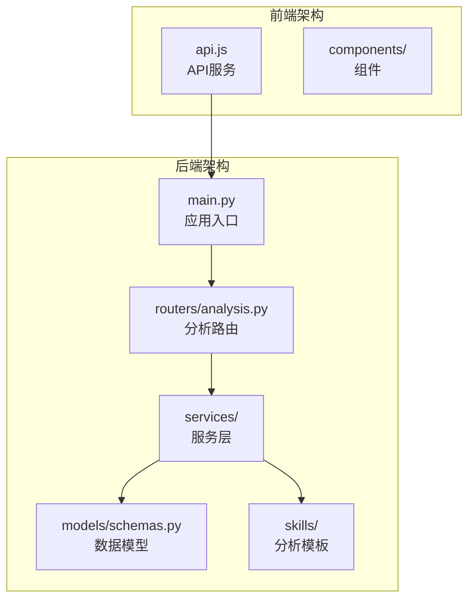

**图表来源**
- [main.py:1-28](file://backend/app/main.py#L1-L28)
- [analysis.py:1-218](file://backend/app/routers/analysis.py#L1-L218)

**章节来源**
- [main.py:1-28](file://backend/app/main.py#L1-L28)
- [analysis.py:1-218](file://backend/app/routers/analysis.py#L1-L218)

## 核心组件

### 任务状态管理机制

系统实现了完整的任务生命周期管理，包含四种状态：

| 状态 | 描述 | 触发条件 |
|------|------|----------|
| pending | 待处理 | 文件上传完成后初始化 |
| analyzing | 分析中 | 调用分析接口开始处理 |
| completed | 已完成 | 分析成功完成，生成报告 |
| failed | 失败 | 分析过程中发生异常 |

### 内存存储策略

系统使用内存字典 `_tasks` 作为任务存储容器：

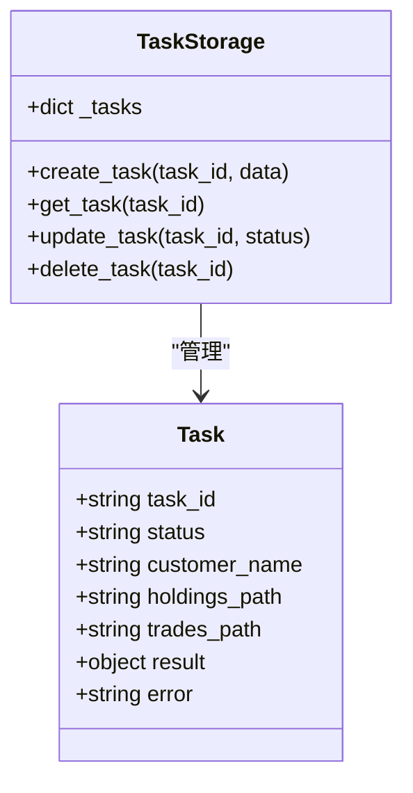

**图表来源**
- [analysis.py:16-17](file://backend/app/routers/analysis.py#L16-L17)
- [analysis.py:66-75](file://backend/app/routers/analysis.py#L66-L75)

**章节来源**
- [analysis.py:16-17](file://backend/app/routers/analysis.py#L16-L17)
- [analysis.py:66-75](file://backend/app/routers/analysis.py#L66-L75)

## 架构概览

系统采用分层架构设计，清晰分离了路由层、服务层和数据层：

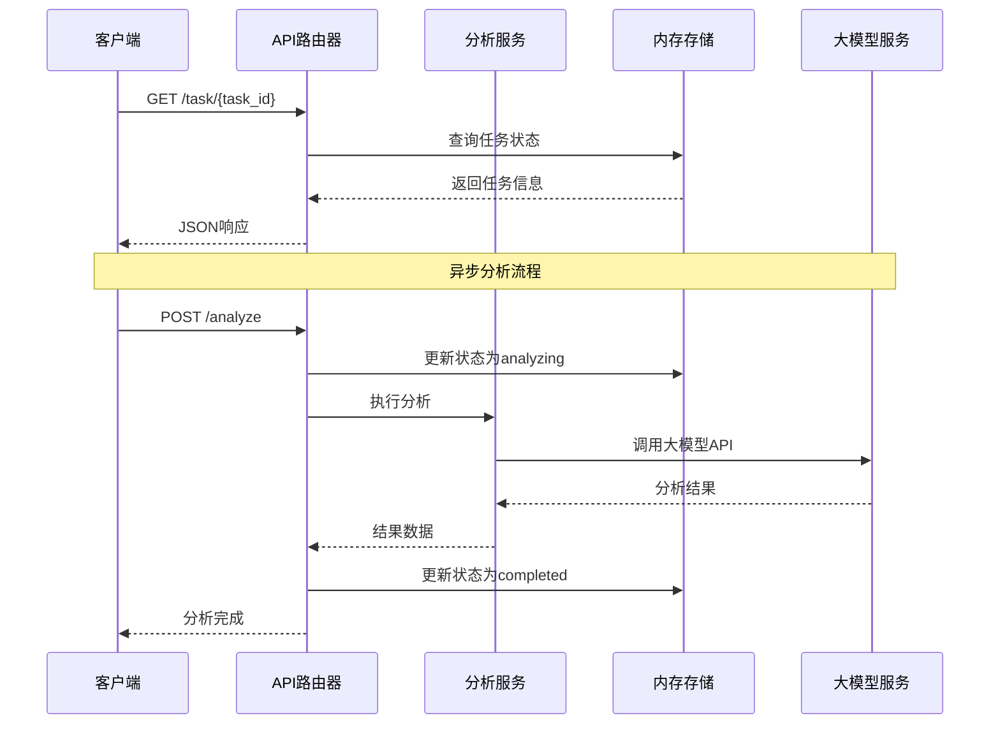

**图表来源**
- [analysis.py:202-217](file://backend/app/routers/analysis.py#L202-L217)
- [analysis.py:86-134](file://backend/app/routers/analysis.py#L86-L134)

**章节来源**
- [analysis.py:202-217](file://backend/app/routers/analysis.py#L202-L217)
- [analysis.py:86-134](file://backend/app/routers/analysis.py#L86-L134)

## 详细组件分析

### 任务状态查询接口

#### 接口定义

**端点**: `GET /api/task/{task_id}`

**功能**: 查询指定任务的当前状态和相关信息

**参数**:
- `task_id` (路径参数): 任务唯一标识符

**响应格式**:

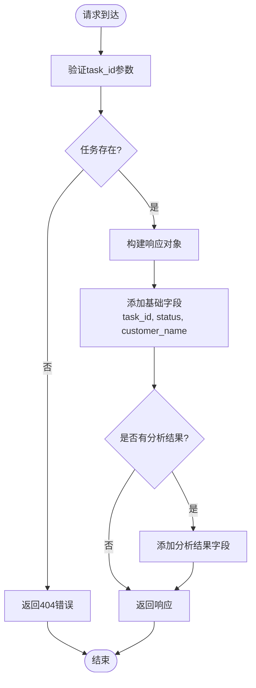

**图表来源**
- [analysis.py:202-217](file://backend/app/routers/analysis.py#L202-L217)

**响应示例**:

成功响应（任务已完成）:
```json
{
  "task_id": "abc123",
  "status": "completed",
  "customer_name": "张三",
  "asset_analysis": "资产配置分析结果...",
  "trade_analysis": "交易行为分析结果...",
  "summary": "综合报告摘要..."
}
```

成功响应（任务进行中）:
```json
{
  "task_id": "abc123",
  "status": "analyzing",
  "customer_name": "张三"
}
```

错误响应:
```json
{
  "detail": "任务不存在"
}
```

**章节来源**
- [analysis.py:202-217](file://backend/app/routers/analysis.py#L202-L217)

### 任务生命周期管理

#### 状态转换图

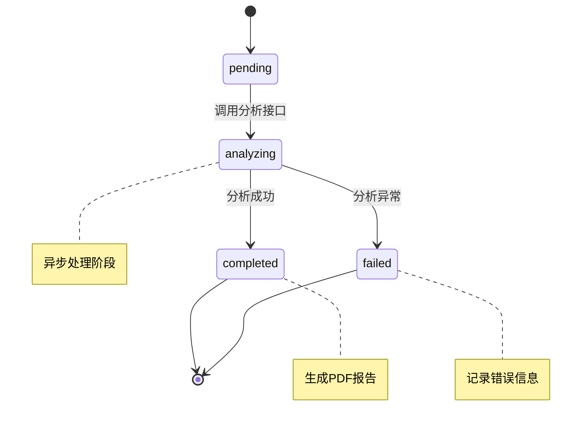

**图表来源**
- [analysis.py:66-75](file://backend/app/routers/analysis.py#L66-L75)
- [analysis.py:96-134](file://backend/app/routers/analysis.py#L96-L134)

#### 状态转换逻辑

1. **初始化阶段** (`pending`)
   - 文件上传完成后创建任务
   - 设置初始状态为 `pending`
   - 存储文件路径和客户信息

2. **分析阶段** (`analyzing`)
   - 用户调用分析接口触发处理
   - 设置状态为 `analyzing`
   - 执行数据分析流程

3. **完成阶段** (`completed`)
   - 分析成功完成
   - 生成PDF报告
   - 存储分析结果

4. **失败阶段** (`failed`)
   - 分析过程中发生异常
   - 记录错误信息
   - 状态保持为 `failed`

**章节来源**
- [analysis.py:66-75](file://backend/app/routers/analysis.py#L66-L75)
- [analysis.py:96-134](file://backend/app/routers/analysis.py#L96-L134)

### 数据模型定义

#### 任务状态枚举

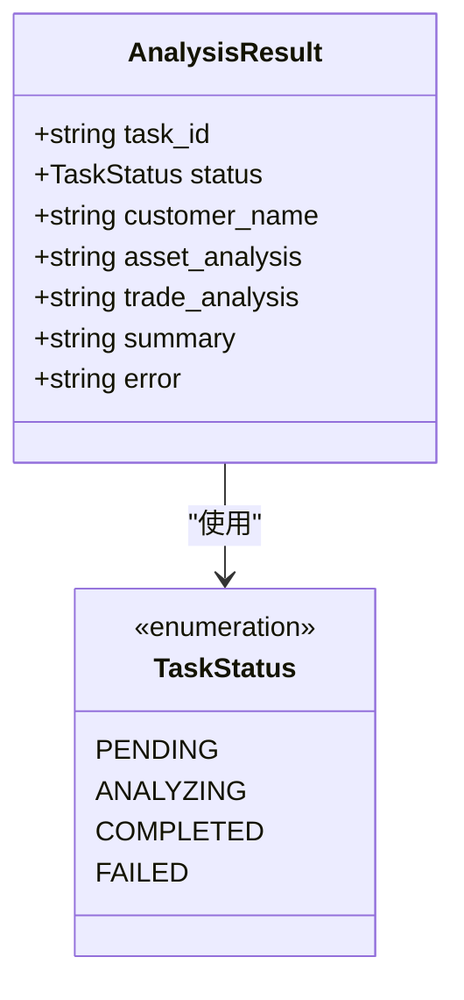

**图表来源**
- [schemas.py:6-11](file://backend/app/models/schemas.py#L6-L11)
- [schemas.py:22-30](file://backend/app/models/schemas.py#L22-L30)

**章节来源**
- [schemas.py:6-11](file://backend/app/models/schemas.py#L6-L11)
- [schemas.py:22-30](file://backend/app/models/schemas.py#L22-L30)

### 分析服务组件

#### 分析引擎架构

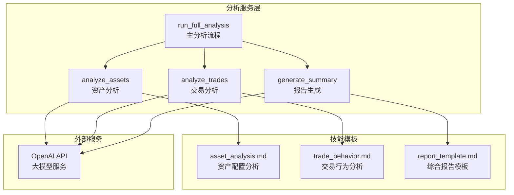

**图表来源**
- [analyzer.py:77-93](file://backend/app/services/analyzer.py#L77-L93)
- [analyzer.py:41-74](file://backend/app/services/analyzer.py#L41-L74)

**章节来源**
- [analyzer.py:77-93](file://backend/app/services/analyzer.py#L77-L93)
- [analyzer.py:41-74](file://backend/app/services/analyzer.py#L41-L74)

## 依赖关系分析

### 后端依赖关系

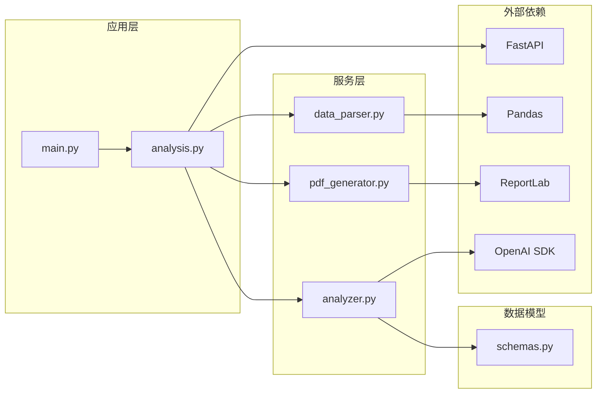

**图表来源**
- [main.py:1-28](file://backend/app/main.py#L1-L28)
- [analysis.py:10-12](file://backend/app/routers/analysis.py#L10-L12)

**章节来源**
- [main.py:1-28](file://backend/app/main.py#L1-L28)
- [analysis.py:10-12](file://backend/app/routers/analysis.py#L10-L12)

### 前后端交互

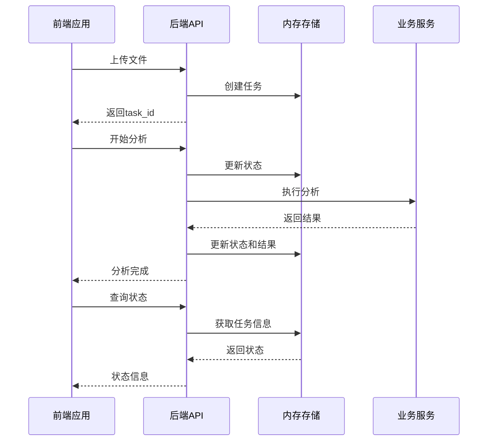

**图表来源**
- [api.js:10-38](file://frontend/src/services/api.js#L10-L38)
- [analysis.py:35-83](file://backend/app/routers/analysis.py#L35-L83)

**章节来源**
- [api.js:10-38](file://frontend/src/services/api.js#L10-L38)
- [analysis.py:35-83](file://backend/app/routers/analysis.py#L35-L83)

## 性能考虑

### 内存存储优化

由于系统使用内存字典存储任务信息，需要注意以下性能考虑：

1. **内存使用监控**: 定期检查 `_tasks` 字典大小，避免内存泄漏
2. **任务过期机制**: 实现自动清理机制，防止长时间占用内存
3. **并发访问控制**: 在多用户场景下考虑线程安全问题

### 异步处理策略

分析过程涉及外部API调用，采用异步处理方式：

- **超时设置**: 分析请求超时时间为5分钟
- **重试机制**: 对网络异常提供重试策略
- **进度反馈**: 提供状态轮询机制让用户了解处理进度

### 缓存策略

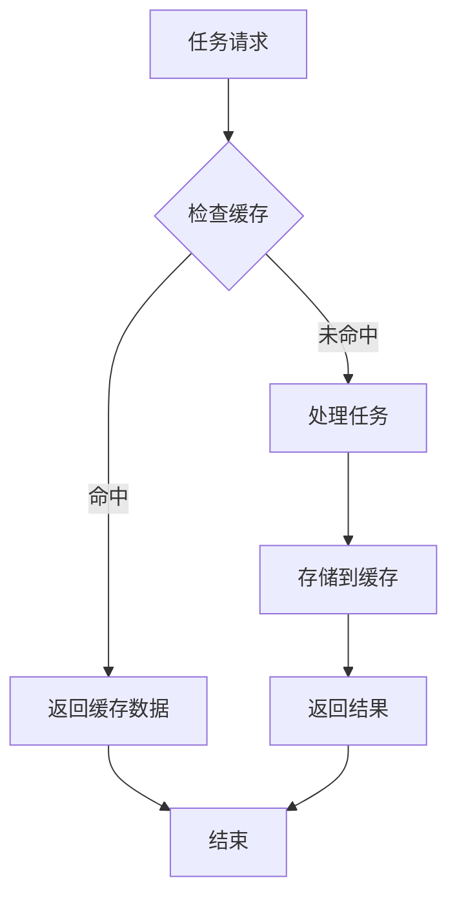

## 故障排除指南

### 常见错误及解决方案

| 错误类型 | 错误码 | 描述 | 解决方案 |
|----------|--------|------|----------|
| 任务不存在 | 404 | 查询的任务ID无效 | 检查任务ID是否正确，确认任务已创建 |
| 分析失败 | 500 | 分析过程中发生异常 | 检查输入数据格式，查看服务器日志 |
| 文件解析失败 | 400 | CSV/Excel文件解析错误 | 确认文件格式正确，字段命名规范 |
| 报告未生成 | 404 | PDF报告尚未生成 | 等待分析完成后再下载报告 |

### 状态轮询最佳实践

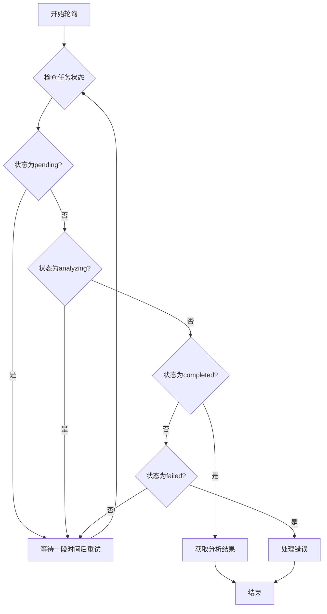

**轮询策略建议**:
1. **指数退避**: 每次等待时间递增（1s, 2s, 4s, 8s...）
2. **最大重试次数**: 设置合理的最大重试限制
3. **超时控制**: 为整个轮询过程设置总超时时间
4. **错误处理**: 对不同状态采取相应的处理策略

### 任务清理机制

当前实现中，系统使用内存存储，没有内置的自动清理机制。建议实现以下清理策略：

1. **基于时间的清理**: 任务完成后保留一定时间（如24小时）
2. **基于数量的清理**: 当任务数量超过阈值时清理最早的任务
3. **手动清理接口**: 提供API接口允许客户端主动清理任务

**章节来源**
- [analysis.py:202-217](file://backend/app/routers/analysis.py#L202-L217)

## 结论

任务状态查询接口为整个资产分析系统提供了完整的状态管理机制。通过内存存储实现的简单可靠的状态跟踪，配合清晰的API设计，为用户提供了直观的任务进度查询体验。

系统的主要优势包括：
- **简洁的API设计**: 清晰的HTTP方法和响应格式
- **完整的状态管理**: 支持四种状态的完整生命周期
- **异步处理能力**: 支持长时间运行的分析任务
- **灵活的扩展性**: 易于添加新的分析功能和状态

未来可以考虑的改进方向：
- 实现持久化存储替代内存存储
- 添加任务过期和清理机制
- 增强错误处理和重试机制
- 提供更丰富的状态查询选项