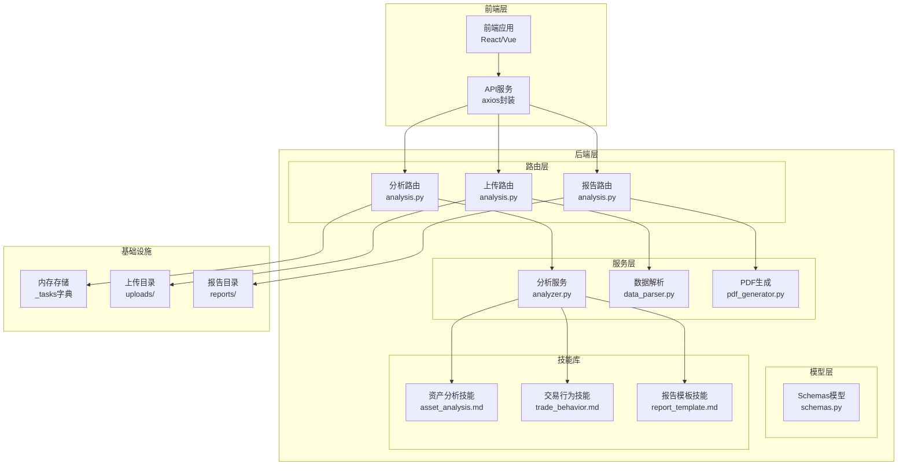
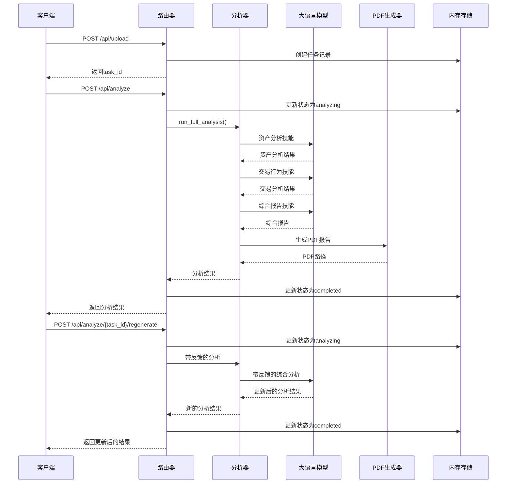
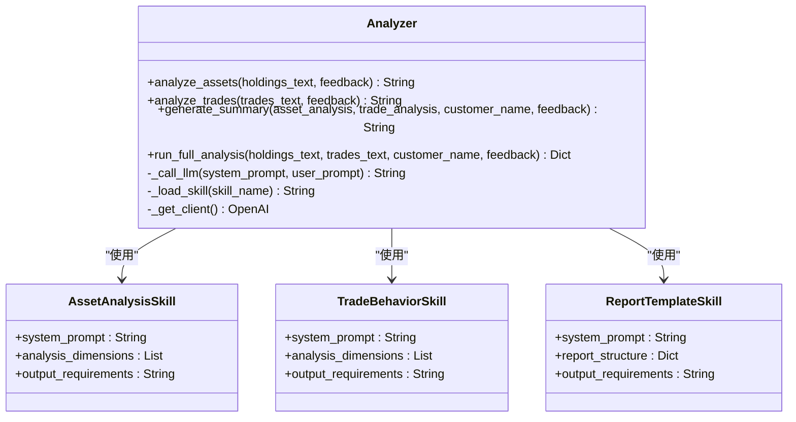
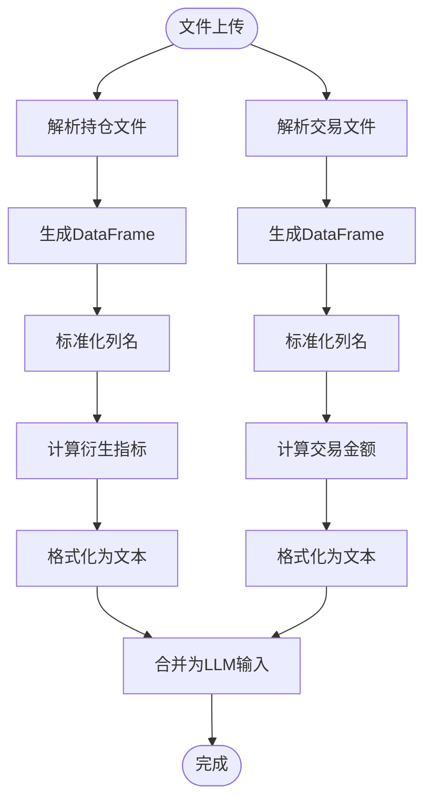
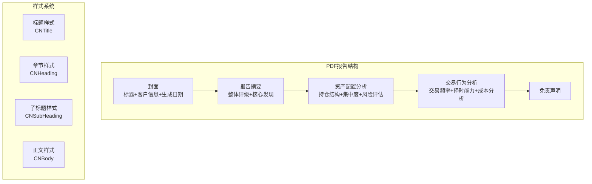
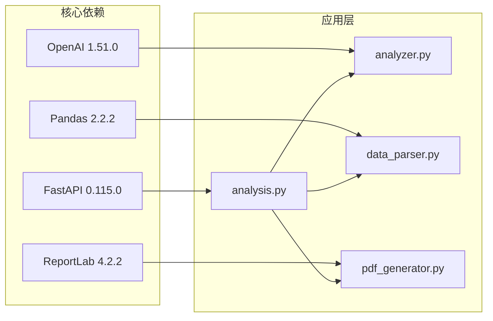

# 分析处理接口

<cite>
**本文档引用的文件**
- [analysis.py](file://backend/app/routers/analysis.py)
- [analyzer.py](file://backend/app/services/analyzer.py)
- [data_parser.py](file://backend/app/services/data_parser.py)
- [pdf_generator.py](file://backend/app/services/pdf_generator.py)
- [schemas.py](file://backend/app/models/schemas.py)
- [main.py](file://backend/app/main.py)
- [asset_analysis.md](file://backend/app/skills/asset_analysis.md)
- [trade_behavior.md](file://backend/app/skills/trade_behavior.md)
- [report_template.md](file://backend/app/skills/report_template.md)
- [api.js](file://frontend/src/services/api.js)
- [requirements.txt](file://backend/requirements.txt)
</cite>

## 目录
1. [简介](#简介)
2. [项目结构](#项目结构)
3. [核心组件](#核心组件)
4. [架构概览](#架构概览)
5. [详细组件分析](#详细组件分析)
6. [依赖分析](#依赖分析)
7. [性能考虑](#性能考虑)
8. [故障排除指南](#故障排除指南)
9. [结论](#结论)
10. [附录](#附录)

## 简介
本文件为分析处理接口的完整API文档，详细记录了两个核心端点：
- `/api/analyze`：触发分析端点，用于启动资产分析流程
- `/api/analyze/{task_id}/regenerate`：反馈重分析端点，用于基于客户反馈重新生成分析结果

该系统采用异步处理模式，通过内存存储管理任务状态，集成了大语言模型(LLM)调用机制，实现了从数据上传、分析处理到PDF报告生成的完整工作流。

## 项目结构
后端采用FastAPI框架构建，采用分层架构设计：



**图表来源**
- [analysis.py:1-218](file://backend/app/routers/analysis.py#L1-L218)
- [analyzer.py:1-93](file://backend/app/services/analyzer.py#L1-L93)
- [data_parser.py:1-96](file://backend/app/services/data_parser.py#L1-L96)
- [pdf_generator.py:1-215](file://backend/app/services/pdf_generator.py#L1-L215)

**章节来源**
- [main.py:1-28](file://backend/app/main.py#L1-L28)
- [requirements.txt:1-9](file://backend/requirements.txt#L1-L9)

## 核心组件
系统包含以下核心组件：

### 1. 任务管理系统
- **内存存储**：使用字典存储任务状态，键为task_id，值包含任务元数据和结果
- **状态管理**：支持pending、analyzing、completed、failed四种状态
- **任务生命周期**：从文件上传到分析完成的完整流程

### 2. LLM集成层
- **OpenAI客户端**：支持自定义base_url，适配不同推理服务
- **多技能调用**：资产分析、交易行为分析、综合报告生成三个核心技能
- **温度参数**：设置为0.7，平衡创造性与准确性

### 3. 数据处理管道
- **文件解析**：支持CSV和Excel格式，自动列名映射
- **数据标准化**：计算衍生指标如市值、盈亏、收益率
- **文本格式化**：将结构化数据转换为LLM友好的文本格式

### 4. 报告生成系统
- **PDF模板**：使用ReportLab生成专业级报告
- **中文字体支持**：自动检测并注册系统字体
- **结构化布局**：封面、摘要、资产分析、交易分析四个主要部分

**章节来源**
- [analysis.py:16-23](file://backend/app/routers/analysis.py#L16-L23)
- [analyzer.py:18-38](file://backend/app/services/analyzer.py#L18-L38)
- [data_parser.py:7-52](file://backend/app/services/data_parser.py#L7-L52)
- [pdf_generator.py:146-215](file://backend/app/services/pdf_generator.py#L146-L215)

## 架构概览
系统采用事件驱动的异步处理架构：



**图表来源**
- [analysis.py:86-135](file://backend/app/routers/analysis.py#L86-L135)
- [analysis.py:155-199](file://backend/app/routers/analysis.py#L155-L199)
- [analyzer.py:77-93](file://backend/app/services/analyzer.py#L77-L93)

## 详细组件分析

### API端点定义

#### 1. 文件上传端点
**端点**：`POST /api/upload`
**功能**：上传持仓和交易数据文件，创建分析任务

**请求参数**：
- `holdings_file` (multipart/form-data, 必填)：持仓数据文件(CSV/Excel)
- `trades_file` (multipart/form-data, 可选)：交易记录文件(CSV/Excel)
- `customer_name` (form-data, 可选)：客户名称，默认"客户"

**响应结构**：
```json
{
  "task_id": "字符串",
  "customer_name": "字符串",
  "holdings_preview": "数组",
  "trades_preview": "数组或null",
  "message": "字符串"
}
```

**章节来源**
- [analysis.py:35-84](file://backend/app/routers/analysis.py#L35-L84)

#### 2. 触发分析端点
**端点**：`POST /api/analyze`
**功能**：启动资产分析流程

**请求参数**：
- `task_id` (form-data, 必填)：任务ID
- `customer_name` (form-data, 可选)：客户名称

**响应结构**：
```json
{
  "task_id": "字符串",
  "status": "completed",
  "asset_analysis": "字符串",
  "trade_analysis": "字符串", 
  "summary": "字符串"
}
```

**章节来源**
- [analysis.py:86-135](file://backend/app/routers/analysis.py#L86-L135)

#### 3. 反馈重分析端点
**端点**：`POST /api/analyze/{task_id}/regenerate`
**功能**：根据客户反馈重新生成分析结果

**路径参数**：
- `task_id` (路径参数, 必填)：任务ID

**请求参数**：
- `feedback` (form-data, 必填)：客户反馈意见

**响应结构**：
```json
{
  "task_id": "字符串",
  "status": "completed",
  "asset_analysis": "字符串",
  "trade_analysis": "字符串",
  "summary": "字符串"
}
```

**章节来源**
- [analysis.py:155-199](file://backend/app/routers/analysis.py#L155-L199)

#### 4. 任务状态查询端点
**端点**：`GET /api/task/{task_id}`
**功能**：查询任务当前状态和结果

**响应结构**：
```json
{
  "task_id": "字符串",
  "status": "字符串",
  "customer_name": "字符串",
  "asset_analysis": "字符串或null",
  "trade_analysis": "字符串或null",
  "summary": "字符串或null",
  "error": "字符串或null"
}
```

**章节来源**
- [analysis.py:202-218](file://backend/app/routers/analysis.py#L202-L218)

### LLM调用机制

#### 技能系统架构
系统采用技能驱动的LLM调用模式：



**图表来源**
- [analyzer.py:41-93](file://backend/app/services/analyzer.py#L41-L93)
- [asset_analysis.md:1-35](file://backend/app/skills/asset_analysis.md#L1-L35)
- [trade_behavior.md:1-34](file://backend/app/skills/trade_behavior.md#L1-L34)
- [report_template.md:1-34](file://backend/app/skills/report_template.md#L1-L34)

#### LLM调用流程
1. **客户端初始化**：从环境变量读取API密钥和基础URL
2. **技能加载**：读取对应技能文件内容作为system prompt
3. **用户提示构建**：将原始数据和可选反馈组合成user prompt
4. **模型调用**：使用chat.completions接口获取响应
5. **结果处理**：返回LLM生成的分析文本

**章节来源**
- [analyzer.py:18-38](file://backend/app/services/analyzer.py#L18-L38)
- [analyzer.py:25-38](file://backend/app/services/analyzer.py#L25-L38)

### 数据处理流程

#### 文件解析组件


**图表来源**
- [data_parser.py:7-52](file://backend/app/services/data_parser.py#L7-L52)
- [data_parser.py:55-95](file://backend/app/services/data_parser.py#L55-L95)

#### 数据标准化规则
- **持仓数据**：支持中文列名自动映射到英文字段
- **衍生指标**：自动计算市值、盈亏、收益率等关键指标
- **交易数据**：统一买卖方向标识，计算交易金额

**章节来源**
- [data_parser.py:14-52](file://backend/app/services/data_parser.py#L14-L52)
- [data_parser.py:62-95](file://backend/app/services/data_parser.py#L62-L95)

### PDF报告生成

#### 报告结构设计


**图表来源**
- [pdf_generator.py:146-215](file://backend/app/services/pdf_generator.py#L146-L215)
- [pdf_generator.py:53-106](file://backend/app/services/pdf_generator.py#L53-L106)

#### 字体支持策略
- **多平台兼容**：支持Windows、Linux、macOS常见中文字体
- **自动检测**：遍历预设路径查找可用字体
- **降级处理**：找不到中文字体时回退到Helvetica

**章节来源**
- [pdf_generator.py:26-51](file://backend/app/services/pdf_generator.py#L26-L51)
- [pdf_generator.py:109-143](file://backend/app/services/pdf_generator.py#L109-L143)

## 依赖分析

### 外部依赖关系


**图表来源**
- [requirements.txt:1-9](file://backend/requirements.txt#L1-L9)
- [main.py:23](file://backend/app/main.py#L23)

### 内部模块依赖
- **analysis.py**：依赖所有服务模块和PDF生成器
- **analyzer.py**：依赖技能文件和OpenAI SDK
- **data_parser.py**：依赖pandas和openpyxl
- **pdf_generator.py**：依赖reportlab和系统字体

**章节来源**
- [requirements.txt:1-9](file://backend/requirements.txt#L1-L9)

## 性能考虑

### 异步处理优势
1. **非阻塞I/O**：文件上传和LLM调用不会阻塞服务器进程
2. **内存存储**：使用字典存储，访问速度快
3. **流式处理**：PDF生成采用流式写入，减少内存占用

### 性能优化建议
1. **并发限制**：在生产环境中添加任务队列和并发控制
2. **缓存策略**：对LLM响应结果进行缓存
3. **资源清理**：定期清理过期的上传文件和生成的报告
4. **超时配置**：根据数据规模调整LLM调用超时时间

### 错误处理机制
- **HTTP状态码**：404表示任务不存在，500表示内部错误
- **异常传播**：捕获异常后更新任务状态并抛出HTTP异常
- **日志记录**：使用traceback打印详细错误信息

## 故障排除指南

### 常见问题及解决方案

#### 1. LLM调用失败
**症状**：分析端点返回500错误
**原因**：OpenAI API密钥配置错误或网络连接问题
**解决方案**：
- 检查环境变量OPENAI_API_KEY
- 验证OPENAI_BASE_URL配置
- 确认网络连接正常

#### 2. 文件解析错误
**症状**：上传端点返回400错误
**原因**：文件格式不支持或列名不匹配
**解决方案**：
- 确保文件为CSV或Excel格式
- 检查列名是否包含中文关键词
- 验证文件编码为UTF-8

#### 3. PDF生成失败
**症状**：报告下载端点返回404错误
**原因**：PDF文件未生成或路径错误
**解决方案**：
- 检查reports目录权限
- 验证PDF生成函数调用
- 确认中文字体安装

#### 4. 任务状态异常
**症状**：任务状态卡在analyzing
**原因**：LLM调用超时或异常中断
**解决方案**：
- 增加超时时间配置
- 检查服务器资源使用情况
- 实现任务重试机制

**章节来源**
- [analysis.py:54-64](file://backend/app/routers/analysis.py#L54-L64)
- [analysis.py:130-134](file://backend/app/routers/analysis.py#L130-L134)

## 结论
本分析处理接口提供了完整的资产分析解决方案，具有以下特点：

1. **完整的功能覆盖**：从数据上传到报告生成的全链路支持
2. **灵活的反馈机制**：支持基于客户反馈的重分析功能
3. **可扩展的架构**：模块化设计便于功能扩展和维护
4. **生产就绪特性**：包含错误处理、状态管理和资源清理

建议在生产环境中：
- 使用持久化存储替代内存存储
- 添加任务队列和重试机制
- 实现API限流和监控
- 配置适当的日志记录和审计功能

## 附录

### 使用示例

#### 前端JavaScript示例
```javascript
// 上传文件
await uploadFiles(holdingsFile, tradesFile, "张三");

// 启动分析
await startAnalysis("任务ID", "张三");

// 获取PDF下载链接
const pdfUrl = getPdfDownloadUrl("任务ID");

// 查询任务状态
await getTaskStatus("任务ID");
```

**章节来源**
- [api.js:10-45](file://frontend/src/services/api.js#L10-L45)

### 最佳实践指南

#### 1. 数据准备
- 确保CSV文件使用UTF-8编码
- Excel文件包含必要的列头信息
- 数据质量检查：缺失值、异常值处理

#### 2. API调用
- 设置合适的超时时间（建议300秒）
- 实现重试机制（指数退避）
- 并发请求控制（避免服务器过载）

#### 3. 错误处理
- 捕获HTTP状态码异常
- 实现优雅降级策略
- 记录详细的错误日志

#### 4. 性能优化
- 批量处理小文件
- 缓存LLM调用结果
- 实现资源池化管理