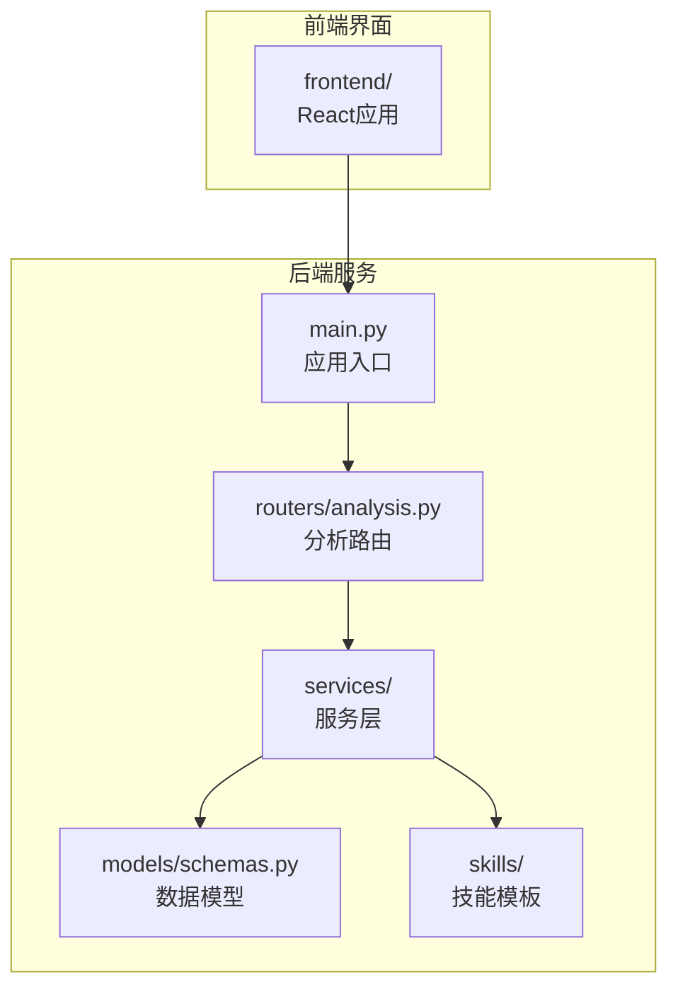
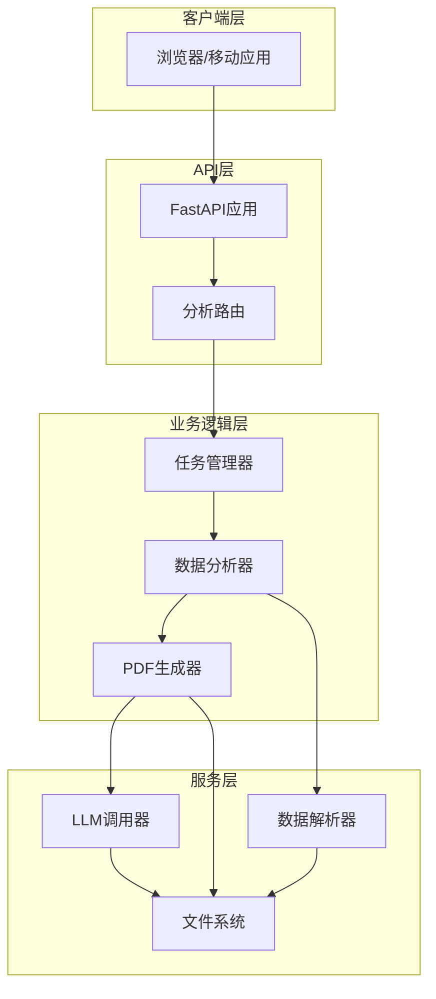
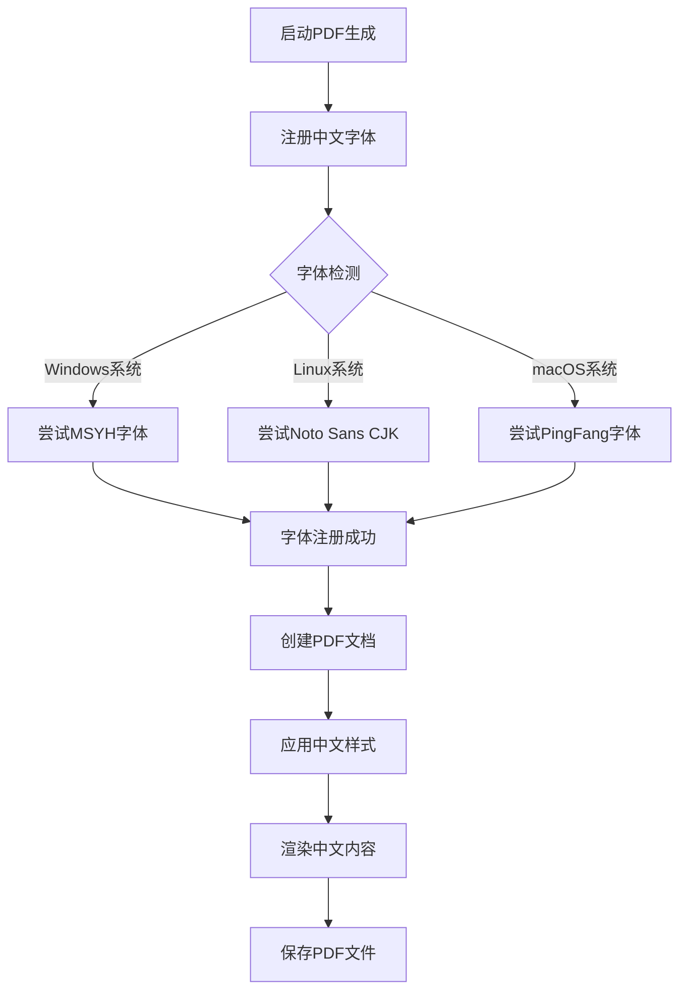
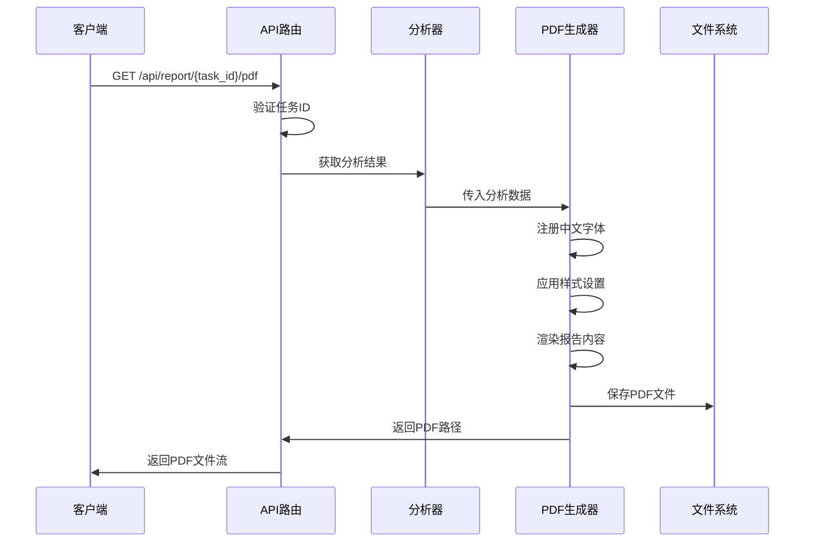
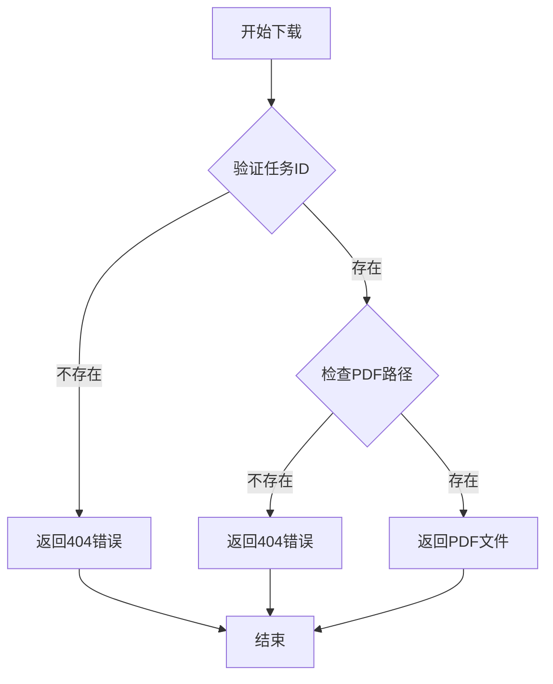
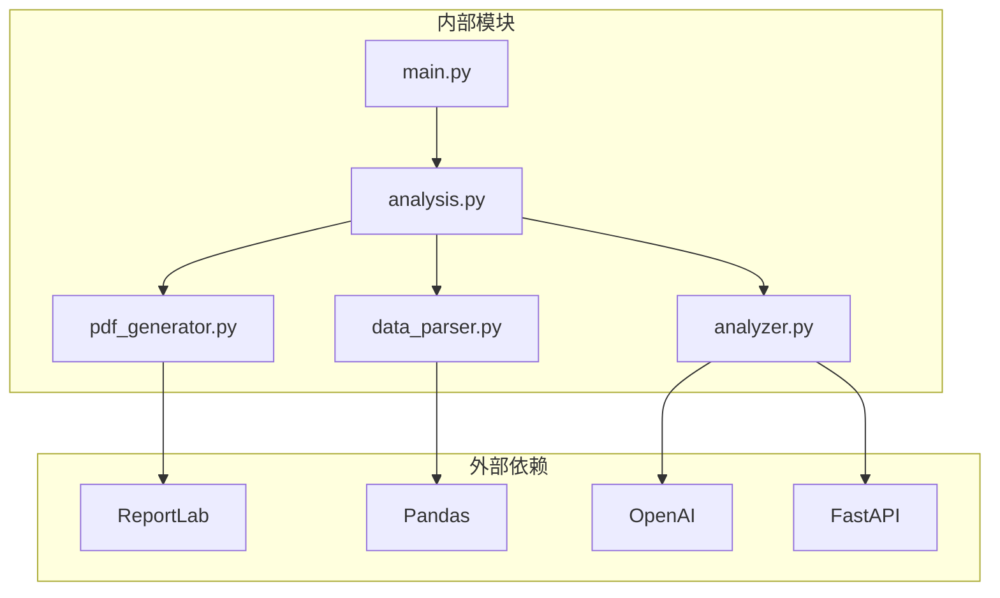

# 报告下载接口

<cite>
**本文档引用的文件**
- [main.py](file://backend/app/main.py)
- [analysis.py](file://backend/app/routers/analysis.py)
- [pdf_generator.py](file://backend/app/services/pdf_generator.py)
- [analyzer.py](file://backend/app/services/analyzer.py)
- [data_parser.py](file://backend/app/services/data_parser.py)
- [schemas.py](file://backend/app/models/schemas.py)
- [report_template.md](file://backend/app/skills/report_template.md)
- [requirements.txt](file://backend/requirements.txt)
</cite>

## 目录
1. [简介](#简介)
2. [项目结构](#项目结构)
3. [核心组件](#核心组件)
4. [架构概览](#架构概览)
5. [详细组件分析](#详细组件分析)
6. [依赖关系分析](#依赖关系分析)
7. [性能考虑](#性能考虑)
8. [故障排除指南](#故障排除指南)
9. [结论](#结论)

## 简介

本文件详细说明了PDF报告下载接口的API文档，重点关注`/api/report/{task_id}/pdf`端点的使用方法。该接口允许用户下载已生成的客户资产分析报告，支持中文内容渲染和多种文件格式。

## 项目结构

该项目采用FastAPI框架构建的Web服务，包含后端API服务和前端界面。后端服务提供了完整的数据分析和报告生成功能。



**图表来源**
- [main.py:1-28](file://backend/app/main.py#L1-L28)
- [analysis.py:1-218](file://backend/app/routers/analysis.py#L1-L218)

**章节来源**
- [main.py:1-28](file://backend/app/main.py#L1-L28)
- [analysis.py:1-218](file://backend/app/routers/analysis.py#L1-L218)

## 核心组件

### API路由组件

系统的核心路由组件位于`analysis.py`文件中，包含了完整的分析工作流：

- **文件上传路由** (`/api/upload`): 处理CSV和Excel格式的持仓和交易数据文件上传
- **分析触发路由** (`/api/analyze`): 触发完整的数据分析流程
- **PDF下载路由** (`/api/report/{task_id}/pdf`): 下载生成的PDF报告
- **任务状态查询** (`/api/task/{task_id}`): 查询分析任务状态

### PDF生成组件

PDF生成服务位于`pdf_generator.py`文件中，提供了完整的中文支持和报告格式化功能：

- **中文字体注册**: 自动检测并注册系统中的中文字体
- **报告样式定义**: 定义了标题、副标题、正文等样式的中文字体支持
- **Markdown渲染**: 支持基本的Markdown语法渲染到PDF
- **多页面布局**: 支持报告的分页和页面布局

**章节来源**
- [analysis.py:137-152](file://backend/app/routers/analysis.py#L137-L152)
- [pdf_generator.py:146-215](file://backend/app/services/pdf_generator.py#L146-L215)

## 架构概览

系统采用分层架构设计，从上到下分别为API层、业务逻辑层和服务层。



**图表来源**
- [main.py:8-23](file://backend/app/main.py#L8-L23)
- [analysis.py:16-22](file://backend/app/routers/analysis.py#L16-L22)

## 详细组件分析

### PDF下载接口详解

#### 接口定义

**HTTP方法**: GET  
**端点**: `/api/report/{task_id}/pdf`  
**描述**: 下载指定任务ID的PDF报告文件

#### 请求参数

| 参数 | 类型 | 必填 | 描述 |
|------|------|------|------|
| task_id | string | 是 | 分析任务的唯一标识符 |

#### 响应格式

**成功响应**:
- **状态码**: 200 OK
- **内容类型**: application/pdf
- **响应体**: PDF文件流
- **文件名**: `资产分析报告_{客户名}_{任务ID}.pdf`

**错误响应**:
- **状态码**: 404 Not Found
- **原因**: 任务不存在或报告尚未生成

#### 文件命名规则

PDF文件采用统一的命名模式：
```
资产分析报告_{客户名}_{任务ID}.pdf
```

例如：`资产分析报告_张三_a1b2c3d4.pdf`

#### 中文支持特性

PDF生成器实现了完整的中文支持：



**图表来源**
- [pdf_generator.py:26-51](file://backend/app/services/pdf_generator.py#L26-L51)

**章节来源**
- [analysis.py:137-152](file://backend/app/routers/analysis.py#L137-L152)
- [pdf_generator.py:146-215](file://backend/app/services/pdf_generator.py#L146-L215)

### 报告内容结构

PDF报告包含三个主要分析部分：

#### 1. 综合报告总结
- 客户整体资产状况概述
- 主要发现摘要
- 整体评级（优秀/良好/一般/需关注）

#### 2. 资产配置分析
- 资产配置的核心发现
- 需要关注的配置问题
- 投资组合优化建议

#### 3. 交易行为分析
- 交易行为的核心发现
- 需要改善的交易习惯
- 交易策略优化建议

#### 4. 综合建议
- 3-5条最重要的行动建议
- 按优先级排序的具体建议
- 短期（1个月内）和中期（3-6个月）建议

#### 5. 风险提示
- 当前组合面临的主要风险
- 风险应对建议

**章节来源**
- [report_template.md:1-34](file://backend/app/skills/report_template.md#L1-L34)

### PDF生成流程



**图表来源**
- [analysis.py:108-120](file://backend/app/routers/analysis.py#L108-L120)
- [pdf_generator.py:146-215](file://backend/app/services/pdf_generator.py#L146-L215)

**章节来源**
- [analysis.py:86-135](file://backend/app/routers/analysis.py#L86-L135)
- [pdf_generator.py:146-215](file://backend/app/services/pdf_generator.py#L146-L215)

### 错误处理机制

系统实现了完善的错误处理机制：

#### 状态检查
- **任务不存在**: 返回404状态码
- **报告未生成**: 返回404状态码
- **分析失败**: 返回500状态码

#### 异常处理流程



**图表来源**
- [analysis.py:140-146](file://backend/app/routers/analysis.py#L140-L146)

**章节来源**
- [analysis.py:140-146](file://backend/app/routers/analysis.py#L140-L146)

### 文件缓存策略

系统采用内存存储策略管理分析任务：

#### 内存存储结构
```python
_tasks = {
    task_id: {
        "task_id": str,
        "customer_name": str,
        "status": enum,
        "holdings_path": str,
        "trades_path": str,
        "holdings_text": str,
        "trades_text": str,
        "result": dict,
        "pdf_path": str
    }
}
```

#### 存储位置
- **上传文件**: `backend/app/uploads/`
- **报告文件**: `backend/app/reports/`

#### 缓存清理机制
系统使用内存字典存储任务状态，进程重启时会丢失所有缓存数据。生产环境中建议实现持久化存储。

**章节来源**
- [analysis.py:16-22](file://backend/app/routers/analysis.py#L16-L22)

## 依赖关系分析

系统依赖关系清晰，各组件职责明确：



**图表来源**
- [requirements.txt:1-9](file://backend/requirements.txt#L1-L9)
- [main.py:6](file://backend/app/main.py#L6)

**章节来源**
- [requirements.txt:1-9](file://backend/requirements.txt#L1-L9)
- [main.py:6](file://backend/app/main.py#L6)

## 性能考虑

### 字体加载优化
- 中文字体注册仅执行一次，使用全局标志位避免重复注册
- 支持多种字体路径，提高兼容性

### 内存管理
- 使用内存字典存储任务状态，避免数据库依赖
- PDF文件生成完成后保持在磁盘，便于重复访问

### 并发处理
- FastAPI基于异步IO，支持高并发请求
- PDF生成过程可能阻塞，建议在生产环境使用队列系统

## 故障排除指南

### 常见问题及解决方案

#### 1. PDF文件无法下载
**症状**: 返回404状态码  
**可能原因**:
- 任务ID不存在
- 分析尚未完成
- PDF文件生成失败

**解决步骤**:
1. 使用`/api/task/{task_id}`检查任务状态
2. 确认分析已完成
3. 检查服务器日志

#### 2. 中文显示异常
**症状**: PDF中文字体显示为方块  
**可能原因**:
- 系统缺少中文字体
- 字体路径配置错误

**解决步骤**:
1. 确认系统安装了中文字体
2. 检查字体注册函数是否正常执行
3. 手动指定字体路径

#### 3. 报告内容为空
**症状**: PDF生成但内容缺失  
**可能原因**:
- 数据解析失败
- LLM调用失败
- 文件权限问题

**解决步骤**:
1. 检查输入文件格式
2. 验证OpenAI API配置
3. 检查文件写入权限

**章节来源**
- [analysis.py:140-146](file://backend/app/routers/analysis.py#L140-L146)
- [pdf_generator.py:26-51](file://backend/app/services/pdf_generator.py#L26-L51)

## 结论

PDF报告下载接口提供了完整的客户资产分析报告生成功能，具有以下特点：

1. **完整的中文支持**: 自动检测和注册中文字体，确保中文内容正确显示
2. **灵活的报告结构**: 支持资产配置分析、交易行为分析和综合报告
3. **可靠的错误处理**: 完善的状态检查和异常处理机制
4. **简洁的API设计**: 直观的RESTful接口设计，易于集成

建议在生产环境中：
- 实现持久化存储替代内存字典
- 添加PDF文件清理机制
- 配置适当的并发限制
- 设置监控和日志记录