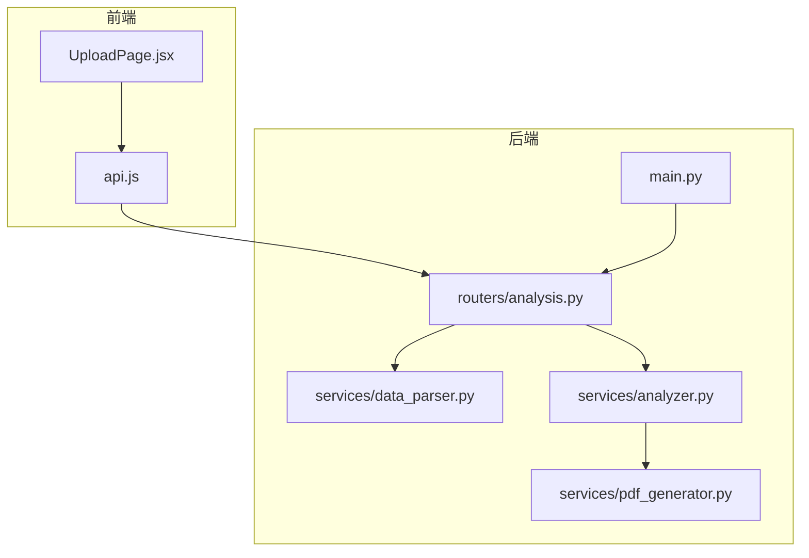
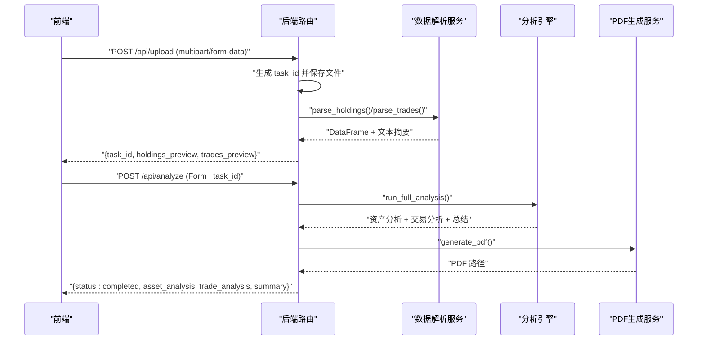
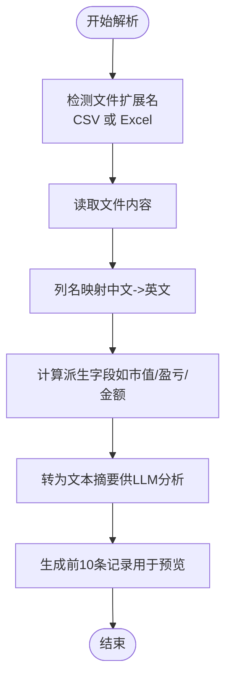
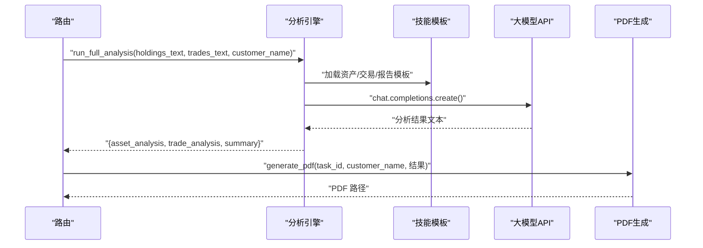
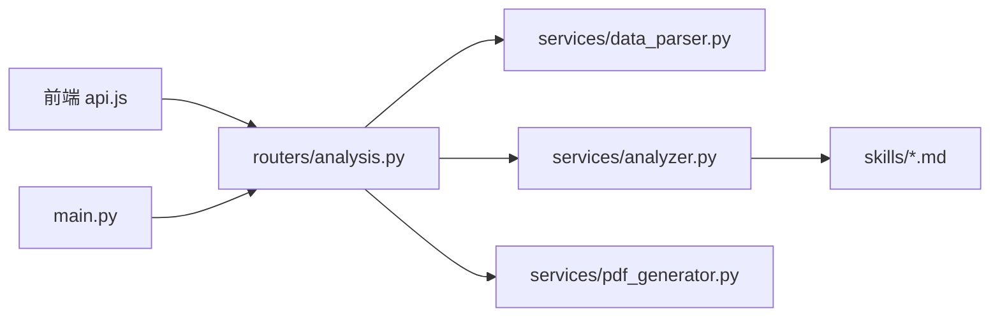

# 文件上传接口

<cite>
**本文引用的文件列表**
- [main.py](file://backend/app/main.py)
- [analysis.py](file://backend/app/routers/analysis.py)
- [data_parser.py](file://backend/app/services/data_parser.py)
- [analyzer.py](file://backend/app/services/analyzer.py)
- [pdf_generator.py](file://backend/app/services/pdf_generator.py)
- [UploadPage.jsx](file://frontend/src/components/UploadPage.jsx)
- [api.js](file://frontend/src/services/api.js)
- [asset_analysis.md](file://backend/app/skills/asset_analysis.md)
- [trade_behavior.md](file://backend/app/skills/trade_behavior.md)
- [report_template.md](file://backend/app/skills/report_template.md)
</cite>

## 目录
1. [简介](#简介)
2. [项目结构](#项目结构)
3. [核心组件](#核心组件)
4. [架构总览](#架构总览)
5. [详细组件分析](#详细组件分析)
6. [依赖关系分析](#依赖关系分析)
7. [性能考量](#性能考量)
8. [故障排查指南](#故障排查指南)
9. [结论](#结论)
10. [附录](#附录)

## 简介
本文件上传接口用于接收客户资产分析所需的持仓文件与交易文件，支持 CSV 与 Excel 格式，通过 multipart/form-data 形式提交。接口会生成任务 ID，保存上传文件，并对文件进行预览解析；随后可触发分析流程生成 PDF 报告。本文档详细说明了 /upload 端点的使用方法、参数规范、文件要求、错误处理、存储路径与命名规则，以及生产环境的安全注意事项。

## 项目结构
后端采用 FastAPI 构建，前端基于 React + Ant Design，二者通过 REST 接口交互。关键目录与文件如下：
- 后端主入口与静态资源挂载：backend/app/main.py
- 分析路由与任务管理：backend/app/routers/analysis.py
- 数据解析服务：backend/app/services/data_parser.py
- 大模型分析引擎：backend/app/services/analyzer.py
- PDF 报告生成：backend/app/services/pdf_generator.py
- 前端上传页面与 API 封装：frontend/src/components/UploadPage.jsx、frontend/src/services/api.js
- 技能模板：backend/app/skills/*.md

图表来源
- [main.py:1-28](file://backend/app/main.py#L1-L28)
- [analysis.py:1-218](file://backend/app/routers/analysis.py#L1-L218)
- [data_parser.py:1-96](file://backend/app/services/data_parser.py#L1-L96)
- [analyzer.py:1-93](file://backend/app/services/analyzer.py#L1-L93)
- [pdf_generator.py:1-215](file://backend/app/services/pdf_generator.py#L1-L215)

章节来源
- [main.py:1-28](file://backend/app/main.py#L1-L28)
- [analysis.py:1-218](file://backend/app/routers/analysis.py#L1-L218)

## 核心组件
- 上传路由与任务管理：负责接收 multipart/form-data，生成任务 ID，保存文件，预览解析，维护内存任务表。
- 数据解析服务：支持 CSV/Excel，自动列名映射与派生字段计算，输出 DataFrame 与文本供分析。
- 分析引擎：加载技能模板，调用大模型 API，产出资产配置分析、交易行为分析与综合报告。
- PDF 生成：将 Markdown 结果渲染为 PDF，包含封面、分节与免责声明。
- 前端上传组件：提供拖拽上传、格式校验、预览展示与错误提示。

章节来源
- [analysis.py:35-84](file://backend/app/routers/analysis.py#L35-L84)
- [data_parser.py:7-96](file://backend/app/services/data_parser.py#L7-L96)
- [analyzer.py:41-93](file://backend/app/services/analyzer.py#L41-L93)
- [pdf_generator.py:146-215](file://backend/app/services/pdf_generator.py#L146-L215)
- [UploadPage.jsx:13-145](file://frontend/src/components/UploadPage.jsx#L13-L145)
- [api.js:10-19](file://frontend/src/services/api.js#L10-L19)

## 架构总览
下图展示了从前端上传到后端解析、分析与生成 PDF 的完整流程。

图表来源
- [analysis.py:35-84](file://backend/app/routers/analysis.py#L35-L84)
- [analysis.py:86-135](file://backend/app/routers/analysis.py#L86-L135)
- [data_parser.py:7-96](file://backend/app/services/data_parser.py#L7-L96)
- [analyzer.py:77-93](file://backend/app/services/analyzer.py#L77-L93)
- [pdf_generator.py:146-215](file://backend/app/services/pdf_generator.py#L146-L215)

## 详细组件分析

### /upload 端点（POST）
- 功能：接收持仓文件与可选交易文件，生成任务 ID，保存文件，进行预览解析，返回任务信息。
- 请求方式：POST
- Content-Type：multipart/form-data
- 参数说明：
  - holdings_file：必填，CSV 或 Excel 格式，作为持仓数据源。
  - trades_file：可选，CSV 或 Excel 格式，作为交易记录源。
  - customer_name：可选字符串，默认“客户”，用于报告标题与后续分析。
- 返回结构：
  - task_id：字符串，8位 UUID 前缀，用于后续分析与状态查询。
  - customer_name：实际使用的客户名称。
  - holdings_preview：持仓数据前10条记录的字典数组，用于前端预览。
  - trades_preview：交易数据前10条记录的字典数组（若提供），否则为 null。
  - message：提示信息，告知用户下一步调用分析接口。
- 错误处理：
  - 持仓文件解析失败：返回 400，包含错误详情。
  - 交易文件解析失败：返回 400，包含错误详情。
  - 未提供持仓文件：前端逻辑会阻止上传，后端参数校验确保必填。
- 文件大小限制：当前实现未设置显式大小限制，建议在生产环境通过 Web 服务器或中间件增加限制。
- 字段验证规则：
  - 持仓文件：支持中文列名模糊匹配，自动重命名为英文列名；若缺少派生字段（如市值、浮动盈亏、盈亏比例），将自动计算。
  - 交易文件：支持中文列名模糊匹配，自动重命名为英文列名；若缺少成交金额，将自动计算。
- 存储路径与命名规则：
  - 上传目录：backend/app/uploads
  - 命名规则：task_id_前缀.扩展名，其中前缀为 holdings 或 trades，扩展名来自原始文件名。
  - 报告目录：backend/app/reports，PDF 生成路径为 report_task_id.pdf。
- 安全考虑（生产环境）：
  - 限制文件类型与大小，仅允许 CSV/Excel。
  - 对文件内容进行白名单字段检查与长度限制。
  - 生成随机文件名，避免路径穿越与冲突。
  - 限制上传目录权限，定期清理过期文件。
  - 在网关层启用速率限制与最大并发限制。
  - 使用 HTTPS 传输，防止中间人攻击。
  - 对任务表进行持久化（当前为内存存储，生产需替换为数据库）。

章节来源
- [analysis.py:35-84](file://backend/app/routers/analysis.py#L35-L84)
- [analysis.py:25-32](file://backend/app/routers/analysis.py#L25-L32)
- [main.py:18-21](file://backend/app/main.py#L18-L21)
- [data_parser.py:7-52](file://backend/app/services/data_parser.py#L7-L52)
- [data_parser.py:55-96](file://backend/app/services/data_parser.py#L55-L96)
- [pdf_generator.py:146-156](file://backend/app/services/pdf_generator.py#L146-L156)

### 数据解析流程（预览）
- 持仓文件解析：
  - 自动识别 CSV/Excel，读取后进行列名映射，缺失派生字段自动计算。
  - 输出 DataFrame 与文本摘要，供前端预览与大模型分析。
- 交易文件解析：
  - 自动识别 CSV/Excel，读取后进行列名映射，缺失成交金额自动计算。
  - 输出 DataFrame 与文本摘要，供前端预览与大模型分析。

图表来源
- [data_parser.py:7-52](file://backend/app/services/data_parser.py#L7-L52)
- [data_parser.py:55-96](file://backend/app/services/data_parser.py#L55-L96)

章节来源
- [data_parser.py:7-96](file://backend/app/services/data_parser.py#L7-L96)

### 分析引擎与报告生成
- 分析流程：
  - 加载技能模板（资产配置分析、交易行为分析、综合报告模板）。
  - 调用大模型 API，传入格式化后的文本与可选反馈。
  - 返回三部分结果：资产分析、交易分析、综合总结。
- PDF 生成：
  - 将 Markdown 内容渲染为 PDF，包含封面、分节与免责声明。
  - 输出文件路径用于后续下载。

图表来源
- [analyzer.py:77-93](file://backend/app/services/analyzer.py#L77-L93)
- [analyzer.py:18-38](file://backend/app/services/analyzer.py#L18-L38)
- [pdf_generator.py:146-215](file://backend/app/services/pdf_generator.py#L146-L215)

章节来源
- [analyzer.py:11-38](file://backend/app/services/analyzer.py#L11-L38)
- [analyzer.py:77-93](file://backend/app/services/analyzer.py#L77-L93)
- [pdf_generator.py:146-215](file://backend/app/services/pdf_generator.py#L146-L215)

### 前端集成与使用
- 上传页面：
  - 支持拖拽上传，限制文件类型为 CSV/Excel，最多各一张。
  - 提供客户名称输入框，用于报告标题。
  - 上传成功后展示持仓与交易预览表格。
- API 调用：
  - 通过 FormData 上传，参数名为 holdings_file、trades_file、customer_name。
  - 成功后返回 task_id，前端可继续调用分析接口。

章节来源
- [UploadPage.jsx:40-58](file://frontend/src/components/UploadPage.jsx#L40-L58)
- [UploadPage.jsx:20-38](file://frontend/src/components/UploadPage.jsx#L20-L38)
- [api.js:10-19](file://frontend/src/services/api.js#L10-L19)

## 依赖关系分析
- 后端模块耦合：
  - 路由层依赖解析服务与分析引擎；分析引擎依赖技能模板；PDF 生成依赖分析结果。
  - 上传目录与报告目录在主入口统一初始化。
- 前后端交互：
  - 前端通过 axios 发送 multipart/form-data，后端返回 JSON；PDF 下载通过 FileResponse 返回文件。

图表来源
- [main.py:18-21](file://backend/app/main.py#L18-L21)
- [analysis.py:10-12](file://backend/app/routers/analysis.py#L10-L12)
- [analyzer.py:8](file://backend/app/services/analyzer.py#L8)
- [pdf_generator.py:146-156](file://backend/app/services/pdf_generator.py#L146-L156)

章节来源
- [main.py:18-21](file://backend/app/main.py#L18-L21)
- [analysis.py:10-12](file://backend/app/routers/analysis.py#L10-L12)

## 性能考量
- 文件解析：CSV/Excel 读取与列名映射、派生字段计算在单次请求内完成，建议对大文件进行拆分或分批处理。
- 大模型调用：分析过程依赖外部 API，建议设置超时与重试策略，避免阻塞请求。
- PDF 生成：ReportLab 渲染 Markdown 为 PDF，建议在后台异步生成并缓存，前端轮询任务状态。
- 并发与限流：生产环境应在网关层限制并发与请求大小，避免资源耗尽。

## 故障排查指南
- 常见错误与处理：
  - 400：持仓/交易文件解析失败。检查文件格式与列名是否符合预期，确认编码与分隔符正确。
  - 404：任务不存在。确认 task_id 是否正确，是否已完成上传与分析。
  - 500：分析失败。查看后端异常堆栈，检查大模型 API 可用性与环境变量配置。
- 前端提示：
  - 未选择持仓文件时禁止上传。
  - 上传失败时显示具体错误详情，便于定位问题。
- 生产环境建议：
  - 增加文件大小限制与类型白名单。
  - 对上传目录进行权限控制与定期清理。
  - 使用数据库替代内存任务表，确保任务状态持久化。

章节来源
- [analysis.py:54-64](file://backend/app/routers/analysis.py#L54-L64)
- [analysis.py:90-91](file://backend/app/routers/analysis.py#L90-L91)
- [analysis.py:130-134](file://backend/app/routers/analysis.py#L130-L134)
- [UploadPage.jsx:20-38](file://frontend/src/components/UploadPage.jsx#L20-L38)

## 结论
该文件上传接口提供了从文件上传、预览解析到分析与报告生成的完整链路。通过明确的参数规范、清晰的错误处理与可扩展的分析引擎，能够满足客户资产分析场景的需求。生产环境中需重点关注文件安全、并发控制与任务持久化，以确保系统稳定与数据安全。

## 附录

### /upload 端点请求与响应示例
- 请求示例（multipart/form-data）：
  - 表单字段：
    - holdings_file：必填，CSV/Excel
    - trades_file：可选，CSV/Excel
    - customer_name：可选，默认“客户”
- 成功响应示例：
  - task_id：字符串（8位 UUID 前缀）
  - customer_name：字符串
  - holdings_preview：前10条记录的字典数组
  - trades_preview：前10条记录的字典数组（若提供）
  - message：提示信息

章节来源
- [analysis.py:35-84](file://backend/app/routers/analysis.py#L35-L84)
- [api.js:10-19](file://frontend/src/services/api.js#L10-L19)

### 文件字段映射与派生规则
- 持仓文件（列名模糊匹配）：
  - 证券名称 → name
  - 证券代码 → code
  - 持仓数量 → quantity
  - 成本价 → cost_price
  - 现价 → current_price
  - 市值 → market_value（若缺失则 quantity × current_price）
  - 资产类别 → asset_type
  - 行业 → industry
  - 浮动盈亏 → pnl（若缺失则 quantity × (current_price − cost_price)）
  - 盈亏比例 → pnl_ratio（若缺失则 ((current_price − cost_price)/cost_price × 100）并保留两位小数）
- 交易文件（列名模糊匹配）：
  - 证券名称 → name
  - 证券代码 → code
  - 交易方向/买卖方向 → direction
  - 交易数量/成交数量 → quantity
  - 成交价格/交易价格 → price
  - 成交金额/交易金额 → amount（若缺失则 quantity × price）
  - 交易时间/成交时间/交易日期 → trade_time
  - 手续费 → commission

章节来源
- [data_parser.py:14-44](file://backend/app/services/data_parser.py#L14-L44)
- [data_parser.py:62-90](file://backend/app/services/data_parser.py#L62-L90)

### 技能模板简述
- 资产配置分析模板：指导如何从持仓结构、集中度、风险敞口与收益归因四个维度进行分析。
- 交易行为分析模板：指导如何从交易频率、择时能力、止盈止损习惯与交易成本四个维度进行分析。
- 综合报告模板：指导如何生成包含概览、要点、建议与风险提示的结构化报告。

章节来源
- [asset_analysis.md:1-35](file://backend/app/skills/asset_analysis.md#L1-L35)
- [trade_behavior.md:1-34](file://backend/app/skills/trade_behavior.md#L1-L34)
- [report_template.md:1-34](file://backend/app/skills/report_template.md#L1-L34)