# API服务模块

<cite>
**本文档引用的文件**
- [api.js](file://frontend/src/services/api.js)
- [UploadPage.jsx](file://frontend/src/components/UploadPage.jsx)
- [ResultPage.jsx](file://frontend/src/components/ResultPage.jsx)
- [analysis.py](file://backend/app/routers/analysis.py)
- [main.py](file://backend/app/main.py)
- [analyzer.py](file://backend/app/services/analyzer.py)
- [data_parser.py](file://backend/app/services/data_parser.py)
- [pdf_generator.py](file://backend/app/services/pdf_generator.py)
- [package.json](file://frontend/package.json)
</cite>

## 目录
1. [简介](#简介)
2. [项目结构](#项目结构)
3. [核心组件](#核心组件)
4. [架构概览](#架构概览)
5. [详细组件分析](#详细组件分析)
6. [依赖关系分析](#依赖关系分析)
7. [性能考虑](#性能考虑)
8. [故障排除指南](#故障排除指南)
9. [最佳实践](#最佳实践)
10. [结论](#结论)

## 简介

Qoder-todo是一个基于React前端和FastAPI后端的客户资产分析工具。该API服务模块负责处理文件上传、数据分析触发、状态查询和报告下载等核心功能。系统采用前后端分离架构，前端使用React + Ant Design构建用户界面，后端使用FastAPI提供RESTful API服务。

该模块实现了完整的金融数据分析工作流，从CSV/Excel文件上传解析，到AI驱动的资产配置分析和交易行为分析，最终生成专业的PDF报告。整个过程通过异步API调用实现，支持用户反馈驱动的报告重生成功能。

## 项目结构

项目采用标准的前后端分离架构，主要目录结构如下：

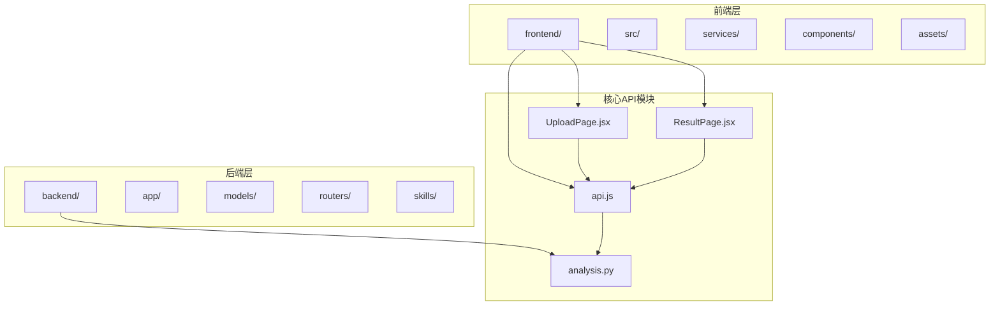

**图表来源**
- [api.js:1-41](file://frontend/src/services/api.js#L1-L41)
- [analysis.py:1-218](file://backend/app/routers/analysis.py#L1-L218)

**章节来源**
- [api.js:1-41](file://frontend/src/services/api.js#L1-L41)
- [main.py:1-28](file://backend/app/main.py#L1-L28)

## 核心组件

API服务模块的核心组件包括：

### 前端API封装层
- **Axios实例配置**：统一的HTTP客户端配置，包含基础URL、超时设置和请求拦截器
- **文件上传接口**：处理CSV/Excel文件的FormData上传
- **分析触发接口**：启动AI分析任务
- **状态查询接口**：获取任务执行状态
- **报告下载接口**：生成并下载PDF报告

### 后端路由层
- **上传路由**：处理文件上传和预览数据生成
- **分析路由**：触发AI分析和生成报告
- **下载路由**：提供PDF报告下载
- **状态路由**：查询任务执行状态

### 业务服务层
- **数据解析服务**：解析CSV/Excel文件为DataFrame
- **分析引擎**：调用大模型API进行智能分析
- **PDF生成服务**：将分析结果转换为专业PDF报告

**章节来源**
- [api.js:10-38](file://frontend/src/services/api.js#L10-L38)
- [analysis.py:35-217](file://backend/app/routers/analysis.py#L35-L217)

## 架构概览

系统采用分层架构设计，确保职责分离和代码可维护性：

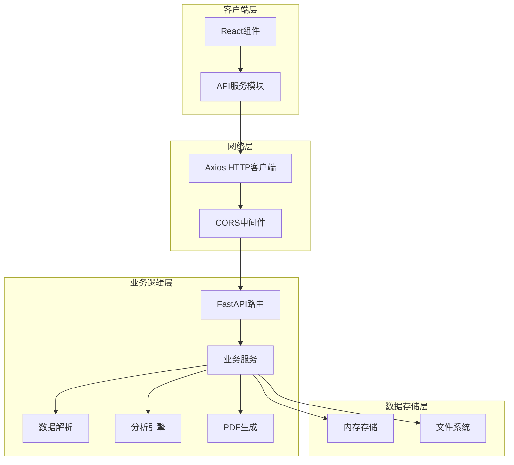

**图表来源**
- [api.js:5-8](file://frontend/src/services/api.js#L5-L8)
- [main.py:10-16](file://backend/app/main.py#L10-L16)
- [analysis.py:16-22](file://backend/app/routers/analysis.py#L16-L22)

## 详细组件分析

### API服务模块设计模式

#### HTTP请求封装设计
API服务模块采用工厂模式和模块导出模式，通过单例Axios实例提供统一的HTTP通信能力：

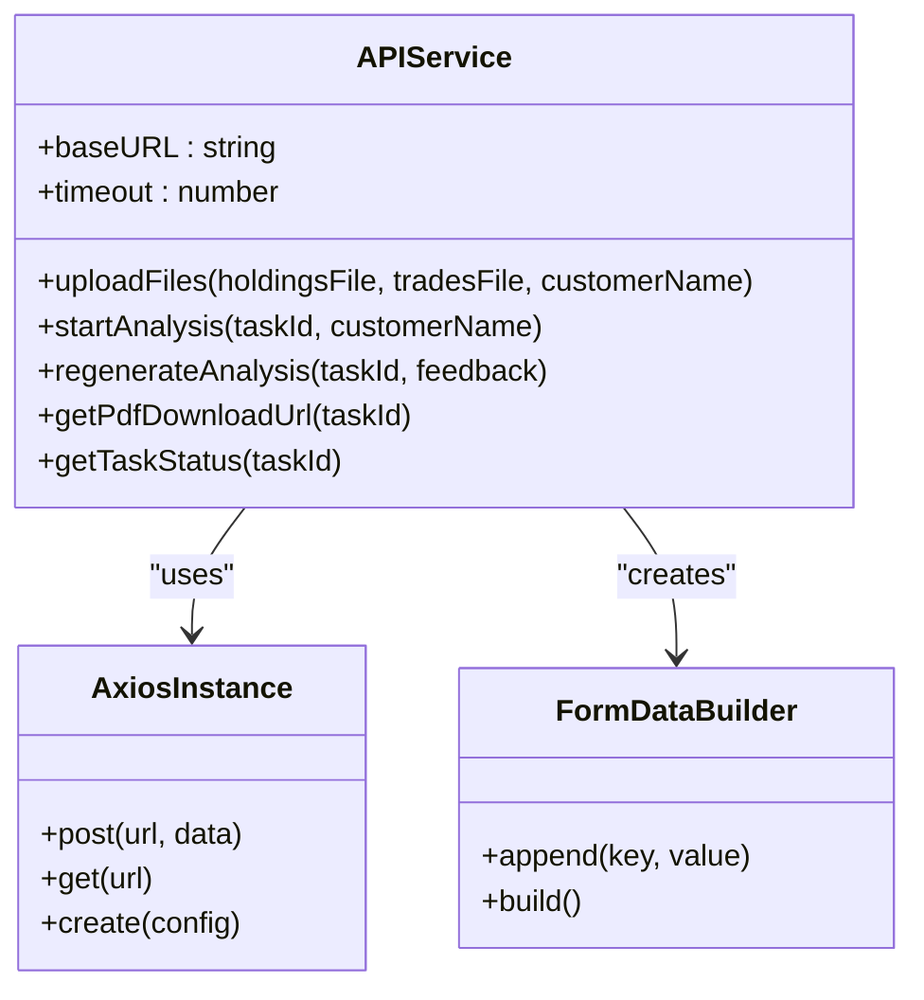

**图表来源**
- [api.js:5-40](file://frontend/src/services/api.js#L5-L40)

#### 文件上传接口实现
文件上传接口采用FormData格式，支持CSV和Excel格式文件的多文件上传：

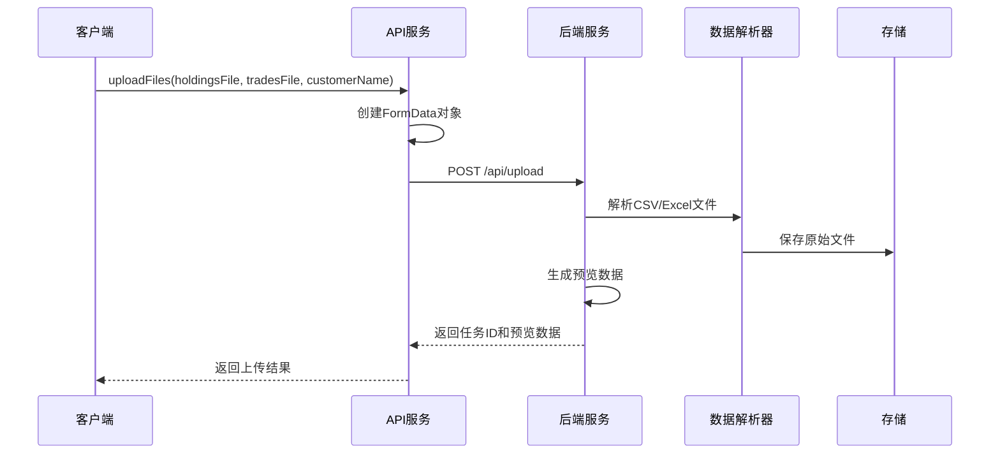

**图表来源**
- [api.js:10-19](file://frontend/src/services/api.js#L10-L19)
- [analysis.py:35-83](file://backend/app/routers/analysis.py#L35-L83)

#### 分析触发接口实现
分析触发接口通过POST请求启动AI分析任务，支持客户名称动态更新：

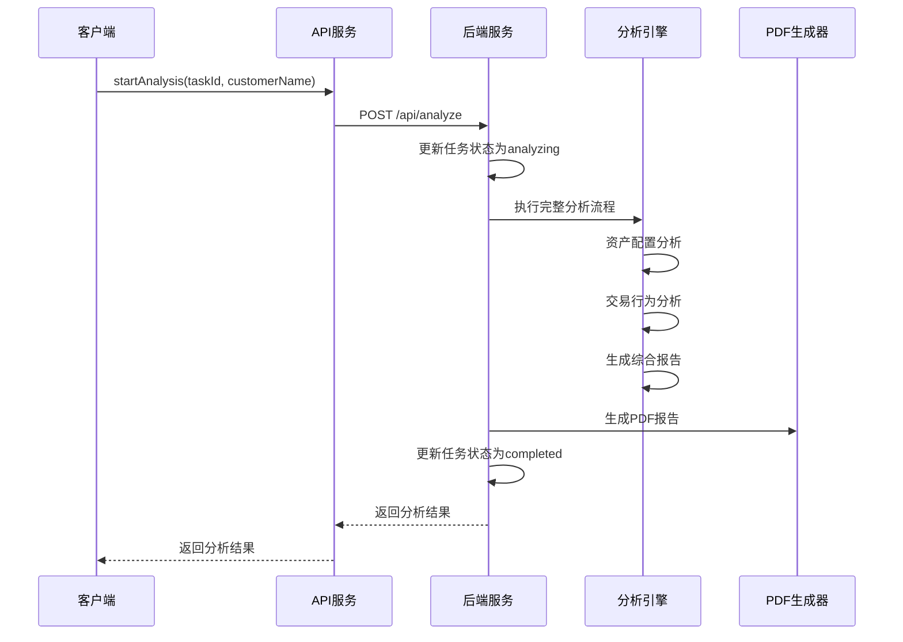

**图表来源**
- [api.js:21-24](file://frontend/src/services/api.js#L21-L24)
- [analysis.py:86-134](file://backend/app/routers/analysis.py#L86-L134)

#### 状态查询接口实现
状态查询接口提供实时的任务执行状态监控：

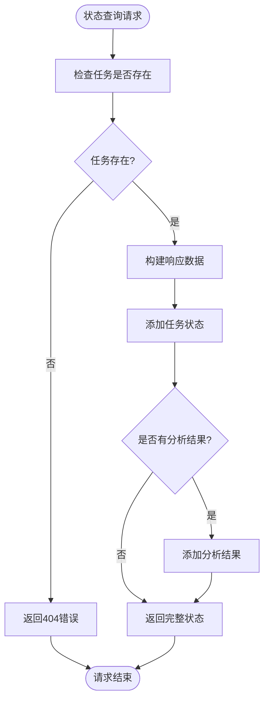

**图表来源**
- [api.js:35-38](file://frontend/src/services/api.js#L35-L38)
- [analysis.py:202-217](file://backend/app/routers/analysis.py#L202-L217)

#### 报告下载接口实现
报告下载接口提供PDF报告的直接下载功能：

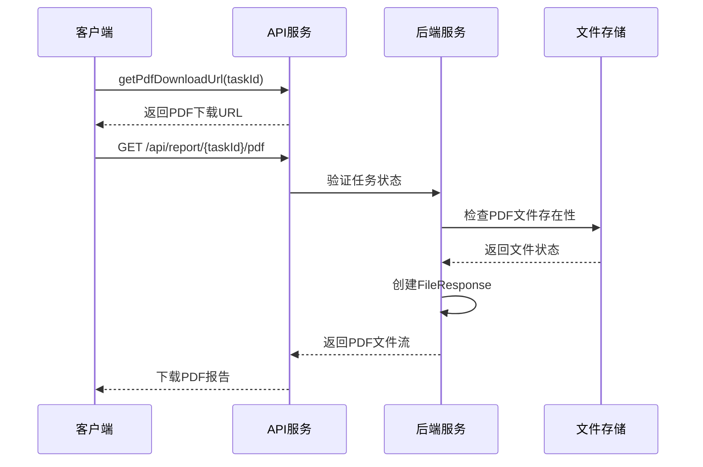

**图表来源**
- [api.js:31-33](file://frontend/src/services/api.js#L31-L33)
- [analysis.py:137-152](file://backend/app/routers/analysis.py#L137-L152)

### 请求配置与响应处理

#### 请求配置特性
- **基础URL配置**：统一的API基础地址，便于部署迁移
- **超时设置**：5分钟超时，适应长时间分析任务
- **自动序列化**：FormData自动序列化处理
- **错误处理**：统一的错误响应格式

#### 响应处理机制
- **数据提取**：统一从响应对象中提取data字段
- **状态码处理**：后端通过HTTP状态码传达操作结果
- **错误传播**：异常信息通过Promise链路传递给调用方

### 错误捕获与重试机制

#### 错误捕获策略
前端采用try-catch块捕获API调用异常，后端通过HTTPException处理业务异常：

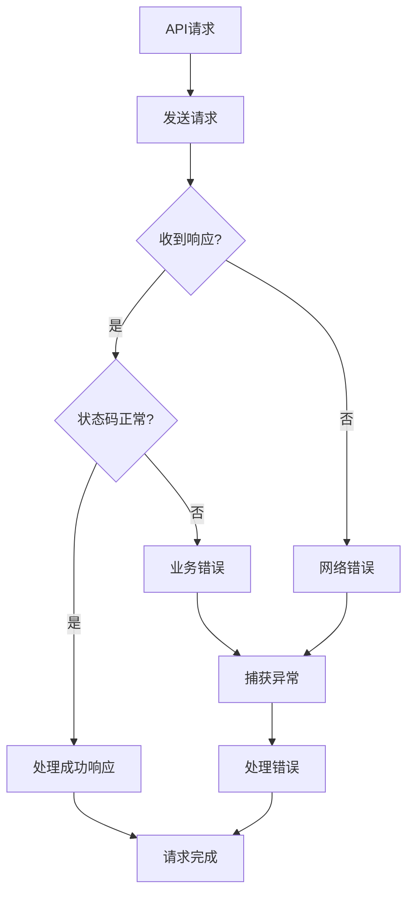

#### 重试机制实现
当前实现未包含自动重试逻辑，但提供了错误处理框架，可扩展重试功能：

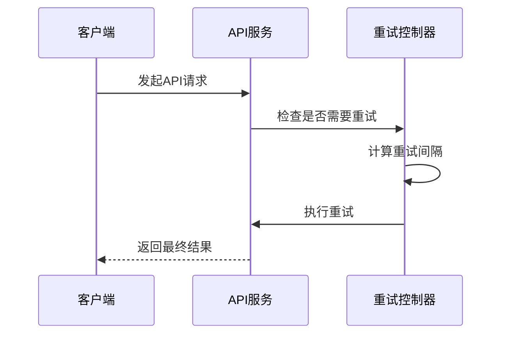

### 认证机制与请求头设置

#### 当前认证状态
系统当前未实现专门的认证机制，采用简单的CORS配置允许跨域访问。

#### 请求头配置
- **Content-Type**：自动设置为multipart/form-data（文件上传）
- **Accept**：application/json
- **CORS**：允许所有源、方法和头部

### 数据序列化处理

#### 前端序列化
- **FormData**：文件上传时自动序列化
- **JSON**：普通POST请求的数据序列化
- **URL参数**：GET请求的参数编码

#### 后端反序列化
- **文件解析**：使用pandas库解析CSV/Excel文件
- **表单数据**：使用FastAPI的File和Form参数
- **JSON数据**：自动转换为Python字典

### Promise链式调用与async/await模式

#### Promise链式调用
API服务模块广泛使用Promise链式调用模式，确保异步操作的顺序执行：

```javascript
// Promise链式调用示例
uploadFiles(holdingsFile, tradesFile, customerName)
  .then(result => {
    // 处理上传结果
    return startAnalysis(result.task_id, customerName);
  })
  .then(result => {
    // 处理分析结果
    return getPdfDownloadUrl(result.task_id);
  })
  .catch(error => {
    // 处理错误
    console.error('操作失败:', error);
  });
```

#### async/await模式
现代JavaScript推荐使用async/await语法，提供更好的代码可读性和错误处理：

```javascript
// async/await示例
try {
  const uploadResult = await uploadFiles(holdingsFile, tradesFile, customerName);
  const analysisResult = await startAnalysis(uploadResult.task_id, customerName);
  const downloadUrl = getPdfDownloadUrl(analysisResult.task_id);
  // 处理结果
} catch (error) {
  // 错误处理
}
```

### 并发请求控制

#### 当前并发控制
系统当前未实现显式的并发请求控制，但可以通过以下方式管理：

```javascript
// 并发控制示例
class RequestQueue {
  constructor(maxConcurrent = 3) {
    this.maxConcurrent = maxConcurrent;
    this.currentRequests = 0;
    this.queue = [];
  }
  
  async add(requestFn) {
    return new Promise((resolve, reject) => {
      this.queue.push({ requestFn, resolve, reject });
      this.process();
    });
  }
  
  async process() {
    if (this.currentRequests >= this.maxConcurrent || this.queue.length === 0) {
      return;
    }
    
    const { requestFn, resolve, reject } = this.queue.shift();
    this.currentRequests++;
    
    try {
      const result = await requestFn();
      resolve(result);
    } catch (error) {
      reject(error);
    } finally {
      this.currentRequests--;
      this.process();
    }
  }
}
```

## 依赖关系分析

### 前端依赖关系

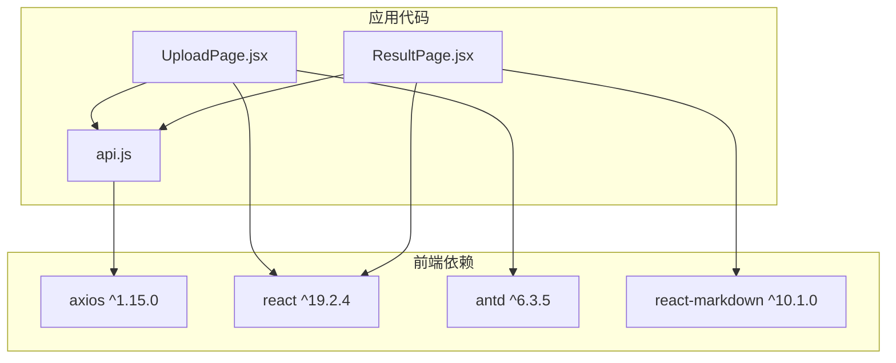

**图表来源**
- [package.json:12-19](file://frontend/package.json#L12-L19)
- [api.js:1](file://frontend/src/services/api.js#L1)

### 后端依赖关系

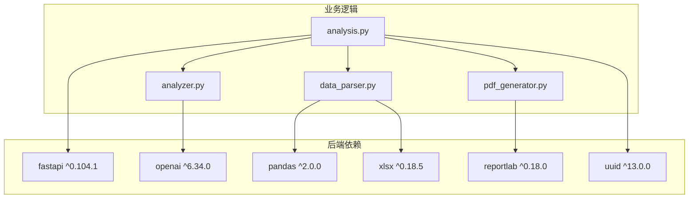

**图表来源**
- [package.json:13-23](file://backend/package.json#L13-L23)
- [analysis.py:7-12](file://backend/app/routers/analysis.py#L7-L12)

**章节来源**
- [package.json:12-31](file://frontend/package.json#L12-L31)
- [package.json:13-24](file://backend/package.json#L13-L24)

## 性能考虑

### 前端性能优化

#### 请求缓存策略
- **任务状态缓存**：避免频繁的状态查询请求
- **文件预览缓存**：缓存解析后的数据预览
- **错误缓存**：避免重复的错误请求

#### 并发控制
- **请求队列**：限制同时进行的API请求数量
- **防抖处理**：对高频操作进行防抖处理
- **请求取消**：支持取消正在进行的请求

### 后端性能优化

#### 数据处理优化
- **内存管理**：使用生成器处理大数据集
- **文件I/O优化**：批量文件写入操作
- **缓存策略**：缓存常用的分析结果

#### API性能
- **连接池**：复用数据库和外部服务连接
- **异步处理**：长耗时任务异步执行
- **资源清理**：及时释放临时文件和内存

## 故障排除指南

### 常见问题诊断

#### 文件上传问题
- **文件格式错误**：检查CSV/Excel文件格式
- **文件大小限制**：确认文件大小符合要求
- **权限问题**：验证文件读写权限

#### 分析任务失败
- **API密钥配置**：检查OpenAI API密钥设置
- **网络连接**：验证外部API连接状态
- **内存不足**：监控系统内存使用情况

#### 报告生成失败
- **字体配置**：检查系统中文字体安装
- **磁盘空间**：确认有足够的磁盘空间
- **文件权限**：验证PDF文件写入权限

### 调试技巧

#### 前端调试
- **网络面板**：使用浏览器开发者工具查看请求详情
- **状态监控**：监控任务状态变化
- **错误日志**：查看控制台错误信息

#### 后端调试
- **日志输出**：启用详细日志记录
- **状态检查**：监控内存中的任务状态
- **文件检查**：验证文件存储状态

**章节来源**
- [analysis.py:130-134](file://backend/app/routers/analysis.py#L130-L134)
- [analyzer.py:25-38](file://backend/app/services/analyzer.py#L25-L38)

## 最佳实践

### API调用最佳实践

#### 错误处理
- **统一错误格式**：确保所有API错误返回一致的格式
- **用户友好提示**：向用户提供清晰的错误信息
- **重试策略**：为临时性错误实现智能重试

#### 性能优化
- **请求合并**：将多个小请求合并为批量请求
- **缓存策略**：合理使用缓存减少重复请求
- **分页处理**：对大量数据实施分页加载

#### 安全考虑
- **输入验证**：严格验证用户输入数据
- **文件安全**：验证上传文件的安全性
- **CORS配置**：正确配置跨域访问策略

### 并发请求控制最佳实践

#### 请求队列管理
- **优先级排序**：为不同类型的请求设置优先级
- **超时控制**：为每个请求设置合理的超时时间
- **资源限制**：限制同时进行的请求数量

#### 状态同步
- **状态一致性**：确保UI状态与API状态同步
- **乐观更新**：在请求发送后立即更新UI状态
- **回滚机制**：请求失败时恢复到之前的状态

### 数据处理最佳实践

#### 文件处理
- **格式标准化**：统一数据格式和编码
- **数据验证**：验证数据的完整性和准确性
- **错误恢复**：为数据处理错误提供恢复机制

#### 分析结果处理
- **结果缓存**：缓存常用的分析结果
- **增量更新**：支持部分数据的增量更新
- **版本控制**：跟踪分析结果的版本变化

## 结论

Qoder-todo API服务模块展现了现代Web应用的优秀设计实践。通过清晰的分层架构、完善的错误处理机制和高效的异步处理模式，该模块成功实现了复杂的金融数据分析工作流。

模块的主要优势包括：
- **架构清晰**：前后端分离，职责明确
- **扩展性强**：模块化设计便于功能扩展
- **用户体验好**：异步处理提供流畅的用户交互
- **技术栈先进**：采用React + FastAPI的现代化技术栈

未来可以考虑的改进方向：
- **认证机制**：添加JWT令牌认证
- **缓存优化**：实现多级缓存策略
- **监控告警**：添加完整的监控和告警系统
- **测试覆盖**：增加单元测试和集成测试

该API服务模块为类似的企业级应用开发提供了良好的参考模板，展示了如何在保证功能完整性的同时，实现高性能和高可用性的系统设计。