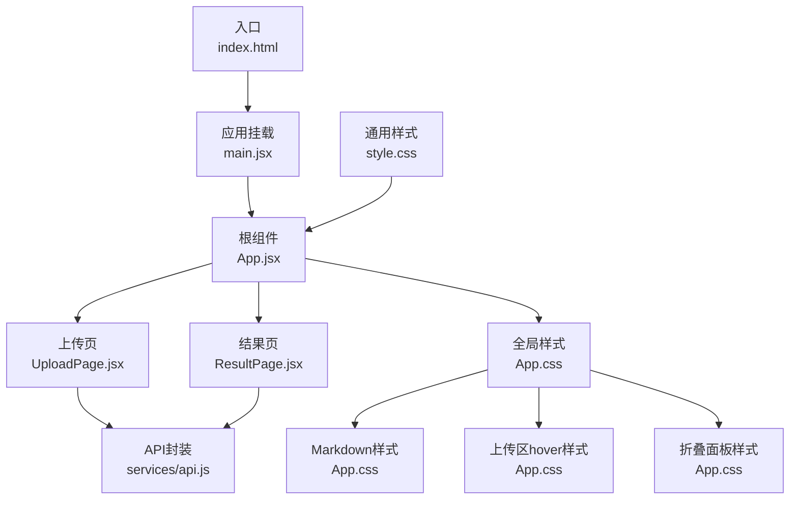
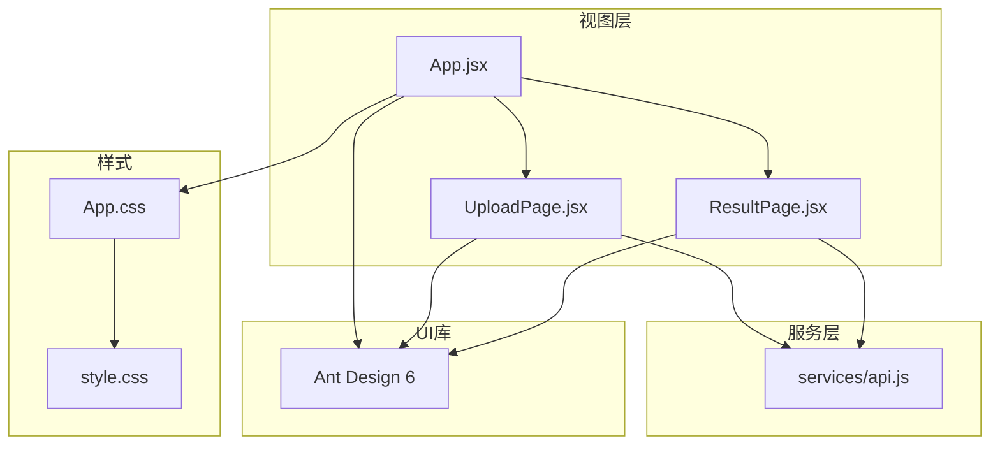
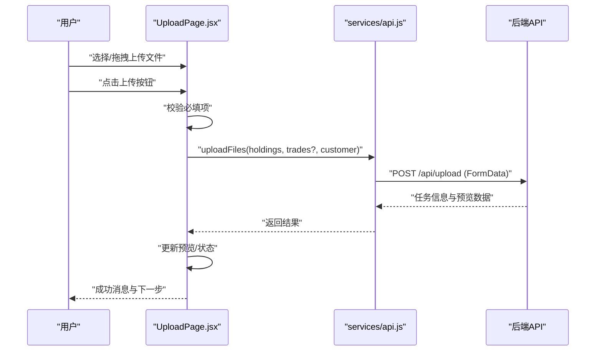
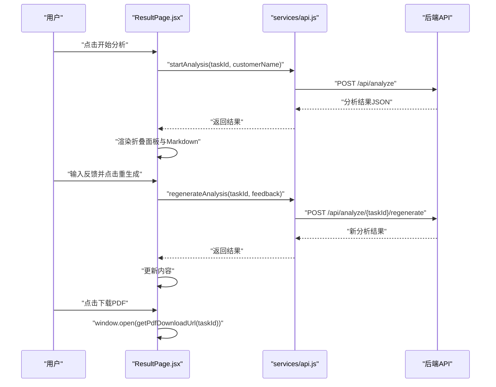
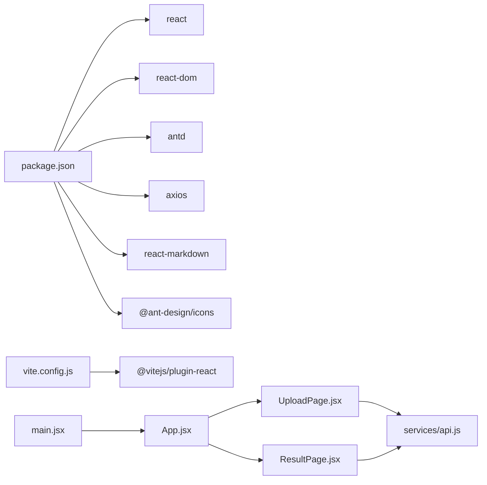

# 前端界面

<cite>
**本文引用的文件**
- [frontend/src/App.jsx](file://frontend/src/App.jsx)
- [frontend/src/main.jsx](file://frontend/src/main.jsx)
- [frontend/src/components/UploadPage.jsx](file://frontend/src/components/UploadPage.jsx)
- [frontend/src/components/ResultPage.jsx](file://frontend/src/components/ResultPage.jsx)
- [frontend/src/services/api.js](file://frontend/src/services/api.js)
- [frontend/src/App.css](file://frontend/src/App.css)
- [frontend/src/style.css](file://frontend/src/style.css)
- [frontend/package.json](file://frontend/package.json)
- [frontend/vite.config.js](file://frontend/vite.config.js)
- [frontend/index.html](file://frontend/index.html)
</cite>

## 目录
1. [简介](#简介)
2. [项目结构](#项目结构)
3. [核心组件](#核心组件)
4. [架构总览](#架构总览)
5. [详细组件分析](#详细组件分析)
6. [依赖关系分析](#依赖关系分析)
7. [性能考量](#性能考量)
8. [故障排查指南](#故障排查指南)
9. [结论](#结论)
10. [附录](#附录)

## 简介
本文件面向Qoder-todo前端界面，系统性梳理React组件架构与页面流程，重点覆盖：
- App根组件与页面级组件的组织结构
- 文件上传页面的拖拽上传、文件预览与验证逻辑
- 结果展示页面的分析结果可视化与PDF下载
- API服务封装与HTTP请求处理
- Ant Design组件的使用与样式定制

## 项目结构
前端采用Vite构建，基于React 19与Ant Design 6，通过Axios封装HTTP请求，组件按页面维度拆分，样式采用CSS模块化与Ant Design主题定制相结合的方式。

图表来源
- [frontend/index.html:1-14](file://frontend/index.html#L1-L14)
- [frontend/src/main.jsx:1-11](file://frontend/src/main.jsx#L1-L11)
- [frontend/src/App.jsx:1-81](file://frontend/src/App.jsx#L1-L81)
- [frontend/src/components/UploadPage.jsx:1-145](file://frontend/src/components/UploadPage.jsx#L1-L145)
- [frontend/src/components/ResultPage.jsx:1-193](file://frontend/src/components/ResultPage.jsx#L1-L193)
- [frontend/src/services/api.js:1-48](file://frontend/src/services/api.js#L1-L48)
- [frontend/src/App.css:1-61](file://frontend/src/App.css#L1-L61)
- [frontend/src/style.css:1-297](file://frontend/src/style.css#L1-L297)

章节来源
- [frontend/package.json:1-32](file://frontend/package.json#L1-L32)
- [frontend/vite.config.js:1-8](file://frontend/vite.config.js#L1-L8)
- [frontend/index.html:1-14](file://frontend/index.html#L1-L14)

## 核心组件
- 根组件App.jsx：负责页面步骤导航（上传/分析）、状态管理（当前步骤、任务数据），并作为容器协调上传页与结果页的切换。
- 页面组件UploadPage.jsx：提供客户信息输入、拖拽上传（持仓/交易）、上传触发、上传后预览与错误提示。
- 页面组件ResultPage.jsx：提供开始分析、加载态、分析结果折叠展示、反馈重生成、PDF下载等交互。
- API服务api.js：统一管理后端接口（上传、分析、重生成、PDF下载、任务状态查询），封装Axios实例与FormData提交。

章节来源
- [frontend/src/App.jsx:1-81](file://frontend/src/App.jsx#L1-L81)
- [frontend/src/components/UploadPage.jsx:1-145](file://frontend/src/components/UploadPage.jsx#L1-L145)
- [frontend/src/components/ResultPage.jsx:1-193](file://frontend/src/components/ResultPage.jsx#L1-L193)
- [frontend/src/services/api.js:1-48](file://frontend/src/services/api.js#L1-L48)

## 架构总览
整体采用“根组件控制步骤+页面组件职责分离+服务层统一请求”的分层架构。Ant Design提供UI基础能力，自定义样式增强可读性与一致性。

图表来源
- [frontend/src/App.jsx:1-81](file://frontend/src/App.jsx#L1-L81)
- [frontend/src/components/UploadPage.jsx:1-145](file://frontend/src/components/UploadPage.jsx#L1-L145)
- [frontend/src/components/ResultPage.jsx:1-193](file://frontend/src/components/ResultPage.jsx#L1-L193)
- [frontend/src/services/api.js:1-48](file://frontend/src/services/api.js#L1-L48)
- [frontend/src/App.css:1-61](file://frontend/src/App.css#L1-L61)
- [frontend/src/style.css:1-297](file://frontend/src/style.css#L1-L297)

## 详细组件分析

### 根组件 App.jsx
- 功能要点
  - 使用Ant Design Layout/Header/Footer组织页面骨架
  - 使用Steps展示“上传数据/分析报告”两步流程
  - 使用ConfigProvider全局定制主题（主色、圆角）
  - 通过状态step与taskData在上传页与结果页间切换
  - 提供onUploadSuccess回调传递任务数据给结果页
- 关键交互
  - 上传成功后设置taskData并跳转到结果页
  - 返回按钮清空任务数据并回到上传页
- 主题与布局
  - 头部渐变背景、阴影与标题样式
  - 内容区最大宽度与居中布局
  - 底部版权信息

章节来源
- [frontend/src/App.jsx:1-81](file://frontend/src/App.jsx#L1-L81)

### 上传页面 UploadPage.jsx
- 功能要点
  - 客户信息输入（受控组件）
  - 拖拽上传（Ant Design Dragger）
    - 支持CSV/Excel格式
    - 最大数量限制为1
    - beforeUpload钩子用于保存文件引用，阻止自动上传
  - 预览表格：持仓与交易分别预览前10条
  - 上传按钮禁用条件：必须有持仓文件
- 上传流程
  - 组装FormData并调用uploadFiles
  - 成功后显示预览与回调通知父组件
  - 异常时弹出消息提示
- 验证与提示
  - 无持仓文件时警告
  - 加载态与禁用态避免重复提交
  - 预览列由首行字段动态生成

图表来源
- [frontend/src/components/UploadPage.jsx:20-38](file://frontend/src/components/UploadPage.jsx#L20-L38)
- [frontend/src/services/api.js:10-19](file://frontend/src/services/api.js#L10-L19)

章节来源
- [frontend/src/components/UploadPage.jsx:1-145](file://frontend/src/components/UploadPage.jsx#L1-L145)

### 结果页面 ResultPage.jsx
- 功能要点
  - 初始态：展示准备就绪卡片与开始分析按钮
  - 加载态：旋转指示器与提示文案
  - 结果态：使用Collapse分段展示总结、资产配置、交易行为三类Markdown内容
  - 反馈重生成：输入框+按钮，提交后刷新结果
  - PDF下载：打开后端PDF下载链接
- 交互细节
  - 开始分析：调用startAnalysis，成功后标记已分析
  - 重新生成：校验反馈非空，调用regenerateAnalysis
  - PDF下载：getPdfDownloadUrl拼接URL并新开窗口
- 视觉呈现
  - 使用Ant Design Result组件展示完成态
  - 使用ReactMarkdown渲染Markdown内容
  - 折叠面板标签带颜色标识与图标

图表来源
- [frontend/src/components/ResultPage.jsx:22-58](file://frontend/src/components/ResultPage.jsx#L22-L58)
- [frontend/src/services/api.js:21-40](file://frontend/src/services/api.js#L21-L40)

章节来源
- [frontend/src/components/ResultPage.jsx:1-193](file://frontend/src/components/ResultPage.jsx#L1-L193)

### API服务封装 services/api.js
- Axios实例
  - 基础URL指向后端API
  - 超时时间5分钟，适配长耗时分析任务
- 接口方法
  - uploadFiles：上传持仓与交易文件，附带客户名
  - startAnalysis：启动分析任务
  - regenerateAnalysis：根据反馈重生成
  - getPdfDownloadUrl：生成PDF下载地址
  - getTaskStatus：查询任务状态（预留）
- 请求体
  - 所有接口均使用FormData提交，便于文件上传

章节来源
- [frontend/src/services/api.js:1-48](file://frontend/src/services/api.js#L1-L48)

### Ant Design组件使用与样式定制
- 组件使用
  - 布局：Layout/Header/Footer/Content
  - 表单：Input/Button/Upload/Dragger/Table
  - 反馈：message/Result/Spin
  - 展示：Card/Collapse/Typography/Tag
  - 图标：@ant-design/icons
- 主题定制
  - ConfigProvider全局设置主色与圆角
  - 头部渐变背景与阴影
- 自定义样式
  - Markdown内容排版（标题、段落、列表、引用）
  - 上传区域hover边框高亮
  - 折叠面板头部对齐优化
  - 通用CSS变量与深浅色主题适配

章节来源
- [frontend/src/App.jsx:31-77](file://frontend/src/App.jsx#L31-L77)
- [frontend/src/App.css:1-61](file://frontend/src/App.css#L1-L61)
- [frontend/src/style.css:1-297](file://frontend/src/style.css#L1-L297)

## 依赖关系分析
- 运行时依赖
  - React 19、Ant Design 6、Axios、react-markdown
- 构建工具
  - Vite + @vitejs/plugin-react
- 代码组织
  - 组件按页面拆分，服务层集中管理HTTP
  - 样式分层：Ant Design默认样式 + 全局样式 + 通用CSS变量

图表来源
- [frontend/package.json:12-19](file://frontend/package.json#L12-L19)
- [frontend/vite.config.js:5-7](file://frontend/vite.config.js#L5-L7)
- [frontend/src/main.jsx:1-11](file://frontend/src/main.jsx#L1-L11)
- [frontend/src/App.jsx:1-81](file://frontend/src/App.jsx#L1-L81)
- [frontend/src/components/UploadPage.jsx:1-145](file://frontend/src/components/UploadPage.jsx#L1-L145)
- [frontend/src/components/ResultPage.jsx:1-193](file://frontend/src/components/ResultPage.jsx#L1-L193)
- [frontend/src/services/api.js:1-48](file://frontend/src/services/api.js#L1-L48)

章节来源
- [frontend/package.json:1-32](file://frontend/package.json#L1-L32)
- [frontend/vite.config.js:1-8](file://frontend/vite.config.js#L1-L8)

## 性能考量
- 上传与分析
  - 上传采用FormData，避免大文件内存峰值过高
  - 分析接口超时设为5分钟，满足长耗时场景
- UI渲染
  - 预览表格仅展示前10条，减少DOM节点
  - 折叠面板默认展开摘要，其余懒加载
- 样式
  - 自定义样式尽量复用Ant Design类名，减少额外样式计算
  - CSS变量统一管理主题色与间距，提升维护效率

## 故障排查指南
- 上传失败
  - 现象：弹出错误消息
  - 排查：检查后端是否可达、文件格式是否符合要求、网络状况
  - 参考路径：[frontend/src/components/UploadPage.jsx:32-35](file://frontend/src/components/UploadPage.jsx#L32-L35)
- 分析失败
  - 现象：弹出错误消息
  - 排查：确认任务ID有效、客户名合法、后端服务正常
  - 参考路径：[frontend/src/components/ResultPage.jsx:29-32](file://frontend/src/components/ResultPage.jsx#L29-L32)
- PDF下载空白
  - 现象：打开PDF为空
  - 排查：确认任务已完成分析、后端PDF生成服务可用
  - 参考路径：[frontend/src/services/api.js:38-40](file://frontend/src/services/api.js#L38-L40)
- 预览不显示
  - 现象：上传成功但无预览
  - 排查：确认后端返回的预览数据结构一致
  - 参考路径：[frontend/src/components/UploadPage.jsx:119-141](file://frontend/src/components/UploadPage.jsx#L119-L141)

章节来源
- [frontend/src/components/UploadPage.jsx:32-35](file://frontend/src/components/UploadPage.jsx#L32-L35)
- [frontend/src/components/ResultPage.jsx:29-32](file://frontend/src/components/ResultPage.jsx#L29-L32)
- [frontend/src/services/api.js:38-40](file://frontend/src/services/api.js#L38-L40)

## 结论
该前端界面以清晰的页面步骤与职责划分实现了从文件上传到分析结果可视化的完整闭环。通过Ant Design统一UI风格与Axios集中请求管理，既保证了开发效率也兼顾了可维护性。后续可在任务状态轮询、错误重试与缓存策略方面进一步优化用户体验。

## 附录
- 入口与构建
  - 入口HTML与JS：[frontend/index.html:1-14](file://frontend/index.html#L1-L14)、[frontend/src/main.jsx:1-11](file://frontend/src/main.jsx#L1-L11)
  - 构建配置：[frontend/vite.config.js:1-8](file://frontend/vite.config.js#L1-L8)
- 样式参考
  - 全局样式与Markdown样式：[frontend/src/App.css:1-61](file://frontend/src/App.css#L1-L61)
  - 通用CSS变量与深浅色主题：[frontend/src/style.css:1-297](file://frontend/src/style.css#L1-L297)