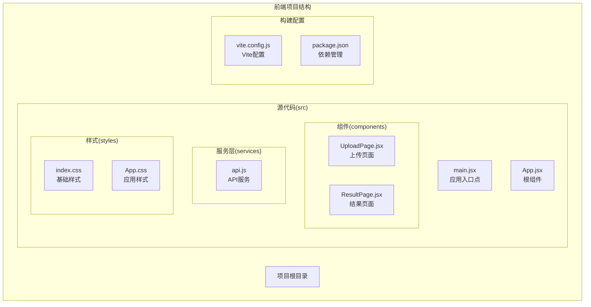
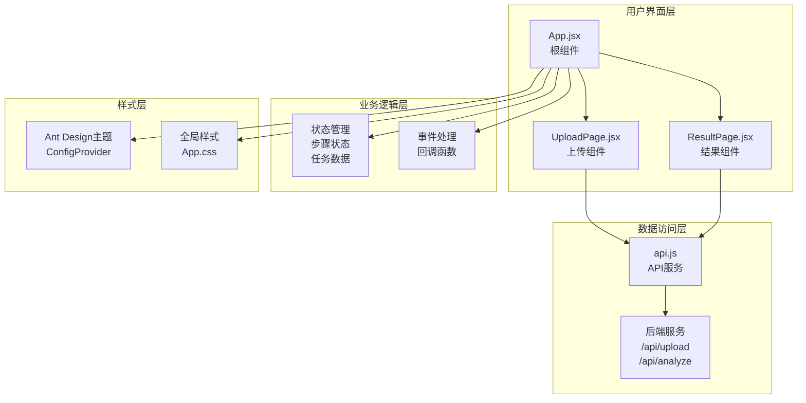
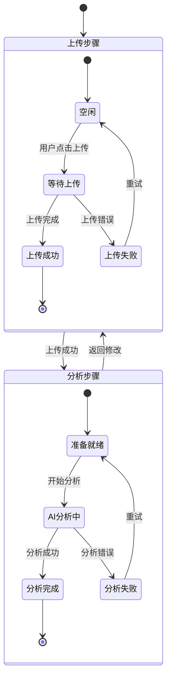
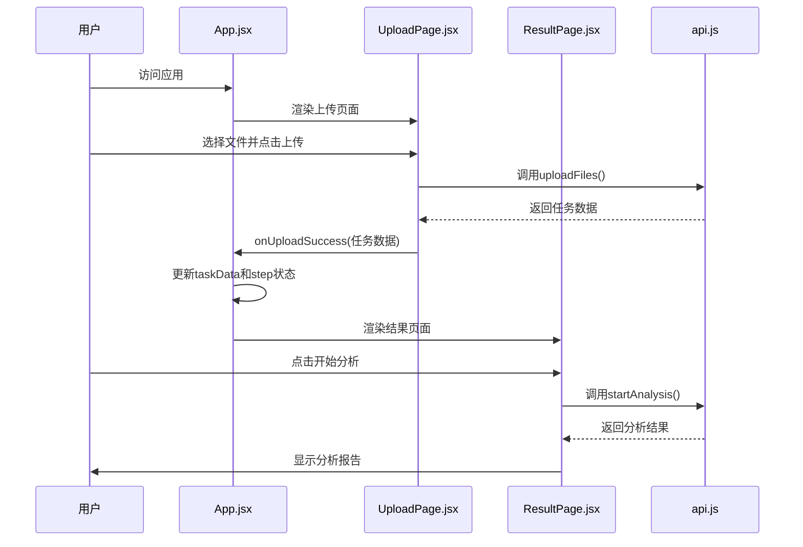
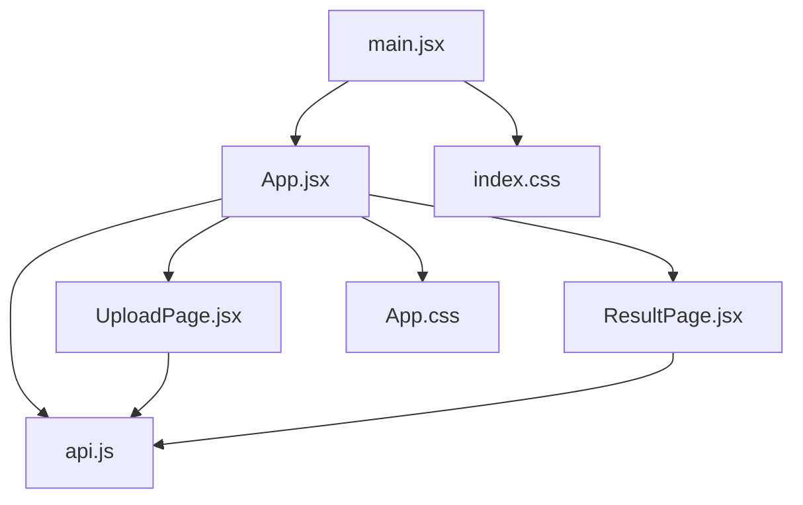

# 应用根组件

<cite>
**本文档引用的文件**
- [App.jsx](file://frontend/src/App.jsx)
- [main.jsx](file://frontend/src/main.jsx)
- [App.css](file://frontend/src/App.css)
- [UploadPage.jsx](file://frontend/src/components/UploadPage.jsx)
- [ResultPage.jsx](file://frontend/src/components/ResultPage.jsx)
- [api.js](file://frontend/src/services/api.js)
- [index.css](file://frontend/src/index.css)
- [package.json](file://frontend/package.json)
- [vite.config.js](file://frontend/vite.config.js)
</cite>

## 目录
1. [简介](#简介)
2. [项目结构](#项目结构)
3. [核心组件](#核心组件)
4. [架构概览](#架构概览)
5. [详细组件分析](#详细组件分析)
6. [依赖关系分析](#依赖关系分析)
7. [性能考虑](#性能考虑)
8. [故障排除指南](#故障排除指南)
9. [结论](#结论)

## 简介

Qoder-todo应用是一个基于React和Ant Design的客户资产分析工具。该应用的核心是根组件App.jsx，它负责管理整个应用的状态、布局结构和组件间的通信。应用采用双步骤工作流程：首先上传客户数据文件，然后进行AI分析生成报告。

该应用展现了现代前端开发的最佳实践，包括：
- 基于React Hooks的状态管理
- Ant Design组件库的主题定制
- 渐进式Web应用架构
- 组件化设计模式
- API集成和错误处理

## 项目结构

前端项目采用模块化组织方式，主要目录结构如下：



**图表来源**
- [main.jsx:1-11](file://frontend/src/main.jsx#L1-11)
- [App.jsx:1-81](file://frontend/src/App.jsx#L1-81)

**章节来源**
- [main.jsx:1-11](file://frontend/src/main.jsx#L1-11)
- [package.json:1-32](file://frontend/package.json#L1-32)

## 核心组件

### 根组件App.jsx架构

App.jsx作为应用的根组件，承担着以下关键职责：

#### 状态管理设计
- **步骤状态(step)**: 控制当前显示的界面（0: 上传, 1: 分析结果）
- **任务数据(taskData)**: 存储上传文件后的任务信息
- **事件处理器**: 提供状态转换和数据传递的方法

#### 布局结构
应用采用Ant Design的Layout组件系统，实现了标准的企业级布局：
- **头部(Header)**: 包含应用标题和渐变背景
- **内容(Content)**: 主要业务区域，包含步骤导航和动态内容
- **页脚(Footer)**: 显示版权信息

#### 主题配置
通过Ant Design的ConfigProvider组件实现全局主题定制：
- 主色调: 深蓝色(#1565c0)
- 圆角半径: 8像素
- 渐变背景: 头部采用135度角的深蓝到蓝色渐变

**章节来源**
- [App.jsx:11-81](file://frontend/src/App.jsx#L11-81)

## 架构概览

应用采用分层架构设计，清晰分离了展示层、业务逻辑层和数据访问层：



**图表来源**
- [App.jsx:1-81](file://frontend/src/App.jsx#L1-81)
- [UploadPage.jsx:1-145](file://frontend/src/components/UploadPage.jsx#L1-145)
- [ResultPage.jsx:1-193](file://frontend/src/components/ResultPage.jsx#L1-193)
- [api.js:1-48](file://frontend/src/services/api.js#L1-48)

## 详细组件分析

### 根组件App.jsx详细分析

#### 状态管理机制

App.jsx使用React的useState Hook管理两个核心状态：



**图表来源**
- [App.jsx:12-23](file://frontend/src/App.jsx#L12-23)

#### 步骤导航组件实现

应用使用Ant Design的Steps组件实现清晰的步骤导航：

| 步骤 | 标题 | 图标 | 功能 |
|------|------|------|------|
| 0 | 上传数据 | CloudUploadOutlined | 文件上传和客户信息收集 |
| 1 | 分析报告 | BarChartOutlined | AI分析和报告生成 |

步骤切换逻辑通过条件渲染实现：
- 当step为0时显示UploadPage组件
- 当step为1且存在taskData时显示ResultPage组件

#### 布局设计规范

应用采用Ant Design的Layout系统，实现了响应式和美观的布局：

**头部设计**:
- 渐变背景: linear-gradient(135deg, #1a237e 0%, #1565c0 100%)
- 文本颜色: #fff
- 阴影效果: 0 2px 8px rgba(0,0,0,0.15)
- 内边距: 40px

**内容区域设计**:
- 最大宽度: 1200px
- 居中对齐: margin: '0 auto'
- 内边距: 24px 40px
- 背景色: #f0f2f5

**页脚设计**:
- 文本居中: text-align: 'center'
- 字体颜色: #999

#### 组件间通信模式

应用采用props传递和回调函数的方式实现组件通信：



**图表来源**
- [App.jsx:15-23](file://frontend/src/App.jsx#L15-23)
- [UploadPage.jsx:20-38](file://frontend/src/components/UploadPage.jsx#L20-38)
- [ResultPage.jsx:22-35](file://frontend/src/components/ResultPage.jsx#L22-35)

**章节来源**
- [App.jsx:11-81](file://frontend/src/App.jsx#L11-81)

### 上传页面组件分析

#### 文件上传功能

UploadPage.jsx实现了完整的文件上传功能：

**文件类型支持**:
- 支持CSV、Excel格式(.csv, .xlsx, .xls)
- 持仓数据文件为必填项
- 交易记录文件为可选项

**上传流程**:
1. 用户选择文件
2. 前端验证文件类型
3. 调用API上传文件
4. 显示上传结果预览
5. 触发父组件状态更新

**预览功能**:
- 自动表格预览前10条数据
- 支持横向滚动查看
- 动态列标题提取

#### 错误处理机制

组件内置了完善的错误处理：
- 文件验证失败提示
- API调用异常处理
- 用户友好的错误消息显示

**章节来源**
- [UploadPage.jsx:1-145](file://frontend/src/components/UploadPage.jsx#L1-145)

### 结果页面组件分析

#### AI分析功能

ResultPage.jsx提供了完整的AI分析和报告生成功能：

**分析流程**:
1. 用户确认开始分析
2. 调用后端API启动分析任务
3. 显示加载状态
4. 接收并展示分析结果
5. 支持根据反馈重新生成

**报告结构**:
- 总结摘要
- 资产配置分析
- 交易行为分析

#### PDF下载功能

应用集成了PDF报告生成功能：
- 一键下载完整分析报告
- 使用标准的PDF图标
- 在新窗口中打开下载链接

#### 反馈循环机制

用户可以提供修改意见来改进分析结果：
- 文本域收集用户反馈
- 支持重新生成分析报告
- 实时验证反馈内容

**章节来源**
- [ResultPage.jsx:1-193](file://frontend/src/components/ResultPage.jsx#L1-193)

### API服务层分析

#### 后端接口集成

api.js文件封装了所有后端API调用：

**接口定义**:
- `/api/upload`: 文件上传接口
- `/api/analyze`: AI分析启动接口  
- `/api/analyze/{taskId}/regenerate`: 重新生成接口
- `/api/report/{taskId}/pdf`: PDF下载接口
- `/api/task/{taskId}`: 任务状态查询接口

**配置特性**:
- 基础URL: http://localhost:8000/api
- 超时时间: 5分钟(300000ms)
- 表单数据格式: FormData

**章节来源**
- [api.js:1-48](file://frontend/src/services/api.js#L1-48)

## 依赖关系分析

### 外部依赖管理

应用使用npm包管理器管理依赖关系，主要依赖包括：

```mermaid
graph LR
subgraph "核心依赖"
React[react@^19.2.4]
ReactDOM[react-dom@^19.2.4]
AntD[antd@^6.3.5]
Icons[@ant-design/icons@^6.1.1]
end
subgraph "开发依赖"
Vite[vite@^8.0.4]
ReactPlugin[@vitejs/plugin-react@^6.0.1]
Axios[axios@^1.15.0]
Markdown[react-markdown@^10.1.0]
end
subgraph "构建工具"
ESLint[eslint@^9.39.4]
Typescript[@types/react@^19.2.14]
end
React --> ReactDOM
AntD --> Icons
Vite --> ReactPlugin
App --> React
App --> AntD
App --> Axios
App --> Markdown
```

**图表来源**
- [package.json:12-30](file://frontend/package.json#L12-30)

### 内部模块依赖

应用内部模块之间的依赖关系清晰明确：



**图表来源**
- [App.jsx:1-81](file://frontend/src/App.jsx#L1-81)
- [main.jsx:1-11](file://frontend/src/main.jsx#L1-11)

**章节来源**
- [package.json:1-32](file://frontend/package.json#L1-32)

## 性能考虑

### 状态管理优化

应用采用了高效的状态管理模式：
- 使用useState Hook管理简单状态
- 通过回调函数避免不必要的重渲染
- 条件渲染确保只渲染当前步骤的组件

### 组件懒加载

虽然当前实现中所有组件都在根组件中导入，但可以考虑实现按需加载：
- 使用React.lazy和Suspense
- 按步骤延迟加载对应组件
- 减少初始包体积

### API调用优化

API服务已经考虑了长时间操作的需求：
- 设置5分钟超时时间
- 支持进度反馈和状态查询
- 错误处理机制完善

## 故障排除指南

### 常见问题及解决方案

**文件上传失败**
- 检查文件格式是否为CSV或Excel
- 确认网络连接正常
- 查看浏览器控制台错误信息

**分析任务超时**
- 检查后端服务是否正常运行
- 确认任务ID是否正确
- 查看后端日志获取详细错误信息

**样式显示异常**
- 检查Ant Design版本兼容性
- 确认主题配置正确应用
- 验证CSS文件加载情况

### 调试技巧

**开发环境调试**:
- 使用React DevTools检查组件树
- 利用浏览器开发者工具监控网络请求
- 通过console.log跟踪状态变化

**生产环境监控**:
- 实现全局错误边界
- 添加性能监控指标
- 设置用户反馈收集机制

**章节来源**
- [App.jsx:15-23](file://frontend/src/App.jsx#L15-23)
- [UploadPage.jsx:32-35](file://frontend/src/components/UploadPage.jsx#L32-35)
- [ResultPage.jsx:29-32](file://frontend/src/components/ResultPage.jsx#L29-32)

## 结论

Qoder-todo应用的根组件App.jsx展现了现代React应用的最佳实践。通过清晰的状态管理、优雅的UI设计和完善的错误处理机制，该应用为用户提供了一个流畅的客户资产分析体验。

**主要优势**:
- 清晰的步骤化工作流程
- 响应式的Ant Design布局
- 完善的错误处理和用户反馈
- 模块化的组件设计
- 灵活的主题定制能力

**技术亮点**:
- 基于React Hooks的状态管理
- 组件间松耦合的通信模式
- 完整的API集成方案
- 友好的用户体验设计

该应用为类似的数据分析类应用提供了一个优秀的参考实现，展示了如何在保持代码简洁的同时实现复杂的功能需求。