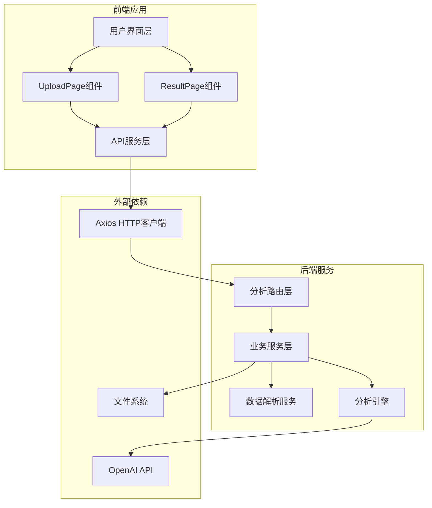
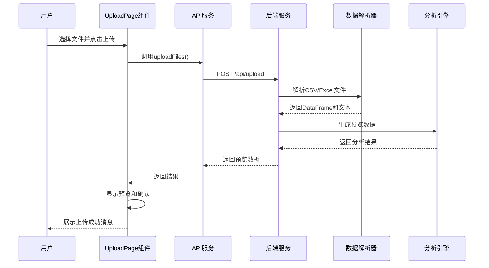
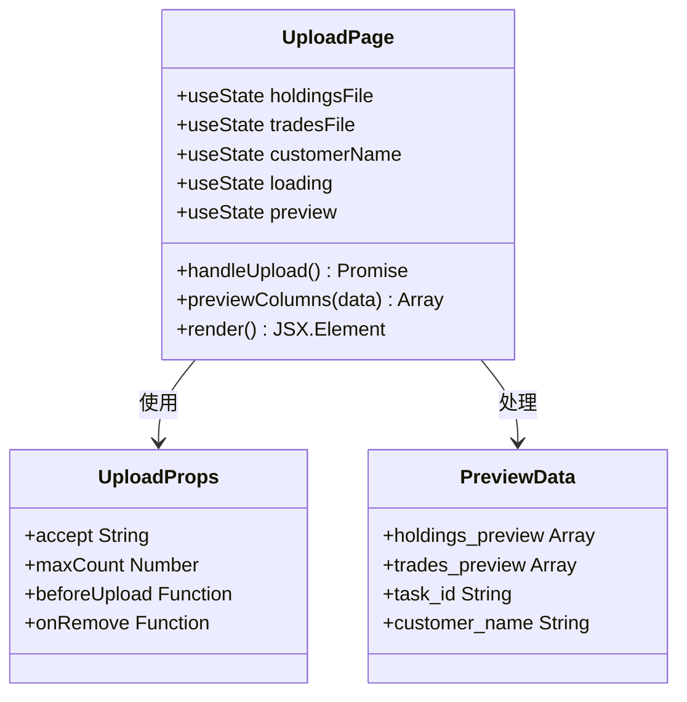
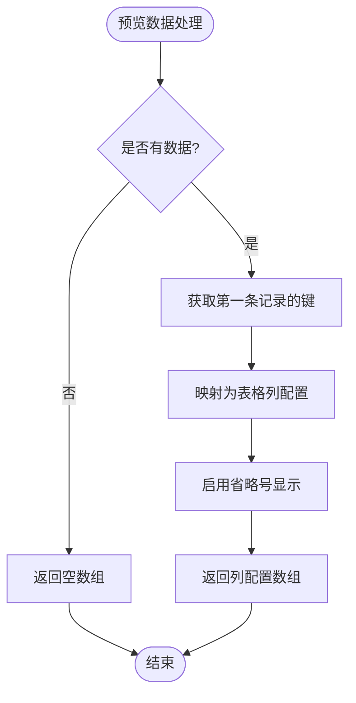
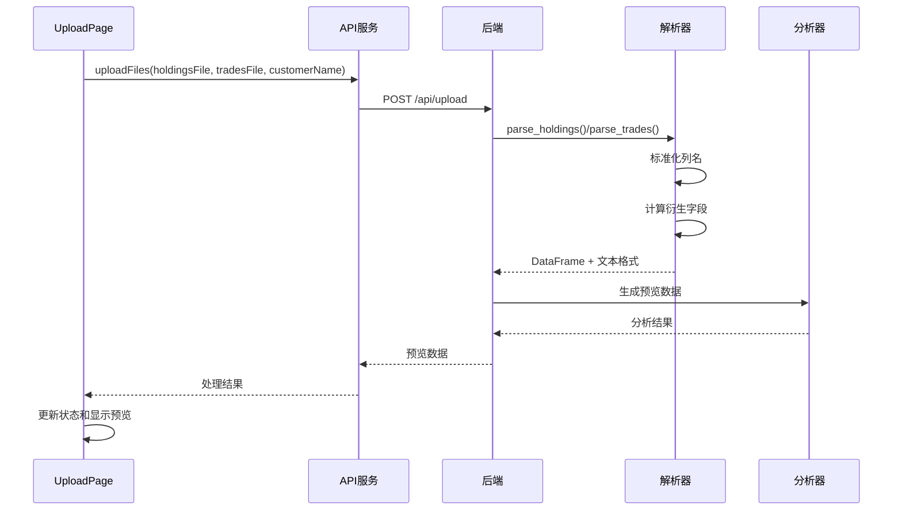
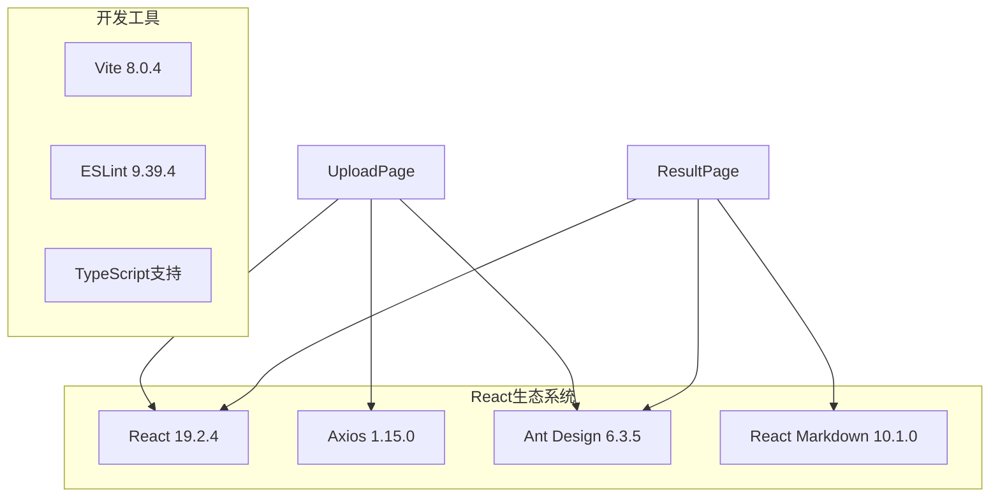
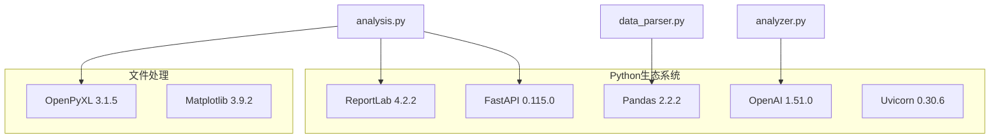

# 文件上传页面

<cite>
**本文引用的文件**
- [UploadPage.jsx](file://frontend/src/components/UploadPage.jsx)
- [api.js](file://frontend/src/services/api.js)
- [App.jsx](file://frontend/src/App.jsx)
- [analysis.py](file://backend/app/routers/analysis.py)
- [data_parser.py](file://backend/app/services/data_parser.py)
- [analyzer.py](file://backend/app/services/analyzer.py)
- [ResultPage.jsx](file://frontend/src/components/ResultPage.jsx)
- [schemas.py](file://backend/app/models/schemas.py)
- [package.json](file://frontend/package.json)
- [requirements.txt](file://backend/requirements.txt)
</cite>

## 目录
1. [简介](#简介)
2. [项目结构](#项目结构)
3. [核心组件](#核心组件)
4. [架构概览](#架构概览)
5. [详细组件分析](#详细组件分析)
6. [依赖分析](#依赖分析)
7. [性能考虑](#性能考虑)
8. [故障排除指南](#故障排除指南)
9. [结论](#结论)
10. [附录](#附录)

## 简介
本文件上传页面组件是Qoder-todo客户资产分析系统的核心入口，负责处理用户上传的持仓数据和交易记录文件。该组件实现了完整的文件上传工作流，包括文件拖拽上传、格式验证、预览确认、进度显示和错误处理等关键功能。系统支持CSV和Excel格式文件，提供实时预览和确认机制，确保用户能够准确地上传和验证数据。

## 项目结构
前端采用React + Ant Design架构，后端基于FastAPI构建RESTful API。整体采用前后端分离的设计模式，通过HTTP协议进行通信。

**图表来源**
- [UploadPage.jsx:1-145](file://frontend/src/components/UploadPage.jsx#L1-L145)
- [analysis.py:1-218](file://backend/app/routers/analysis.py#L1-L218)

**章节来源**
- [package.json:1-32](file://frontend/package.json#L1-L32)
- [requirements.txt:1-9](file://backend/requirements.txt#L1-L9)

## 核心组件
UploadPage组件是文件上传功能的主要实现者，具备以下核心特性：

### 主要功能模块
- **文件拖拽上传**：支持拖拽和点击两种上传方式
- **格式验证**：严格限制CSV和Excel格式
- **文件预览**：实时显示上传文件的前10条记录
- **状态管理**：完整的组件状态控制和用户反馈
- **数据传递**：与父组件的双向数据通信

### 关键状态管理
- `holdingsFile`: 持仓数据文件状态
- `tradesFile`: 交易记录文件状态  
- `customerName`: 客户名称输入
- `loading`: 上传进度指示
- `preview`: 预览数据缓存

**章节来源**
- [UploadPage.jsx:13-38](file://frontend/src/components/UploadPage.jsx#L13-L38)
- [UploadPage.jsx:40-58](file://frontend/src/components/UploadPage.jsx#L40-L58)

## 架构概览
系统采用分层架构设计，从前端用户界面到后端业务逻辑形成清晰的职责分离。

**图表来源**
- [UploadPage.jsx:20-38](file://frontend/src/components/UploadPage.jsx#L20-L38)
- [api.js:10-19](file://frontend/src/services/api.js#L10-L19)
- [analysis.py:35-83](file://backend/app/routers/analysis.py#L35-L83)

## 详细组件分析

### UploadPage组件架构
UploadPage组件采用函数式组件设计，使用React Hooks进行状态管理，实现了完整的文件上传工作流。

**图表来源**
- [UploadPage.jsx:13-145](file://frontend/src/components/UploadPage.jsx#L13-L145)

#### 文件上传属性配置
组件为两个上传区域分别配置了不同的属性：

**持仓数据上传配置**：
- 接受格式：`.csv, .xlsx, .xls`
- 最大文件数：1个
- 验证回调：设置`holdingsFile`状态
- 移除回调：清除文件状态

**交易记录上传配置**：
- 接受格式：`.csv, .xlsx, .xls`
- 最大文件数：1个
- 验证回调：设置`tradesFile`状态
- 移除回调：清除文件状态

#### 预览数据处理
组件实现了动态列生成机制，根据实际数据结构自动生成表格列配置：

**图表来源**
- [UploadPage.jsx:60-68](file://frontend/src/components/UploadPage.jsx#L60-L68)

**章节来源**
- [UploadPage.jsx:40-58](file://frontend/src/components/UploadPage.jsx#L40-L58)
- [UploadPage.jsx:60-68](file://frontend/src/components/UploadPage.jsx#L60-L68)

### API集成与数据流
组件通过API服务层与后端进行通信，实现了完整的异步数据处理流程。

**图表来源**
- [api.js:10-19](file://frontend/src/services/api.js#L10-L19)
- [analysis.py:35-83](file://backend/app/routers/analysis.py#L35-L83)
- [data_parser.py:7-52](file://backend/app/services/data_parser.py#L7-L52)

### 错误处理与用户反馈
组件实现了多层次的错误处理机制，确保用户能够获得清晰的反馈信息。

#### 错误处理策略
- **文件验证错误**：通过Ant Design的消息组件显示警告
- **网络请求错误**：捕获HTTP异常并显示详细错误信息
- **业务逻辑错误**：处理后端返回的具体错误详情
- **状态恢复**：确保操作完成后重置加载状态

#### 用户反馈机制
- **上传前验证**：检查必需文件是否已上传
- **上传进度指示**：使用按钮loading状态显示处理中
- **成功确认**：显示上传成功的消息提示
- **失败处理**：提供具体的错误信息和解决方案

**章节来源**
- [UploadPage.jsx:20-38](file://frontend/src/components/UploadPage.jsx#L20-L38)
- [api.js:10-19](file://frontend/src/services/api.js#L10-L19)

## 依赖分析

### 前端依赖关系

**图表来源**
- [package.json:12-19](file://frontend/package.json#L12-L19)

### 后端依赖关系

**图表来源**
- [requirements.txt:1-9](file://backend/requirements.txt#L1-L9)

**章节来源**
- [package.json:1-32](file://frontend/package.json#L1-L32)
- [requirements.txt:1-9](file://backend/requirements.txt#L1-L9)

## 性能考虑

### 文件处理性能优化
- **内存管理**：后端使用临时文件存储上传的文件，避免内存溢出
- **数据预览限制**：只显示前10条记录用于预览，减少渲染开销
- **异步处理**：上传和分析过程采用异步非阻塞方式
- **缓存策略**：预览数据在组件状态中缓存，避免重复计算

### 网络传输优化
- **超时配置**：HTTP请求超时设置为5分钟，适应长时间分析任务
- **表单数据**：使用FormData格式传输，支持二进制文件上传
- **进度指示**：提供实时的加载状态反馈

### 可扩展性设计
- **任务队列**：后端使用字典存储任务状态，便于扩展为真正的队列系统
- **配置化**：支持通过环境变量配置OpenAI API参数
- **中间件支持**：FastAPI框架天然支持中间件，便于添加日志和监控

## 故障排除指南

### 常见问题及解决方案

#### 文件格式错误
**问题描述**：上传文件不被识别为CSV或Excel格式
**解决方法**：
- 确认文件扩展名正确
- 检查文件编码格式（CSV使用UTF-8-SIG）
- 验证Excel文件版本兼容性

#### 上传失败错误
**问题描述**：上传过程中出现HTTP错误
**解决方法**：
- 检查网络连接稳定性
- 确认后端服务正常运行
- 查看浏览器开发者工具中的详细错误信息

#### 预览数据为空
**问题描述**：上传成功但预览区域为空
**解决方法**：
- 检查文件是否包含有效数据
- 确认列标题是否符合预期格式
- 验证文件编码和格式正确性

#### 性能问题
**问题描述**：大文件上传或分析响应缓慢
**解决方法**：
- 优化文件大小和格式
- 检查服务器资源使用情况
- 考虑分批处理大数据集

**章节来源**
- [UploadPage.jsx:20-38](file://frontend/src/components/UploadPage.jsx#L20-L38)
- [analysis.py:51-64](file://backend/app/routers/analysis.py#L51-L64)

## 结论
UploadPage组件作为Qoder-todo系统的核心入口，成功实现了完整的文件上传和预览功能。组件设计遵循了现代React开发最佳实践，具有良好的可维护性和扩展性。通过严格的文件格式验证、完善的错误处理机制和友好的用户反馈，为用户提供了一个可靠的文件上传体验。

系统架构清晰，前后端职责明确，为后续的功能扩展和性能优化奠定了坚实基础。建议在未来版本中进一步增强文件大小限制、批量上传支持和更丰富的预览功能。

## 附录

### 安全考虑
- **文件类型验证**：前端和后端双重验证文件格式
- **路径安全**：使用UUID生成唯一文件名，避免路径遍历攻击
- **数据清理**：自动清理临时文件，防止磁盘空间占用
- **权限控制**：后端API提供基本的访问控制

### 可访问性优化
- **键盘导航**：支持Tab键导航和Enter键确认
- **屏幕阅读器**：提供适当的ARIA标签和语义化标记
- **颜色对比**：确保足够的颜色对比度以满足视觉需求
- **响应式设计**：适配不同屏幕尺寸和设备

### 配置选项
- **文件大小限制**：可通过后端配置调整
- **支持格式**：当前支持CSV和Excel格式
- **预览记录数**：默认显示前10条记录
- **超时设置**：HTTP请求超时可配置