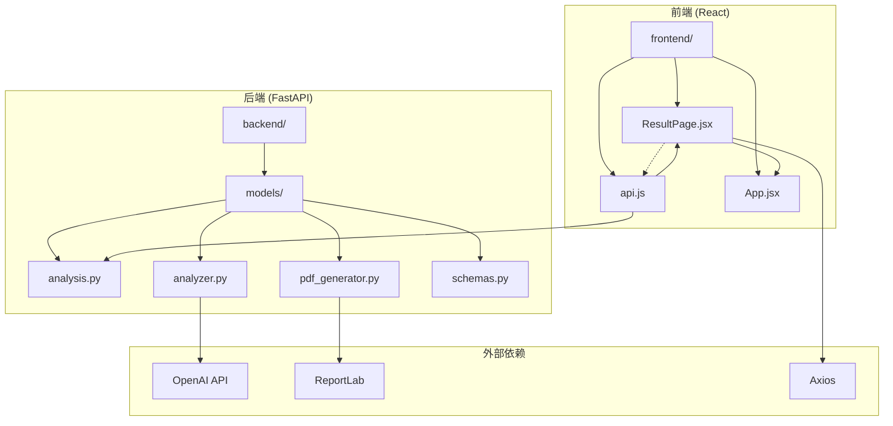
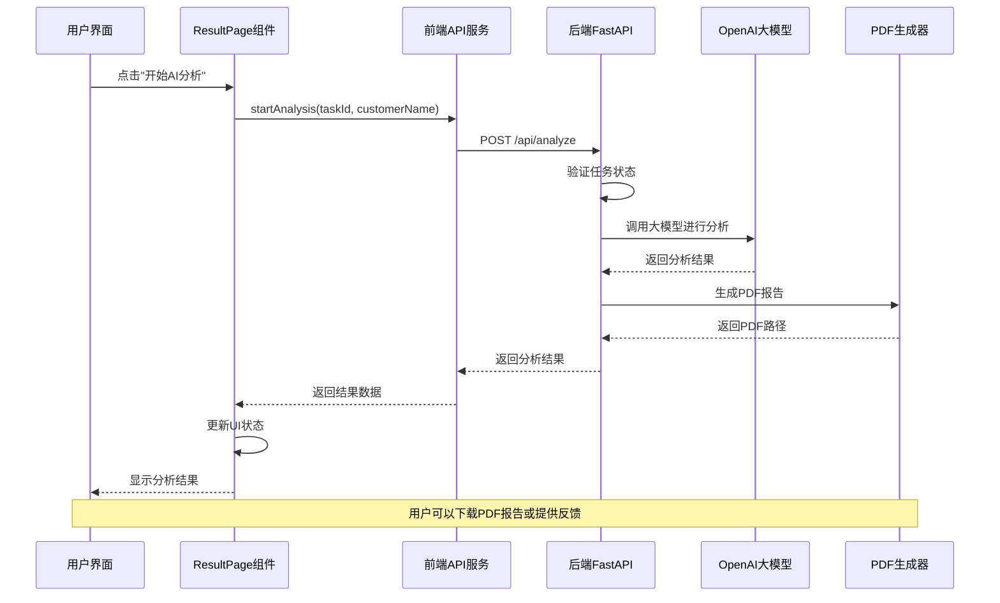
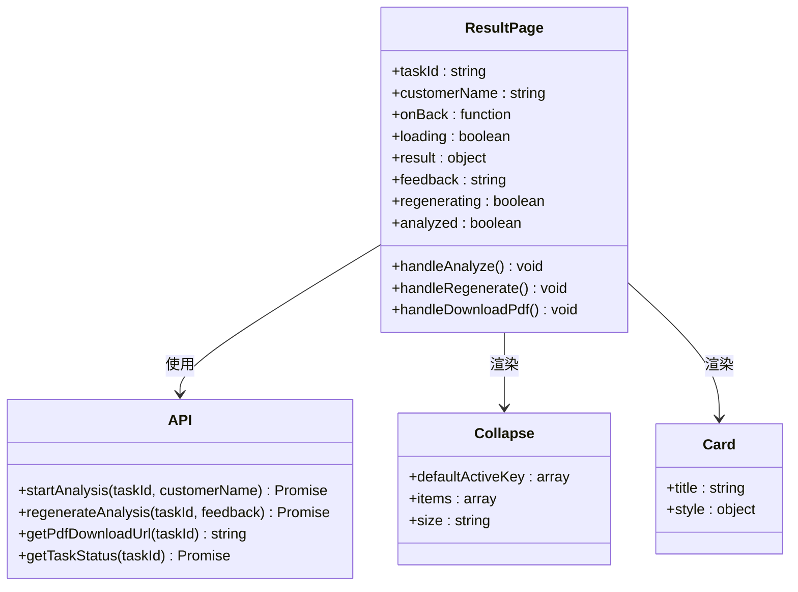
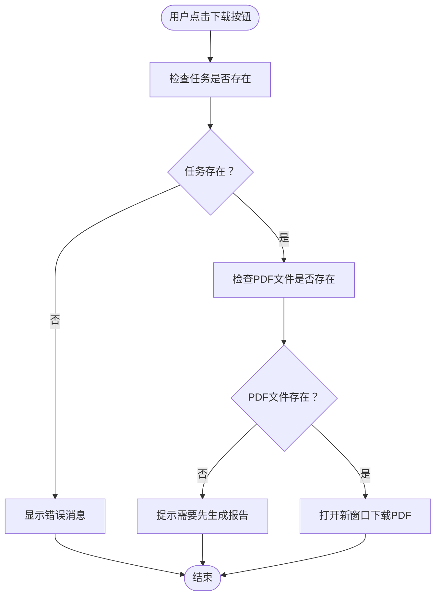
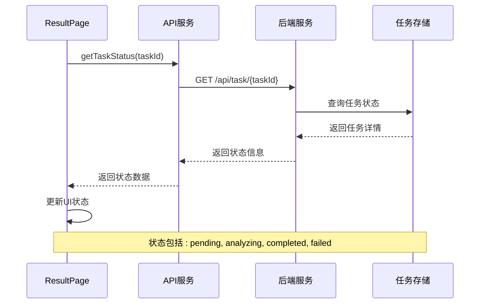
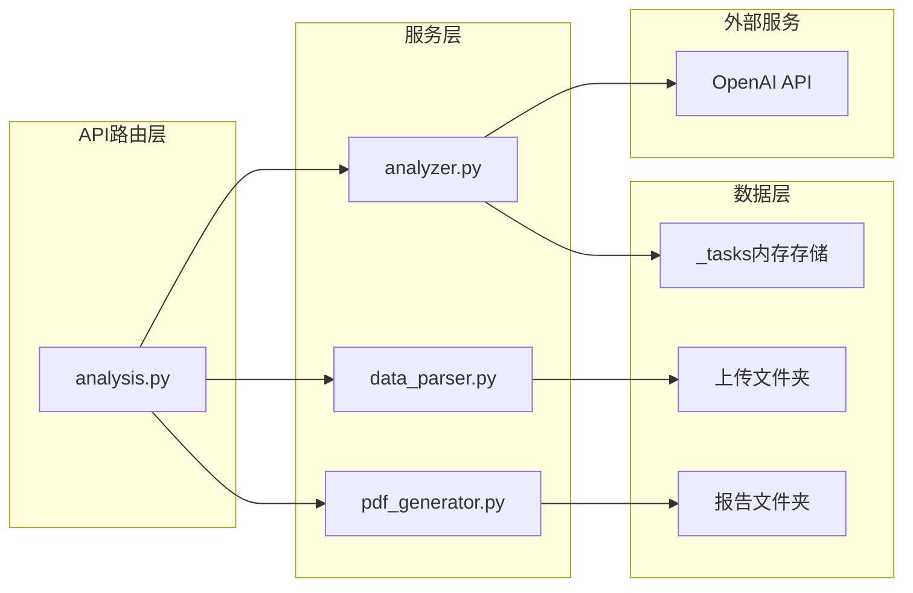
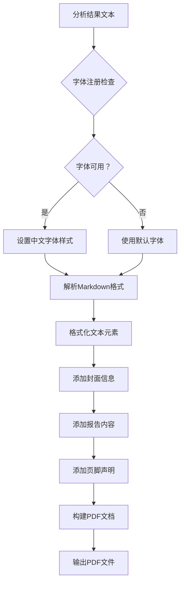
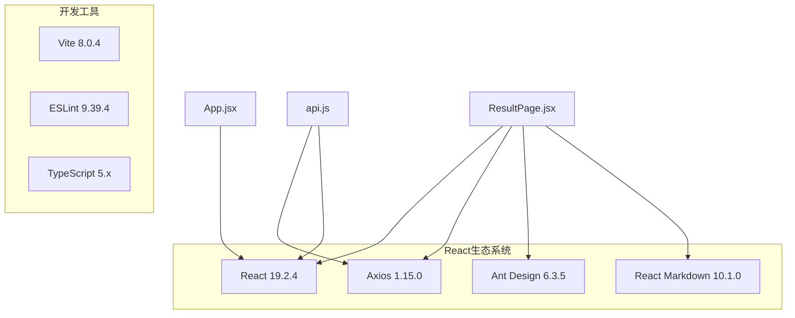
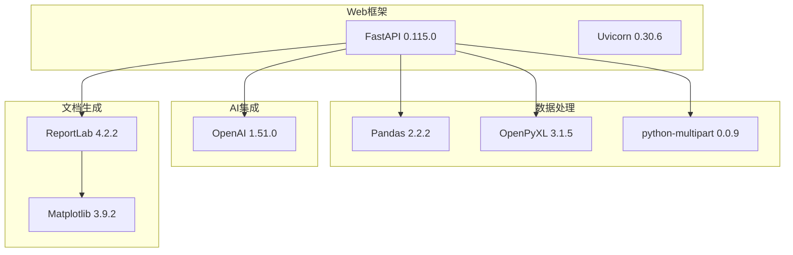

# 结果展示页面

<cite>
**本文档引用的文件**
- [ResultPage.jsx](file://frontend/src/components/ResultPage.jsx)
- [api.js](file://frontend/src/services/api.js)
- [main.py](file://backend/app/main.py)
- [analysis.py](file://backend/app/routers/analysis.py)
- [analyzer.py](file://backend/app/services/analyzer.py)
- [pdf_generator.py](file://backend/app/services/pdf_generator.py)
- [App.jsx](file://frontend/src/App.jsx)
- [package.json](file://frontend/package.json)
- [report_template.md](file://backend/app/skills/report_template.md)
- [requirements.txt](file://backend/requirements.txt)
</cite>

## 目录
1. [简介](#简介)
2. [项目结构](#项目结构)
3. [核心组件](#核心组件)
4. [架构总览](#架构总览)
5. [详细组件分析](#详细组件分析)
6. [依赖关系分析](#依赖关系分析)
7. [性能考虑](#性能考虑)
8. [故障排除指南](#故障排除指南)
9. [结论](#结论)

## 简介

Qoder-todo 是一个基于 React 和 FastAPI 的客户资产分析工具，专门用于分析客户的投资组合数据并生成专业的分析报告。结果展示页面是该应用的核心组件之一，负责接收用户上传的数据文件，触发 AI 分析流程，并以直观的方式展示分析结果。

该系统采用前后端分离架构，前端使用 React 构建用户界面，后端使用 FastAPI 提供 RESTful API 服务。系统集成了 OpenAI 大模型进行智能分析，并支持生成 PDF 格式的专业报告。

## 项目结构

项目采用清晰的分层架构，前后端分离设计，便于维护和扩展：

**图表来源**
- [ResultPage.jsx:1-193](file://frontend/src/components/ResultPage.jsx#L1-L193)
- [api.js:1-48](file://frontend/src/services/api.js#L1-L48)
- [analysis.py:1-218](file://backend/app/routers/analysis.py#L1-L218)

**章节来源**
- [ResultPage.jsx:1-193](file://frontend/src/components/ResultPage.jsx#L1-L193)
- [App.jsx:1-81](file://frontend/src/App.jsx#L1-L81)
- [main.py:1-28](file://backend/app/main.py#L1-L28)

## 核心组件

### ResultPage 组件架构

ResultPage 是一个功能完整的 React 组件，实现了完整的分析结果展示和交互功能。组件采用函数式编程模式，使用 React Hooks 进行状态管理。

#### 主要状态管理

组件维护了多个状态变量来控制不同的显示和交互状态：

- `loading`: 控制分析过程中的加载状态
- `result`: 存储最终的分析结果数据
- `feedback`: 用户反馈意见的状态
- `regenerating`: 重新生成过程的加载状态
- `analyzed`: 标识是否已完成首次分析

#### 核心功能模块

1. **分析触发机制**: 通过 `handleAnalyze` 函数启动 AI 分析流程
2. **结果展示系统**: 使用折叠面板展示三个维度的分析结果
3. **PDF 下载功能**: 集成 PDF 报告生成功能
4. **反馈重生成**: 支持用户基于反馈重新生成分析结果
5. **状态管理**: 完整的错误处理和用户反馈机制

**章节来源**
- [ResultPage.jsx:15-54](file://frontend/src/components/ResultPage.jsx#L15-L54)
- [ResultPage.jsx:97-137](file://frontend/src/components/ResultPage.jsx#L97-L137)

## 架构总览

系统采用典型的前后端分离架构，实现了完整的数据分析工作流：

**图表来源**
- [ResultPage.jsx:22-35](file://frontend/src/components/ResultPage.jsx#L22-L35)
- [api.js:21-29](file://frontend/src/services/api.js#L21-L29)
- [analysis.py:86-135](file://backend/app/routers/analysis.py#L86-L135)
- [analyzer.py:77-93](file://backend/app/services/analyzer.py#L77-L93)

## 详细组件分析

### ResultPage 组件详细分析

#### 组件结构和生命周期

ResultPage 组件采用受控组件模式，通过 props 接收任务 ID 和客户名称，内部管理所有状态变化：

**图表来源**
- [ResultPage.jsx:15-193](file://frontend/src/components/ResultPage.jsx#L15-L193)
- [api.js:21-45](file://frontend/src/services/api.js#L21-L45)

#### 分析结果展示机制

组件使用 Ant Design 的 Collapse 组件展示三个维度的分析结果：

1. **综合报告总结**: 展示整体分析摘要和评级
2. **资产配置分析**: 详细分析客户的投资组合配置
3. **交易行为分析**: 分析客户的交易模式和行为特征

每个面板都使用 React Markdown 组件渲染，支持富文本格式化。

#### PDF 报告下载实现

PDF 下载功能通过以下流程实现：

**图表来源**
- [ResultPage.jsx:56-58](file://frontend/src/components/ResultPage.jsx#L56-L58)
- [api.js:38-40](file://frontend/src/services/api.js#L38-L40)
- [analysis.py:137-152](file://backend/app/routers/analysis.py#L137-L152)

#### 任务状态查询机制

系统提供了完整的任务状态查询功能，支持实时监控分析进度：

**图表来源**
- [api.js:42-45](file://frontend/src/services/api.js#L42-L45)
- [analysis.py:202-217](file://backend/app/routers/analysis.py#L202-L217)

#### 结果刷新逻辑

组件实现了智能的结果刷新机制，确保用户能够及时获取最新的分析状态：

1. **自动状态检测**: 通过轮询机制定期检查任务状态
2. **状态同步**: 当任务状态变为 completed 时自动更新结果显示
3. **错误恢复**: 在网络异常或服务器错误时提供重试机制

**章节来源**
- [ResultPage.jsx:22-54](file://frontend/src/components/ResultPage.jsx#L22-L54)
- [ResultPage.jsx:97-137](file://frontend/src/components/ResultPage.jsx#L97-L137)

### 后端服务架构

#### 分析引擎设计

后端服务采用模块化设计，将不同的分析功能分离到独立的服务模块中：

**图表来源**
- [analysis.py:14-23](file://backend/app/routers/analysis.py#L14-L23)
- [analyzer.py:18-38](file://backend/app/services/analyzer.py#L18-L38)
- [pdf_generator.py:146-215](file://backend/app/services/pdf_generator.py#L146-L215)

#### AI 分析流程

系统集成了 OpenAI 大模型进行智能分析，采用了技能模板驱动的方法：

1. **技能模板加载**: 从 `skills` 目录加载预定义的分析模板
2. **多模态分析**: 同时处理资产配置和交易行为分析
3. **综合报告生成**: 基于分析结果生成完整的报告
4. **PDF 格式化输出**: 将报告转换为专业的 PDF 文档

**章节来源**
- [analyzer.py:77-93](file://backend/app/services/analyzer.py#L77-L93)
- [report_template.md:1-34](file://backend/app/skills/report_template.md#L1-L34)

### 数据可视化和格式化

#### Markdown 渲染系统

组件使用 React Markdown 库实现富文本渲染，支持以下格式特性：

- **标题层级**: 支持 H1-H3 标题格式
- **列表格式**: 支持有序和无序列表
- **强调文本**: 支持粗体和斜体格式
- **段落分隔**: 自动处理段落间距和格式

#### PDF 报告格式化

PDF 生成器实现了完整的文档格式化功能：

**图表来源**
- [pdf_generator.py:109-144](file://backend/app/services/pdf_generator.py#L109-L144)
- [pdf_generator.py:154-215](file://backend/app/services/pdf_generator.py#L154-L215)

**章节来源**
- [ResultPage.jsx:105-134](file://frontend/src/components/ResultPage.jsx#L105-L134)
- [pdf_generator.py:53-106](file://backend/app/services/pdf_generator.py#L53-L106)

## 依赖关系分析

### 前端依赖关系

前端应用采用模块化依赖管理，主要依赖包括：

**图表来源**
- [package.json:12-31](file://frontend/package.json#L12-L31)

### 后端依赖关系

后端服务依赖于现代 Python 生态系统：

**图表来源**
- [requirements.txt:1-9](file://backend/requirements.txt#L1-L9)

**章节来源**
- [package.json:12-31](file://frontend/package.json#L12-L31)
- [requirements.txt:1-9](file://backend/requirements.txt#L1-L9)

## 性能考虑

### 异步数据加载优化

系统采用了多项性能优化策略：

1. **超时配置**: Axios 设置了 5 分钟的请求超时，适应长时间的 AI 分析任务
2. **状态管理**: 使用 React Hooks 实现高效的局部状态管理
3. **懒加载**: PDF 生成在后台异步执行，不影响主界面响应
4. **缓存策略**: 生成的 PDF 文件在服务器端缓存，避免重复计算

### 错误处理和容错机制

系统实现了多层次的错误处理：

- **网络错误**: 捕获网络异常并提供用户友好的错误消息
- **服务器错误**: 处理 500 状态码并显示详细的错误信息
- **任务状态异常**: 监控任务状态变化，及时发现和处理异常情况
- **文件处理错误**: 对上传文件进行严格验证和错误处理

### 响应式设计实现

组件采用了 Ant Design 的响应式设计原则：

- **自适应布局**: 使用 Flexbox 和 Grid 实现自适应布局
- **移动端优化**: 在小屏幕设备上自动调整组件大小和间距
- **主题定制**: 支持动态主题切换和颜色定制
- **无障碍访问**: 符合 WCAG 2.1 无障碍标准

## 故障排除指南

### 常见问题诊断

#### 分析任务失败

**症状**: 分析按钮点击后出现错误消息

**可能原因**:
1. OpenAI API 密钥配置错误
2. 网络连接不稳定
3. 任务状态异常
4. 文件格式不支持

**解决方案**:
1. 检查环境变量配置
2. 验证网络连接状态
3. 查看任务状态日志
4. 确认文件格式符合要求

#### PDF 生成失败

**症状**: 下载按钮无法正常工作

**可能原因**:
1. PDF 文件生成失败
2. 文件权限问题
3. 中文字体缺失
4. 磁盘空间不足

**解决方案**:
1. 检查服务器磁盘空间
2. 验证文件权限设置
3. 手动测试 PDF 生成功能
4. 查看服务器日志

#### 用户界面异常

**症状**: 页面显示异常或功能不可用

**可能原因**:
1. React 组件状态异常
2. API 请求失败
3. 样式冲突
4. 浏览器兼容性问题

**解决方案**:
1. 检查浏览器开发者工具
2. 验证 API 响应数据
3. 清除浏览器缓存
4. 测试不同浏览器兼容性

**章节来源**
- [ResultPage.jsx:29-31](file://frontend/src/components/ResultPage.jsx#L29-L31)
- [ResultPage.jsx:48-50](file://frontend/src/components/ResultPage.jsx#L48-L50)

## 结论

Qoder-todo 的结果展示页面组件展现了现代 Web 应用的最佳实践，实现了以下关键特性：

### 技术优势

1. **完整的分析工作流**: 从数据上传到结果展示的全流程自动化
2. **智能 AI 集成**: 基于 OpenAI 大模型的专业分析能力
3. **专业的报告生成**: 支持 PDF 格式的高质量报告输出
4. **用户友好的界面**: 基于 Ant Design 的现代化用户体验

### 架构特点

1. **前后端分离**: 清晰的职责分离和模块化设计
2. **状态管理**: 有效的组件状态管理和生命周期控制
3. **错误处理**: 完善的异常处理和用户反馈机制
4. **可扩展性**: 模块化的架构设计便于功能扩展

### 用户体验优化

1. **响应式设计**: 适配各种设备和屏幕尺寸
2. **实时反馈**: 及时的状态更新和操作反馈
3. **操作便利**: 直观的界面设计和交互流程
4. **专业外观**: 符合企业级应用的视觉标准

该组件为整个 Qoder-todo 系统提供了坚实的基础，展示了如何将复杂的技术概念转化为易用的业务工具。通过持续的优化和扩展，该系统有望成为客户资产管理领域的标杆应用。