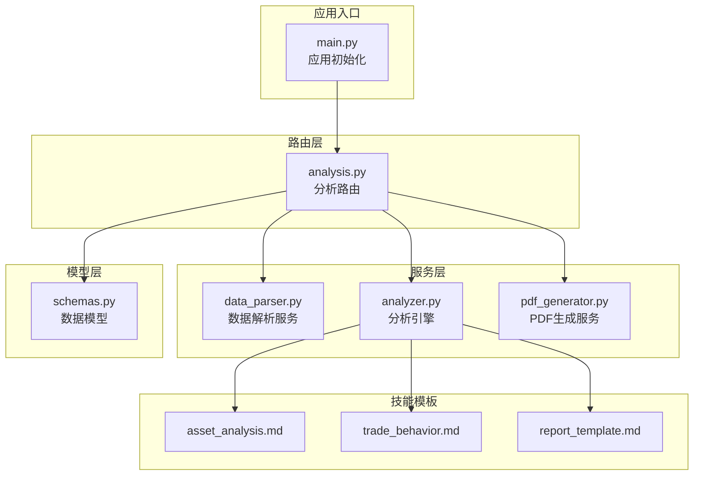
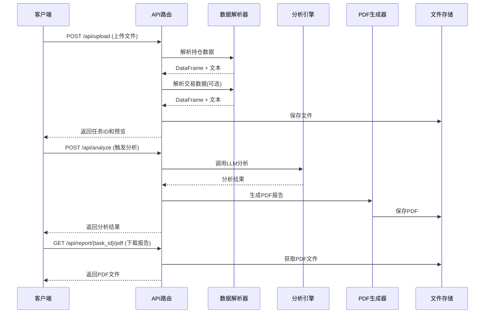
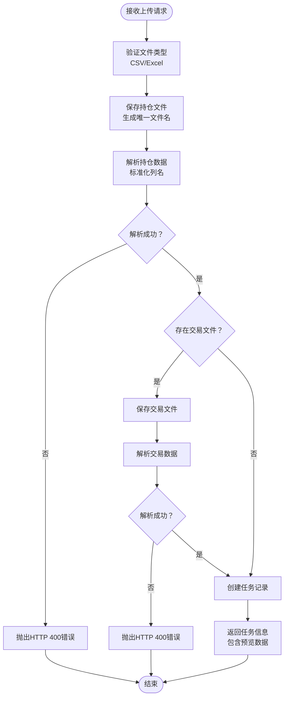
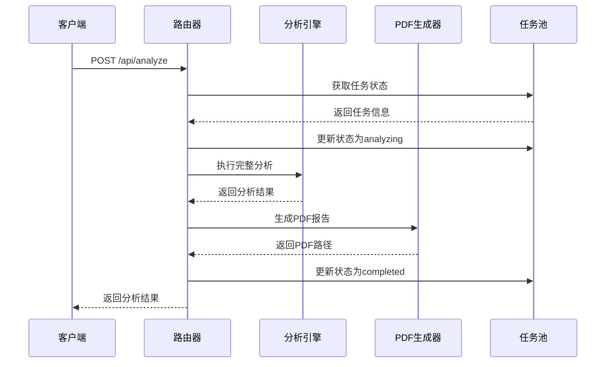
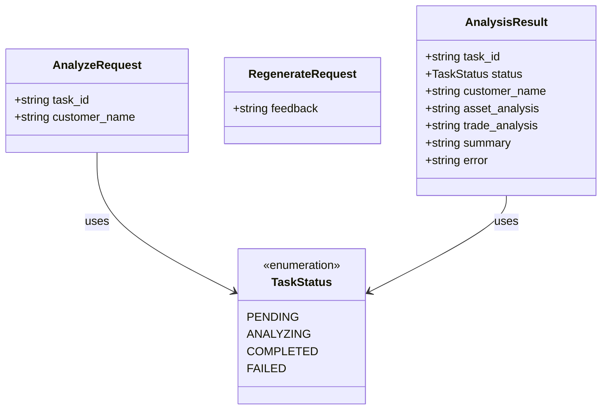
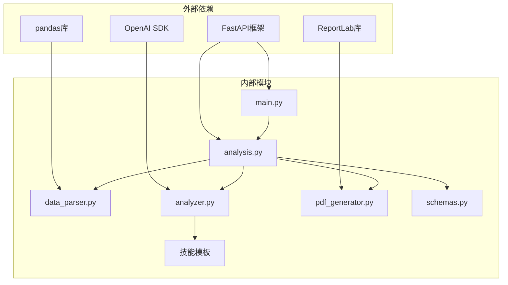

# API路由系统

<cite>
**本文档引用的文件**
- [main.py](file://backend/app/main.py)
- [analysis.py](file://backend/app/routers/analysis.py)
- [analyzer.py](file://backend/app/services/analyzer.py)
- [data_parser.py](file://backend/app/services/data_parser.py)
- [pdf_generator.py](file://backend/app/services/pdf_generator.py)
- [schemas.py](file://backend/app/models/schemas.py)
- [asset_analysis.md](file://backend/app/skills/asset_analysis.md)
- [trade_behavior.md](file://backend/app/skills/trade_behavior.md)
- [report_template.md](file://backend/app/skills/report_template.md)
- [api.js](file://frontend/src/services/api.js)
- [UploadPage.jsx](file://frontend/src/components/UploadPage.jsx)
- [ResultPage.jsx](file://frontend/src/components/ResultPage.jsx)
</cite>

## 目录
1. [简介](#简介)
2. [项目结构](#项目结构)
3. [核心组件](#核心组件)
4. [架构总览](#架构总览)
5. [详细组件分析](#详细组件分析)
6. [依赖关系分析](#依赖关系分析)
7. [性能考虑](#性能考虑)
8. [故障排除指南](#故障排除指南)
9. [结论](#结论)
10. [附录](#附录)

## 简介
本项目是一个基于FastAPI的客户资产分析工具，提供完整的文件上传、数据分析、报告生成与下载的端到端流程。系统采用异步路由设计，通过内存任务池实现状态跟踪，并集成大模型API进行智能分析，最终生成PDF报告。前端采用React+Ant Design实现用户交互，支持拖拽上传、实时状态查询和PDF下载。

## 项目结构
后端采用分层架构设计，主要包含应用入口、路由层、服务层和模型层：

**图表来源**
- [main.py:1-28](file://backend/app/main.py#L1-L28)
- [analysis.py:1-218](file://backend/app/routers/analysis.py#L1-L218)
- [data_parser.py:1-96](file://backend/app/services/data_parser.py#L1-L96)
- [analyzer.py:1-93](file://backend/app/services/analyzer.py#L1-L93)
- [pdf_generator.py:1-215](file://backend/app/services/pdf_generator.py#L1-L215)
- [schemas.py:1-30](file://backend/app/models/schemas.py#L1-L30)

**章节来源**
- [main.py:1-28](file://backend/app/main.py#L1-L28)
- [analysis.py:1-218](file://backend/app/routers/analysis.py#L1-L218)

## 核心组件
系统的核心组件包括路由控制器、数据解析器、分析引擎和PDF生成器，以及内存任务管理系统。

### 路由控制器
路由控制器负责处理所有API请求，包括文件上传、分析触发、报告下载和状态查询。采用异步设计支持并发请求处理。

### 数据解析器
数据解析器支持CSV和Excel格式的数据文件，自动识别列名并进行标准化处理，计算衍生指标如市值、盈亏等。

### 分析引擎
分析引擎集成OpenAI大模型API，通过预定义的技能模板进行专业化分析，支持资产配置分析、交易行为分析和综合报告生成。

### PDF生成器
PDF生成器使用ReportLab库生成专业的中文PDF报告，支持多字体注册和样式定制。

**章节来源**
- [analysis.py:14-23](file://backend/app/routers/analysis.py#L14-L23)
- [data_parser.py:7-52](file://backend/app/services/data_parser.py#L7-L52)
- [analyzer.py:41-92](file://backend/app/services/analyzer.py#L41-L92)
- [pdf_generator.py:146-214](file://backend/app/services/pdf_generator.py#L146-L214)

## 架构总览
系统采用事件驱动的异步架构，通过内存任务池实现状态持久化：

**图表来源**
- [analysis.py:35-83](file://backend/app/routers/analysis.py#L35-L83)
- [analysis.py:86-134](file://backend/app/routers/analysis.py#L86-L134)
- [analysis.py:137-152](file://backend/app/routers/analysis.py#L137-L152)

## 详细组件分析

### 文件上传路由
文件上传路由支持同时上传持仓和交易数据文件，采用FormData格式传输，支持CSV和Excel格式。

**图表来源**
- [analysis.py:35-83](file://backend/app/routers/analysis.py#L35-L83)
- [data_parser.py:7-52](file://backend/app/services/data_parser.py#L7-L52)
- [data_parser.py:55-95](file://backend/app/services/data_parser.py#L55-L95)

**章节来源**
- [analysis.py:35-83](file://backend/app/routers/analysis.py#L35-L83)
- [data_parser.py:7-95](file://backend/app/services/data_parser.py#L7-L95)

### 分析触发路由
分析触发路由采用异步设计，支持客户名称动态更新和反馈意见重新分析。

**图表来源**
- [analysis.py:86-134](file://backend/app/routers/analysis.py#L86-L134)
- [analyzer.py:77-92](file://backend/app/services/analyzer.py#L77-L92)
- [pdf_generator.py:146-214](file://backend/app/services/pdf_generator.py#L146-L214)

**章节来源**
- [analysis.py:86-134](file://backend/app/routers/analysis.py#L86-L134)
- [analyzer.py:77-92](file://backend/app/services/analyzer.py#L77-L92)

### 报告下载路由
报告下载路由提供PDF文件的直接下载功能，支持文件存在性验证和错误处理。

**章节来源**
- [analysis.py:137-152](file://backend/app/routers/analysis.py#L137-L152)

### 状态查询路由
状态查询路由提供实时的任务状态监控，支持部分数据返回和完整结果查询。

**章节来源**
- [analysis.py:202-217](file://backend/app/routers/analysis.py#L202-L217)

### 数据模型定义
系统定义了完整的数据模型用于请求验证和响应格式标准化。

**图表来源**
- [schemas.py:6-11](file://backend/app/models/schemas.py#L6-L11)
- [schemas.py:13-16](file://backend/app/models/schemas.py#L13-L16)
- [schemas.py:18-19](file://backend/app/models/schemas.py#L18-L19)
- [schemas.py:22-29](file://backend/app/models/schemas.py#L22-L29)

**章节来源**
- [schemas.py:1-30](file://backend/app/models/schemas.py#L1-L30)

## 依赖关系分析
系统采用清晰的分层依赖关系，各组件职责明确，耦合度低：

**图表来源**
- [main.py:2](file://backend/app/main.py#L2)
- [analysis.py:7-12](file://backend/app/routers/analysis.py#L7-L12)
- [data_parser.py:3](file://backend/app/services/data_parser.py#L3)
- [analyzer.py:4](file://backend/app/services/analyzer.py#L4)
- [pdf_generator.py:6-19](file://backend/app/services/pdf_generator.py#L6-L19)

**章节来源**
- [main.py:1-28](file://backend/app/main.py#L1-L28)
- [analysis.py:1-218](file://backend/app/routers/analysis.py#L1-L218)

## 性能考虑
系统在性能方面采用了多项优化策略：

### 异步处理机制
- 使用async/await模式支持并发请求处理
- 文件I/O操作采用异步方式避免阻塞
- 大模型API调用采用异步客户端

### 内存任务管理
- 采用字典存储任务状态，支持快速查找
- 任务数据包含预览信息减少重复解析
- 支持任务状态的原子性更新

### 缓存策略
- 数据解析结果缓存在任务对象中
- PDF文件生成后缓存文件路径
- 字段计算结果在解析阶段完成

### 错误处理优化
- 详细的异常信息记录和传播
- 用户友好的错误消息格式
- 状态回滚机制确保数据一致性

## 故障排除指南

### 常见错误类型及解决方案

#### 文件上传错误
- **错误现象**: 上传失败，返回HTTP 400错误
- **可能原因**: 文件格式不支持、文件损坏、缺少必需文件
- **解决方法**: 检查文件格式是否为CSV或Excel，确认文件完整性

#### 分析执行错误
- **错误现象**: 分析过程中出现HTTP 500错误
- **可能原因**: 大模型API连接失败、网络超时、数据格式异常
- **解决方法**: 检查OPENAI_API_KEY配置，验证网络连接，确认数据格式正确

#### 报告下载错误
- **错误现象**: 下载PDF时报HTTP 404错误
- **可能原因**: 任务不存在、PDF文件未生成、文件被清理
- **解决方法**: 确认任务ID正确，等待分析完成后下载

### 调试技巧

#### 后端调试
1. 启用详细日志记录
2. 使用Postman或curl测试API端点
3. 检查环境变量配置
4. 验证文件权限和存储空间

#### 前端调试
1. 使用浏览器开发者工具查看网络请求
2. 检查FormData数据格式
3. 验证API响应数据结构
4. 监控状态变化和错误提示

**章节来源**
- [analysis.py:54-64](file://backend/app/routers/analysis.py#L54-L64)
- [analysis.py:130-134](file://backend/app/routers/analysis.py#L130-L134)
- [analysis.py:145-146](file://backend/app/routers/analysis.py#L145-L146)

## 结论
本API路由系统实现了完整的客户资产分析工作流，具有以下特点：

1. **模块化设计**: 清晰的分层架构，职责分离明确
2. **异步处理**: 支持高并发请求，提升用户体验
3. **错误处理**: 完善的异常捕获和用户友好提示
4. **扩展性强**: 插件化的技能模板系统支持功能扩展
5. **易用性**: 简洁的API设计和直观的前端界面

系统适用于金融分析、投资咨询等场景，可通过增加更多分析维度和优化算法进一步提升分析质量。

## 附录

### API端点定义

| 方法 | 路径 | 功能 | 请求参数 | 响应数据 |
|------|------|------|----------|----------|
| POST | /api/upload | 上传文件 | holdings_file, trades_file, customer_name | task_id, 预览数据 |
| POST | /api/analyze | 触发分析 | task_id, customer_name | 分析结果 |
| POST | /api/analyze/{task_id}/regenerate | 反馈重分析 | feedback | 分析结果 |
| GET | /api/report/{task_id}/pdf | 下载PDF | 无 | PDF文件 |
| GET | /api/task/{task_id} | 查询状态 | 无 | 任务状态 |

### 环境配置
- OPENAI_API_KEY: 大模型API密钥
- OPENAI_BASE_URL: 自定义API基础URL
- OPENAI_MODEL: 模型名称，默认gpt-4o

### 前端集成
- 支持拖拽上传和批量文件选择
- 实时状态监控和进度显示
- Markdown渲染和折叠面板展示
- PDF在线预览和下载功能