# FastAPI应用配置

<cite>
**本文档引用的文件**
- [main.py](file://backend/app/main.py)
- [analysis.py](file://backend/app/routers/analysis.py)
- [analyzer.py](file://backend/app/services/analyzer.py)
- [data_parser.py](file://backend/app/services/data_parser.py)
- [pdf_generator.py](file://backend/app/services/pdf_generator.py)
- [schemas.py](file://backend/app/models/schemas.py)
- [asset_analysis.md](file://backend/app/skills/asset_analysis.md)
- [trade_behavior.md](file://backend/app/skills/trade_behavior.md)
- [report_template.md](file://backend/app/skills/report_template.md)
- [requirements.txt](file://backend/requirements.txt)
</cite>

## 目录
1. [简介](#简介)
2. [项目结构](#项目结构)
3. [核心组件](#核心组件)
4. [架构概览](#架构概览)
5. [详细组件分析](#详细组件分析)
6. [依赖关系分析](#依赖关系分析)
7. [性能考虑](#性能考虑)
8. [故障排除指南](#故障排除指南)
9. [结论](#结论)

## 简介

这是一个基于FastAPI构建的客户资产分析工具，提供了完整的资产配置分析和交易行为分析功能。该应用通过上传CSV或Excel格式的持仓数据和交易记录，利用大模型API进行智能分析，并生成专业的PDF分析报告。

## 项目结构

应用采用典型的FastAPI项目结构，主要包含以下模块：

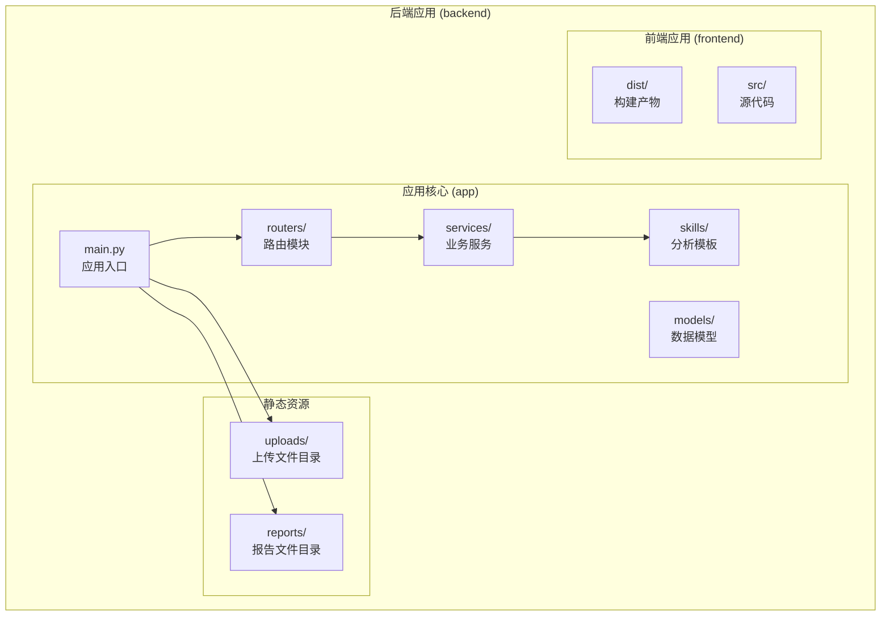

**图表来源**
- [main.py:1-28](file://backend/app/main.py#L1-L28)
- [analysis.py:1-218](file://backend/app/routers/analysis.py#L1-L218)

**章节来源**
- [main.py:1-28](file://backend/app/main.py#L1-L28)
- [requirements.txt:1-9](file://backend/requirements.txt#L1-L9)

## 核心组件

### 应用实例创建

应用实例通过FastAPI类创建，设置了应用的基本元数据信息：

- **应用名称**: "客户资产分析工具"
- **版本号**: "1.0.0"
- **描述信息**: 通过应用实例的title参数设置

应用实例创建的核心代码位于主文件中，确保了应用的统一配置和初始化。

**章节来源**
- [main.py:8](file://backend/app/main.py#L8)

### CORS中间件配置

应用配置了跨域资源共享(CORS)中间件，用于解决前后端分离开发中的跨域问题：

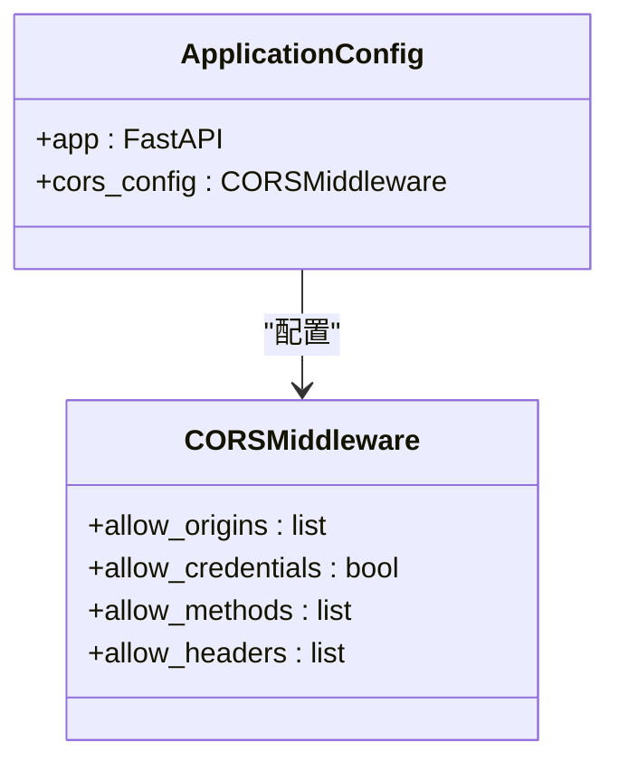

**图表来源**
- [main.py:10-16](file://backend/app/main.py#L10-L16)

CORS配置参数详解：
- **allow_origins**: 设置为["*"]，允许所有域名访问
- **allow_credentials**: 启用凭据传递
- **allow_methods**: 设置为["*"]，允许所有HTTP方法
- **allow_headers**: 设置为["*"]，允许所有请求头

**章节来源**
- [main.py:10-16](file://backend/app/main.py#L10-L16)

### 静态文件服务与目录配置

应用通过静态文件服务提供上传文件和报告文件的访问能力：

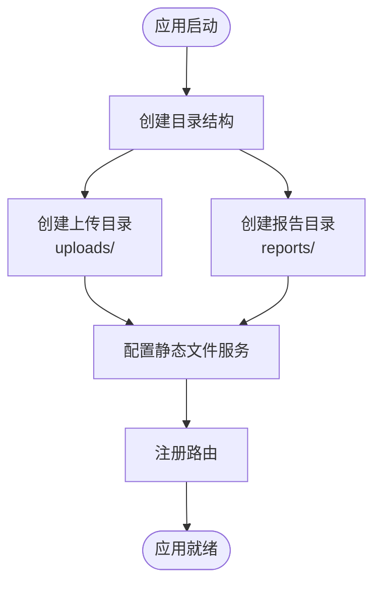

**图表来源**
- [main.py:18-23](file://backend/app/main.py#L18-L23)

目录创建逻辑：
- **上传目录**: `uploads/` - 存储用户上传的CSV/Excel文件
- **报告目录**: `reports/` - 存储生成的PDF分析报告
- **自动创建**: 使用`os.makedirs()`确保目录存在，不存在则自动创建

**章节来源**
- [main.py:18-23](file://backend/app/main.py#L18-L23)

### 路由注册过程

应用通过`include_router()`方法注册分析相关的API路由：

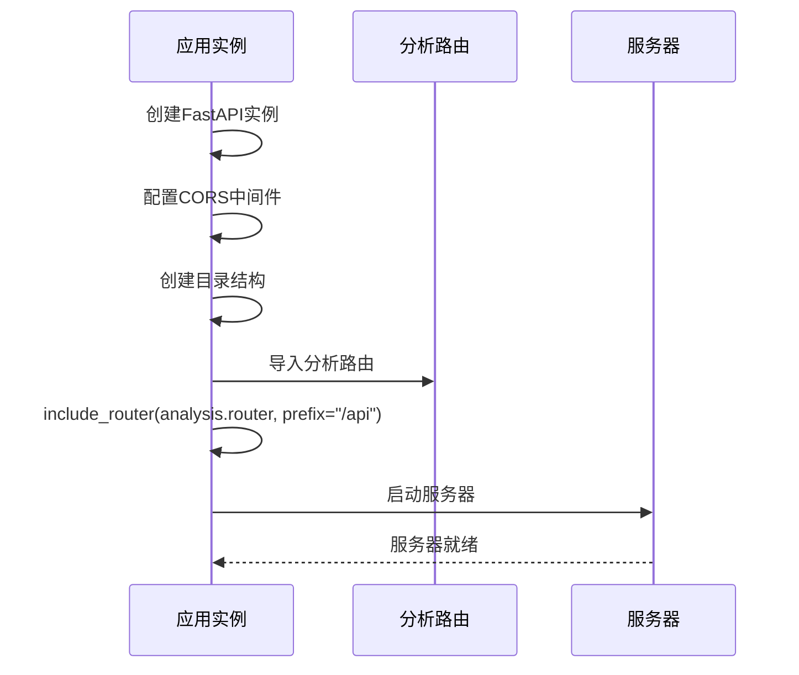

**图表来源**
- [main.py:23](file://backend/app/main.py#L23)

路由注册特点：
- **路由前缀**: `/api` - 所有分析相关接口都带有/api前缀
- **路由模块**: `analysis.router` - 包含所有分析相关的API端点

**章节来源**
- [main.py:23](file://backend/app/main.py#L23)

### 主应用入口启动

应用提供了直接运行的入口点，使用Uvicorn作为ASGI服务器：

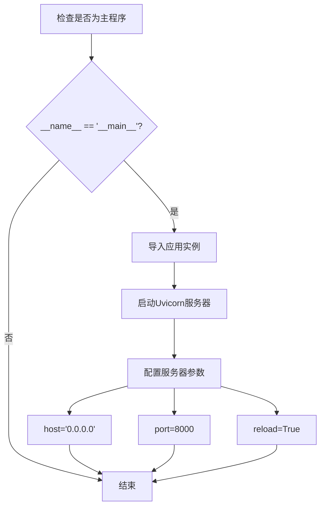

**图表来源**
- [main.py:25-27](file://backend/app/main.py#L25-L27)

服务器配置参数：
- **主机地址**: `0.0.0.0` - 监听所有网络接口
- **端口号**: `8000` - 默认API端口
- **热重载**: `True` - 开发模式下的自动重启

**章节来源**
- [main.py:25-27](file://backend/app/main.py#L25-L27)

## 架构概览

应用采用分层架构设计，清晰分离了不同职责的模块：

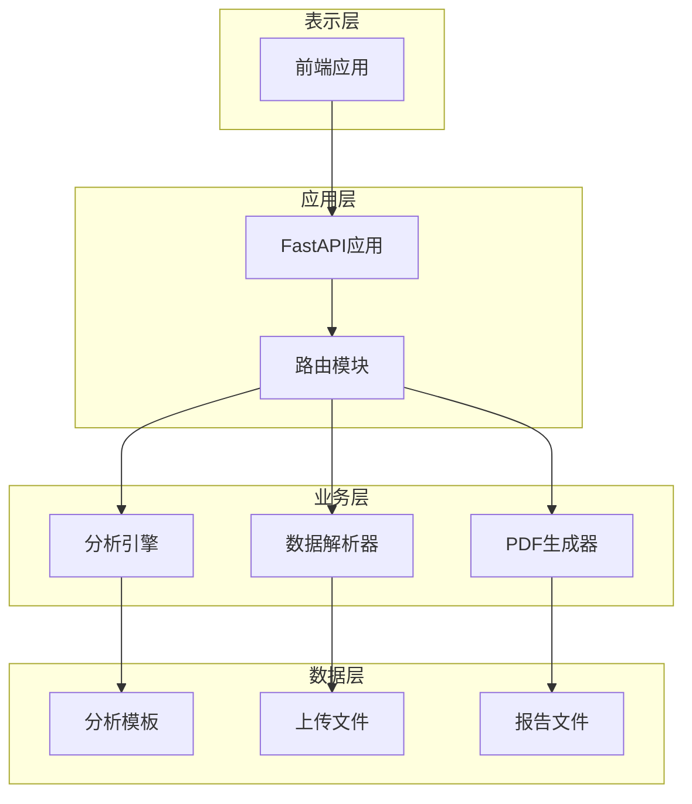

**图表来源**
- [main.py:1-28](file://backend/app/main.py#L1-L28)
- [analysis.py:1-218](file://backend/app/routers/analysis.py#L1-L218)

## 详细组件分析

### 分析路由模块

分析路由模块提供了完整的资产分析工作流，包含文件上传、分析执行和报告下载功能：

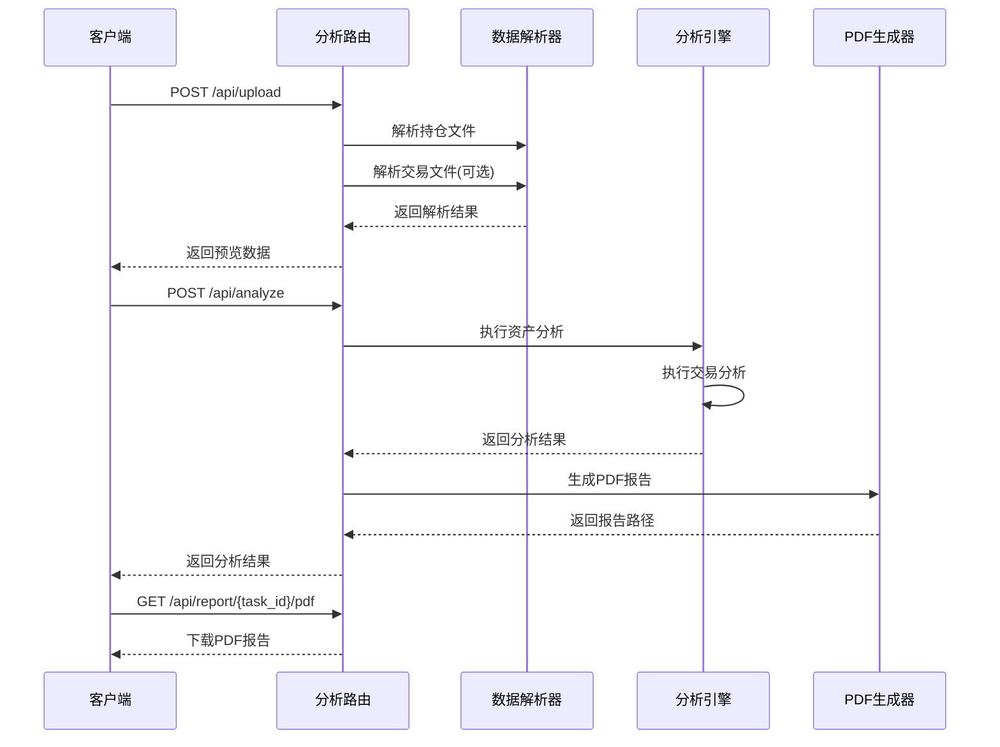

**图表来源**
- [analysis.py:35-152](file://backend/app/routers/analysis.py#L35-L152)

路由端点功能：
- **文件上传**: `/api/upload` - 支持CSV/Excel格式的持仓和交易数据上传
- **分析执行**: `/api/analyze` - 触发完整的资产分析流程
- **报告下载**: `/api/report/{task_id}/pdf` - 下载生成的PDF报告
- **任务查询**: `/api/task/{task_id}` - 查询分析任务状态

**章节来源**
- [analysis.py:35-218](file://backend/app/routers/analysis.py#L35-L218)

### 数据解析服务

数据解析服务负责将用户上传的CSV/Excel文件转换为结构化的数据格式：

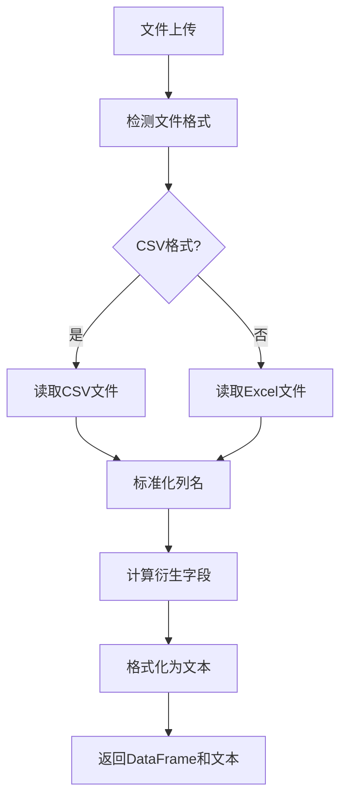

**图表来源**
- [data_parser.py:7-52](file://backend/app/services/data_parser.py#L7-L52)

解析功能特点：
- **多格式支持**: 自动识别CSV和Excel格式
- **列名标准化**: 将中文列名映射到英文字段名
- **衍生字段计算**: 自动计算市值、盈亏等衍生指标
- **文本格式化**: 生成适合LLM分析的文本格式

**章节来源**
- [data_parser.py:7-96](file://backend/app/services/data_parser.py#L7-L96)

### 分析引擎服务

分析引擎服务集成了大模型API，提供专业的资产分析能力：

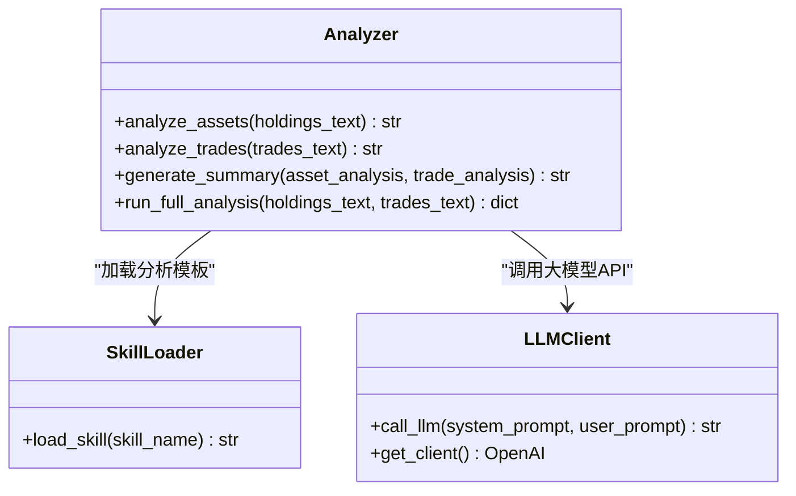

**图表来源**
- [analyzer.py:41-93](file://backend/app/services/analyzer.py#L41-L93)

分析功能：
- **资产配置分析**: 分析持仓结构、集中度、风险敞口等
- **交易行为分析**: 评估交易频率、择时能力、止盈止损习惯
- **综合报告生成**: 基于分析结果生成专业的综合报告
- **反馈机制**: 支持根据客户经理反馈重新生成分析

**章节来源**
- [analyzer.py:1-93](file://backend/app/services/analyzer.py#L1-L93)

### PDF报告生成服务

PDF报告生成服务提供了专业的报告输出功能：

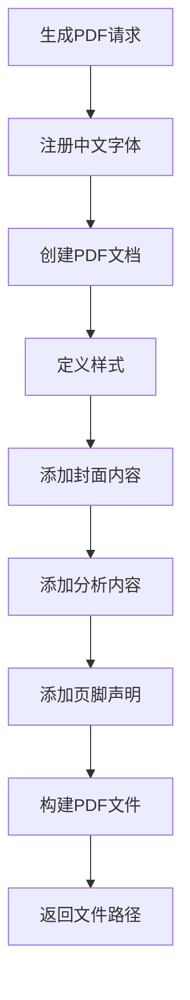

**图表来源**
- [pdf_generator.py:146-215](file://backend/app/services/pdf_generator.py#L146-L215)

PDF生成特性：
- **中文字体支持**: 自动检测并注册系统字体
- **多级标题**: 支持从一级到三级的标题层次
- **列表格式**: 支持有序和无序列表
- **样式定制**: 提供专业的排版样式和颜色方案

**章节来源**
- [pdf_generator.py:1-215](file://backend/app/services/pdf_generator.py#L1-L215)

## 依赖关系分析

应用的依赖关系体现了清晰的模块化设计：

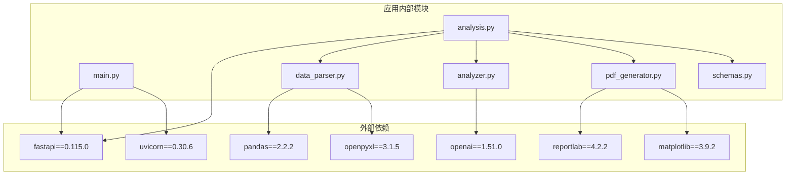

**图表来源**
- [requirements.txt:1-9](file://backend/requirements.txt#L1-L9)
- [main.py:1-6](file://backend/app/main.py#L1-L6)

**章节来源**
- [requirements.txt:1-9](file://backend/requirements.txt#L1-L9)

## 性能考虑

### 内存管理
- **文件上传**: 使用流式写入避免大文件内存溢出
- **数据处理**: 使用pandas进行高效的数据处理
- **缓存策略**: 使用内存字典存储分析任务状态

### 并发处理
- **异步路由**: 所有路由函数都使用async定义
- **文件I/O**: 异步文件操作减少阻塞
- **API调用**: 大模型API调用采用异步模式

### 资源优化
- **字体注册**: 字体注册只执行一次，避免重复开销
- **目录创建**: 使用exist_ok参数避免重复创建
- **错误处理**: 及时清理临时文件和资源

## 故障排除指南

### 常见问题及解决方案

**CORS跨域问题**
- 检查CORS配置是否正确
- 确认前端请求的Origin是否在允许列表中
- 生产环境中建议限制具体的域名而非使用通配符

**文件上传失败**
- 检查上传目录权限
- 确认文件格式是否为CSV或Excel
- 验证文件大小限制

**PDF生成错误**
- 确认中文字体安装
- 检查报告目录权限
- 验证生成的Markdown格式

**章节来源**
- [main.py:10-16](file://backend/app/main.py#L10-L16)
- [analysis.py:25-32](file://backend/app/routers/analysis.py#L25-L32)
- [pdf_generator.py:26-51](file://backend/app/services/pdf_generator.py#L26-L51)

## 结论

该FastAPI应用配置展现了现代Python Web应用的最佳实践：

1. **清晰的架构设计**: 采用分层架构，职责分离明确
2. **完善的配置管理**: CORS、静态文件、路由注册等配置完整
3. **专业的业务功能**: 提供完整的资产分析和报告生成功能
4. **良好的扩展性**: 模块化设计便于功能扩展和维护

推荐的改进方向：
- 添加数据库支持替代内存存储
- 实现更精细的权限控制
- 增加API文档和测试覆盖
- 优化生产环境部署配置