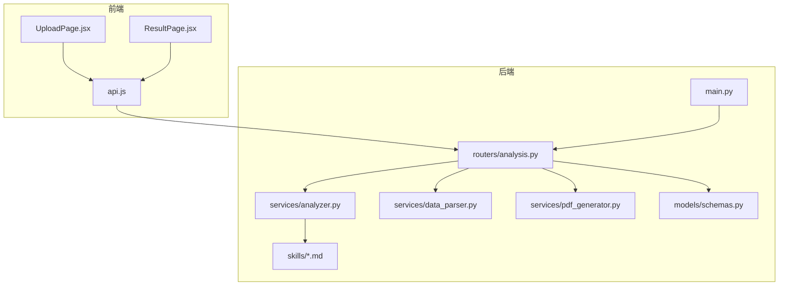
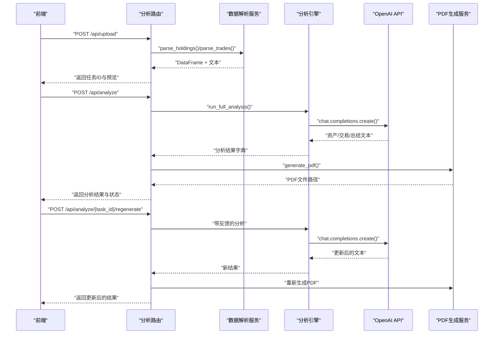
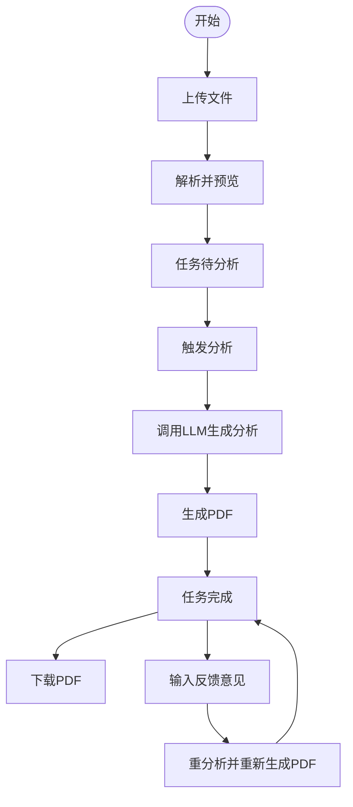
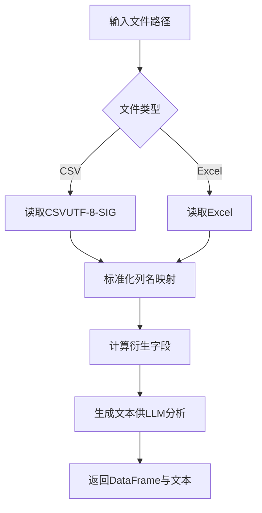
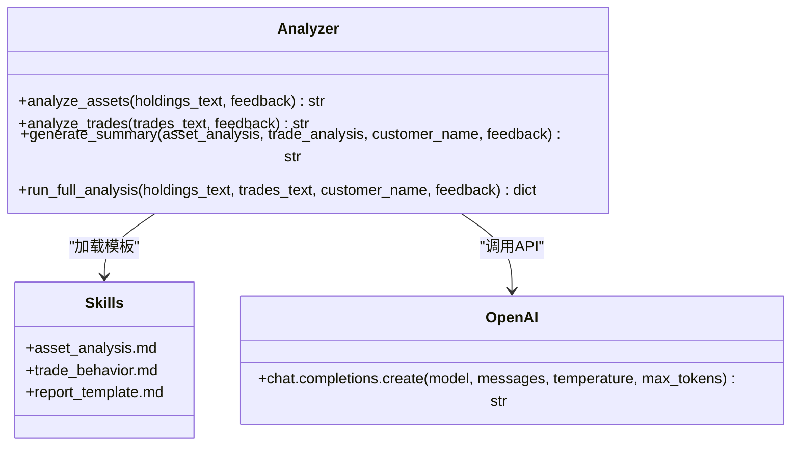
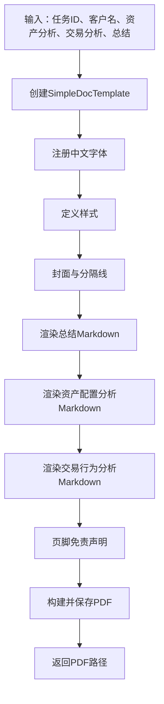
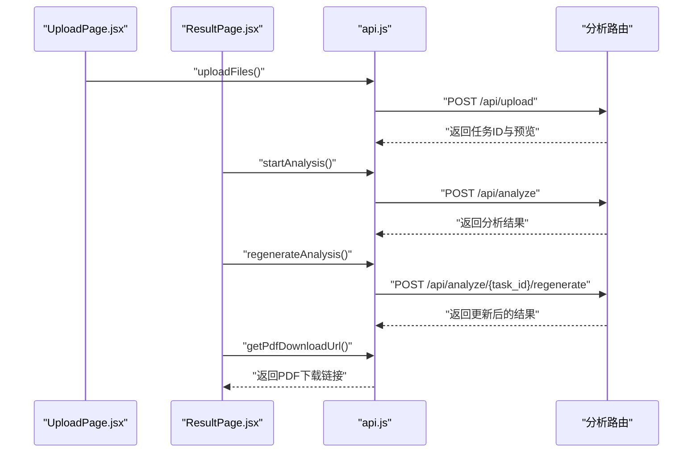
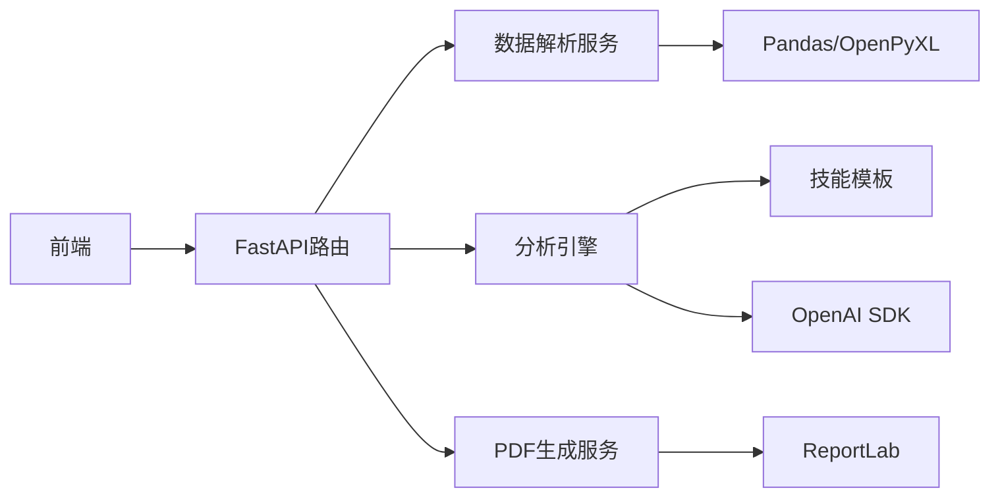

# LLM分析引擎

<cite>
**本文引用的文件**
- [backend/app/main.py](file://backend/app/main.py)
- [backend/app/routers/analysis.py](file://backend/app/routers/analysis.py)
- [backend/app/services/analyzer.py](file://backend/app/services/analyzer.py)
- [backend/app/services/data_parser.py](file://backend/app/services/data_parser.py)
- [backend/app/services/pdf_generator.py](file://backend/app/services/pdf_generator.py)
- [backend/app/models/schemas.py](file://backend/app/models/schemas.py)
- [backend/app/skills/report_template.md](file://backend/app/skills/report_template.md)
- [backend/app/skills/asset_analysis.md](file://backend/app/skills/asset_analysis.md)
- [backend/app/skills/trade_behavior.md](file://backend/app/skills/trade_behavior.md)
- [backend/requirements.txt](file://backend/requirements.txt)
- [frontend/src/services/api.js](file://frontend/src/services/api.js)
- [frontend/src/components/UploadPage.jsx](file://frontend/src/components/UploadPage.jsx)
- [frontend/src/components/ResultPage.jsx](file://frontend/src/components/ResultPage.jsx)
</cite>

## 目录
1. [简介](#简介)
2. [项目结构](#项目结构)
3. [核心组件](#核心组件)
4. [架构总览](#架构总览)
5. [详细组件分析](#详细组件分析)
6. [依赖分析](#依赖分析)
7. [性能考虑](#性能考虑)
8. [故障排查指南](#故障排查指南)
9. [结论](#结论)
10. [附录](#附录)

## 简介
本项目是一个基于大语言模型（LLM）的“客户资产分析”引擎，提供从数据上传、解析、LLM分析到PDF报告生成的完整工作流。系统通过FastAPI提供REST接口，前端采用React+Ant Design实现用户交互。分析能力覆盖两大主题：
- 资产配置分析：从资产类别、行业分布、集中度、风险敞口、收益归因等维度评估客户持仓。
- 交易行为分析：从交易频率、择时能力、止盈止损习惯、交易成本等维度评估客户交易行为。

系统支持反馈重分析功能，允许客户经理基于意见对分析结果进行定向修正，同时提供统一的报告模板，确保输出结构化、可读性强且可导出PDF。

## 项目结构
后端采用FastAPI + Python，前端采用React。核心模块划分如下：
- 应用入口与中间件：应用启动、CORS、静态资源挂载、路由注册
- 路由层：对外暴露上传、分析、下载PDF、重分析、任务状态查询等接口
- 服务层：数据解析、LLM分析、PDF生成
- 技能模板：资产配置分析、交易行为分析、综合报告模板
- 模型与校验：Pydantic模型定义任务状态与请求/响应结构
- 前端：上传页面、结果页面、API封装

图表来源
- [backend/app/main.py:1-28](file://backend/app/main.py#L1-L28)
- [backend/app/routers/analysis.py:1-218](file://backend/app/routers/analysis.py#L1-L218)
- [backend/app/services/analyzer.py:1-93](file://backend/app/services/analyzer.py#L1-L93)
- [backend/app/services/data_parser.py:1-96](file://backend/app/services/data_parser.py#L1-L96)
- [backend/app/services/pdf_generator.py:1-215](file://backend/app/services/pdf_generator.py#L1-L215)
- [backend/app/models/schemas.py:1-30](file://backend/app/models/schemas.py#L1-L30)
- [backend/app/skills/report_template.md:1-34](file://backend/app/skills/report_template.md#L1-L34)
- [backend/app/skills/asset_analysis.md:1-35](file://backend/app/skills/asset_analysis.md#L1-L35)
- [backend/app/skills/trade_behavior.md:1-34](file://backend/app/skills/trade_behavior.md#L1-L34)

章节来源
- [backend/app/main.py:1-28](file://backend/app/main.py#L1-L28)
- [backend/app/routers/analysis.py:1-218](file://backend/app/routers/analysis.py#L1-L218)

## 核心组件
- 应用入口与中间件
  - 启动FastAPI应用，配置CORS允许跨域访问，挂载静态文件目录，注册分析路由，提供开发服务器运行入口。
- 路由层（分析API）
  - 上传接口：接收持仓与交易文件，解析并预览，生成任务ID并缓存文本内容。
  - 分析接口：触发完整分析流程，调用LLM生成资产配置分析、交易行为分析与综合报告，并生成PDF。
  - 重分析接口：根据客户经理反馈意见，再次调用LLM生成新结果并更新PDF。
  - 下载PDF接口：返回已生成的PDF文件。
  - 任务状态查询：返回任务状态与结果摘要。
- 服务层
  - 数据解析：支持CSV/Excel，标准化列名，计算衍生字段，生成LLM可读文本。
  - LLM分析：加载技能模板，构造system/user提示词，调用OpenAI Chat Completions接口，返回结构化分析结果。
  - PDF生成：注册中文字体，将Markdown内容渲染为PDF，包含封面、分节与免责声明。
- 模型与校验
  - Pydantic模型定义任务状态枚举、请求与响应结构，保证接口契约清晰。
- 技能模板
  - 资产配置分析模板：定义分析维度与输出要求。
  - 交易行为分析模板：定义分析维度与输出要求。
  - 综合报告模板：定义报告结构与输出规范。

章节来源
- [backend/app/main.py:1-28](file://backend/app/main.py#L1-L28)
- [backend/app/routers/analysis.py:1-218](file://backend/app/routers/analysis.py#L1-L218)
- [backend/app/services/analyzer.py:1-93](file://backend/app/services/analyzer.py#L1-L93)
- [backend/app/services/data_parser.py:1-96](file://backend/app/services/data_parser.py#L1-L96)
- [backend/app/services/pdf_generator.py:1-215](file://backend/app/services/pdf_generator.py#L1-L215)
- [backend/app/models/schemas.py:1-30](file://backend/app/models/schemas.py#L1-L30)
- [backend/app/skills/report_template.md:1-34](file://backend/app/skills/report_template.md#L1-L34)
- [backend/app/skills/asset_analysis.md:1-35](file://backend/app/skills/asset_analysis.md#L1-L35)
- [backend/app/skills/trade_behavior.md:1-34](file://backend/app/skills/trade_behavior.md#L1-L34)

## 架构总览
系统采用前后端分离架构，后端负责数据处理与LLM推理，前端负责用户交互与结果展示。核心流程：
- 用户上传文件 → 后端解析并缓存文本 → 触发分析 → LLM生成分析结果 → 生成PDF → 下载PDF
- 可选：根据反馈意见重新生成分析与PDF

图表来源
- [backend/app/routers/analysis.py:35-218](file://backend/app/routers/analysis.py#L35-L218)
- [backend/app/services/analyzer.py:77-93](file://backend/app/services/analyzer.py#L77-L93)
- [backend/app/services/pdf_generator.py:146-215](file://backend/app/services/pdf_generator.py#L146-L215)

## 详细组件分析

### 路由与任务管理
- 任务存储：内存字典用于缓存任务元数据（状态、路径、文本、结果），生产环境建议替换为持久化存储。
- 上传流程：保存文件、解析预览、生成任务ID并缓存文本。
- 分析流程：读取缓存文本，调用分析引擎，生成PDF，更新任务状态与结果。
- 重分析流程：接收反馈意见，重复分析与PDF生成过程。
- 状态查询：返回任务状态与结果摘要。

图表来源
- [backend/app/routers/analysis.py:35-218](file://backend/app/routers/analysis.py#L35-L218)

章节来源
- [backend/app/routers/analysis.py:16-218](file://backend/app/routers/analysis.py#L16-L218)

### 数据解析服务
- 支持CSV/Excel，自动识别中文列名并标准化为英文字段名。
- 自动计算衍生字段：市值、浮动盈亏、盈亏比例（持仓）、成交金额（交易）。
- 将结构化数据转为自然语言文本，供LLM分析使用。

图表来源
- [backend/app/services/data_parser.py:7-96](file://backend/app/services/data_parser.py#L7-L96)

章节来源
- [backend/app/services/data_parser.py:1-96](file://backend/app/services/data_parser.py#L1-L96)

### 分析引擎（LLM集成）
- 技能模板加载：从skills目录读取资产配置、交易行为、综合报告模板。
- 客户端初始化：从环境变量读取API密钥、基础URL、模型名称，默认模型为gpt-4o。
- 请求参数：temperature=0.7，max_tokens=4000，确保输出稳定且足够长。
- 分析流程：分别调用资产分析与交易行为分析，再汇总生成综合报告。
- 反馈机制：将反馈意见拼接到user prompt末尾，驱动重分析。

图表来源
- [backend/app/services/analyzer.py:11-93](file://backend/app/services/analyzer.py#L11-L93)
- [backend/app/skills/asset_analysis.md:1-35](file://backend/app/skills/asset_analysis.md#L1-L35)
- [backend/app/skills/trade_behavior.md:1-34](file://backend/app/skills/trade_behavior.md#L1-L34)
- [backend/app/skills/report_template.md:1-34](file://backend/app/skills/report_template.md#L1-L34)

章节来源
- [backend/app/services/analyzer.py:1-93](file://backend/app/services/analyzer.py#L1-L93)

### PDF生成服务
- 字体注册：尝试多种系统字体路径，若失败回退至默认字体。
- 样式定义：标题、副标题、小节标题、正文等样式，支持中文。
- 内容渲染：将Markdown转换为ReportLab Flowable元素，组织封面、分节与免责声明。
- 输出：生成A4尺寸PDF，返回文件路径。

图表来源
- [backend/app/services/pdf_generator.py:146-215](file://backend/app/services/pdf_generator.py#L146-L215)

章节来源
- [backend/app/services/pdf_generator.py:1-215](file://backend/app/services/pdf_generator.py#L1-L215)

### 前端交互与API封装
- 上传页面：支持拖拽上传持仓与交易文件，预览前10条数据，收集客户名称。
- 结果页面：展示分析结果（Markdown折叠面板），提供下载PDF与反馈重分析入口。
- API封装：统一基地址、超时设置（5分钟），封装上传、分析、重分析、下载、状态查询。

图表来源
- [frontend/src/components/UploadPage.jsx:1-145](file://frontend/src/components/UploadPage.jsx#L1-L145)
- [frontend/src/components/ResultPage.jsx:1-193](file://frontend/src/components/ResultPage.jsx#L1-L193)
- [frontend/src/services/api.js:1-41](file://frontend/src/services/api.js#L1-L41)
- [backend/app/routers/analysis.py:35-218](file://backend/app/routers/analysis.py#L35-L218)

章节来源
- [frontend/src/components/UploadPage.jsx:1-145](file://frontend/src/components/UploadPage.jsx#L1-L145)
- [frontend/src/components/ResultPage.jsx:1-193](file://frontend/src/components/ResultPage.jsx#L1-L193)
- [frontend/src/services/api.js:1-41](file://frontend/src/services/api.js#L1-L41)

## 依赖分析
- 外部依赖
  - FastAPI：Web框架与路由
  - OpenAI SDK：调用Chat Completions接口
  - ReportLab：PDF生成
  - Pandas + OpenPyXL：CSV/Excel解析
  - Matplotlib：绘图（预留）
- 内部模块耦合
  - 路由层依赖解析与分析服务，分析服务依赖技能模板，PDF服务依赖分析结果。
  - 前端通过HTTP与后端交互，不直接依赖后端业务逻辑。

图表来源
- [backend/requirements.txt:1-9](file://backend/requirements.txt#L1-L9)
- [backend/app/routers/analysis.py:10-12](file://backend/app/routers/analysis.py#L10-L12)
- [backend/app/services/analyzer.py:4,28](file://backend/app/services/analyzer.py#L4,L28)
- [backend/app/services/pdf_generator.py:9,18](file://backend/app/services/pdf_generator.py#L9,L18)
- [backend/app/services/data_parser.py:3,12](file://backend/app/services/data_parser.py#L3,L12)

章节来源
- [backend/requirements.txt:1-9](file://backend/requirements.txt#L1-L9)

## 性能考虑
- 并发与内存
  - 当前使用内存字典缓存任务，建议在生产环境替换为Redis或数据库，避免多实例间状态丢失。
- I/O与解析
  - CSV/Excel解析与文本生成在单次请求内完成，建议限制文件大小与行数，防止内存压力过大。
- LLM调用
  - 控制max_tokens与temperature，避免过长上下文导致延迟与费用上升；可考虑分段分析或缓存常用提示词。
- PDF生成
  - 中文字体注册仅一次，注意并发场景下的线程安全；复杂表格与图片会增加生成时间。
- 前端体验
  - 分析接口超时设为5分钟，适合长耗时任务；建议在前端增加轮询或WebSocket通知任务状态。

[本节为通用性能建议，无需特定文件引用]

## 故障排查指南
- 上传失败
  - 检查文件格式（CSV/Excel），确认必填字段存在；查看后端解析异常信息。
- 分析失败
  - 查看任务状态与错误详情；检查OpenAI API密钥、基础URL与模型名称是否正确；确认网络连通性。
- PDF下载失败
  - 确认报告已生成且文件存在；检查任务ID是否正确。
- 反馈重分析无效
  - 确认反馈内容非空；检查LLM返回是否包含预期调整点。
- 字体显示异常
  - 系统未找到可用中文字体时会回退至默认字体；可在目标系统安装中文字体并确保路径正确。

章节来源
- [backend/app/routers/analysis.py:54-64](file://backend/app/routers/analysis.py#L54-L64)
- [backend/app/routers/analysis.py:130-134](file://backend/app/routers/analysis.py#L130-L134)
- [backend/app/services/pdf_generator.py:26-51](file://backend/app/services/pdf_generator.py#L26-L51)

## 结论
本系统通过清晰的模块划分与模板化的技能设计，实现了从数据上传到LLM分析再到PDF报告输出的完整闭环。资产配置分析与交易行为分析分别由独立模板驱动，综合报告模板确保输出结构一致。反馈重分析机制增强了人机协作能力。建议在生产环境中完善任务持久化、限流与监控，以提升稳定性与可观测性。

[本节为总结性内容，无需特定文件引用]

## 附录

### API定义与数据结构
- 上传文件
  - 方法与路径：POST /api/upload
  - 请求体：multipart/form-data，字段包括持仓文件（必填）、交易文件（可选）、客户名称
  - 返回：任务ID、预览数据、消息
- 触发分析
  - 方法与路径：POST /api/analyze
  - 请求体：表单字段task_id、customer_name（可选）
  - 返回：任务状态、资产分析、交易分析、综合报告
- 重分析
  - 方法与路径：POST /api/analyze/{task_id}/regenerate
  - 请求体：表单字段feedback
  - 返回：任务状态、资产分析、交易分析、综合报告
- 下载PDF
  - 方法与路径：GET /api/report/{task_id}/pdf
  - 返回：PDF文件
- 查询任务状态
  - 方法与路径：GET /api/task/{task_id}
  - 返回：任务状态与结果摘要

章节来源
- [backend/app/routers/analysis.py:35-218](file://backend/app/routers/analysis.py#L35-L218)

### 环境变量与配置
- OPENAI_API_KEY：OpenAI API密钥
- OPENAI_BASE_URL：OpenAI兼容服务的基础URL（可选）
- OPENAI_MODEL：模型名称，默认gpt-4o
- 上传与报告目录：应用自动创建uploads与reports目录

章节来源
- [backend/app/services/analyzer.py:18-22](file://backend/app/services/analyzer.py#L18-L22)
- [backend/app/main.py:18-21](file://backend/app/main.py#L18-L21)
- [backend/app/routers/analysis.py:19-22](file://backend/app/routers/analysis.py#L19-L22)

### 技能模板使用与自定义
- 资产配置分析模板：定义分析维度与输出要求，建议按需扩展行业/区域风险维度。
- 交易行为分析模板：定义分析维度与输出要求，建议加入换手率、最大回撤等指标。
- 综合报告模板：定义报告结构与输出规范，确保语言风格与可读性。

章节来源
- [backend/app/skills/asset_analysis.md:1-35](file://backend/app/skills/asset_analysis.md#L1-L35)
- [backend/app/skills/trade_behavior.md:1-34](file://backend/app/skills/trade_behavior.md#L1-L34)
- [backend/app/skills/report_template.md:1-34](file://backend/app/skills/report_template.md#L1-L34)

### 错误处理策略
- 输入校验：文件格式与必填字段缺失时返回400错误。
- 解析异常：捕获解析异常并返回错误详情。
- 分析异常：捕获LLM调用异常，标记任务失败并记录错误。
- PDF生成异常：确保目录存在与文件写入权限，避免IO错误。

章节来源
- [backend/app/routers/analysis.py:54-64](file://backend/app/routers/analysis.py#L54-L64)
- [backend/app/routers/analysis.py:130-134](file://backend/app/routers/analysis.py#L130-L134)
- [backend/app/services/pdf_generator.py:155](file://backend/app/services/pdf_generator.py#L155)