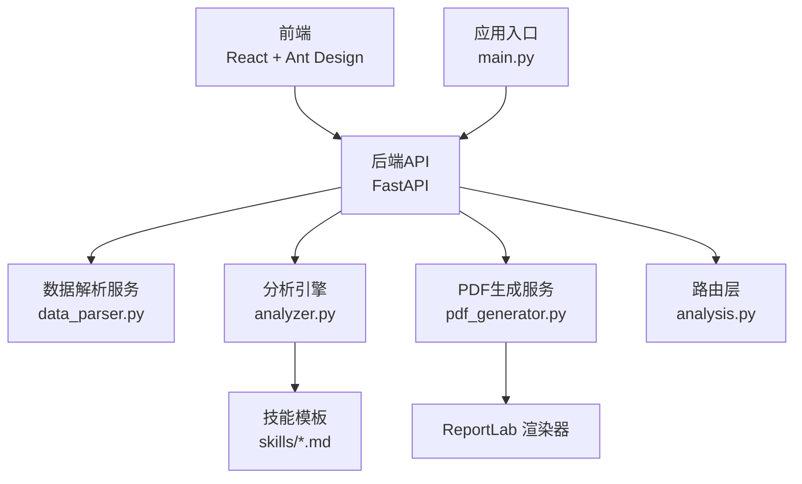
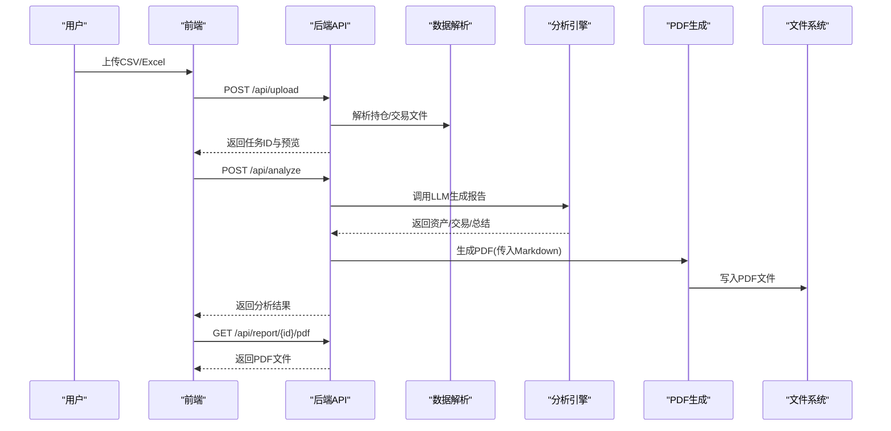
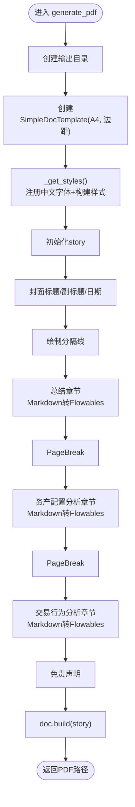
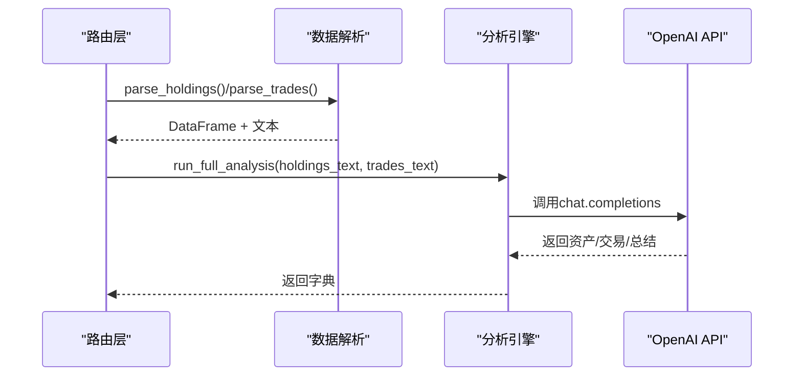
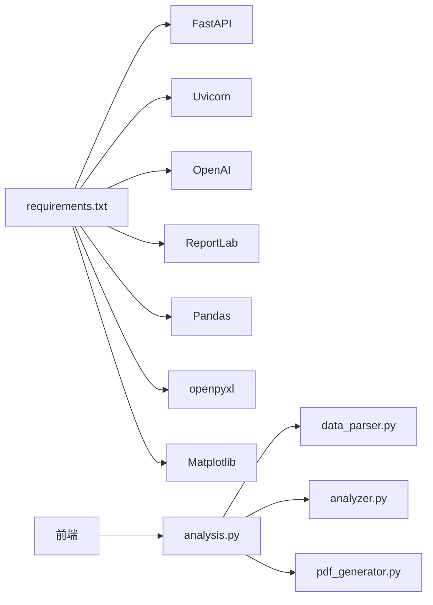

# PDF报告生成

<cite>
**本文引用的文件**
- [backend/app/services/pdf_generator.py](file://backend/app/services/pdf_generator.py)
- [backend/app/skills/report_template.md](file://backend/app/skills/report_template.md)
- [backend/app/routers/analysis.py](file://backend/app/routers/analysis.py)
- [backend/app/main.py](file://backend/app/main.py)
- [backend/app/services/analyzer.py](file://backend/app/services/analyzer.py)
- [backend/app/services/data_parser.py](file://backend/app/services/data_parser.py)
- [backend/app/skills/asset_analysis.md](file://backend/app/skills/asset_analysis.md)
- [backend/app/skills/trade_behavior.md](file://backend/app/skills/trade_behavior.md)
- [backend/requirements.txt](file://backend/requirements.txt)
- [frontend/src/App.jsx](file://frontend/src/App.jsx)
- [frontend/src/services/api.js](file://frontend/src/services/api.js)
- [frontend/src/components/UploadPage.jsx](file://frontend/src/components/UploadPage.jsx)
- [frontend/src/components/ResultPage.jsx](file://frontend/src/components/ResultPage.jsx)
</cite>

## 目录
1. [简介](#简介)
2. [项目结构](#项目结构)
3. [核心组件](#核心组件)
4. [架构总览](#架构总览)
5. [详细组件分析](#详细组件分析)
6. [依赖关系分析](#依赖关系分析)
7. [性能考虑](#性能考虑)
8. [故障排查指南](#故障排查指南)
9. [结论](#结论)
10. [附录](#附录)

## 简介
本文件围绕“PDF报告生成”功能，系统梳理从数据上传、解析、LLM分析到PDF渲染的完整链路，重点解释：
- 报告模板设计与渲染机制（Markdown到PDF）
- 中文字体支持与字体选择策略
- 报告样式定制与CSS应用方式
- 页面布局、边距与分页处理
- 性能优化建议与错误处理机制
- 实际模板示例与自定义指南

## 项目结构
后端采用FastAPI + ReportLab实现PDF生成，前端基于React + Ant Design提供交互界面。整体流程为：前端上传CSV/Excel文件 → 后端解析为结构化文本 → 调用大模型生成Markdown报告 → 后端将Markdown转换为PDF并提供下载。

图表来源
- [backend/app/main.py:1-28](file://backend/app/main.py#L1-L28)
- [backend/app/routers/analysis.py:1-218](file://backend/app/routers/analysis.py#L1-L218)
- [backend/app/services/data_parser.py:1-96](file://backend/app/services/data_parser.py#L1-L96)
- [backend/app/services/analyzer.py:1-93](file://backend/app/services/analyzer.py#L1-L93)
- [backend/app/services/pdf_generator.py:1-215](file://backend/app/services/pdf_generator.py#L1-L215)

章节来源
- [backend/app/main.py:1-28](file://backend/app/main.py#L1-L28)
- [backend/app/routers/analysis.py:1-218](file://backend/app/routers/analysis.py#L1-L218)

## 核心组件
- PDF生成服务：负责注册中文字体、构建样式、解析Markdown并渲染为PDF。
- 分析引擎：加载技能模板，调用大模型生成资产配置、交易行为与综合报告。
- 数据解析服务：解析CSV/Excel为DataFrame，并格式化为LLM可读文本。
- 路由层：提供上传、分析、下载PDF等REST接口。
- 前端组件：上传页面、结果页面、API封装。

章节来源
- [backend/app/services/pdf_generator.py:1-215](file://backend/app/services/pdf_generator.py#L1-L215)
- [backend/app/services/analyzer.py:1-93](file://backend/app/services/analyzer.py#L1-L93)
- [backend/app/services/data_parser.py:1-96](file://backend/app/services/data_parser.py#L1-L96)
- [backend/app/routers/analysis.py:1-218](file://backend/app/routers/analysis.py#L1-L218)
- [frontend/src/components/UploadPage.jsx:1-145](file://frontend/src/components/UploadPage.jsx#L1-L145)
- [frontend/src/components/ResultPage.jsx:1-193](file://frontend/src/components/ResultPage.jsx#L1-L193)

## 架构总览
下图展示从用户上传到PDF下载的关键调用序列。

图表来源
- [backend/app/routers/analysis.py:35-152](file://backend/app/routers/analysis.py#L35-L152)
- [backend/app/services/data_parser.py:7-96](file://backend/app/services/data_parser.py#L7-L96)
- [backend/app/services/analyzer.py:77-93](file://backend/app/services/analyzer.py#L77-L93)
- [backend/app/services/pdf_generator.py:146-215](file://backend/app/services/pdf_generator.py#L146-L215)

## 详细组件分析

### PDF生成服务（Markdown到PDF）
- 字体注册与回退策略
  - 在多平台尝试注册常用中文字体（Windows、Linux、macOS），若均失败则回退至Helvetica。
  - 注册后统一使用“ChineseFont”作为中文字体名称，否则回退为“Helvetica”。

- 样式体系
  - 基于ReportLab内置样式表扩展，新增标题、副标题、子标题、正文等样式，设置字号、行距、对齐、颜色等。
  - 中文字体启用后，所有样式默认使用该字体，确保中文正常显示。

- Markdown到Flowables转换
  - 支持标题（#、##、###）、无序列表（- 或 *）、有序列表（数字点）、粗体（**加粗**）。
  - 将Markdown逐行解析为Paragraph、Spacer、PageBreak等元素，形成PDF故事流。

- 页面布局与分页
  - A4页面，设置左右上下面距，封面标题后插入分隔线，随后按“总结”、“资产配置分析”、“交易行为分析”三节排版。
  - 使用PageBreak进行自然分页，页脚添加免责声明。

- 输出与返回
  - 生成PDF文件并返回绝对路径，供下载接口使用。

图表来源
- [backend/app/services/pdf_generator.py:146-215](file://backend/app/services/pdf_generator.py#L146-L215)
- [backend/app/services/pdf_generator.py:53-106](file://backend/app/services/pdf_generator.py#L53-L106)
- [backend/app/services/pdf_generator.py:109-143](file://backend/app/services/pdf_generator.py#L109-L143)

章节来源
- [backend/app/services/pdf_generator.py:22-51](file://backend/app/services/pdf_generator.py#L22-L51)
- [backend/app/services/pdf_generator.py:53-106](file://backend/app/services/pdf_generator.py#L53-L106)
- [backend/app/services/pdf_generator.py:109-143](file://backend/app/services/pdf_generator.py#L109-L143)
- [backend/app/services/pdf_generator.py:146-215](file://backend/app/services/pdf_generator.py#L146-L215)

### 报告模板与样式定制
- 报告模板
  - 综合报告模板定义了报告结构（概览、资产配置分析要点、交易行为分析要点、综合建议、风险提示）与输出要求。
  - 资产配置分析与交易行为分析模板分别定义分析维度与输出要求，用于指导LLM生成结构化内容。

- 样式定制
  - 通过扩展ParagraphStyle定义标题、子标题、正文等样式，设置字体、字号、行距、对齐、颜色等。
  - 中文字体启用后，所有样式自动使用中文字体，无需额外CSS。

- 自定义指南
  - 修改样式：在_get_styles中调整ParagraphStyle参数（如字号、颜色、对齐）。
  - 扩展章节：在generate_pdf中增加新的章节与分隔符。
  - Markdown语法：在模板中使用#、##、###、-、*、数字点、**加粗**等，确保PDF渲染效果一致。

章节来源
- [backend/app/skills/report_template.md:1-34](file://backend/app/skills/report_template.md#L1-L34)
- [backend/app/skills/asset_analysis.md:1-35](file://backend/app/skills/asset_analysis.md#L1-L35)
- [backend/app/skills/trade_behavior.md:1-34](file://backend/app/skills/trade_behavior.md#L1-L34)
- [backend/app/services/pdf_generator.py:53-106](file://backend/app/services/pdf_generator.py#L53-L106)

### 数据解析与分析链路
- 数据解析
  - 支持CSV/Excel，自动标准化列名并计算衍生字段（市值、浮动盈亏、盈亏比例、成交金额等）。
  - 将DataFrame格式化为文本，供LLM分析使用。

- 分析引擎
  - 加载技能模板，构造system/user消息，调用OpenAI接口生成分析结果。
  - 提供资产配置分析、交易行为分析与综合报告生成三个函数，以及完整流程run_full_analysis。

图表来源
- [backend/app/routers/analysis.py:86-135](file://backend/app/routers/analysis.py#L86-L135)
- [backend/app/services/data_parser.py:7-96](file://backend/app/services/data_parser.py#L7-L96)
- [backend/app/services/analyzer.py:77-93](file://backend/app/services/analyzer.py#L77-L93)

章节来源
- [backend/app/services/data_parser.py:7-96](file://backend/app/services/data_parser.py#L7-L96)
- [backend/app/services/analyzer.py:11-39](file://backend/app/services/analyzer.py#L11-L39)
- [backend/app/services/analyzer.py:77-93](file://backend/app/services/analyzer.py#L77-L93)

### 前端交互与下载
- 上传页面：支持CSV/Excel拖拽上传，显示持仓与交易预览。
- 结果页面：展示Markdown分析结果，支持根据反馈重新生成，提供PDF下载链接。
- API封装：统一管理后端接口地址、超时、请求方法。

章节来源
- [frontend/src/components/UploadPage.jsx:1-145](file://frontend/src/components/UploadPage.jsx#L1-L145)
- [frontend/src/components/ResultPage.jsx:1-193](file://frontend/src/components/ResultPage.jsx#L1-L193)
- [frontend/src/services/api.js:1-41](file://frontend/src/services/api.js#L1-L41)

## 依赖关系分析
- 外部依赖
  - FastAPI、Uvicorn：后端Web框架与ASGI服务器。
  - OpenAI：调用大模型生成分析报告。
  - ReportLab：PDF渲染与样式控制。
  - Pandas、openpyxl：CSV/Excel解析。
  - Matplotlib：绘图（未在PDF生成中直接使用，保留以备后续扩展）。

- 内部模块耦合
  - 路由层依赖解析与分析服务，分析服务依赖技能模板，PDF生成服务独立于前端，仅通过HTTP交互。

图表来源
- [backend/requirements.txt:1-9](file://backend/requirements.txt#L1-L9)
- [backend/app/routers/analysis.py:10-12](file://backend/app/routers/analysis.py#L10-L12)
- [backend/app/services/data_parser.py:3-4](file://backend/app/services/data_parser.py#L3-L4)
- [backend/app/services/analyzer.py:4-6](file://backend/app/services/analyzer.py#L4-L6)
- [backend/app/services/pdf_generator.py:5-19](file://backend/app/services/pdf_generator.py#L5-L19)

章节来源
- [backend/requirements.txt:1-9](file://backend/requirements.txt#L1-L9)

## 性能考虑
- 大模型调用
  - 设置较高超时（5分钟），避免长时间分析导致中断。
  - 可通过缓存LLM响应、减少重复调用、批量处理任务等方式优化。

- PDF生成
  - 流式渲染：ReportLab的SimpleDocTemplate支持增量构建，适合长文档。
  - 字体注册：一次性注册，避免重复注册开销。
  - Markdown解析：正则替换与字符串处理，复杂度与文本长度线性相关，建议控制单节长度。

- 前端交互
  - 分析阶段显示加载状态，避免重复提交。
  - 下载PDF采用浏览器新窗口打开，减轻主页面压力。

[本节为通用性能建议，不直接分析具体文件]

## 故障排查指南
- 字体显示异常
  - 现象：中文显示为方块或乱码。
  - 排查：确认系统中存在可用中文字体路径；查看字体注册是否成功；回退到Helvetica验证非中文问题。
  - 参考：字体注册与回退逻辑。

- PDF生成失败
  - 现象：生成异常或无法下载。
  - 排查：检查输出目录权限、磁盘空间；确认生成流程未抛出异常；核对任务状态与PDF路径。
  - 参考：PDF生成流程与错误处理。

- 分析失败
  - 现象：调用LLM报错或返回空结果。
  - 排查：检查OPENAI_API_KEY、OPENAI_BASE_URL、OPENAI_MODEL环境变量；查看网络连通性；确认技能模板存在且可读。
  - 参考：分析引擎与环境变量读取。

- 文件解析失败
  - 现象：CSV/Excel解析异常。
  - 排查：确认文件编码（UTF-8-SIG）、列名包含中文关键词；检查缺失字段并补充计算逻辑。
  - 参考：数据解析服务。

章节来源
- [backend/app/services/pdf_generator.py:22-51](file://backend/app/services/pdf_generator.py#L22-L51)
- [backend/app/services/pdf_generator.py:146-215](file://backend/app/services/pdf_generator.py#L146-L215)
- [backend/app/services/analyzer.py:18-22](file://backend/app/services/analyzer.py#L18-L22)
- [backend/app/services/data_parser.py:9-12](file://backend/app/services/data_parser.py#L9-L12)

## 结论
本系统通过“前端上传 → 后端解析 → LLM分析 → PDF渲染”的闭环，实现了从原始数据到可打印报告的自动化流程。PDF生成服务以ReportLab为核心，结合中文字体注册与样式扩展，确保中文显示与版式一致性；分析引擎通过技能模板驱动结构化输出；路由层提供稳定可靠的REST接口。未来可在LLM缓存、并发控制、PDF模板扩展等方面进一步优化。

[本节为总结性内容，不直接分析具体文件]

## 附录

### 报告模板示例与自定义
- 综合报告模板
  - 结构：概览、资产配置分析要点、交易行为分析要点、综合建议、风险提示。
  - 输出要求：专业、全面、有深度，语言风格面向客户经理。

- 资产配置分析模板
  - 维度：持仓结构、资产集中度、风险敞口、收益归因。
  - 输出：现状描述、问题/风险、优化建议。

- 交易行为分析模板
  - 维度：交易频率、买卖时机、止盈止损、交易成本。
  - 输出：统计结果、行为模式判断、改善建议。

- 自定义步骤
  - 修改技能模板：在skills目录下编辑对应.md文件。
  - 调整PDF样式：在_get_styles中增减ParagraphStyle。
  - 扩展章节：在generate_pdf中添加新章节与分隔符。
  - Markdown语法：遵循#、##、###、-、*、数字点、**加粗**。

章节来源
- [backend/app/skills/report_template.md:1-34](file://backend/app/skills/report_template.md#L1-L34)
- [backend/app/skills/asset_analysis.md:1-35](file://backend/app/skills/asset_analysis.md#L1-L35)
- [backend/app/skills/trade_behavior.md:1-34](file://backend/app/skills/trade_behavior.md#L1-L34)
- [backend/app/services/pdf_generator.py:53-106](file://backend/app/services/pdf_generator.py#L53-L106)
- [backend/app/services/pdf_generator.py:146-215](file://backend/app/services/pdf_generator.py#L146-L215)