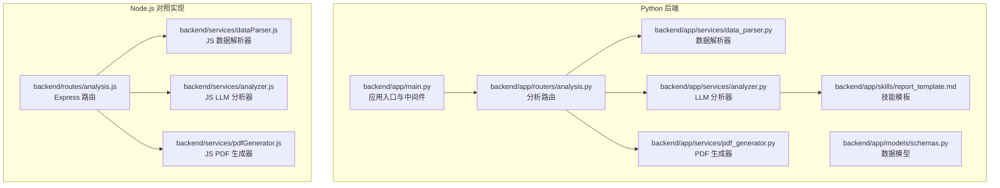
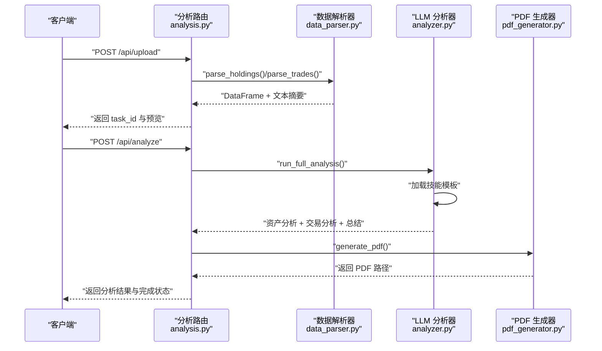
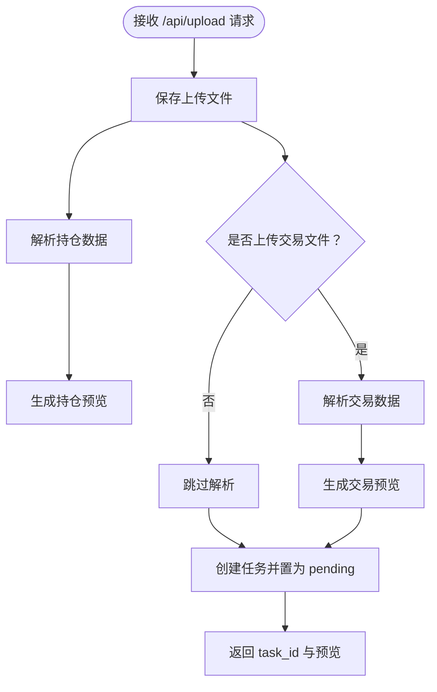
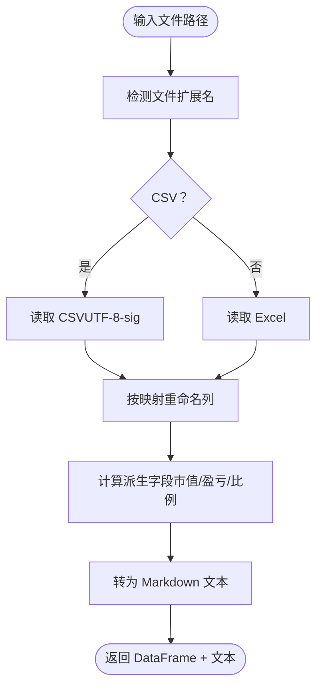
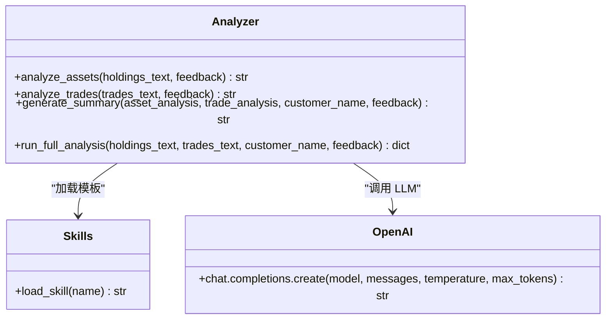
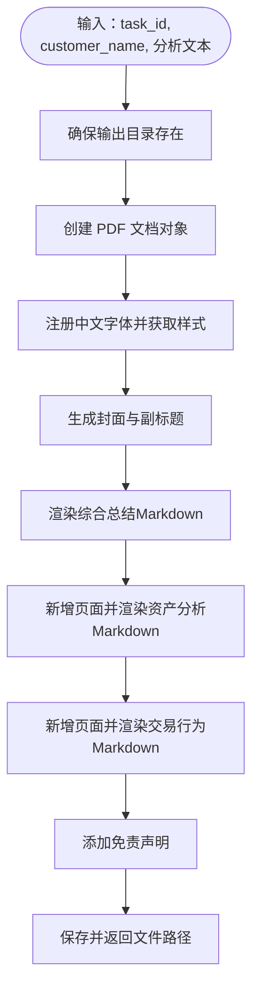
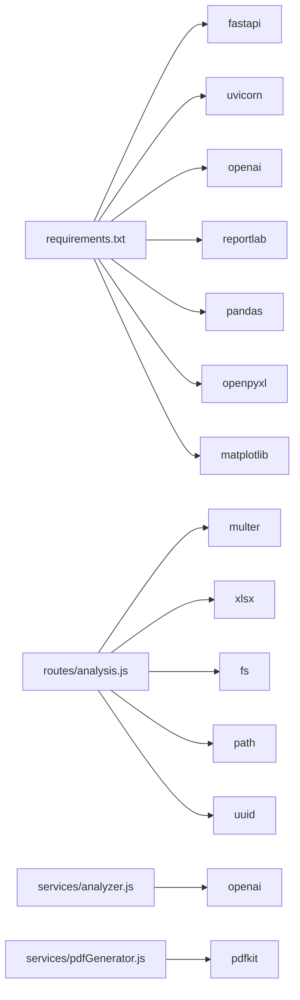

# 后端服务

<cite>
**本文引用的文件**
- [backend/app/main.py](file://backend/app/main.py)
- [backend/app/routers/analysis.py](file://backend/app/routers/analysis.py)
- [backend/app/services/data_parser.py](file://backend/app/services/data_parser.py)
- [backend/app/services/analyzer.py](file://backend/app/services/analyzer.py)
- [backend/app/services/pdf_generator.py](file://backend/app/services/pdf_generator.py)
- [backend/app/models/schemas.py](file://backend/app/models/schemas.py)
- [backend/app/skills/report_template.md](file://backend/app/skills/report_template.md)
- [backend/requirements.txt](file://backend/requirements.txt)
- [backend/routes/analysis.js](file://backend/routes/analysis.js)
- [backend/services/analyzer.js](file://backend/services/analyzer.js)
- [backend/services/dataParser.js](file://backend/services/dataParser.js)
- [backend/services/pdfGenerator.js](file://backend/services/pdfGenerator.js)
</cite>

## 目录
1. [简介](#简介)
2. [项目结构](#项目结构)
3. [核心组件](#核心组件)
4. [架构总览](#架构总览)
5. [详细组件分析](#详细组件分析)
6. [依赖分析](#依赖分析)
7. [性能考虑](#性能考虑)
8. [故障排查指南](#故障排查指南)
9. [结论](#结论)
10. [附录](#附录)

## 简介
本文件为 Qoder-todo 后端服务的综合技术文档，聚焦于基于 FastAPI 的 Python 后端与配套的 Node.js 路由/服务模块。文档从应用配置与初始化、CORS 中间件与静态文件服务、API 路由设计与处理逻辑、服务层架构（数据解析器、LLM 分析器、PDF 生成器）、文件上传与错误处理、异步任务管理以及服务间调用关系与数据流等方面进行系统化梳理，帮助开发者快速理解与维护该服务。

## 项目结构
后端采用前后端分离的多语言实现：
- Python FastAPI 后端位于 backend/app，包含主应用、路由、服务与技能模板等。
- Node.js 路由与服务位于 backend/routes 与 backend/services，提供与 Python 版本等价的功能，用于对比或迁移参考。
- requirements.txt 管理 Python 依赖；前端位于 frontend 目录，与后端通过 API 交互。

图表来源
- [backend/app/main.py:1-28](file://backend/app/main.py#L1-L28)
- [backend/app/routers/analysis.py:1-218](file://backend/app/routers/analysis.py#L1-L218)
- [backend/app/services/data_parser.py:1-96](file://backend/app/services/data_parser.py#L1-L96)
- [backend/app/services/analyzer.py:1-93](file://backend/app/services/analyzer.py#L1-L93)
- [backend/app/services/pdf_generator.py:1-215](file://backend/app/services/pdf_generator.py#L1-L215)
- [backend/app/models/schemas.py:1-30](file://backend/app/models/schemas.py#L1-L30)
- [backend/app/skills/report_template.md:1-34](file://backend/app/skills/report_template.md#L1-L34)
- [backend/routes/analysis.js:1-206](file://backend/routes/analysis.js#L1-L206)
- [backend/services/dataParser.js:1-116](file://backend/services/dataParser.js#L1-L116)
- [backend/services/analyzer.js:1-82](file://backend/services/analyzer.js#L1-L82)
- [backend/services/pdfGenerator.js:1-122](file://backend/services/pdfGenerator.js#L1-L122)

章节来源
- [backend/app/main.py:1-28](file://backend/app/main.py#L1-L28)
- [backend/requirements.txt:1-9](file://backend/requirements.txt#L1-L9)

## 核心组件
- 应用入口与中间件
  - 初始化 FastAPI 应用，启用 CORS 允许跨域访问，设置上传与报告输出目录，注册分析路由。
  - 参考路径：[backend/app/main.py:1-28](file://backend/app/main.py#L1-L28)
- 路由与控制器
  - 提供上传、分析、重新生成、下载报告与任务状态查询等接口，内部以内存字典维护任务状态。
  - 参考路径：[backend/app/routers/analysis.py:1-218](file://backend/app/routers/analysis.py#L1-L218)
- 服务层
  - 数据解析器：解析 CSV/Excel，标准化列名，计算衍生指标，生成供 LLM 分析的文本。
  - LLM 分析器：加载技能模板，调用 OpenAI 接口，完成资产配置、交易行为与综合报告生成。
  - PDF 生成器：将 Markdown 结果渲染为 PDF，自动注册中文字体，按章节分页输出。
  - 参考路径：
    - [backend/app/services/data_parser.py:1-96](file://backend/app/services/data_parser.py#L1-L96)
    - [backend/app/services/analyzer.py:1-93](file://backend/app/services/analyzer.py#L1-L93)
    - [backend/app/services/pdf_generator.py:1-215](file://backend/app/services/pdf_generator.py#L1-L215)
- 数据模型
  - 定义任务状态枚举、请求与响应模型，便于类型约束与文档生成。
  - 参考路径：[backend/app/models/schemas.py:1-30](file://backend/app/models/schemas.py#L1-L30)
- 技能模板
  - 以 Markdown 文件形式提供系统提示词，指导 LLM 生成结构化报告。
  - 参考路径：[backend/app/skills/report_template.md:1-34](file://backend/app/skills/report_template.md#L1-L34)

章节来源
- [backend/app/main.py:1-28](file://backend/app/main.py#L1-L28)
- [backend/app/routers/analysis.py:1-218](file://backend/app/routers/analysis.py#L1-L218)
- [backend/app/services/data_parser.py:1-96](file://backend/app/services/data_parser.py#L1-L96)
- [backend/app/services/analyzer.py:1-93](file://backend/app/services/analyzer.py#L1-L93)
- [backend/app/services/pdf_generator.py:1-215](file://backend/app/services/pdf_generator.py#L1-L215)
- [backend/app/models/schemas.py:1-30](file://backend/app/models/schemas.py#L1-L30)
- [backend/app/skills/report_template.md:1-34](file://backend/app/skills/report_template.md#L1-L34)

## 架构总览
下图展示从客户端到各服务模块的数据流与调用关系，涵盖文件上传、数据解析、LLM 分析与 PDF 生成的完整链路。

图表来源
- [backend/app/routers/analysis.py:35-135](file://backend/app/routers/analysis.py#L35-L135)
- [backend/app/services/data_parser.py:7-95](file://backend/app/services/data_parser.py#L7-L95)
- [backend/app/services/analyzer.py:18-92](file://backend/app/services/analyzer.py#L18-L92)
- [backend/app/services/pdf_generator.py:146-214](file://backend/app/services/pdf_generator.py#L146-L214)

## 详细组件分析

### 应用配置与初始化
- CORS 中间件
  - 允许任意源、凭证、方法与头，便于前端开发调试与跨域访问。
  - 参考路径：[backend/app/main.py:10-16](file://backend/app/main.py#L10-L16)
- 静态文件与目录
  - 上传与报告目录在应用启动时创建，确保后续文件写入可用。
  - 参考路径：[backend/app/main.py:18-21](file://backend/app/main.py#L18-L21)
- 路由注册
  - 将分析路由挂载至 /api 前缀，统一对外接口。
  - 参考路径：[backend/app/main.py:23](file://backend/app/main.py#L23)
- 开发服务器
  - 使用 uvicorn 在 0.0.0.0:8000 启动，支持热重载。
  - 参考路径：[backend/app/main.py:25-27](file://backend/app/main.py#L25-L27)

章节来源
- [backend/app/main.py:1-28](file://backend/app/main.py#L1-L28)

### API 路由设计与处理逻辑
- 上传接口
  - 支持持仓文件必填、交易文件可选；保存文件并生成预览；将任务状态设为 pending。
  - 参考路径：[backend/app/routers/analysis.py:35-83](file://backend/app/routers/analysis.py#L35-L83)
- 触发分析接口
  - 读取任务状态，调用分析器生成结果并生成 PDF；更新状态为 completed。
  - 参考路径：[backend/app/routers/analysis.py:86-135](file://backend/app/routers/analysis.py#L86-L135)
- 下载报告接口
  - 校验任务存在与 PDF 是否生成，返回文件响应。
  - 参考路径：[backend/app/routers/analysis.py:137-152](file://backend/app/routers/analysis.py#L137-L152)
- 重新生成接口
  - 支持带反馈意见的再分析与 PDF 重生成。
  - 参考路径：[backend/app/routers/analysis.py:155-199](file://backend/app/routers/analysis.py#L155-L199)
- 任务状态查询接口
  - 返回任务状态与可选结果。
  - 参考路径：[backend/app/routers/analysis.py:202-217](file://backend/app/routers/analysis.py#L202-L217)

图表来源
- [backend/app/routers/analysis.py:35-83](file://backend/app/routers/analysis.py#L35-L83)

章节来源
- [backend/app/routers/analysis.py:1-218](file://backend/app/routers/analysis.py#L1-L218)

### 服务层架构

#### 数据解析器
- 功能职责
  - 识别 CSV/Excel 并读取首张表；标准化列名为英文键；计算衍生字段（市值、浮动盈亏、盈亏比例等）；生成 Markdown 文本供 LLM 使用。
- 关键点
  - 列名映射支持模糊匹配，提升兼容性。
  - 自动补全缺失的派生指标，保证下游分析稳定性。
- 参考路径：
  - [backend/app/services/data_parser.py:7-52](file://backend/app/services/data_parser.py#L7-L52)
  - [backend/app/services/data_parser.py:55-95](file://backend/app/services/data_parser.py#L55-L95)

图表来源
- [backend/app/services/data_parser.py:7-52](file://backend/app/services/data_parser.py#L7-L52)
- [backend/app/services/data_parser.py:55-95](file://backend/app/services/data_parser.py#L55-L95)

章节来源
- [backend/app/services/data_parser.py:1-96](file://backend/app/services/data_parser.py#L1-L96)

#### LLM 分析器
- 功能职责
  - 加载技能模板（资产分析、交易行为、综合报告），调用 OpenAI Chat Completions 接口，返回结构化分析结果。
- 关键点
  - 支持自定义 base_url、model 与温度参数；可选反馈意见驱动再分析。
  - 通过环境变量 OPENAI_API_KEY、OPENAI_BASE_URL、OPENAI_MODEL 控制行为。
- 参考路径：
  - [backend/app/services/analyzer.py:11-16](file://backend/app/services/analyzer.py#L11-L16)
  - [backend/app/services/analyzer.py:18-38](file://backend/app/services/analyzer.py#L18-L38)
  - [backend/app/services/analyzer.py:77-92](file://backend/app/services/analyzer.py#L77-L92)

图表来源
- [backend/app/services/analyzer.py:11-92](file://backend/app/services/analyzer.py#L11-L92)

章节来源
- [backend/app/services/analyzer.py:1-93](file://backend/app/services/analyzer.py#L1-L93)
- [backend/app/skills/report_template.md:1-34](file://backend/app/skills/report_template.md#L1-L34)

#### PDF 生成器
- 功能职责
  - 将 Markdown 文本转换为 PDF，自动注册中文字体，按章节分页输出，包含封面、分隔线、免责声明等。
- 关键点
  - 多平台字体路径探测，回退至 Helvetica；支持粗体标记转换。
  - 严格按 A4 页面尺寸与边距排版，确保打印一致性。
- 参考路径：
  - [backend/app/services/pdf_generator.py:26-51](file://backend/app/services/pdf_generator.py#L26-L51)
  - [backend/app/services/pdf_generator.py:109-143](file://backend/app/services/pdf_generator.py#L109-L143)
  - [backend/app/services/pdf_generator.py:146-214](file://backend/app/services/pdf_generator.py#L146-L214)

图表来源
- [backend/app/services/pdf_generator.py:146-214](file://backend/app/services/pdf_generator.py#L146-L214)

章节来源
- [backend/app/services/pdf_generator.py:1-215](file://backend/app/services/pdf_generator.py#L1-L215)

### 文件上传处理与错误处理
- 上传处理
  - 生成任务 ID，按 holdings/trades 前缀保存文件；若交易文件为空则跳过解析。
  - 参考路径：[backend/app/routers/analysis.py:25-32](file://backend/app/routers/analysis.py#L25-L32)，[35-83:35-83](file://backend/app/routers/analysis.py#L35-L83)
- 错误处理
  - 解析失败抛出 400；任务不存在/报告未生成抛出 404；分析异常置状态为 failed 并返回 500。
  - 参考路径：[86-135:86-135](file://backend/app/routers/analysis.py#L86-L135)，[137-152:137-152](file://backend/app/routers/analysis.py#L137-L152)
- 异步与并发
  - 当前实现为内存字典存储任务，适合单实例开发测试；生产环境建议替换为 Redis 或数据库持久化，配合队列异步处理。

章节来源
- [backend/app/routers/analysis.py:1-218](file://backend/app/routers/analysis.py#L1-L218)

### 服务间调用关系与数据流转
- 调用链路
  - 上传 → 解析 → 任务状态 pending → 触发分析 → 生成 PDF → 状态 completed
  - 参考路径：[backend/app/routers/analysis.py:35-135](file://backend/app/routers/analysis.py#L35-L135)
- 数据模型
  - 使用 Pydantic 模型约束请求与响应，明确状态枚举与可选字段。
  - 参考路径：[backend/app/models/schemas.py:6-29](file://backend/app/models/schemas.py#L6-L29)

章节来源
- [backend/app/routers/analysis.py:1-218](file://backend/app/routers/analysis.py#L1-L218)
- [backend/app/models/schemas.py:1-30](file://backend/app/models/schemas.py#L1-L30)

## 依赖分析
- Python 依赖
  - FastAPI、Uvicorn、OpenAI SDK、ReportLab、Pandas、OpenPyXL、Matplotlib 等。
  - 参考路径：[backend/requirements.txt:1-9](file://backend/requirements.txt#L1-L9)
- Node.js 对照实现
  - Express、Multer、XLSX、PDFKit 等，功能与 Python 版本一一对应。
  - 参考路径：
    - [backend/routes/analysis.js:1-206](file://backend/routes/analysis.js#L1-L206)
    - [backend/services/dataParser.js:1-116](file://backend/services/dataParser.js#L1-L116)
    - [backend/services/analyzer.js:1-82](file://backend/services/analyzer.js#L1-L82)
    - [backend/services/pdfGenerator.js:1-122](file://backend/services/pdfGenerator.js#L1-L122)

图表来源
- [backend/requirements.txt:1-9](file://backend/requirements.txt#L1-L9)
- [backend/routes/analysis.js:1-206](file://backend/routes/analysis.js#L1-L206)
- [backend/services/analyzer.js:1-82](file://backend/services/analyzer.js#L1-L82)
- [backend/services/pdfGenerator.js:1-122](file://backend/services/pdfGenerator.js#L1-L122)

章节来源
- [backend/requirements.txt:1-9](file://backend/requirements.txt#L1-L9)
- [backend/routes/analysis.js:1-206](file://backend/routes/analysis.js#L1-L206)
- [backend/services/analyzer.js:1-82](file://backend/services/analyzer.js#L1-L82)
- [backend/services/pdfGenerator.js:1-122](file://backend/services/pdfGenerator.js#L1-L122)

## 性能考虑
- I/O 密集优化
  - 文件解析与 PDF 生成均为 I/O 密集操作，建议在生产环境使用异步文件系统与并发队列（如 Celery/RQ）隔离阻塞。
- LLM 调用
  - OpenAI 调用受网络与速率限制影响，建议增加超时、重试与熔断策略；对重复输入进行缓存。
- 字体与渲染
  - 中文字体注册仅执行一次，避免重复开销；PDF 渲染按章节分页，减少一次性内存压力。
- 存储与清理
  - 上传与报告目录定期清理历史文件，避免磁盘膨胀；生产环境建议使用对象存储与 CDN。

## 故障排查指南
- 常见错误与定位
  - 400：文件解析失败（检查列名映射、编码与扩展名）。参考路径：[backend/app/routers/analysis.py:54-64](file://backend/app/routers/analysis.py#L54-L64)
  - 404：任务不存在或报告未生成。参考路径：[140-146:140-146](file://backend/app/routers/analysis.py#L140-L146)
  - 500：分析异常（查看服务端异常堆栈与 LLM 返回）。参考路径：[130-134:130-134](file://backend/app/routers/analysis.py#L130-L134)
- 环境变量
  - OPENAI_API_KEY、OPENAI_BASE_URL、OPENAI_MODEL 必须正确配置；否则 LLM 分析无法执行。
  - 参考路径：[backend/app/services/analyzer.py:20-22](file://backend/app/services/analyzer.py#L20-L22)
- 字体问题
  - 若中文显示异常，确认系统字体路径存在或允许回退至 Helvetica。
  - 参考路径：[backend/app/services/pdf_generator.py:31-50](file://backend/app/services/pdf_generator.py#L31-L50)

章节来源
- [backend/app/routers/analysis.py:1-218](file://backend/app/routers/analysis.py#L1-L218)
- [backend/app/services/analyzer.py:18-38](file://backend/app/services/analyzer.py#L18-L38)
- [backend/app/services/pdf_generator.py:26-51](file://backend/app/services/pdf_generator.py#L26-L51)

## 结论
本后端服务以清晰的分层架构实现了从文件上传、数据解析、LLM 分析到 PDF 报告生成的完整闭环。Python FastAPI 提供了简洁稳定的接口与中间件能力，服务层通过职责分离与模板化提示词提升了可维护性与可扩展性。建议在生产环境中引入持久化任务存储、异步队列与限流熔断策略，以进一步提升可靠性与吞吐量。

## 附录
- API 端点概览
  - POST /api/upload：上传持仓与交易文件，返回 task_id 与预览。
  - POST /api/analyze：触发分析并生成 PDF。
  - GET /api/report/{task_id}/pdf：下载生成的 PDF。
  - POST /api/analyze/{task_id}/regenerate：基于反馈意见重新生成。
  - GET /api/task/{task_id}：查询任务状态与结果。
- 数据模型
  - 任务状态枚举：pending、analyzing、completed、failed。
  - 请求与响应模型包含 task_id、status、customer_name、分析结果与可选错误信息。
  - 参考路径：[backend/app/models/schemas.py:6-29](file://backend/app/models/schemas.py#L6-L29)

章节来源
- [backend/app/routers/analysis.py:1-218](file://backend/app/routers/analysis.py#L1-L218)
- [backend/app/models/schemas.py:1-30](file://backend/app/models/schemas.py#L1-L30)