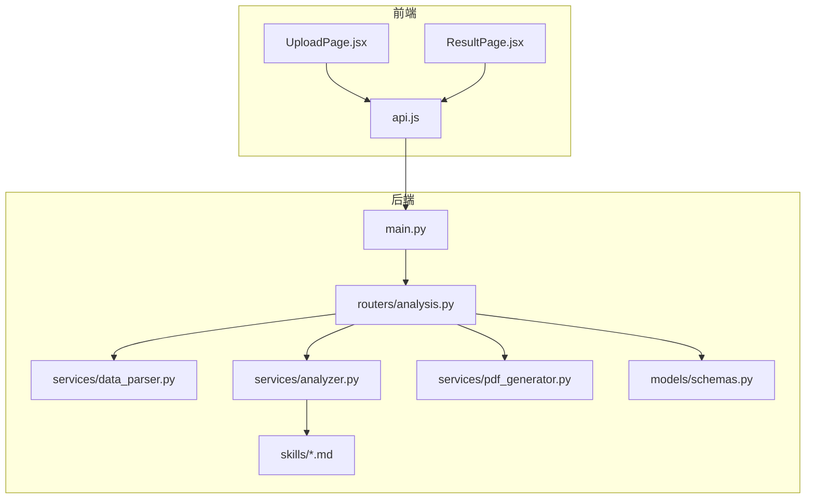
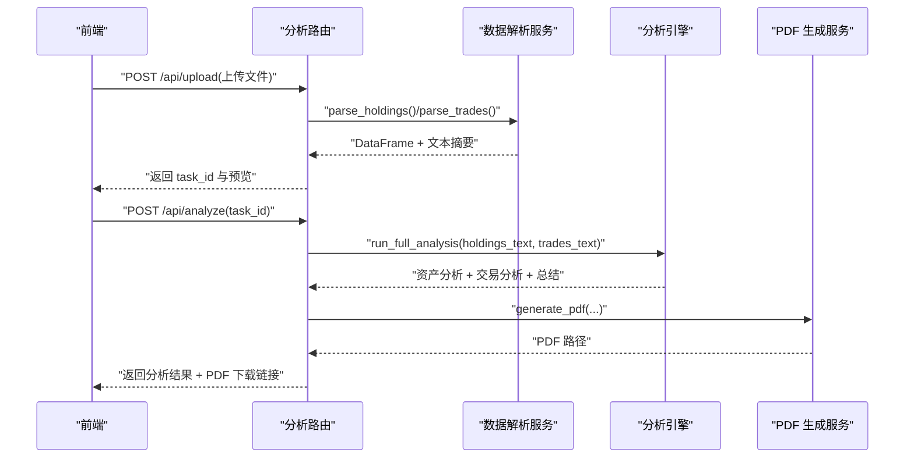
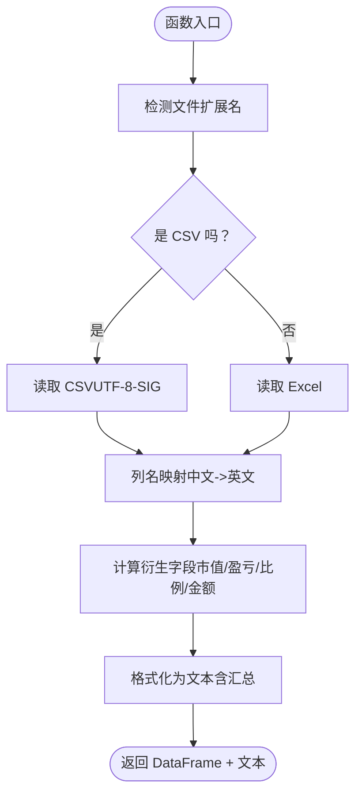
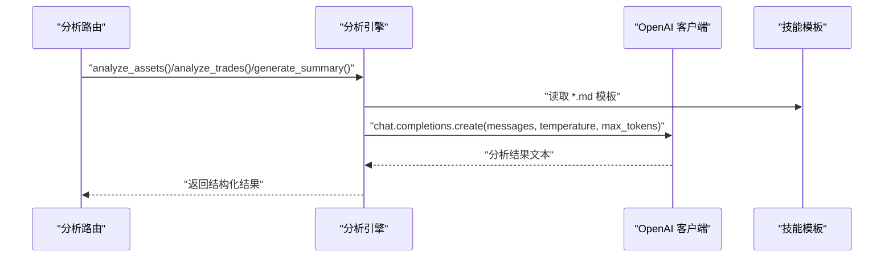
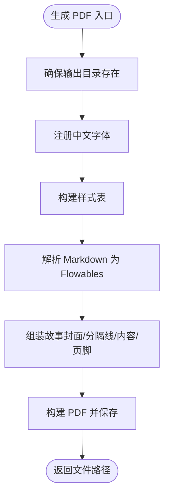
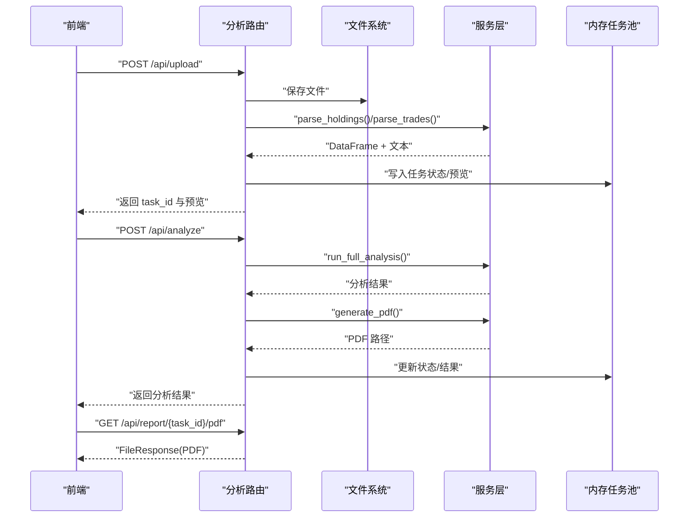
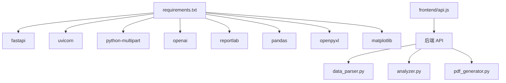

# 数据处理服务

<cite>
**本文引用的文件**
- [backend/app/services/data_parser.py](file://backend/app/services/data_parser.py)
- [backend/app/routers/analysis.py](file://backend/app/routers/analysis.py)
- [backend/app/services/analyzer.py](file://backend/app/services/analyzer.py)
- [backend/app/services/pdf_generator.py](file://backend/app/services/pdf_generator.py)
- [backend/app/models/schemas.py](file://backend/app/models/schemas.py)
- [backend/app/main.py](file://backend/app/main.py)
- [backend/requirements.txt](file://backend/requirements.txt)
- [backend/app/skills/asset_analysis.md](file://backend/app/skills/asset_analysis.md)
- [backend/app/skills/trade_behavior.md](file://backend/app/skills/trade_behavior.md)
- [backend/app/skills/report_template.md](file://backend/app/skills/report_template.md)
- [frontend/src/components/UploadPage.jsx](file://frontend/src/components/UploadPage.jsx)
- [frontend/src/components/ResultPage.jsx](file://frontend/src/components/ResultPage.jsx)
- [frontend/src/services/api.js](file://frontend/src/services/api.js)
</cite>

## 目录
1. [简介](#简介)
2. [项目结构](#项目结构)
3. [核心组件](#核心组件)
4. [架构总览](#架构总览)
5. [详细组件分析](#详细组件分析)
6. [依赖分析](#依赖分析)
7. [性能考虑](#性能考虑)
8. [故障排查指南](#故障排查指南)
9. [结论](#结论)
10. [附录](#附录)

## 简介
本项目是一个基于 FastAPI 的数据处理服务，专注于解析用户上传的 CSV/Excel 持仓与交易数据，进行字段标准化、衍生指标计算与文本格式化，随后通过大模型进行资产配置与交易行为分析，并生成中文 PDF 报告。系统提供上传、预览、分析、重新生成与下载报告的完整工作流。

## 项目结构
后端采用分层设计：
- 应用入口与中间件配置位于主程序模块
- 路由层负责文件上传、分析触发、报告下载与任务状态查询
- 服务层包含数据解析、LLM 分析与 PDF 生成
- 模型层定义请求与响应的数据结构
- 技能模板用于指导 LLM 的分析维度与输出规范
- 前端提供上传与结果展示界面

图表来源
- [backend/app/main.py:1-28](file://backend/app/main.py#L1-L28)
- [backend/app/routers/analysis.py:1-218](file://backend/app/routers/analysis.py#L1-L218)
- [backend/app/services/data_parser.py:1-96](file://backend/app/services/data_parser.py#L1-L96)
- [backend/app/services/analyzer.py:1-93](file://backend/app/services/analyzer.py#L1-L93)
- [backend/app/services/pdf_generator.py:1-215](file://backend/app/services/pdf_generator.py#L1-L215)
- [backend/app/models/schemas.py:1-30](file://backend/app/models/schemas.py#L1-L30)
- [backend/app/skills/asset_analysis.md:1-35](file://backend/app/skills/asset_analysis.md#L1-L35)
- [backend/app/skills/trade_behavior.md:1-34](file://backend/app/skills/trade_behavior.md#L1-L34)
- [backend/app/skills/report_template.md:1-34](file://backend/app/skills/report_template.md#L1-L34)
- [frontend/src/components/UploadPage.jsx:1-145](file://frontend/src/components/UploadPage.jsx#L1-L145)
- [frontend/src/components/ResultPage.jsx:1-193](file://frontend/src/components/ResultPage.jsx#L1-L193)
- [frontend/src/services/api.js:1-48](file://frontend/src/services/api.js#L1-L48)

章节来源
- [backend/app/main.py:1-28](file://backend/app/main.py#L1-L28)
- [backend/app/routers/analysis.py:1-218](file://backend/app/routers/analysis.py#L1-L218)

## 核心组件
- 数据解析服务：负责 CSV/Excel 文件读取、列名标准化映射、衍生字段计算与文本格式化
- 分析引擎：加载技能模板，调用大模型 API，生成资产配置与交易行为分析及综合报告
- PDF 生成服务：注册中文字体、解析 Markdown、构建报告内容并输出 PDF
- 路由与任务管理：接收上传文件、保存至本地、预览数据、触发分析、生成 PDF 并提供下载
- 数据模型：定义任务状态、请求与响应结构
- 前端页面：上传 CSV/Excel、展示预览、触发分析、展示与下载报告

章节来源
- [backend/app/services/data_parser.py:1-96](file://backend/app/services/data_parser.py#L1-L96)
- [backend/app/services/analyzer.py:1-93](file://backend/app/services/analyzer.py#L1-L93)
- [backend/app/services/pdf_generator.py:1-215](file://backend/app/services/pdf_generator.py#L1-L215)
- [backend/app/routers/analysis.py:1-218](file://backend/app/routers/analysis.py#L1-L218)
- [backend/app/models/schemas.py:1-30](file://backend/app/models/schemas.py#L1-L30)
- [frontend/src/components/UploadPage.jsx:1-145](file://frontend/src/components/UploadPage.jsx#L1-L145)
- [frontend/src/components/ResultPage.jsx:1-193](file://frontend/src/components/ResultPage.jsx#L1-L193)
- [frontend/src/services/api.js:1-48](file://frontend/src/services/api.js#L1-L48)

## 架构总览
系统采用“上传-解析-分析-生成-下载”的顺序流程，路由层协调各服务模块，内存存储任务状态，生产环境建议替换为持久化存储。

图表来源
- [backend/app/routers/analysis.py:35-153](file://backend/app/routers/analysis.py#L35-L153)
- [backend/app/services/data_parser.py:7-52](file://backend/app/services/data_parser.py#L7-L52)
- [backend/app/services/analyzer.py:77-93](file://backend/app/services/analyzer.py#L77-L93)
- [backend/app/services/pdf_generator.py:146-215](file://backend/app/services/pdf_generator.py#L146-L215)

## 详细组件分析

### 数据解析服务（CSV/Excel）
职责与流程：
- 文件格式检测：依据扩展名判断 CSV 或 Excel，分别读取
- 列名标准化映射：将中文列名映射为英文字段名，支持模糊匹配
- 衍生字段计算：在缺少字段时按公式自动补算（如市值、盈亏、盈亏比例、交易金额等）
- 文本格式化：将表格转为带标题的字符串，便于 LLM 分析

图表来源
- [backend/app/services/data_parser.py:7-52](file://backend/app/services/data_parser.py#L7-L52)
- [backend/app/services/data_parser.py:55-95](file://backend/app/services/data_parser.py#L55-L95)

章节来源
- [backend/app/services/data_parser.py:1-96](file://backend/app/services/data_parser.py#L1-L96)

### 分析引擎（LLM 调用）
职责与流程：
- 加载技能模板：资产配置、交易行为、综合报告模板
- 构造系统提示词与用户提示词：可选附加客户经理反馈
- 调用大模型 API：支持自定义 base_url 与模型名称
- 返回结构化分析结果与综合报告

图表来源
- [backend/app/services/analyzer.py:11-16](file://backend/app/services/analyzer.py#L11-L16)
- [backend/app/services/analyzer.py:18-38](file://backend/app/services/analyzer.py#L18-L38)
- [backend/app/services/analyzer.py:41-74](file://backend/app/services/analyzer.py#L41-L74)
- [backend/app/skills/asset_analysis.md:1-35](file://backend/app/skills/asset_analysis.md#L1-L35)
- [backend/app/skills/trade_behavior.md:1-34](file://backend/app/skills/trade_behavior.md#L1-L34)
- [backend/app/skills/report_template.md:1-34](file://backend/app/skills/report_template.md#L1-L34)

章节来源
- [backend/app/services/analyzer.py:1-93](file://backend/app/services/analyzer.py#L1-L93)

### PDF 生成服务（中文支持）
职责与流程：
- 中文字体注册：尝试多平台字体路径，失败回退 Helvetica
- 样式定义：标题、副标题、正文、列表等样式
- Markdown 解析：将标题、粗体、列表等转换为 ReportLab 组件
- 报告构建：封面、分隔线、总结、资产分析、交易分析、免责声明
- 输出 PDF：返回文件路径供下载

图表来源
- [backend/app/services/pdf_generator.py:26-51](file://backend/app/services/pdf_generator.py#L26-L51)
- [backend/app/services/pdf_generator.py:53-106](file://backend/app/services/pdf_generator.py#L53-L106)
- [backend/app/services/pdf_generator.py:109-143](file://backend/app/services/pdf_generator.py#L109-L143)
- [backend/app/services/pdf_generator.py:146-215](file://backend/app/services/pdf_generator.py#L146-L215)

章节来源
- [backend/app/services/pdf_generator.py:1-215](file://backend/app/services/pdf_generator.py#L1-L215)

### 路由与任务管理
职责与流程：
- 上传接口：保存文件、解析预览、写入内存任务池
- 分析接口：更新状态、调用分析引擎、生成 PDF、更新结果
- 重新生成：基于反馈再次调用分析并生成新报告
- 下载接口：返回 PDF 文件
- 任务查询：返回状态与结果

图表来源
- [backend/app/routers/analysis.py:35-153](file://backend/app/routers/analysis.py#L35-L153)
- [backend/app/routers/analysis.py:155-200](file://backend/app/routers/analysis.py#L155-L200)
- [backend/app/routers/analysis.py:202-218](file://backend/app/routers/analysis.py#L202-L218)

章节来源
- [backend/app/routers/analysis.py:1-218](file://backend/app/routers/analysis.py#L1-L218)

### 数据模型
- 任务状态枚举：pending/analyzing/completed/failed
- 请求模型：分析请求、反馈重生成请求
- 响应模型：包含任务 ID、状态、客户名称、分析结果与错误信息

章节来源
- [backend/app/models/schemas.py:1-30](file://backend/app/models/schemas.py#L1-L30)

### 前端使用场景
- 上传页面：支持 CSV/Excel 拖拽上传，展示持仓与交易预览
- 结果页面：开始分析、展示 Markdown 结果、下载 PDF、基于反馈重新生成
- API 封装：统一的 HTTP 客户端，设置超时与基础地址

章节来源
- [frontend/src/components/UploadPage.jsx:1-145](file://frontend/src/components/UploadPage.jsx#L1-L145)
- [frontend/src/components/ResultPage.jsx:1-193](file://frontend/src/components/ResultPage.jsx#L1-L193)
- [frontend/src/services/api.js:1-48](file://frontend/src/services/api.js#L1-L48)

## 依赖分析
后端依赖包括 Web 框架、数据处理、PDF 生成与大模型 SDK。前端通过 Axios 发起请求。

图表来源
- [backend/requirements.txt:1-9](file://backend/requirements.txt#L1-L9)
- [frontend/src/services/api.js:1-48](file://frontend/src/services/api.js#L1-L48)

章节来源
- [backend/requirements.txt:1-9](file://backend/requirements.txt#L1-L9)

## 性能考虑
- 文件读取：CSV 使用 UTF-8-SIG 编码，Excel 使用 openpyxl，建议对大文件进行分块读取或限制单次上传大小
- 字段映射：模糊匹配中文列名，建议在模板中明确字段清单以减少误匹配
- 衍生字段：仅在缺失时计算，避免重复计算开销
- LLM 调用：设置合理温度与最大 token，避免过长上下文导致延迟
- PDF 生成：中文字体注册仅一次，样式复用，避免重复构建
- 任务存储：当前使用内存字典，生产环境建议迁移到数据库并配合队列异步处理

## 故障排查指南
- 文件格式错误
  - 现象：上传 CSV/Excel 失败或解析报错
  - 排查：确认扩展名与实际格式一致；检查编码（CSV 使用 UTF-8-SIG）；确保列名包含中文关键词以便映射
  - 参考
    - [backend/app/services/data_parser.py:9-12](file://backend/app/services/data_parser.py#L9-L12)
    - [backend/app/routers/analysis.py:51-64](file://backend/app/routers/analysis.py#L51-L64)
- 数据格式错误
  - 现象：数值列无法计算衍生字段
  - 排查：确认数值列可转换；若缺失则依赖映射后的计算逻辑
  - 参考
    - [backend/app/services/data_parser.py:38-43](file://backend/app/services/data_parser.py#L38-L43)
    - [backend/app/services/data_parser.py:88-89](file://backend/app/services/data_parser.py#L88-L89)
- LLM 调用失败
  - 现象：分析接口返回 500
  - 排查：检查 OPENAI_API_KEY、OPENAI_BASE_URL、OPENAI_MODEL 环境变量；网络连通性
  - 参考
    - [backend/app/services/analyzer.py:18-22](file://backend/app/services/analyzer.py#L18-L22)
    - [backend/app/services/analyzer.py:25-38](file://backend/app/services/analyzer.py#L25-L38)
- PDF 生成异常
  - 现象：中文乱码或字体缺失
  - 排查：确认系统字体路径可用；若失败将回退 Helvetica
  - 参考
    - [backend/app/services/pdf_generator.py:26-51](file://backend/app/services/pdf_generator.py#L26-L51)
- 任务状态异常
  - 现象：找不到任务或状态未更新
  - 排查：确认 task_id；检查内存任务池是否被清理
  - 参考
    - [backend/app/routers/analysis.py:89-91](file://backend/app/routers/analysis.py#L89-L91)
    - [backend/app/routers/analysis.py:130-134](file://backend/app/routers/analysis.py#L130-L134)

章节来源
- [backend/app/services/data_parser.py:1-96](file://backend/app/services/data_parser.py#L1-L96)
- [backend/app/services/analyzer.py:1-93](file://backend/app/services/analyzer.py#L1-L93)
- [backend/app/services/pdf_generator.py:1-215](file://backend/app/services/pdf_generator.py#L1-L215)
- [backend/app/routers/analysis.py:1-218](file://backend/app/routers/analysis.py#L1-L218)

## 结论
该数据处理服务通过清晰的分层设计实现了从文件上传到分析报告生成的全链路自动化。数据解析模块提供了灵活的字段映射与衍生计算，分析引擎结合技能模板保证了输出的专业性与一致性，PDF 生成模块兼顾了中文显示与结构化排版。建议在生产环境中完善错误监控、任务持久化与异步处理，并对大文件与高并发场景进行性能优化。

## 附录
- 使用场景示例
  - 场景一：客户上传 CSV 持仓与 Excel 交易记录，系统自动解析并生成中文报告
  - 场景二：客户经理提供反馈意见，系统基于反馈重新生成分析
  - 场景三：前端展示分析结果与 PDF 下载链接，支持多次下载与重新生成
- 关键实现位置参考
  - [上传与预览:35-83](file://backend/app/routers/analysis.py#L35-L83)
  - [触发分析与生成 PDF:86-135](file://backend/app/routers/analysis.py#L86-L135)
  - [重新生成与下载:155-200](file://backend/app/routers/analysis.py#L155-L200)
  - [PDF 构建与样式:146-215](file://backend/app/services/pdf_generator.py#L146-L215)
  - [字段映射与衍生计算:14-52](file://backend/app/services/data_parser.py#L14-L52)
  - [LLM 调用与模板加载:11-38](file://backend/app/services/analyzer.py#L11-L38)
  - [前端上传与结果展示:1-145](file://frontend/src/components/UploadPage.jsx#L1-L145)
  - [前端分析与下载:1-193](file://frontend/src/components/ResultPage.jsx#L1-L193)
  - [API 调用封装:1-48](file://frontend/src/services/api.js#L1-L48)