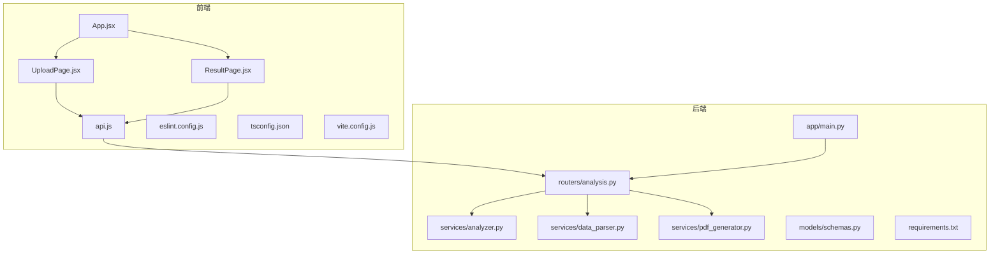
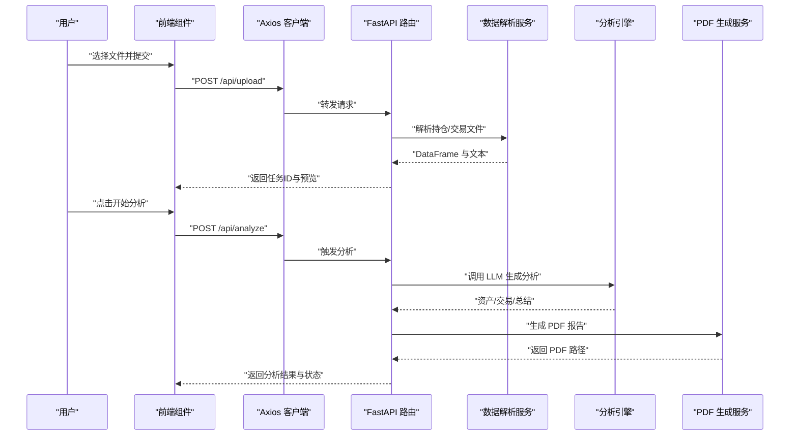
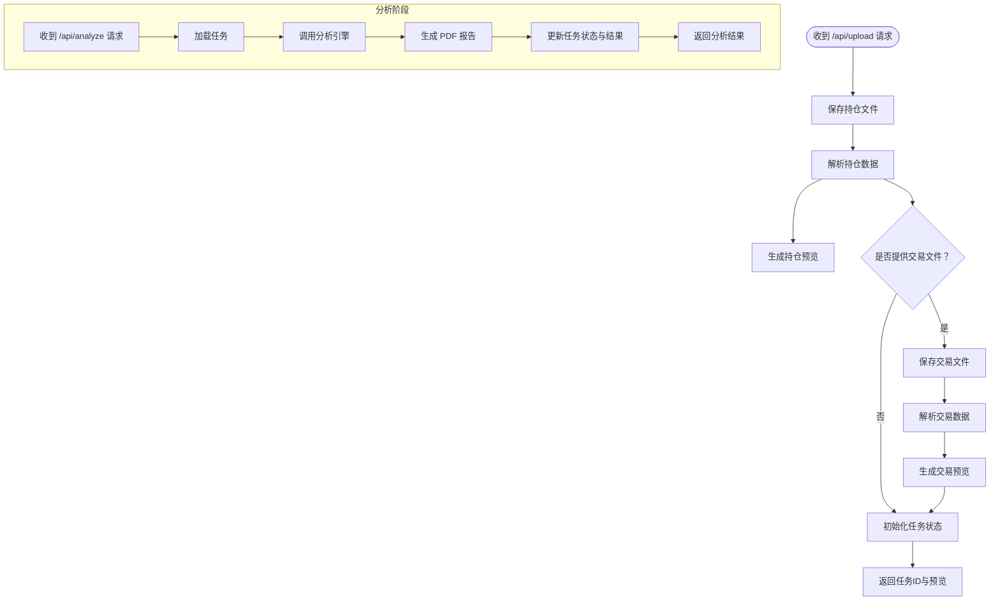
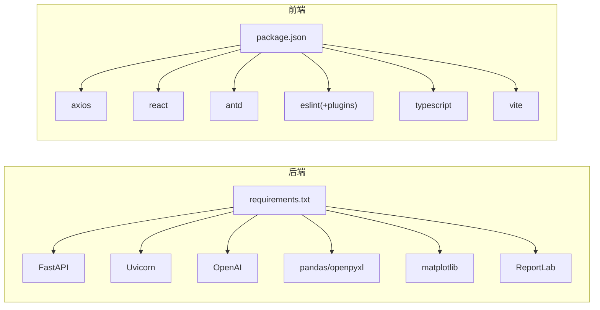

# 代码规范

<cite>
**本文引用的文件**
- [backend/app/main.py](file://backend/app/main.py)
- [backend/app/routers/analysis.py](file://backend/app/routers/analysis.py)
- [backend/app/services/analyzer.py](file://backend/app/services/analyzer.py)
- [backend/app/services/data_parser.py](file://backend/app/services/data_parser.py)
- [backend/app/services/pdf_generator.py](file://backend/app/services/pdf_generator.py)
- [backend/app/models/schemas.py](file://backend/app/models/schemas.py)
- [backend/requirements.txt](file://backend/requirements.txt)
- [frontend/src/App.jsx](file://frontend/src/App.jsx)
- [frontend/src/components/UploadPage.jsx](file://frontend/src/components/UploadPage.jsx)
- [frontend/src/components/ResultPage.jsx](file://frontend/src/components/ResultPage.jsx)
- [frontend/src/services/api.js](file://frontend/src/services/api.js)
- [frontend/eslint.config.js](file://frontend/eslint.config.js)
- [frontend/package.json](file://frontend/package.json)
- [frontend/tsconfig.json](file://frontend/tsconfig.json)
- [frontend/vite.config.js](file://frontend/vite.config.js)
</cite>

## 目录
1. 引言
2. 项目结构
3. 核心组件
4. 架构总览
5. 详细组件分析
6. 依赖分析
7. 性能考虑
8. 故障排查指南
9. 结论
10. 附录

## 引言
本指南面向 Qoder-todo 项目，提供统一的代码规范与最佳实践，覆盖 Python 后端（PEP8 遵循、模块组织、注释与错误处理）、JavaScript/TypeScript 前端（ESLint 规则、TypeScript 类型检查、React 组件规范）、代码格式化工具（black、prettier）、Git 提交信息规范与分支管理策略，以及代码审查清单与质量保证流程。目标是提升代码一致性、可读性、可维护性与协作效率。

## 项目结构
项目采用前后端分离架构：
- 后端基于 FastAPI，采用分层设计：入口应用、路由层、业务服务层、数据模型与工具。
- 前端基于 Vite + React + TypeScript，采用组件化开发，通过 Axios 调用后端 API。

图表来源
- [backend/app/main.py:1-28](file://backend/app/main.py#L1-L28)
- [backend/app/routers/analysis.py:1-218](file://backend/app/routers/analysis.py#L1-L218)
- [backend/app/services/analyzer.py:1-93](file://backend/app/services/analyzer.py#L1-L93)
- [backend/app/services/data_parser.py:1-96](file://backend/app/services/data_parser.py#L1-L96)
- [backend/app/services/pdf_generator.py:1-215](file://backend/app/services/pdf_generator.py#L1-L215)
- [backend/app/models/schemas.py:1-30](file://backend/app/models/schemas.py#L1-L30)
- [frontend/src/App.jsx:1-81](file://frontend/src/App.jsx#L1-L81)
- [frontend/src/components/UploadPage.jsx:1-145](file://frontend/src/components/UploadPage.jsx#L1-L145)
- [frontend/src/components/ResultPage.jsx:1-193](file://frontend/src/components/ResultPage.jsx#L1-L193)
- [frontend/src/services/api.js:1-48](file://frontend/src/services/api.js#L1-L48)
- [frontend/eslint.config.js:1-30](file://frontend/eslint.config.js#L1-L30)
- [frontend/tsconfig.json:1-24](file://frontend/tsconfig.json#L1-L24)
- [frontend/vite.config.js:1-8](file://frontend/vite.config.js#L1-L8)

章节来源
- [backend/app/main.py:1-28](file://backend/app/main.py#L1-L28)
- [frontend/src/App.jsx:1-81](file://frontend/src/App.jsx#L1-L81)

## 核心组件
- 后端应用入口与中间件：设置 CORS、静态文件挂载、路由注册与启动参数。
- 路由层：提供上传、分析、PDF 下载、任务状态查询等接口。
- 服务层：
  - 数据解析：CSV/Excel 解析与字段标准化、派生字段计算、文本化供 LLM 分析。
  - 分析引擎：加载技能模板、调用大模型、生成资产配置、交易行为与综合报告。
  - PDF 生成：多平台字体注册、样式构建、Markdown 渲染、分页与页脚。
- 前端组件：上传页面、结果页面、API 封装、主题与布局。
- 类型与校验：Pydantic 模型定义请求与响应结构。

章节来源
- [backend/app/main.py:1-28](file://backend/app/main.py#L1-L28)
- [backend/app/routers/analysis.py:1-218](file://backend/app/routers/analysis.py#L1-L218)
- [backend/app/services/data_parser.py:1-96](file://backend/app/services/data_parser.py#L1-L96)
- [backend/app/services/analyzer.py:1-93](file://backend/app/services/analyzer.py#L1-L93)
- [backend/app/services/pdf_generator.py:1-215](file://backend/app/services/pdf_generator.py#L1-L215)
- [backend/app/models/schemas.py:1-30](file://backend/app/models/schemas.py#L1-L30)
- [frontend/src/components/UploadPage.jsx:1-145](file://frontend/src/components/UploadPage.jsx#L1-L145)
- [frontend/src/components/ResultPage.jsx:1-193](file://frontend/src/components/ResultPage.jsx#L1-L193)
- [frontend/src/services/api.js:1-48](file://frontend/src/services/api.js#L1-L48)

## 架构总览
系统采用“前端单页应用 + 后端 API”模式，前端通过 Axios 发起请求，后端使用 FastAPI 提供 REST 接口，分析过程调用大模型完成文本分析，并生成 PDF 报告。

图表来源
- [frontend/src/services/api.js:1-48](file://frontend/src/services/api.js#L1-L48)
- [backend/app/routers/analysis.py:35-135](file://backend/app/routers/analysis.py#L35-L135)
- [backend/app/services/data_parser.py:7-96](file://backend/app/services/data_parser.py#L7-L96)
- [backend/app/services/analyzer.py:41-93](file://backend/app/services/analyzer.py#L41-L93)
- [backend/app/services/pdf_generator.py:146-215](file://backend/app/services/pdf_generator.py#L146-L215)

## 详细组件分析

### 后端：应用入口与中间件
- CORS 允许跨域访问，便于前端直连后端。
- 上传与报告目录创建，确保运行时可用。
- 包含分析路由，前缀 /api。
- 支持直接运行 uvicorn。

章节来源
- [backend/app/main.py:1-28](file://backend/app/main.py#L1-L28)

### 后端：分析路由与任务状态
- 上传接口：接收持仓与交易文件，可选客户名；解析预览并写入内存任务表。
- 分析接口：触发分析，调用分析引擎与 PDF 生成，更新任务状态与结果。
- 重新生成接口：根据反馈意见再次分析并生成报告。
- PDF 下载接口：返回 PDF 文件。
- 任务状态查询：返回当前状态与结果摘要。

图表来源
- [backend/app/routers/analysis.py:35-135](file://backend/app/routers/analysis.py#L35-L135)

章节来源
- [backend/app/routers/analysis.py:1-218](file://backend/app/routers/analysis.py#L1-L218)

### 后端：数据解析服务
- 自动识别 CSV/Excel 并读取。
- 中文列名映射到英文字段名，统一后续处理。
- 派生字段计算：市值、浮动盈亏、盈亏比例、交易金额等。
- 输出 DataFrame 与文本，供 LLM 分析使用。

章节来源
- [backend/app/services/data_parser.py:1-96](file://backend/app/services/data_parser.py#L1-L96)

### 后端：分析引擎（大模型）
- 加载技能模板（资产分析、交易行为、报告模板）。
- 通过环境变量配置 OpenAI 客户端（API Key、Base URL、模型）。
- 支持传入客户反馈以微调分析结果。
- 返回资产配置、交易行为与综合报告文本。

章节来源
- [backend/app/services/analyzer.py:1-93](file://backend/app/services/analyzer.py#L1-L93)

### 后端：PDF 生成服务
- 多平台中文字体注册（Windows、Linux、macOS）回退至 Helvetica。
- 样式定义：标题、副标题、段落、列表等。
- Markdown 到 ReportLab Flowables 的转换。
- 分页与免责声明页脚。

章节来源
- [backend/app/services/pdf_generator.py:1-215](file://backend/app/services/pdf_generator.py#L1-L215)

### 后端：数据模型与类型
- 任务状态枚举：pending、analyzing、completed、failed。
- 请求与响应模型：分析请求、重新生成请求、分析结果。

章节来源
- [backend/app/models/schemas.py:1-30](file://backend/app/models/schemas.py#L1-L30)

### 前端：应用与页面组件
- App 主组件：Ant Design 布局、主题配置、步骤导航、页面切换。
- UploadPage：客户信息输入、拖拽上传、文件预览表格、上传与错误提示。
- ResultPage：开始分析、加载状态、折叠面板展示分析结果、下载 PDF、反馈重新生成。

章节来源
- [frontend/src/App.jsx:1-81](file://frontend/src/App.jsx#L1-L81)
- [frontend/src/components/UploadPage.jsx:1-145](file://frontend/src/components/UploadPage.jsx#L1-L145)
- [frontend/src/components/ResultPage.jsx:1-193](file://frontend/src/components/ResultPage.jsx#L1-L193)

### 前端：API 封装与配置
- Axios 实例：基础 URL、超时设置（分析较长）、封装上传、分析、重新生成、下载与状态查询。
- ESLint 配置：推荐规则、React Hooks、React Refresh、忽略 dist 目录。
- TypeScript 编译选项：严格未使用检查、无降级开关、模块解析等。
- Vite 插件：React 插件。

章节来源
- [frontend/src/services/api.js:1-48](file://frontend/src/services/api.js#L1-L48)
- [frontend/eslint.config.js:1-30](file://frontend/eslint.config.js#L1-L30)
- [frontend/tsconfig.json:1-24](file://frontend/tsconfig.json#L1-L24)
- [frontend/vite.config.js:1-8](file://frontend/vite.config.js#L1-L8)

## 依赖分析
- 后端依赖：FastAPI、Uvicorn、OpenAI SDK、pandas、openpyxl、matplotlib、ReportLab。
- 前端依赖：React、Ant Design、Axios、Vite、ESLint 及插件、TypeScript 类型。

图表来源
- [backend/requirements.txt:1-9](file://backend/requirements.txt#L1-L9)
- [frontend/package.json:1-32](file://frontend/package.json#L1-L32)

章节来源
- [backend/requirements.txt:1-9](file://backend/requirements.txt#L1-L9)
- [frontend/package.json:1-32](file://frontend/package.json#L1-L32)

## 性能考虑
- 前端上传与分析超时：Axios 超时设为 5 分钟，适配长分析任务。
- 后端分析与 PDF 生成：避免阻塞主线程，建议在生产环境引入队列与异步任务。
- 数据解析：pandas 批量计算派生字段，注意大数据集内存占用。
- 字体注册：PDF 生成时尝试多路径字体，减少渲染失败与回退开销。
- 前端渲染：Markdown 渲染与大段文本展示，建议分页或虚拟滚动优化。

章节来源
- [frontend/src/services/api.js:5-8](file://frontend/src/services/api.js#L5-L8)
- [backend/app/services/pdf_generator.py:26-51](file://backend/app/services/pdf_generator.py#L26-L51)

## 故障排查指南
- CORS 问题：确认后端已启用允许所有来源与方法。
- 文件上传失败：检查上传目录权限与磁盘空间，查看解析异常与 HTTP 状态码。
- 分析失败：查看后端异常栈与任务状态，确认 OPENAI_* 环境变量配置。
- PDF 生成异常：确认中文字体注册路径是否存在，必要时手动指定字体路径。
- 前端无法连接后端：确认 API 基础 URL 与端口，浏览器控制台网络面板检查跨域与 4xx/5xx 错误。

章节来源
- [backend/app/main.py:10-16](file://backend/app/main.py#L10-L16)
- [backend/app/routers/analysis.py:54-64](file://backend/app/routers/analysis.py#L54-L64)
- [backend/app/services/analyzer.py:18-22](file://backend/app/services/analyzer.py#L18-L22)
- [backend/app/services/pdf_generator.py:31-51](file://backend/app/services/pdf_generator.py#L31-L51)
- [frontend/src/services/api.js](file://frontend/src/services/api.js#L3)

## 结论
本规范从代码风格、模块组织、类型与校验、格式化工具、版本控制与分支策略、代码审查与质量流程等方面，为 Qoder-todo 项目提供了统一标准。建议团队在开发过程中严格执行，持续改进以提升整体质量与协作效率。

## 附录

### Python 后端 PEP8 规范要点
- 缩进：统一使用 4 个空格，避免混用制表符。
- 命名约定：
  - 模块与包：全小写，下划线分隔。
  - 函数与变量：全小写，必要时下划线分隔。
  - 类：驼峰命名。
  - 常量：全大写，下划线分隔。
- 注释规范：
  - 模块与复杂函数建议文档字符串。
  - 行内注释与行尾注释保持一致风格。
- 函数与类组织：
  - 函数按功能分组，类内方法按职责排序。
  - 导入分三段：标准库、第三方、项目内模块，段间空行分隔。
- 错误处理：明确捕获异常类型，记录上下文，返回语义化错误信息。

### JavaScript/TypeScript 前端规范要点
- ESLint 规则：
  - 使用推荐规则与 React Hooks、React Refresh 插件。
  - 忽略 dist 目录，避免误报。
  - 保留未使用变量的特定模式（如大写下划线）。
- TypeScript 类型检查：
  - 启用严格未使用检查与无降级开关。
  - 使用明确的类型注解与接口。
- React 组件编写：
  - 函数组件优先，合理拆分子组件。
  - 使用 hooks 管理状态与副作用。
  - 事件处理器与回调函数命名清晰。
  - 组件导出默认值，避免重复命名冲突。

### 代码格式化工具使用
- Python：black（默认 88 列宽），配合 isort（导入排序）与 flake8（额外检查）。
- JavaScript/TypeScript：Prettier（统一缩进、引号、尾逗号等），ESLint 与 Prettier 配置保持一致。
- Git 预提交钩子：husky + lint-staged，自动格式化与静态检查。

### Git 提交信息规范与分支管理策略
- 提交信息规范：
  - 标题：动词开头，简洁描述变更（如 feat(模块): 添加上传预览功能）。
  - 正文：说明动机与影响，必要时列出破坏性变更。
  - 关联 Issue：在正文末尾添加 Closes/Fixes #编号。
- 分支管理策略：
  - develop：日常开发主分支。
  - feature/*：新功能开发分支，完成后合并到 develop。
  - release/*：发布准备分支，仅修复紧急问题。
  - hotfix/*：线上紧急修复分支，同时合并到 develop 与 main。

### 代码审查清单与质量保证流程
- 代码审查清单：
  - 是否遵循语言规范与命名约定。
  - 是否存在重复逻辑与魔法数字。
  - 错误处理与边界条件是否完备。
  - 日志与调试信息是否充分但不过度。
  - 文档字符串与注释是否清晰。
  - 单元测试与集成测试覆盖率是否达标。
- 质量保证流程：
  - 本地格式化与 Lint 通过。
  - CI 检查：语法、类型、安全扫描、测试。
  - 审查者至少一名，关注可读性与健壮性。
  - 合并前确保分支无冲突，历史整洁。