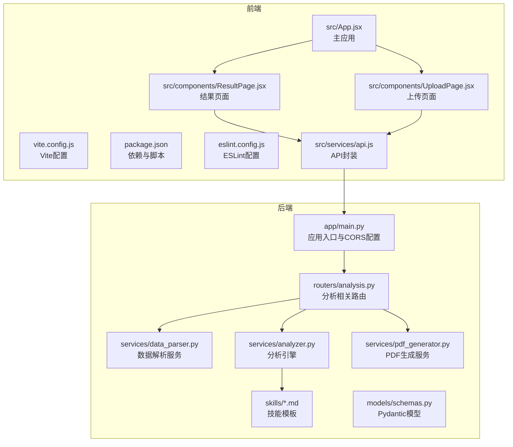
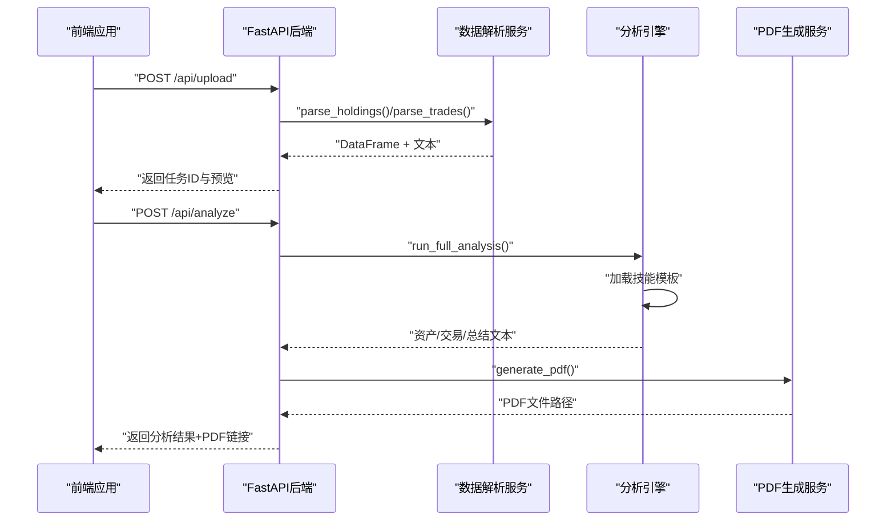
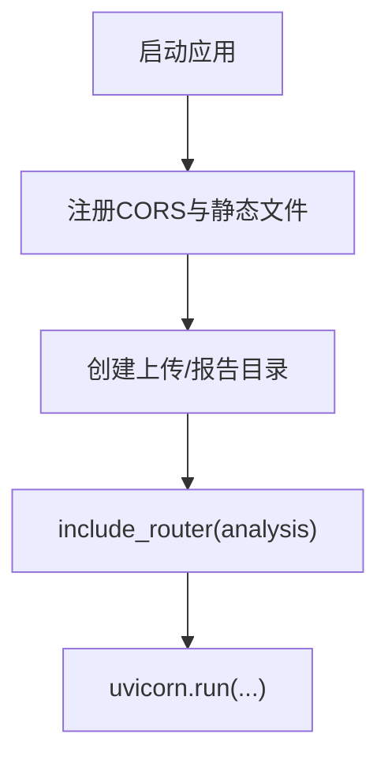
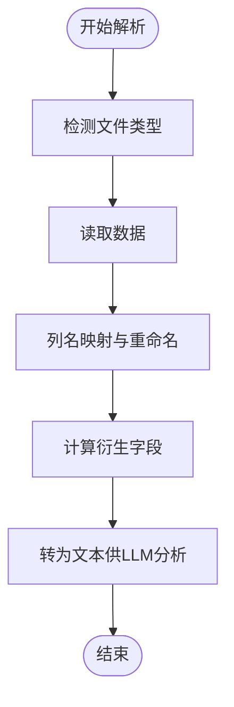
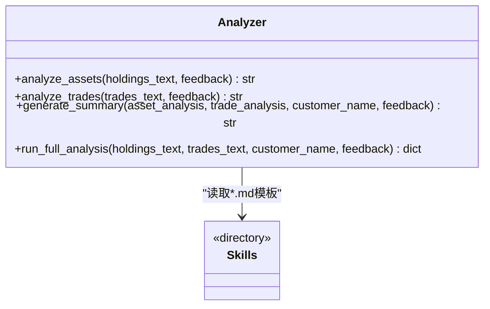
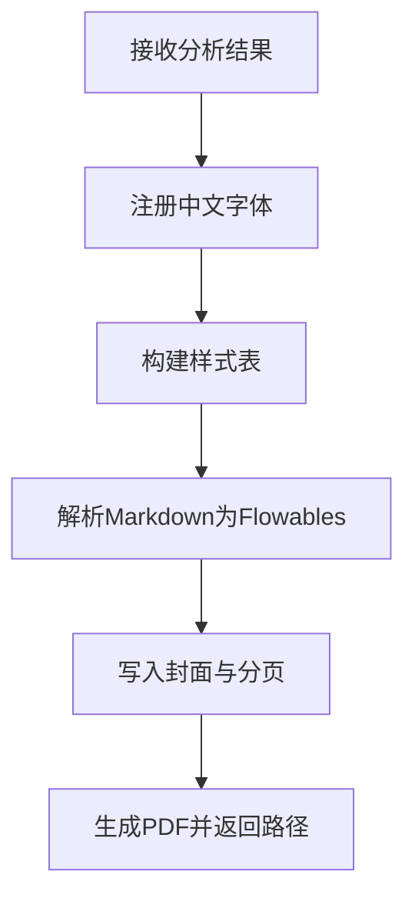
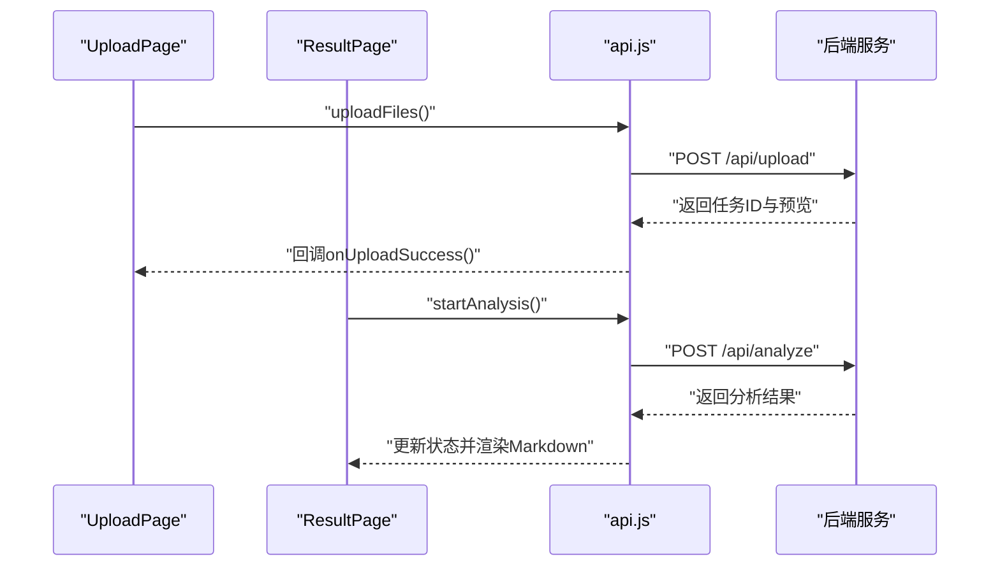
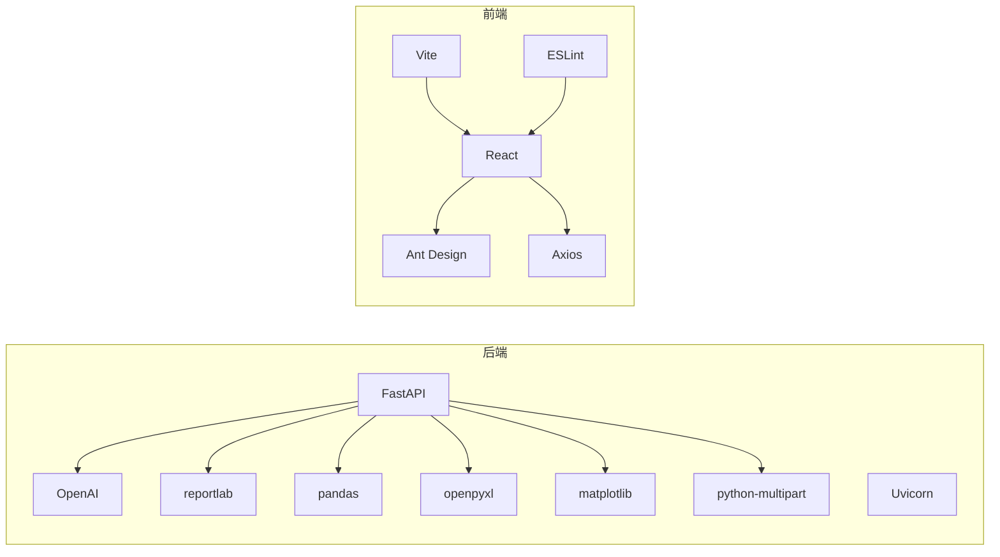

# 开发指南

<cite>
**本文引用的文件**
- [backend/app/main.py](file://backend/app/main.py)
- [backend/requirements.txt](file://backend/requirements.txt)
- [backend/app/routers/analysis.py](file://backend/app/routers/analysis.py)
- [backend/app/services/analyzer.py](file://backend/app/services/analyzer.py)
- [backend/app/services/data_parser.py](file://backend/app/services/data_parser.py)
- [backend/app/services/pdf_generator.py](file://backend/app/services/pdf_generator.py)
- [backend/app/models/schemas.py](file://backend/app/models/schemas.py)
- [backend/app/skills/report_template.md](file://backend/app/skills/report_template.md)
- [frontend/package.json](file://frontend/package.json)
- [frontend/eslint.config.js](file://frontend/eslint.config.js)
- [frontend/vite.config.js](file://frontend/vite.config.js)
- [frontend/src/App.jsx](file://frontend/src/App.jsx)
- [frontend/src/components/UploadPage.jsx](file://frontend/src/components/UploadPage.jsx)
- [frontend/src/components/ResultPage.jsx](file://frontend/src/components/ResultPage.jsx)
- [frontend/src/services/api.js](file://frontend/src/services/api.js)
</cite>

## 目录
1. [简介](#简介)
2. [项目结构](#项目结构)
3. [核心组件](#核心组件)
4. [架构总览](#架构总览)
5. [详细组件分析](#详细组件分析)
6. [依赖分析](#依赖分析)
7. [性能考虑](#性能考虑)
8. [故障排查指南](#故障排查指南)
9. [贡献与提交规范](#贡献与提交规范)
10. [结论](#结论)

## 简介
本指南面向希望参与 Qoder-todo 项目的开发者，涵盖开发环境搭建、代码规范与最佳实践、测试策略、调试技巧、常见问题解决、新增分析维度与自定义报告模板扩展方法，以及贡献代码与 Pull Request 的规范流程。项目采用 Python 后端 FastAPI + React 前端的技术栈，通过大模型 API 实现客户资产分析与 PDF 报告生成。

## 项目结构
项目分为前后端两部分：
- 后端位于 backend/，基于 FastAPI 提供 REST 接口，包含路由、服务层与技能模板。
- 前端位于 frontend/，基于 Vite + React，使用 Ant Design 组件库与 Axios 发起请求。

图表来源
- [backend/app/main.py:1-28](file://backend/app/main.py#L1-L28)
- [backend/app/routers/analysis.py:1-218](file://backend/app/routers/analysis.py#L1-L218)
- [backend/app/services/data_parser.py:1-96](file://backend/app/services/data_parser.py#L1-L96)
- [backend/app/services/analyzer.py:1-93](file://backend/app/services/analyzer.py#L1-L93)
- [backend/app/services/pdf_generator.py:1-215](file://backend/app/services/pdf_generator.py#L1-L215)
- [backend/app/models/schemas.py:1-30](file://backend/app/models/schemas.py#L1-L30)
- [frontend/src/App.jsx:1-81](file://frontend/src/App.jsx#L1-L81)
- [frontend/src/components/UploadPage.jsx:1-145](file://frontend/src/components/UploadPage.jsx#L1-L145)
- [frontend/src/components/ResultPage.jsx:1-193](file://frontend/src/components/ResultPage.jsx#L1-L193)
- [frontend/src/services/api.js:1-48](file://frontend/src/services/api.js#L1-L48)

章节来源
- [backend/app/main.py:1-28](file://backend/app/main.py#L1-L28)
- [frontend/package.json:1-32](file://frontend/package.json#L1-L32)

## 核心组件
- 应用入口与中间件：设置 CORS、静态文件挂载、路由注册与开发服务器启动。
- 分析路由：提供上传、分析、重新生成、PDF 下载与任务状态查询等接口。
- 数据解析服务：统一解析 CSV/Excel，标准化列名并计算衍生指标，输出供 LLM 分析的文本。
- 分析引擎：加载技能模板，调用大模型 API，产出资产配置分析、交易行为分析与综合报告。
- PDF 生成服务：注册中文字体、构建文档样式、渲染 Markdown 并输出 PDF。
- 前端页面与服务：上传页面、结果页面、API 封装与 Ant Design 主题配置。

章节来源
- [backend/app/main.py:1-28](file://backend/app/main.py#L1-L28)
- [backend/app/routers/analysis.py:1-218](file://backend/app/routers/analysis.py#L1-L218)
- [backend/app/services/data_parser.py:1-96](file://backend/app/services/data_parser.py#L1-L96)
- [backend/app/services/analyzer.py:1-93](file://backend/app/services/analyzer.py#L1-L93)
- [backend/app/services/pdf_generator.py:1-215](file://backend/app/services/pdf_generator.py#L1-L215)
- [frontend/src/App.jsx:1-81](file://frontend/src/App.jsx#L1-L81)
- [frontend/src/components/UploadPage.jsx:1-145](file://frontend/src/components/UploadPage.jsx#L1-L145)
- [frontend/src/components/ResultPage.jsx:1-193](file://frontend/src/components/ResultPage.jsx#L1-L193)
- [frontend/src/services/api.js:1-48](file://frontend/src/services/api.js#L1-L48)

## 架构总览
系统采用前后端分离架构，前端通过 Axios 请求后端 API，后端通过 OpenAI 大模型完成分析，并将结果以 PDF 形式提供下载。

图表来源
- [backend/app/routers/analysis.py:35-135](file://backend/app/routers/analysis.py#L35-L135)
- [backend/app/services/data_parser.py:7-96](file://backend/app/services/data_parser.py#L7-L96)
- [backend/app/services/analyzer.py:77-93](file://backend/app/services/analyzer.py#L77-L93)
- [backend/app/services/pdf_generator.py:146-215](file://backend/app/services/pdf_generator.py#L146-L215)
- [frontend/src/services/api.js:10-29](file://frontend/src/services/api.js#L10-L29)

## 详细组件分析

### 后端应用入口与路由
- 入口负责注册 CORS、静态文件目录、上传与报告目录创建、路由挂载与开发服务器启动。
- 路由模块提供上传、分析、重新生成、PDF 下载与任务状态查询接口，内部使用内存字典模拟任务状态存储。

图表来源
- [backend/app/main.py:10-27](file://backend/app/main.py#L10-L27)
- [backend/app/routers/analysis.py:16-22](file://backend/app/routers/analysis.py#L16-L22)

章节来源
- [backend/app/main.py:1-28](file://backend/app/main.py#L1-L28)
- [backend/app/routers/analysis.py:1-218](file://backend/app/routers/analysis.py#L1-L218)

### 数据解析服务
- 支持 CSV/Excel，自动识别中文列名并重命名为英文字段，计算市值、浮动盈亏、盈亏比例等衍生指标。
- 输出结构化 DataFrame 与适合 LLM 分析的文本，用于资产配置与交易行为分析。

图表来源
- [backend/app/services/data_parser.py:7-52](file://backend/app/services/data_parser.py#L7-L52)
- [backend/app/services/data_parser.py:55-96](file://backend/app/services/data_parser.py#L55-L96)

章节来源
- [backend/app/services/data_parser.py:1-96](file://backend/app/services/data_parser.py#L1-L96)

### 分析引擎与技能模板
- 加载技能模板（资产分析、交易行为、综合报告），构造系统提示词与用户提示词，调用大模型 API 返回分析结果。
- 支持传入客户反馈，实现“根据反馈重新生成”。

图表来源
- [backend/app/services/analyzer.py:41-93](file://backend/app/services/analyzer.py#L41-L93)
- [backend/app/skills/report_template.md:1-34](file://backend/app/skills/report_template.md#L1-L34)

章节来源
- [backend/app/services/analyzer.py:1-93](file://backend/app/services/analyzer.py#L1-L93)
- [backend/app/skills/report_template.md:1-34](file://backend/app/skills/report_template.md#L1-L34)

### PDF 报告生成
- 自动注册中文字体，构建标题、副标题、正文等样式，将 Markdown 转换为 ReportLab 可渲染元素。
- 生成封面、报告总结、资产配置分析、交易行为分析与免责声明，并输出 PDF 文件。

图表来源
- [backend/app/services/pdf_generator.py:26-106](file://backend/app/services/pdf_generator.py#L26-L106)
- [backend/app/services/pdf_generator.py:146-215](file://backend/app/services/pdf_generator.py#L146-L215)

章节来源
- [backend/app/services/pdf_generator.py:1-215](file://backend/app/services/pdf_generator.py#L1-L215)

### 前端页面与服务
- 主应用负责步骤导航与页面切换。
- 上传页面支持拖拽上传、文件预览与客户信息输入。
- 结果页面展示分析进度、Markdown 渲染结果、PDF 下载与反馈重新生成。
- API 服务封装基础 URL、超时与请求方法。

图表来源
- [frontend/src/components/UploadPage.jsx:20-38](file://frontend/src/components/UploadPage.jsx#L20-L38)
- [frontend/src/components/ResultPage.jsx:22-35](file://frontend/src/components/ResultPage.jsx#L22-L35)
- [frontend/src/services/api.js:10-29](file://frontend/src/services/api.js#L10-L29)
- [backend/app/routers/analysis.py:35-135](file://backend/app/routers/analysis.py#L35-L135)

章节来源
- [frontend/src/App.jsx:1-81](file://frontend/src/App.jsx#L1-L81)
- [frontend/src/components/UploadPage.jsx:1-145](file://frontend/src/components/UploadPage.jsx#L1-L145)
- [frontend/src/components/ResultPage.jsx:1-193](file://frontend/src/components/ResultPage.jsx#L1-L193)
- [frontend/src/services/api.js:1-48](file://frontend/src/services/api.js#L1-L48)

## 依赖分析
- 后端依赖：FastAPI、Uvicorn、OpenAI SDK、pandas、openpyxl、matplotlib、reportlab、python-multipart。
- 前端依赖：React、Ant Design、Axios、Vite、ESLint 及相关插件。

图表来源
- [backend/requirements.txt:1-9](file://backend/requirements.txt#L1-L9)
- [frontend/package.json:12-30](file://frontend/package.json#L12-L30)

章节来源
- [backend/requirements.txt:1-9](file://backend/requirements.txt#L1-L9)
- [frontend/package.json:1-32](file://frontend/package.json#L1-L32)

## 性能考虑
- 大模型调用耗时较长，建议在前端设置合理的超时与重试机制，避免长时间阻塞。
- PDF 生成涉及字体注册与渲染，建议在 CI/CD 中提前准备中文字体资源，减少首次部署时的初始化开销。
- 数据解析阶段对 CSV/Excel 的读取与列名映射应尽量避免重复扫描，必要时缓存列名映射结果。
- 上传文件大小限制与内存存储策略需结合实际场景优化，生产环境建议替换为持久化存储与队列异步处理。

## 故障排查指南
- CORS 问题：确认后端已正确配置允许来源、方法与头信息。
- OpenAI 配置：检查环境变量 OPENAI_API_KEY、OPENAI_BASE_URL、OPENAI_MODEL 是否正确设置。
- 字体缺失：若 PDF 中文字体显示异常，确保系统存在可用字体或手动指定字体路径。
- 文件解析错误：确认上传文件格式为 CSV 或 Excel，且包含必要的中文列名或可被映射的列名。
- 任务状态异常：检查内存存储中的任务字典是否正确更新状态，避免并发访问导致的数据竞争。
- 前端请求失败：核对后端地址与端口、网络连通性与代理设置。

章节来源
- [backend/app/main.py:10-16](file://backend/app/main.py#L10-L16)
- [backend/app/services/analyzer.py:18-22](file://backend/app/services/analyzer.py#L18-L22)
- [backend/app/services/pdf_generator.py:26-51](file://backend/app/services/pdf_generator.py#L26-L51)
- [frontend/src/services/api.js:3](file://frontend/src/services/api.js#L3-L3)

## 贡献与提交规范
- 开发环境搭建
  - 克隆仓库后，在 backend/ 目录下安装 Python 依赖：[backend/requirements.txt:1-9](file://backend/requirements.txt#L1-L9)
  - 在 frontend/ 目录下安装 Node.js 依赖：[frontend/package.json:12-30](file://frontend/package.json#L12-L30)
  - 设置后端开发服务器：[backend/app/main.py:25-27](file://backend/app/main.py#L25-L27)
  - 启动前端开发服务器：[frontend/package.json:6-11](file://frontend/package.json#L6-L11)
- 代码规范与最佳实践
  - Python 后端遵循 PEP8 规范，使用类型注解与 Pydantic 模型保证接口一致性：[backend/app/models/schemas.py:1-30](file://backend/app/models/schemas.py#L1-L30)
  - JavaScript 前端遵循 ESLint 推荐规则，使用 Flat 配置与 React 插件：[frontend/eslint.config.js:1-30](file://frontend/eslint.config.js#L1-L30)
- 测试策略与单元测试
  - 建议为数据解析服务编写针对不同列名映射与衍生字段计算的单元测试。
  - 为分析引擎编写基于 Mock 的测试，验证系统提示词构造与返回格式。
  - 为 PDF 生成服务编写渲染断言与文件存在性测试。
  - 前端组件测试建议使用 React Testing Library，覆盖上传、分析与下载流程。
- 调试技巧
  - 后端：利用 Uvicorn 的 reload 功能快速重启；在分析路由中打印关键参数与异常堆栈。
  - 前端：使用浏览器开发者工具检查网络请求与响应；在 ResultPage 中增加状态日志。
- 新增分析维度与自定义报告模板
  - 新增分析维度：在 skills/ 目录下新增 *.md 模板，参考现有模板结构与输出要求；在分析引擎中新增对应函数并在 run_full_analysis 中调用。
  - 自定义报告模板：修改 report_template.md 或新增模板文件，调整输出结构与语言风格，确保 PDF 生成服务能正确解析 Markdown。
- 贡献流程
  - Fork 仓库并创建功能分支。
  - 编写清晰的提交信息，描述变更内容与影响范围。
  - 提交 Pull Request，附上测试用例与变更说明，等待代码审查与合并。

章节来源
- [backend/requirements.txt:1-9](file://backend/requirements.txt#L1-L9)
- [frontend/package.json:6-11](file://frontend/package.json#L6-L11)
- [backend/app/models/schemas.py:13-30](file://backend/app/models/schemas.py#L13-L30)
- [frontend/eslint.config.js:1-30](file://frontend/eslint.config.js#L1-L30)
- [backend/app/skills/report_template.md:1-34](file://backend/app/skills/report_template.md#L1-L34)
- [backend/app/services/analyzer.py:77-93](file://backend/app/services/analyzer.py#L77-L93)
- [backend/app/services/pdf_generator.py:146-215](file://backend/app/services/pdf_generator.py#L146-L215)

## 结论
本指南提供了从环境搭建到功能扩展与贡献流程的完整开发指引。建议在开发过程中严格遵循代码规范、完善测试与调试流程，并通过 Pull Request 促进团队协作与质量保障。