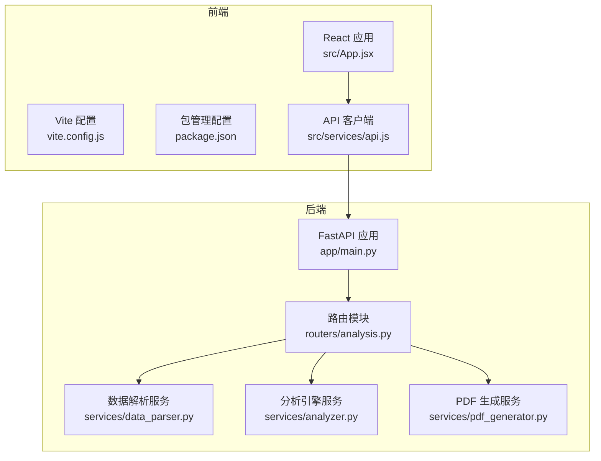
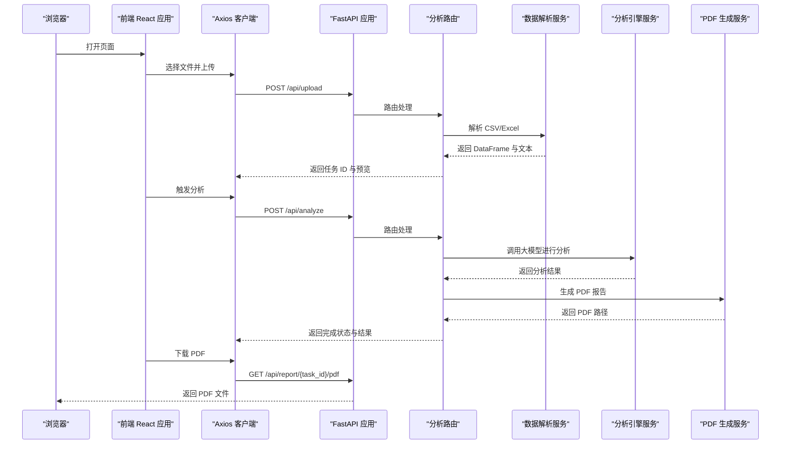
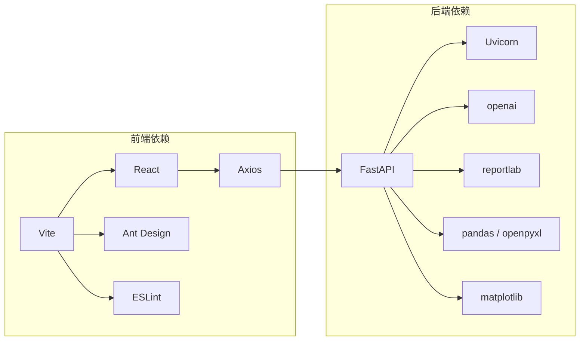

# 开发环境搭建

<cite>
**本文引用的文件**
- [requirements.txt](file://backend/requirements.txt)
- [main.py](file://backend/app/main.py)
- [analysis.py](file://backend/app/routers/analysis.py)
- [analyzer.py](file://backend/app/services/analyzer.py)
- [data_parser.py](file://backend/app/services/data_parser.py)
- [pdf_generator.py](file://backend/app/services/pdf_generator.py)
- [package.json](file://frontend/package.json)
- [vite.config.js](file://frontend/vite.config.js)
- [api.js](file://frontend/src/services/api.js)
- [App.jsx](file://frontend/src/App.jsx)
- [index.html](file://frontend/index.html)
- [README.md](file://frontend/README.md)
</cite>

## 目录
1. [简介](#简介)
2. [项目结构](#项目结构)
3. [核心组件](#核心组件)
4. [架构总览](#架构总览)
5. [详细组件分析](#详细组件分析)
6. [依赖分析](#依赖分析)
7. [性能考虑](#性能考虑)
8. [故障排查指南](#故障排查指南)
9. [结论](#结论)
10. [附录](#附录)

## 简介
本指南面向首次参与 Qoder-todo 项目的开发者，提供从零搭建 Python 后端与 Node.js 前端开发环境的完整步骤，涵盖：
- Python 版本与虚拟环境
- pip 依赖安装
- Node.js 与 npm 环境准备
- OpenAI API 密钥与相关环境变量配置
- 本地开发服务器启动（后端 FastAPI + 前端 Vite）
- 常见环境问题排查与解决方案

## 项目结构
项目采用前后端分离架构：
- 后端基于 FastAPI，提供文件上传、数据分析与 PDF 报告导出等接口
- 前端基于 React + Vite，通过 Axios 调用后端 API，实现上传与分析流程

图表来源
- [main.py:1-28](file://backend/app/main.py#L1-L28)
- [analysis.py:1-218](file://backend/app/routers/analysis.py#L1-L218)
- [data_parser.py:1-96](file://backend/app/services/data_parser.py#L1-L96)
- [analyzer.py:1-93](file://backend/app/services/analyzer.py#L1-L93)
- [pdf_generator.py:1-215](file://backend/app/services/pdf_generator.py#L1-L215)
- [App.jsx:1-81](file://frontend/src/App.jsx#L1-L81)
- [vite.config.js:1-8](file://frontend/vite.config.js#L1-L8)
- [package.json:1-32](file://frontend/package.json#L1-L32)
- [api.js:1-48](file://frontend/src/services/api.js#L1-L48)

章节来源
- [main.py:1-28](file://backend/app/main.py#L1-L28)
- [analysis.py:1-218](file://backend/app/routers/analysis.py#L1-L218)
- [package.json:1-32](file://frontend/package.json#L1-L32)

## 核心组件
- 后端应用入口与静态资源挂载：在应用入口中启用 CORS 并挂载上传与分析相关路由；同时创建上传与报告输出目录。
- 路由层负责接收文件上传、触发分析、查询任务状态与下载 PDF。
- 服务层包含数据解析（CSV/Excel）、大模型分析（OpenAI）、PDF 报告生成。
- 前端通过 Axios 调用后端 API，实现上传、分析与下载流程。

章节来源
- [main.py:1-28](file://backend/app/main.py#L1-L28)
- [analysis.py:1-218](file://backend/app/routers/analysis.py#L1-L218)
- [data_parser.py:1-96](file://backend/app/services/data_parser.py#L1-L96)
- [analyzer.py:1-93](file://backend/app/services/analyzer.py#L1-L93)
- [pdf_generator.py:1-215](file://backend/app/services/pdf_generator.py#L1-L215)
- [api.js:1-48](file://frontend/src/services/api.js#L1-L48)

## 架构总览
下图展示从浏览器到后端服务的典型交互流程，包括文件上传、分析触发、报告生成与下载。

图表来源
- [api.js:1-48](file://frontend/src/services/api.js#L1-L48)
- [analysis.py:35-153](file://backend/app/routers/analysis.py#L35-L153)
- [data_parser.py:7-96](file://backend/app/services/data_parser.py#L7-L96)
- [analyzer.py:41-93](file://backend/app/services/analyzer.py#L41-L93)
- [pdf_generator.py:146-215](file://backend/app/services/pdf_generator.py#L146-L215)

## 详细组件分析

### 后端环境准备（Python）
- Python 版本要求
  - 推荐使用 Python 3.10 或以上版本以获得最佳兼容性。
- 创建虚拟环境
  - 在项目根目录执行命令创建隔离环境（例如 venv 方式），随后激活该环境。
- 安装依赖
  - 在 backend 目录执行安装命令，读取 requirements.txt 中的依赖并安装。
- 运行后端开发服务器
  - 在 backend 目录下运行主程序，使用 Uvicorn 在 0.0.0.0:8000 启动服务，并开启自动重载。

章节来源
- [requirements.txt:1-9](file://backend/requirements.txt#L1-L9)
- [main.py:25-28](file://backend/app/main.py#L25-L28)

### 前端环境准备（Node.js 与 npm）
- Node.js 与 npm
  - 确保已安装 Node.js 与 npm（推荐使用 LTS 版本）。
- 安装依赖
  - 在 frontend 目录执行安装命令，读取 package.json 中的依赖并安装。
- Vite 开发服务器
  - 在 frontend 目录执行开发命令，启动 Vite 本地服务器，默认端口由 Vite 配置决定。
- 构建产物
  - 生产构建会生成 dist 目录，包含打包后的静态资源。

章节来源
- [package.json:1-32](file://frontend/package.json#L1-L32)
- [vite.config.js:1-8](file://frontend/vite.config.js#L1-L8)
- [index.html:1-14](file://frontend/index.html#L1-L14)

### OpenAI API 与环境变量
- 环境变量
  - OPENAI_API_KEY：用于鉴权的大模型 API 密钥。
  - OPENAI_BASE_URL：可选，用于自定义大模型服务地址。
  - OPENAI_MODEL：可选，指定使用的模型，默认为 gpt-4o。
- 配置位置
  - 分析引擎在运行时从环境变量读取上述参数，若未设置则按默认值处理。
- 注意事项
  - 若使用代理或自定义网关，请确保网络可达且 Base URL 正确。
  - 如遇连接超时或鉴权失败，请检查密钥有效性与网络策略。

章节来源
- [analyzer.py:18-38](file://backend/app/services/analyzer.py#L18-L38)

### 本地开发服务器启动
- 启动后端（FastAPI + Uvicorn）
  - 在 backend 目录执行主程序，监听 0.0.0.0:8000，支持热重载。
- 启动前端（Vite）
  - 在 frontend 目录执行开发命令，启动本地前端服务器。
- 前端 API 地址
  - 前端 Axios 默认指向 http://localhost:8000/api，确保后端已启动。

章节来源
- [main.py:25-28](file://backend/app/main.py#L25-L28)
- [vite.config.js:1-8](file://frontend/vite.config.js#L1-L8)
- [api.js](file://frontend/src/services/api.js#L3)

### 数据解析与分析流程
- 数据解析
  - 支持 CSV 与 Excel 文件，自动标准化列名并计算衍生指标（如市值、浮动盈亏、盈亏比例等）。
- 大模型分析
  - 通过系统提示词模板与用户输入文本调用大模型，分别生成资产配置分析、交易行为分析与综合报告。
- PDF 报告生成
  - 自动注册中文字体并生成 A4 报告，包含封面、总结、资产分析、交易分析与免责声明。

章节来源
- [data_parser.py:7-96](file://backend/app/services/data_parser.py#L7-L96)
- [analyzer.py:41-93](file://backend/app/services/analyzer.py#L41-L93)
- [pdf_generator.py:146-215](file://backend/app/services/pdf_generator.py#L146-L215)

## 依赖分析
- 后端依赖
  - FastAPI、Uvicorn、python-multipart、openai、reportlab、pandas、openpyxl、matplotlib 等。
- 前端依赖
  - React、ReactDOM、Ant Design、Axios、Vite 及其 React 插件、ESLint 等。
- 关键关系
  - 前端通过 Axios 调用后端 /api 前缀下的接口。
  - 后端路由层依赖数据解析、分析引擎与 PDF 生成服务。

图表来源
- [requirements.txt:1-9](file://backend/requirements.txt#L1-L9)
- [package.json:12-30](file://frontend/package.json#L12-L30)

章节来源
- [requirements.txt:1-9](file://backend/requirements.txt#L1-L9)
- [package.json:1-32](file://frontend/package.json#L1-L32)

## 性能考虑
- 分析耗时
  - 前端 Axios 设置了较长的请求超时时间，以适配分析过程的潜在耗时。
- PDF 生成
  - 字体注册存在多平台路径尝试，若字体缺失将回退至默认字体，避免阻塞但可能影响中文渲染。
- 数据规模
  - 大文件上传与分析可能导致内存与 I/O 压力，建议在生产环境使用数据库与异步队列。

章节来源
- [api.js](file://frontend/src/services/api.js#L7)
- [pdf_generator.py:26-50](file://backend/app/services/pdf_generator.py#L26-L50)

## 故障排查指南
- 后端无法启动（端口占用）
  - 确认 8000 端口未被占用，或修改后端启动主机与端口配置。
- CORS 跨域问题
  - 当前端与后端不在同一端口访问时，确认后端已正确配置允许跨域请求。
- OpenAI API 访问失败
  - 检查 OPENAI_API_KEY 是否设置且有效；若使用自定义 Base URL，请确保网络可达。
- 文件上传失败
  - 确认上传目录存在且具备写权限；检查文件格式是否为 CSV 或 Excel。
- PDF 生成中文乱码
  - 确认目标系统存在可用的中文字体；若未找到，将回退为默认字体。
- 前端无法访问后端接口
  - 确认前端 Axios 的基础 URL 指向正确的后端地址与 /api 前缀。

章节来源
- [main.py:10-16](file://backend/app/main.py#L10-L16)
- [analysis.py:19-22](file://backend/app/routers/analysis.py#L19-L22)
- [analyzer.py:18-22](file://backend/app/services/analyzer.py#L18-L22)
- [pdf_generator.py:31-50](file://backend/app/services/pdf_generator.py#L31-L50)
- [api.js](file://frontend/src/services/api.js#L3)

## 结论
按照本指南完成 Python 与 Node.js 环境准备、依赖安装与环境变量配置后，即可顺利启动后端与前端开发服务器。在开发过程中，重点关注 OpenAI API 的密钥与网络连通性、文件上传与 PDF 生成的平台差异，以及跨域与端口占用等常见问题。

## 附录
- 快速启动清单
  - 后端：进入 backend 目录，创建并激活虚拟环境，安装 requirements.txt，运行主程序。
  - 前端：进入 frontend 目录，安装依赖，启动 Vite 开发服务器。
  - 环境变量：设置 OPENAI_API_KEY（可选 OPENAI_BASE_URL、OPENAI_MODEL）。
- 参考文档
  - 前端模板与插件说明可参考前端 README。

章节来源
- [README.md:1-17](file://frontend/README.md#L1-L17)