# API接口扩展

<cite>
**本文档引用的文件**
- [analysis.py](file://backend/app/routers/analysis.py)
- [schemas.py](file://backend/app/models/schemas.py)
- [main.py](file://backend/app/main.py)
- [analyzer.py](file://backend/app/services/analyzer.py)
- [data_parser.py](file://backend/app/services/data_parser.py)
- [pdf_generator.py](file://backend/app/services/pdf_generator.py)
- [asset_analysis.md](file://backend/app/skills/asset_analysis.md)
- [trade_behavior.md](file://backend/app/skills/trade_behavior.md)
- [report_template.md](file://backend/app/skills/report_template.md)
- [api.js](file://frontend/src/services/api.js)
- [requirements.txt](file://backend/requirements.txt)
</cite>

## 目录
1. [简介](#简介)
2. [项目架构概览](#项目架构概览)
3. [核心组件分析](#核心组件分析)
4. [API接口扩展指南](#api接口扩展指南)
5. [数据模型扩展指南](#数据模型扩展指南)
6. [具体扩展示例](#具体扩展示例)
7. [API版本控制与兼容性](#api版本控制与兼容性)
8. [API测试方法](#api测试方法)
9. [文档生成最佳实践](#文档生成最佳实践)
10. [故障排除指南](#故障排除指南)
11. [结论](#结论)

## 简介

Qoder-todo是一个基于FastAPI构建的客户资产分析工具，提供了完整的文件上传、数据分析和PDF报告生成功能。该项目采用模块化架构设计，通过Routers层处理HTTP请求，Services层实现业务逻辑，Models层定义数据模型，Skills层提供AI分析模板。

本指南将详细介绍如何在现有基础上扩展API接口，包括路由处理函数的添加、数据模型的定义、错误处理机制的实现，以及如何保持API版本控制和向后兼容性。

## 项目架构概览

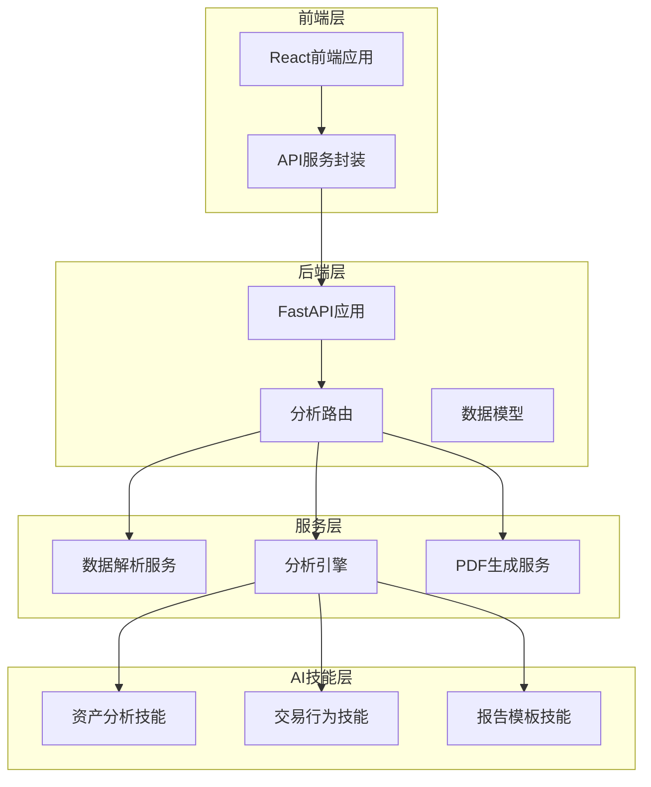

**图表来源**
- [main.py:8](file://backend/app/main.py#L8)
- [analysis.py:14](file://backend/app/routers/analysis.py#L14)
- [analyzer.py:18](file://backend/app/services/analyzer.py#L18)

**章节来源**
- [main.py:1-28](file://backend/app/main.py#L1-L28)
- [analysis.py:1-218](file://backend/app/routers/analysis.py#L1-L218)

## 核心组件分析

### 路由器组件

分析路由器负责处理所有与分析相关的HTTP请求，采用装饰器模式定义各个API端点。

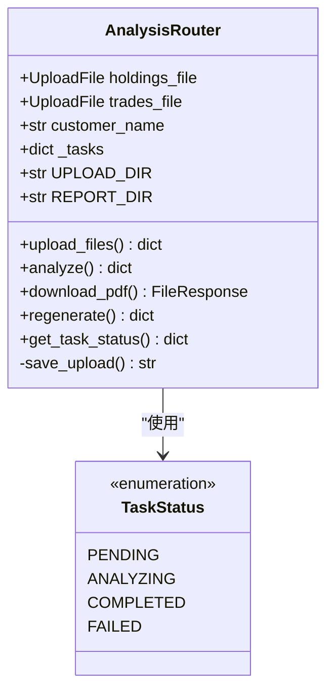

**图表来源**
- [analysis.py:14](file://backend/app/routers/analysis.py#L14)
- [analysis.py:6](file://backend/app/routers/analysis.py#L6)

### 服务组件

服务层包含三个核心服务：数据解析、分析引擎和PDF生成。

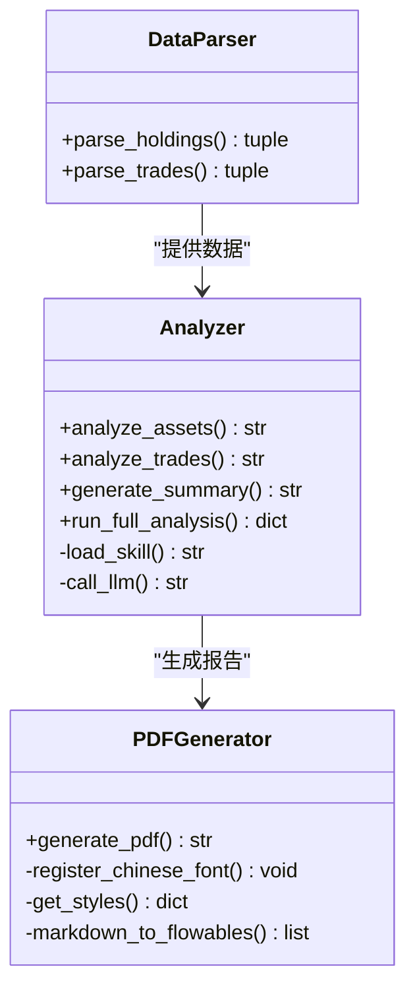

**图表来源**
- [data_parser.py:7](file://backend/app/services/data_parser.py#L7)
- [analyzer.py:41](file://backend/app/services/analyzer.py#L41)
- [pdf_generator.py:146](file://backend/app/services/pdf_generator.py#L146)

**章节来源**
- [analysis.py:10-12](file://backend/app/routers/analysis.py#L10-L12)
- [data_parser.py:1-96](file://backend/app/services/data_parser.py#L1-L96)
- [analyzer.py:1-93](file://backend/app/services/analyzer.py#L1-L93)
- [pdf_generator.py:1-215](file://backend/app/services/pdf_generator.py#L1-L215)

## API接口扩展指南

### 添加新的路由处理函数

#### 1. 基础路由结构

在analysis.py中添加新路由的基本步骤：

1. **导入必要的模块**：确保导入所需的类型注解和异常处理
2. **定义路由装饰器**：使用适当的HTTP方法装饰器
3. **实现请求处理函数**：包含参数验证、业务逻辑和响应格式化
4. **错误处理**：实现适当的异常处理和HTTP状态码设置

#### 2. 请求参数定义

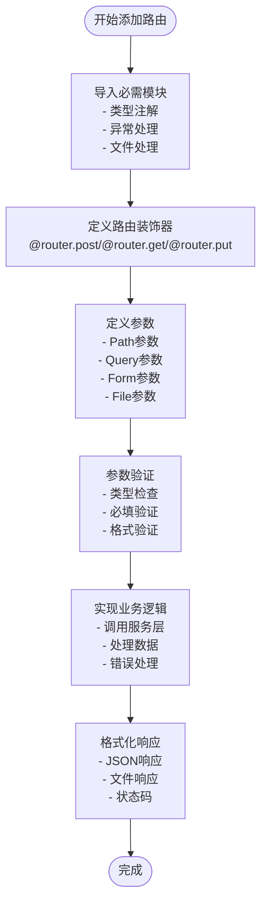

**图表来源**
- [analysis.py:35](file://backend/app/routers/analysis.py#L35)
- [analysis.py:86](file://backend/app/routers/analysis.py#L86)

#### 3. 响应格式设计

标准响应格式包含以下关键字段：
- `task_id`: 任务唯一标识符
- `status`: 任务执行状态
- `customer_name`: 客户名称
- `message`: 操作结果描述
- `error`: 错误信息（如有）

#### 4. 错误处理机制

实现统一的错误处理策略：

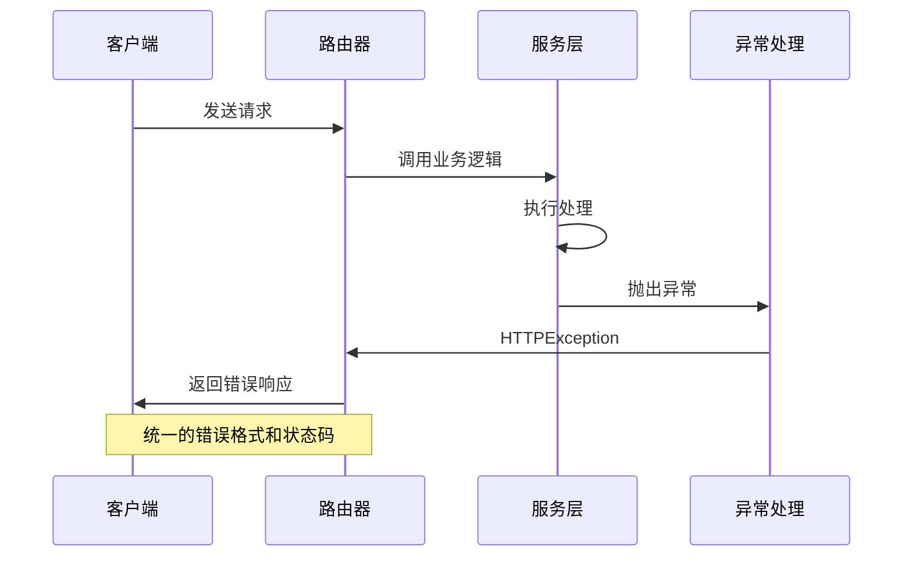

**图表来源**
- [analysis.py:54](file://backend/app/routers/analysis.py#L54)
- [analysis.py:130](file://backend/app/routers/analysis.py#L130)

**章节来源**
- [analysis.py:35-218](file://backend/app/routers/analysis.py#L35-L218)

## 数据模型扩展指南

### 在schemas.py中定义新的数据模型类

#### 1. 基础模型结构

Pydantic BaseModel提供了强大的数据验证和序列化功能：

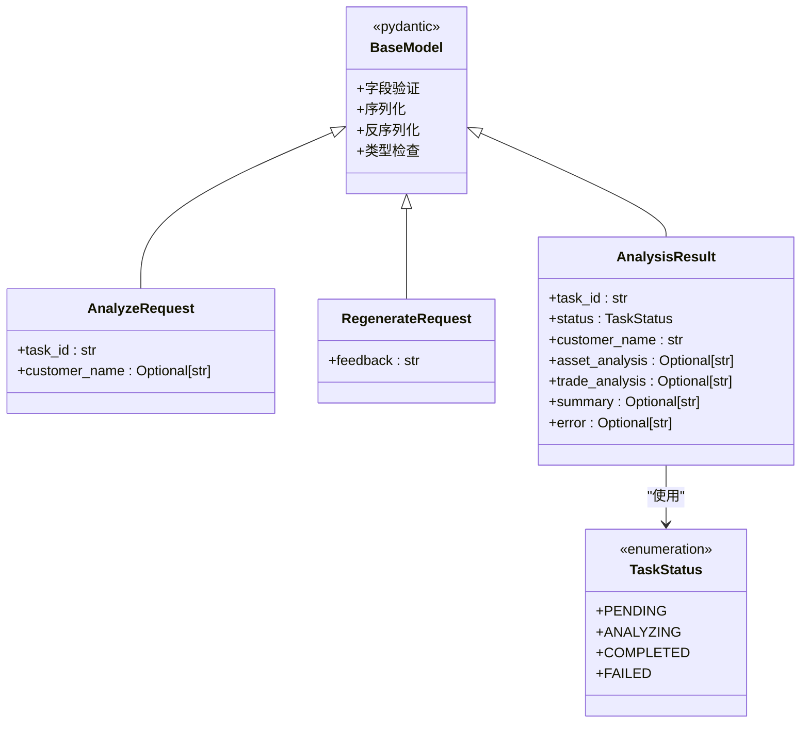

**图表来源**
- [schemas.py:13](file://backend/app/models/schemas.py#L13)
- [schemas.py:18](file://backend/app/models/schemas.py#L18)
- [schemas.py:22](file://backend/app/models/schemas.py#L22)

#### 2. 字段验证规则

实现字段验证的最佳实践：

1. **类型注解**：为每个字段提供明确的类型定义
2. **可选字段**：使用Optional类型处理可选参数
3. **默认值**：为可选字段提供合理的默认值
4. **验证器**：使用Pydantic的验证器功能进行复杂验证

#### 3. 序列化和反序列化

- **序列化**：自动将Pydantic模型转换为JSON格式
- **反序列化**：自动从JSON数据创建Pydantic模型实例
- **嵌套模型**：支持复杂的嵌套数据结构

**章节来源**
- [schemas.py:1-30](file://backend/app/models/schemas.py#L1-L30)

## 具体扩展示例

### 示例1：添加文件上传功能扩展

#### 1. 新增上传端点

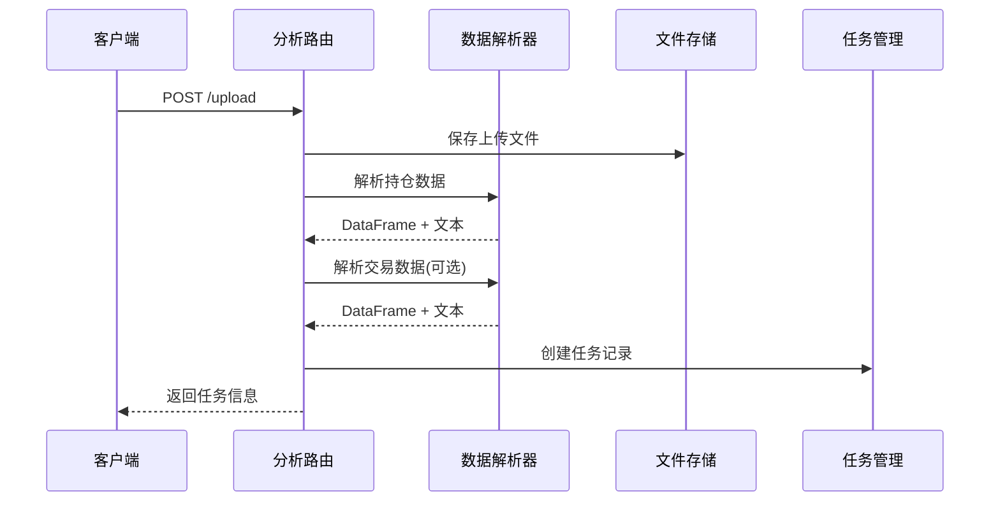

**图表来源**
- [analysis.py:35](file://backend/app/routers/analysis.py#L35)
- [analysis.py:51](file://backend/app/routers/analysis.py#L51)

#### 2. 实现步骤

1. **定义路由装饰器**：使用`@router.post("/upload")`
2. **参数定义**：使用`UploadFile`和`Form`装饰器
3. **文件保存**：实现文件持久化逻辑
4. **数据解析**：调用数据解析服务
5. **任务创建**：在内存中创建任务记录

### 示例2：添加分析状态查询功能

#### 1. 状态查询端点

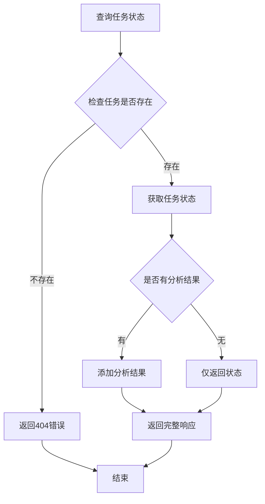

**图表来源**
- [analysis.py:202](file://backend/app/routers/analysis.py#L202)
- [analysis.py:209](file://backend/app/routers/analysis.py#L209)

#### 2. 实现要点

- **状态枚举**：使用`TaskStatus`枚举确保状态一致性
- **条件响应**：根据任务状态动态添加分析结果
- **错误处理**：处理不存在的任务ID

### 示例3：添加报告下载功能

#### 1. PDF下载流程

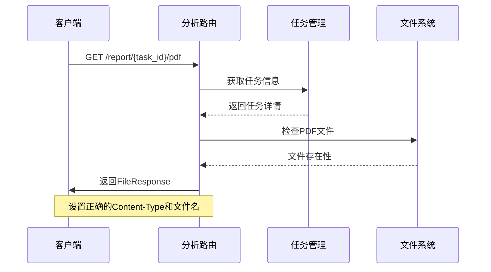

**图表来源**
- [analysis.py:137](file://backend/app/routers/analysis.py#L137)
- [analysis.py:148](file://backend/app/routers/analysis.py#L148)

#### 2. 文件响应配置

- **媒体类型**：设置为`application/pdf`
- **文件名**：动态生成包含客户名称和任务ID的文件名
- **路径验证**：确保文件存在且可访问

**章节来源**
- [analysis.py:35-218](file://backend/app/routers/analysis.py#L35-L218)

## API版本控制与兼容性

### 版本控制策略

#### 1. URL版本控制

采用URL前缀进行版本管理：

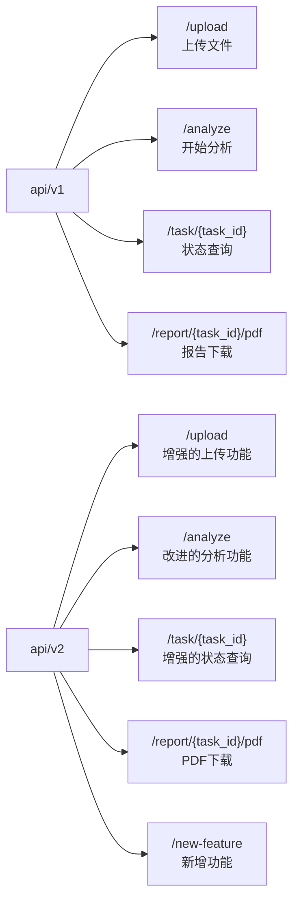

**图表来源**
- [main.py:23](file://backend/app/main.py#L23)

#### 2. 向后兼容性保证

- **保留旧端点**：在新版本中保留原有API端点
- **参数兼容**：确保新增参数为可选，不影响现有调用
- **响应格式**：保持响应结构的一致性
- **错误码**：维持相同的HTTP状态码语义

### 兼容性迁移指南

#### 1. 渐进式更新

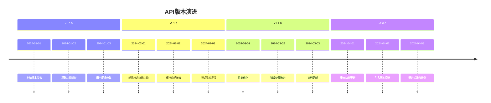

**章节来源**
- [main.py:8](file://backend/app/main.py#L8)
- [main.py:23](file://backend/app/main.py#L23)

## API测试方法

### 单元测试策略

#### 1. 路由层测试

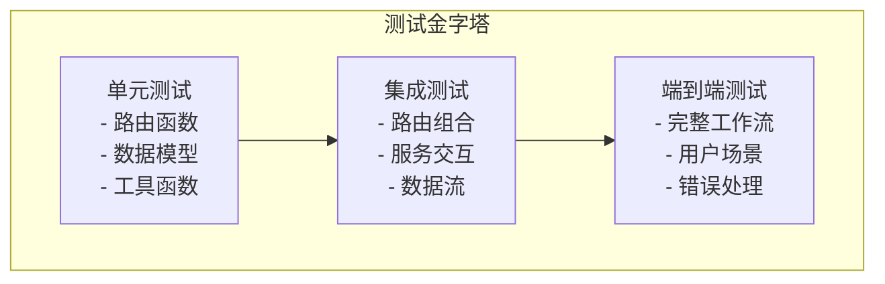

#### 2. 测试用例设计

##### 基础功能测试
- **文件上传测试**：验证CSV和Excel文件解析
- **分析流程测试**：端到端分析流程验证
- **状态查询测试**：不同状态下的响应验证
- **报告生成测试**：PDF文件生成和下载

##### 错误处理测试
- **无效文件类型**：测试错误的文件格式
- **缺失参数**：验证必填参数的错误处理
- **文件损坏**：测试损坏文件的处理
- **网络异常**：模拟外部服务故障

### 测试工具推荐

#### 1. 后端测试框架

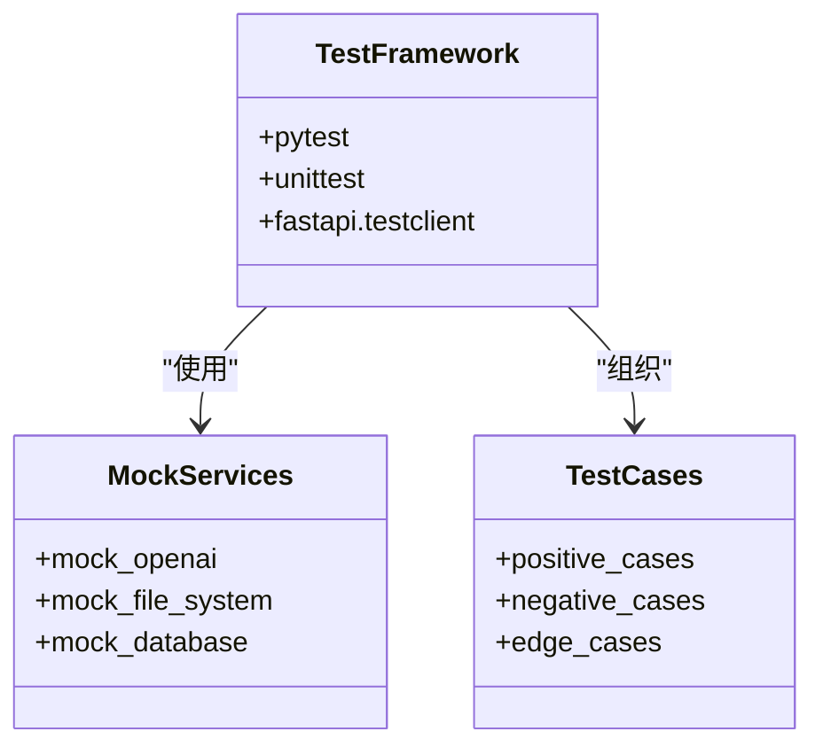

**图表来源**
- [requirements.txt:1-9](file://backend/requirements.txt#L1-L9)

#### 2. 前端测试策略

- **API服务测试**：使用Jest测试API封装函数
- **组件测试**：测试React组件的渲染和交互
- **集成测试**：测试完整的用户工作流

**章节来源**
- [api.js:10-40](file://frontend/src/services/api.js#L10-L40)

## 文档生成最佳实践

### 自动生成API文档

#### 1. FastAPI文档特性

```mermaid
graph TB
subgraph "OpenAPI规范"
Info[应用信息<br/>- 标题<br/>- 版本<br/>- 描述]
Paths[路径定义<br/>- HTTP方法<br/>- 参数<br/>- 响应]
Components[组件<br/>- Schemas<br/>- Security]
end
subgraph "Swagger UI"
Swagger[交互式文档<br/>- 在线测试<br/>- 参数示例<br/>- 响应预览]
end
subgraph "Redoc"
Redoc[静态文档<br/>- 美化界面<br/>- 导航结构<br/>- 搜索功能]
end
Info --> Swagger
Paths --> Swagger
Components --> Swagger
Info --> Redoc
Paths --> Redoc
Components --> Redoc
```

**图表来源**
- [main.py:8](file://backend/app/main.py#L8)

#### 2. 文档维护策略

- **实时同步**：确保代码变更时文档自动更新
- **版本分离**：为不同版本维护独立的文档
- **示例丰富**：提供完整的请求和响应示例
- **错误码说明**：详细说明各种错误情况

### 文档生成工具

#### 1. 自动化文档生成

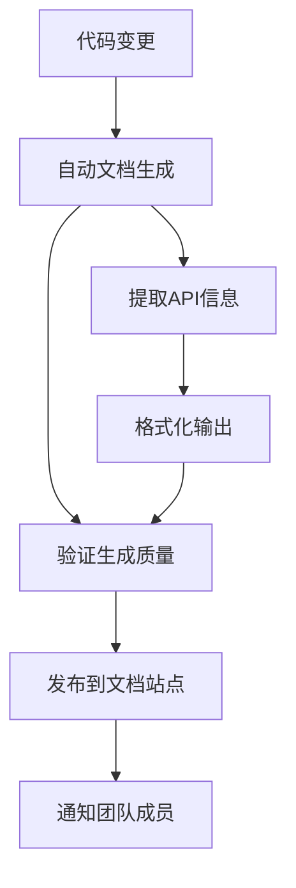

#### 2. 文档质量保证

- **一致性检查**：确保API文档与实际实现一致
- **完整性验证**：检查所有端点都有文档
- **可读性优化**：提供清晰易懂的说明
- **多语言支持**：考虑国际化需求

**章节来源**
- [main.py:8](file://backend/app/main.py#L8)

## 故障排除指南

### 常见问题诊断

#### 1. 文件上传问题

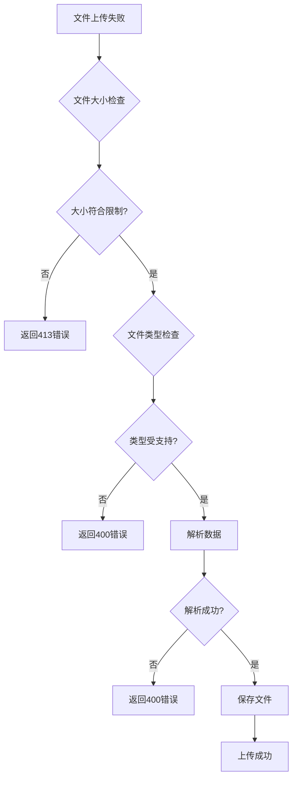

**图表来源**
- [analysis.py:51](file://backend/app/routers/analysis.py#L51)
- [analysis.py:59](file://backend/app/routers/analysis.py#L59)

#### 2. 分析服务故障

- **OpenAI API错误**：检查API密钥和网络连接
- **内存不足**：监控内存使用，优化大数据处理
- **超时问题**：调整超时设置和异步处理

#### 3. PDF生成问题

- **字体缺失**：确保中文字体正确安装
- **权限问题**：检查文件写入权限
- **磁盘空间**：监控磁盘使用情况

### 调试技巧

#### 1. 日志记录

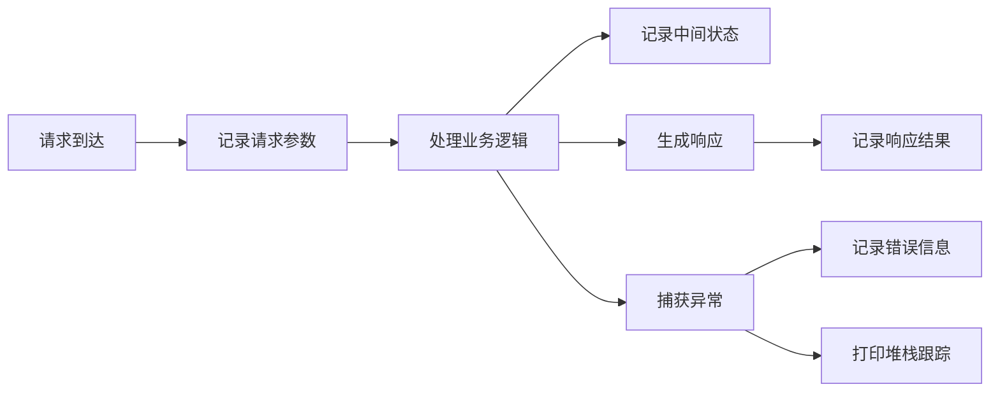

#### 2. 性能监控

- **响应时间**：监控API响应延迟
- **资源使用**：监控CPU和内存使用
- **并发处理**：测试高并发场景下的稳定性

**章节来源**
- [analysis.py:54](file://backend/app/routers/analysis.py#L54)
- [analysis.py:130](file://backend/app/routers/analysis.py#L130)
- [pdf_generator.py:26](file://backend/app/services/pdf_generator.py#L26)

## 结论

Qoder-todo项目提供了一个完整的API扩展框架，通过模块化的设计和清晰的分层架构，使得添加新的API功能变得简单而可靠。本文档详细介绍了如何在现有基础上扩展API接口，包括路由处理函数的添加、数据模型的定义、错误处理机制的实现，以及如何保持API版本控制和向后兼容性。

关键要点包括：
- **模块化架构**：清晰的分层设计便于功能扩展
- **类型安全**：Pydantic模型提供强类型验证
- **错误处理**：统一的异常处理机制
- **版本控制**：URL前缀策略确保向后兼容
- **文档自动化**：基于FastAPI的自动文档生成
- **测试覆盖**：多层次的测试策略保证质量

通过遵循本文档的指导原则和最佳实践，开发者可以快速而安全地扩展Qoder-todo的API功能，满足不断变化的业务需求。