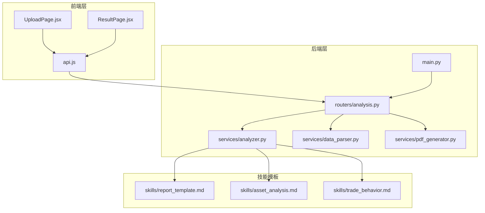
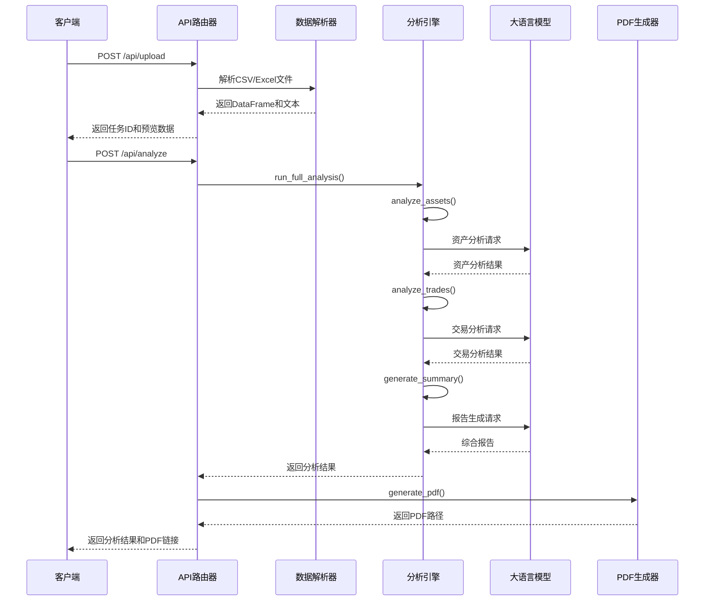
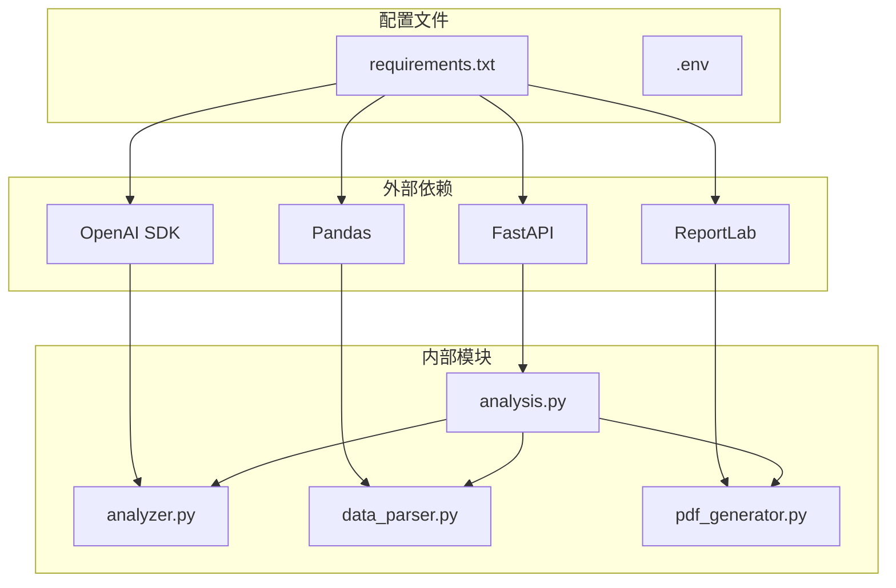

# 分析功能扩展

<cite>
**本文档引用的文件**
- [analyzer.py](file://backend/app/services/analyzer.py)
- [report_template.md](file://backend/app/skills/report_template.md)
- [analysis.py](file://backend/app/routers/analysis.py)
- [main.py](file://backend/app/main.py)
- [data_parser.py](file://backend/app/services/data_parser.py)
- [pdf_generator.py](file://backend/app/services/pdf_generator.py)
- [api.js](file://frontend/src/services/api.js)
- [App.jsx](file://frontend/src/App.jsx)
- [requirements.txt](file://backend/requirements.txt)
</cite>

## 目录
1. [简介](#简介)
2. [项目结构](#项目结构)
3. [核心组件](#核心组件)
4. [架构概览](#架构概览)
5. [详细组件分析](#详细组件分析)
6. [依赖关系分析](#依赖关系分析)
7. [性能考虑](#性能考虑)
8. [故障排除指南](#故障排除指南)
9. [结论](#结论)

## 简介

Qoder-todo是一个基于FastAPI的客户资产分析工具，通过集成大语言模型实现对客户持仓和交易数据的智能分析。该系统提供了完整的分析工作流，从数据上传、解析、分析到报告生成，支持客户经理的反馈重分析功能。

系统采用模块化设计，主要包括：
- **分析引擎**：负责调用大语言模型进行数据分析
- **技能模板系统**：通过Markdown模板定义分析规则和输出格式
- **API路由层**：提供RESTful接口处理文件上传、分析和报告下载
- **前端界面**：提供用户友好的操作界面

## 项目结构



**图表来源**
- [main.py:1-28](file://backend/app/main.py#L1-L28)
- [analysis.py:1-218](file://backend/app/routers/analysis.py#L1-L218)
- [analyzer.py:1-93](file://backend/app/services/analyzer.py#L1-L93)

**章节来源**
- [main.py:1-28](file://backend/app/main.py#L1-L28)
- [requirements.txt:1-9](file://backend/requirements.txt#L1-L9)

## 核心组件

### 分析引擎 (Analyzer)

分析引擎是系统的核心组件，负责与大语言模型交互并执行各种分析任务。

**主要功能**：
- 加载技能模板文件
- 构建系统提示词和用户提示词
- 调用大语言模型API
- 处理分析结果

**关键特性**：
- 支持多种分析类型：资产配置分析、交易行为分析、综合报告生成
- 集成反馈机制，支持重分析功能
- 可配置的模型参数和环境变量

**章节来源**
- [analyzer.py:1-93](file://backend/app/services/analyzer.py#L1-L93)

### 技能模板系统

技能模板系统通过Markdown文件定义分析规则和输出格式，提供高度可定制的分析能力。

**模板类型**：
- `asset_analysis.md`：资产配置分析模板
- `trade_behavior.md`：交易行为分析模板  
- `report_template.md`：综合报告生成模板

**模板结构**：
- 系统角色定义
- 分析要点指导
- 输出格式要求
- 专业术语规范

**章节来源**
- [report_template.md:1-34](file://backend/app/skills/report_template.md#L1-L34)

### API路由层

API路由层提供完整的RESTful接口，处理文件上传、分析触发和报告下载等操作。

**核心接口**：
- `POST /api/upload`：上传持仓和交易数据文件
- `POST /api/analyze`：触发分析流程
- `POST /api/analyze/{task_id}/regenerate`：根据反馈重新生成分析
- `GET /api/report/{task_id}/pdf`：下载PDF报告
- `GET /api/task/{task_id}`：查询任务状态

**章节来源**
- [analysis.py:1-218](file://backend/app/routers/analysis.py#L1-L218)

## 架构概览



**图表来源**
- [analysis.py:86-135](file://backend/app/routers/analysis.py#L86-L135)
- [analyzer.py:77-93](file://backend/app/services/analyzer.py#L77-L93)

## 详细组件分析

### 分析函数扩展指南

#### 函数签名设计原则

在`analyzer.py`中添加新分析函数时，应遵循以下设计原则：

**基础函数签名**：
```python
def analyze_[function_name]([input_params], feedback: Optional[str] = None) -> str:
    """[函数描述]"""
    skill = _load_skill("[skill_template_name]")
    user_prompt = f"[分析指令]\n\n{[input_data]}"
    if feedback:
        user_prompt += f"\n\n客户经理反馈意见（请据此调整分析）：\n{feedback}"
    return _call_llm(skill, user_prompt)
```

**参数设计要点**：
- 输入参数应明确数据类型和用途
- `feedback`参数作为可选参数，支持重分析功能
- 返回值统一为字符串格式的分析结果

#### LLM调用模式

**系统提示词构建**：
- 通过`_load_skill()`加载对应的Markdown模板
- 模板文件位于`skills/`目录下
- 系统提示词定义分析角色和输出规范

**用户提示词构造**：
- 包含具体的分析数据
- 添加分析指令和上下文信息
- 支持反馈参数的动态注入

**章节来源**
- [analyzer.py:41-56](file://backend/app/services/analyzer.py#L41-L56)
- [analyzer.py:25-38](file://backend/app/services/analyzer.py#L25-L38)

### 新分析模板创建

#### Markdown格式规范

**模板文件命名**：
- 使用下划线分隔的英文名称
- 文件扩展名为`.md`
- 例如：`custom_analysis.md`

**模板结构要求**：
```markdown
# [分析主题] Skill

你是一位[专业角色]。请根据以下[分析对象]，生成专业的[分析类型]报告。

## 分析要点
- [核心分析维度1]
- [核心分析维度2]
- [核心分析维度3]

## 输出要求
- [输出格式要求1]
- [输出格式要求2]
- [输出格式要求3]

## 特殊说明
- [业务规则说明]
- [注意事项]
```

#### 系统提示词编写

**角色定义**：
- 明确专业身份和职责范围
- 设定分析的专业性和权威性
- 规定输出的语言风格和格式

**分析指导**：
- 列出关键分析维度
- 提供具体的分析方法
- 规定输出的完整性要求

**质量标准**：
- 定义输出的专业程度
- 规定语言表达要求
- 设定可操作性标准

#### 用户提示词构造

**数据整合**：
- 将原始数据格式化为LLM可理解的结构
- 提供必要的上下文信息
- 突出关键指标和异常情况

**反馈集成**：
- 动态添加客户经理的反馈意见
- 指明需要重点关注的方面
- 提供调整分析的指导原则

**章节来源**
- [report_template.md:1-34](file://backend/app/skills/report_template.md#L1-L34)

### 扩展现有分析函数

#### 扩展analyze_assets函数

**现有实现分析**：
```python
def analyze_assets(holdings_text: str, feedback: Optional[str] = None) -> str:
    """资产配置分析"""
    skill = _load_skill("asset_analysis")
    user_prompt = f"请分析以下客户持仓数据：\n\n{holdings_text}"
    if feedback:
        user_prompt += f"\n\n客户经理反馈意见（请据此调整分析）：\n{feedback}"
    return _call_llm(skill, user_prompt)
```

**扩展方案**：
1. **增强数据处理**：添加更多资产分析维度
2. **个性化定制**：支持不同客户类型的分析偏好
3. **实时更新**：集成市场数据API获取实时价格

#### 扩展analyze_trades函数

**现有实现分析**：
```python
def analyze_trades(trades_text: str, feedback: Optional[str] = None) -> str:
    """交易行为分析"""
    skill = _load_skill("trade_behavior")
    user_prompt = f"请分析以下客户交易记录：\n\n{trades_text}"
    if feedback:
        user_prompt += f"\n\n客户经理反馈意见（请据此调整分析）：\n{feedback}"
    return _call_llm(skill, user_prompt)
```

**扩展方案**：
1. **行为模式识别**：分析交易频率和时机
2. **风险评估**：识别潜在的投资风险行为
3. **策略优化**：提供个性化的交易建议

**章节来源**
- [analyzer.py:41-56](file://backend/app/services/analyzer.py#L41-L56)

### 重分析功能实现

#### feedback参数处理

**反馈机制设计**：
```python
def analyze_assets(holdings_text: str, feedback: Optional[str] = None) -> str:
    skill = _load_skill("asset_analysis")
    user_prompt = f"请分析以下客户持仓数据：\n\n{holdings_text}"
    if feedback:
        user_prompt += f"\n\n客户经理反馈意见（请据此调整分析）：\n{feedback}"
    return _call_llm(skill, user_prompt)
```

**动态调整逻辑**：
1. **反馈接收**：从API接口接收反馈字符串
2. **上下文注入**：将反馈信息动态添加到用户提示词
3. **结果重生成**：调用LLM重新生成分析结果
4. **状态更新**：更新任务状态为"analyzing"

#### 重分析API接口

**接口设计**：
```python
@router.post("/analyze/{task_id}/regenerate")
async def regenerate(task_id: str, feedback: str = Form(...)):
    """根据反馈重新生成分析"""
    # 实现重分析逻辑
```

**工作流程**：
1. 接收任务ID和反馈内容
2. 重新加载原始数据
3. 应用反馈进行动态调整
4. 生成新的分析结果
5. 更新PDF报告

**章节来源**
- [analysis.py:155-199](file://backend/app/routers/analysis.py#L155-L199)

## 依赖关系分析



**图表来源**
- [requirements.txt:1-9](file://backend/requirements.txt#L1-L9)
- [analyzer.py:3-5](file://backend/app/services/analyzer.py#L3-L5)

**章节来源**
- [requirements.txt:1-9](file://backend/requirements.txt#L1-L9)

## 性能考虑

### LLM调用优化

**并发处理**：
- 当前实现为串行调用，可考虑并行优化
- 对于大量数据，可分批处理减少API调用次数

**缓存策略**：
- 缓存常用的技能模板内容
- 缓存LLM响应结果（在合理范围内）

**资源管理**：
- 合理设置模型参数（temperature、max_tokens）
- 监控API使用量和成本

### 数据处理优化

**内存管理**：
- 大文件处理时注意内存使用
- 及时清理临时文件和中间结果

**批处理优化**：
- 对于多客户分析场景，考虑批量处理
- 实现增量更新机制

## 故障排除指南

### 常见问题及解决方案

**LLM API连接问题**：
- 检查环境变量配置
- 验证API密钥有效性
- 确认网络连接状态

**文件解析错误**：
- 验证文件格式和编码
- 检查必需字段是否完整
- 确认文件路径权限

**PDF生成失败**：
- 检查字体文件可用性
- 验证输出目录权限
- 确认Markdown格式正确

### 错误处理机制

**异常捕获**：
```python
try:
    # 分析逻辑
except Exception as e:
    task["status"] = "failed"
    task["error"] = str(e)
    raise HTTPException(status_code=500, detail=f"分析失败: {str(e)}")
```

**状态管理**：
- 任务状态跟踪：pending → analyzing → completed/failed
- 错误信息记录和上报
- 自动重试机制（对于可恢复错误）

**章节来源**
- [analysis.py:130-134](file://backend/app/routers/analysis.py#L130-L134)

## 结论

Qoder-todo项目提供了一个完整的客户资产分析解决方案，具有良好的扩展性和可维护性。通过模块化的架构设计和清晰的职责分离，系统能够轻松扩展新的分析功能。

**主要优势**：
- 灵活的技能模板系统支持定制化分析
- 完整的反馈机制实现持续改进
- 清晰的API接口便于集成和扩展
- 专业的PDF报告生成功能

**扩展建议**：
- 增加更多的分析模板类型
- 实现更复杂的反馈处理逻辑
- 优化LLM调用性能和成本控制
- 增强错误处理和监控能力

该系统为金融机构提供了强大的客户资产管理分析工具，通过持续的功能扩展可以满足不断变化的业务需求。