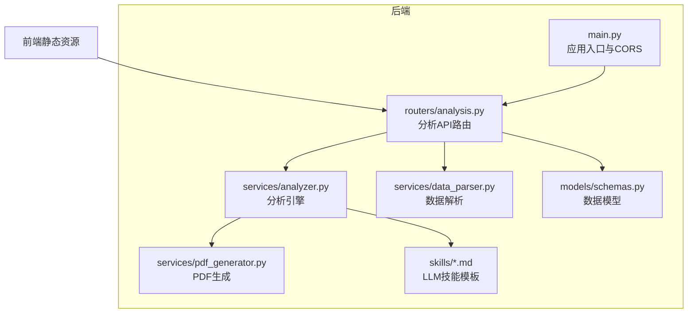
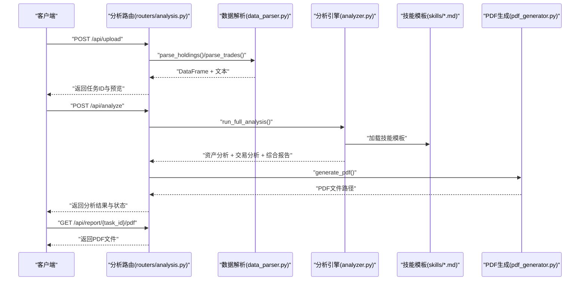
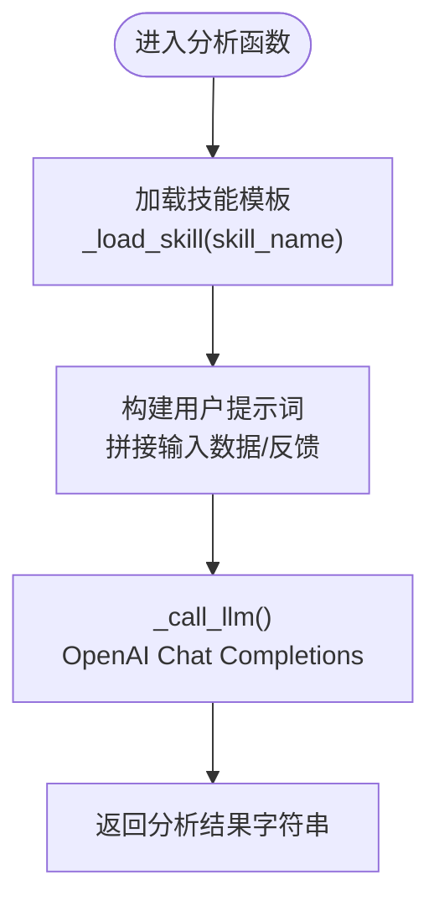
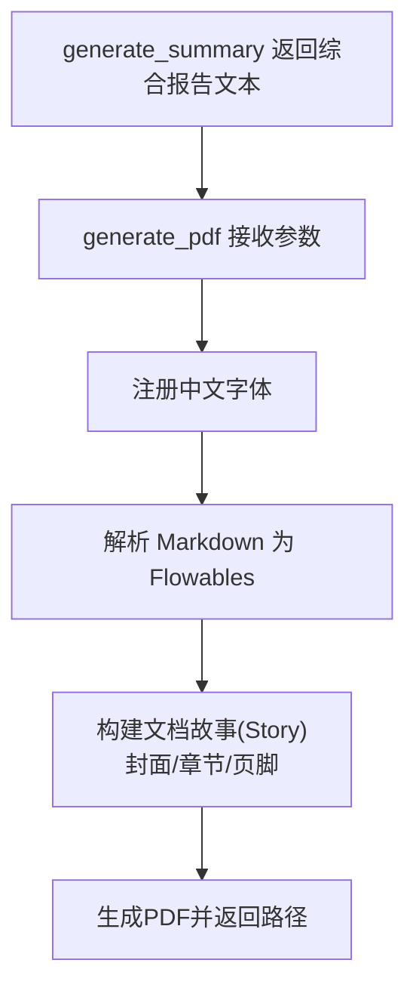
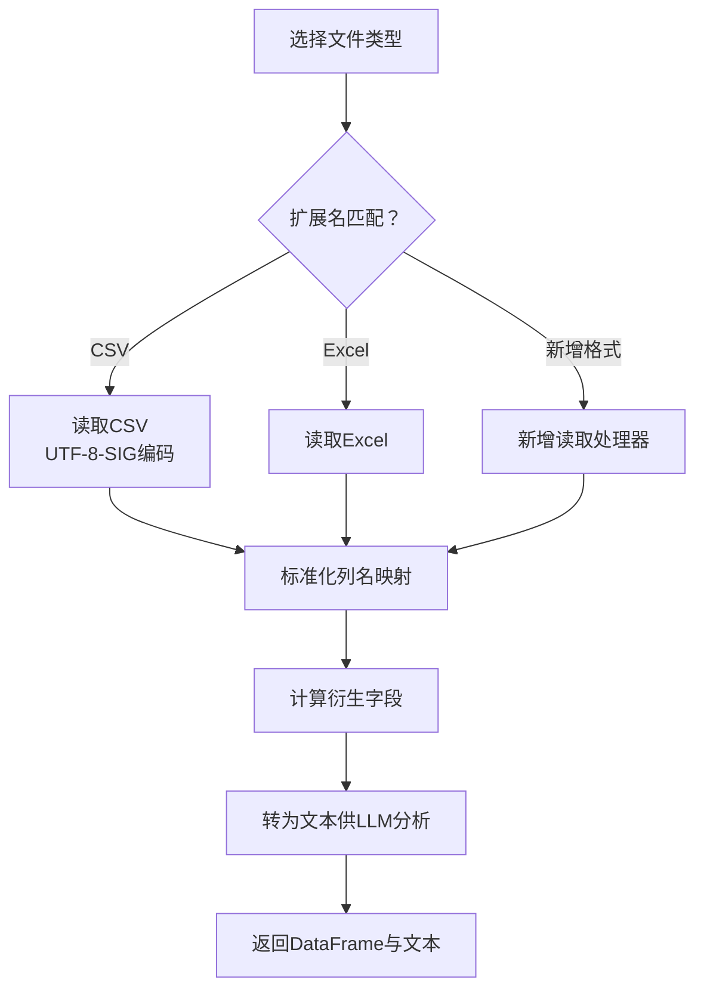
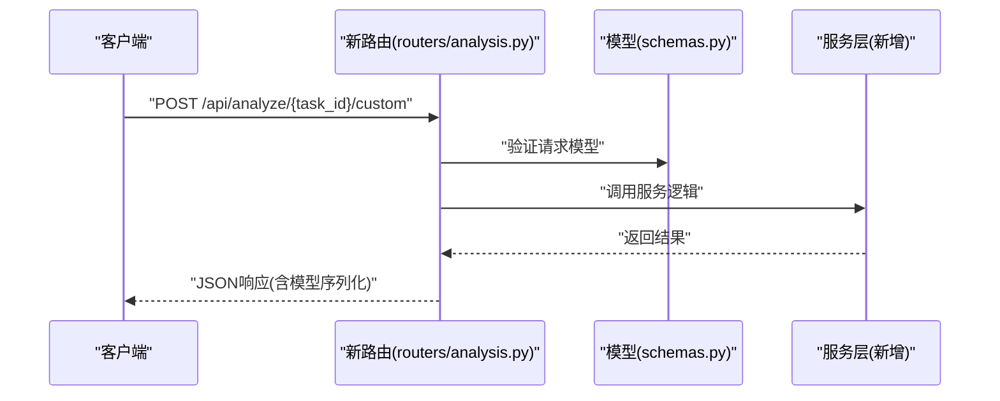
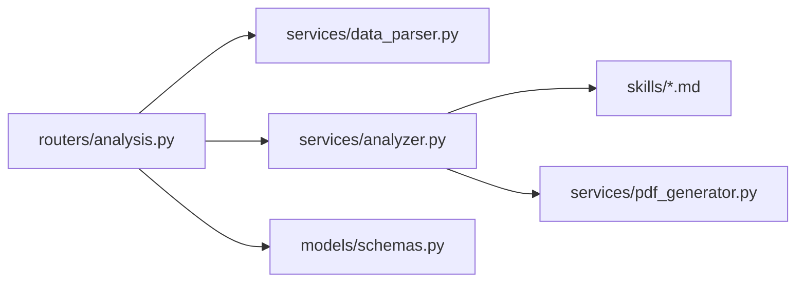

# 扩展开发

<cite>
**本文引用的文件**
- [backend/app/services/analyzer.py](file://backend/app/services/analyzer.py)
- [backend/app/services/data_parser.py](file://backend/app/services/data_parser.py)
- [backend/app/services/pdf_generator.py](file://backend/app/services/pdf_generator.py)
- [backend/app/routers/analysis.py](file://backend/app/routers/analysis.py)
- [backend/app/models/schemas.py](file://backend/app/models/schemas.py)
- [backend/app/main.py](file://backend/app/main.py)
- [backend/app/skills/report_template.md](file://backend/app/skills/report_template.md)
- [backend/app/skills/asset_analysis.md](file://backend/app/skills/asset_analysis.md)
- [backend/app/skills/trade_behavior.md](file://backend/app/skills/trade_behavior.md)
</cite>

## 目录
1. [简介](#简介)
2. [项目结构](#项目结构)
3. [核心组件](#核心组件)
4. [架构总览](#架构总览)
5. [详细组件分析](#详细组件分析)
6. [依赖分析](#依赖分析)
7. [性能考虑](#性能考虑)
8. [故障排查指南](#故障排查指南)
9. [结论](#结论)
10. [附录](#附录)

## 简介
本指南面向希望为 Qoder-todo 项目进行扩展开发的工程师，围绕以下目标提供系统化的扩展方法：
- 在 analyzer.py 中新增分析维度与 LLM 技能
- 在 skills 目录下添加新的分析模板
- 自定义报告模板与 PDF 生成器的扩展
- 在 data_parser.py 中支持新的数据文件格式
- 在 routers 中添加新路由，在 models 中定义数据模型
- 插件系统与第三方服务集成的最佳实践

## 项目结构
后端采用 FastAPI + ReportLab 的轻量架构，前端通过静态资源提供界面。核心扩展点集中在 services 层（analyzer、data_parser、pdf_generator）、routers 层（API 路由）、models 层（Pydantic 数据模型）以及 skills 目录（LLM 技能模板）。

图表来源
- [backend/app/main.py:1-28](file://backend/app/main.py#L1-L28)
- [backend/app/routers/analysis.py:1-218](file://backend/app/routers/analysis.py#L1-L218)
- [backend/app/services/analyzer.py:1-93](file://backend/app/services/analyzer.py#L1-L93)
- [backend/app/services/data_parser.py:1-96](file://backend/app/services/data_parser.py#L1-L96)
- [backend/app/services/pdf_generator.py:1-215](file://backend/app/services/pdf_generator.py#L1-L215)
- [backend/app/models/schemas.py:1-30](file://backend/app/models/schemas.py#L1-L30)
- [backend/app/skills/report_template.md:1-34](file://backend/app/skills/report_template.md#L1-L34)

章节来源
- [backend/app/main.py:1-28](file://backend/app/main.py#L1-L28)
- [backend/app/routers/analysis.py:1-218](file://backend/app/routers/analysis.py#L1-L218)

## 核心组件
- 分析引擎（analyzer.py）
  - 加载 skills 目录下的技能模板
  - 通过 OpenAI 客户端调用 LLM 接口
  - 提供资产配置分析、交易行为分析与综合报告生成
- 数据解析（data_parser.py）
  - 支持 CSV/Excel 持仓与交易数据
  - 标准化列名、计算衍生指标、格式化文本供 LLM 分析
- PDF 生成（pdf_generator.py）
  - 多平台中文字体注册
  - Markdown 到 ReportLab Flowables 的转换
  - 结构化报告生成（封面、摘要、分章节、页脚）
- 路由与模型（routers/analysis.py、models/schemas.py）
  - 提供上传、分析、重生成、下载 PDF、查询任务状态等接口
  - 使用 Pydantic 定义请求与响应模型

章节来源
- [backend/app/services/analyzer.py:1-93](file://backend/app/services/analyzer.py#L1-L93)
- [backend/app/services/data_parser.py:1-96](file://backend/app/services/data_parser.py#L1-L96)
- [backend/app/services/pdf_generator.py:1-215](file://backend/app/services/pdf_generator.py#L1-L215)
- [backend/app/routers/analysis.py:1-218](file://backend/app/routers/analysis.py#L1-L218)
- [backend/app/models/schemas.py:1-30](file://backend/app/models/schemas.py#L1-L30)

## 架构总览
下图展示了从上传文件到生成 PDF 的完整流程，以及各模块间的依赖关系。

图表来源
- [backend/app/routers/analysis.py:35-152](file://backend/app/routers/analysis.py#L35-L152)
- [backend/app/services/data_parser.py:7-95](file://backend/app/services/data_parser.py#L7-L95)
- [backend/app/services/analyzer.py:41-92](file://backend/app/services/analyzer.py#L41-L92)
- [backend/app/services/pdf_generator.py:146-214](file://backend/app/services/pdf_generator.py#L146-L214)
- [backend/app/skills/report_template.md:1-34](file://backend/app/skills/report_template.md#L1-L34)
- [backend/app/skills/asset_analysis.md:1-35](file://backend/app/skills/asset_analysis.md#L1-L35)
- [backend/app/skills/trade_behavior.md:1-34](file://backend/app/skills/trade_behavior.md#L1-L34)

## 详细组件分析

### 在 analyzer.py 中扩展分析逻辑与 LLM 技能
- 新增分析维度
  - 在 analyzer.py 中新增函数，加载对应技能模板并调用 LLM
  - 参考现有资产分析、交易行为分析与综合报告生成的模式
  - 返回字符串形式的分析结果，供 PDF 生成器使用
- 新增 LLM 技能模板
  - 在 skills 目录新增 .md 文件，定义系统提示词与分析维度
  - 在 analyzer.py 中通过 _load_skill 加载该模板
  - 在 generate_summary 或新增函数中拼接用户提示词并调用 _call_llm
- 环境变量与客户端
  - 通过 OPENAI_API_KEY、OPENAI_BASE_URL、OPENAI_MODEL 控制 LLM 行为
  - 如需切换模型或代理，可在环境变量中配置

图表来源
- [backend/app/services/analyzer.py:11-38](file://backend/app/services/analyzer.py#L11-L38)
- [backend/app/services/analyzer.py:41-74](file://backend/app/services/analyzer.py#L41-L74)

章节来源
- [backend/app/services/analyzer.py:1-93](file://backend/app/services/analyzer.py#L1-L93)
- [backend/app/skills/report_template.md:1-34](file://backend/app/skills/report_template.md#L1-L34)
- [backend/app/skills/asset_analysis.md:1-35](file://backend/app/skills/asset_analysis.md#L1-L35)
- [backend/app/skills/trade_behavior.md:1-34](file://backend/app/skills/trade_behavior.md#L1-L34)

### 在 skills 目录下添加新的分析模板
- 模板命名规范
  - 使用清晰语义的文件名（如 risk_assessment.md），与 analyzer.py 中的加载逻辑一致
- 模板内容结构
  - 系统角色设定（角色定位、职责）
  - 分析维度（可参考现有资产分析、交易行为分析的结构）
  - 输出要求（格式、风格、重点）
- 在 analyzer.py 中引用
  - 通过 _load_skill("risk_assessment") 加载模板
  - 在相应分析函数中传入用户提示词并调用 _call_llm

章节来源
- [backend/app/services/analyzer.py:11-15](file://backend/app/services/analyzer.py#L11-L15)
- [backend/app/skills/report_template.md:1-34](file://backend/app/skills/report_template.md#L1-L34)
- [backend/app/skills/asset_analysis.md:1-35](file://backend/app/skills/asset_analysis.md#L1-L35)
- [backend/app/skills/trade_behavior.md:1-34](file://backend/app/skills/trade_behavior.md#L1-L34)

### 自定义报告模板与 PDF 生成器扩展
- 修改 report_template.md
  - 调整报告结构、要点与输出要求，以适配新的分析维度
  - 在 analyzer.py 的 generate_summary 中加载该模板并传入资产分析与交易分析结果
- 扩展 PDF 生成器
  - 如需新增章节（如“风险评估”、“投资建议”），在 pdf_generator.py 的 generate_pdf 中追加对应段落
  - 使用 _markdown_to_flowables 将 Markdown 转换为 ReportLab 组件
  - 注意中文字体注册与样式设置，确保跨平台一致性

图表来源
- [backend/app/services/analyzer.py:59-74](file://backend/app/services/analyzer.py#L59-L74)
- [backend/app/services/pdf_generator.py:146-214](file://backend/app/services/pdf_generator.py#L146-L214)
- [backend/app/skills/report_template.md:1-34](file://backend/app/skills/report_template.md#L1-L34)

章节来源
- [backend/app/services/pdf_generator.py:1-215](file://backend/app/services/pdf_generator.py#L1-L215)
- [backend/app/skills/report_template.md:1-34](file://backend/app/skills/report_template.md#L1-L34)

### 添加新的数据处理能力（支持新文件格式）
- 在 data_parser.py 中扩展
  - 识别新文件扩展名（如 .xlsx、.xls、特定厂商导出格式）
  - 读取并标准化列名映射，确保与现有字段（name、code、quantity、cost_price、current_price、market_value、pnl、pnl_ratio、direction、price、amount、trade_time、commission 等）兼容
  - 计算衍生字段（如市值、浮盈浮亏、盈亏比例、成交金额等）
  - 将 DataFrame 转换为文本，供 LLM 分析
- 注意事项
  - 保持列名映射的健壮性（模糊匹配中文关键词）
  - 对缺失字段进行条件计算，避免空值导致的错误
  - 保证输出文本格式稳定，便于 LLM 理解

图表来源
- [backend/app/services/data_parser.py:7-52](file://backend/app/services/data_parser.py#L7-L52)
- [backend/app/services/data_parser.py:55-95](file://backend/app/services/data_parser.py#L55-L95)

章节来源
- [backend/app/services/data_parser.py:1-96](file://backend/app/services/data_parser.py#L1-L96)

### API 接口扩展（新增路由与数据模型）
- 新增路由
  - 在 routers/analysis.py 中添加新的 API 路由（如 POST /api/analyze/{task_id}/custom）
  - 复用现有任务状态管理与文件存储机制
  - 在路由中调用新增的分析函数或服务
- 新增数据模型
  - 在 models/schemas.py 中定义请求/响应模型（如 CustomAnalyzeRequest、CustomAnalysisResult）
  - 使用 Pydantic 的 BaseModel、Optional、Enum 等特性
  - 在路由中使用这些模型进行校验与序列化
- 应用集成
  - 在 main.py 中确保路由被正确挂载（include_router）

图表来源
- [backend/app/routers/analysis.py:1-218](file://backend/app/routers/analysis.py#L1-L218)
- [backend/app/models/schemas.py:1-30](file://backend/app/models/schemas.py#L1-L30)
- [backend/app/main.py:23-23](file://backend/app/main.py#L23-L23)

章节来源
- [backend/app/routers/analysis.py:1-218](file://backend/app/routers/analysis.py#L1-L218)
- [backend/app/models/schemas.py:1-30](file://backend/app/models/schemas.py#L1-L30)
- [backend/app/main.py:1-28](file://backend/app/main.py#L1-L28)

### 插件系统与第三方服务集成最佳实践
- 技能模板即“插件”
  - skills 目录下的 .md 文件充当插件，analyzer.py 动态加载
  - 新增插件无需修改核心逻辑，仅需遵循统一的提示词结构
- 第三方服务集成
  - 通过环境变量（OPENAI_API_KEY、OPENAI_BASE_URL、OPENAI_MODEL）控制 LLM 供应商与参数
  - 如需更换模型或供应商，只需调整环境变量与 _get_client 的实现
  - 对外部服务增加超时、重试与降级策略，提升稳定性
- 可观测性与可观测性
  - 记录任务状态变更（pending → analyzing → completed/failed）
  - 在路由层捕获异常并返回结构化错误信息
  - 生成 PDF 时记录输出路径，便于前端下载

章节来源
- [backend/app/services/analyzer.py:18-38](file://backend/app/services/analyzer.py#L18-L38)
- [backend/app/routers/analysis.py:16-22](file://backend/app/routers/analysis.py#L16-L22)
- [backend/app/routers/analysis.py:130-134](file://backend/app/routers/analysis.py#L130-L134)

## 依赖分析
- 模块耦合
  - routers 依赖 services（数据解析、分析、PDF 生成）
  - services 之间低耦合：analyzer 依赖 skills；pdf_generator 独立负责渲染
  - models 为纯数据模型，被 routers 使用
- 外部依赖
  - OpenAI SDK（用于 LLM 调用）
  - ReportLab（用于 PDF 渲染）
  - pandas（用于数据解析）
- 潜在循环依赖
  - 当前结构无循环导入；新增模块时需避免相互 import

图表来源
- [backend/app/routers/analysis.py:10-12](file://backend/app/routers/analysis.py#L10-L12)
- [backend/app/services/analyzer.py:8-8](file://backend/app/services/analyzer.py#L8-L8)
- [backend/app/services/pdf_generator.py:1-19](file://backend/app/services/pdf_generator.py#L1-L19)
- [backend/app/services/data_parser.py:1-5](file://backend/app/services/data_parser.py#L1-L5)
- [backend/app/models/schemas.py:1-30](file://backend/app/models/schemas.py#L1-L30)

章节来源
- [backend/app/routers/analysis.py:1-218](file://backend/app/routers/analysis.py#L1-L218)
- [backend/app/services/analyzer.py:1-93](file://backend/app/services/analyzer.py#L1-L93)
- [backend/app/services/pdf_generator.py:1-215](file://backend/app/services/pdf_generator.py#L1-L215)
- [backend/app/services/data_parser.py:1-96](file://backend/app/services/data_parser.py#L1-L96)
- [backend/app/models/schemas.py:1-30](file://backend/app/models/schemas.py#L1-L30)

## 性能考虑
- LLM 调用
  - 控制消息长度与 max_tokens，避免超长上下文导致延迟与费用上升
  - 合理设置 temperature，平衡创造性与稳定性
- PDF 生成
  - 大文本转换为 Flowables 时注意内存占用，必要时分段处理
  - 字体注册仅执行一次，避免重复注册开销
- 数据解析
  - 对大数据集先做采样预览，再进行完整分析
  - 列名映射与衍生字段计算尽量向量化，减少循环

## 故障排查指南
- LLM 无法连接
  - 检查 OPENAI_API_KEY、OPENAI_BASE_URL、OPENAI_MODEL 是否正确设置
  - 确认网络可达性与代理配置
- PDF 中文字体异常
  - 确认系统字体路径存在，或使用回退字体
  - 跨平台部署时确保字体文件随包分发
- 文件解析失败
  - 检查文件编码（CSV 使用 UTF-8-SIG）
  - 确认列名包含中文关键词（如“证券名称”、“持仓数量”等）
- 任务状态异常
  - 查看路由中的状态更新逻辑与异常捕获
  - 确保任务字典在内存中持久化（生产环境建议替换为数据库）

章节来源
- [backend/app/services/analyzer.py:18-38](file://backend/app/services/analyzer.py#L18-L38)
- [backend/app/services/pdf_generator.py:26-51](file://backend/app/services/pdf_generator.py#L26-L51)
- [backend/app/services/data_parser.py:9-12](file://backend/app/services/data_parser.py#L9-L12)
- [backend/app/routers/analysis.py:54-64](file://backend/app/routers/analysis.py#L54-L64)
- [backend/app/routers/analysis.py:130-134](file://backend/app/routers/analysis.py#L130-L134)

## 结论
通过以上扩展指南，开发者可以：
- 在 analyzer.py 与 skills 目录中快速引入新的分析维度与 LLM 技能
- 在 data_parser.py 中支持更多文件格式
- 在 routers 与 models 中扩展 API 与数据模型
- 在 pdf_generator.py 中定制报告结构与样式
- 以插件化方式集成第三方服务，并遵循最佳实践提升稳定性与可维护性

## 附录
- 环境变量
  - OPENAI_API_KEY：LLM API 密钥
  - OPENAI_BASE_URL：LLM 服务基础地址（可选）
  - OPENAI_MODEL：模型名称（默认 gpt-4o）
- 目录约定
  - skills：存放 LLM 技能模板（.md）
  - uploads：上传文件临时目录
  - reports：PDF 报告输出目录