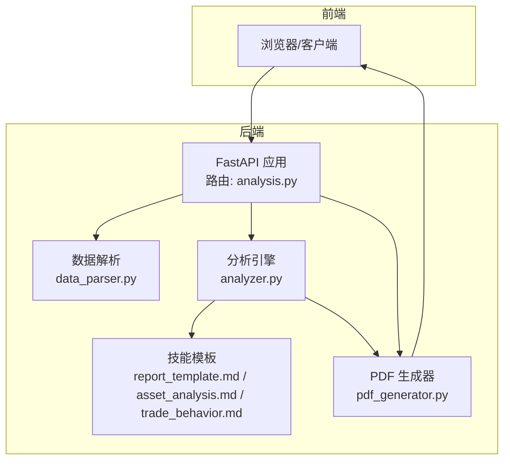
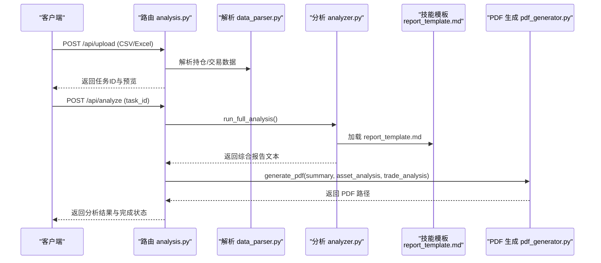
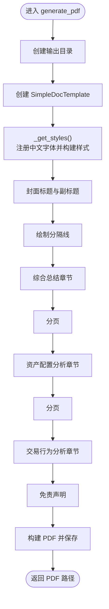
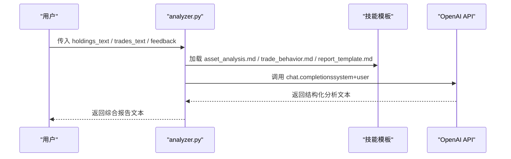
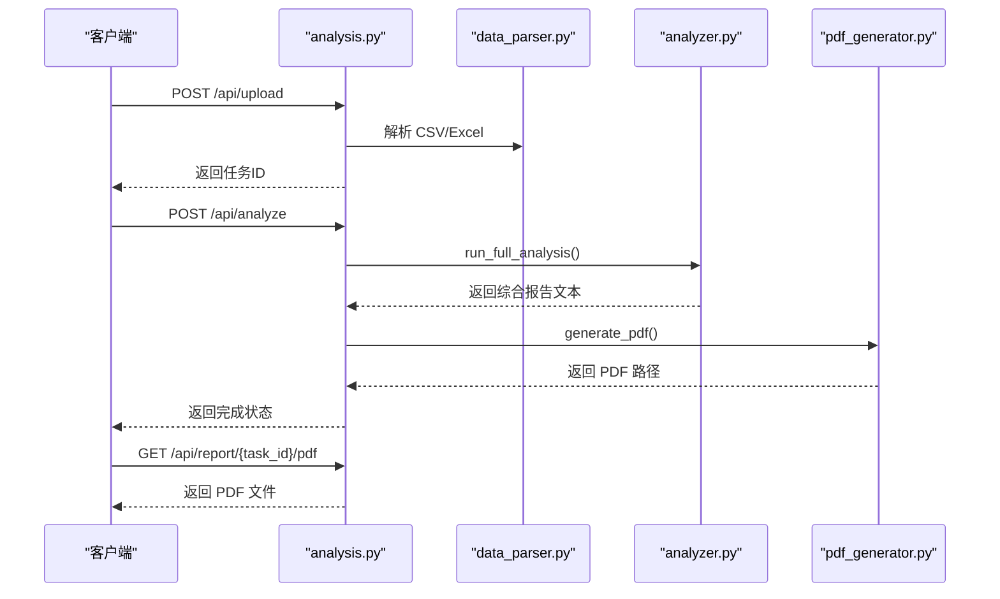
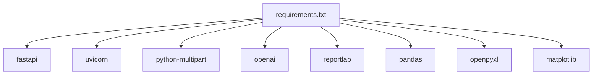

# 报告模板定制

<cite>
**本文引用的文件**
- [report_template.md](file://backend/app/skills/report_template.md)
- [asset_analysis.md](file://backend/app/skills/asset_analysis.md)
- [trade_behavior.md](file://backend/app/skills/trade_behavior.md)
- [pdf_generator.py](file://backend/app/services/pdf_generator.py)
- [analyzer.py](file://backend/app/services/analyzer.py)
- [analysis.py](file://backend/app/routers/analysis.py)
- [data_parser.py](file://backend/app/services/data_parser.py)
- [main.py](file://backend/app/main.py)
- [requirements.txt](file://backend/requirements.txt)
</cite>

## 目录
1. [简介](#简介)
2. [项目结构](#项目结构)
3. [核心组件](#核心组件)
4. [架构总览](#架构总览)
5. [详细组件分析](#详细组件分析)
6. [依赖关系分析](#依赖关系分析)
7. [性能考虑](#性能考虑)
8. [故障排查指南](#故障排查指南)
9. [结论](#结论)
10. [附录](#附录)

## 简介
本指南面向需要定制 Qoder-todo 项目“报告模板”的用户，系统讲解如何修改 report_template.md 来定制报告格式与内容结构，并深入解析 pdf_generator.py 的报告生成逻辑（模板渲染、中文字符支持、PDF 样式定制）。文档同时提供模板修改示例、多语言与特殊字符处理建议、模板测试与调试技巧，帮助您快速实现可复用、可维护的报告体系。

## 项目结构
后端采用 FastAPI 架构，核心流程如下：
- 前端上传 CSV/Excel 持仓与交易数据
- 后端解析数据并调用大模型生成资产配置分析、交易行为分析与综合报告
- 将综合报告渲染为 PDF 并提供下载

图表来源
- [analysis.py:1-218](file://backend/app/routers/analysis.py#L1-L218)
- [data_parser.py:1-96](file://backend/app/services/data_parser.py#L1-L96)
- [analyzer.py:1-93](file://backend/app/services/analyzer.py#L1-L93)
- [pdf_generator.py:1-215](file://backend/app/services/pdf_generator.py#L1-L215)
- [report_template.md:1-34](file://backend/app/skills/report_template.md#L1-L34)
- [asset_analysis.md:1-35](file://backend/app/skills/asset_analysis.md#L1-L35)
- [trade_behavior.md:1-34](file://backend/app/skills/trade_behavior.md#L1-L34)

章节来源
- [main.py:1-28](file://backend/app/main.py#L1-L28)
- [requirements.txt:1-9](file://backend/requirements.txt#L1-L9)

## 核心组件
- 报告模板（Markdown）
  - report_template.md：定义综合报告的结构、章节与输出要求，作为大模型的系统提示词（system prompt）。
  - asset_analysis.md / trade_behavior.md：分别定义资产配置分析与交易行为分析的系统提示词。
- 分析引擎（analyzer.py）
  - 加载技能模板，拼接用户输入（原始数据与可选反馈），调用大模型生成分析结果。
- PDF 生成器（pdf_generator.py）
  - 注册中文字体，构建 ReportLab 样式表，将 Markdown 文本转换为 Flowable 元素，最终生成 PDF。
- 数据解析（data_parser.py）
  - 读取 CSV/Excel，标准化列名，计算衍生指标，转为结构化文本供大模型分析。
- API 路由（analysis.py）
  - 提供上传、分析、重新生成、下载 PDF 等接口；协调解析、分析与 PDF 生成。

章节来源
- [report_template.md:1-34](file://backend/app/skills/report_template.md#L1-L34)
- [asset_analysis.md:1-35](file://backend/app/skills/asset_analysis.md#L1-L35)
- [trade_behavior.md:1-34](file://backend/app/skills/trade_behavior.md#L1-L34)
- [analyzer.py:1-93](file://backend/app/services/analyzer.py#L1-L93)
- [pdf_generator.py:1-215](file://backend/app/services/pdf_generator.py#L1-L215)
- [data_parser.py:1-96](file://backend/app/services/data_parser.py#L1-L96)
- [analysis.py:1-218](file://backend/app/routers/analysis.py#L1-L218)

## 架构总览
下图展示了从上传到生成 PDF 的完整链路，以及模板在其中的角色。

图表来源
- [analysis.py:35-135](file://backend/app/routers/analysis.py#L35-L135)
- [analyzer.py:77-93](file://backend/app/services/analyzer.py#L77-L93)
- [report_template.md:66-74](file://backend/app/skills/report_template.md#L66-L74)
- [pdf_generator.py:146-215](file://backend/app/services/pdf_generator.py#L146-L215)

## 详细组件分析

### 报告模板（report_template.md）定制指南
- 模板定位与作用
  - 位于 backend/app/skills/report_template.md，作为“综合报告”系统提示词，指导大模型生成统一结构的报告。
- 结构与占位符
  - 报告结构章节（如“报告概览”“资产配置分析要点”“交易行为分析要点”“综合建议”“风险提示”）用于约束输出层次。
  - 用户提示词中包含客户名称、资产分析结果、交易行为分析结果，以及可选的反馈意见，用于动态注入内容。
- Markdown 语法与样式标记
  - 标题层级：使用 #、##、### 表示主标题、二级标题、三级标题，PDF 渲染器会据此应用不同样式。
  - 列表：使用 - 或 * 表示无序列表；使用数字点标记表示有序列表，渲染器会保留编号并加粗强调。
  - 粗体：使用 **文本** 表示强调，渲染器会将其转换为 PDF 中的粗体标签。
- 修改步骤
  - 新增章节：在“报告结构”下添加新的章节标题与要点说明，确保与分析引擎的用户提示词键位一致。
  - 调整布局：通过改变章节顺序与层级，影响最终 PDF 的分节与排版。
  - 自定义样式：通过在模板中增加更丰富的 Markdown 标记（如粗体、列表），提升可读性与重点突出度。
- 示例（路径参考）
  - 在“报告概览”中新增一条“客户画像摘要”，并在用户提示词中补充相应键位，以驱动大模型输出该内容。
  - 在“综合建议”中增加“合规与税务建议”章节，确保与现有章节并列且语义清晰。
- 注意事项
  - 保持章节标题与分析引擎中用户提示词的键位一致，避免大模型无法正确填充。
  - 避免使用过于复杂的表格或图片语法，PDF 渲染器仅支持基础 Markdown 转换。

章节来源
- [report_template.md:1-34](file://backend/app/skills/report_template.md#L1-L34)
- [analyzer.py:65-74](file://backend/app/services/analyzer.py#L65-L74)

### PDF 生成器（pdf_generator.py）工作原理
- 字体注册与中文支持
  - 提供多平台字体路径尝试注册中文字体，若均失败则回退至 Helvetica。
  - 通过 ReportLab 的 TTFont 注册与样式表切换，确保中文正常显示。
- 样式定义
  - 定义标题、副标题、正文等样式，设置字号、行距、对齐、颜色等属性。
  - 使用 ReportLab 的 ParagraphStyle 为不同层级标题与正文提供一致的视觉风格。
- Markdown 转 Flowable
  - 按行解析 Markdown 文本，识别标题、列表、粗体等元素，转换为 ReportLab 的 Flowable 对象。
  - 处理空行、缩进、编号列表与粗体标记，保证 PDF 排版整洁。
- 报告结构与分页
  - 封面标题、客户信息、生成日期、分隔线、各章节内容、免责声明等按固定顺序组织。
  - 使用 PageBreak 实现章节间分页，提升可读性。
- 输出与路径
  - 生成 PDF 文件并返回完整路径，供 API 路由下载。

图表来源
- [pdf_generator.py:146-215](file://backend/app/services/pdf_generator.py#L146-L215)
- [pdf_generator.py:53-106](file://backend/app/services/pdf_generator.py#L53-L106)
- [pdf_generator.py:109-143](file://backend/app/services/pdf_generator.py#L109-L143)

章节来源
- [pdf_generator.py:1-215](file://backend/app/services/pdf_generator.py#L1-L215)

### 分析引擎（analyzer.py）与模板交互
- 模板加载
  - 通过 _load_skill 读取技能模板文件，使用 UTF-8 编码，确保中文与特殊字符正确读取。
- 大模型调用
  - _call_llm 统一封装 OpenAI 客户端调用，支持自定义 base_url 与模型选择。
- 综合报告生成
  - generate_summary 将客户名称、资产分析结果、交易行为分析结果与反馈意见拼接为用户提示词，交由 report_template.md 生成综合报告。
- 流程一致性
  - analyze_assets 与 analyze_trades 分别生成资产配置与交易行为分析结果，供综合报告模板统一渲染。

图表来源
- [analyzer.py:41-74](file://backend/app/services/analyzer.py#L41-L74)
- [analyzer.py:11-16](file://backend/app/services/analyzer.py#L11-L16)
- [analyzer.py:25-38](file://backend/app/services/analyzer.py#L25-L38)

章节来源
- [analyzer.py:1-93](file://backend/app/services/analyzer.py#L1-L93)

### API 路由（analysis.py）与 PDF 下载
- 上传与解析
  - /api/upload 接收 CSV/Excel 文件，解析为 DataFrame 与文本预览，生成任务 ID 并缓存。
- 触发分析与生成 PDF
  - /api/analyze 根据任务 ID 调用 run_full_analysis，随后调用 generate_pdf 生成 PDF 并缓存路径。
- 重新生成
  - /api/analyze/{task_id}/regenerate 支持基于反馈意见重新生成分析与 PDF。
- 下载 PDF
  - /api/report/{task_id}/pdf 提供 PDF 文件下载，文件名为包含客户名与任务 ID 的规范命名。

图表来源
- [analysis.py:35-153](file://backend/app/routers/analysis.py#L35-L153)
- [analysis.py:155-199](file://backend/app/routers/analysis.py#L155-L199)

章节来源
- [analysis.py:1-218](file://backend/app/routers/analysis.py#L1-L218)

## 依赖关系分析
- Python 依赖
  - fastapi、uvicorn：Web 框架与 ASGI 服务器
  - python-multipart：表单上传解析
  - openai：大模型调用
  - reportlab：PDF 生成
  - pandas、openpyxl：数据解析
  - matplotlib：绘图（当前未直接使用，可按需启用）

图表来源
- [requirements.txt:1-9](file://backend/requirements.txt#L1-L9)

章节来源
- [requirements.txt:1-9](file://backend/requirements.txt#L1-L9)

## 性能考虑
- 模型调用
  - 控制提示词长度与上下文，避免超长文本导致延迟与费用上升。
  - 合理拆分分析步骤，减少单次调用的复杂度。
- PDF 生成
  - 仅在必要时注册字体，避免重复初始化。
  - 合理设置样式与间距，减少 PDF 渲染开销。
- 数据解析
  - 对 CSV 使用 UTF-8-SIG 编码读取，避免乱码与二次转换。
  - 仅计算必要的衍生指标，降低内存与 CPU 占用。

## 故障排查指南
- 中文显示异常
  - 确认系统中存在可用的中文字体路径，或允许回退到 Helvetica。
  - 若 PDF 中出现方块或乱码，检查字体注册是否成功。
- 编码问题
  - 报告模板与技能文件使用 UTF-8 编码；解析 CSV 时使用 UTF-8-SIG。
  - 如遇中文乱码，检查文件保存编码与读取编码一致。
- 模板未生效
  - 确保 report_template.md 的章节标题与分析引擎用户提示词键位一致。
  - 检查大模型响应是否包含预期内容，必要时调整系统提示词。
- PDF 生成失败
  - 检查输出目录权限与磁盘空间。
  - 确认 ReportLab 版本兼容性与字体注册路径正确。
- API 错误
  - 查看 /api/task/{task_id} 获取任务状态与错误详情。
  - 检查网络代理与 OPENAI_BASE_URL 设置。

章节来源
- [pdf_generator.py:26-51](file://backend/app/services/pdf_generator.py#L26-L51)
- [data_parser.py:9-12](file://backend/app/services/data_parser.py#L9-L12)
- [analysis.py:130-134](file://backend/app/routers/analysis.py#L130-L134)

## 结论
通过合理定制 report_template.md 与优化 pdf_generator.py 的渲染逻辑，您可以灵活地扩展报告结构、增强中文支持与样式表现。结合 analyzer.py 的模板加载与大模型调用机制，以及 analysis.py 的端到端流程，能够快速实现高质量、可复用的资产分析报告体系。建议在生产环境中进一步完善错误处理、日志记录与安全策略。

## 附录

### 模板修改示例（步骤说明）
- 新增“客户画像摘要”章节
  - 在 report_template.md 的“报告结构”下添加新章节标题与要点说明。
  - 在 analyzer.py 的 generate_summary 中补充用户提示词键位，确保大模型可填充。
  - 参考路径：[report_template.md:19-22](file://backend/app/skills/report_template.md#L19-L22)，[analyzer.py:67-71](file://backend/app/services/analyzer.py#L67-L71)
- 调整章节顺序
  - 将“综合建议”提前至“资产配置分析要点”之前，以突出行动建议。
  - 参考路径：[report_template.md:11-22](file://backend/app/skills/report_template.md#L11-L22)
- 自定义样式
  - 在 report_template.md 中使用粗体强调关键建议，PDF 渲染器会自动转换为粗体。
  - 参考路径：[pdf_generator.py:132-141](file://backend/app/services/pdf_generator.py#L132-L141)

### 多语言与特殊字符处理
- 中文字符支持
  - 使用 UTF-8 编码保存模板与技能文件；解析 CSV 时使用 UTF-8-SIG。
  - PDF 渲染器自动注册中文字体，确保中文显示正常。
  - 参考路径：[data_parser.py:10](file://backend/app/services/data_parser.py#L10)，[pdf_generator.py:31-47](file://backend/app/services/pdf_generator.py#L31-L47)
- 特殊字符与符号
  - 使用标准 Markdown 语法，避免复杂表格与图片，确保 PDF 渲染稳定。
  - 参考路径：[pdf_generator.py:109-143](file://backend/app/services/pdf_generator.py#L109-L143)

### 模板测试与调试技巧
- 本地验证
  - 使用 /api/upload 上传样例数据，调用 /api/analyze 获取综合报告文本，确认模板结构与内容。
  - 参考路径：[analysis.py:35-135](file://backend/app/routers/analysis.py#L35-L135)
- 反馈迭代
  - 使用 /api/analyze/{task_id}/regenerate 传入 feedback，观察报告变化，逐步优化模板。
  - 参考路径：[analysis.py:155-199](file://backend/app/routers/analysis.py#L155-L199)
- 日志与状态
  - 通过 /api/task/{task_id} 查询任务状态与错误详情，定位问题根因。
  - 参考路径：[analysis.py:202-217](file://backend/app/routers/analysis.py#L202-L217)