# 插件系统设计

<cite>
**本文档引用的文件**
- [backend/app/main.py](file://backend/app/main.py)
- [backend/app/routers/analysis.py](file://backend/app/routers/analysis.py)
- [backend/app/services/analyzer.py](file://backend/app/services/analyzer.py)
- [backend/app/services/pdf_generator.py](file://backend/app/services/pdf_generator.py)
- [backend/app/services/data_parser.py](file://backend/app/services/data_parser.py)
- [backend/app/models/schemas.py](file://backend/app/models/schemas.py)
- [backend/app/skills/asset_analysis.md](file://backend/app/skills/asset_analysis.md)
- [backend/app/skills/trade_behavior.md](file://backend/app/skills/trade_behavior.md)
- [backend/app/skills/report_template.md](file://backend/app/skills/report_template.md)
- [backend/requirements.txt](file://backend/requirements.txt)
- [frontend/src/App.jsx](file://frontend/src/App.jsx)
- [frontend/package.json](file://frontend/package.json)
</cite>

## 目录
1. [简介](#简介)
2. [项目结构](#项目结构)
3. [核心组件](#核心组件)
4. [架构概览](#架构概览)
5. [详细组件分析](#详细组件分析)
6. [插件系统设计](#插件系统设计)
7. [依赖分析](#依赖分析)
8. [性能考虑](#性能考虑)
9. [故障排除指南](#故障排除指南)
10. [结论](#结论)

## 简介

Qoder-todo是一个基于FastAPI的客户资产分析工具，当前实现了完整的数据分析和PDF报告生成功能。本文档旨在为该项目设计一套可扩展的插件系统架构，使现有的分析功能和PDF生成功能能够模块化为独立的插件，支持第三方服务集成、依赖注入、配置管理和错误隔离。

该系统目前包含三个核心功能模块：
- **数据解析模块**：处理CSV和Excel文件的解析
- **分析引擎模块**：调用大模型API进行资产分析
- **PDF生成模块**：将分析结果转换为PDF报告

## 项目结构

项目采用典型的分层架构设计，分为前端和后端两个主要部分：

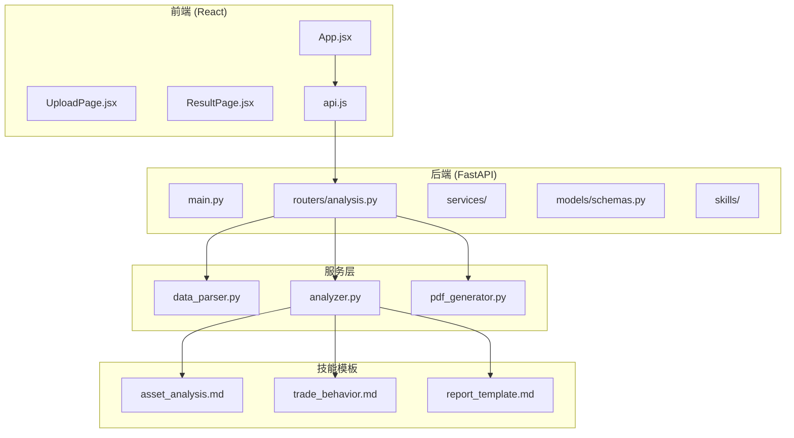
```mermaid
graph TB
subgraph "前端 (React)"
FE1[App.jsx]
FE2[UploadPage.jsx]
FE3[ResultPage.jsx]
FE4[api.js]
end
subgraph "后端 (FastAPI)"
BE1[main.py]
BE2[routers/analysis.py]
BE3[services/]
BE4[models/schemas.py]
BE5[skills/]
end
subgraph "服务层"
S1[data_parser.py]
S2[analyzer.py]
S3[pdf_generator.py]
end
subgraph "技能模板"
K1[asset_analysis.md]
K2[trade_behavior.md]
K3[report_template.md]
end
FE1 --> FE4
FE4 --> BE2
BE2 --> S1
BE2 --> S2
BE2 --> S3
S2 --> K1
S2 --> K2
S2 --> K3
```

**图表来源**
- [backend/app/main.py:1-28](file://backend/app/main.py#L1-L28)
- [backend/app/routers/analysis.py:1-218](file://backend/app/routers/analysis.py#L1-L218)
- [backend/app/services/analyzer.py:1-93](file://backend/app/services/analyzer.py#L1-L93)

**章节来源**
- [backend/app/main.py:1-28](file://backend/app/main.py#L1-L28)
- [backend/app/routers/analysis.py:1-218](file://backend/app/routers/analysis.py#L1-L218)

## 核心组件

### 数据解析服务
数据解析服务负责处理用户上传的CSV和Excel文件，标准化数据格式并计算衍生指标：

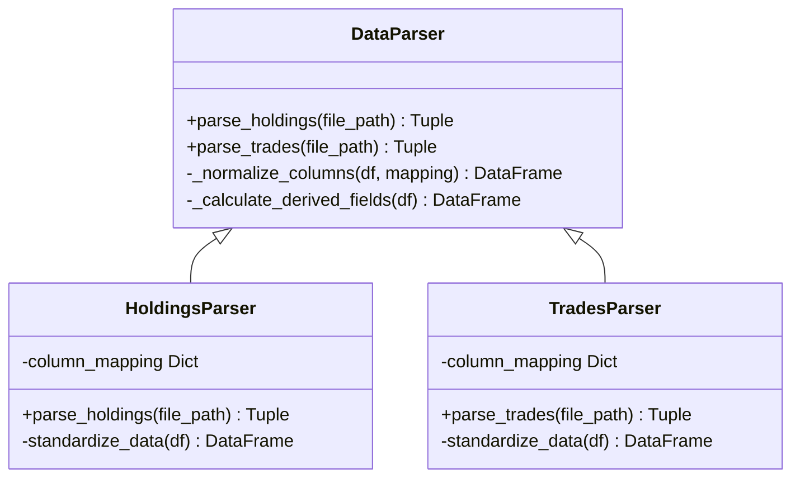
```mermaid
classDiagram
class DataParser {
+parse_holdings(file_path) Tuple
+parse_trades(file_path) Tuple
-_normalize_columns(df, mapping) DataFrame
-_calculate_derived_fields(df) DataFrame
}
class HoldingsParser {
+parse_holdings(file_path) Tuple
-column_mapping Dict
-standardize_data(df) DataFrame
}
class TradesParser {
+parse_trades(file_path) Tuple
-column_mapping Dict
-standardize_data(df) DataFrame
}
DataParser <|-- HoldingsParser
DataParser <|-- TradesParser
```

**图表来源**
- [backend/app/services/data_parser.py:7-96](file://backend/app/services/data_parser.py#L7-L96)

### 分析引擎服务
分析引擎服务调用大模型API进行资产分析，支持多个分析维度：

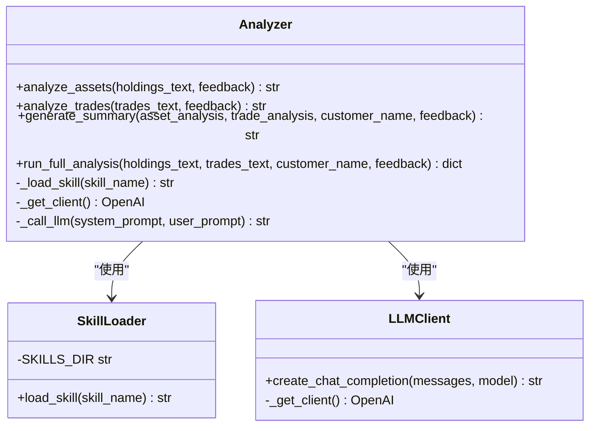
```mermaid
classDiagram
class Analyzer {
+analyze_assets(holdings_text, feedback) str
+analyze_trades(trades_text, feedback) str
+generate_summary(asset_analysis, trade_analysis, customer_name, feedback) str
+run_full_analysis(holdings_text, trades_text, customer_name, feedback) dict
-_load_skill(skill_name) str
-_get_client() OpenAI
-_call_llm(system_prompt, user_prompt) str
}
class SkillLoader {
+load_skill(skill_name) str
-SKILLS_DIR str
}
class LLMClient {
+create_chat_completion(messages, model) str
-_get_client() OpenAI
}
Analyzer --> SkillLoader : "使用"
Analyzer --> LLMClient : "使用"
```

**图表来源**
- [backend/app/services/analyzer.py:41-93](file://backend/app/services/analyzer.py#L41-L93)

### PDF生成服务
PDF生成服务将分析结果转换为专业的中文PDF报告：

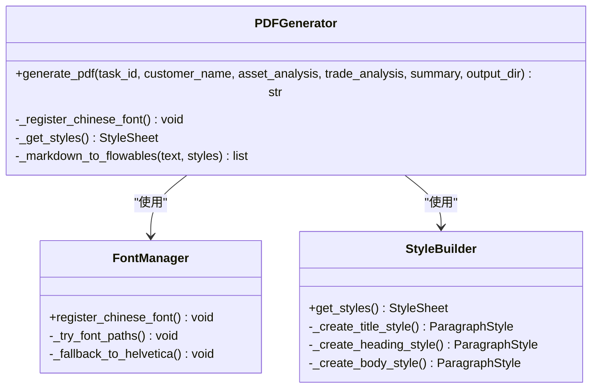
```mermaid
classDiagram
class PDFGenerator {
+generate_pdf(task_id, customer_name, asset_analysis, trade_analysis, summary, output_dir) str
-_register_chinese_font() void
-_get_styles() StyleSheet
-_markdown_to_flowables(text, styles) list
}
class FontManager {
+register_chinese_font() void
-_try_font_paths() void
-_fallback_to_helvetica() void
}
class StyleBuilder {
+get_styles() StyleSheet
-_create_title_style() ParagraphStyle
-_create_heading_style() ParagraphStyle
-_create_body_style() ParagraphStyle
}
PDFGenerator --> FontManager : "使用"
PDFGenerator --> StyleBuilder : "使用"
```

**图表来源**
- [backend/app/services/pdf_generator.py:146-215](file://backend/app/services/pdf_generator.py#L146-L215)

**章节来源**
- [backend/app/services/data_parser.py:1-96](file://backend/app/services/data_parser.py#L1-L96)
- [backend/app/services/analyzer.py:1-93](file://backend/app/services/analyzer.py#L1-L93)
- [backend/app/services/pdf_generator.py:1-215](file://backend/app/services/pdf_generator.py#L1-L215)

## 架构概览

当前系统的整体架构采用MVC模式，通过API路由协调各个服务模块：

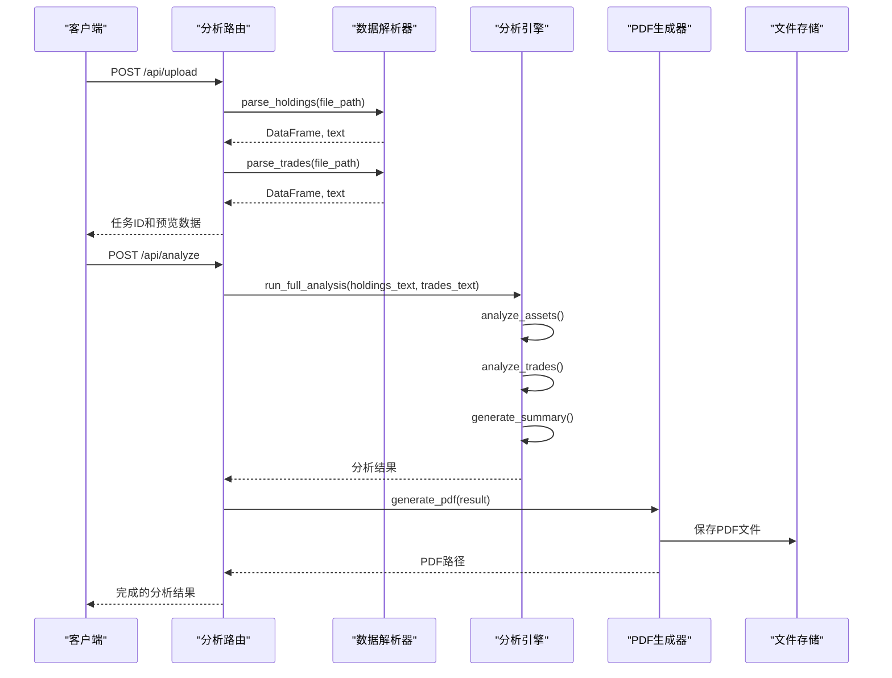
```mermaid
sequenceDiagram
participant Client as "客户端"
participant Router as "分析路由"
participant Parser as "数据解析器"
participant Analyzer as "分析引擎"
participant PDFGen as "PDF生成器"
participant Storage as "文件存储"
Client->>Router : POST /api/upload
Router->>Parser : parse_holdings(file_path)
Parser-->>Router : DataFrame, text
Router->>Parser : parse_trades(file_path)
Parser-->>Router : DataFrame, text
Router-->>Client : 任务ID和预览数据
Client->>Router : POST /api/analyze
Router->>Analyzer : run_full_analysis(holdings_text, trades_text)
Analyzer->>Analyzer : analyze_assets()
Analyzer->>Analyzer : analyze_trades()
Analyzer->>Analyzer : generate_summary()
Analyzer-->>Router : 分析结果
Router->>PDFGen : generate_pdf(result)
PDFGen->>Storage : 保存PDF文件
PDFGen-->>Router : PDF路径
Router-->>Client : 完成的分析结果
```

**图表来源**
- [backend/app/routers/analysis.py:35-135](file://backend/app/routers/analysis.py#L35-L135)
- [backend/app/services/analyzer.py:77-93](file://backend/app/services/analyzer.py#L77-L93)
- [backend/app/services/pdf_generator.py:146-215](file://backend/app/services/pdf_generator.py#L146-L215)

## 详细组件分析

### API路由层
API路由层负责处理HTTP请求，协调各个服务模块的工作流程：

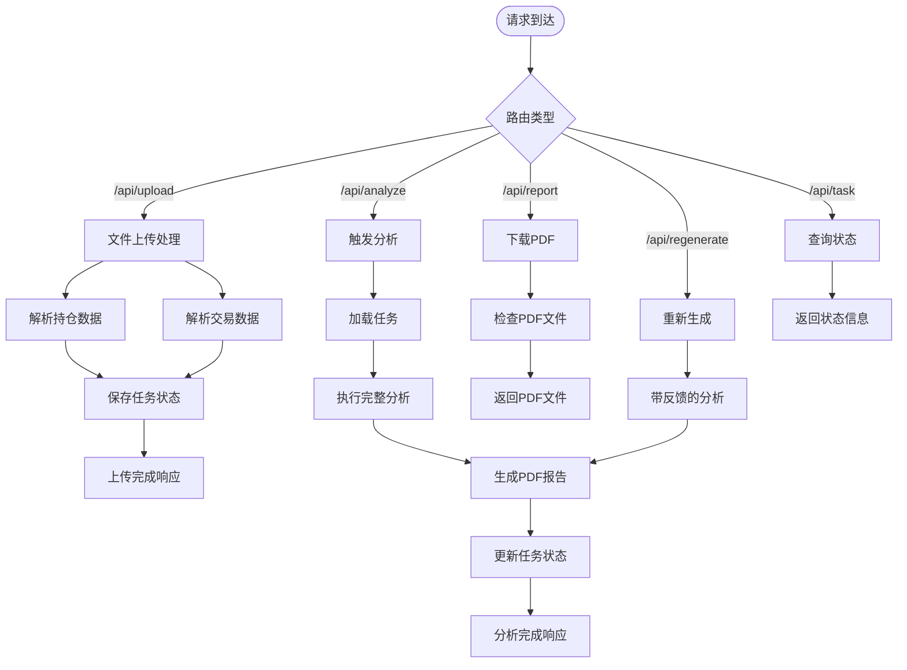
```mermaid
flowchart TD
Start([请求到达]) --> RouteType{"路由类型"}
RouteType --> |/api/upload| Upload["文件上传处理"]
RouteType --> |/api/analyze| Analyze["触发分析"]
RouteType --> |/api/report| Download["下载PDF"]
RouteType --> |/api/regenerate| Regenerate["重新生成"]
RouteType --> |/api/task| Status["查询状态"]
Upload --> ParseHoldings["解析持仓数据"]
Upload --> ParseTrades["解析交易数据"]
ParseHoldings --> SaveTask["保存任务状态"]
ParseTrades --> SaveTask
SaveTask --> UploadComplete["上传完成响应"]
Analyze --> LoadTask["加载任务"]
LoadTask --> RunAnalysis["执行完整分析"]
RunAnalysis --> GeneratePDF["生成PDF报告"]
GeneratePDF --> UpdateTask["更新任务状态"]
UpdateTask --> AnalyzeComplete["分析完成响应"]
Download --> CheckPDF["检查PDF文件"]
CheckPDF --> ReturnPDF["返回PDF文件"]
Regenerate --> FeedbackAnalysis["带反馈的分析"]
FeedbackAnalysis --> GeneratePDF
Status --> ReturnStatus["返回状态信息"]
```

**图表来源**
- [backend/app/routers/analysis.py:35-218](file://backend/app/routers/analysis.py#L35-L218)

### 数据模型
系统使用Pydantic模型定义数据结构和验证规则：

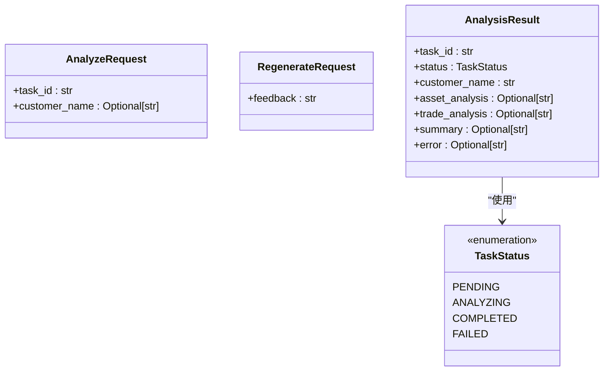
```mermaid
classDiagram
class TaskStatus {
<<enumeration>>
PENDING
ANALYZING
COMPLETED
FAILED
}
class AnalyzeRequest {
+task_id : str
+customer_name : Optional[str]
}
class RegenerateRequest {
+feedback : str
}
class AnalysisResult {
+task_id : str
+status : TaskStatus
+customer_name : str
+asset_analysis : Optional[str]
+trade_analysis : Optional[str]
+summary : Optional[str]
+error : Optional[str]
}
AnalysisResult --> TaskStatus : "使用"
```

**图表来源**
- [backend/app/models/schemas.py:6-30](file://backend/app/models/schemas.py#L6-L30)

**章节来源**
- [backend/app/routers/analysis.py:1-218](file://backend/app/routers/analysis.py#L1-L218)
- [backend/app/models/schemas.py:1-30](file://backend/app/models/schemas.py#L1-L30)

## 插件系统设计

### 插件接口定义

为了实现可扩展的插件架构，需要定义统一的插件接口规范：

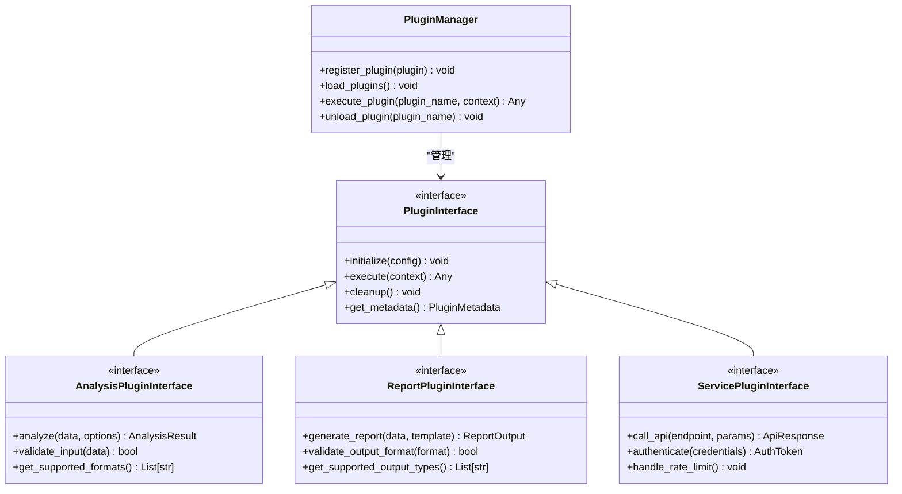
```mermaid
classDiagram
class PluginInterface {
<<interface>>
+initialize(config) void
+execute(context) Any
+cleanup() void
+get_metadata() PluginMetadata
}
class AnalysisPluginInterface {
<<interface>>
+analyze(data, options) AnalysisResult
+validate_input(data) bool
+get_supported_formats() List[str]
}
class ReportPluginInterface {
<<interface>>
+generate_report(data, template) ReportOutput
+validate_output_format(format) bool
+get_supported_output_types() List[str]
}
class ServicePluginInterface {
<<interface>>
+call_api(endpoint, params) ApiResponse
+authenticate(credentials) AuthToken
+handle_rate_limit() void
}
class PluginManager {
+register_plugin(plugin) void
+load_plugins() void
+execute_plugin(plugin_name, context) Any
+unload_plugin(plugin_name) void
}
PluginInterface <|-- AnalysisPluginInterface
PluginInterface <|-- ReportPluginInterface
PluginInterface <|-- ServicePluginInterface
PluginManager --> PluginInterface : "管理"
```

### 插件加载机制

插件系统采用动态加载和依赖注入机制：

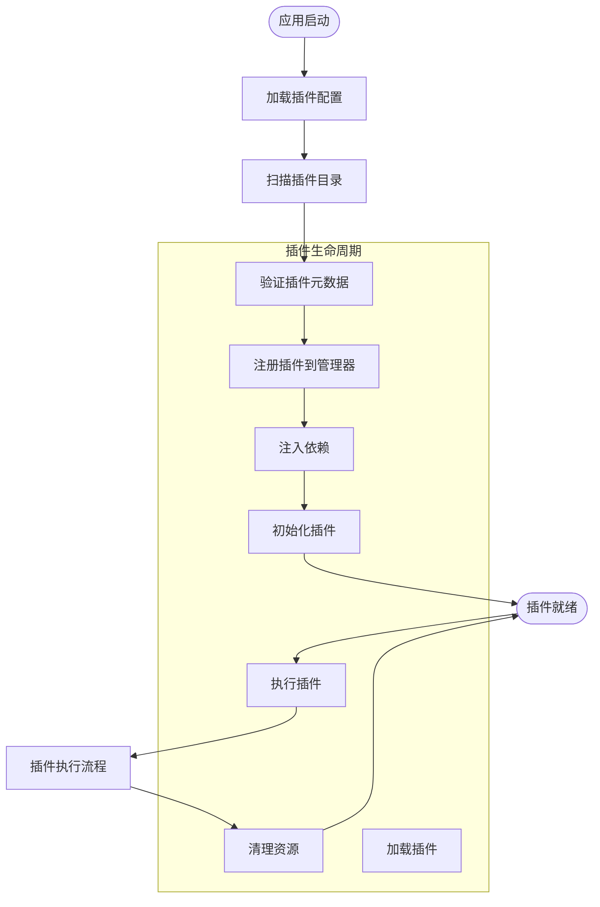
```mermaid
flowchart TD
Init([应用启动]) --> LoadConfig["加载插件配置"]
LoadConfig --> ScanPlugins["扫描插件目录"]
ScanPlugins --> ValidatePlugins["验证插件元数据"]
ValidatePlugins --> RegisterPlugins["注册插件到管理器"]
RegisterPlugins --> InjectDependencies["注入依赖"]
InjectDependencies --> InitializePlugins["初始化插件"]
InitializePlugins --> Ready([插件就绪])
Ready --> ExecutePlugin["执行插件"]
ExecutePlugin --> PluginExecution["插件执行流程"]
PluginExecution --> Cleanup["清理资源"]
Cleanup --> Ready
subgraph "插件生命周期"
LoadPlugins["加载插件"]
ValidatePlugins
RegisterPlugins
InjectDependencies
InitializePlugins
ExecutePlugin
Cleanup
end
```

### 插件生命周期管理

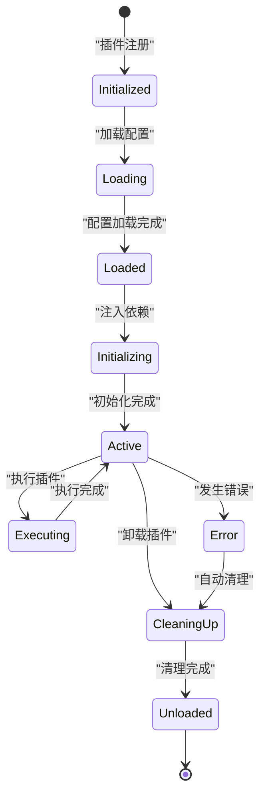
```mermaid
stateDiagram-v2
[*] --> Initialized : "插件注册"
Initialized --> Loading : "加载配置"
Loading --> Loaded : "配置加载完成"
Loaded --> Initializing : "注入依赖"
Initializing --> Active : "初始化完成"
Active --> Executing : "执行插件"
Executing --> Active : "执行完成"
Active --> CleaningUp : "卸载插件"
CleaningUp --> Unloaded : "清理完成"
Unloaded --> [*]
Active --> Error : "发生错误"
Error --> CleaningUp : "自动清理"
```

### 现有功能的插件化改造

#### 数据解析插件化

将现有的数据解析功能模块化为插件：

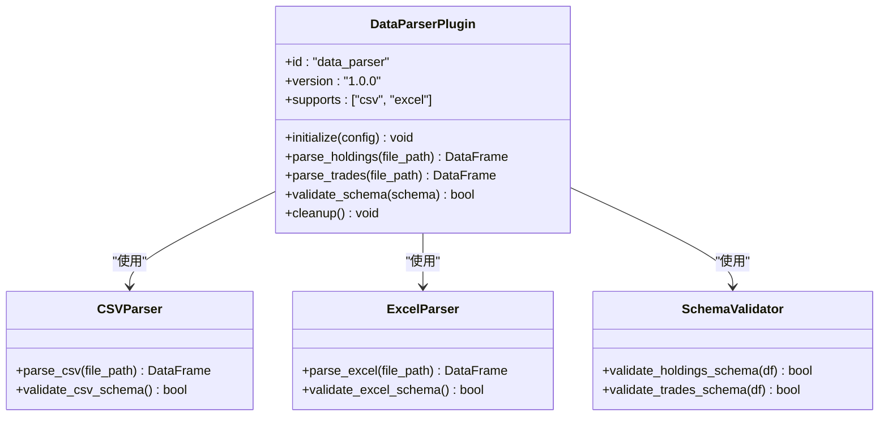
```mermaid
classDiagram
class DataParserPlugin {
+id : "data_parser"
+version : "1.0.0"
+supports : ["csv", "excel"]
+initialize(config) void
+parse_holdings(file_path) DataFrame
+parse_trades(file_path) DataFrame
+validate_schema(schema) bool
+cleanup() void
}
class CSVParser {
+parse_csv(file_path) DataFrame
+validate_csv_schema() bool
}
class ExcelParser {
+parse_excel(file_path) DataFrame
+validate_excel_schema() bool
}
class SchemaValidator {
+validate_holdings_schema(df) bool
+validate_trades_schema(df) bool
}
DataParserPlugin --> CSVParser : "使用"
DataParserPlugin --> ExcelParser : "使用"
DataParserPlugin --> SchemaValidator : "使用"
```

#### 分析引擎插件化

将分析功能抽象为可插拔的分析器：

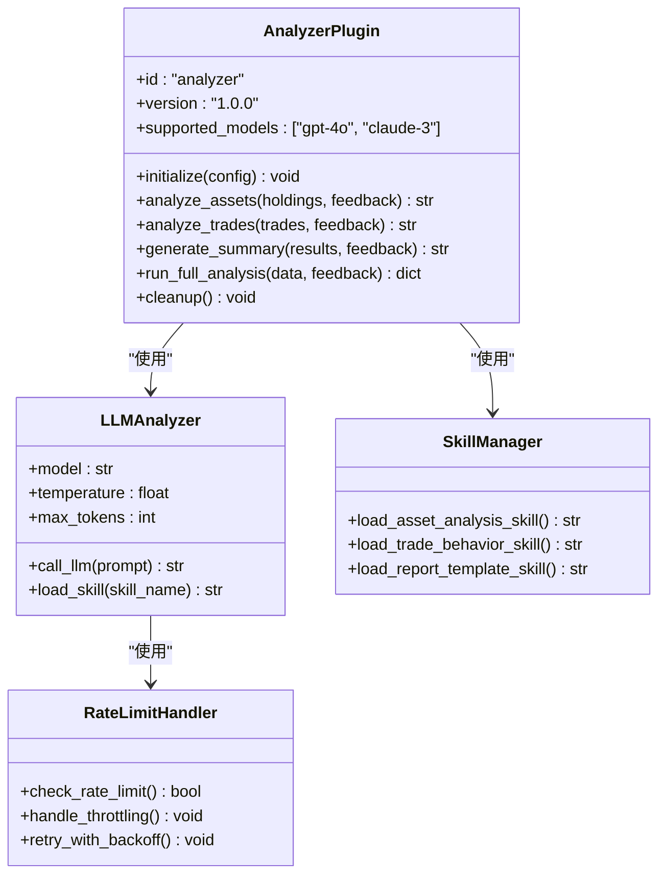
```mermaid
classDiagram
class AnalyzerPlugin {
+id : "analyzer"
+version : "1.0.0"
+supported_models : ["gpt-4o", "claude-3"]
+initialize(config) void
+analyze_assets(holdings, feedback) str
+analyze_trades(trades, feedback) str
+generate_summary(results, feedback) str
+run_full_analysis(data, feedback) dict
+cleanup() void
}
class LLMAnalyzer {
+model : str
+temperature : float
+max_tokens : int
+call_llm(prompt) str
+load_skill(skill_name) str
}
class SkillManager {
+load_asset_analysis_skill() str
+load_trade_behavior_skill() str
+load_report_template_skill() str
}
class RateLimitHandler {
+check_rate_limit() bool
+handle_throttling() void
+retry_with_backoff() void
}
AnalyzerPlugin --> LLMAnalyzer : "使用"
AnalyzerPlugin --> SkillManager : "使用"
LLMAnalyzer --> RateLimitHandler : "使用"
```

#### PDF生成插件化

将PDF生成功能模块化：

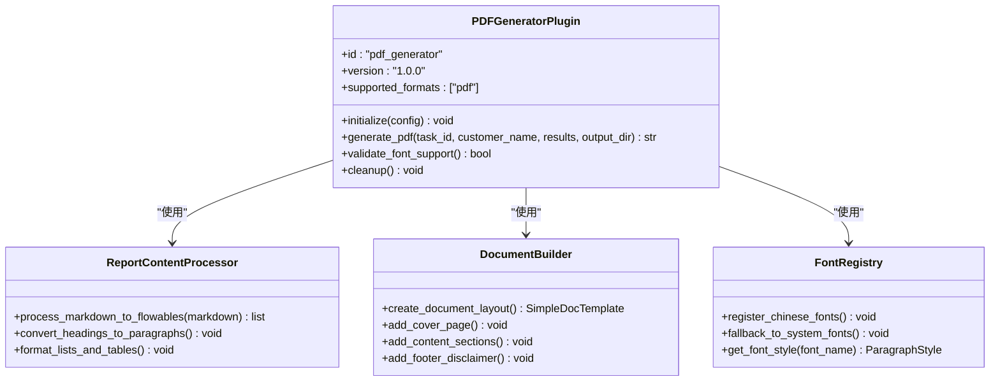
```mermaid
classDiagram
class PDFGeneratorPlugin {
+id : "pdf_generator"
+version : "1.0.0"
+supported_formats : ["pdf"]
+initialize(config) void
+generate_pdf(task_id, customer_name, results, output_dir) str
+validate_font_support() bool
+cleanup() void
}
class ReportContentProcessor {
+process_markdown_to_flowables(markdown) list
+convert_headings_to_paragraphs() void
+format_lists_and_tables() void
}
class DocumentBuilder {
+create_document_layout() SimpleDocTemplate
+add_cover_page() void
+add_content_sections() void
+add_footer_disclaimer() void
}
class FontRegistry {
+register_chinese_fonts() void
+fallback_to_system_fonts() void
+get_font_style(font_name) ParagraphStyle
}
PDFGeneratorPlugin --> ReportContentProcessor : "使用"
PDFGeneratorPlugin --> DocumentBuilder : "使用"
PDFGeneratorPlugin --> FontRegistry : "使用"
```

### 第三方服务集成

#### 外部API调用集成

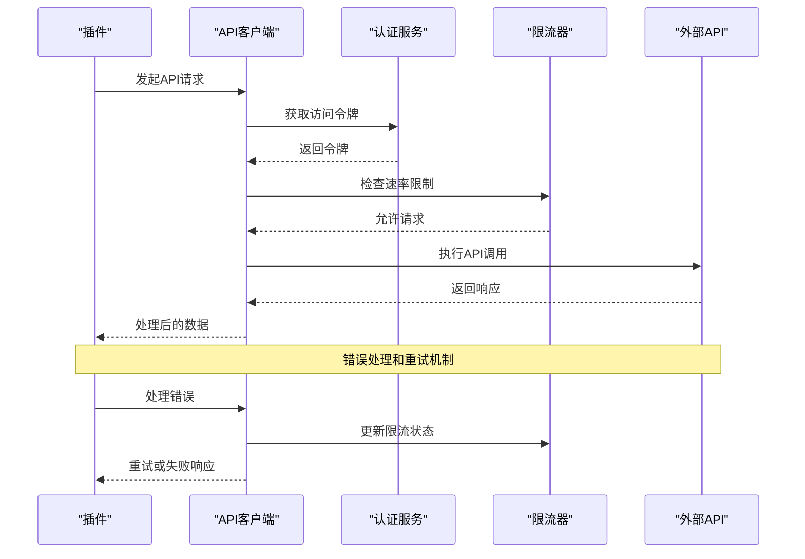
```mermaid
sequenceDiagram
participant Plugin as "插件"
participant APIClient as "API客户端"
participant Auth as "认证服务"
participant RateLimiter as "限流器"
participant ExternalAPI as "外部API"
Plugin->>APIClient : 发起API请求
APIClient->>Auth : 获取访问令牌
Auth-->>APIClient : 返回令牌
APIClient->>RateLimiter : 检查速率限制
RateLimiter-->>APIClient : 允许请求
APIClient->>ExternalAPI : 执行API调用
ExternalAPI-->>APIClient : 返回响应
APIClient-->>Plugin : 处理后的数据
Note over Plugin,ExternalAPI : 错误处理和重试机制
Plugin->>APIClient : 处理错误
APIClient->>RateLimiter : 更新限流状态
APIClient-->>Plugin : 重试或失败响应
```

#### 认证机制设计

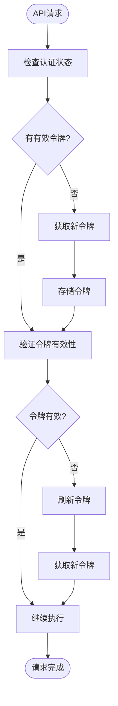
```mermaid
flowchart TD
Request([API请求]) --> CheckAuth["检查认证状态"]
CheckAuth --> HasToken{"有有效令牌?"}
HasToken --> |是| ValidateToken["验证令牌有效性"]
HasToken --> |否| GetNewToken["获取新令牌"]
ValidateToken --> TokenValid{"令牌有效?"}
TokenValid --> |是| Proceed["继续执行"]
TokenValid --> |否| RefreshToken["刷新令牌"]
RefreshToken --> NewToken["获取新令牌"]
NewToken --> Proceed
GetNewToken --> StoreToken["存储令牌"]
StoreToken --> ValidateToken
Proceed --> Complete([请求完成])
```

#### 限流处理机制

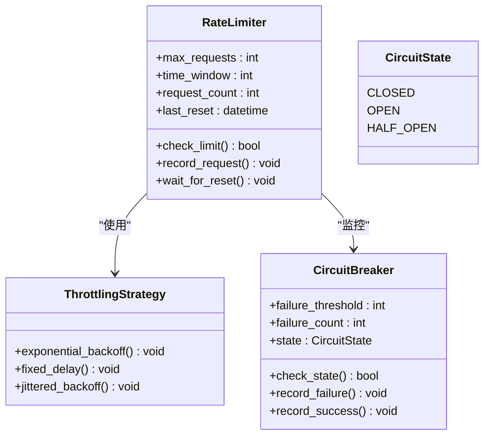
```mermaid
classDiagram
class RateLimiter {
+max_requests : int
+time_window : int
+request_count : int
+last_reset : datetime
+check_limit() bool
+record_request() void
+wait_for_reset() void
}
class ThrottlingStrategy {
+exponential_backoff() void
+fixed_delay() void
+jittered_backoff() void
}
class CircuitBreaker {
+failure_threshold : int
+failure_count : int
+state : CircuitState
+check_state() bool
+record_failure() void
+record_success() void
}
class CircuitState {
CLOSED
OPEN
HALF_OPEN
}
RateLimiter --> ThrottlingStrategy : "使用"
RateLimiter --> CircuitBreaker : "监控"
```

### 依赖注入和配置管理

#### 依赖注入容器

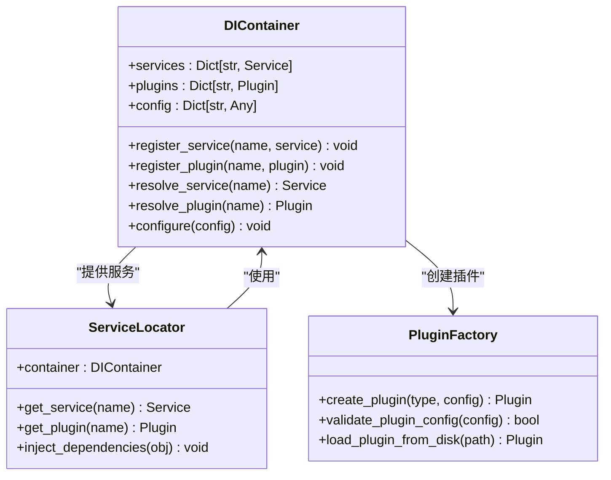
```mermaid
classDiagram
class DIContainer {
+services : Dict[str, Service]
+plugins : Dict[str, Plugin]
+config : Dict[str, Any]
+register_service(name, service) void
+register_plugin(name, plugin) void
+resolve_service(name) Service
+resolve_plugin(name) Plugin
+configure(config) void
}
class ServiceLocator {
+container : DIContainer
+get_service(name) Service
+get_plugin(name) Plugin
+inject_dependencies(obj) void
}
class PluginFactory {
+create_plugin(type, config) Plugin
+validate_plugin_config(config) bool
+load_plugin_from_disk(path) Plugin
}
DIContainer --> ServiceLocator : "提供服务"
DIContainer --> PluginFactory : "创建插件"
ServiceLocator --> DIContainer : "使用"
```

#### 配置管理系统

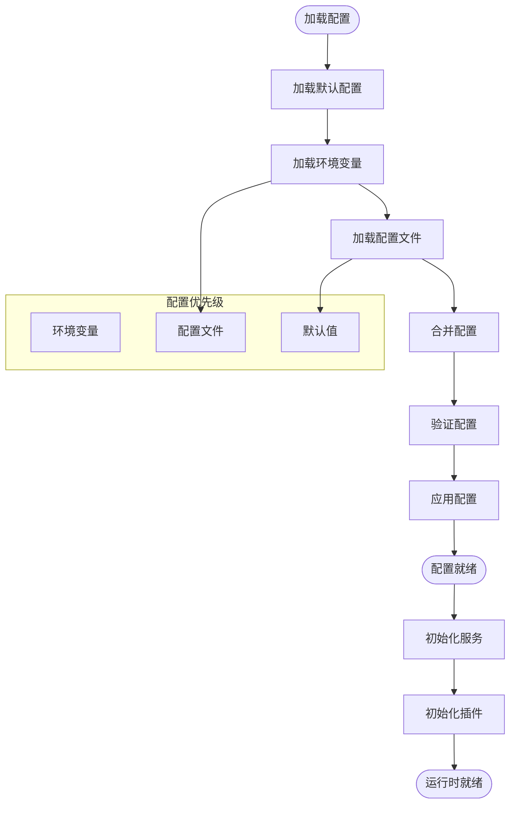
```mermaid
flowchart TD
ConfigLoad([加载配置]) --> LoadDefaults["加载默认配置"]
LoadDefaults --> LoadEnv["加载环境变量"]
LoadEnv --> LoadFile["加载配置文件"]
LoadFile --> MergeConfig["合并配置"]
MergeConfig --> ValidateConfig["验证配置"]
ValidateConfig --> ApplyConfig["应用配置"]
ApplyConfig --> Ready([配置就绪])
Ready --> ServiceInit["初始化服务"]
ServiceInit --> PluginInit["初始化插件"]
PluginInit --> RuntimeReady([运行时就绪])
subgraph "配置优先级"
EnvVar["环境变量"]
ConfigFile["配置文件"]
Defaults["默认值"]
end
LoadEnv --> ConfigFile
LoadFile --> Defaults
```

### 错误隔离和容错机制

#### 错误处理层次

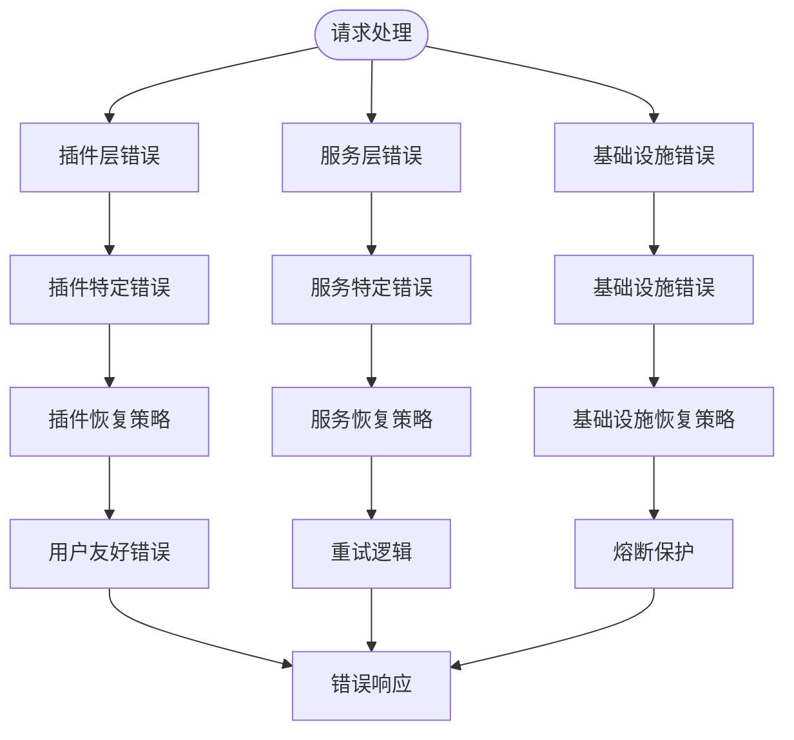
```mermaid
flowchart TD
Request([请求处理]) --> PluginLayer["插件层错误"]
Request --> ServiceLayer["服务层错误"]
Request --> InfrastructureLayer["基础设施错误"]
PluginLayer --> PluginError["插件特定错误"]
ServiceLayer --> ServiceError["服务特定错误"]
InfrastructureLayer --> InfraError["基础设施错误"]
PluginError --> PluginRecovery["插件恢复策略"]
ServiceError --> ServiceRecovery["服务恢复策略"]
InfraError --> InfraRecovery["基础设施恢复策略"]
PluginRecovery --> UserError["用户友好错误"]
ServiceRecovery --> RetryLogic["重试逻辑"]
InfraRecovery --> CircuitBreaker["熔断保护"]
UserError --> Response["错误响应"]
RetryLogic --> Response
CircuitBreaker --> Response
```

#### 熔断器模式实现

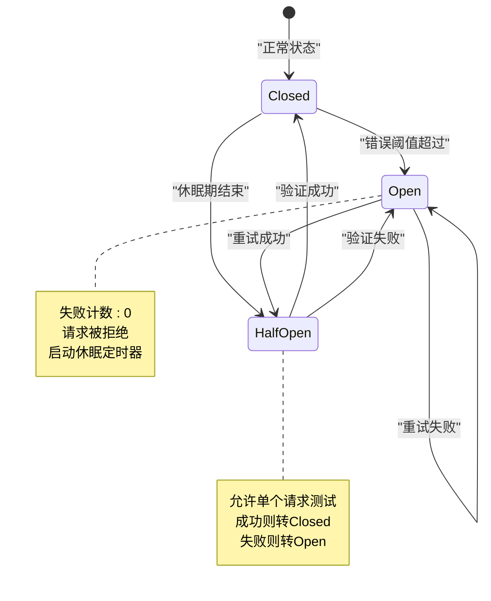
```mermaid
stateDiagram-v2
[*] --> Closed : "正常状态"
Closed --> Open : "错误阈值超过"
Closed --> HalfOpen : "休眠期结束"
Open --> HalfOpen : "重试成功"
Open --> Open : "重试失败"
HalfOpen --> Closed : "验证成功"
HalfOpen --> Open : "验证失败"
note right of Open
失败计数 : 0
请求被拒绝
启动休眠定时器
end note
note right of HalfOpen
允许单个请求测试
成功则转Closed
失败则转Open
end note
```

## 依赖分析

### 外部依赖关系

```mermaid
graph TB
subgraph "应用依赖"
FastAPI[FastAPI 0.115.0]
Uvicorn[Uvicorn 0.30.6]
OpenAI[OpenAI 1.51.0]
ReportLab[ReportLab 4.2.2]
Pandas[Pandas 2.2.2]
OpenPyXL[OpenPyXL 3.1.5]
Matplotlib[Matplotlib 3.9.2]
end
subgraph "前端依赖"
React[React 19.2.4]
AntD[Ant Design 6.3.5]
Axios[Axios 1.15.0]
AntIcons[Ant Icons 6.1.1]
end
subgraph "插件系统依赖"
Pydantic[Pydantic]
Importlib[importlib.metadata]
Types[typing_extensions]
end
FastAPI --> OpenAI
FastAPI --> Pandas
FastAPI --> ReportLab
React --> AntD
AntD --> AntIcons
React --> Axios
```

**图表来源**
- [backend/requirements.txt:1-9](file://backend/requirements.txt#L1-L9)
- [frontend/package.json:12-19](file://frontend/package.json#L12-L19)

### 内部模块依赖

```mermaid
graph TD
Main[main.py] --> Router[analysis.py]
Router --> DataParser[data_parser.py]
Router --> Analyzer[analyzer.py]
Router --> PDFGenerator[pdf_generator.py]
Analyzer --> Skills[skills/]
Analyzer --> OpenAI[OpenAI SDK]
PDFGenerator --> ReportLab[ReportLab]
PDFGenerator --> Matplotlib[Matplotlib]
Router --> Schemas[schemas.py]
Frontend[frontend/] --> Backend[backend/]
```

**图表来源**
- [backend/app/main.py:6-23](file://backend/app/main.py#L6-L23)
- [backend/app/routers/analysis.py:10-12](file://backend/app/routers/analysis.py#L10-L12)

**章节来源**
- [backend/requirements.txt:1-9](file://backend/requirements.txt#L1-L9)
- [frontend/package.json:1-32](file://frontend/package.json#L1-L32)

## 性能考虑

### 并发处理策略

插件系统需要支持高并发场景下的性能优化：

```mermaid
flowchart TD
Concurrency([并发请求]) --> Queue["请求队列"]
Queue --> WorkerPool["工作线程池"]
WorkerPool --> PluginExecutor["插件执行器"]
PluginExecutor --> ResultCache["结果缓存"]
ResultCache --> Response["响应返回"]
subgraph "性能优化"
ThreadPool["线程池大小配置"]
MaxQueue["队列长度限制"]
Timeout["超时设置"]
RetryPolicy["重试策略"]
end
WorkerPool --> ThreadPool
Queue --> MaxQueue
PluginExecutor --> Timeout
PluginExecutor --> RetryPolicy
```

### 缓存策略

```mermaid
flowchart TD
Request([请求处理]) --> CheckCache["检查缓存"]
CheckCache --> CacheHit{"缓存命中?"}
CacheHit --> |是| ReturnCached["返回缓存结果"]
CacheHit --> |否| ProcessRequest["处理请求"]
ProcessRequest --> GenerateResult["生成结果"]
GenerateResult --> CacheResult["缓存结果"]
CacheResult --> ReturnResult["返回结果"]
subgraph "缓存策略"
TTL["TTL过期时间"]
CacheSize["缓存大小限制"]
EvictionPolicy["淘汰策略"]
CacheKey["缓存键生成"]
end
CacheResult --> TTL
CacheResult --> CacheSize
CacheResult --> EvictionPolicy
CacheResult --> CacheKey
```

### 监控和指标

```mermaid
classDiagram
class PerformanceMonitor {
+track_request_duration() void
+track_memory_usage() void
+track_plugin_execution() void
+log_error_rate() void
+generate_performance_report() MetricsReport
}
class MetricsCollector {
+collect_plugin_metrics() Dict
+collect_system_metrics() Dict
+collect_cache_metrics() Dict
+aggregate_metrics() AggregatedMetrics
}
class HealthChecker {
+check_plugin_health() bool
+check_system_resources() ResourceStatus
+monitor_external_services() ServiceStatus
+alert_on_failure() void
}
PerformanceMonitor --> MetricsCollector : "使用"
PerformanceMonitor --> HealthChecker : "使用"
```

## 故障排除指南

### 常见问题诊断

```mermaid
flowchart TD
Issue([问题出现]) --> Identify["识别问题类型"]
Identify --> CheckLogs["检查日志"]
CheckLogs --> AnalyzeError["分析错误原因"]
AnalyzeError --> DetermineSolution["确定解决方案"]
DetermineSolution --> ImplementFix["实施修复"]
ImplementFix --> VerifyFix["验证修复"]
VerifyFix --> MonitorSystem["监控系统"]
subgraph "问题分类"
ConfigIssue["配置问题"]
PluginIssue["插件问题"]
NetworkIssue["网络问题"]
ResourceIssue["资源问题"]
end
Identify --> ConfigIssue
Identify --> PluginIssue
Identify --> NetworkIssue
Identify --> ResourceIssue
```

### 错误恢复策略

```mermaid
flowchart TD
Error([错误发生]) --> Categorize["分类错误类型"]
Categorize --> CriticalError{"严重错误?"}
CriticalError --> |是| EmergencyMode["紧急模式"]
CriticalError --> |否| GracefulDegradation["优雅降级"]
EmergencyMode --> ShutdownGracefully["优雅关闭"]
EmergencyMode --> AlertTeam["通知团队"]
GracefulDegradation --> RetryOperation["重试操作"]
GracefulDegradation --> FallbackToDefault["回退到默认行为"]
RetryOperation --> CheckRetryCount["检查重试次数"]
CheckRetryCount --> MaxRetries{"达到最大重试次数?"}
MaxRetries --> |是| LogError["记录错误"]
MaxRetries --> |否| BackoffWait["指数退避等待"]
BackoffWait --> RetryOperation
FallbackToDefault --> ContinueOperation["继续操作"]
ContinueOperation --> Success([操作成功])
LogError --> Failure([操作失败])
```

**章节来源**
- [backend/app/routers/analysis.py:130-135](file://backend/app/routers/analysis.py#L130-L135)
- [backend/app/services/analyzer.py:25-38](file://backend/app/services/analyzer.py#L25-L38)

## 结论

Qoder-todo项目的插件系统设计需要在保持现有功能稳定性的基础上，实现高度模块化的架构。通过定义清晰的插件接口、建立完善的加载机制和生命周期管理，以及实现第三方服务集成，可以为未来的功能扩展奠定坚实基础。

关键设计要点包括：

1. **模块化设计**：将现有功能抽象为独立插件，支持动态加载和卸载
2. **依赖注入**：通过DI容器管理插件依赖，实现松耦合架构
3. **配置管理**：支持多层级配置，包括环境变量、配置文件和默认值
4. **错误隔离**：实现插件级别的错误处理和恢复机制
5. **性能监控**：建立完整的监控体系，确保系统稳定性
6. **第三方集成**：提供标准化的API调用和认证机制

这套插件系统架构将使Qoder-todo具备良好的可扩展性和维护性，为后续的功能增强和技术演进提供有力支撑。