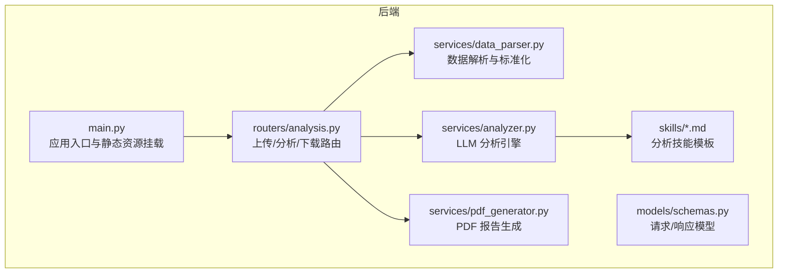
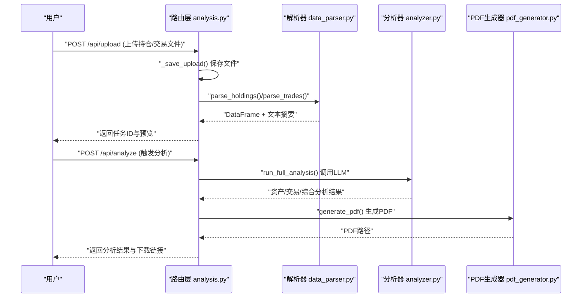
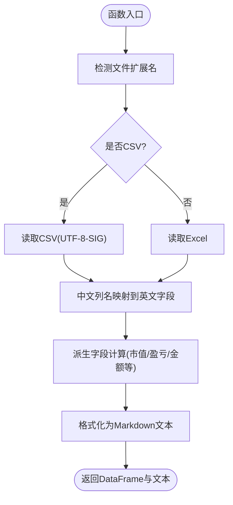
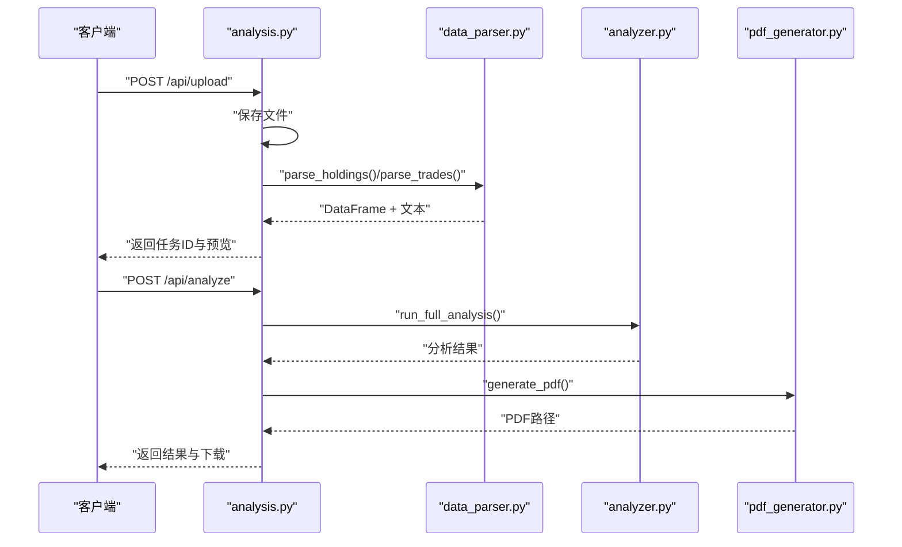
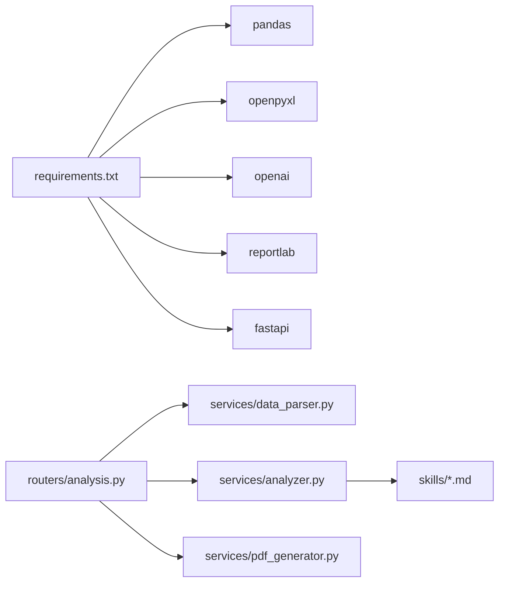

# 数据处理扩展

<cite>
**本文引用的文件列表**
- [data_parser.py](file://backend/app/services/data_parser.py)
- [analysis.py](file://backend/app/routers/analysis.py)
- [schemas.py](file://backend/app/models/schemas.py)
- [analyzer.py](file://backend/app/services/analyzer.py)
- [pdf_generator.py](file://backend/app/services/pdf_generator.py)
- [report_template.md](file://backend/app/skills/report_template.md)
- [asset_analysis.md](file://backend/app/skills/asset_analysis.md)
- [trade_behavior.md](file://backend/app/skills/trade_behavior.md)
- [main.py](file://backend/app/main.py)
- [requirements.txt](file://backend/requirements.txt)
</cite>

## 目录
1. [简介](#简介)
2. [项目结构](#项目结构)
3. [核心组件](#核心组件)
4. [架构总览](#架构总览)
5. [详细组件分析](#详细组件分析)
6. [依赖分析](#依赖分析)
7. [性能考虑](#性能考虑)
8. [故障排查指南](#故障排查指南)
9. [结论](#结论)
10. [附录](#附录)

## 简介
本指南聚焦于 Qoder-todo 项目中数据处理扩展的设计与实现，围绕 backend/app/services/data_parser.py 的数据解析能力展开，系统性说明如何在现有 CSV/Excel 基础上扩展支持更多文件格式；深入解析数据清洗、字段映射与格式标准化的逻辑；提供针对不同数据结构与异常场景的处理策略；并给出保持向后兼容与版本升级的实践建议，以及数据验证与错误处理机制的实现方法。

## 项目结构
后端采用 FastAPI 架构，核心数据处理位于 services 层，路由层负责文件上传、任务调度与结果返回，分析层对接大模型进行结构化分析，PDF 生成器负责报告输出。前端通过 API 与后端交互，完成文件上传与报告下载。

图表来源
- [main.py:1-28](file://backend/app/main.py#L1-L28)
- [analysis.py:1-218](file://backend/app/routers/analysis.py#L1-L218)
- [data_parser.py:1-96](file://backend/app/services/data_parser.py#L1-L96)
- [analyzer.py:1-93](file://backend/app/services/analyzer.py#L1-L93)
- [pdf_generator.py:1-215](file://backend/app/services/pdf_generator.py#L1-L215)
- [schemas.py:1-30](file://backend/app/models/schemas.py#L1-L30)
- [report_template.md:1-34](file://backend/app/skills/report_template.md#L1-L34)
- [asset_analysis.md:1-35](file://backend/app/skills/asset_analysis.md#L1-L35)
- [trade_behavior.md:1-34](file://backend/app/skills/trade_behavior.md#L1-L34)

章节来源
- [main.py:1-28](file://backend/app/main.py#L1-L28)
- [analysis.py:1-218](file://backend/app/routers/analysis.py#L1-L218)

## 核心组件
- 数据解析服务：负责将上传的 CSV/Excel 文件解析为结构化 DataFrame，并进行字段映射、派生字段计算与文本格式化，供后续分析模块使用。
- 路由层：提供上传、分析、下载与任务状态查询接口，负责文件落地、预览与错误处理。
- 分析引擎：加载技能模板，调用大模型 API，生成资产配置分析、交易行为分析与综合报告。
- PDF 生成器：将 Markdown 结果渲染为 PDF，支持中文字体注册与样式定制。
- 模型与模板：Pydantic 模型定义请求/响应结构；Markdown 技能模板定义分析维度与输出规范。

章节来源
- [data_parser.py:1-96](file://backend/app/services/data_parser.py#L1-L96)
- [analysis.py:1-218](file://backend/app/routers/analysis.py#L1-L218)
- [analyzer.py:1-93](file://backend/app/services/analyzer.py#L1-L93)
- [pdf_generator.py:1-215](file://backend/app/services/pdf_generator.py#L1-L215)
- [schemas.py:1-30](file://backend/app/models/schemas.py#L1-L30)
- [report_template.md:1-34](file://backend/app/skills/report_template.md#L1-L34)
- [asset_analysis.md:1-35](file://backend/app/skills/asset_analysis.md#L1-L35)
- [trade_behavior.md:1-34](file://backend/app/skills/trade_behavior.md#L1-L34)

## 架构总览
下图展示了从文件上传到报告生成的端到端流程，强调数据解析与分析链路的关键节点。

图表来源
- [analysis.py:35-152](file://backend/app/routers/analysis.py#L35-L152)
- [data_parser.py:7-95](file://backend/app/services/data_parser.py#L7-L95)
- [analyzer.py:77-93](file://backend/app/services/analyzer.py#L77-L93)
- [pdf_generator.py:146-215](file://backend/app/services/pdf_generator.py#L146-L215)

## 详细组件分析

### 数据解析器（data_parser.py）
- 功能职责
  - 支持 CSV 与 Excel 两种输入格式，自动识别并读取。
  - 对齐中文列名到英文字段名，实现跨表头差异的兼容。
  - 自动派生关键指标字段，如市值、浮动盈亏、盈亏比例、交易金额等。
  - 将 DataFrame 转换为结构化文本，便于 LLM 分析。
- 关键逻辑
  - 文件类型判定：基于文件扩展名选择读取方式。
  - 字段映射：通过“包含匹配”策略，将中文列名映射到统一英文字段集合。
  - 派生字段：在缺失字段时，依据已有字段计算得到，确保下游分析可用。
  - 文本格式化：生成带汇总信息的 Markdown 文本，增强 LLM 上下文。
- 异常与健壮性
  - 当前实现未显式捕获解析异常，建议在路由层进行 try-except 包裹，避免解析失败导致服务中断。
- 扩展点
  - 新增格式支持：在文件类型判定处增加新的扩展名分支，调用相应解析库（如 openpyxl、polars、pyarrow 等）。
  - 多工作表处理：对 Excel 可扩展为读取指定 Sheet 或合并多个 Sheet。
  - 字段校验与清洗：在映射后增加字段类型与取值范围检查，缺失值填充或替换策略。
  - 版本化字段映射：维护多版本映射表，按文件版本号选择对应映射，保障向后兼容。

图表来源
- [data_parser.py:7-52](file://backend/app/services/data_parser.py#L7-L52)
- [data_parser.py:55-95](file://backend/app/services/data_parser.py#L55-L95)

章节来源
- [data_parser.py:1-96](file://backend/app/services/data_parser.py#L1-L96)

### 路由层（analysis.py）
- 功能职责
  - 接收上传文件，保存至本地临时目录，生成任务ID并缓存任务状态。
  - 在上传阶段对文件进行预解析，返回前10条记录用于前端预览。
  - 触发完整分析流程，生成 PDF 报告并提供下载。
  - 提供任务状态查询与重新生成分析的能力。
- 错误处理
  - 上传阶段对解析异常进行捕获并返回 400 错误。
  - 分析阶段对异常进行捕获并标记任务状态为 failed，同时返回 500 错误。
- 向后兼容
  - 通过任务状态机与内存存储，保证任务生命周期内数据一致性。
  - 建议引入数据库持久化，避免进程重启丢失任务状态。

图表来源
- [analysis.py:35-152](file://backend/app/routers/analysis.py#L35-L152)
- [data_parser.py:7-95](file://backend/app/services/data_parser.py#L7-L95)
- [analyzer.py:77-93](file://backend/app/services/analyzer.py#L77-L93)
- [pdf_generator.py:146-215](file://backend/app/services/pdf_generator.py#L146-L215)

章节来源
- [analysis.py:1-218](file://backend/app/routers/analysis.py#L1-L218)

### 分析引擎（analyzer.py）
- 功能职责
  - 加载 Markdown 技能模板，构建系统提示词与用户提示词。
  - 调用 OpenAI 客户端（支持自定义 base_url），执行聊天补全。
  - 提供资产配置分析、交易行为分析与综合报告生成的统一入口。
- 配置与扩展
  - 通过环境变量 OPENAI_API_KEY、OPENAI_BASE_URL、OPENAI_MODEL 控制客户端参数。
  - 技能模板可独立扩展，新增分析维度只需新增 .md 文件并更新调用逻辑。

章节来源
- [analyzer.py:1-93](file://backend/app/services/analyzer.py#L1-L93)

### PDF 生成器（pdf_generator.py）
- 功能职责
  - 注册中文字体，适配中文显示；若未找到字体则回退到 Helvetica。
  - 将 Markdown 文本转换为 ReportLab Flowable，构建报告结构（封面、分节、页脚）。
  - 生成 A4 页面布局，输出 PDF 文件路径供下载。
- 扩展点
  - 可增加表格渲染、图表插入、水印与页眉页脚定制等功能。
  - 可引入模板引擎（如 Jinja2）以支持动态内容与国际化。

章节来源
- [pdf_generator.py:1-215](file://backend/app/services/pdf_generator.py#L1-L215)

### 模型与模板
- Pydantic 模型定义了任务状态、请求与响应结构，便于前后端契约一致。
- 技能模板以 Markdown 形式定义分析维度与输出规范，便于业务人员参与规则制定与迭代。

章节来源
- [schemas.py:1-30](file://backend/app/models/schemas.py#L1-L30)
- [report_template.md:1-34](file://backend/app/skills/report_template.md#L1-L34)
- [asset_analysis.md:1-35](file://backend/app/skills/asset_analysis.md#L1-L35)
- [trade_behavior.md:1-34](file://backend/app/skills/trade_behavior.md#L1-L34)

## 依赖分析
- 外部库
  - pandas、openpyxl：用于 CSV/Excel 解析与写入。
  - openai：调用大模型 API。
  - reportlab：生成 PDF 报告。
  - fastapi、uvicorn：Web 框架与 ASGI 服务器。
- 内部依赖
  - 路由层依赖解析器与分析器；分析器依赖技能模板；PDF 生成器依赖分析结果。

图表来源
- [requirements.txt:1-9](file://backend/requirements.txt#L1-L9)
- [analysis.py:10-12](file://backend/app/routers/analysis.py#L10-L12)
- [analyzer.py:4-5](file://backend/app/services/analyzer.py#L4-L5)
- [pdf_generator.py:3-19](file://backend/app/services/pdf_generator.py#L3-L19)

章节来源
- [requirements.txt:1-9](file://backend/requirements.txt#L1-L9)

## 性能考虑
- 解析性能
  - 对于大型 CSV/Excel 文件，建议分块读取或限制预览行数，避免内存峰值过高。
  - 派生字段计算尽量向量化，减少循环开销。
- I/O 与并发
  - 上传文件落地与 PDF 生成均为磁盘 I/O 密集，建议使用异步队列（如 Celery/RQ）解耦长耗时任务。
- 缓存与复用
  - 对常用解析结果进行缓存，降低重复分析成本。
- 字体与渲染
  - 中文字体注册仅执行一次，避免重复注册带来的性能损耗。

## 故障排查指南
- 上传失败
  - 确认文件扩展名与实际格式一致；检查编码（CSV 使用 UTF-8-SIG）。
  - 查看路由层的异常捕获与错误码，定位具体失败环节。
- 解析异常
  - 在 data_parser.py 中增加 try-except 并记录详细日志，区分“文件格式不支持”与“字段缺失/类型错误”两类问题。
- 分析失败
  - 检查 OPENAI_API_KEY、OPENAI_BASE_URL、OPENAI_MODEL 环境变量配置。
  - 确认技能模板存在且内容完整。
- PDF 生成失败
  - 检查中文字体注册路径与权限；确认输出目录可写。
- 任务状态异常
  - 生产环境建议使用数据库持久化任务状态，避免内存存储导致的状态丢失。

章节来源
- [analysis.py:51-64](file://backend/app/routers/analysis.py#L51-L64)
- [analysis.py:130-134](file://backend/app/routers/analysis.py#L130-L134)
- [pdf_generator.py:26-51](file://backend/app/services/pdf_generator.py#L26-L51)

## 结论
data_parser.py 已具备 CSV/Excel 的基础解析能力，并通过字段映射与派生字段实现了数据标准化，为后续分析提供了高质量输入。通过在路由层增加异常处理、在解析器中引入字段校验与版本化映射、以及在 PDF 生成器中增强渲染能力，可以进一步提升系统的稳定性与可扩展性。建议逐步引入数据库持久化与异步任务队列，以支撑更大规模的数据处理需求。

## 附录

### 如何在 data_parser.py 中添加新文件格式支持
- 新增格式识别
  - 在文件类型判定处增加新的扩展名分支，例如对 Parquet/Feather/HDF5 等格式进行读取。
  - 对于多工作表 Excel，可扩展为读取指定 Sheet 或合并多个 Sheet。
- 字段映射与清洗
  - 维护多版本映射表，按文件版本号选择对应映射，保障向后兼容。
  - 在映射后增加字段类型与取值范围检查，缺失值采用默认值或插值策略。
- 派生字段与文本格式化
  - 在缺失字段时，依据已有字段计算得到，确保下游分析可用。
  - 文本格式化保留关键统计信息，便于 LLM 理解上下文。

章节来源
- [data_parser.py:7-52](file://backend/app/services/data_parser.py#L7-L52)
- [data_parser.py:55-95](file://backend/app/services/data_parser.py#L55-L95)

### 数据验证规则与错误处理机制
- 字段验证
  - 必填字段：名称、代码、数量、价格/金额/时间等。
  - 类型验证：数值字段应为数字，时间字段应为日期/时间格式。
  - 范围验证：价格不得为负，数量应在合理区间。
- 清洗策略
  - 缺失值：数量字段缺失时尝试从金额/价格推导；时间字段缺失时标记为未知。
  - 重复值：去重并记录重复条目数量。
  - 异常值：识别离群值并标注，供人工复核。
- 错误处理
  - 路由层捕获解析异常并返回 400；分析异常返回 500。
  - 记录详细日志，包含文件名、字段名、异常类型与修复建议。

章节来源
- [analysis.py:51-64](file://backend/app/routers/analysis.py#L51-L64)
- [analysis.py:130-134](file://backend/app/routers/analysis.py#L130-L134)

### 向后兼容性与版本升级策略
- 版本化映射
  - 为不同版本的文件格式维护独立映射表，解析时根据文件元数据选择对应版本。
- 兼容性测试
  - 建立历史文件样本库，覆盖主流格式与版本，确保回归测试通过。
- 渐进式迁移
  - 新旧版本并行支持一段时间，逐步引导用户升级文件格式。
- 文档与通知
  - 更新文档与变更日志，提前通知用户升级计划与注意事项。

章节来源
- [data_parser.py:14-35](file://backend/app/services/data_parser.py#L14-L35)