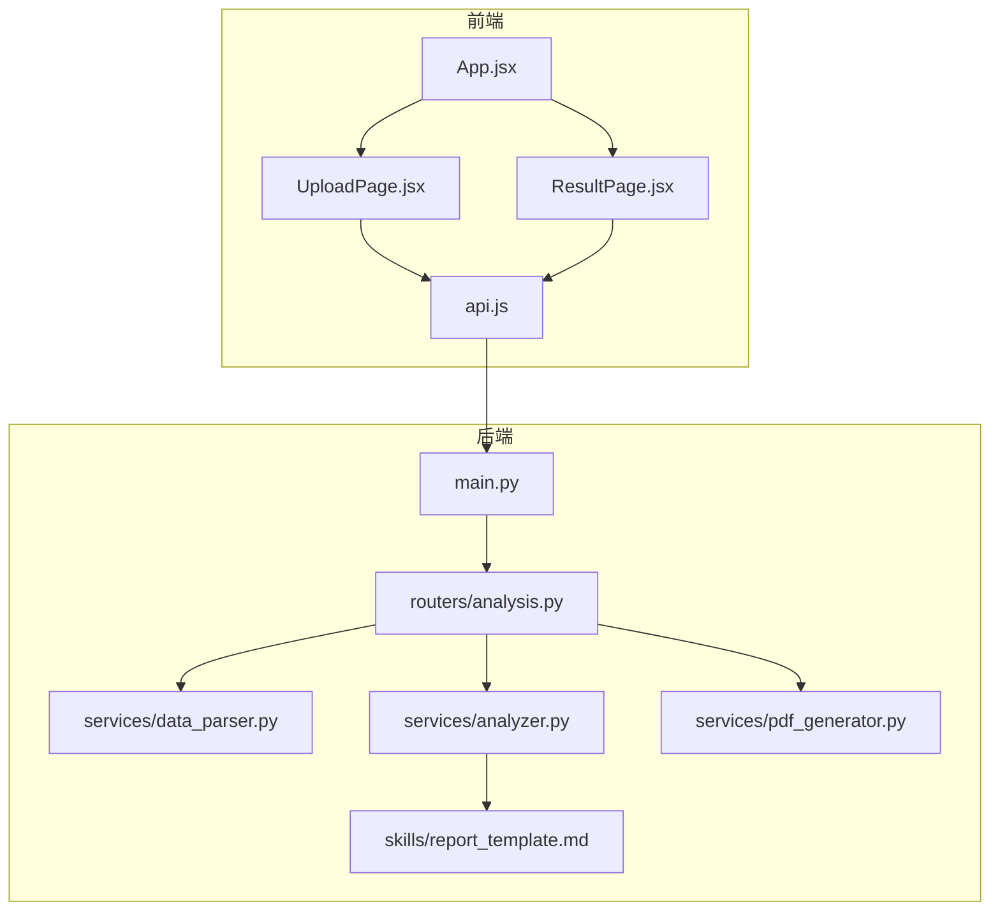
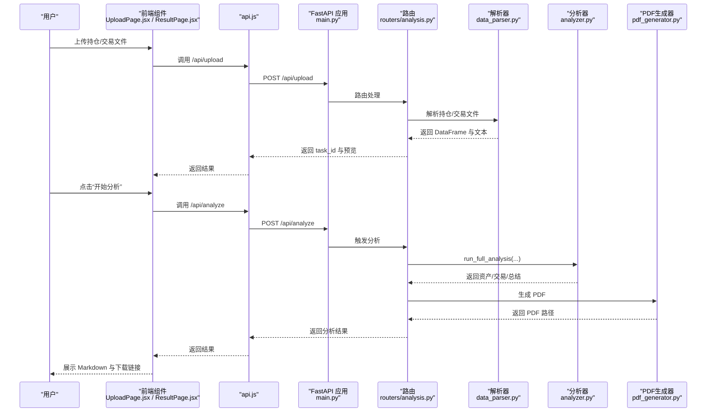
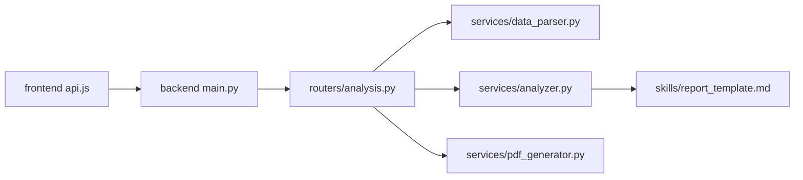
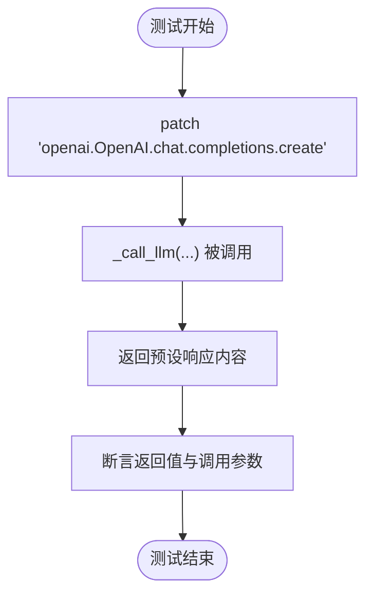

# 测试策略

<cite>
**本文引用的文件**
- [backend/app/services/data_parser.py](file://backend/app/services/data_parser.py)
- [backend/app/services/analyzer.py](file://backend/app/services/analyzer.py)
- [backend/app/routers/analysis.py](file://backend/app/routers/analysis.py)
- [backend/app/services/pdf_generator.py](file://backend/app/services/pdf_generator.py)
- [backend/app/main.py](file://backend/app/main.py)
- [backend/app/skills/report_template.md](file://backend/app/skills/report_template.md)
- [frontend/src/components/UploadPage.jsx](file://frontend/src/components/UploadPage.jsx)
- [frontend/src/components/ResultPage.jsx](file://frontend/src/components/ResultPage.jsx)
- [frontend/src/services/api.js](file://frontend/src/services/api.js)
- [frontend/src/App.jsx](file://frontend/src/App.jsx)
</cite>

## 目录
1. [引言](#引言)
2. [项目结构](#项目结构)
3. [核心组件](#核心组件)
4. [架构总览](#架构总览)
5. [详细组件分析](#详细组件分析)
6. [依赖分析](#依赖分析)
7. [性能考虑](#性能考虑)
8. [故障排查指南](#故障排查指南)
9. [结论](#结论)
10. [附录](#附录)

## 引言
本测试策略面向 Qoder-todo 项目，目标是建立覆盖后端服务函数、前端组件、API 接口与端到端流程的系统化测试方案。重点包括：
- 单元测试：针对 Python 后端函数（数据解析、分析引擎、PDF 生成）与前端组件（上传页、结果页）。
- 集成测试：API 接口测试与端到端测试（从上传到下载 PDF 的完整链路）。
- 测试框架：pytest（后端）、Jest（前端）配置与使用要点。
- Mock 对象：对 OpenAI API 的模拟，确保测试稳定与可重复。
- 覆盖率与 CI：测试覆盖率要求与持续集成中的执行流程。

## 项目结构
项目采用前后端分离架构：
- 后端基于 FastAPI，提供文件上传、解析、分析与 PDF 报告生成接口。
- 前端基于 React + Ant Design，负责用户交互与 API 调用。
- 关键模块职责：
  - data_parser：解析 CSV/Excel，标准化列名并生成文本摘要。
  - analyzer：加载技能模板，调用 OpenAI API 执行分析。
  - pdf_generator：将 Markdown 结果渲染为 PDF。
  - routers.analysis：对外暴露 /upload、/analyze、/report/{task_id}/pdf 等路由。
  - frontend components：UploadPage、ResultPage 与 api.js。

图表来源
- [backend/app/main.py:1-28](file://backend/app/main.py#L1-L28)
- [backend/app/routers/analysis.py:1-218](file://backend/app/routers/analysis.py#L1-L218)
- [backend/app/services/data_parser.py:1-96](file://backend/app/services/data_parser.py#L1-L96)
- [backend/app/services/analyzer.py:1-93](file://backend/app/services/analyzer.py#L1-L93)
- [backend/app/services/pdf_generator.py:1-215](file://backend/app/services/pdf_generator.py#L1-L215)
- [backend/app/skills/report_template.md:1-34](file://backend/app/skills/report_template.md#L1-L34)
- [frontend/src/components/UploadPage.jsx:1-145](file://frontend/src/components/UploadPage.jsx#L1-L145)
- [frontend/src/components/ResultPage.jsx:1-193](file://frontend/src/components/ResultPage.jsx#L1-L193)
- [frontend/src/services/api.js:1-48](file://frontend/src/services/api.js#L1-L48)
- [frontend/src/App.jsx:1-81](file://frontend/src/App.jsx#L1-L81)

章节来源
- [backend/app/main.py:1-28](file://backend/app/main.py#L1-L28)
- [frontend/src/App.jsx:1-81](file://frontend/src/App.jsx#L1-L81)

## 核心组件
- 数据解析服务：解析持仓与交易数据，标准化列名，计算衍生字段，并生成文本摘要。
- 分析引擎：加载技能模板，构造系统/用户消息，调用 OpenAI API 并返回结果。
- PDF 生成器：注册中文字体，解析 Markdown，构建 PDF 文档。
- API 路由：处理文件上传、触发分析、下载报告、状态查询与反馈重生成。
- 前端组件：上传页（文件选择、预览）、结果页（分析状态、Markdown 展示、PDF 下载与反馈重生成）。

章节来源
- [backend/app/services/data_parser.py:1-96](file://backend/app/services/data_parser.py#L1-L96)
- [backend/app/services/analyzer.py:1-93](file://backend/app/services/analyzer.py#L1-L93)
- [backend/app/services/pdf_generator.py:1-215](file://backend/app/services/pdf_generator.py#L1-L215)
- [backend/app/routers/analysis.py:1-218](file://backend/app/routers/analysis.py#L1-L218)
- [frontend/src/components/UploadPage.jsx:1-145](file://frontend/src/components/UploadPage.jsx#L1-L145)
- [frontend/src/components/ResultPage.jsx:1-193](file://frontend/src/components/ResultPage.jsx#L1-L193)

## 架构总览
下图展示从用户上传到生成 PDF 的端到端流程，以及各组件间的调用关系。

图表来源
- [frontend/src/components/UploadPage.jsx:1-145](file://frontend/src/components/UploadPage.jsx#L1-L145)
- [frontend/src/components/ResultPage.jsx:1-193](file://frontend/src/components/ResultPage.jsx#L1-L193)
- [frontend/src/services/api.js:1-48](file://frontend/src/services/api.js#L1-L48)
- [backend/app/main.py:1-28](file://backend/app/main.py#L1-L28)
- [backend/app/routers/analysis.py:1-218](file://backend/app/routers/analysis.py#L1-L218)
- [backend/app/services/data_parser.py:1-96](file://backend/app/services/data_parser.py#L1-L96)
- [backend/app/services/analyzer.py:1-93](file://backend/app/services/analyzer.py#L1-L93)
- [backend/app/services/pdf_generator.py:1-215](file://backend/app/services/pdf_generator.py#L1-L215)

## 详细组件分析

### 后端服务函数测试策略
- data_parser.py
  - 测试点：CSV/Excel 读取、列名映射、缺失列的派生字段计算、文本摘要格式。
  - 输入：不同列名变体、缺失字段、空值与异常文件类型。
  - 断言：DataFrame 字段存在性、数值计算正确性、文本摘要片段。
  - 复杂度：O(n) 行处理，空间 O(n)。
- analyzer.py
  - 测试点：技能模板加载、OpenAI 客户端初始化、LLM 调用参数与响应。
  - Mock：使用 unittest.mock.patch 替换 openai.OpenAI.chat.completions.create。
  - 环境变量：OPENAI_API_KEY、OPENAI_BASE_URL、OPENAI_MODEL。
  - 断言：返回字符串非空、包含预期关键词。
- pdf_generator.py
  - 测试点：字体注册回退逻辑、Markdown 到 flowables 转换、PDF 构建与输出路径。
  - Mock：使用 unittest.mock.patch 替换 reportlab 相关调用，避免真实写盘。
  - 断言：输出目录存在、PDF 文件可读、封面/分节/免责声明等元素存在。

章节来源
- [backend/app/services/data_parser.py:1-96](file://backend/app/services/data_parser.py#L1-L96)
- [backend/app/services/analyzer.py:1-93](file://backend/app/services/analyzer.py#L1-L93)
- [backend/app/services/pdf_generator.py:1-215](file://backend/app/services/pdf_generator.py#L1-L215)

### 前端组件测试策略
- UploadPage.jsx
  - 测试点：文件选择（CSV/Excel）、禁用/启用按钮、预览表格列头、错误消息提示。
  - Mock：使用 Jest 的 __mocks__ 或 jest.mock 替换 api.js 的 uploadFiles。
  - 断言：调用次数、传参、UI 状态变化（loading、message）。
- ResultPage.jsx
  - 测试点：开始分析按钮、Markdown 渲染、PDF 下载链接、反馈重生成。
  - Mock：替换 api.js 的 startAnalysis、regenerateAnalysis、getPdfDownloadUrl。
  - 断言：调用链顺序、错误处理、Collapse 展示内容。

章节来源
- [frontend/src/components/UploadPage.jsx:1-145](file://frontend/src/components/UploadPage.jsx#L1-L145)
- [frontend/src/components/ResultPage.jsx:1-193](file://frontend/src/components/ResultPage.jsx#L1-L193)
- [frontend/src/services/api.js:1-48](file://frontend/src/services/api.js#L1-L48)

### API 接口测试策略
- 路由层（routers/analysis.py）
  - 测试点：/upload（必填/可选文件、预览生成、错误处理）、/analyze（状态流转、异常捕获）、/report/{task_id}/pdf（文件存在性）、/analyze/{task_id}/regenerate（反馈重生成）、/task/{task_id}（状态查询）。
  - Mock：替换 data_parser、analyzer、pdf_generator，避免真实 IO 与外部 API。
  - 断言：HTTP 状态码、响应结构、错误 detail、文件路径存在。
- 主应用（main.py）
  - 测试点：CORS 配置、静态资源挂载、路由前缀 /api、上传/报告目录创建。
  - 断言：允许来源、方法、头设置生效；目录存在。

章节来源
- [backend/app/routers/analysis.py:1-218](file://backend/app/routers/analysis.py#L1-L218)
- [backend/app/main.py:1-28](file://backend/app/main.py#L1-L28)

### 端到端测试策略
- 场景：上传 → 预览 → 分析 → PDF 下载 → 反馈重生成。
- 方法：使用 Playwright/Cypress（推荐 Playwright）启动后端服务，访问前端页面，模拟用户操作。
- Mock：在 E2E 层可对 OpenAI API 进行网络层拦截或替换 axios 实现，保证稳定性。
- 断言：页面文案、Markdown 渲染、下载链接可用、任务状态变更。

## 依赖分析
- 组件耦合
  - routers/analysis.py 依赖 data_parser、analyzer、pdf_generator。
  - analyzer 依赖 skills/report_template.md 与 OpenAI API。
  - pdf_generator 依赖 reportlab 与系统字体。
  - 前端 api.js 依赖 axios 与后端 /api 前缀。
- 外部依赖
  - OpenAI API（需通过 Mock 隔离）。
  - 文件系统（上传/报告目录）。
- 循环依赖
  - 当前文件未见循环导入。

图表来源
- [backend/app/routers/analysis.py:1-218](file://backend/app/routers/analysis.py#L1-L218)
- [backend/app/services/data_parser.py:1-96](file://backend/app/services/data_parser.py#L1-L96)
- [backend/app/services/analyzer.py:1-93](file://backend/app/services/analyzer.py#L1-L93)
- [backend/app/services/pdf_generator.py:1-215](file://backend/app/services/pdf_generator.py#L1-L215)
- [backend/app/skills/report_template.md:1-34](file://backend/app/skills/report_template.md#L1-L34)
- [frontend/src/services/api.js:1-48](file://frontend/src/services/api.js#L1-L48)
- [backend/app/main.py:1-28](file://backend/app/main.py#L1-L28)

## 性能考虑
- 解析性能：data_parser 对大数据量 CSV/Excel 的处理应分块读取与内存复用，避免 O(n^2) 操作。
- 分析延迟：OpenAI API 调用耗时较长，建议在测试中使用 Mock，避免真实网络请求。
- PDF 生成：字体注册与渲染为 PDF 的开销较大，测试中可跳过实际写盘，仅断言结构。
- 并发与超时：前端 axios 超时设置较长以适配分析耗时，测试中可缩短以提升效率。

## 故障排查指南
- OpenAI API 错误
  - 现象：分析接口报错或返回空。
  - 排查：检查 OPENAI_API_KEY、OPENAI_BASE_URL、OPENAI_MODEL 是否设置；确认 Mock 是否正确注入。
- 文件解析失败
  - 现象：/upload 返回 400。
  - 排查：列名映射是否覆盖、缺失字段是否触发派生计算、编码与扩展名是否正确。
- PDF 无法下载
  - 现象：/report/{task_id}/pdf 404。
  - 排查：任务是否存在、pdf_path 是否生成、文件是否存在。
- 前端调用异常
  - 现象：上传/分析按钮无响应或错误提示。
  - 排查：CORS 设置、/api 前缀、axios baseURL、错误分支 message。

章节来源
- [backend/app/services/analyzer.py:1-93](file://backend/app/services/analyzer.py#L1-L93)
- [backend/app/routers/analysis.py:1-218](file://backend/app/routers/analysis.py#L1-L218)
- [frontend/src/services/api.js:1-48](file://frontend/src/services/api.js#L1-L48)

## 结论
通过将单元测试、集成测试与端到端测试相结合，并配合对 OpenAI API 的 Mock，可以有效保障 Qoder-todo 在功能正确性、接口稳定性与用户体验方面的质量。建议在 CI 中执行全量测试并统计覆盖率，逐步提升至高覆盖率标准。

## 附录

### 测试框架配置与使用

- pytest（后端）
  - 安装：在后端根目录安装 pytest 与 pytest-cov。
  - 运行：pytest --cov=backend/app/services --cov-report=xml
  - Mock：使用 unittest.mock.patch 替换 openai.OpenAI.chat.completions.create。
  - 示例命令：pytest tests/ -v --tb=short
- Jest（前端）
  - 安装：在前端根目录安装 jest @jest/globals。
  - 运行：jest --coverage
  - Mock：使用 jest.mock 替换 api.js 导出函数。
  - 示例命令：jest src/__tests__/ --watchAll

章节来源
- [backend/app/services/analyzer.py:1-93](file://backend/app/services/analyzer.py#L1-L93)
- [frontend/src/services/api.js:1-48](file://frontend/src/services/api.js#L1-L48)

### Mock 对象设计（OpenAI API）

图表来源
- [backend/app/services/analyzer.py:25-38](file://backend/app/services/analyzer.py#L25-L38)

### 测试覆盖率要求建议
- 单元测试：后端函数覆盖率 ≥ 80%，分支覆盖率 ≥ 60%。
- 前端组件：组件覆盖率 ≥ 75%，关键交互路径覆盖。
- 集成测试：API 路由与关键业务流程覆盖 ≥ 90%。
- CI 执行：每次提交触发全量测试，覆盖率低于阈值则阻断合并。

### 持续集成中的测试执行流程
- 触发条件：push 到主分支或发起 PR。
- 步骤：
  1) 安装后端依赖（pip install -r backend/requirements.txt）。
  2) 启动后端服务（uvicorn）。
  3) 安装前端依赖（npm ci）。
  4) 运行前端测试（Jest）与覆盖率收集。
  5) 运行后端测试（pytest + coverage）。
  6) 汇总覆盖率并上报。
  7) 若失败或覆盖率不足，标记失败并阻止合并。