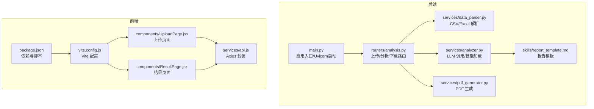
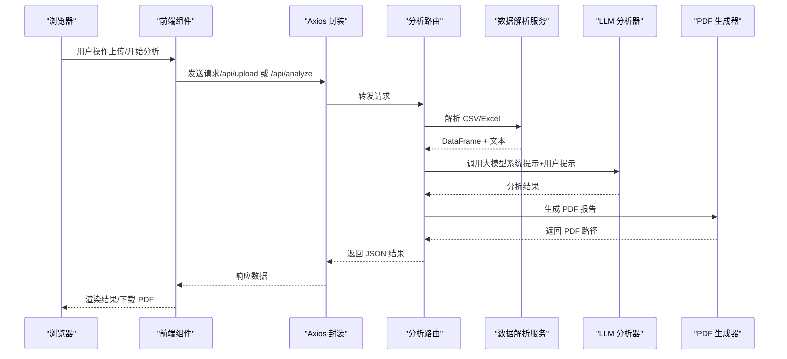
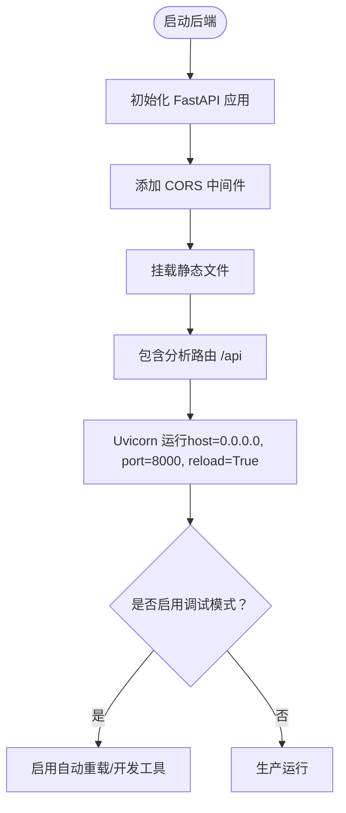
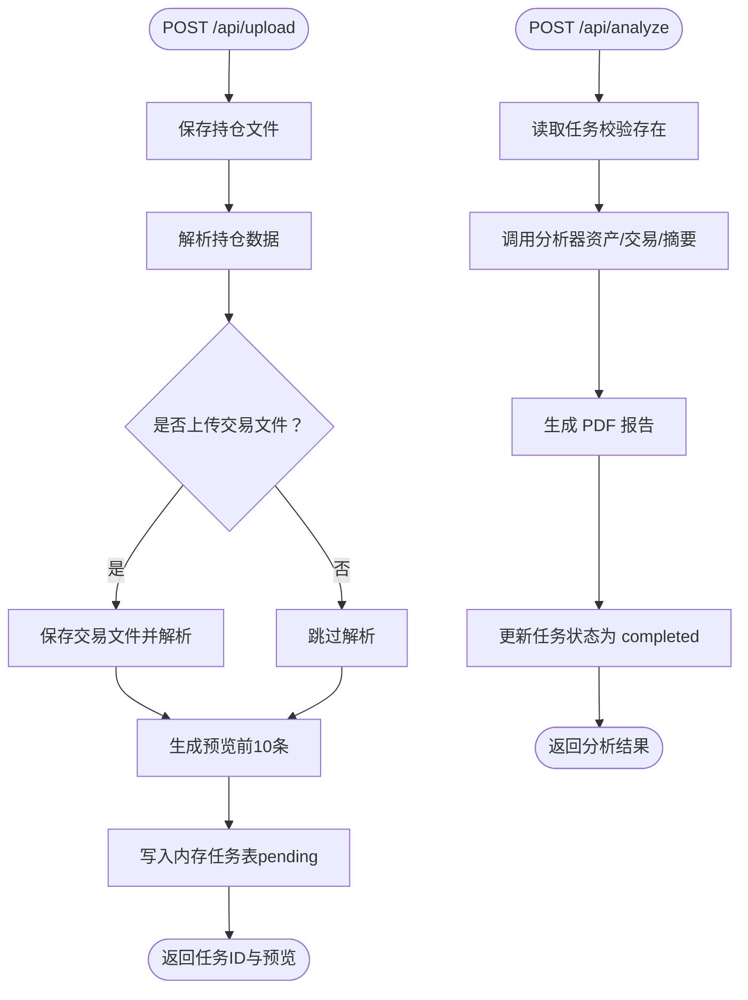
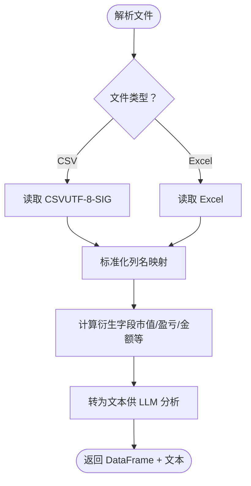
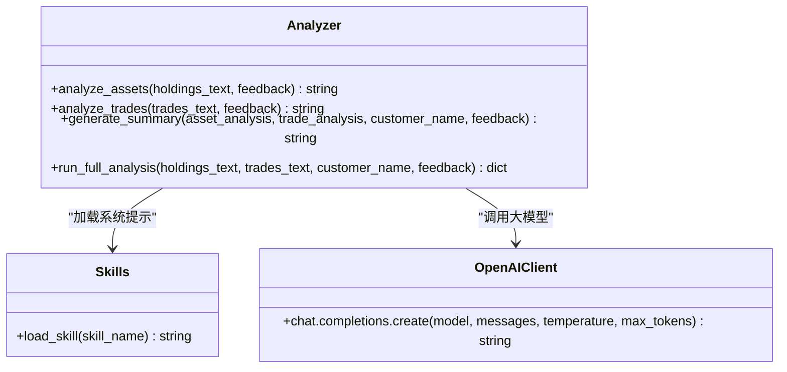
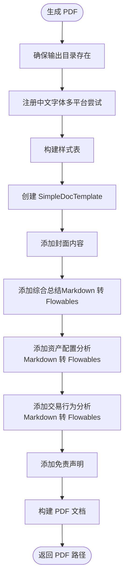
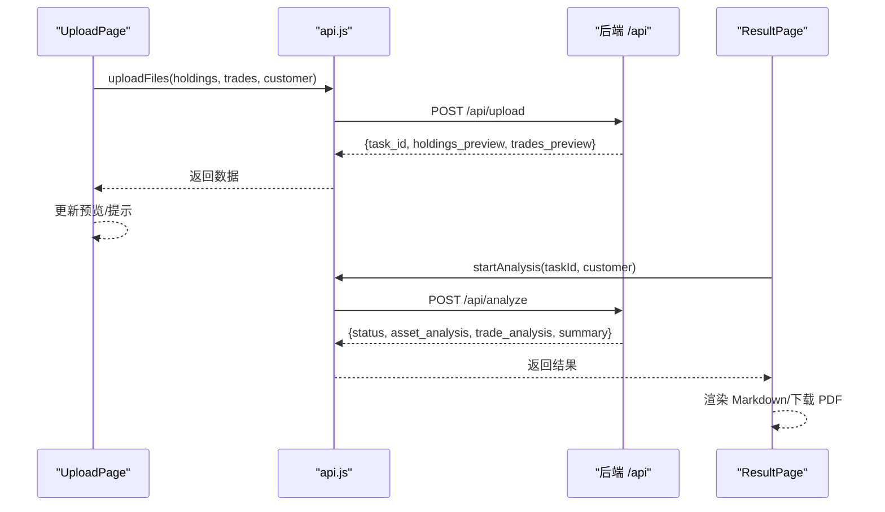
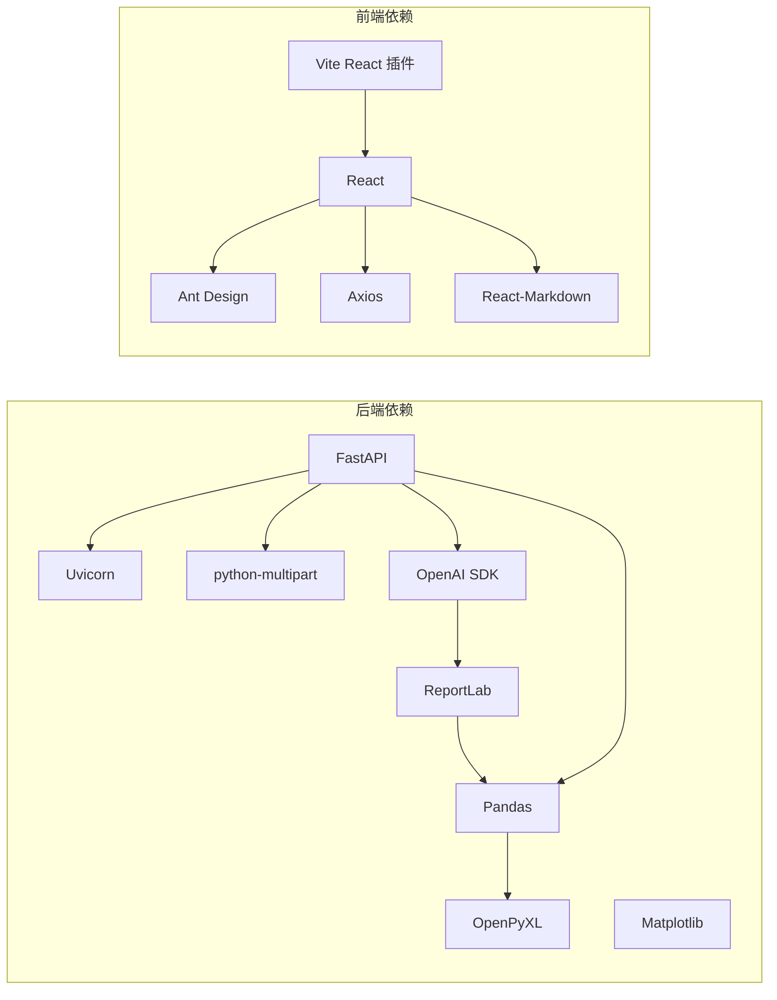

# 调试与故障排除

<cite>
**本文引用的文件**
- [backend/app/main.py](file://backend/app/main.py)
- [backend/app/routers/analysis.py](file://backend/app/routers/analysis.py)
- [backend/app/services/analyzer.py](file://backend/app/services/analyzer.py)
- [backend/app/services/data_parser.py](file://backend/app/services/data_parser.py)
- [backend/app/services/pdf_generator.py](file://backend/app/services/pdf_generator.py)
- [backend/app/skills/report_template.md](file://backend/app/skills/report_template.md)
- [backend/requirements.txt](file://backend/requirements.txt)
- [frontend/src/services/api.js](file://frontend/src/services/api.js)
- [frontend/src/components/UploadPage.jsx](file://frontend/src/components/UploadPage.jsx)
- [frontend/src/components/ResultPage.jsx](file://frontend/src/components/ResultPage.jsx)
- [frontend/vite.config.js](file://frontend/vite.config.js)
- [frontend/package.json](file://frontend/package.json)
</cite>

## 目录
1. [简介](#简介)
2. [项目结构](#项目结构)
3. [核心组件](#核心组件)
4. [架构总览](#架构总览)
5. [详细组件分析](#详细组件分析)
6. [依赖关系分析](#依赖关系分析)
7. [性能考虑](#性能考虑)
8. [故障排除指南](#故障排除指南)
9. [结论](#结论)
10. [附录](#附录)

## 简介
本指南聚焦于 Qoder-todo 项目的调试与故障排除，覆盖后端 FastAPI 应用的日志与调试、Uvicorn 服务器的调试模式、前端 React 应用的浏览器开发者工具与 Vite 开发服务器诊断，以及常见问题排查（文件上传失败、LLM 分析异常、PDF 生成错误等）。同时提供 API 请求响应查看、数据库连接问题、跨域问题定位、性能监控与内存泄漏检测方法，帮助开发者快速定位并解决问题。

## 项目结构
项目采用前后端分离架构：
- 后端：FastAPI + Uvicorn，提供文件上传、LLM 分析、PDF 报告生成等接口
- 前端：React + Vite，提供上传页面、分析结果展示与 PDF 下载功能
- 关键目录与职责：
  - backend/app：后端主程序、路由、服务层、技能模板
  - frontend/src：前端组件、API 服务封装
  - 前端构建产物位于 dist 目录，静态资源通过静态文件挂载

图表来源
- [backend/app/main.py:1-28](file://backend/app/main.py#L1-L28)
- [backend/app/routers/analysis.py:1-218](file://backend/app/routers/analysis.py#L1-L218)
- [backend/app/services/data_parser.py:1-96](file://backend/app/services/data_parser.py#L1-L96)
- [backend/app/services/analyzer.py:1-93](file://backend/app/services/analyzer.py#L1-L93)
- [backend/app/services/pdf_generator.py:1-215](file://backend/app/services/pdf_generator.py#L1-L215)
- [backend/app/skills/report_template.md:1-34](file://backend/app/skills/report_template.md#L1-L34)
- [frontend/vite.config.js:1-8](file://frontend/vite.config.js#L1-L8)
- [frontend/package.json:1-32](file://frontend/package.json#L1-L32)
- [frontend/src/services/api.js:1-41](file://frontend/src/services/api.js#L1-L41)
- [frontend/src/components/UploadPage.jsx:1-145](file://frontend/src/components/UploadPage.jsx#L1-L145)
- [frontend/src/components/ResultPage.jsx:1-193](file://frontend/src/components/ResultPage.jsx#L1-L193)

章节来源
- [backend/app/main.py:1-28](file://backend/app/main.py#L1-L28)
- [frontend/vite.config.js:1-8](file://frontend/vite.config.js#L1-L8)
- [frontend/package.json:1-32](file://frontend/package.json#L1-L32)

## 核心组件
- 后端应用与中间件
  - 应用初始化、CORS 中间件、静态文件挂载、路由注册、Uvicorn 启动（开发模式）
- 路由层
  - 上传文件、触发分析、重新生成、下载 PDF、查询任务状态
- 服务层
  - 数据解析（CSV/Excel）、LLM 调用（OpenAI）、PDF 报告生成
- 前端组件
  - 上传页面（拖拽上传、预览）、结果页面（Markdown 展示、PDF 下载、反馈重生成）

章节来源
- [backend/app/main.py:1-28](file://backend/app/main.py#L1-L28)
- [backend/app/routers/analysis.py:1-218](file://backend/app/routers/analysis.py#L1-L218)
- [backend/app/services/data_parser.py:1-96](file://backend/app/services/data_parser.py#L1-L96)
- [backend/app/services/analyzer.py:1-93](file://backend/app/services/analyzer.py#L1-L93)
- [backend/app/services/pdf_generator.py:1-215](file://backend/app/services/pdf_generator.py#L1-L215)
- [frontend/src/components/UploadPage.jsx:1-145](file://frontend/src/components/UploadPage.jsx#L1-L145)
- [frontend/src/components/ResultPage.jsx:1-193](file://frontend/src/components/ResultPage.jsx#L1-L193)

## 架构总览
后端通过 FastAPI 提供 REST 接口，前端通过 Axios 发起请求。分析流程涉及文件解析、LLM 调用与 PDF 生成，最终通过文件响应返回 PDF。

图表来源
- [frontend/src/services/api.js:1-41](file://frontend/src/services/api.js#L1-L41)
- [backend/app/routers/analysis.py:35-152](file://backend/app/routers/analysis.py#L35-L152)
- [backend/app/services/data_parser.py:7-95](file://backend/app/services/data_parser.py#L7-L95)
- [backend/app/services/analyzer.py:25-38](file://backend/app/services/analyzer.py#L25-L38)
- [backend/app/services/pdf_generator.py:146-214](file://backend/app/services/pdf_generator.py#L146-L214)

## 详细组件分析

### 后端应用与调试模式
- 应用入口与 CORS
  - 初始化 FastAPI 应用，启用 CORS（允许所有来源/方法/头），设置上传与报告目录，注册分析路由
- Uvicorn 启动（开发模式）
  - 在主程序中直接运行 Uvicorn，host 设置为 0.0.0.0，port 8000，reload=True 支持热重载
- 日志与调试
  - 当前未显式配置日志级别或日志处理器，建议在生产环境增加结构化日志与错误追踪

图表来源
- [backend/app/main.py:8-27](file://backend/app/main.py#L8-L27)

章节来源
- [backend/app/main.py:1-28](file://backend/app/main.py#L1-L28)

### 路由与业务流程
- 上传文件
  - 生成任务 ID，保存上传文件，解析持仓数据预览，可选解析交易数据预览，写入内存任务表
- 触发分析
  - 从内存任务表读取文本，调用分析器生成资产分析、交易分析与综合摘要，生成 PDF 并更新任务状态
- 重新生成
  - 支持基于用户反馈重新调用分析与 PDF 生成
- 下载 PDF
  - 校验任务存在与 PDF 文件存在，返回文件响应
- 查询任务状态
  - 返回任务状态与可选结果

图表来源
- [backend/app/routers/analysis.py:35-152](file://backend/app/routers/analysis.py#L35-L152)

章节来源
- [backend/app/routers/analysis.py:1-218](file://backend/app/routers/analysis.py#L1-L218)

### 数据解析服务
- 持仓数据解析
  - 自动识别中文列名并标准化为英文列名，计算衍生字段（市值、浮动盈亏、盈亏比例），输出 DataFrame 与文本
- 交易数据解析
  - 自动识别中文列名并标准化，计算衍生字段（成交金额），输出 DataFrame 与文本

图表来源
- [backend/app/services/data_parser.py:7-95](file://backend/app/services/data_parser.py#L7-L95)

章节来源
- [backend/app/services/data_parser.py:1-96](file://backend/app/services/data_parser.py#L1-L96)

### LLM 分析器
- 技能加载
  - 从 skills 目录加载 Markdown 模板作为系统提示
- 客户端配置
  - 从环境变量读取 OPENAI_API_KEY、OPENAI_BASE_URL、OPENAI_MODEL，默认模型 gpt-4o
- 调用流程
  - 资产分析、交易行为分析、综合摘要生成，统一通过 chat.completions 接口调用

图表来源
- [backend/app/services/analyzer.py:11-38](file://backend/app/services/analyzer.py#L11-L38)
- [backend/app/skills/report_template.md:1-34](file://backend/app/skills/report_template.md#L1-L34)

章节来源
- [backend/app/services/analyzer.py:1-93](file://backend/app/services/analyzer.py#L1-L93)
- [backend/app/skills/report_template.md:1-34](file://backend/app/skills/report_template.md#L1-L34)

### PDF 生成器
- 字体注册
  - 尝试多种平台字体路径注册中文字体，失败则回退至 Helvetica
- 样式与内容
  - 标题、副标题、段落样式，支持 Markdown 标题、列表、加粗等语法转换
- 报告结构
  - 封面（标题、客户、生成日期）、分隔线、综合总结、资产配置分析、交易行为分析、免责声明

图表来源
- [backend/app/services/pdf_generator.py:26-214](file://backend/app/services/pdf_generator.py#L26-L214)

章节来源
- [backend/app/services/pdf_generator.py:1-215](file://backend/app/services/pdf_generator.py#L1-L215)

### 前端组件与 API 封装
- API 封装
  - Axios 实例，baseURL 指向后端 /api，超时 5 分钟，提供上传、分析、重新生成、下载链接、任务状态查询
- 上传页面
  - 拖拽上传、CSV/Excel 校验、预览表格、错误提示
- 结果页面
  - Markdown 渲染、PDF 下载、反馈重生成、任务状态轮询

图表来源
- [frontend/src/services/api.js:10-38](file://frontend/src/services/api.js#L10-L38)
- [frontend/src/components/UploadPage.jsx:20-38](file://frontend/src/components/UploadPage.jsx#L20-L38)
- [frontend/src/components/ResultPage.jsx:22-54](file://frontend/src/components/ResultPage.jsx#L22-L54)

章节来源
- [frontend/src/services/api.js:1-41](file://frontend/src/services/api.js#L1-L41)
- [frontend/src/components/UploadPage.jsx:1-145](file://frontend/src/components/UploadPage.jsx#L1-L145)
- [frontend/src/components/ResultPage.jsx:1-193](file://frontend/src/components/ResultPage.jsx#L1-L193)

## 依赖关系分析
- 后端依赖
  - FastAPI、Uvicorn、python-multipart、openai、reportlab、pandas、openpyxl、matplotlib
- 前端依赖
  - React、Ant Design、Axios、react-markdown、Vite 插件等

图表来源
- [backend/requirements.txt:1-9](file://backend/requirements.txt#L1-L9)
- [frontend/package.json:12-29](file://frontend/package.json#L12-L29)

章节来源
- [backend/requirements.txt:1-9](file://backend/requirements.txt#L1-L9)
- [frontend/package.json:1-32](file://frontend/package.json#L1-L32)

## 性能考虑
- 后端
  - 文件解析与 LLM 调用可能较慢，建议：
    - 对大文件分块处理与流式读取（当前为一次性读取，可优化）
    - LLM 调用增加超时与重试策略
    - PDF 生成使用异步队列与缓存
- 前端
  - 大表格渲染与 Markdown 渲染可通过虚拟滚动与懒加载优化
  - 图片与媒体资源按需加载
- 监控与诊断
  - 后端：集成结构化日志、指标采集（如 Prometheus）、APM（如 Sentry）
  - 前端：性能监控（Web Vitals）、错误上报（Sentry）

[本节为通用指导，无需特定文件来源]

## 故障排除指南

### 后端 FastAPI 应用调试与日志
- 启动与调试模式
  - 使用主程序直接运行 Uvicorn，host=0.0.0.0，port=8000，reload=True 支持热重载
  - 生产环境建议使用命令行参数或配置文件管理主机、端口与调试开关
- 日志配置建议
  - 添加结构化日志（JSON），记录请求 ID、用户代理、响应时间、错误堆栈
  - 对 LLM 调用增加超时与重试，捕获网络异常与模型返回异常
  - 对 PDF 生成增加异常捕获与错误码返回
- 错误处理
  - 路由层已使用 HTTPException 返回明确错误信息，建议补充统一异常处理器与错误码规范

章节来源
- [backend/app/main.py:25-27](file://backend/app/main.py#L25-L27)
- [backend/app/routers/analysis.py:54-64](file://backend/app/routers/analysis.py#L54-L64)
- [backend/app/routers/analysis.py:130-134](file://backend/app/routers/analysis.py#L130-L134)
- [backend/app/routers/analysis.py:196-199](file://backend/app/routers/analysis.py#L196-L199)

### Uvicorn 服务器调试模式
- 开发模式
  - reload=True 支持代码变更自动重启，适合本地开发
  - host=0.0.0.0 允许外部访问，注意安全
- 生产模式
  - 使用 ASGI 服务器（如 Hypercorn、Daphne）部署，禁用 reload
  - 配置进程与并发（workers、threads），结合负载均衡

章节来源
- [backend/app/main.py:25-27](file://backend/app/main.py#L25-L27)

### 前端 React 应用调试
- 浏览器开发者工具
  - Network：查看 /api 请求状态码、请求体、响应体、耗时；检查跨域与认证头
  - Console：查看错误堆栈与警告；验证 Axios 超时与拦截器
  - Elements：检查 DOM 渲染与 Markdown 渲染结果
- Vite 开发服务器诊断
  - 端口占用：确认 3000 端口未被占用；可在 vite.config.js 中修改端口
  - 热更新：若热更新失效，清理 node_modules/.vite 缓存并重启
  - 依赖冲突：使用 package-lock.json 与 yarn/npm 缓存一致性检查

章节来源
- [frontend/vite.config.js:5-7](file://frontend/vite.config.js#L5-L7)
- [frontend/src/services/api.js:3-8](file://frontend/src/services/api.js#L3-L8)

### 常见问题排查

#### 文件上传失败
- 现象
  - 上传按钮不可用、预览为空、后端报错
- 排查步骤
  - 前端：确认 CSV/Excel 格式与列名匹配；检查 beforeUpload 是否正确设置文件状态
  - 后端：检查上传目录权限与磁盘空间；查看解析异常与 HTTPException 详情
  - 跨域：确认前端 baseURL 与后端 CORS 配置一致
- 参考实现位置
  - 上传页面与 API 封装、解析服务、路由上传逻辑

章节来源
- [frontend/src/components/UploadPage.jsx:40-58](file://frontend/src/components/UploadPage.jsx#L40-L58)
- [frontend/src/services/api.js:10-19](file://frontend/src/services/api.js#L10-L19)
- [backend/app/services/data_parser.py:7-95](file://backend/app/services/data_parser.py#L7-L95)
- [backend/app/routers/analysis.py:35-83](file://backend/app/routers/analysis.py#L35-L83)

#### LLM 分析异常
- 现象
  - 分析接口返回 500，控制台打印异常堆栈
- 排查步骤
  - 环境变量：确认 OPENAI_API_KEY、OPENAI_BASE_URL、OPENAI_MODEL 已正确设置
  - 网络：检查代理与防火墙；测试 curl 或 Postman 直连模型服务
  - 模型能力：确认模型可用且配额充足；必要时切换模型或调整温度/最大 tokens
- 参考实现位置
  - LLM 客户端初始化、调用流程、异常处理

章节来源
- [backend/app/services/analyzer.py:18-38](file://backend/app/services/analyzer.py#L18-L38)
- [backend/app/routers/analysis.py:98-134](file://backend/app/routers/analysis.py#L98-L134)

#### PDF 生成错误
- 现象
  - 下载 PDF 报告时报 404 或空白 PDF
- 排查步骤
  - 字体注册：检查中文字体路径是否存在；回退到 Helvetica 后中文显示异常属预期
  - 文件路径：确认 REPORT_DIR 存在且可写；检查生成路径与任务状态
  - 内容渲染：检查 Markdown 转换逻辑与段落样式
- 参考实现位置
  - 字体注册、样式构建、文档构建与返回路径

章节来源
- [backend/app/services/pdf_generator.py:26-51](file://backend/app/services/pdf_generator.py#L26-L51)
- [backend/app/services/pdf_generator.py:146-214](file://backend/app/services/pdf_generator.py#L146-L214)
- [backend/app/routers/analysis.py:137-152](file://backend/app/routers/analysis.py#L137-L152)

#### API 请求响应查看
- 方法
  - 浏览器 Network 面板：筛选 /api，查看请求/响应头、状态码、响应体
  - 控制台：复制 XHR/Fetch 请求，使用 curl/postman 验证
  - 后端：在路由中打印请求体与响应体（开发阶段），生产阶段使用结构化日志
- 常见问题
  - 404：检查路由前缀 /api 与端点路径
  - 413：上传文件过大，调整 FastAPI 的 max_file_size 或分块上传
  - 422：表单字段缺失，检查前端 FormData 与后端参数校验

章节来源
- [frontend/src/services/api.js:3-8](file://frontend/src/services/api.js#L3-L8)
- [backend/app/routers/analysis.py:35-83](file://backend/app/routers/analysis.py#L35-L83)

#### 数据库连接问题
- 说明
  - 当前项目使用内存字典存储任务状态，非数据库连接
- 迁移建议
  - 若需持久化，引入数据库（如 PostgreSQL/MySQL），并在路由层增加连接池与健康检查
  - 使用 Alembic 进行迁移管理，配合 FastAPI 生命周期事件初始化连接

[本小节为概念性建议，无需特定文件来源]

#### 跨域问题
- 现象
  - 前端请求后端接口出现跨域错误
- 排查步骤
  - 后端：确认 CORS 中间件配置允许前端源、方法与头；生产环境限制为具体源
  - 前端：确认 baseURL 与后端端口一致；检查代理配置（开发时）
- 参考实现位置
  - CORS 中间件初始化

章节来源
- [backend/app/main.py:10-16](file://backend/app/main.py#L10-L16)

#### 性能监控与内存泄漏检测
- 后端
  - 引入性能指标（如 Prometheus metrics）与慢请求追踪
  - 对 LLM 调用增加超时与重试；对 PDF 生成使用异步队列
- 前端
  - 使用 React DevTools Profiler 检测组件重渲染热点
  - 使用浏览器 Performance 面板分析主线程阻塞；使用 Memory 面板检测内存泄漏
  - 对长列表使用虚拟滚动，对图片与媒体资源懒加载

[本节为通用指导，无需特定文件来源]

## 结论
本指南提供了 Qoder-todo 项目的后端调试与前端诊断方法，涵盖日志与调试模式、常见问题排查、API 请求响应查看、跨域与性能监控等。建议在开发阶段充分利用热重载与浏览器工具，在生产阶段完善日志、监控与错误处理机制，确保系统稳定与可观测性。

## 附录

### 快速检查清单
- 后端
  - 环境变量：OPENAI_API_KEY、OPENAI_BASE_URL、OPENAI_MODEL
  - 目录权限：uploads、reports 可写
  - CORS：允许前端源访问
  - Uvicorn：host=0.0.0.0，port=8000，reload=True（开发）
- 前端
  - baseURL：http://localhost:8000/api
  - 端口：3000（Vite），未被占用
  - 依赖安装：npm install/yarn
  - 浏览器：Network/Console/Elements 面板检查

[本节为通用指导，无需特定文件来源]