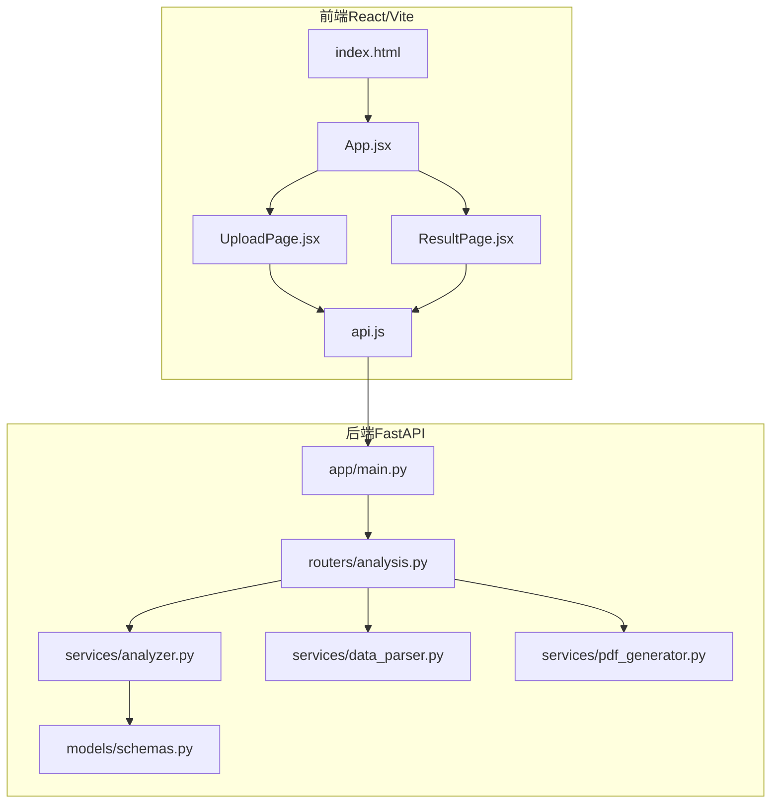
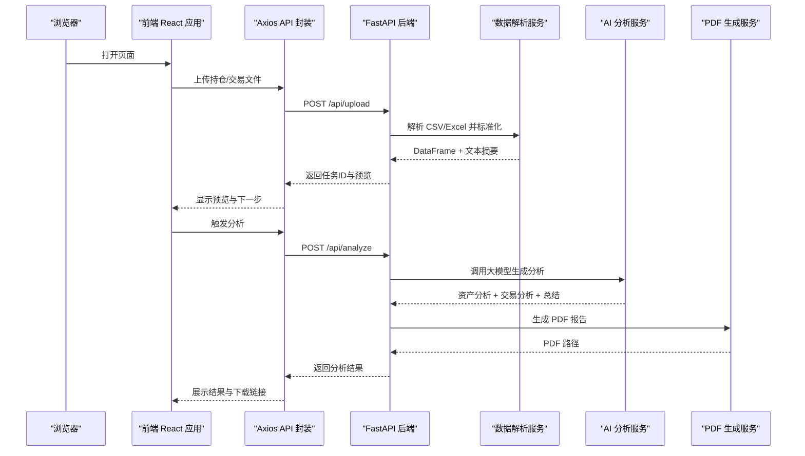
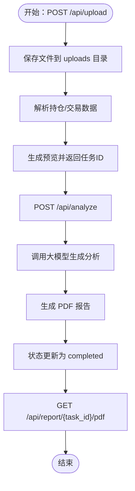
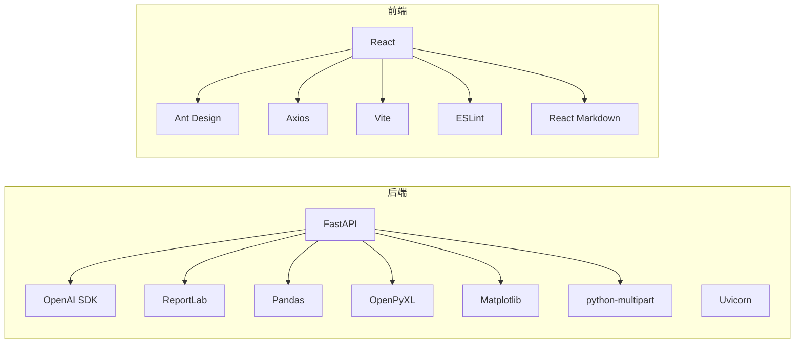

# 快速开始

<cite>
**本文引用的文件**
- [backend/app/main.py](file://backend/app/main.py)
- [backend/requirements.txt](file://backend/requirements.txt)
- [backend/app/routers/analysis.py](file://backend/app/routers/analysis.py)
- [backend/app/services/analyzer.py](file://backend/app/services/analyzer.py)
- [backend/app/services/data_parser.py](file://backend/app/services/data_parser.py)
- [backend/app/services/pdf_generator.py](file://backend/app/services/pdf_generator.py)
- [backend/app/models/schemas.py](file://backend/app/models/schemas.py)
- [backend/app/skills/report_template.md](file://backend/app/skills/report_template.md)
- [frontend/package.json](file://frontend/package.json)
- [frontend/src/services/api.js](file://frontend/src/services/api.js)
- [frontend/src/components/UploadPage.jsx](file://frontend/src/components/UploadPage.jsx)
- [frontend/src/components/ResultPage.jsx](file://frontend/src/components/ResultPage.jsx)
- [frontend/vite.config.js](file://frontend/vite.config.js)
- [frontend/index.html](file://frontend/index.html)
</cite>

## 目录
1. [简介](#简介)
2. [项目结构](#项目结构)
3. [核心组件](#核心组件)
4. [架构总览](#架构总览)
5. [详细组件分析](#详细组件分析)
6. [依赖分析](#依赖分析)
7. [性能考虑](#性能考虑)
8. [故障排除指南](#故障排除指南)
9. [结论](#结论)
10. [附录](#附录)

## 简介
本指南帮助你在30分钟内完成 Qoder-todo 项目的环境搭建与运行。项目包含：
- 后端：基于 FastAPI 的 Python 服务，提供文件上传、AI 分析与 PDF 报告导出能力
- 前端：基于 React + Vite 的单页应用，提供文件上传与分析结果展示界面

你将学会：
- 环境要求与安装
- 后端服务启动与前端构建运行
- 环境变量配置（尤其是 OpenAI API 密钥）
- 从文件上传到生成分析报告的完整流程

## 项目结构
项目采用前后端分离架构，后端以 FastAPI 提供 REST 接口，前端通过 Axios 调用后端接口。

图表来源
- [frontend/index.html:1-14](file://frontend/index.html#L1-L14)
- [frontend/src/components/UploadPage.jsx:1-145](file://frontend/src/components/UploadPage.jsx#L1-L145)
- [frontend/src/components/ResultPage.jsx:1-193](file://frontend/src/components/ResultPage.jsx#L1-L193)
- [frontend/src/services/api.js:1-48](file://frontend/src/services/api.js#L1-L48)
- [backend/app/main.py:1-28](file://backend/app/main.py#L1-L28)
- [backend/app/routers/analysis.py:1-218](file://backend/app/routers/analysis.py#L1-L218)
- [backend/app/services/analyzer.py:1-93](file://backend/app/services/analyzer.py#L1-L93)
- [backend/app/services/data_parser.py:1-96](file://backend/app/services/data_parser.py#L1-L96)
- [backend/app/services/pdf_generator.py:1-215](file://backend/app/services/pdf_generator.py#L1-L215)
- [backend/app/models/schemas.py:1-30](file://backend/app/models/schemas.py#L1-L30)

章节来源
- [backend/app/main.py:1-28](file://backend/app/main.py#L1-L28)
- [frontend/package.json:1-32](file://frontend/package.json#L1-L32)

## 核心组件
- 后端 FastAPI 应用：负责路由注册、静态文件托管、CORS 配置与 Uvicorn 启动
- 分析路由：提供上传、分析、重新生成、PDF 下载与任务状态查询接口
- 数据解析服务：支持 CSV/Excel，标准化列名并计算衍生指标
- AI 分析服务：读取技能模板，调用 OpenAI 大模型生成资产配置、交易行为与综合报告
- PDF 生成服务：将 Markdown 结果渲染为 PDF，自动注册中文字体
- 前端组件：上传页面、结果页面、API 服务封装

章节来源
- [backend/app/routers/analysis.py:1-218](file://backend/app/routers/analysis.py#L1-L218)
- [backend/app/services/data_parser.py:1-96](file://backend/app/services/data_parser.py#L1-L96)
- [backend/app/services/analyzer.py:1-93](file://backend/app/services/analyzer.py#L1-L93)
- [backend/app/services/pdf_generator.py:1-215](file://backend/app/services/pdf_generator.py#L1-L215)
- [frontend/src/components/UploadPage.jsx:1-145](file://frontend/src/components/UploadPage.jsx#L1-L145)
- [frontend/src/components/ResultPage.jsx:1-193](file://frontend/src/components/ResultPage.jsx#L1-L193)
- [frontend/src/services/api.js:1-48](file://frontend/src/services/api.js#L1-L48)

## 架构总览
下图展示了从浏览器到后端服务的请求链路与数据流。

图表来源
- [frontend/src/services/api.js:1-48](file://frontend/src/services/api.js#L1-L48)
- [backend/app/routers/analysis.py:35-135](file://backend/app/routers/analysis.py#L35-L135)
- [backend/app/services/data_parser.py:7-96](file://backend/app/services/data_parser.py#L7-L96)
- [backend/app/services/analyzer.py:77-93](file://backend/app/services/analyzer.py#L77-L93)
- [backend/app/services/pdf_generator.py:146-215](file://backend/app/services/pdf_generator.py#L146-L215)

## 详细组件分析

### 后端 FastAPI 应用
- 负责注册 CORS、静态文件、上传与报告目录创建、路由挂载
- 默认监听 0.0.0.0:8000，支持热重载开发

章节来源
- [backend/app/main.py:1-28](file://backend/app/main.py#L1-L28)

### 分析路由与任务状态
- 上传接口：接收持仓与交易文件，保存至 uploads 目录，返回任务ID与预览
- 分析接口：触发 AI 分析，生成 PDF，更新任务状态为 completed
- 重新生成接口：根据反馈意见再次调用大模型并更新 PDF
- PDF 下载接口：返回生成的 PDF 文件
- 任务状态查询：返回当前状态与结果（若已完成）

图表来源
- [backend/app/routers/analysis.py:35-135](file://backend/app/routers/analysis.py#L35-L135)
- [backend/app/services/analyzer.py:77-93](file://backend/app/services/analyzer.py#L77-L93)
- [backend/app/services/pdf_generator.py:146-215](file://backend/app/services/pdf_generator.py#L146-L215)

章节来源
- [backend/app/routers/analysis.py:1-218](file://backend/app/routers/analysis.py#L1-L218)

### 数据解析服务
- 支持 CSV/Excel，自动识别中文列名并重命名为英文字段
- 自动计算市值、浮动盈亏、盈亏比例等衍生指标
- 将表格转为文本用于大模型分析

章节来源
- [backend/app/services/data_parser.py:1-96](file://backend/app/services/data_parser.py#L1-L96)

### AI 分析服务
- 从 skills 目录加载技能模板（资产分析、交易行为、综合报告模板）
- 通过环境变量配置 OpenAI 客户端（API Key、Base URL、Model）
- 调用大模型生成三类分析内容并汇总

章节来源
- [backend/app/services/analyzer.py:1-93](file://backend/app/services/analyzer.py#L1-L93)
- [backend/app/skills/report_template.md:1-34](file://backend/app/skills/report_template.md#L1-L34)

### PDF 生成服务
- 自动注册中文字体（多平台字体路径尝试）
- 将 Markdown 内容渲染为 PDF，包含封面、分节与免责声明
- 输出文件命名包含任务ID与客户名

章节来源
- [backend/app/services/pdf_generator.py:1-215](file://backend/app/services/pdf_generator.py#L1-L215)

### 前端组件与 API 封装
- UploadPage：拖拽上传持仓/交易文件，显示预览
- ResultPage：触发分析、展示 Markdown 结果、下载 PDF、根据反馈重新生成
- api.js：封装 /api 前缀的请求，设置较长超时以适配分析耗时

章节来源
- [frontend/src/components/UploadPage.jsx:1-145](file://frontend/src/components/UploadPage.jsx#L1-L145)
- [frontend/src/components/ResultPage.jsx:1-193](file://frontend/src/components/ResultPage.jsx#L1-L193)
- [frontend/src/services/api.js:1-48](file://frontend/src/services/api.js#L1-L48)

## 依赖分析
- 后端依赖：FastAPI、Uvicorn、OpenAI SDK、ReportLab、Pandas、OpenPyXL、Matplotlib、python-multipart
- 前端依赖：React、Ant Design、Axios、Vite、ESLint、React Markdown

图表来源
- [backend/requirements.txt:1-9](file://backend/requirements.txt#L1-L9)
- [frontend/package.json:1-32](file://frontend/package.json#L1-L32)

章节来源
- [backend/requirements.txt:1-9](file://backend/requirements.txt#L1-L9)
- [frontend/package.json:1-32](file://frontend/package.json#L1-L32)

## 性能考虑
- 分析接口默认超时较长（约 5 分钟），适合大模型推理与 PDF 生成
- 数据解析阶段会读取并转换 Excel/CSV，建议控制单次文件大小与行数
- PDF 渲染涉及中文字体注册与多段落排版，建议在非 Windows 环境提前准备可用字体

章节来源
- [frontend/src/services/api.js:5-8](file://frontend/src/services/api.js#L5-L8)
- [backend/app/services/pdf_generator.py:22-51](file://backend/app/services/pdf_generator.py#L22-L51)

## 故障排除指南
- 启动后端报端口占用
  - 修改监听地址或停止占用进程
  - 参考：[backend/app/main.py:25-27](file://backend/app/main.py#L25-L27)
- 前端无法访问后端接口
  - 确认后端已启动且未报错
  - 检查前端 API 基础路径是否指向正确主机与端口
  - 参考：[frontend/src/services/api.js](file://frontend/src/services/api.js#L3)
- 上传文件解析失败
  - 确认文件格式为 CSV 或 Excel
  - 确认中文列名与解析映射一致
  - 参考：[backend/app/services/data_parser.py:7-96](file://backend/app/services/data_parser.py#L7-L96)
- PDF 无法生成或乱码
  - 确认系统存在可用中文字体
  - 参考：[backend/app/services/pdf_generator.py:22-51](file://backend/app/services/pdf_generator.py#L22-L51)
- OpenAI 调用失败
  - 设置 OPENAI_API_KEY 环境变量
  - 可选设置 OPENAI_BASE_URL 与 OPENAI_MODEL
  - 参考：[backend/app/services/analyzer.py:18-38](file://backend/app/services/analyzer.py#L18-L38)

章节来源
- [backend/app/main.py:25-27](file://backend/app/main.py#L25-L27)
- [frontend/src/services/api.js](file://frontend/src/services/api.js#L3)
- [backend/app/services/data_parser.py:7-96](file://backend/app/services/data_parser.py#L7-L96)
- [backend/app/services/pdf_generator.py:22-51](file://backend/app/services/pdf_generator.py#L22-L51)
- [backend/app/services/analyzer.py:18-38](file://backend/app/services/analyzer.py#L18-L38)

## 结论
通过本指南，你可以在本地快速搭建并运行 Qoder-todo 项目，完成从文件上传到生成 PDF 报告的全流程体验。建议在生产环境中替换内存任务存储为持久化方案，并完善鉴权与错误监控。

## 附录

### 环境要求
- Python 3.8+
- Node.js（用于前端构建与运行）
- Git（可选，用于克隆仓库）

章节来源
- [backend/requirements.txt:1-9](file://backend/requirements.txt#L1-L9)
- [frontend/package.json:1-32](file://frontend/package.json#L1-L32)

### 安装与部署步骤
1) 克隆仓库（如适用）
2) 安装后端依赖
   - 在后端目录安装依赖
   - 参考：[backend/requirements.txt:1-9](file://backend/requirements.txt#L1-L9)
3) 安装前端依赖
   - 在前端目录安装依赖
   - 参考：[frontend/package.json:1-32](file://frontend/package.json#L1-L32)
4) 配置环境变量
   - 设置 OPENAI_API_KEY（必须）
   - 可选设置 OPENAI_BASE_URL、OPENAI_MODEL
   - 参考：[backend/app/services/analyzer.py:18-29](file://backend/app/services/analyzer.py#L18-L29)
5) 启动后端服务
   - 在后端目录运行主程序
   - 默认监听 0.0.0.0:8000
   - 参考：[backend/app/main.py:25-27](file://backend/app/main.py#L25-L27)
6) 启动前端开发服务器
   - 在前端目录运行开发命令
   - 参考：[frontend/package.json:6-10](file://frontend/package.json#L6-L10)、[frontend/vite.config.js:1-8](file://frontend/vite.config.js#L1-L8)
7) 访问前端页面
   - 默认地址：http://localhost:5173
   - 参考：[frontend/index.html:1-14](file://frontend/index.html#L1-L14)

章节来源
- [backend/requirements.txt:1-9](file://backend/requirements.txt#L1-L9)
- [frontend/package.json:1-32](file://frontend/package.json#L1-L32)
- [frontend/vite.config.js:1-8](file://frontend/vite.config.js#L1-L8)
- [frontend/index.html:1-14](file://frontend/index.html#L1-L14)
- [backend/app/main.py:25-27](file://backend/app/main.py#L25-L27)
- [backend/app/services/analyzer.py:18-29](file://backend/app/services/analyzer.py#L18-L29)

### 基本使用示例
- 在上传页面选择持仓文件（必填），可选上传交易记录文件
  - 参考：[frontend/src/components/UploadPage.jsx:40-58](file://frontend/src/components/UploadPage.jsx#L40-L58)
- 点击“上传并解析文件”，查看预览
  - 参考：[frontend/src/components/UploadPage.jsx:20-38](file://frontend/src/components/UploadPage.jsx#L20-L38)
- 在结果页点击“开始 AI 分析”，等待分析完成
  - 参考：[frontend/src/components/ResultPage.jsx:22-35](file://frontend/src/components/ResultPage.jsx#L22-L35)
- 查看 Markdown 结果，点击“下载 PDF 报告”
  - 参考：[frontend/src/components/ResultPage.jsx:56-58](file://frontend/src/components/ResultPage.jsx#L56-L58)
- 如需调整，输入反馈意见并“根据反馈重新生成”
  - 参考：[frontend/src/components/ResultPage.jsx:37-54](file://frontend/src/components/ResultPage.jsx#L37-L54)

章节来源
- [frontend/src/components/UploadPage.jsx:1-145](file://frontend/src/components/UploadPage.jsx#L1-L145)
- [frontend/src/components/ResultPage.jsx:1-193](file://frontend/src/components/ResultPage.jsx#L1-L193)
- [frontend/src/services/api.js:10-45](file://frontend/src/services/api.js#L10-L45)