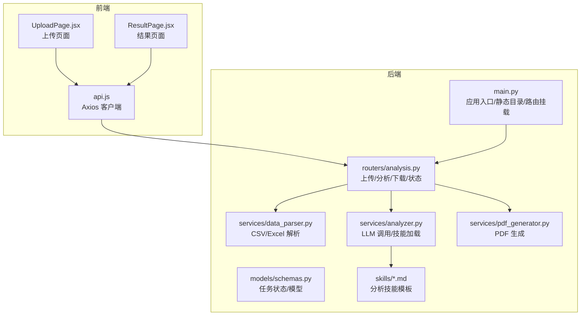
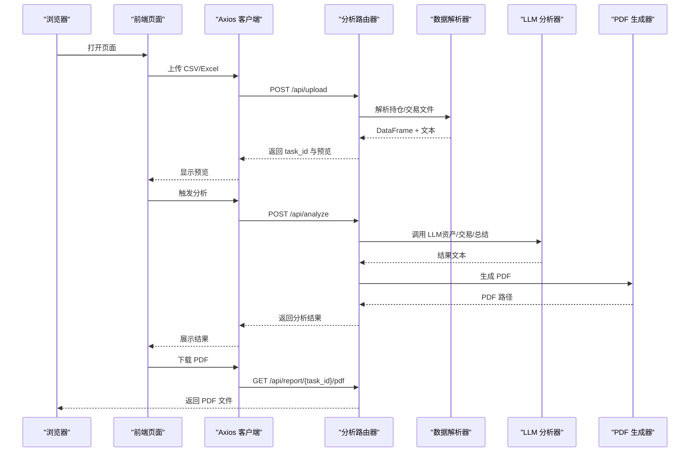
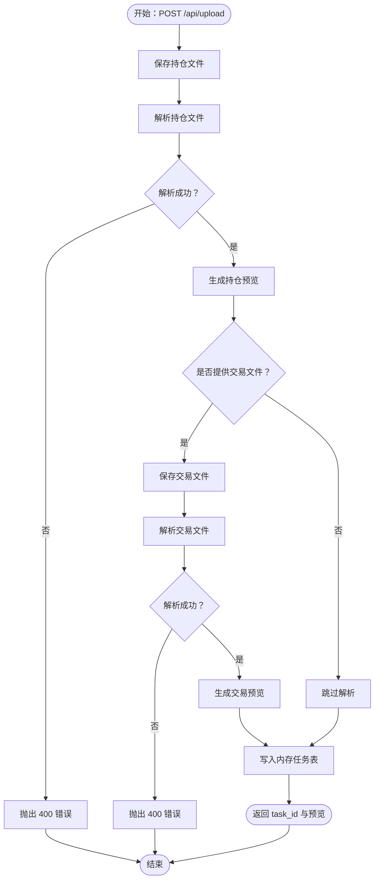
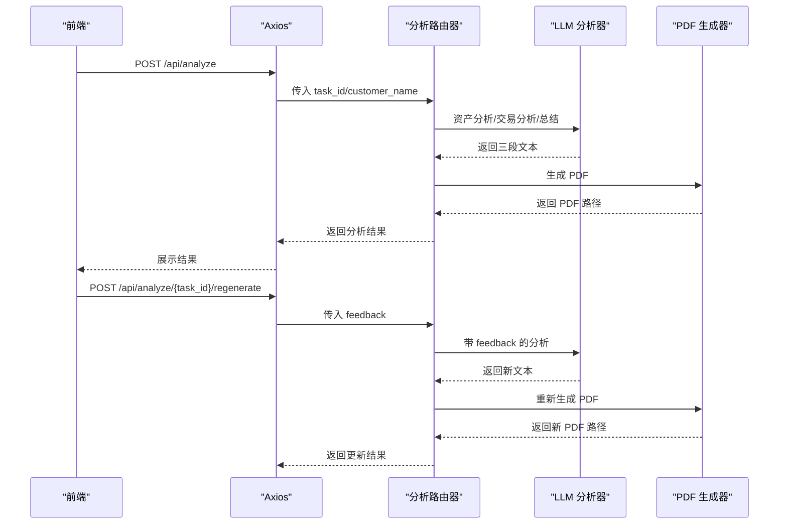
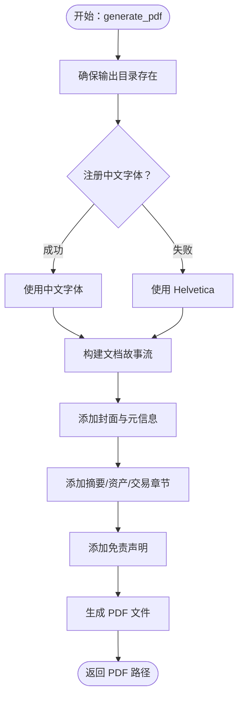
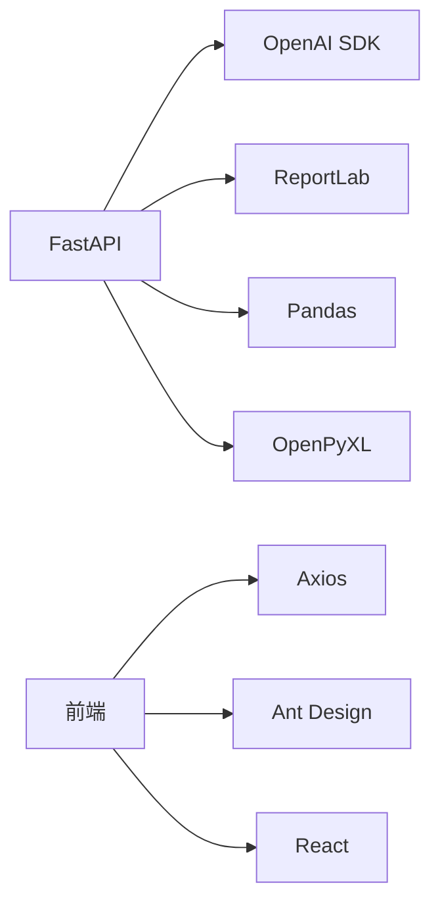

# 故障排除

<cite>
**本文引用的文件**
- [backend/app/main.py](file://backend/app/main.py)
- [backend/app/routers/analysis.py](file://backend/app/routers/analysis.py)
- [backend/app/services/analyzer.py](file://backend/app/services/analyzer.py)
- [backend/app/services/data_parser.py](file://backend/app/services/data_parser.py)
- [backend/app/services/pdf_generator.py](file://backend/app/services/pdf_generator.py)
- [backend/app/models/schemas.py](file://backend/app/models/schemas.py)
- [backend/app/skills/report_template.md](file://backend/app/skills/report_template.md)
- [backend/app/skills/asset_analysis.md](file://backend/app/skills/asset_analysis.md)
- [backend/app/skills/trade_behavior.md](file://backend/app/skills/trade_behavior.md)
- [backend/requirements.txt](file://backend/requirements.txt)
- [frontend/src/services/api.js](file://frontend/src/services/api.js)
- [frontend/src/components/UploadPage.jsx](file://frontend/src/components/UploadPage.jsx)
- [frontend/src/components/ResultPage.jsx](file://frontend/src/components/ResultPage.jsx)
</cite>

## 目录
1. [简介](#简介)
2. [项目结构](#项目结构)
3. [核心组件](#核心组件)
4. [架构总览](#架构总览)
5. [详细组件分析](#详细组件分析)
6. [依赖分析](#依赖分析)
7. [性能考虑](#性能考虑)
8. [故障排除指南](#故障排除指南)
9. [结论](#结论)
10. [附录](#附录)

## 简介
本指南聚焦于 Qoder-todo 项目的生产环境故障排除，覆盖文件上传失败、LLM 分析错误、PDF 生成异常、网络连接问题、API 调用失败、权限配置错误以及性能诊断与优化。文档基于实际源码进行分析，提供日志分析方法、调试技巧、监控指标与告警建议，帮助开发者快速定位并解决问题。

## 项目结构
后端采用 FastAPI + Uvicorn，路由集中在 analysis 路由器，业务逻辑拆分为数据解析、LLM 分析器、PDF 生成器三个服务模块，并通过内存字典维护任务状态。前端使用 Axios 发起请求，Ant Design 组件展示上传、分析与结果页面。

图表来源
- [backend/app/main.py:1-28](file://backend/app/main.py#L1-L28)
- [backend/app/routers/analysis.py:1-218](file://backend/app/routers/analysis.py#L1-L218)
- [backend/app/services/data_parser.py:1-96](file://backend/app/services/data_parser.py#L1-L96)
- [backend/app/services/analyzer.py:1-93](file://backend/app/services/analyzer.py#L1-L93)
- [backend/app/services/pdf_generator.py:1-215](file://backend/app/services/pdf_generator.py#L1-L215)
- [backend/app/models/schemas.py:1-30](file://backend/app/models/schemas.py#L1-L30)
- [backend/app/skills/report_template.md:1-34](file://backend/app/skills/report_template.md#L1-L34)
- [backend/app/skills/asset_analysis.md:1-35](file://backend/app/skills/asset_analysis.md#L1-L35)
- [backend/app/skills/trade_behavior.md:1-34](file://backend/app/skills/trade_behavior.md#L1-L34)
- [frontend/src/services/api.js:1-48](file://frontend/src/services/api.js#L1-L48)
- [frontend/src/components/UploadPage.jsx:1-145](file://frontend/src/components/UploadPage.jsx#L1-L145)
- [frontend/src/components/ResultPage.jsx:1-193](file://frontend/src/components/ResultPage.jsx#L1-L193)

章节来源
- [backend/app/main.py:1-28](file://backend/app/main.py#L1-L28)
- [backend/app/routers/analysis.py:1-218](file://backend/app/routers/analysis.py#L1-L218)
- [frontend/src/services/api.js:1-48](file://frontend/src/services/api.js#L1-L48)

## 核心组件
- 应用入口与静态资源：负责 CORS、上传/报告目录创建、路由挂载。
- 分析路由器：实现上传、分析、重新生成、PDF 下载、任务状态查询。
- 数据解析器：支持 CSV/Excel，标准化列名、计算衍生字段、转文本供 LLM。
- LLM 分析器：加载技能模板，构造 system/user prompt，调用 OpenAI 客户端。
- PDF 生成器：注册中文字体、解析 Markdown、构建 PDF 文档。
- 前端 API 与页面：封装后端接口、上传与分析交互、结果展示与下载。

章节来源
- [backend/app/main.py:1-28](file://backend/app/main.py#L1-L28)
- [backend/app/routers/analysis.py:1-218](file://backend/app/routers/analysis.py#L1-L218)
- [backend/app/services/data_parser.py:1-96](file://backend/app/services/data_parser.py#L1-L96)
- [backend/app/services/analyzer.py:1-93](file://backend/app/services/analyzer.py#L1-L93)
- [backend/app/services/pdf_generator.py:1-215](file://backend/app/services/pdf_generator.py#L1-L215)
- [frontend/src/services/api.js:1-48](file://frontend/src/services/api.js#L1-L48)
- [frontend/src/components/UploadPage.jsx:1-145](file://frontend/src/components/UploadPage.jsx#L1-L145)
- [frontend/src/components/ResultPage.jsx:1-193](file://frontend/src/components/ResultPage.jsx#L1-L193)

## 架构总览
下图展示了从浏览器到后端服务的典型调用链路，包括上传、分析、PDF 生成与下载。

图表来源
- [backend/app/routers/analysis.py:35-152](file://backend/app/routers/analysis.py#L35-L152)
- [backend/app/services/data_parser.py:7-95](file://backend/app/services/data_parser.py#L7-L95)
- [backend/app/services/analyzer.py:41-92](file://backend/app/services/analyzer.py#L41-L92)
- [backend/app/services/pdf_generator.py:146-214](file://backend/app/services/pdf_generator.py#L146-L214)
- [frontend/src/services/api.js:10-45](file://frontend/src/services/api.js#L10-L45)

## 详细组件分析

### 上传与预览流程
- 上传接口接收持仓文件（必填），交易文件（可选），并生成 task_id。
- 上传后立即解析文件并返回前 10 条记录用于预览。
- 若解析失败，抛出 400 错误并提示失败原因。

图表来源
- [backend/app/routers/analysis.py:35-83](file://backend/app/routers/analysis.py#L35-L83)
- [backend/app/services/data_parser.py:7-95](file://backend/app/services/data_parser.py#L7-L95)

章节来源
- [backend/app/routers/analysis.py:35-83](file://backend/app/routers/analysis.py#L35-L83)
- [backend/app/services/data_parser.py:7-95](file://backend/app/services/data_parser.py#L7-L95)

### 分析与重生成流程
- 触发分析时，从内存任务表读取文本，调用 LLM 生成资产分析、交易行为分析与总结。
- 成功后生成 PDF 并记录路径，失败则标记失败状态并打印堆栈。
- 支持根据反馈重新生成，复用相同流程。

图表来源
- [backend/app/routers/analysis.py:86-199](file://backend/app/routers/analysis.py#L86-L199)
- [backend/app/services/analyzer.py:41-92](file://backend/app/services/analyzer.py#L41-L92)
- [backend/app/services/pdf_generator.py:146-214](file://backend/app/services/pdf_generator.py#L146-L214)

章节来源
- [backend/app/routers/analysis.py:86-199](file://backend/app/routers/analysis.py#L86-L199)
- [backend/app/services/analyzer.py:41-92](file://backend/app/services/analyzer.py#L41-L92)
- [backend/app/services/pdf_generator.py:146-214](file://backend/app/services/pdf_generator.py#L146-L214)

### PDF 生成与字体注册
- 生成 PDF 前尝试注册中文字体，若失败则回退至 Helvetica。
- 将 Markdown 文本转换为 ReportLab Flowable，构建封面、摘要、资产分析、交易分析与免责声明。

图表来源
- [backend/app/services/pdf_generator.py:26-51](file://backend/app/services/pdf_generator.py#L26-L51)
- [backend/app/services/pdf_generator.py:146-214](file://backend/app/services/pdf_generator.py#L146-L214)

章节来源
- [backend/app/services/pdf_generator.py:26-51](file://backend/app/services/pdf_generator.py#L26-L51)
- [backend/app/services/pdf_generator.py:146-214](file://backend/app/services/pdf_generator.py#L146-L214)

## 依赖分析
- 后端依赖：FastAPI、Uvicorn、OpenAI SDK、ReportLab、Pandas、OpenPyXL、Matplotlib。
- 前端依赖：Axios、Ant Design、React、React Markdown。
- 关键外部集成：OpenAI Chat Completions；本地文件系统（上传/报告目录）。

图表来源
- [backend/requirements.txt:1-9](file://backend/requirements.txt#L1-L9)
- [frontend/src/services/api.js:1-8](file://frontend/src/services/api.js#L1-L8)

章节来源
- [backend/requirements.txt:1-9](file://backend/requirements.txt#L1-L9)
- [frontend/src/services/api.js:1-8](file://frontend/src/services/api.js#L1-L8)

## 性能考虑
- 上传/分析耗时较长：前端 Axios 超时设为 5 分钟，适配 LLM 分析。
- 内存任务表：生产环境应替换为持久化存储（数据库/Redis）。
- 字体注册：首次注册可能较慢，建议预热或缓存注册结果。
- 文件解析：CSV/Excel 处理与文本拼接可能占用 CPU，建议分块或异步化。
- PDF 生成：复杂 Markdown 渲染与字体回退会影响性能，建议缓存常用模板。

章节来源
- [frontend/src/services/api.js:7](file://frontend/src/services/api.js#L7)
- [backend/app/routers/analysis.py:16-17](file://backend/app/routers/analysis.py#L16-L17)
- [backend/app/services/pdf_generator.py:26-51](file://backend/app/services/pdf_generator.py#L26-L51)

## 故障排除指南

### 一、文件上传失败
常见症状
- 上传后无预览或报错。
- 前端弹出“上传失败”。

排查步骤
1. 检查上传文件格式与大小
   - 后端仅接受 CSV/Excel，且限制单文件。
   - 前端上传组件已设置 accept 与 maxCount。
2. 查看后端解析日志
   - 解析失败会抛出 400 错误，检查异常详情。
3. 确认上传目录权限
   - 上传/报告目录需可写，确保进程有权限创建文件。
4. 核对字段映射
   - 解析器会尝试匹配中文列名并重命名为英文列，确认数据列是否符合预期。

定位参考
- [backend/app/routers/analysis.py:35-83](file://backend/app/routers/analysis.py#L35-L83)
- [backend/app/services/data_parser.py:7-95](file://backend/app/services/data_parser.py#L7-L95)
- [frontend/src/components/UploadPage.jsx:40-58](file://frontend/src/components/UploadPage.jsx#L40-L58)

章节来源
- [backend/app/routers/analysis.py:35-83](file://backend/app/routers/analysis.py#L35-L83)
- [backend/app/services/data_parser.py:7-95](file://backend/app/services/data_parser.py#L7-L95)
- [frontend/src/components/UploadPage.jsx:40-58](file://frontend/src/components/UploadPage.jsx#L40-L58)

### 二、LLM 分析错误
常见症状
- 分析接口返回 500，前端提示“分析失败”。
- 控制台打印堆栈信息。

排查步骤
1. 检查环境变量
   - OPENAI_API_KEY 是否正确设置。
   - OPENAI_BASE_URL 是否指向可用网关。
   - OPENAI_MODEL 是否存在且可用。
2. 网络连通性
   - 服务器能否访问 OpenAI 或代理地址。
   - 防火墙/代理策略是否允许出站访问。
3. 请求参数与提示词
   - 确认传入的 holdings_text/trades_text 不为空。
   - 检查技能模板是否存在且可读。
4. 重试与降级
   - 对外暴露指数/告警，必要时增加重试与熔断。

定位参考
- [backend/app/services/analyzer.py:18-38](file://backend/app/services/analyzer.py#L18-L38)
- [backend/app/services/analyzer.py:41-92](file://backend/app/services/analyzer.py#L41-L92)
- [backend/app/skills/report_template.md:1-34](file://backend/app/skills/report_template.md#L1-L34)
- [backend/app/skills/asset_analysis.md:1-35](file://backend/app/skills/asset_analysis.md#L1-L35)
- [backend/app/skills/trade_behavior.md:1-34](file://backend/app/skills/trade_behavior.md#L1-L34)

章节来源
- [backend/app/services/analyzer.py:18-38](file://backend/app/services/analyzer.py#L18-L38)
- [backend/app/services/analyzer.py:41-92](file://backend/app/services/analyzer.py#L41-L92)
- [backend/app/skills/report_template.md:1-34](file://backend/app/skills/report_template.md#L1-L34)
- [backend/app/skills/asset_analysis.md:1-35](file://backend/app/skills/asset_analysis.md#L1-L35)
- [backend/app/skills/trade_behavior.md:1-34](file://backend/app/skills/trade_behavior.md#L1-L34)

### 三、PDF 生成异常
常见症状
- 下载 PDF 时报“报告尚未生成”。
- 生成 PDF 时出现字体相关错误或中文乱码。

排查步骤
1. 确认分析已完成
   - 任务状态必须为 completed，且存在 pdf_path。
2. 检查字体注册
   - Windows/Linux/macOS 字体路径不同，若均未找到，将回退 Helvetica。
3. 检查输出目录权限
   - reports 目录需可写，确保进程可创建 PDF 文件。
4. 日志与错误
   - 生成器内部异常会中断构建，检查后端异常堆栈。

定位参考
- [backend/app/routers/analysis.py:137-152](file://backend/app/routers/analysis.py#L137-L152)
- [backend/app/services/pdf_generator.py:26-51](file://backend/app/services/pdf_generator.py#L26-L51)
- [backend/app/services/pdf_generator.py:146-214](file://backend/app/services/pdf_generator.py#L146-L214)

章节来源
- [backend/app/routers/analysis.py:137-152](file://backend/app/routers/analysis.py#L137-L152)
- [backend/app/services/pdf_generator.py:26-51](file://backend/app/services/pdf_generator.py#L26-L51)
- [backend/app/services/pdf_generator.py:146-214](file://backend/app/services/pdf_generator.py#L146-L214)

### 四、网络连接问题
常见症状
- 分析接口超时或连接被拒。
- 前端长时间等待。

排查步骤
1. 服务器可达性
   - 从后端服务器 ping/trace 路由到 OpenAI 或代理地址。
2. 端口与防火墙
   - 确保出站 TCP 443 可用。
3. 代理与证书
   - 若使用代理，确认代理配置与证书有效。
4. 超时设置
   - 前端 Axios 超时为 5 分钟，后端 LLM 调用默认超时由 SDK 控制，必要时调整。

定位参考
- [frontend/src/services/api.js:7](file://frontend/src/services/api.js#L7)
- [backend/app/services/analyzer.py:28-38](file://backend/app/services/analyzer.py#L28-L38)

章节来源
- [frontend/src/services/api.js:7](file://frontend/src/services/api.js#L7)
- [backend/app/services/analyzer.py:28-38](file://backend/app/services/analyzer.py#L28-L38)

### 五、API 调用失败
常见症状
- 404：任务不存在。
- 400：上传解析失败。
- 500：分析/生成异常。

排查步骤
1. 校验 task_id
   - 确保前端传递的 task_id 与后端一致。
2. 检查路由前缀
   - 前端 baseURL 为 http://localhost:8000/api，确保后端已 include_router(prefix="/api")。
3. 查看响应体
   - detail 字段包含具体错误信息，结合后端异常捕获定位。

定位参考
- [backend/app/routers/analysis.py:89-91](file://backend/app/routers/analysis.py#L89-L91)
- [backend/app/routers/analysis.py:54-64](file://backend/app/routers/analysis.py#L54-L64)
- [backend/app/routers/analysis.py:130-134](file://backend/app/routers/analysis.py#L130-L134)
- [frontend/src/services/api.js:3](file://frontend/src/services/api.js#L3)
- [backend/app/main.py:23](file://backend/app/main.py#L23)

章节来源
- [backend/app/routers/analysis.py:89-91](file://backend/app/routers/analysis.py#L89-L91)
- [backend/app/routers/analysis.py:54-64](file://backend/app/routers/analysis.py#L54-L64)
- [backend/app/routers/analysis.py:130-134](file://backend/app/routers/analysis.py#L130-L134)
- [frontend/src/services/api.js:3](file://frontend/src/services/api.js#L3)
- [backend/app/main.py:23](file://backend/app/main.py#L23)

### 六、权限配置错误
常见症状
- 上传/生成目录无权限。
- 字体注册失败导致中文乱码。

排查步骤
1. 上传/报告目录
   - 确认 uploads 与 reports 目录存在且进程用户可写。
2. 字体文件
   - 确认目标字体路径存在且可读；若不存在，将回退 Helvetica。
3. 环境变量
   - OPENAI_API_KEY 必须设置，否则 LLM 调用会失败。

定位参考
- [backend/app/main.py:18-21](file://backend/app/main.py#L18-L21)
- [backend/app/routers/analysis.py:19-22](file://backend/app/routers/analysis.py#L19-L22)
- [backend/app/services/pdf_generator.py:31-50](file://backend/app/services/pdf_generator.py#L31-L50)
- [backend/app/services/analyzer.py:20-22](file://backend/app/services/analyzer.py#L20-L22)

章节来源
- [backend/app/main.py:18-21](file://backend/app/main.py#L18-L21)
- [backend/app/routers/analysis.py:19-22](file://backend/app/routers/analysis.py#L19-L22)
- [backend/app/services/pdf_generator.py:31-50](file://backend/app/services/pdf_generator.py#L31-L50)
- [backend/app/services/analyzer.py:20-22](file://backend/app/services/analyzer.py#L20-L22)

### 七、日志分析与调试技巧
- 后端异常堆栈
  - 分析阶段捕获异常并打印堆栈，结合 detail 字段定位。
- 前端错误提示
  - 优先读取响应体中的 detail，其次使用 message。
- 关键日志点
  - 上传保存、解析成功/失败、LLM 调用、PDF 生成、下载响应。
- 调试建议
  - 在开发环境开启 reload，生产环境使用进程管理器与日志聚合。
  - 对外暴露健康检查端点与指标端点，便于监控。

章节来源
- [backend/app/routers/analysis.py:54-64](file://backend/app/routers/analysis.py#L54-L64)
- [backend/app/routers/analysis.py:130-134](file://backend/app/routers/analysis.py#L130-L134)
- [frontend/src/components/UploadPage.jsx:32-38](file://frontend/src/components/UploadPage.jsx#L32-L38)
- [frontend/src/components/ResultPage.jsx:29-35](file://frontend/src/components/ResultPage.jsx#L29-L35)

### 八、性能诊断与优化
- 诊断手段
  - 监控分析接口耗时、并发请求数、CPU/内存占用。
  - 记录 LLM 调用耗时与成功率。
- 优化建议
  - 将内存任务表替换为 Redis/数据库，支持横向扩展。
  - 异步化分析流程，使用消息队列解耦。
  - 缓存常用技能模板与字体注册结果。
  - 前端轮询改为长轮询或 WebSocket 推送。

章节来源
- [backend/app/routers/analysis.py:16-17](file://backend/app/routers/analysis.py#L16-L17)
- [frontend/src/services/api.js:7](file://frontend/src/services/api.js#L7)
- [backend/app/services/pdf_generator.py:26-51](file://backend/app/services/pdf_generator.py#L26-L51)

### 九、系统监控指标与告警建议
- 指标建议
  - 请求量与错误率（4xx/5xx）、P95/P99 响应时间、并发数。
  - LLM 调用次数、成功率、平均耗时、超时次数。
  - PDF 生成耗时、失败次数、磁盘空间使用率。
  - 任务状态分布（pending/analyzing/completed/failed）。
- 告警建议
  - 错误率超过阈值、响应时间持续升高、LLM 调用失败率上升、磁盘空间不足。
- 工具建议
  - Prometheus/Grafana 或云监控平台采集指标，配置钉钉/邮件告警。

章节来源
- [backend/app/routers/analysis.py:202-217](file://backend/app/routers/analysis.py#L202-L217)
- [backend/app/services/analyzer.py:28-38](file://backend/app/services/analyzer.py#L28-L38)
- [backend/app/services/pdf_generator.py:146-214](file://backend/app/services/pdf_generator.py#L146-L214)

## 结论
本指南围绕上传、分析、PDF 生成三大关键路径，提供了从日志分析到性能优化的完整排障思路。建议在生产环境中替换内存任务表、引入异步与缓存、完善监控与告警体系，以提升稳定性与可维护性。

## 附录
- 任务状态枚举与模型
  - 任务状态：pending、analyzing、completed、failed。
  - 请求与结果模型定义清晰，便于前后端契约约束。

章节来源
- [backend/app/models/schemas.py:6-30](file://backend/app/models/schemas.py#L6-L30)