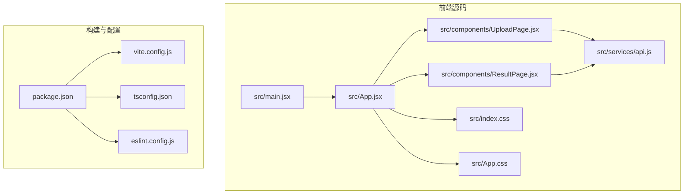
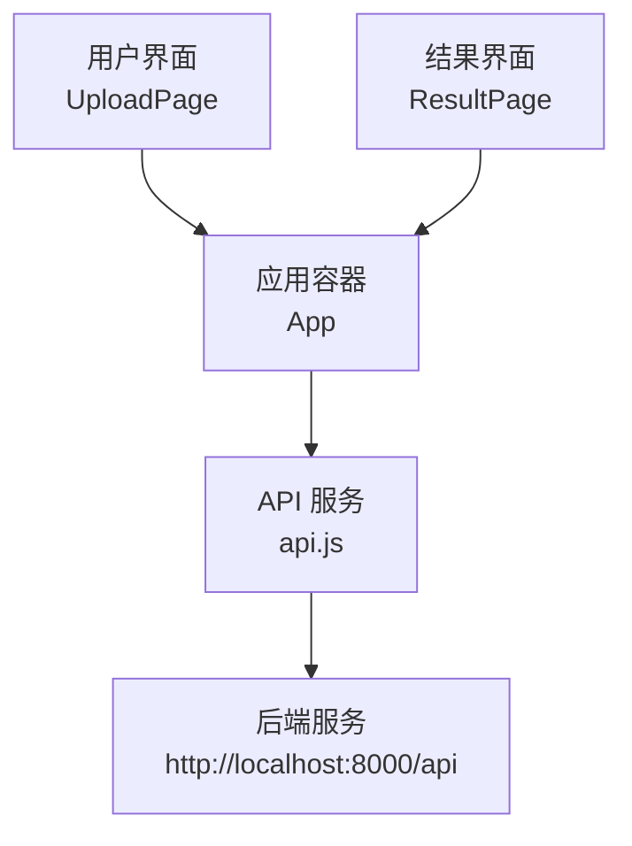
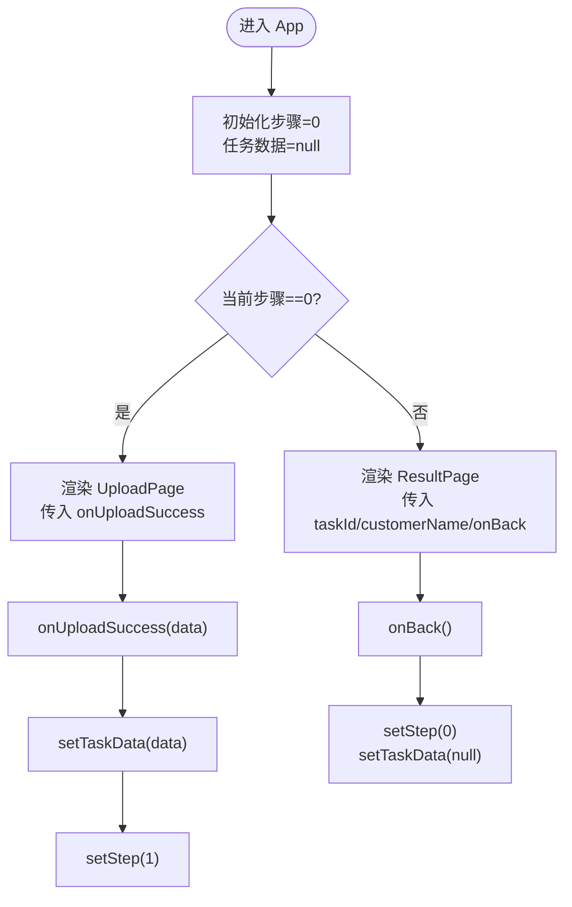
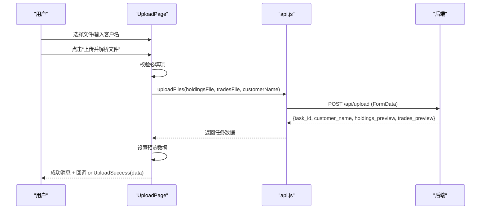
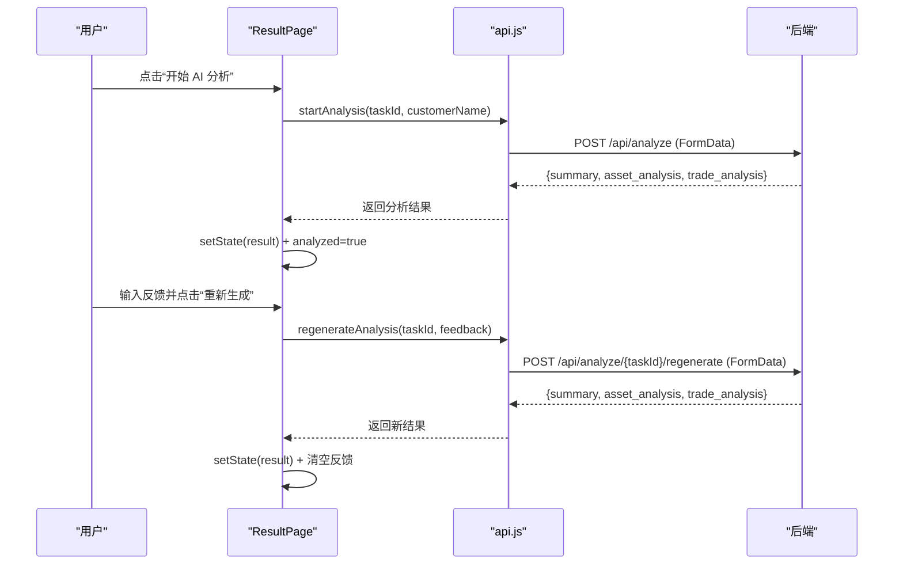
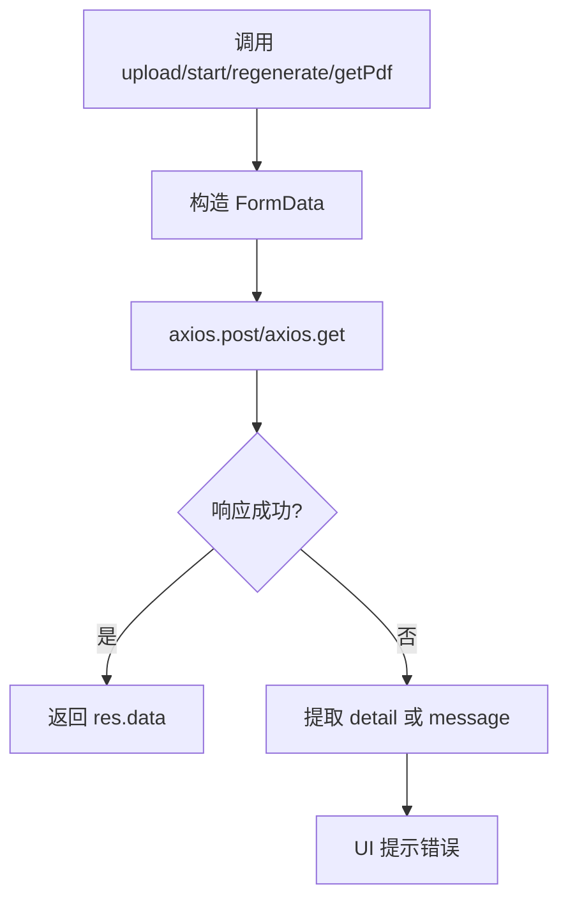
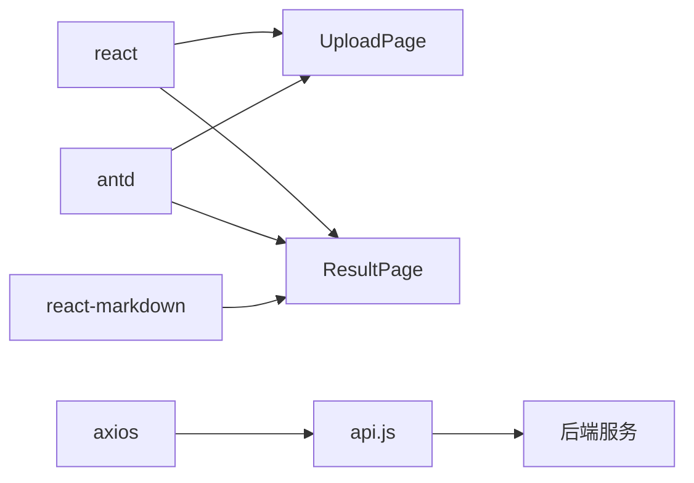

# 前端架构

<cite>
**本文档引用的文件**
- [frontend/src/main.jsx](file://frontend/src/main.jsx)
- [frontend/src/App.jsx](file://frontend/src/App.jsx)
- [frontend/src/components/UploadPage.jsx](file://frontend/src/components/UploadPage.jsx)
- [frontend/src/components/ResultPage.jsx](file://frontend/src/components/ResultPage.jsx)
- [frontend/src/services/api.js](file://frontend/src/services/api.js)
- [frontend/package.json](file://frontend/package.json)
- [frontend/vite.config.js](file://frontend/vite.config.js)
- [frontend/src/index.css](file://frontend/src/index.css)
- [frontend/src/App.css](file://frontend/src/App.css)
- [frontend/eslint.config.js](file://frontend/eslint.config.js)
- [frontend/tsconfig.json](file://frontend/tsconfig.json)
- [frontend/README.md](file://frontend/README.md)
</cite>

## 目录
1. [简介](#简介)
2. [项目结构](#项目结构)
3. [核心组件](#核心组件)
4. [架构总览](#架构总览)
5. [详细组件分析](#详细组件分析)
6. [依赖关系分析](#依赖关系分析)
7. [性能考虑](#性能考虑)
8. [故障排查指南](#故障排查指南)
9. [结论](#结论)
10. [附录](#附录)

## 简介
本项目是一个基于 React 的前端应用，采用 Vite 构建工具，结合 Ant Design UI 组件库与 Axios 进行 HTTP 请求封装，实现“客户资产分析工具”的前后端协作流程。应用通过两个核心页面完成从文件上传到分析结果展示的完整闭环：上传页面负责接收 CSV/Excel 文件与客户信息，并预览数据；结果页面负责触发 AI 分析、展示 Markdown 结构化报告、支持下载 PDF 报告以及基于反馈重新生成分析内容。

## 项目结构
前端采用以功能域划分的目录组织方式：
- src：源代码根目录
  - components：页面级组件（UploadPage、ResultPage）
  - services：API 服务封装（api.js）
  - 样式文件：index.css、App.css
  - 应用入口：main.jsx、App.jsx
- 配置文件：package.json、vite.config.js、tsconfig.json、eslint.config.js
- 构建产物：dist（由 Vite 生成）

图表来源
- [frontend/src/main.jsx:1-11](file://frontend/src/main.jsx#L1-L11)
- [frontend/src/App.jsx:1-81](file://frontend/src/App.jsx#L1-L81)
- [frontend/src/components/UploadPage.jsx:1-145](file://frontend/src/components/UploadPage.jsx#L1-L145)
- [frontend/src/components/ResultPage.jsx:1-193](file://frontend/src/components/ResultPage.jsx#L1-L193)
- [frontend/src/services/api.js:1-48](file://frontend/src/services/api.js#L1-L48)
- [frontend/package.json:1-32](file://frontend/package.json#L1-L32)
- [frontend/vite.config.js:1-8](file://frontend/vite.config.js#L1-L8)
- [frontend/tsconfig.json:1-24](file://frontend/tsconfig.json#L1-L24)
- [frontend/eslint.config.js:1-30](file://frontend/eslint.config.js#L1-L30)

章节来源
- [frontend/src/main.jsx:1-11](file://frontend/src/main.jsx#L1-L11)
- [frontend/src/App.jsx:1-81](file://frontend/src/App.jsx#L1-L81)
- [frontend/package.json:1-32](file://frontend/package.json#L1-L32)
- [frontend/vite.config.js:1-8](file://frontend/vite.config.js#L1-L8)

## 核心组件
- 应用根组件 App：负责全局布局、步骤导航、页面切换与状态管理（当前步骤、任务数据），并向下传递回调与数据。
- 上传页面 UploadPage：负责客户信息输入、文件拖拽上传、数据预览、上传成功回调。
- 结果页面 ResultPage：负责触发分析、展示 Markdown 报告、PDF 下载、反馈重新生成。
- API 服务封装：统一管理后端接口、请求参数构造（FormData）、错误处理与响应格式化。

章节来源
- [frontend/src/App.jsx:11-81](file://frontend/src/App.jsx#L11-L81)
- [frontend/src/components/UploadPage.jsx:13-145](file://frontend/src/components/UploadPage.jsx#L13-L145)
- [frontend/src/components/ResultPage.jsx:15-193](file://frontend/src/components/ResultPage.jsx#L15-L193)
- [frontend/src/services/api.js:1-48](file://frontend/src/services/api.js#L1-L48)

## 架构总览
应用采用组件化开发模式，通过状态提升与回调函数实现父子组件通信。整体数据流如下：
- 用户在上传页面选择文件并提交，调用 API 上传接口，成功后回调通知 App 切换到结果页面并传递任务数据。
- 在结果页面，用户可触发分析、查看报告、下载 PDF 或基于反馈重新生成。

图表来源
- [frontend/src/App.jsx:11-81](file://frontend/src/App.jsx#L11-L81)
- [frontend/src/components/UploadPage.jsx:13-38](file://frontend/src/components/UploadPage.jsx#L13-L38)
- [frontend/src/components/ResultPage.jsx:15-54](file://frontend/src/components/ResultPage.jsx#L15-L54)
- [frontend/src/services/api.js:1-48](file://frontend/src/services/api.js#L1-L48)

## 详细组件分析

### 应用容器 App
职责与交互
- 维护当前步骤（上传/分析）与任务数据状态。
- 提供步骤导航（Ant Design Steps）与页面切换逻辑。
- 向上传页面传递上传成功回调，向结果页面传递任务标识与客户名称，并提供返回上一步的回调。

状态管理策略
- 使用 useState 管理步骤与任务数据，避免引入外部状态管理库，适合小型应用的轻量状态需求。
- 通过 props 向子组件传递状态与回调，保持单向数据流。

图表来源
- [frontend/src/App.jsx:11-81](file://frontend/src/App.jsx#L11-L81)

章节来源
- [frontend/src/App.jsx:11-81](file://frontend/src/App.jsx#L11-L81)

### 上传页面 UploadPage
职责与交互
- 接收客户名称输入。
- 支持拖拽上传持仓数据（必填）与交易记录（选填）。
- 上传成功后展示数据预览（表格形式）。
- 调用 API 上传文件，捕获错误并提示。

数据与事件处理
- 使用本地状态维护文件对象、客户名称、加载状态与预览数据。
- 通过 beforeUpload 回调设置文件对象，阻止自动上传，统一在提交时构造 FormData 并发送请求。
- 预览列动态生成，基于首行字段名映射。

图表来源
- [frontend/src/components/UploadPage.jsx:13-38](file://frontend/src/components/UploadPage.jsx#L13-L38)
- [frontend/src/services/api.js:10-19](file://frontend/src/services/api.js#L10-L19)

章节来源
- [frontend/src/components/UploadPage.jsx:13-145](file://frontend/src/components/UploadPage.jsx#L13-L145)
- [frontend/src/services/api.js:10-19](file://frontend/src/services/api.js#L10-L19)

### 结果页面 ResultPage
职责与交互
- 在未分析状态下提供“开始 AI 分析”入口。
- 分析过程中显示加载指示与提示文案。
- 展示 Markdown 结构化报告（总结、资产配置、交易行为）。
- 支持下载 PDF 报告与基于反馈重新生成。

状态与流程控制
- 使用多个状态位控制加载、分析完成、重新生成等流程。
- 通过 Collapse 展示不同维度的报告内容，使用 ReactMarkdown 渲染。
- 反馈为空时禁用重新生成按钮，防止无效请求。

图表来源
- [frontend/src/components/ResultPage.jsx:15-54](file://frontend/src/components/ResultPage.jsx#L15-L54)
- [frontend/src/services/api.js:21-36](file://frontend/src/services/api.js#L21-L36)

章节来源
- [frontend/src/components/ResultPage.jsx:15-193](file://frontend/src/components/ResultPage.jsx#L15-L193)
- [frontend/src/services/api.js:21-36](file://frontend/src/services/api.js#L21-L36)

### API 服务封装
设计模式与实现要点
- 基于 Axios 创建实例，统一设置基础路径与超时时间，适配长时间分析任务。
- 所有接口均使用 FormData 传输文件与表单数据，确保后端解析一致性。
- 错误处理：捕获异常并从响应体提取 detail 或使用通用 message，保证用户可读性。
- 响应数据格式化：直接返回 res.data，简化调用方处理。

图表来源
- [frontend/src/services/api.js:1-48](file://frontend/src/services/api.js#L1-L48)

章节来源
- [frontend/src/services/api.js:1-48](file://frontend/src/services/api.js#L1-L48)

## 依赖关系分析
- 组件依赖：UploadPage 与 ResultPage 均依赖 API 服务；App 作为父容器协调两者。
- 第三方库：React、Ant Design、Axios、React Markdown。
- 构建与开发：Vite 提供快速开发与热更新；ESLint 规范代码风格；TypeScript 提供类型检查。

图表来源
- [frontend/src/components/UploadPage.jsx:1-145](file://frontend/src/components/UploadPage.jsx#L1-L145)
- [frontend/src/components/ResultPage.jsx:1-193](file://frontend/src/components/ResultPage.jsx#L1-L193)
- [frontend/src/services/api.js:1-48](file://frontend/src/services/api.js#L1-L48)
- [frontend/package.json:12-19](file://frontend/package.json#L12-L19)

章节来源
- [frontend/package.json:12-19](file://frontend/package.json#L12-L19)

## 性能考虑
- 文件上传：使用 FormData 与浏览器原生上传能力，避免一次性加载大文件至内存；建议后端限制文件大小与类型，前端配合校验。
- 渲染优化：结果页面的 Markdown 内容按需渲染，折叠面板默认展开一个面板，减少初始渲染压力。
- 网络请求：Axios 超时设置为 5 分钟，满足长耗时分析场景；建议在 UI 中增加进度提示与取消请求的能力。
- 构建优化：Vite 默认启用 React 插件，开发体验良好；生产构建可通过 Rollup 插件链进一步压缩与拆分。

## 故障排查指南
常见问题与定位方法
- 上传失败：检查网络连接与后端地址是否可达；确认文件格式与大小符合要求；查看错误消息中的 detail 字段。
- 分析无响应：确认后端服务已启动且任务 ID 有效；观察 UI 是否显示加载状态；检查超时设置与网络状况。
- PDF 下载空白：确认 taskId 有效且后端存在对应报告；尝试直接访问下载链接验证权限与路径。
- UI 无变化：确认回调 onUploadSuccess 与 onBack 已正确传递；检查 App 状态更新逻辑。

章节来源
- [frontend/src/components/UploadPage.jsx:20-38](file://frontend/src/components/UploadPage.jsx#L20-L38)
- [frontend/src/components/ResultPage.jsx:22-54](file://frontend/src/components/ResultPage.jsx#L22-L54)
- [frontend/src/services/api.js:10-45](file://frontend/src/services/api.js#L10-L45)

## 结论
该前端应用采用清晰的组件化架构与简洁的状态管理模式，结合 Axios 的统一 API 封装与 Ant Design 的丰富 UI 组件，实现了从文件上传到分析报告展示的完整业务闭环。通过合理的错误处理与用户体验设计，提升了系统的可用性与可维护性。后续可在路由、国际化、状态管理扩展等方面继续演进。

## 附录

### 前端构建与开发环境设置
- 依赖安装：使用包管理器安装依赖（包含 React、Ant Design、Axios、Vite、ESLint、TypeScript）。
- 开发命令：运行开发服务器，支持热更新与快速调试。
- 生产构建：打包输出至 dist 目录，静态资源由 Vite 处理。
- 类型检查：TypeScript 配置启用严格模式与未使用变量/参数检测。
- 代码规范：ESLint 配置推荐规则，结合 React Hooks 与 React Refresh 插件。

章节来源
- [frontend/package.json:6-11](file://frontend/package.json#L6-L11)
- [frontend/vite.config.js:1-8](file://frontend/vite.config.js#L1-L8)
- [frontend/tsconfig.json:1-24](file://frontend/tsconfig.json#L1-L24)
- [frontend/eslint.config.js:1-30](file://frontend/eslint.config.js#L1-L30)
- [frontend/README.md:1-17](file://frontend/README.md#L1-L17)