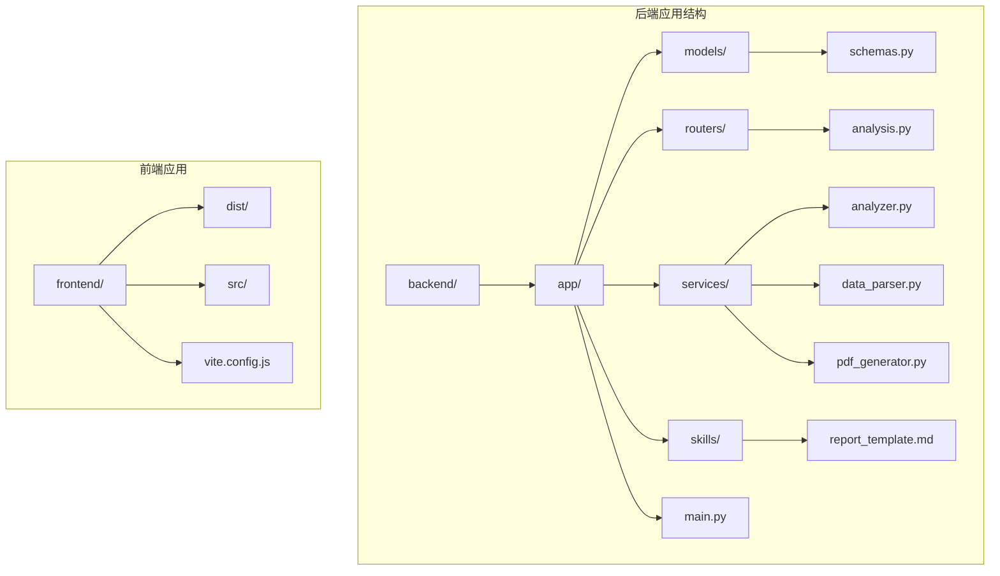
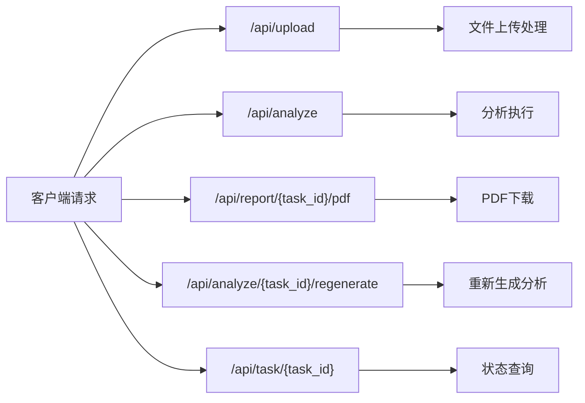
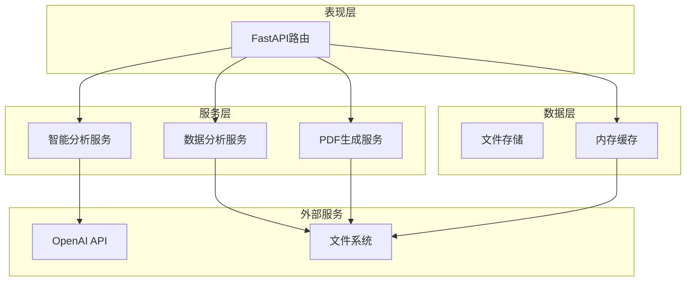
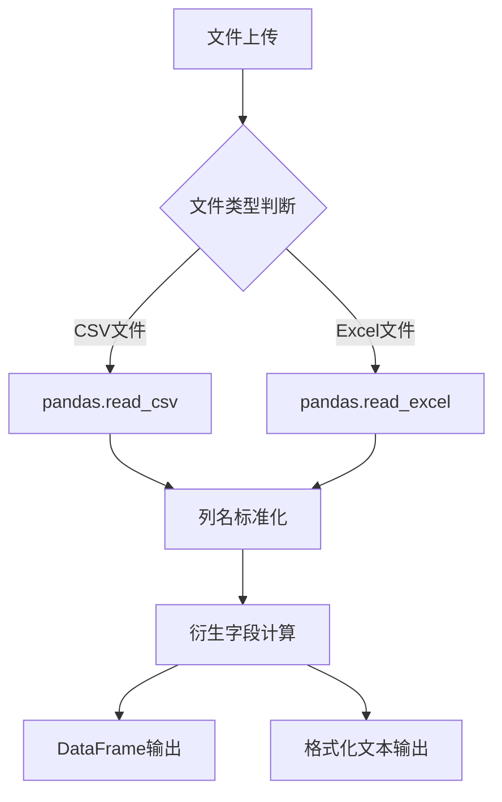
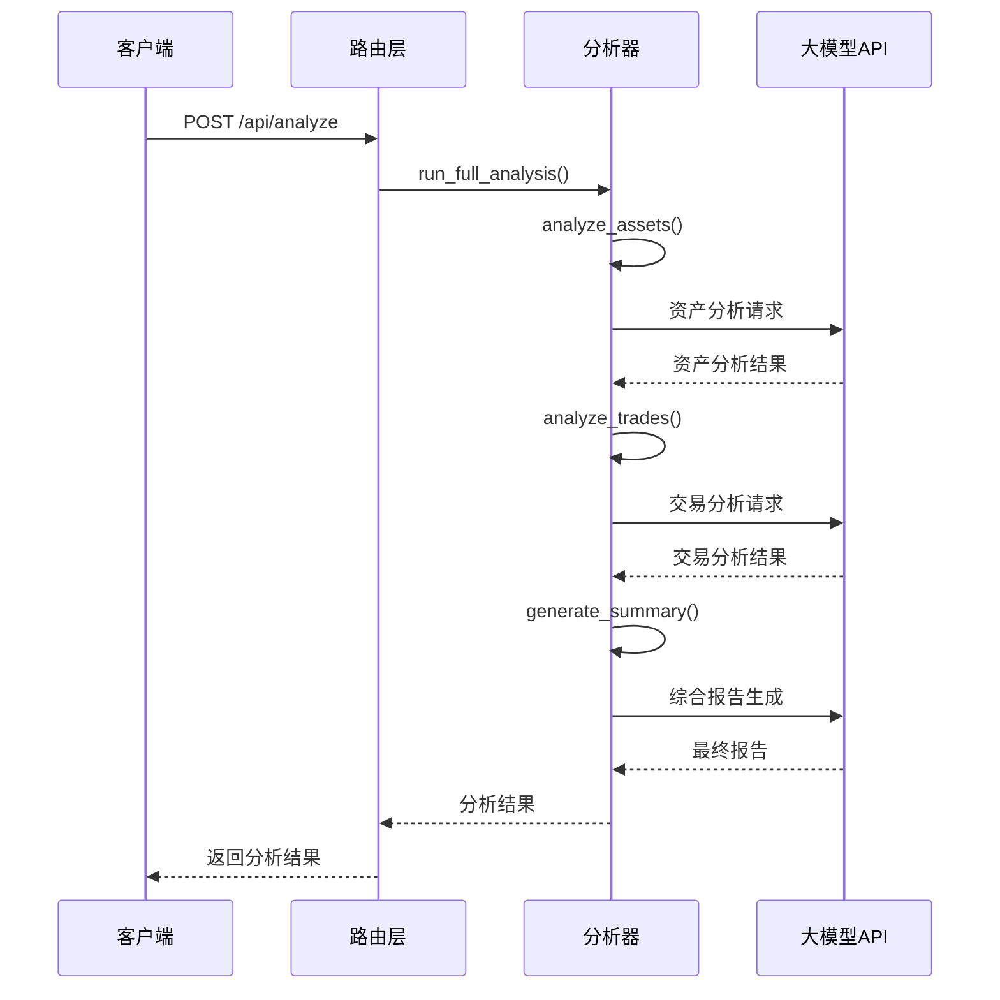
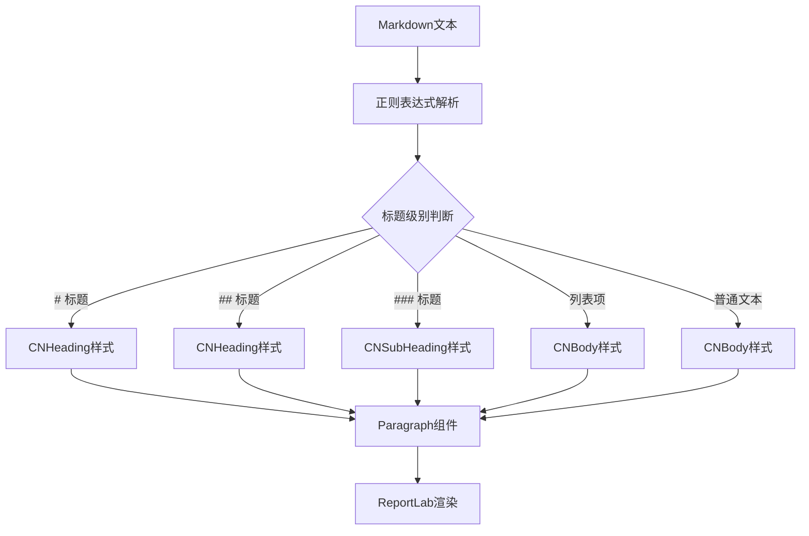
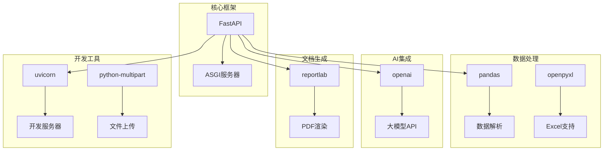

# 后端架构

<cite>
**本文档引用的文件**
- [main.py](file://backend/app/main.py)
- [analysis.py](file://backend/app/routers/analysis.py)
- [analyzer.py](file://backend/app/services/analyzer.py)
- [data_parser.py](file://backend/app/services/data_parser.py)
- [pdf_generator.py](file://backend/app/services/pdf_generator.py)
- [report_template.md](file://backend/app/skills/report_template.md)
- [requirements.txt](file://backend/requirements.txt)
</cite>

## 目录
1. [简介](#简介)
2. [项目结构](#项目结构)
3. [核心组件](#核心组件)
4. [架构概览](#架构概览)
5. [详细组件分析](#详细组件分析)
6. [依赖关系分析](#依赖关系分析)
7. [性能考虑](#性能考虑)
8. [故障排除指南](#故障排除指南)
9. [结论](#结论)

## 简介

Qoder-todo是一个基于FastAPI构建的客户资产分析系统。该系统通过上传CSV/Excel格式的持仓和交易数据，利用大模型API进行智能分析，并生成专业的PDF分析报告。系统采用模块化的架构设计，将数据解析、智能分析和报告生成功能分离，提供了清晰的服务层架构。

## 项目结构

后端项目采用标准的FastAPI项目结构，主要包含以下核心目录：

**图表来源**
- [main.py:1-28](file://backend/app/main.py#L1-L28)
- [analysis.py:1-218](file://backend/app/routers/analysis.py#L1-L218)

**章节来源**
- [main.py:1-28](file://backend/app/main.py#L1-L28)
- [requirements.txt:1-9](file://backend/requirements.txt#L1-L9)

## 核心组件

### 应用入口与配置

应用入口位于`backend/app/main.py`，负责初始化FastAPI应用并配置核心中间件：

- **应用初始化**：创建FastAPI实例，设置标题和版本信息
- **CORS配置**：启用跨域资源共享，允许所有源、方法和头部
- **静态文件服务**：配置静态文件目录（当前未实际使用）
- **路由注册**：将分析相关路由注册到`/api`前缀下

### 路由设计模式

系统采用统一的路由前缀管理模式，所有分析相关API都通过`/api`前缀访问：

**图表来源**
- [analysis.py:35-218](file://backend/app/routers/analysis.py#L35-L218)

**章节来源**
- [main.py:8-27](file://backend/app/main.py#L8-L27)
- [analysis.py:14-23](file://backend/app/routers/analysis.py#L14-L23)

## 架构概览

系统采用分层架构设计，将业务逻辑清晰地分离到不同的服务层：

**图表来源**
- [analysis.py:10-12](file://backend/app/routers/analysis.py#L10-L12)
- [analyzer.py:18-38](file://backend/app/services/analyzer.py#L18-L38)
- [pdf_generator.py:146-215](file://backend/app/services/pdf_generator.py#L146-L215)

## 详细组件分析

### 数据解析服务 (Data Parser Service)

数据解析服务负责处理用户上传的持仓和交易数据文件，支持CSV和Excel格式：

#### 核心功能特性

- **多格式支持**：自动识别并解析CSV和Excel文件
- **智能列映射**：将中文列名标准化为英文字段名
- **衍生字段计算**：自动计算市值、盈亏等派生指标
- **格式化输出**：将数据转换为适合LLM分析的文本格式

#### 数据处理流程

**图表来源**
- [data_parser.py:7-52](file://backend/app/services/data_parser.py#L7-L52)
- [data_parser.py:55-95](file://backend/app/services/data_parser.py#L55-L95)

**章节来源**
- [data_parser.py:1-96](file://backend/app/services/data_parser.py#L1-L96)

### 智能分析服务 (Analyzer Service)

智能分析服务是系统的核心，负责调用大模型API进行资产分析：

#### 技能模板系统

系统使用Markdown格式的技能模板来指导LLM的分析行为：

- **资产配置分析模板**：分析客户的投资组合配置
- **交易行为分析模板**：评估客户的交易模式和习惯
- **综合报告模板**：生成最终的分析报告

#### 大模型集成

- **OpenAI客户端配置**：支持自定义API端点和模型选择
- **温度参数控制**：设置0.7的温度值平衡创造性和准确性
- **最大令牌数限制**：限制4000个令牌确保响应质量

#### 分析流程

**图表来源**
- [analysis.py:86-129](file://backend/app/routers/analysis.py#L86-L129)
- [analyzer.py:77-93](file://backend/app/services/analyzer.py#L77-L93)

**章节来源**
- [analyzer.py:1-93](file://backend/app/services/analyzer.py#L1-L93)

### PDF生成服务 (PDF Generator Service)

PDF生成服务负责将分析结果转换为专业的PDF报告：

#### 中文字体支持

系统实现了多平台的中文字体注册机制：

- **Windows字体**：支持微软雅黑、黑体、宋体
- **Linux字体**：支持文泉驿微米黑、Noto Sans CJK
- **macOS字体**：支持PingFang
- **回退机制**：当无法找到中文字体时使用Helvetica

#### 报告结构设计

PDF报告包含以下标准结构：

1. **封面**：包含报告标题、客户名称和生成日期
2. **报告概览**：整体资产状况和评级
3. **资产配置分析**：详细的资产配置要点
4. **交易行为分析**：交易模式和改进建议
5. **综合建议**：具体的行动建议
6. **风险提示**：投资风险和应对措施

#### 文本渲染流程

**图表来源**
- [pdf_generator.py:109-143](file://backend/app/services/pdf_generator.py#L109-L143)

**章节来源**
- [pdf_generator.py:1-215](file://backend/app/services/pdf_generator.py#L1-L215)

### 路由层设计

路由层实现了完整的分析工作流，包括文件上传、分析执行、报告生成和状态管理：

#### 任务管理系统

系统使用内存字典作为临时存储，实现简单的任务管理：

- **任务状态跟踪**：pending、analyzing、completed、failed
- **文件关联管理**：存储上传文件路径和预览数据
- **分析结果缓存**：保存完整的分析结果和PDF路径

#### 错误处理机制

路由层实现了完善的错误处理：

- **HTTP异常处理**：针对不同错误场景返回适当的HTTP状态码
- **文件操作保护**：防止文件路径遍历攻击
- **输入验证**：确保任务ID的有效性

**章节来源**
- [analysis.py:16-23](file://backend/app/routers/analysis.py#L16-L23)
- [analysis.py:35-218](file://backend/app/routers/analysis.py#L35-L218)

## 依赖关系分析

系统的依赖关系相对简洁，主要依赖于FastAPI生态系统：

**图表来源**
- [requirements.txt:1-9](file://backend/requirements.txt#L1-L9)

**章节来源**
- [requirements.txt:1-9](file://backend/requirements.txt#L1-L9)

## 性能考虑

### 内存使用优化

- **文件上传限制**：当前使用内存存储上传文件，生产环境中应考虑流式处理
- **缓存策略**：使用内存字典存储任务状态，适合小规模并发
- **数据预览**：只返回前10行数据用于预览，减少传输量

### 并发处理

- **单进程部署**：当前使用单进程Uvicorn服务器
- **异步支持**：FastAPI原生支持异步处理
- **数据库迁移**：生产环境建议迁移到数据库存储

### 缓存策略

- **静态资源**：当前未配置静态文件缓存
- **分析结果**：内存缓存适合短期使用
- **文件系统**：PDF文件持久化存储

## 故障排除指南

### 常见问题诊断

#### CORS配置问题

**症状**：前端请求被阻止
**解决方案**：检查CORS配置中的允许源设置

#### 文件上传失败

**症状**：上传接口返回400错误
**排查步骤**：
1. 检查文件格式是否为CSV或Excel
2. 验证文件编码是否正确
3. 确认文件大小限制

#### 大模型API连接失败

**症状**：分析接口返回500错误
**排查步骤**：
1. 验证OPENAI_API_KEY环境变量
2. 检查网络连接
3. 确认API端点可达性

#### PDF生成错误

**症状**：报告生成失败
**排查步骤**：
1. 检查中文字体安装情况
2. 验证输出目录权限
3. 确认ReportLab库版本兼容性

### 日志和调试

系统使用标准的Python异常处理机制：

- **异常捕获**：使用try-except块捕获并处理异常
- **错误详情**：通过traceback模块记录详细错误信息
- **HTTP状态码**：返回适当的HTTP状态码给客户端

**章节来源**
- [analysis.py:54-64](file://backend/app/routers/analysis.py#L54-L64)
- [analysis.py:130-134](file://backend/app/routers/analysis.py#L130-L134)

## 结论

Qoder-todo后端架构展现了现代Python Web应用的最佳实践：

### 设计优势

- **模块化设计**：清晰的服务层分离，便于维护和扩展
- **异步支持**：充分利用FastAPI的异步特性
- **API友好**：RESTful设计，易于前端集成
- **可扩展性**：插件化的技能模板系统

### 改进建议

1. **生产环境适配**：迁移到数据库存储和异步任务队列
2. **安全增强**：添加身份认证和授权机制
3. **监控集成**：添加APM和日志监控
4. **测试覆盖**：增加单元测试和集成测试
5. **文档完善**：生成OpenAPI规范文档

该架构为金融数据分析应用提供了一个坚实的基础，通过合理的模块化设计和清晰的职责分离，确保了系统的可维护性和可扩展性。