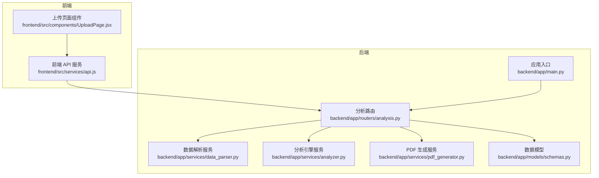
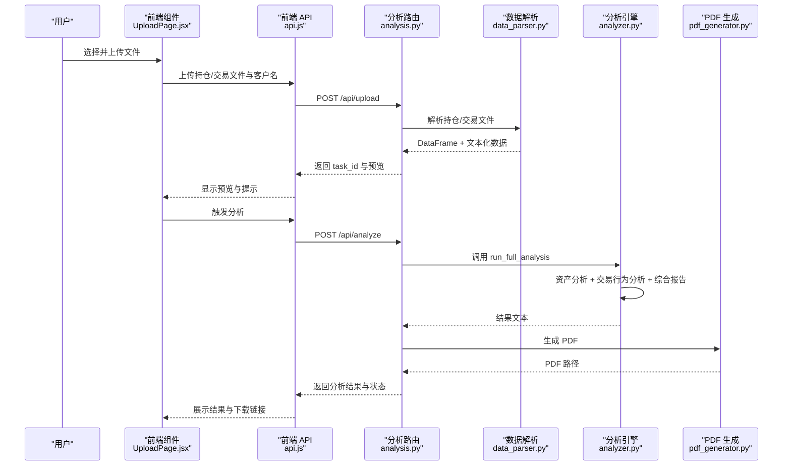
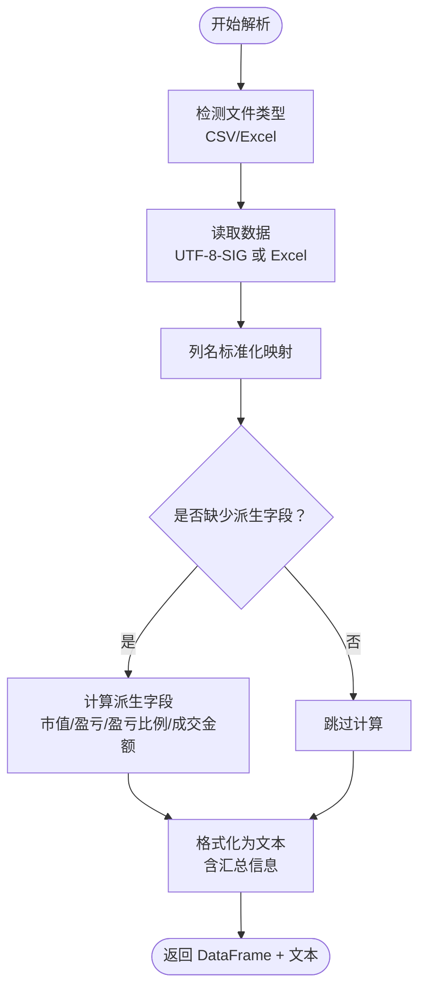
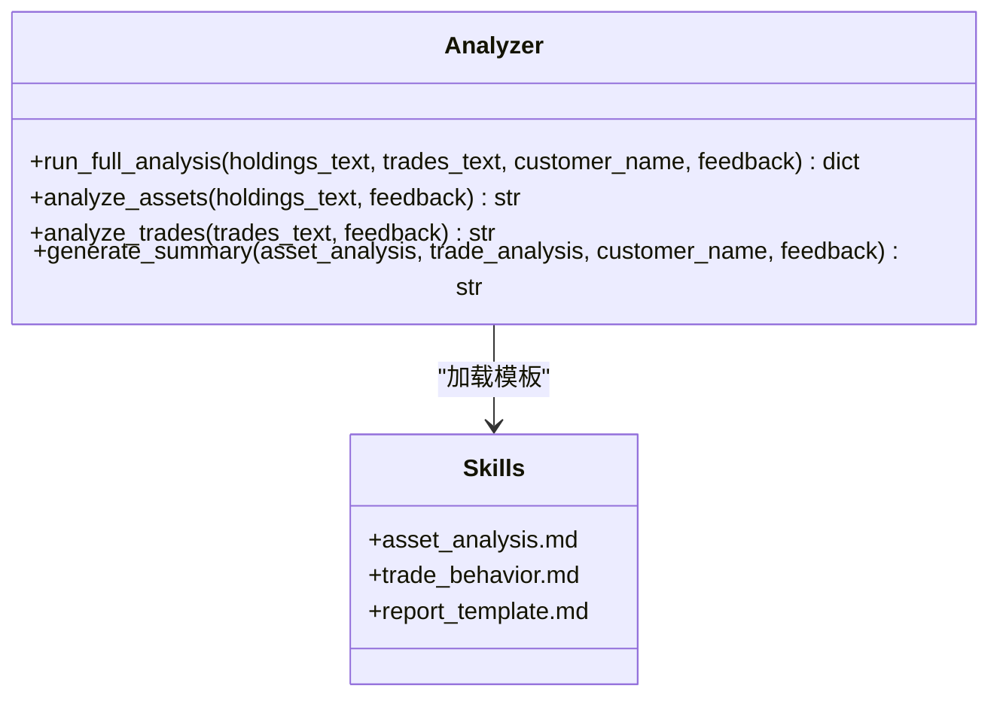
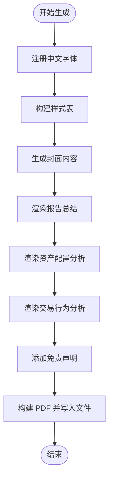
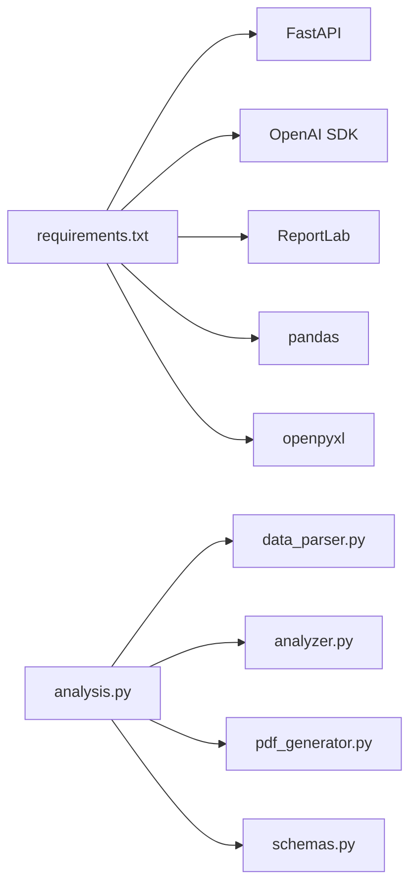

# 数据流设计

<cite>
**本文引用的文件列表**
- [backend/app/main.py](file://backend/app/main.py)
- [backend/app/routers/analysis.py](file://backend/app/routers/analysis.py)
- [backend/app/services/data_parser.py](file://backend/app/services/data_parser.py)
- [backend/app/services/analyzer.py](file://backend/app/services/analyzer.py)
- [backend/app/services/pdf_generator.py](file://backend/app/services/pdf_generator.py)
- [backend/app/skills/report_template.md](file://backend/app/skills/report_template.md)
- [backend/app/skills/asset_analysis.md](file://backend/app/skills/asset_analysis.md)
- [backend/app/skills/trade_behavior.md](file://backend/app/skills/trade_behavior.md)
- [backend/app/models/schemas.py](file://backend/app/models/schemas.py)
- [frontend/src/services/api.js](file://frontend/src/services/api.js)
- [frontend/src/components/UploadPage.jsx](file://frontend/src/components/UploadPage.jsx)
- [backend/requirements.txt](file://backend/requirements.txt)
</cite>

## 目录
1. [引言](#引言)
2. [项目结构](#项目结构)
3. [核心组件](#核心组件)
4. [架构总览](#架构总览)
5. [详细组件分析](#详细组件分析)
6. [依赖关系分析](#依赖关系分析)
7. [性能考量](#性能考量)
8. [故障排查指南](#故障排查指南)
9. [结论](#结论)
10. [附录](#附录)

## 引言
本文件为 Qoder-todo 的数据流设计文档，聚焦“从用户上传文件到生成最终 PDF 报告”的完整数据流转过程。文档覆盖：
- 文件上传后的处理流程：文件接收、格式验证、数据解析与标准化
- LLM 分析的数据输入格式与输出结构：资产配置分析与交易行为分析的数据转换
- PDF 生成的数据准备阶段：报告模板渲染与中文字符支持
- 关键数据节点的格式规范、错误处理机制与性能优化策略
- 数据流图与关键处理步骤的技术实现细节

## 项目结构
后端采用 FastAPI 构建，路由层负责文件上传、触发分析与下载报告；服务层包含数据解析、LLM 分析与 PDF 生成；前端通过 Axios 发起上传与分析请求，并展示预览与下载链接。

图表来源
- [backend/app/main.py:1-28](file://backend/app/main.py#L1-L28)
- [backend/app/routers/analysis.py:1-218](file://backend/app/routers/analysis.py#L1-L218)
- [backend/app/services/data_parser.py:1-96](file://backend/app/services/data_parser.py#L1-L96)
- [backend/app/services/analyzer.py:1-93](file://backend/app/services/analyzer.py#L1-L93)
- [backend/app/services/pdf_generator.py:1-215](file://backend/app/services/pdf_generator.py#L1-L215)
- [frontend/src/services/api.js:1-41](file://frontend/src/services/api.js#L1-L41)
- [frontend/src/components/UploadPage.jsx:1-145](file://frontend/src/components/UploadPage.jsx#L1-L145)

章节来源
- [backend/app/main.py:1-28](file://backend/app/main.py#L1-L28)
- [backend/app/routers/analysis.py:1-218](file://backend/app/routers/analysis.py#L1-L218)
- [frontend/src/services/api.js:1-41](file://frontend/src/services/api.js#L1-L41)
- [frontend/src/components/UploadPage.jsx:1-145](file://frontend/src/components/UploadPage.jsx#L1-L145)

## 核心组件
- 应用入口与中间件：注册 CORS、静态文件挂载、上传与报告目录创建、路由注册
- 分析路由：文件上传、触发分析、重新生成、下载 PDF、查询任务状态
- 数据解析服务：CSV/Excel 自动识别、列名标准化、派生字段计算、文本化供 LLM 分析
- 分析引擎服务：加载技能模板、调用 LLM、资产配置分析、交易行为分析、综合报告生成
- PDF 生成服务：中文字体注册、样式定义、Markdown 渲染、分页与页脚
- 数据模型：任务状态枚举、请求与响应模型
- 前端 API 与上传组件：表单提交、超时设置、上传预览与下载链接

章节来源
- [backend/app/main.py:1-28](file://backend/app/main.py#L1-L28)
- [backend/app/routers/analysis.py:1-218](file://backend/app/routers/analysis.py#L1-L218)
- [backend/app/services/data_parser.py:1-96](file://backend/app/services/data_parser.py#L1-L96)
- [backend/app/services/analyzer.py:1-93](file://backend/app/services/analyzer.py#L1-L93)
- [backend/app/services/pdf_generator.py:1-215](file://backend/app/services/pdf_generator.py#L1-L215)
- [backend/app/models/schemas.py:1-30](file://backend/app/models/schemas.py#L1-L30)
- [frontend/src/services/api.js:1-41](file://frontend/src/services/api.js#L1-L41)
- [frontend/src/components/UploadPage.jsx:1-145](file://frontend/src/components/UploadPage.jsx#L1-L145)

## 架构总览
下图展示从用户上传到生成 PDF 的端到端数据流。

图表来源
- [backend/app/routers/analysis.py:35-135](file://backend/app/routers/analysis.py#L35-L135)
- [backend/app/services/data_parser.py:7-96](file://backend/app/services/data_parser.py#L7-L96)
- [backend/app/services/analyzer.py:77-93](file://backend/app/services/analyzer.py#L77-L93)
- [backend/app/services/pdf_generator.py:146-215](file://backend/app/services/pdf_generator.py#L146-L215)
- [frontend/src/components/UploadPage.jsx:20-38](file://frontend/src/components/UploadPage.jsx#L20-L38)
- [frontend/src/services/api.js:10-24](file://frontend/src/services/api.js#L10-L24)

## 详细组件分析

### 文件上传与预览（后端）
- 接收参数：持仓文件（必填）、交易文件（可选）、客户名（表单字段）
- 保存策略：为每个任务生成唯一 ID，分别保存持仓与交易文件，扩展名沿用原文件
- 预览逻辑：解析持仓与交易文件，仅取前 10 条记录作为预览返回
- 错误处理：解析失败抛出 400；任务不存在或报告未生成时返回 404

章节来源
- [backend/app/routers/analysis.py:35-84](file://backend/app/routers/analysis.py#L35-L84)
- [backend/app/routers/analysis.py:25-33](file://backend/app/routers/analysis.py#L25-L33)

### 数据解析与标准化（后端）
- 文件类型识别：CSV 使用 UTF-8-SIG 编码读取；Excel 使用默认读取
- 列名标准化：针对“证券名称/代码/数量/价格/市值/资产类别/行业/浮动盈亏/盈亏比例”等中文列名进行映射
- 派生字段计算：
  - 持仓：市值 = 数量 × 现价；浮动盈亏 = 数量 × (现价 − 成本价)；盈亏比例 = ((现价 − 成本价)/成本价)×100
  - 交易：成交金额 = 数量 × 成交价格
- 文本化输出：将表格转为字符串，附加汇总信息（如总市值、总交易笔数），用于 LLM 分析

图表来源
- [backend/app/services/data_parser.py:7-52](file://backend/app/services/data_parser.py#L7-L52)
- [backend/app/services/data_parser.py:55-96](file://backend/app/services/data_parser.py#L55-L96)

章节来源
- [backend/app/services/data_parser.py:1-96](file://backend/app/services/data_parser.py#L1-L96)

### LLM 分析数据输入与输出（后端）
- 输入格式：两份文本（持仓与交易），以及可选的客户名与反馈意见
- 输出结构：资产配置分析结果、交易行为分析结果、综合报告摘要
- 技能模板：
  - 资产配置分析：多维度分析与优化建议
  - 交易行为分析：交易频率、择时、止盈止损、交易成本
  - 综合报告模板：报告概览、要点提炼、综合建议、风险提示

图表来源
- [backend/app/services/analyzer.py:77-93](file://backend/app/services/analyzer.py#L77-L93)
- [backend/app/skills/asset_analysis.md:1-35](file://backend/app/skills/asset_analysis.md#L1-L35)
- [backend/app/skills/trade_behavior.md:1-34](file://backend/app/skills/trade_behavior.md#L1-L34)
- [backend/app/skills/report_template.md:1-34](file://backend/app/skills/report_template.md#L1-L34)

章节来源
- [backend/app/services/analyzer.py:1-93](file://backend/app/services/analyzer.py#L1-L93)
- [backend/app/skills/asset_analysis.md:1-35](file://backend/app/skills/asset_analysis.md#L1-L35)
- [backend/app/skills/trade_behavior.md:1-34](file://backend/app/skills/trade_behavior.md#L1-L34)
- [backend/app/skills/report_template.md:1-34](file://backend/app/skills/report_template.md#L1-L34)

### PDF 报告生成（后端）
- 中文字符支持：尝试注册系统常用中文字体（Windows/SimSun/微软雅黑、Linux Noto CJK、macOS PingFang），失败则回退至 Helvetica
- 样式定义：标题、副标题、小节标题、正文等样式，统一使用中文字体
- 内容渲染：将 Markdown 标题、列表、加粗等语法转换为 ReportLab Flowable
- 页面布局：封面标题、客户名与生成日期、分隔线、报告总结、资产配置分析、交易行为分析、免责声明与分页

图表来源
- [backend/app/services/pdf_generator.py:26-51](file://backend/app/services/pdf_generator.py#L26-L51)
- [backend/app/services/pdf_generator.py:53-106](file://backend/app/services/pdf_generator.py#L53-L106)
- [backend/app/services/pdf_generator.py:146-215](file://backend/app/services/pdf_generator.py#L146-L215)

章节来源
- [backend/app/services/pdf_generator.py:1-215](file://backend/app/services/pdf_generator.py#L1-L215)

### 前端交互与 API 协作
- 上传页面：支持 CSV/Excel 拖拽上传，显示持仓与交易预览，禁用按钮直到至少上传持仓文件
- API 调用：上传文件与客户名；触发分析；重新生成；下载 PDF；轮询任务状态
- 超时设置：分析可能耗时较长，默认 5 分钟超时

章节来源
- [frontend/src/components/UploadPage.jsx:1-145](file://frontend/src/components/UploadPage.jsx#L1-L145)
- [frontend/src/services/api.js:1-41](file://frontend/src/services/api.js#L1-L41)

## 依赖关系分析
- 后端依赖：FastAPI、OpenAI SDK、ReportLab、pandas、openpyxl、matplotlib
- 组件耦合：路由层协调解析、分析与 PDF 生成；解析与分析解耦，便于替换模型或模板；PDF 生成独立于业务逻辑
- 外部集成点：OpenAI API（模型调用）、文件系统（上传与报告目录）

图表来源
- [backend/requirements.txt:1-9](file://backend/requirements.txt#L1-L9)
- [backend/app/routers/analysis.py:10-12](file://backend/app/routers/analysis.py#L10-L12)
- [backend/app/services/analyzer.py:4-5](file://backend/app/services/analyzer.py#L4-L5)
- [backend/app/services/pdf_generator.py:3-19](file://backend/app/services/pdf_generator.py#L3-L19)
- [backend/app/services/data_parser.py:3-4](file://backend/app/services/data_parser.py#L3-L4)

章节来源
- [backend/requirements.txt:1-9](file://backend/requirements.txt#L1-L9)
- [backend/app/routers/analysis.py:10-12](file://backend/app/routers/analysis.py#L10-L12)
- [backend/app/services/analyzer.py:4-5](file://backend/app/services/analyzer.py#L4-L5)
- [backend/app/services/pdf_generator.py:3-19](file://backend/app/services/pdf_generator.py#L3-L19)
- [backend/app/services/data_parser.py:3-4](file://backend/app/services/data_parser.py#L3-L4)

## 性能考量
- 文件解析：pandas 读取 CSV/Excel，建议控制单次上传文件大小与行数，避免内存峰值过高
- LLM 调用：消息长度与 token 上限受控，建议对长文本进行分段或摘要；合理设置温度与最大 token
- PDF 生成：批量生成时注意并发与磁盘 IO；字体注册只需一次，避免重复注册
- 前端超时：分析接口默认 5 分钟，确保网络稳定与服务端资源充足
- 生产建议：引入数据库持久化任务状态、队列异步分析、CDN 加速 PDF 下载

[本节为通用性能指导，无需特定文件引用]

## 故障排查指南
- 上传失败（400）：检查文件格式是否为 CSV/Excel，列名是否包含预期关键词；查看解析异常堆栈
- 任务不存在（404）：确认 task_id 是否正确；检查路由中任务字典是否初始化
- 分析失败（500）：检查 OPENAI_API_KEY、OPENAI_BASE_URL、OPENAI_MODEL 环境变量；查看服务端异常日志
- PDF 无法下载：确认报告已生成且路径存在；检查 REPORT_DIR 可写权限
- 中文乱码：确认系统中文字体路径存在；若未注册成功，将回退至 Helvetica

章节来源
- [backend/app/routers/analysis.py:54-64](file://backend/app/routers/analysis.py#L54-L64)
- [backend/app/routers/analysis.py:90-91](file://backend/app/routers/analysis.py#L90-L91)
- [backend/app/routers/analysis.py:130-134](file://backend/app/routers/analysis.py#L130-L134)
- [backend/app/routers/analysis.py:140-146](file://backend/app/routers/analysis.py#L140-L146)
- [backend/app/services/pdf_generator.py:26-51](file://backend/app/services/pdf_generator.py#L26-L51)

## 结论
本数据流设计以清晰的职责分离与模块化实现贯穿“上传 → 解析 → 分析 → 报告生成 → 下载”的全流程。通过标准化的数据格式、可控的 LLM 输入输出与完善的错误处理，系统具备良好的可维护性与扩展性。建议在生产环境中引入持久化与异步化机制，进一步提升稳定性与吞吐能力。

[本节为总结性内容，无需特定文件引用]

## 附录

### 关键数据节点格式规范
- 上传文件
  - 持仓文件：必填；列名需包含“证券名称/代码/数量/成本价/现价/市值/资产类别/行业/浮动盈亏/盈亏比例”等关键词之一
  - 交易文件：可选；列名需包含“证券名称/代码/交易方向/买卖方向/数量/成交数量/成交价格/交易价格/成交金额/交易金额/交易时间/成交时间/手续费”等关键词之一
- 解析输出
  - DataFrame：标准化列名；缺失派生字段自动计算
  - 文本化：表格 + 汇总信息（如总市值、总交易笔数）
- LLM 输入
  - 资产配置分析：持仓文本 + 可选反馈
  - 交易行为分析：交易文本 + 可选反馈
  - 综合报告：客户名 + 资产分析 + 交易分析 + 可选反馈
- LLM 输出
  - 结构化文本（Markdown 风格），包含要点与建议
- PDF 输出
  - A4 页面尺寸，封面标题、客户名、生成日期、分隔线、报告总结、资产配置分析、交易行为分析、免责声明

章节来源
- [backend/app/services/data_parser.py:14-52](file://backend/app/services/data_parser.py#L14-L52)
- [backend/app/services/data_parser.py:62-96](file://backend/app/services/data_parser.py#L62-L96)
- [backend/app/services/analyzer.py:41-74](file://backend/app/services/analyzer.py#L41-L74)
- [backend/app/services/pdf_generator.py:146-215](file://backend/app/services/pdf_generator.py#L146-L215)

### 错误处理机制
- 路由层：HTTPException 返回明确状态码与错误详情
- 解析层：捕获读取/编码/列映射异常并上抛
- 分析层：捕获 LLM 调用异常，标记任务失败并记录错误
- 下载层：校验任务存在与文件存在性，不存在返回 404

章节来源
- [backend/app/routers/analysis.py:54-64](file://backend/app/routers/analysis.py#L54-L64)
- [backend/app/routers/analysis.py:130-134](file://backend/app/routers/analysis.py#L130-L134)
- [backend/app/routers/analysis.py:140-146](file://backend/app/routers/analysis.py#L140-L146)

### 性能优化策略
- 限制上传文件大小与行数，避免 OOM
- 对长文本进行分段或摘要，降低 LLM token 消耗
- 字体注册一次性完成，避免重复注册开销
- 使用异步队列与数据库持久化，提高并发与可靠性
- 前端设置合理超时，避免长时间阻塞

[本节为通用优化建议，无需特定文件引用]