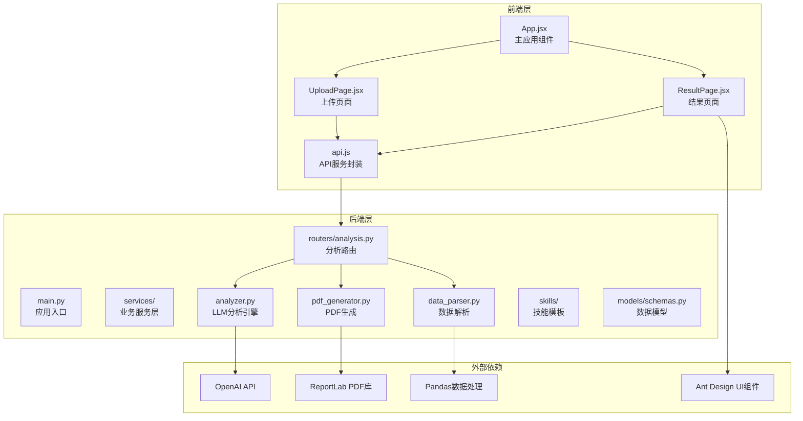
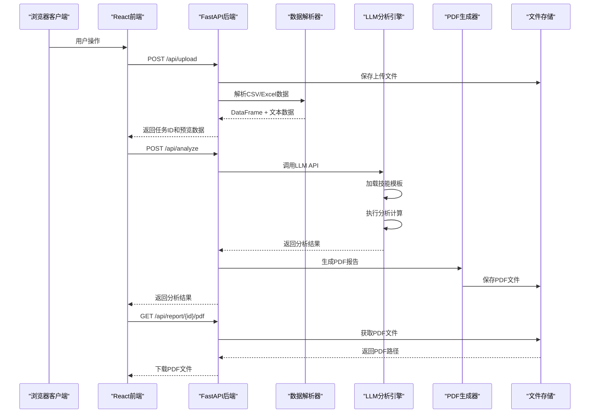
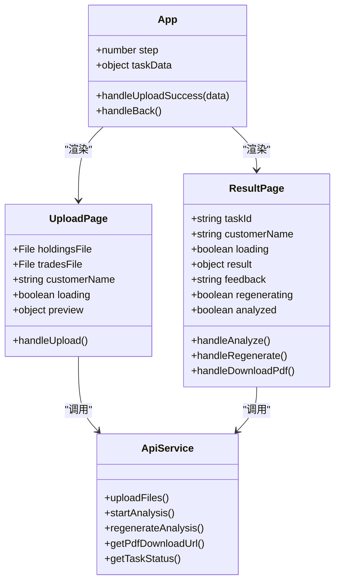
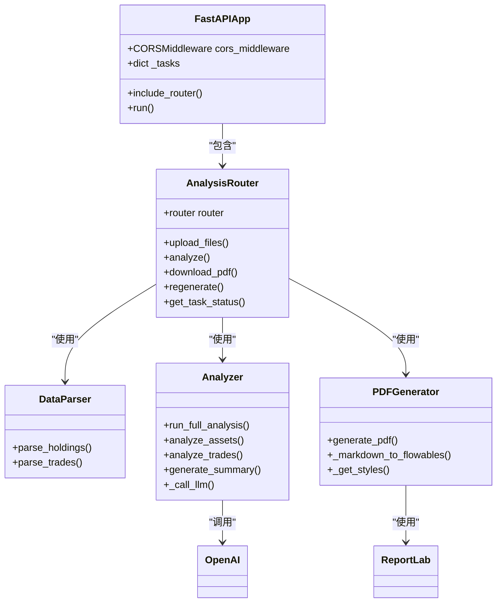
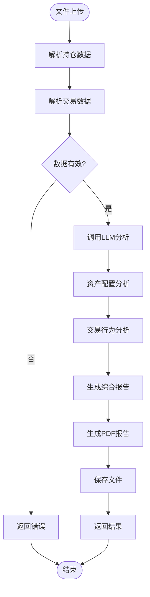
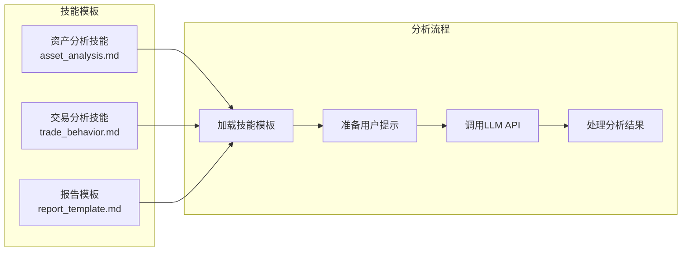
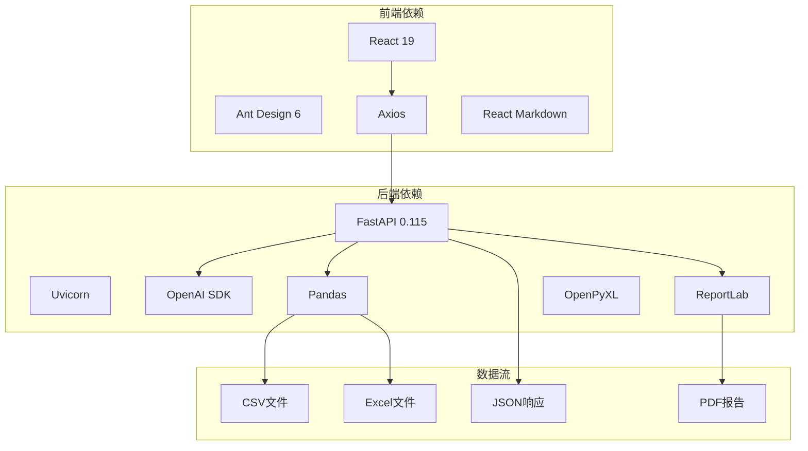

# 整体设计

<cite>
**本文档引用的文件**
- [backend/app/main.py](file://backend/app/main.py)
- [backend/app/routers/analysis.py](file://backend/app/routers/analysis.py)
- [backend/app/services/analyzer.py](file://backend/app/services/analyzer.py)
- [backend/app/services/data_parser.py](file://backend/app/services/data_parser.py)
- [backend/app/services/pdf_generator.py](file://backend/app/services/pdf_generator.py)
- [backend/app/skills/report_template.md](file://backend/app/skills/report_template.md)
- [backend/app/models/schemas.py](file://backend/app/models/schemas.py)
- [backend/requirements.txt](file://backend/requirements.txt)
- [frontend/src/App.jsx](file://frontend/src/App.jsx)
- [frontend/src/services/api.js](file://frontend/src/services/api.js)
- [frontend/src/components/UploadPage.jsx](file://frontend/src/components/UploadPage.jsx)
- [frontend/src/components/ResultPage.jsx](file://frontend/src/components/ResultPage.jsx)
- [frontend/package.json](file://frontend/package.json)
</cite>

## 目录
1. [引言](#引言)
2. [项目结构](#项目结构)
3. [核心组件](#核心组件)
4. [架构总览](#架构总览)
5. [详细组件分析](#详细组件分析)
6. [依赖关系分析](#依赖关系分析)
7. [性能考虑](#性能考虑)
8. [故障排除指南](#故障排除指南)
9. [结论](#结论)

## 引言
本项目是一个基于前后端分离架构的客户资产分析工具，采用React前端与FastAPI后端的现代Web技术栈，结合大语言模型(LLM)进行数据分析，并通过PDF生成模块输出专业的分析报告。系统通过模块化设计实现了高内聚低耦合，前端负责用户交互与展示，后端提供RESTful API服务，中间件负责文件处理与LLM分析引擎，确保了清晰的职责边界和良好的扩展性。

## 项目结构
项目采用典型的前后端分离架构，后端使用Python FastAPI框架，前端使用React + Ant Design构建用户界面。整体目录结构清晰，功能模块划分明确。

**图表来源**
- [backend/app/main.py:1-28](file://backend/app/main.py#L1-L28)
- [backend/app/routers/analysis.py:1-218](file://backend/app/routers/analysis.py#L1-L218)
- [frontend/src/App.jsx:1-81](file://frontend/src/App.jsx#L1-L81)

**章节来源**
- [backend/app/main.py:1-28](file://backend/app/main.py#L1-L28)
- [frontend/src/App.jsx:1-81](file://frontend/src/App.jsx#L1-L81)

## 核心组件
系统由五个核心组件构成，每个组件都有明确的职责和边界：

### 前端React应用
- **职责**：用户界面交互、文件上传、结果展示、状态管理
- **技术栈**：React 19、Ant Design 6、Axios、React Markdown
- **特点**：响应式设计、用户体验友好、组件化开发

### 后端FastAPI服务
- **职责**：RESTful API提供、请求路由、业务逻辑协调
- **技术栈**：FastAPI 0.115、Uvicorn ASGI服务器
- **特点**：类型安全、自动文档生成、高性能

### 文件处理模块
- **职责**：CSV/Excel文件解析、数据标准化、格式转换
- **技术栈**：Pandas 2.2.2、OpenPyXL 3.1.5
- **特点**：多格式支持、智能列映射、数据验证

### LLM分析引擎
- **职责**：调用大语言模型进行资产分析、生成综合报告
- **技术栈**：OpenAI Python SDK 1.51.0
- **特点**：可配置的模型参数、技能模板驱动、反馈机制

### PDF生成模块
- **职责**：将分析结果转换为专业的PDF报告
- **技术栈**：ReportLab 4.2.2、中文字体支持
- **特点**：中文友好、样式丰富、可定制化

**章节来源**
- [backend/requirements.txt:1-9](file://backend/requirements.txt#L1-L9)
- [frontend/package.json:1-32](file://frontend/package.json#L1-L32)

## 架构总览
系统采用分层架构设计，通过RESTful API实现前后端解耦，各组件间通过明确定义的接口进行通信。

**图表来源**
- [backend/app/routers/analysis.py:35-152](file://backend/app/routers/analysis.py#L35-L152)
- [backend/app/services/analyzer.py:77-93](file://backend/app/services/analyzer.py#L77-L93)
- [backend/app/services/pdf_generator.py:146-215](file://backend/app/services/pdf_generator.py#L146-L215)

## 详细组件分析

### 前端组件架构
前端采用React Hooks和Ant Design组件库，实现了清晰的组件层次结构。

**图表来源**
- [frontend/src/App.jsx:11-81](file://frontend/src/App.jsx#L11-L81)
- [frontend/src/components/UploadPage.jsx:13-145](file://frontend/src/components/UploadPage.jsx#L13-L145)
- [frontend/src/components/ResultPage.jsx:15-193](file://frontend/src/components/ResultPage.jsx#L15-L193)
- [frontend/src/services/api.js:10-45](file://frontend/src/services/api.js#L10-L45)

#### API交互流程
前端通过统一的API服务封装与后端进行通信，支持文件上传、分析执行、PDF下载等功能。

**章节来源**
- [frontend/src/App.jsx:11-81](file://frontend/src/App.jsx#L11-L81)
- [frontend/src/components/UploadPage.jsx:20-38](file://frontend/src/components/UploadPage.jsx#L20-L38)
- [frontend/src/components/ResultPage.jsx:22-54](file://frontend/src/components/ResultPage.jsx#L22-L54)
- [frontend/src/services/api.js:10-45](file://frontend/src/services/api.js#L10-L45)

### 后端服务架构
后端采用FastAPI框架，通过路由器模式组织业务逻辑，实现了清晰的职责分离。

**图表来源**
- [backend/app/main.py:8-23](file://backend/app/main.py#L8-L23)
- [backend/app/routers/analysis.py:14-218](file://backend/app/routers/analysis.py#L14-L218)
- [backend/app/services/analyzer.py:77-93](file://backend/app/services/analyzer.py#L77-L93)
- [backend/app/services/pdf_generator.py:146-215](file://backend/app/services/pdf_generator.py#L146-L215)

#### 数据流处理流程
后端服务通过流水线方式处理数据，从文件上传到最终报告生成的完整流程。

**图表来源**
- [backend/app/routers/analysis.py:51-134](file://backend/app/routers/analysis.py#L51-L134)
- [backend/app/services/analyzer.py:77-93](file://backend/app/services/analyzer.py#L77-L93)

**章节来源**
- [backend/app/main.py:8-23](file://backend/app/main.py#L8-L23)
- [backend/app/routers/analysis.py:35-218](file://backend/app/routers/analysis.py#L35-L218)
- [backend/app/services/analyzer.py:18-93](file://backend/app/services/analyzer.py#L18-L93)
- [backend/app/services/pdf_generator.py:146-215](file://backend/app/services/pdf_generator.py#L146-L215)

### LLM分析引擎设计
分析引擎采用技能模板驱动的方式，通过不同的技能文件实现特定领域的分析能力。

**图表来源**
- [backend/app/services/analyzer.py:11-74](file://backend/app/services/analyzer.py#L11-L74)
- [backend/app/skills/report_template.md:1-34](file://backend/app/skills/report_template.md#L1-L34)

#### 技能模板结构
系统通过Markdown格式的技能模板实现分析逻辑的模块化，每种分析类型都有专门的技能文件。

**章节来源**
- [backend/app/services/analyzer.py:11-74](file://backend/app/services/analyzer.py#L11-L74)
- [backend/app/skills/report_template.md:1-34](file://backend/app/skills/report_template.md#L1-L34)

## 依赖关系分析
系统采用模块化设计，各组件间的依赖关系清晰且松散耦合。

**图表来源**
- [backend/requirements.txt:1-9](file://backend/requirements.txt#L1-L9)
- [frontend/package.json:12-19](file://frontend/package.json#L12-L19)

### 技术选型分析
系统的技术选型体现了现代Web开发的最佳实践：

#### FastAPI作为后端框架的优势
- **类型安全**：Pydantic模型提供运行时类型检查
- **自动文档**：内置Swagger UI和ReDoc文档
- **高性能**：基于Starlette和Uvicorn的ASGI异步框架
- **易测试**：依赖注入和模块化设计便于单元测试

#### React作为前端框架的优势
- **组件化**：函数式组件和Hooks提供更好的代码复用
- **生态丰富**：Ant Design提供完整的UI解决方案
- **开发体验**：Vite提供快速热重载和构建优化
- **类型安全**：TypeScript支持提供编译时错误检测

#### 模块化设计原则
- **高内聚**：每个模块专注于单一职责
- **低耦合**：通过清晰的接口定义减少依赖
- **可扩展**：新增功能不影响现有模块
- **可维护**：独立的测试和部署单元

**章节来源**
- [backend/requirements.txt:1-9](file://backend/requirements.txt#L1-L9)
- [frontend/package.json:12-19](file://frontend/package.json#L12-L19)

## 性能考虑
系统在设计时充分考虑了性能优化和用户体验：

### 前端性能优化
- **懒加载**：React.lazy和Suspense实现组件懒加载
- **虚拟滚动**：大数据量表格使用虚拟滚动提升渲染性能
- **缓存策略**：合理使用浏览器缓存和内存缓存
- **并发处理**：支持多个文件同时上传和分析

### 后端性能优化
- **异步处理**：FastAPI的异步路由支持高并发请求
- **内存管理**：使用生成器和分块处理大文件
- **连接池**：数据库连接和外部API调用使用连接池
- **缓存机制**：分析结果的临时存储和缓存

### 网络性能
- **超时设置**：API请求设置合理的超时时间（5分钟）
- **断点续传**：支持大文件的分片上传
- **压缩传输**：启用Gzip压缩减少网络传输量
- **CDN支持**：静态资源可通过CDN加速

## 故障排除指南
系统提供了完善的错误处理和调试机制：

### 常见问题及解决方案
- **文件上传失败**：检查文件格式是否为CSV或Excel，确认文件大小限制
- **LLM调用超时**：检查网络连接和API密钥配置
- **PDF生成错误**：确认中文字体安装和权限设置
- **跨域问题**：检查CORS配置和前端API地址

### 错误处理机制
后端通过HTTP状态码和详细的错误信息提供清晰的故障诊断：
- **400错误**：文件解析失败或参数验证失败
- **404错误**：任务不存在或文件未找到
- **500错误**：服务器内部错误，包含堆栈跟踪信息

### 调试工具
- **日志记录**：详细的请求和响应日志
- **性能监控**：API响应时间和资源使用情况
- **错误追踪**：异常捕获和用户友好的错误消息

**章节来源**
- [backend/app/routers/analysis.py:54-64](file://backend/app/routers/analysis.py#L54-L64)
- [backend/app/routers/analysis.py:130-134](file://backend/app/routers/analysis.py#L130-L134)

## 结论
Qoder-todo项目通过精心设计的前后端分离架构，成功地将现代Web技术与人工智能分析能力相结合。系统采用模块化设计实现了高内聚低耦合，通过RESTful API实现了清晰的组件边界，通过FastAPI和React分别在后端和前端提供了高性能和优秀的用户体验。

项目的成功之处在于：
- **架构清晰**：前后端职责明确，组件边界清晰
- **技术先进**：采用最新的Web开发技术和AI能力
- **可扩展性强**：模块化设计便于功能扩展和维护
- **用户体验优秀**：简洁直观的界面设计和流畅的交互体验

未来可以考虑的功能增强包括：增加用户认证机制、实现任务队列处理大量分析请求、添加更多分析维度和可视化图表等。