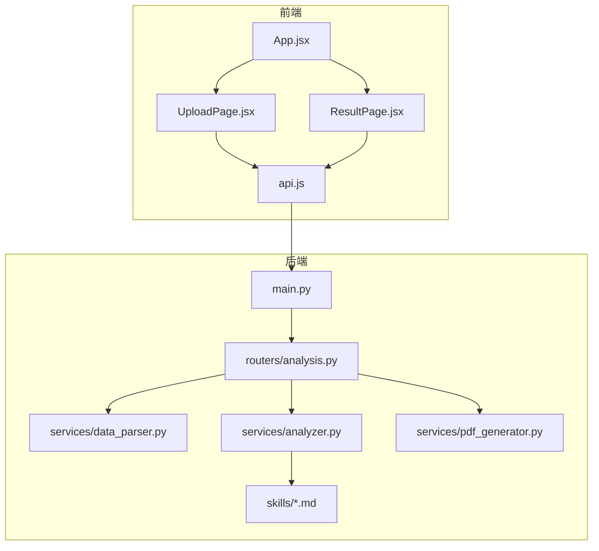
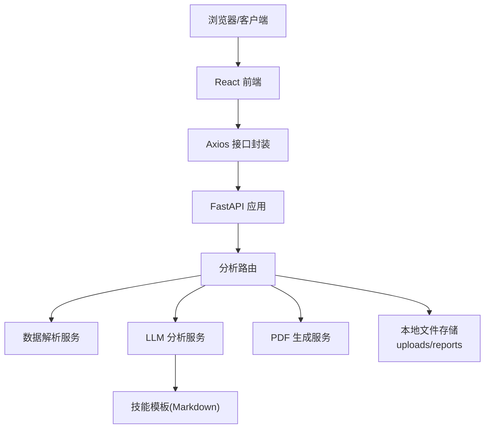
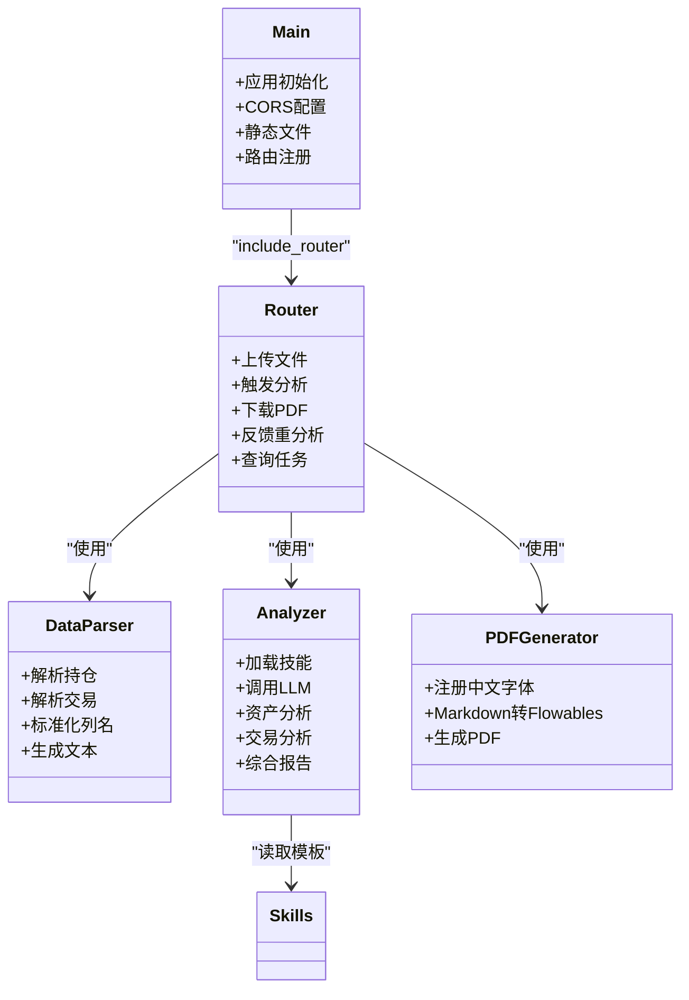
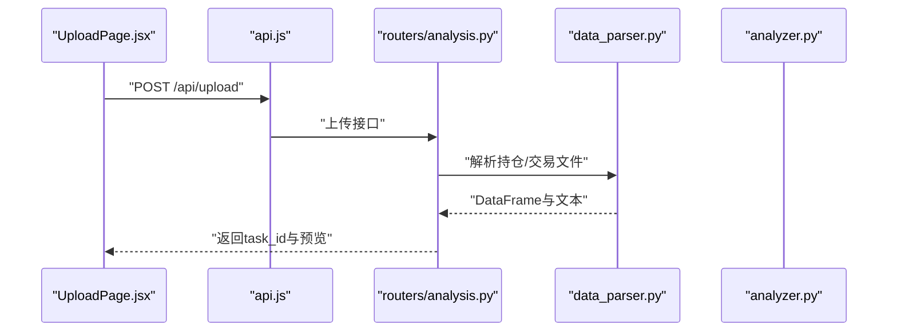
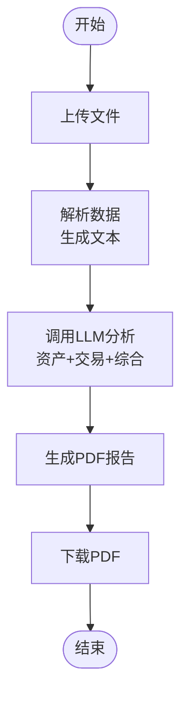
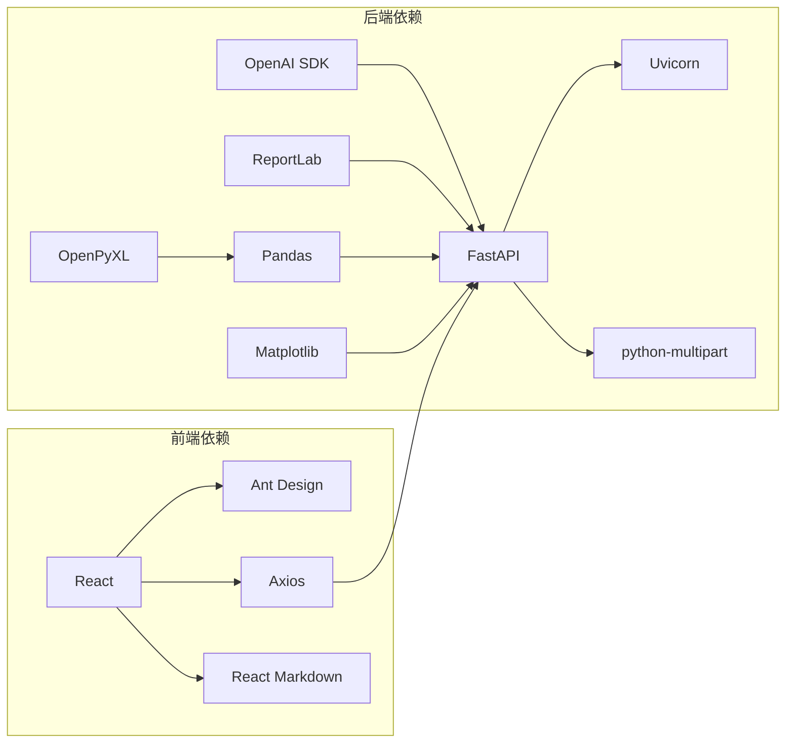

# 系统架构

<cite>
**本文引用的文件**
- [backend/app/main.py](file://backend/app/main.py)
- [backend/app/routers/analysis.py](file://backend/app/routers/analysis.py)
- [backend/app/services/analyzer.py](file://backend/app/services/analyzer.py)
- [backend/app/services/data_parser.py](file://backend/app/services/data_parser.py)
- [backend/app/services/pdf_generator.py](file://backend/app/services/pdf_generator.py)
- [backend/app/skills/report_template.md](file://backend/app/skills/report_template.md)
- [backend/app/skills/asset_analysis.md](file://backend/app/skills/asset_analysis.md)
- [backend/app/skills/trade_behavior.md](file://backend/app/skills/trade_behavior.md)
- [backend/requirements.txt](file://backend/requirements.txt)
- [frontend/src/App.jsx](file://frontend/src/App.jsx)
- [frontend/src/components/UploadPage.jsx](file://frontend/src/components/UploadPage.jsx)
- [frontend/src/components/ResultPage.jsx](file://frontend/src/components/ResultPage.jsx)
- [frontend/src/services/api.js](file://frontend/src/services/api.js)
- [frontend/package.json](file://frontend/package.json)
</cite>

## 目录
1. [引言](#引言)
2. [项目结构](#项目结构)
3. [核心组件](#核心组件)
4. [架构总览](#架构总览)
5. [详细组件分析](#详细组件分析)
6. [依赖关系分析](#依赖关系分析)
7. [性能考虑](#性能考虑)
8. [故障排查指南](#故障排查指南)
9. [结论](#结论)
10. [附录](#附录)

## 引言
本系统是一个前后端分离的客户资产分析平台，采用FastAPI构建后端REST服务，React前端负责用户交互与展示。系统支持CSV/Excel文件上传，通过内置“技能模板”驱动LLM进行资产配置与交易行为分析，并将结果生成PDF报告。本文档从系统边界、组件交互、数据流、错误处理与性能优化等方面，系统性阐述该架构的设计与实现。

## 项目结构
- 后端（Python/FastAPI）
  - 应用入口与中间件配置
  - 路由模块（analysis）
  - 服务层（数据解析、LLM分析、PDF生成）
  - 技能模板（Markdown）
- 前端（React/Vite）
  - 页面组件（上传、结果）
  - API封装与Axios配置
  - Ant Design UI与Markdown渲染

图表来源
- [backend/app/main.py:1-28](file://backend/app/main.py#L1-L28)
- [backend/app/routers/analysis.py:1-218](file://backend/app/routers/analysis.py#L1-L218)
- [backend/app/services/data_parser.py:1-96](file://backend/app/services/data_parser.py#L1-L96)
- [backend/app/services/analyzer.py:1-93](file://backend/app/services/analyzer.py#L1-L93)
- [backend/app/services/pdf_generator.py:1-215](file://backend/app/services/pdf_generator.py#L1-L215)
- [frontend/src/App.jsx:1-81](file://frontend/src/App.jsx#L1-L81)
- [frontend/src/components/UploadPage.jsx:1-145](file://frontend/src/components/UploadPage.jsx#L1-L145)
- [frontend/src/components/ResultPage.jsx:1-193](file://frontend/src/components/ResultPage.jsx#L1-L193)
- [frontend/src/services/api.js:1-48](file://frontend/src/services/api.js#L1-L48)

章节来源
- [backend/app/main.py:1-28](file://backend/app/main.py#L1-L28)
- [frontend/src/App.jsx:1-81](file://frontend/src/App.jsx#L1-L81)

## 核心组件
- 应用入口与中间件
  - CORS跨域、静态文件挂载、路由注册、开发服务器启动
- 路由层
  - 文件上传、触发分析、下载PDF、反馈重分析、任务状态查询
- 服务层
  - 数据解析（CSV/Excel）、LLM分析（资产配置/交易行为/综合报告）、PDF生成
- 前端组件
  - 上传页面（拖拽上传、数据预览）、结果页面（Markdown渲染、PDF下载、反馈重分析）

章节来源
- [backend/app/main.py:1-28](file://backend/app/main.py#L1-L28)
- [backend/app/routers/analysis.py:1-218](file://backend/app/routers/analysis.py#L1-L218)
- [backend/app/services/data_parser.py:1-96](file://backend/app/services/data_parser.py#L1-L96)
- [backend/app/services/analyzer.py:1-93](file://backend/app/services/analyzer.py#L1-L93)
- [backend/app/services/pdf_generator.py:1-215](file://backend/app/services/pdf_generator.py#L1-L215)
- [frontend/src/components/UploadPage.jsx:1-145](file://frontend/src/components/UploadPage.jsx#L1-L145)
- [frontend/src/components/ResultPage.jsx:1-193](file://frontend/src/components/ResultPage.jsx#L1-L193)

## 架构总览
系统采用前后端分离的RESTful架构：
- 前端通过Axios调用后端API，完成文件上传、分析触发、报告下载与状态查询
- 后端基于FastAPI提供路由接口，内部串联数据解析、LLM分析与PDF生成
- 中间件统一处理CORS与静态资源，生产环境建议限制允许源并启用HTTPS

图表来源
- [frontend/src/services/api.js:1-48](file://frontend/src/services/api.js#L1-L48)
- [backend/app/main.py:1-28](file://backend/app/main.py#L1-L28)
- [backend/app/routers/analysis.py:1-218](file://backend/app/routers/analysis.py#L1-L218)
- [backend/app/services/data_parser.py:1-96](file://backend/app/services/data_parser.py#L1-L96)
- [backend/app/services/analyzer.py:1-93](file://backend/app/services/analyzer.py#L1-L93)
- [backend/app/services/pdf_generator.py:1-215](file://backend/app/services/pdf_generator.py#L1-L215)
- [backend/app/skills/report_template.md:1-34](file://backend/app/skills/report_template.md#L1-L34)

## 详细组件分析

### 后端服务层架构
- 应用入口与中间件
  - 初始化FastAPI实例，配置CORS、静态文件目录
  - 注册分析路由，绑定前缀/api
- 路由设计
  - POST /api/upload：接收持仓与交易文件，解析预览，生成任务ID
  - POST /api/analyze：触发分析，调用LLM生成结果并生成PDF
  - GET /api/report/{task_id}/pdf：下载PDF报告
  - POST /api/analyze/{task_id}/regenerate：根据反馈重分析
  - GET /api/task/{task_id}：查询任务状态与结果
- 服务层职责
  - data_parser：标准化列名、计算衍生字段、生成文本供LLM分析
  - analyzer：加载技能模板、调用OpenAI API、组织完整分析流程
  - pdf_generator：注册中文字体、解析Markdown、生成结构化PDF

图表来源
- [backend/app/main.py:1-28](file://backend/app/main.py#L1-L28)
- [backend/app/routers/analysis.py:1-218](file://backend/app/routers/analysis.py#L1-L218)
- [backend/app/services/data_parser.py:1-96](file://backend/app/services/data_parser.py#L1-L96)
- [backend/app/services/analyzer.py:1-93](file://backend/app/services/analyzer.py#L1-L93)
- [backend/app/services/pdf_generator.py:1-215](file://backend/app/services/pdf_generator.py#L1-L215)
- [backend/app/skills/report_template.md:1-34](file://backend/app/skills/report_template.md#L1-L34)

章节来源
- [backend/app/main.py:1-28](file://backend/app/main.py#L1-L28)
- [backend/app/routers/analysis.py:1-218](file://backend/app/routers/analysis.py#L1-L218)
- [backend/app/services/data_parser.py:1-96](file://backend/app/services/data_parser.py#L1-L96)
- [backend/app/services/analyzer.py:1-93](file://backend/app/services/analyzer.py#L1-L93)
- [backend/app/services/pdf_generator.py:1-215](file://backend/app/services/pdf_generator.py#L1-L215)

### 前端组件化架构与状态管理
- App.jsx
  - 管理步骤状态（上传/结果），传递任务数据
- UploadPage.jsx
  - 处理拖拽上传、文件预览、调用上传接口
- ResultPage.jsx
  - 触发分析、渲染Markdown、下载PDF、反馈重分析
- api.js
  - Axios封装，设置基础URL与超时，暴露上传、分析、下载等方法

图表来源
- [frontend/src/components/UploadPage.jsx:1-145](file://frontend/src/components/UploadPage.jsx#L1-L145)
- [frontend/src/services/api.js:1-48](file://frontend/src/services/api.js#L1-L48)
- [backend/app/routers/analysis.py:1-218](file://backend/app/routers/analysis.py#L1-L218)
- [backend/app/services/data_parser.py:1-96](file://backend/app/services/data_parser.py#L1-L96)

章节来源
- [frontend/src/App.jsx:1-81](file://frontend/src/App.jsx#L1-L81)
- [frontend/src/components/UploadPage.jsx:1-145](file://frontend/src/components/UploadPage.jsx#L1-L145)
- [frontend/src/components/ResultPage.jsx:1-193](file://frontend/src/components/ResultPage.jsx#L1-L193)
- [frontend/src/services/api.js:1-48](file://frontend/src/services/api.js#L1-L48)

### 数据流：从文件上传到LLM分析再到PDF生成
- 文件上传与预览
  - 前端上传CSV/Excel，后端解析并返回前10条记录用于预览
- 触发分析
  - 后端读取任务上下文，调用LLM分析服务，产出资产配置、交易行为与综合报告
- PDF生成
  - 使用ReportLab将Markdown内容渲染为PDF，支持中文字体注册与样式定制
- 下载报告
  - 前端通过下载链接获取PDF文件

图表来源
- [backend/app/routers/analysis.py:35-152](file://backend/app/routers/analysis.py#L35-L152)
- [backend/app/services/data_parser.py:7-95](file://backend/app/services/data_parser.py#L7-L95)
- [backend/app/services/analyzer.py:41-92](file://backend/app/services/analyzer.py#L41-L92)
- [backend/app/services/pdf_generator.py:146-214](file://backend/app/services/pdf_generator.py#L146-L214)

章节来源
- [backend/app/routers/analysis.py:35-152](file://backend/app/routers/analysis.py#L35-L152)
- [backend/app/services/data_parser.py:7-95](file://backend/app/services/data_parser.py#L7-L95)
- [backend/app/services/analyzer.py:41-92](file://backend/app/services/analyzer.py#L41-L92)
- [backend/app/services/pdf_generator.py:146-214](file://backend/app/services/pdf_generator.py#L146-L214)

## 依赖关系分析
- 后端依赖
  - FastAPI、Uvicorn、python-multipart、OpenAI SDK、ReportLab、Pandas、OpenPyXL、Matplotlib
- 前端依赖
  - React、Ant Design、Axios、React Markdown

图表来源
- [backend/requirements.txt:1-9](file://backend/requirements.txt#L1-L9)
- [frontend/package.json:12-19](file://frontend/package.json#L12-L19)

章节来源
- [backend/requirements.txt:1-9](file://backend/requirements.txt#L1-L9)
- [frontend/package.json:12-19](file://frontend/package.json#L12-L19)

## 性能考虑
- I/O与并发
  - 使用异步FastAPI与Uvicorn，提升并发处理能力
  - 文件上传采用multipart/form-data，避免大文件内存溢出
- LLM调用
  - 设置合理超时与温度参数，避免长时间阻塞
  - 生产环境建议引入缓存与限流策略
- PDF生成
  - 中文字体注册失败时回退至默认字体，确保可用性
  - 合理控制Markdown内容长度，避免PDF生成超时
- 前端体验
  - Axios设置较长超时，适配LLM分析耗时
  - 加载态与错误提示，提升用户感知

[本节为通用性能建议，无需特定文件引用]

## 故障排查指南
- 常见错误与定位
  - 上传失败：检查文件格式与大小，确认后端解析逻辑
  - 分析失败：查看LLM调用异常与任务状态，关注错误字段
  - PDF下载失败：确认报告已生成且路径有效
- 日志与调试
  - 后端捕获异常并返回HTTP错误码，前端展示友好提示
  - 建议在生产环境接入结构化日志与错误追踪

章节来源
- [backend/app/routers/analysis.py:54-64](file://backend/app/routers/analysis.py#L54-L64)
- [backend/app/routers/analysis.py:130-134](file://backend/app/routers/analysis.py#L130-L134)
- [backend/app/routers/analysis.py:144-146](file://backend/app/routers/analysis.py#L144-L146)
- [frontend/src/components/UploadPage.jsx:32-34](file://frontend/src/components/UploadPage.jsx#L32-L34)
- [frontend/src/components/ResultPage.jsx:29-31](file://frontend/src/components/ResultPage.jsx#L29-L31)

## 结论
本系统通过清晰的分层与职责划分，实现了从文件上传、LLM分析到PDF生成的完整闭环。前端以用户体验为核心，后端以可扩展性与稳定性为目标。建议在生产环境中强化安全与可观测性，持续优化LLM调用与PDF生成性能，以支撑更高并发与更复杂的数据规模。

[本节为总结性内容，无需特定文件引用]

## 附录
- 系统边界
  - 前端：负责用户交互、状态管理与API调用
  - 后端：负责业务逻辑、数据处理、外部服务调用与文件存储
- 集成模式
  - 前后端通过REST API通信，使用JSON与multipart传输
  - LLM分析通过OpenAI SDK调用，支持自定义base_url
  - PDF生成基于ReportLab，支持中文字体与Markdown渲染

[本节为概念性总结，无需特定文件引用]