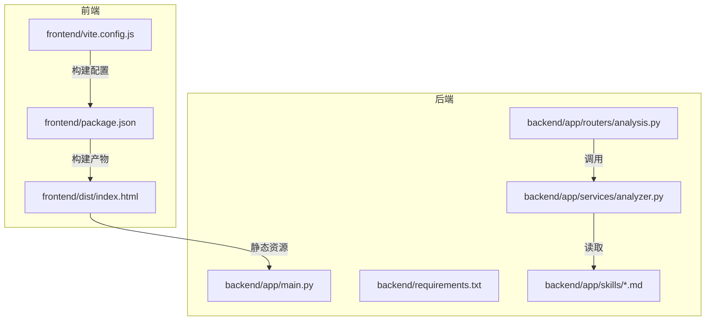
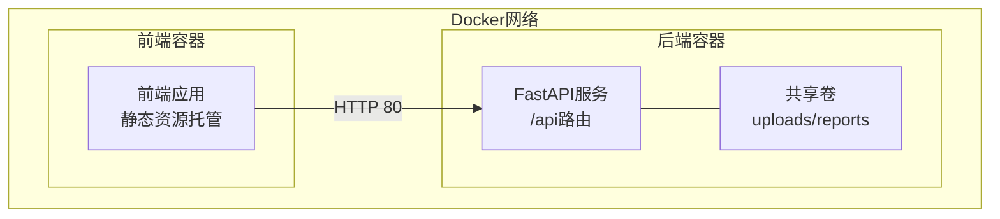
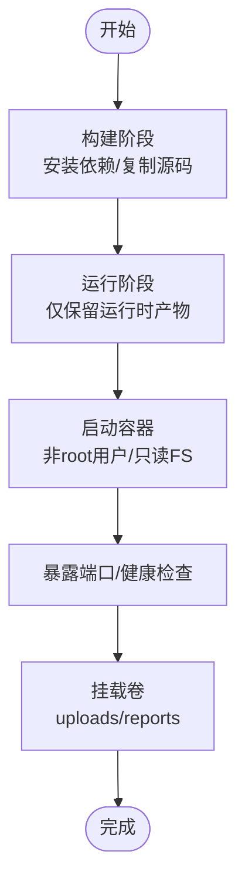
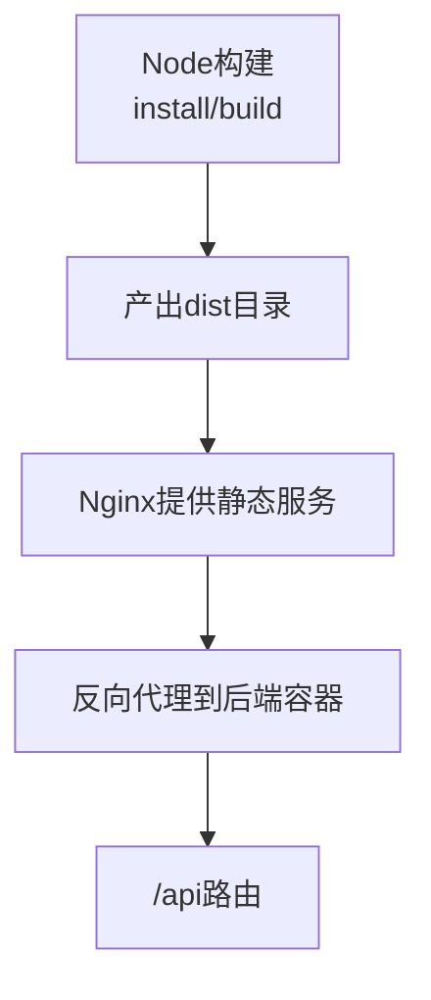
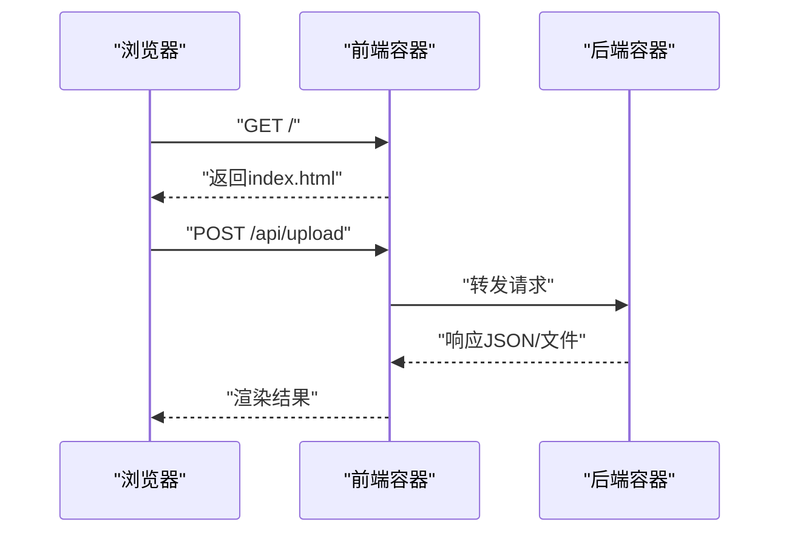
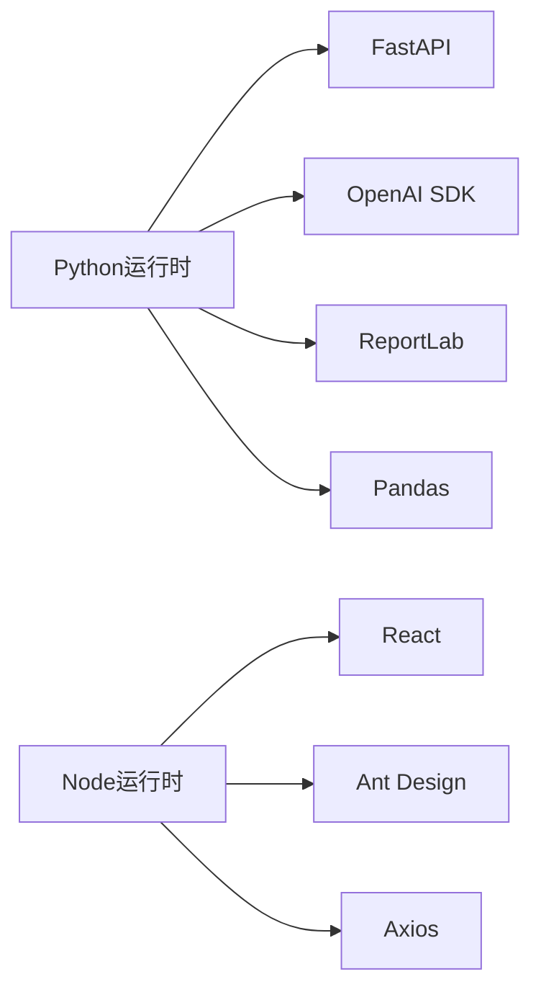

# Docker容器化部署

<cite>
**本文引用的文件**
- [backend/app/main.py](file://backend/app/main.py)
- [backend/requirements.txt](file://backend/requirements.txt)
- [backend/app/routers/analysis.py](file://backend/app/routers/analysis.py)
- [backend/app/services/analyzer.py](file://backend/app/services/analyzer.py)
- [backend/app/skills/report_template.md](file://backend/app/skills/report_template.md)
- [backend/app/skills/asset_analysis.md](file://backend/app/skills/asset_analysis.md)
- [backend/app/skills/trade_behavior.md](file://backend/app/skills/trade_behavior.md)
- [frontend/package.json](file://frontend/package.json)
- [frontend/vite.config.js](file://frontend/vite.config.js)
- [frontend/src/services/api.js](file://frontend/src/services/api.js)
- [frontend/dist/index.html](file://frontend/dist/index.html)
</cite>

## 目录
1. [简介](#简介)
2. [项目结构](#项目结构)
3. [核心组件](#核心组件)
4. [架构总览](#架构总览)
5. [详细组件分析](#详细组件分析)
6. [依赖分析](#依赖分析)
7. [性能考虑](#性能考虑)
8. [故障排查指南](#故障排查指南)
9. [结论](#结论)
10. [附录](#附录)

## 简介
本指南面向Qoder-todo项目，提供从零到一的Docker容器化部署方案。项目包含一个基于FastAPI的后端服务与一个React/Vite前端应用，二者通过HTTP API交互。本指南涵盖：
- 多阶段Dockerfile设计，优化镜像体积与安全性
- docker-compose编排前后端、网络与持久化卷
- 容器间通信与服务发现
- 生产环境最佳实践（资源限制、健康检查、日志）
- 安全加固与镜像版本管理策略

## 项目结构
项目采用前后端分离架构：
- 后端：Python + FastAPI，提供REST API，处理文件上传、分析任务与PDF导出
- 前端：React + Vite，打包产物位于dist目录，静态托管于后端
- 服务间通信：前端通过固定后端API域名访问后端服务

图表来源
- [backend/app/main.py:1-28](file://backend/app/main.py#L1-L28)
- [backend/requirements.txt:1-9](file://backend/requirements.txt#L1-L9)
- [backend/app/routers/analysis.py:1-218](file://backend/app/routers/analysis.py#L1-L218)
- [backend/app/services/analyzer.py:1-93](file://backend/app/services/analyzer.py#L1-L93)
- [backend/app/skills/report_template.md:1-34](file://backend/app/skills/report_template.md#L1-L34)
- [frontend/package.json:1-32](file://frontend/package.json#L1-L32)
- [frontend/vite.config.js:1-8](file://frontend/vite.config.js#L1-L8)
- [frontend/dist/index.html:1-15](file://frontend/dist/index.html#L1-L15)

章节来源
- [backend/app/main.py:1-28](file://backend/app/main.py#L1-L28)
- [backend/requirements.txt:1-9](file://backend/requirements.txt#L1-L9)
- [frontend/package.json:1-32](file://frontend/package.json#L1-L32)
- [frontend/vite.config.js:1-8](file://frontend/vite.config.js#L1-L8)
- [frontend/dist/index.html:1-15](file://frontend/dist/index.html#L1-L15)

## 核心组件
- 后端服务
  - 应用入口与路由注册：[backend/app/main.py:1-28](file://backend/app/main.py#L1-L28)
  - 依赖声明：[backend/requirements.txt:1-9](file://backend/requirements.txt#L1-L9)
  - 分析API与任务状态：[backend/app/routers/analysis.py:1-218](file://backend/app/routers/analysis.py#L1-L218)
  - 大模型调用与技能模板：[backend/app/services/analyzer.py:1-93](file://backend/app/services/analyzer.py#L1-L93)，[backend/app/skills/*.md:1-34](file://backend/app/skills/report_template.md#L1-L34)
- 前端应用
  - 构建脚本与依赖：[frontend/package.json:1-32](file://frontend/package.json#L1-L32)
  - Vite配置：[frontend/vite.config.js:1-8](file://frontend/vite.config.js#L1-L8)
  - API封装与后端地址常量：[frontend/src/services/api.js:1-48](file://frontend/src/services/api.js#L1-L48)
  - 打包产物入口：[frontend/dist/index.html:1-15](file://frontend/dist/index.html#L1-L15)

章节来源
- [backend/app/main.py:1-28](file://backend/app/main.py#L1-L28)
- [backend/requirements.txt:1-9](file://backend/requirements.txt#L1-L9)
- [backend/app/routers/analysis.py:1-218](file://backend/app/routers/analysis.py#L1-L218)
- [backend/app/services/analyzer.py:1-93](file://backend/app/services/analyzer.py#L1-L93)
- [frontend/src/services/api.js:1-48](file://frontend/src/services/api.js#L1-L48)
- [frontend/package.json:1-32](file://frontend/package.json#L1-L32)
- [frontend/vite.config.js:1-8](file://frontend/vite.config.js#L1-L8)
- [frontend/dist/index.html:1-15](file://frontend/dist/index.html#L1-L15)

## 架构总览
下图展示容器化后的系统拓扑：前端容器提供静态页面，后端容器承载API与分析逻辑；两者通过Docker网络互通；后端写入上传与报告文件至共享卷。

图表来源
- [backend/app/main.py:1-28](file://backend/app/main.py#L1-L28)
- [backend/app/routers/analysis.py:1-218](file://backend/app/routers/analysis.py#L1-L218)

## 详细组件分析

### 后端服务容器化设计
- 多阶段构建目标
  - 第一阶段：安装构建依赖，执行pip安装，复制技能模板与源码
  - 第二阶段：仅拷贝运行时依赖与构建产物，最小化运行镜像
- 关键点
  - 使用只读根文件系统与非root用户运行
  - 显式暴露端口与健康检查
  - 将上传与报告目录映射为持久化卷
  - 通过环境变量注入OpenAI凭据与基础URL

图表来源
- [backend/requirements.txt:1-9](file://backend/requirements.txt#L1-L9)
- [backend/app/skills/report_template.md:1-34](file://backend/app/skills/report_template.md#L1-L34)
- [backend/app/main.py:1-28](file://backend/app/main.py#L1-L28)

章节来源
- [backend/requirements.txt:1-9](file://backend/requirements.txt#L1-L9)
- [backend/app/main.py:1-28](file://backend/app/main.py#L1-L28)

### 前端服务容器化设计
- 构建阶段
  - 使用Node镜像执行npm install与vite build
  - 输出dist目录静态资源
- 运行阶段
  - 使用Nginx或轻量HTTP服务器提供静态文件
  - 将后端API通过反向代理转发至后端容器

图表来源
- [frontend/package.json:1-32](file://frontend/package.json#L1-L32)
- [frontend/vite.config.js:1-8](file://frontend/vite.config.js#L1-L8)
- [frontend/dist/index.html:1-15](file://frontend/dist/index.html#L1-L15)

章节来源
- [frontend/package.json:1-32](file://frontend/package.json#L1-L32)
- [frontend/vite.config.js:1-8](file://frontend/vite.config.js#L1-L8)
- [frontend/dist/index.html:1-15](file://frontend/dist/index.html#L1-L15)

### 容器间通信与服务发现
- 网络与服务名
  - 在同一Docker网络内，前端通过服务名访问后端API
  - 前端API基础路径在构建时固化，需与后端容器服务名一致
- 端口映射
  - 前端容器对外暴露HTTP端口
  - 后端容器仅内部使用，不直接对外暴露

图表来源
- [frontend/src/services/api.js:1-48](file://frontend/src/services/api.js#L1-L48)
- [backend/app/routers/analysis.py:1-218](file://backend/app/routers/analysis.py#L1-L218)

章节来源
- [frontend/src/services/api.js:1-48](file://frontend/src/services/api.js#L1-L48)
- [backend/app/routers/analysis.py:1-218](file://backend/app/routers/analysis.py#L1-L218)

### docker-compose编排要点
- 服务
  - 前端服务：构建静态站点，反向代理后端
  - 后端服务：FastAPI，挂载上传与报告卷
- 网络
  - 自定义桥接网络，确保服务名可达
- 卷
  - uploads与reports目录持久化，便于调试与数据保留
- 环境变量
  - 后端：OPENAI_API_KEY、OPENAI_BASE_URL、OPENAI_MODEL
  - 可选：CORS允许来源、端口等

章节来源
- [backend/app/main.py:1-28](file://backend/app/main.py#L1-L28)
- [backend/app/routers/analysis.py:1-218](file://backend/app/routers/analysis.py#L1-L218)
- [frontend/src/services/api.js:1-48](file://frontend/src/services/api.js#L1-L48)

## 依赖分析
- 后端依赖
  - FastAPI、Uvicorn、OpenAI SDK、ReportLab、Pandas、OpenPyXL、Matplotlib
- 前端依赖
  - React、Ant Design、Axios、Vite、ESLint等
- 容器化影响
  - 多阶段构建减少运行时镜像体积
  - 仅在运行阶段保留必要运行时库

图表来源
- [backend/requirements.txt:1-9](file://backend/requirements.txt#L1-L9)
- [frontend/package.json:1-32](file://frontend/package.json#L1-L32)

章节来源
- [backend/requirements.txt:1-9](file://backend/requirements.txt#L1-L9)
- [frontend/package.json:1-32](file://frontend/package.json#L1-L32)

## 性能考虑
- 镜像层优化
  - 将变更频率低的依赖层放在前面，利用缓存
  - 清理包管理器缓存与开发依赖
- 运行时优化
  - 后端并发：根据CPU核数设置workers与threads
  - 前端静态资源启用压缩与缓存头
- I/O与存储
  - 将上传与报告目录映射为高性能卷
  - 控制日志轮转，避免磁盘打满

## 故障排查指南
- 常见问题定位
  - CORS错误：确认后端CORS配置与前端服务名一致
  - API 404：检查路由前缀与容器间网络连通性
  - 分析失败：查看后端容器日志，确认OpenAI凭据与网络可达
- 日志与监控
  - 后端：Uvicorn访问日志与业务异常栈
  - 前端：浏览器开发者工具Network面板
- 健康检查
  - 添加HTTP健康检查端点，定期探测后端存活

章节来源
- [backend/app/main.py:1-28](file://backend/app/main.py#L1-L28)
- [backend/app/routers/analysis.py:1-218](file://backend/app/routers/analysis.py#L1-L218)
- [frontend/src/services/api.js:1-48](file://frontend/src/services/api.js#L1-L48)

## 结论
通过多阶段构建与compose编排，Qoder-todo可在Docker中实现高效、安全、可维护的部署。生产环境建议结合资源限制、健康检查与日志策略，持续迭代镜像版本与依赖更新。

## 附录

### Dockerfile编写要点（后端）
- 分离构建与运行阶段，仅复制运行所需文件
- 设置非root用户与只读根文件系统
- 暴露端口并添加健康检查
- 挂载uploads与reports卷用于持久化

章节来源
- [backend/requirements.txt:1-9](file://backend/requirements.txt#L1-L9)
- [backend/app/main.py:1-28](file://backend/app/main.py#L1-L28)

### Dockerfile编写要点（前端）
- Node阶段安装依赖并构建静态资源
- Nginx阶段提供静态文件与反向代理
- 配置Gzip/缓存头提升性能

章节来源
- [frontend/package.json:1-32](file://frontend/package.json#L1-L32)
- [frontend/vite.config.js:1-8](file://frontend/vite.config.js#L1-L8)
- [frontend/dist/index.html:1-15](file://frontend/dist/index.html#L1-L15)

### docker-compose.yml关键字段
- 服务：前端与后端
- networks：自定义桥接网络
- volumes：uploads与reports卷
- environment：OpenAI凭据与模型参数
- healthcheck：HTTP探针
- deploy.resources：限制CPU/内存

章节来源
- [backend/app/main.py:1-28](file://backend/app/main.py#L1-L28)
- [backend/app/routers/analysis.py:1-218](file://backend/app/routers/analysis.py#L1-L218)
- [frontend/src/services/api.js:1-48](file://frontend/src/services/api.js#L1-L48)

### 生产环境最佳实践
- 资源限制：设置CPU/内存上限，避免资源争抢
- 健康检查：定期探测API可用性
- 日志：集中化收集与轮转，避免容器日志过大
- 网络：最小权限原则，仅开放必要端口
- 配置：敏感信息通过密钥管理服务注入

### 安全加固建议
- 非root运行、只读文件系统、丢弃不必要的Linux功能
- 限制容器能力（capabilities），禁用SYS_ADMIN等
- 使用私有镜像仓库与镜像签名
- 定期扫描镜像漏洞并更新依赖

### 镜像版本管理策略
- 语义化版本：主版本反映重大变更，次版本用于兼容更新，修订版本用于修复
- 固定依赖版本：在requirements与package.json中锁定版本
- CI/CD流水线：自动构建、测试、扫描与发布标签