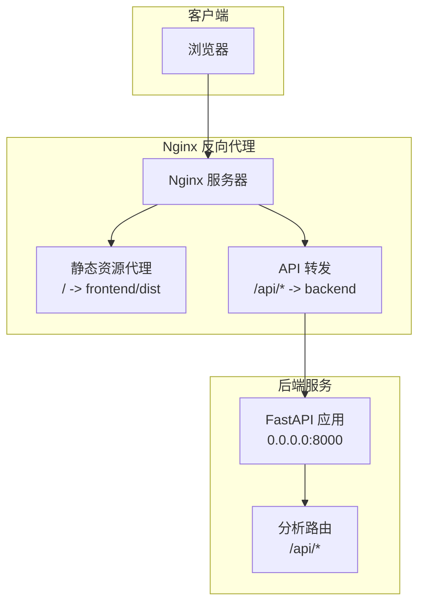
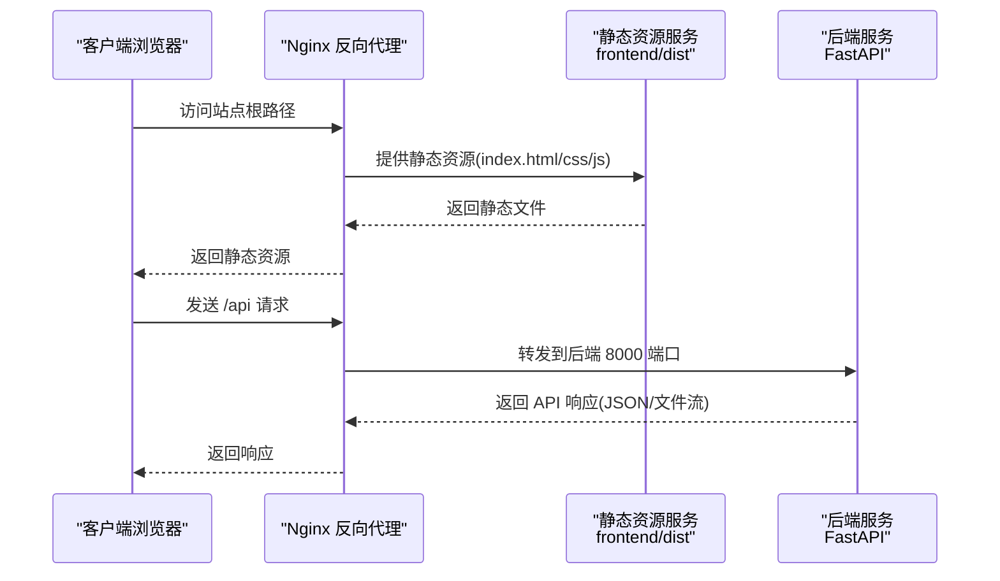
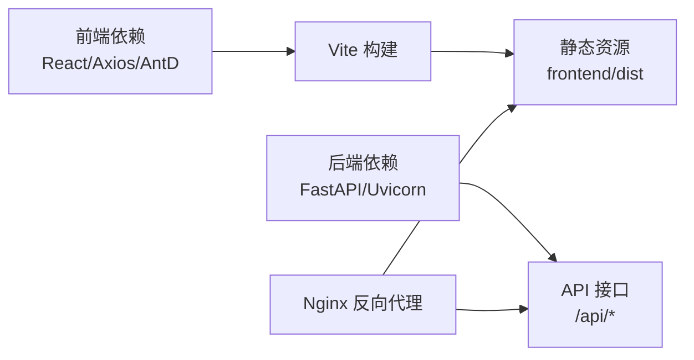

# Nginx反向代理配置

<cite>
**本文档引用的文件**
- [backend/app/main.py](file://backend/app/main.py)
- [backend/app/routers/analysis.py](file://backend/app/routers/analysis.py)
- [frontend/src/services/api.js](file://frontend/src/services/api.js)
- [frontend/dist/index.html](file://frontend/dist/index.html)
- [backend/requirements.txt](file://backend/requirements.txt)
- [frontend/package.json](file://frontend/package.json)
- [frontend/vite.config.js](file://frontend/vite.config.js)
</cite>

## 目录
1. [简介](#简介)
2. [项目结构](#项目结构)
3. [核心组件](#核心组件)
4. [架构总览](#架构总览)
5. [详细组件分析](#详细组件分析)
6. [依赖关系分析](#依赖关系分析)
7. [性能考虑](#性能考虑)
8. [故障排除指南](#故障排除指南)
9. [结论](#结论)
10. [附录](#附录)

## 简介
本指南面向前后端分离项目的部署场景，提供基于 Nginx 的反向代理配置方案。通过该方案，前端静态资源由 Nginx 直接提供，后端 API 请求由 Nginx 转发至后端服务，实现统一入口、跨域处理、安全头设置、SSL/TLS 证书配置以及性能优化（如 gzip 压缩、缓存策略、连接池等）。同时给出负载均衡与高可用部署建议。

## 项目结构
该项目采用典型的前后端分离架构：
- 前端：React + Vite 构建产物位于 `frontend/dist`，包含 HTML、CSS、JS 静态资源。
- 后端：FastAPI 应用，提供 `/api` 前缀的 REST 接口，支持文件上传、分析任务、PDF 下载等功能。
- 开发与运行：前端通过 Vite 开发服务器提供本地调试；后端通过 Uvicorn 运行在 8000 端口。

**图表来源**
- [backend/app/main.py:23](file://backend/app/main.py#L23)
- [backend/app/routers/analysis.py:14](file://backend/app/routers/analysis.py#L14)
- [frontend/dist/index.html:1-15](file://frontend/dist/index.html#L1-L15)

**章节来源**
- [backend/app/main.py:1-28](file://backend/app/main.py#L1-L28)
- [backend/app/routers/analysis.py:1-218](file://backend/app/routers/analysis.py#L1-L218)
- [frontend/dist/index.html:1-15](file://frontend/dist/index.html#L1-L15)

## 核心组件
- 前端静态资源：由 Nginx 直接提供，路径映射到 `frontend/dist`。
- 后端 API：以 `/api` 为前缀，Nginx 将匹配的请求转发至后端服务（默认 8000 端口）。
- CORS 与安全头：后端已启用跨域中间件，Nginx 层面可补充安全响应头。
- SSL/TLS：建议在 Nginx 层启用 HTTPS，并使用 Let's Encrypt 自动化证书管理。
- 性能优化：开启 gzip 压缩、静态资源缓存、连接池与超时参数调优。

**章节来源**
- [backend/app/main.py:10-16](file://backend/app/main.py#L10-L16)
- [frontend/src/services/api.js:3](file://frontend/src/services/api.js#L3)

## 架构总览
下图展示从浏览器到后端服务的完整请求链路，包括 Nginx 的静态资源与 API 转发逻辑。

**图表来源**
- [frontend/dist/index.html:8-9](file://frontend/dist/index.html#L8-L9)
- [backend/app/main.py:23](file://backend/app/main.py#L23)
- [backend/app/routers/analysis.py:137-152](file://backend/app/routers/analysis.py#L137-L152)

## 详细组件分析

### 前端静态资源代理
- 目标：将对站点根路径的请求直接指向 `frontend/dist`，确保 HTML、CSS、JS 正常加载。
- 关键点：
  - 静态资源路径与构建产物一致。
  - 对于 SPA（单页应用），建议回退到 index.html，保证路由刷新不返回 404。
- 参考路径：
  - [frontend/dist/index.html:1-15](file://frontend/dist/index.html#L1-L15)

**章节来源**
- [frontend/dist/index.html:1-15](file://frontend/dist/index.html#L1-L15)

### API 请求转发规则
- 目标：将所有以 `/api` 开头的请求转发至后端服务（默认 8000 端口）。
- 后端路由：
  - 文件上传：POST `/api/upload`
  - 触发分析：POST `/api/analyze`
  - 重新生成：POST `/api/analyze/{task_id}/regenerate`
  - 查询任务：GET `/api/task/{task_id}`
  - 下载报告：GET `/api/report/{task_id}/pdf`
- 前端调用示例：
  - 基础地址：`http://localhost:8000/api`
  - 上传文件、分析任务、下载 PDF 等均通过该前缀访问。
- 参考路径：
  - [backend/app/routers/analysis.py:35-83](file://backend/app/routers/analysis.py#L35-L83)
  - [backend/app/routers/analysis.py:86-134](file://backend/app/routers/analysis.py#L86-L134)
  - [backend/app/routers/analysis.py:155-199](file://backend/app/routers/analysis.py#L155-L199)
  - [backend/app/routers/analysis.py:202-217](file://backend/app/routers/analysis.py#L202-L217)
  - [frontend/src/services/api.js:3](file://frontend/src/services/api.js#L3)

**章节来源**
- [backend/app/routers/analysis.py:1-218](file://backend/app/routers/analysis.py#L1-L218)
- [frontend/src/services/api.js:1-41](file://frontend/src/services/api.js#L1-L41)

### CORS 跨域配置
- 后端已启用通用跨域中间件，允许任意来源、方法与头部。
- 在 Nginx 层可进一步细化跨域策略（如仅允许特定域名），并统一添加安全响应头。
- 参考路径：
  - [backend/app/main.py:10-16](file://backend/app/main.py#L10-L16)

**章节来源**
- [backend/app/main.py:10-16](file://backend/app/main.py#L10-L16)

### 安全头设置
- 建议在 Nginx 中添加安全响应头，如 X-Frame-Options、X-Content-Type-Options、Referrer-Policy、Strict-Transport-Security（HTTPS 环境）等。
- 具体头内容可根据企业安全策略调整。

[本节为通用实践说明，无需源码引用]

### SSL/TLS 证书申请与配置
- 使用 Let's Encrypt 获取免费证书，推荐通过 certbot 自动化签发与续期。
- 在 Nginx 中启用 HTTPS，配置证书路径与私钥路径。
- 建议强制跳转到 HTTPS，启用现代加密套件与 TLS 版本。
- 参考路径：
  - [backend/requirements.txt:1-9](file://backend/requirements.txt#L1-L9)

**章节来源**
- [backend/requirements.txt:1-9](file://backend/requirements.txt#L1-L9)

### 性能优化配置
- gzip 压缩：对文本类资源启用压缩，降低带宽占用。
- 缓存策略：静态资源设置长缓存，HTML 设置短缓存或禁用缓存，结合文件指纹实现更新。
- 连接池与超时：合理设置 proxy_connect_timeout、proxy_send_timeout、proxy_read_timeout，避免长时间请求阻塞。
- 参考路径：
  - [frontend/package.json:6-11](file://frontend/package.json#L6-L11)
  - [frontend/vite.config.js:1-8](file://frontend/vite.config.js#L1-L8)

**章节来源**
- [frontend/package.json:1-32](file://frontend/package.json#L1-L32)
- [frontend/vite.config.js:1-8](file://frontend/vite.config.js#L1-L8)

### 负载均衡与高可用部署
- 多实例后端：在多台服务器上部署后端服务实例，Nginx 作为上游负载均衡器。
- 健康检查：结合 keepalived 或外部监控，自动摘除故障节点。
- 会话与共享状态：若业务需要，建议使用集中式缓存（如 Redis）或无状态设计。
- 参考路径：
  - [backend/app/main.py:25-27](file://backend/app/main.py#L25-L27)

**章节来源**
- [backend/app/main.py:25-27](file://backend/app/main.py#L25-L27)

## 依赖关系分析
- 前端依赖：React、Axios、Ant Design 等，构建脚本由 Vite 提供。
- 后端依赖：FastAPI、Uvicorn、pandas、matplotlib 等，用于数据分析与 Web 服务。
- Nginx 作为统一入口，依赖前端静态资源与后端 API。

**图表来源**
- [frontend/package.json:12-30](file://frontend/package.json#L12-L30)
- [backend/requirements.txt:1-9](file://backend/requirements.txt#L1-9)

**章节来源**
- [frontend/package.json:1-32](file://frontend/package.json#L1-L32)
- [backend/requirements.txt:1-9](file://backend/requirements.txt#L1-L9)

## 性能考虑
- 静态资源：启用 gzip 压缩与浏览器缓存，减少重复传输。
- API 请求：合理设置超时时间，避免长时间阻塞；对大文件上传与下载进行分片或断点续传（可在应用层实现）。
- 连接池：Nginx 与后端均可配置连接池参数，提升并发处理能力。
- 日志与监控：开启访问日志与错误日志，定期分析慢请求与错误趋势。

[本节为通用性能指导，无需源码引用]

## 故障排除指南
- CORS 错误：确认后端已启用跨域中间件，必要时在 Nginx 层补充允许的来源与方法。
- 静态资源 404：检查 Nginx 静态资源根目录与构建产物路径是否一致。
- API 502/504：检查后端服务是否正常运行，Nginx 转发目标地址与端口是否正确，适当调整超时参数。
- 证书问题：确认证书与私钥路径正确，权限设置合理，域名解析与防火墙放行。

**章节来源**
- [backend/app/main.py:10-16](file://backend/app/main.py#L10-L16)
- [backend/app/main.py:25-27](file://backend/app/main.py#L25-L27)

## 结论
通过 Nginx 实现前后端分离项目的统一入口，既能高效提供静态资源，又能可靠转发 API 请求。结合 CORS、安全头、SSL/TLS 与性能优化配置，可显著提升用户体验与安全性。配合负载均衡与高可用部署，可满足生产环境的稳定性与扩展性需求。

[本节为总结性内容，无需源码引用]

## 附录
- 前端构建与开发脚本参考：
  - [frontend/package.json:6-11](file://frontend/package.json#L6-L11)
  - [frontend/vite.config.js:1-8](file://frontend/vite.config.js#L1-L8)
- 后端运行与依赖参考：
  - [backend/app/main.py:25-27](file://backend/app/main.py#L25-L27)
  - [backend/requirements.txt:1-9](file://backend/requirements.txt#L1-L9)

**章节来源**
- [frontend/package.json:1-32](file://frontend/package.json#L1-L32)
- [frontend/vite.config.js:1-8](file://frontend/vite.config.js#L1-L8)
- [backend/app/main.py:25-27](file://backend/app/main.py#L25-L27)
- [backend/requirements.txt:1-9](file://backend/requirements.txt#L1-L9)