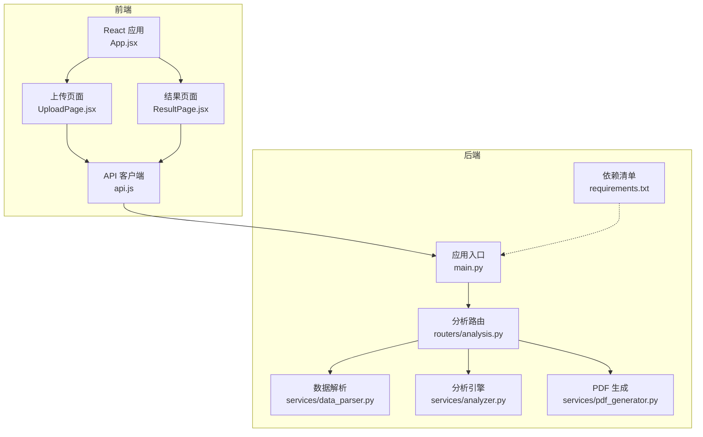
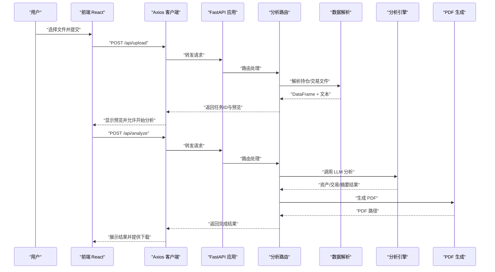
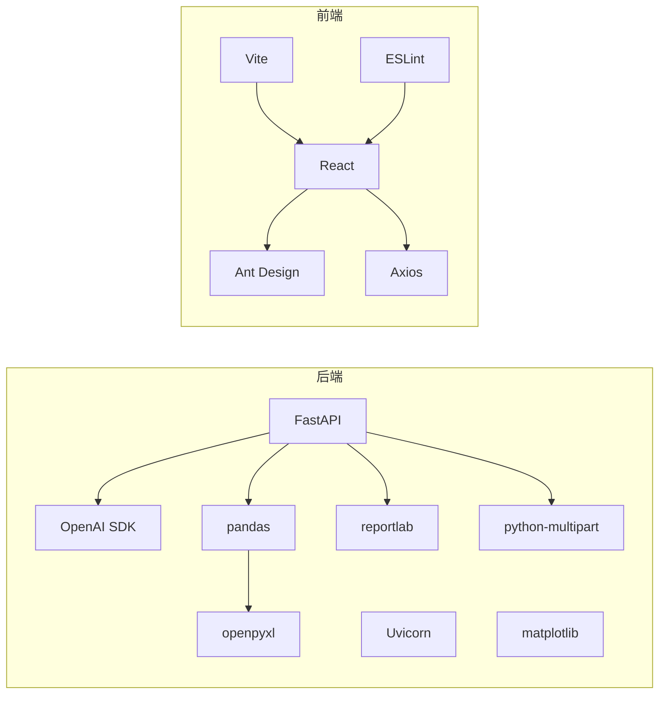

# 性能优化

<cite>
**本文引用的文件**
- [backend/app/main.py](file://backend/app/main.py)
- [backend/requirements.txt](file://backend/requirements.txt)
- [backend/app/routers/analysis.py](file://backend/app/routers/analysis.py)
- [backend/app/services/analyzer.py](file://backend/app/services/analyzer.py)
- [backend/app/services/data_parser.py](file://backend/app/services/data_parser.py)
- [backend/app/services/pdf_generator.py](file://backend/app/services/pdf_generator.py)
- [backend/app/skills/report_template.md](file://backend/app/skills/report_template.md)
- [backend/app/skills/asset_analysis.md](file://backend/app/skills/asset_analysis.md)
- [backend/app/skills/trade_behavior.md](file://backend/app/skills/trade_behavior.md)
- [frontend/package.json](file://frontend/package.json)
- [frontend/vite.config.js](file://frontend/vite.config.js)
- [frontend/src/services/api.js](file://frontend/src/services/api.js)
- [frontend/src/App.jsx](file://frontend/src/App.jsx)
- [frontend/src/components/UploadPage.jsx](file://frontend/src/components/UploadPage.jsx)
- [frontend/src/components/ResultPage.jsx](file://frontend/src/components/ResultPage.jsx)
</cite>

## 目录
1. [简介](#简介)
2. [项目结构](#项目结构)
3. [核心组件](#核心组件)
4. [架构总览](#架构总览)
5. [详细组件分析](#详细组件分析)
6. [依赖分析](#依赖分析)
7. [性能考虑](#性能考虑)
8. [故障排查指南](#故障排查指南)
9. [结论](#结论)
10. [附录](#附录)

## 简介
本指南聚焦于 Qoder-todo 项目的性能优化，覆盖后端（FastAPI/Uvicorn）、数据库连接池、文件 I/O、前端（Vite 打包与静态资源）、内存与进程管理、缓存策略（Redis/浏览器缓存）、性能监控与基准测试、以及负载与压力测试实施方案。目标是在保证功能正确性的前提下，显著降低端到端延迟、提升吞吐量，并增强稳定性与可维护性。

## 项目结构
项目采用前后端分离架构：
- 后端基于 FastAPI，提供分析相关的上传、解析、LLM 分析与 PDF 报告生成接口。
- 前端基于 Vite + React，通过 Axios 调用后端 API，展示上传、分析与结果页面。
- 数据解析使用 pandas，报告生成使用 ReportLab，LLM 调用通过 OpenAI SDK。

图表来源
- [backend/app/main.py:1-28](file://backend/app/main.py#L1-L28)
- [backend/app/routers/analysis.py:1-218](file://backend/app/routers/analysis.py#L1-L218)
- [backend/app/services/data_parser.py:1-96](file://backend/app/services/data_parser.py#L1-L96)
- [backend/app/services/analyzer.py:1-93](file://backend/app/services/analyzer.py#L1-L93)
- [backend/app/services/pdf_generator.py:1-215](file://backend/app/services/pdf_generator.py#L1-L215)
- [frontend/src/App.jsx:1-81](file://frontend/src/App.jsx#L1-L81)
- [frontend/src/components/UploadPage.jsx:1-145](file://frontend/src/components/UploadPage.jsx#L1-L145)
- [frontend/src/components/ResultPage.jsx:1-193](file://frontend/src/components/ResultPage.jsx#L1-L193)
- [frontend/src/services/api.js:1-41](file://frontend/src/services/api.js#L1-L41)

章节来源
- [backend/app/main.py:1-28](file://backend/app/main.py#L1-L28)
- [frontend/package.json:1-32](file://frontend/package.json#L1-L32)

## 核心组件
- 应用入口与中间件：设置 CORS、静态目录挂载、路由注册与 Uvicorn 启动参数。
- 分析路由：文件上传、任务状态管理、触发分析、重新生成、PDF 下载。
- 数据解析：CSV/Excel 解析、列标准化、派生字段计算、文本化供 LLM 使用。
- 分析引擎：读取技能模板、构建系统/用户提示、调用 OpenAI API、汇总结果。
- PDF 生成：中文字体注册、样式定义、Markdown 渲染、多页文档构建。
- 前端 API：Axios 实例、超时配置、上传、分析、下载、轮询状态。

章节来源
- [backend/app/main.py:1-28](file://backend/app/main.py#L1-L28)
- [backend/app/routers/analysis.py:1-218](file://backend/app/routers/analysis.py#L1-L218)
- [backend/app/services/data_parser.py:1-96](file://backend/app/services/data_parser.py#L1-L96)
- [backend/app/services/analyzer.py:1-93](file://backend/app/services/analyzer.py#L1-L93)
- [backend/app/services/pdf_generator.py:1-215](file://backend/app/services/pdf_generator.py#L1-L215)
- [frontend/src/services/api.js:1-41](file://frontend/src/services/api.js#L1-L41)

## 架构总览
后端采用异步 Web 框架 FastAPI，路由层负责文件 I/O 与任务状态，服务层负责数据解析与 LLM 调用，PDF 服务负责报告生成。前端通过 Axios 发起请求，使用 Ant Design 组件展示进度与结果。

图表来源
- [backend/app/routers/analysis.py:35-152](file://backend/app/routers/analysis.py#L35-L152)
- [backend/app/services/data_parser.py:7-95](file://backend/app/services/data_parser.py#L7-L95)
- [backend/app/services/analyzer.py:41-92](file://backend/app/services/analyzer.py#L41-L92)
- [backend/app/services/pdf_generator.py:146-214](file://backend/app/services/pdf_generator.py#L146-L214)
- [frontend/src/services/api.js:10-38](file://frontend/src/services/api.js#L10-L38)

## 详细组件分析

### 后端：Uvicorn 异步服务器配置
- 当前启动方式：直接通过 Uvicorn 运行应用实例，未显式设置并发 worker 数与 HTTP 协议参数。
- 优化建议：
  - 使用 ASGI 生产服务器（如 Hypercorn 或 Daphne）替代开发模式。
  - 设置合适的 workers 与 threads，结合 CPU 核心数与 I/O 密集特性权衡。
  - 启用 HTTP/2 与 keep-alive，减少握手开销。
  - 配置访问日志级别与采样，避免生产环境过多 I/O。
  - 在容器部署时限制内存与 CPU，配合进程管理器（如 systemd/caddy）实现健康检查与自动重启。

章节来源
- [backend/app/main.py:25-28](file://backend/app/main.py#L25-L28)

### 后端：数据库连接池优化
- 现状：当前未引入数据库连接池，所有分析与文件 I/O 为内存态与本地磁盘。
- 优化建议：
  - 若后续接入数据库，统一使用连接池（如 SQLAlchemy Engine 池化），设置最大连接数、空闲连接、连接超时与回收策略。
  - 对长事务与批量写入使用事务块与批处理，减少锁竞争。
  - 使用只读副本分担查询压力，主从分离。
  - 对热点表建立合适索引，避免全表扫描。

章节来源
- [backend/app/routers/analysis.py:16-17](file://backend/app/routers/analysis.py#L16-L17)

### 后端：文件 I/O 性能提升
- 现状：上传文件直接写入本地磁盘，未使用流式处理与缓冲优化。
- 优化建议：
  - 使用流式写入与分块读取，避免一次性将大文件读入内存。
  - 对 CSV/Excel 使用惰性解析（如分块读取），仅在必要时转为 DataFrame。
  - 上传目录与报告目录使用高性能磁盘（SSD），并开启同步写入策略。
  - 对临时文件使用内存映射或临时分区，缩短落盘时间。
  - 并发上传场景下，为不同任务分配独立子目录，减少目录锁争用。

章节来源
- [backend/app/routers/analysis.py:25-32](file://backend/app/routers/analysis.py#L25-L32)
- [backend/app/routers/analysis.py:19-22](file://backend/app/routers/analysis.py#L19-L22)

### 后端：LLM 调用与缓存
- 现状：每次分析均调用外部 LLM，未实现缓存。
- 优化建议：
  - 对相同输入（标准化后的文本+客户名+反馈）建立 LLM 请求缓存，命中则直接返回缓存结果。
  - 使用 Redis 缓存键：哈希输入指纹 + 模型参数，设置 TTL。
  - 对长上下文分段处理，避免单次请求过长导致超时。
  - 引入重试与指数退避，对网络抖动与限流友好。

章节来源
- [backend/app/services/analyzer.py:25-38](file://backend/app/services/analyzer.py#L25-L38)
- [backend/app/skills/report_template.md:1-34](file://backend/app/skills/report_template.md#L1-L34)
- [backend/app/skills/asset_analysis.md:1-35](file://backend/app/skills/asset_analysis.md#L1-L35)
- [backend/app/skills/trade_behavior.md:1-34](file://backend/app/skills/trade_behavior.md#L1-L34)

### 后端：PDF 生成性能
- 现状：ReportLab 逐段渲染，字体注册在首次使用时进行，存在重复注册开销。
- 优化建议：
  - 预注册常用字体，避免运行时动态查找。
  - 复用样式对象与表格样式，减少重复构造。
  - 对长文本使用流式渲染，分页时尽量避免回溯。
  - 将 PDF 生成放入后台队列（Celery/异步任务），完成后通知前端。

章节来源
- [backend/app/services/pdf_generator.py:26-51](file://backend/app/services/pdf_generator.py#L26-L51)
- [backend/app/services/pdf_generator.py:109-143](file://backend/app/services/pdf_generator.py#L109-L143)

### 前端：React 应用打包优化
- 现状：使用 Vite 默认配置，未启用产物压缩与 Tree Shaking 优化。
- 优化建议：
  - 启用生产模式构建，开启代码分割与懒加载（路由级与组件级）。
  - 使用现代 JS 语法与浏览器兼容策略，减少 polyfill。
  - 移除未使用依赖，确保依赖版本更新至安全且稳定的范围。
  - 对第三方库（如 Ant Design）按需引入，避免全局样式与脚本。

章节来源
- [frontend/vite.config.js:1-8](file://frontend/vite.config.js#L1-L8)
- [frontend/package.json:1-32](file://frontend/package.json#L1-L32)

### 前端：静态资源压缩与 CDN
- 现状：未配置静态资源压缩与 CDN。
- 优化建议：
  - 构建产物启用 gzip/brotli 压缩，设置合适的缓存头。
  - 将静态资源托管至 CDN，利用缓存与边缘节点加速。
  - 对图片与图标使用 WebP/SVG，减小体积。
  - 使用 HTTP/2 多路复用与持久连接，减少阻塞。

章节来源
- [frontend/vite.config.js:1-8](file://frontend/vite.config.js#L1-L8)

### 前端：API 超时与并发控制
- 现状：Axios 超时设为 5 分钟，分析过程可能较长。
- 优化建议：
  - 对上传与分析分别设置超时，避免长时间占用连接。
  - 引入请求去重与并发上限控制，防止风暴请求。
  - 对轮询状态接口增加退避策略与最大重试次数。

章节来源
- [frontend/src/services/api.js:5-8](file://frontend/src/services/api.js#L5-L8)
- [frontend/src/components/ResultPage.jsx:22-35](file://frontend/src/components/ResultPage.jsx#L22-L35)

### 前端：UI 渲染与交互性能
- 现状：使用 Ant Design 组件，Markdown 渲染在主线程执行。
- 优化建议：
  - 对长列表使用虚拟滚动，减少 DOM 节点数量。
  - 将 Markdown 渲染放入 Web Worker 或使用轻量渲染库。
  - 合理拆分页面组件，使用 React.memo 与 useMemo 优化重渲染。

章节来源
- [frontend/src/components/UploadPage.jsx:60-68](file://frontend/src/components/UploadPage.jsx#L60-L68)
- [frontend/src/components/ResultPage.jsx:97-137](file://frontend/src/components/ResultPage.jsx#L97-L137)

## 依赖分析
- 后端依赖：FastAPI、Uvicorn、OpenAI SDK、pandas、openpyxl、matplotlib、reportlab、python-multipart。
- 前端依赖：React、Ant Design、Axios、Vite、ESLint、React Refresh 插件。

图表来源
- [backend/requirements.txt:1-9](file://backend/requirements.txt#L1-L9)
- [frontend/package.json:12-30](file://frontend/package.json#L12-L30)

章节来源
- [backend/requirements.txt:1-9](file://backend/requirements.txt#L1-L9)
- [frontend/package.json:1-32](file://frontend/package.json#L1-L32)

## 性能考虑

### 内存与进程管理最佳实践
- 后端：
  - 使用进程池/线程池处理 I/O 密集任务（如文件解析与 PDF 生成），避免阻塞事件循环。
  - 对大型 DataFrame 操作使用分块与 dtype 优化，减少内存峰值。
  - 使用弱引用与定时清理机制，避免任务字典无限增长。
- 前端：
  - 及时释放文件句柄与取消未完成的请求。
  - 对大表格与长列表使用虚拟化，避免一次性渲染大量节点。

章节来源
- [backend/app/routers/analysis.py:16-17](file://backend/app/routers/analysis.py#L16-L17)
- [backend/app/services/data_parser.py:7-52](file://backend/app/services/data_parser.py#L7-L52)

### 缓存策略实施
- Redis 缓存：
  - LLM 结果缓存：以输入指纹为键，模型参数与温度作为标签，设置 TTL。
  - 任务状态缓存：对高频查询的状态进行短时缓存。
- 浏览器缓存：
  - 对静态资源设置强缓存与 ETag，对 HTML 设置较短缓存。
  - 对 API 响应设置合理的 Cache-Control 与协商缓存。

章节来源
- [backend/app/services/analyzer.py:25-38](file://backend/app/services/analyzer.py#L25-L38)

### 性能监控指标与基准测试
- 指标建议：
  - 后端：请求延迟（P50/P90/P99）、错误率、并发连接数、CPU/内存使用、I/O 等待时间、LLM 调用耗时与成功率。
  - 前端：首屏时间、交互延迟、资源加载时间、重绘与回流次数。
- 基准测试：
  - 使用 wrk/JMeter 对上传与分析接口进行基准测试，覆盖不同文件大小与并发场景。
  - 使用 Lighthouse/Calibre 对前端性能进行基线评估。

章节来源
- [backend/app/routers/analysis.py:35-152](file://backend/app/routers/analysis.py#L35-L152)
- [frontend/src/services/api.js:5-8](file://frontend/src/services/api.js#L5-L8)

### 负载与压力测试实施方案
- 负载测试：
  - 逐步增加并发用户数，观察延迟与错误率拐点，定位瓶颈。
- 压力测试：
  - 模拟极端文件大小与异常数据，验证系统韧性与恢复能力。
- 自动化：
  - 将测试脚本集成至 CI/CD，每次发布前执行回归测试。

章节来源
- [backend/app/routers/analysis.py:35-152](file://backend/app/routers/analysis.py#L35-L152)
- [frontend/src/components/ResultPage.jsx:22-35](file://frontend/src/components/ResultPage.jsx#L22-L35)

## 故障排查指南
- 上传失败：
  - 检查文件类型与大小限制，确认上传目录权限。
- 解析异常：
  - 核对列名映射与编码，确保 CSV/Excel 格式一致。
- LLM 调用失败：
  - 检查 API Key、Base URL 与网络连通性，查看重试与超时配置。
- PDF 生成异常：
  - 确认中文字体注册路径与权限，检查输出目录可用空间。
- 前端卡顿：
  - 使用开发者工具分析渲染性能，优化长列表与 Markdown 渲染。

章节来源
- [backend/app/routers/analysis.py:51-64](file://backend/app/routers/analysis.py#L51-L64)
- [backend/app/services/analyzer.py:18-22](file://backend/app/services/analyzer.py#L18-L22)
- [backend/app/services/pdf_generator.py:31-51](file://backend/app/services/pdf_generator.py#L31-L51)
- [frontend/src/components/UploadPage.jsx:20-38](file://frontend/src/components/UploadPage.jsx#L20-L38)

## 结论
通过对后端 Uvicorn 配置、文件 I/O、LLM 调用与 PDF 生成的优化，以及前端打包、静态资源与 UI 渲染的改进，可以显著提升 Qoder-todo 的整体性能与用户体验。建议优先落地缓存与监控体系，再逐步引入数据库连接池与后台任务队列，最终形成完善的性能保障闭环。

## 附录
- 快速检查清单：
  - 后端：启用生产服务器、配置并发、启用 HTTP/2、设置日志采样。
  - 数据层：引入连接池、索引优化、只读副本。
  - I/O：流式处理、分块解析、SSD 存储、目录隔离。
  - LLM：缓存键设计、重试与退避、分段上下文。
  - PDF：预注册字体、样式复用、后台队列。
  - 前端：生产构建、按需引入、CDN、虚拟滚动。
  - 监控：指标采集、告警阈值、基准回归。