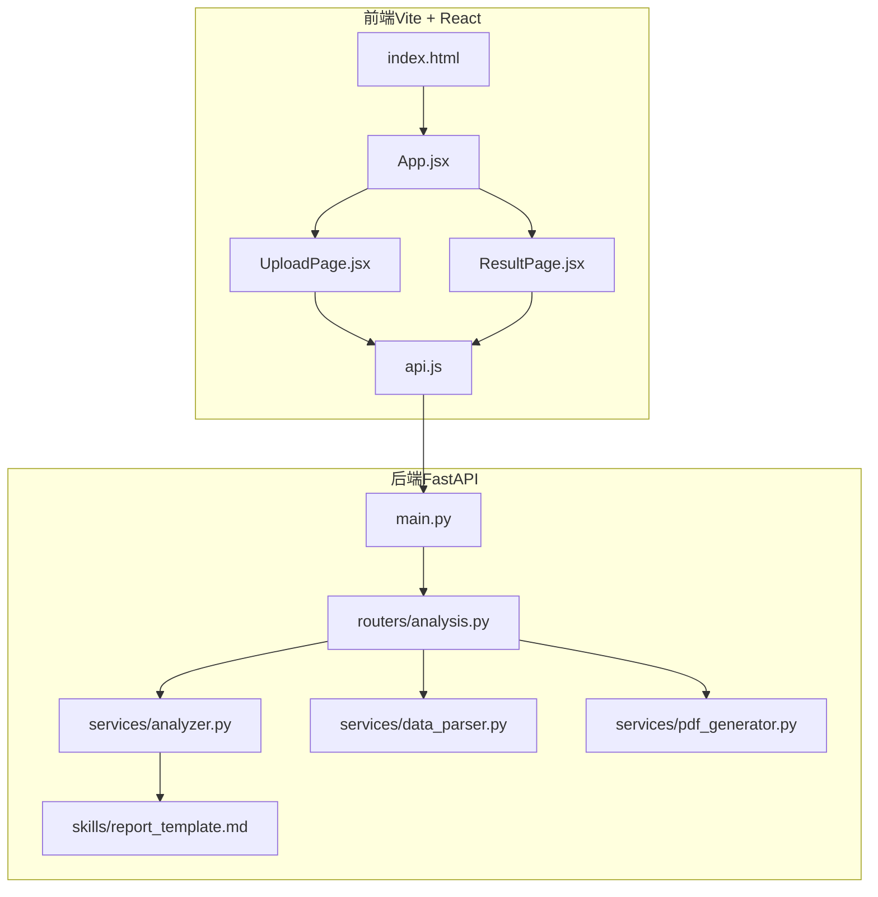
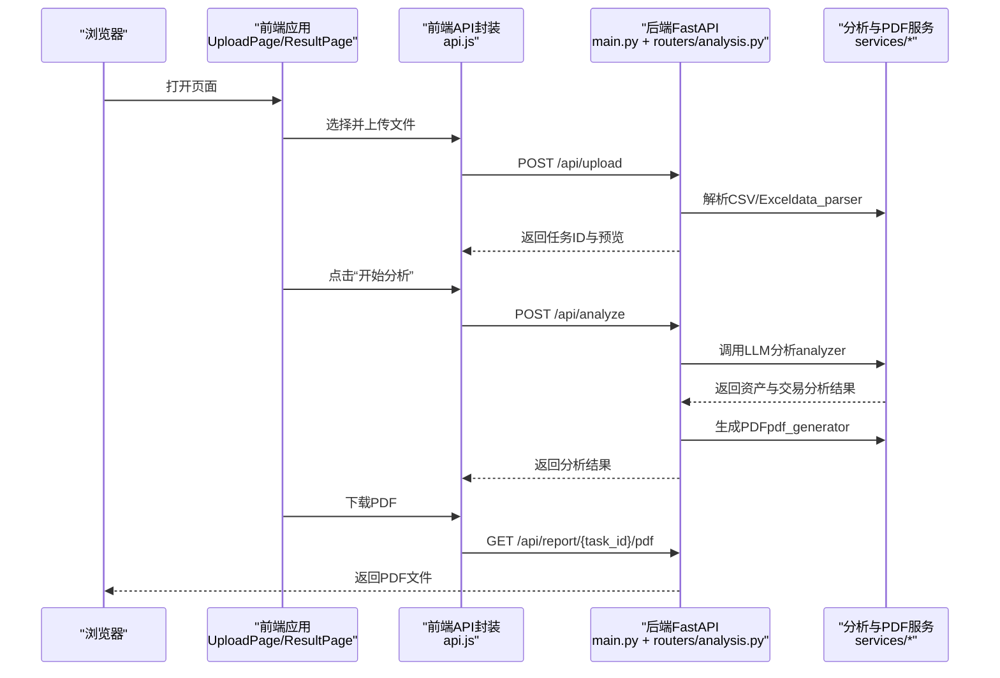
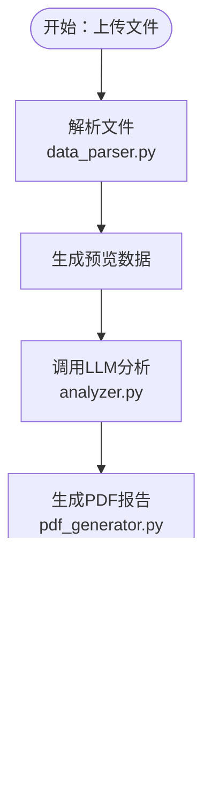
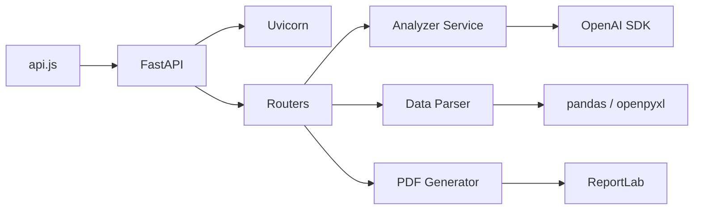

# 环境准备

<cite>
**本文引用的文件**
- [requirements.txt](file://backend/requirements.txt)
- [main.py](file://backend/app/main.py)
- [analysis.py](file://backend/app/routers/analysis.py)
- [analyzer.py](file://backend/app/services/analyzer.py)
- [data_parser.py](file://backend/app/services/data_parser.py)
- [pdf_generator.py](file://backend/app/services/pdf_generator.py)
- [report_template.md](file://backend/app/skills/report_template.md)
- [package.json](file://frontend/package.json)
- [vite.config.js](file://frontend/vite.config.js)
- [api.js](file://frontend/src/services/api.js)
- [UploadPage.jsx](file://frontend/src/components/UploadPage.jsx)
- [ResultPage.jsx](file://frontend/src/components/ResultPage.jsx)
- [App.jsx](file://frontend/src/App.jsx)
- [index.html](file://frontend/index.html)
</cite>

## 目录
1. [简介](#简介)
2. [项目结构](#项目结构)
3. [核心组件](#核心组件)
4. [架构总览](#架构总览)
5. [详细组件分析](#详细组件分析)
6. [依赖分析](#依赖分析)
7. [性能考虑](#性能考虑)
8. [故障排查指南](#故障排查指南)
9. [结论](#结论)
10. [附录](#附录)

## 简介
本指南面向 Qoder-todo 项目的环境准备与部署，覆盖 Python 3.8+ 与 Node.js 的安装要求、后端与前端依赖安装步骤、环境变量配置要点（尤其是 OpenAI API 密钥与文件上传路径），以及开发与生产环境的差异对比。文档同时提供关键流程的可视化图示，帮助快速定位问题与优化体验。

## 项目结构
项目采用前后端分离架构：
- 后端基于 FastAPI，提供文件上传、数据分析与 PDF 报告导出能力，并通过静态目录对外提供报告下载。
- 前端基于 Vite + React + Ant Design，负责用户交互、文件上传与分析结果展示，并通过 Axios 调用后端 API。

图表来源
- [index.html:1-14](file://frontend/index.html#L1-L14)
- [App.jsx:1-81](file://frontend/src/App.jsx#L1-L81)
- [UploadPage.jsx:1-145](file://frontend/src/components/UploadPage.jsx#L1-L145)
- [ResultPage.jsx:1-193](file://frontend/src/components/ResultPage.jsx#L1-L193)
- [api.js:1-48](file://frontend/src/services/api.js#L1-L48)
- [main.py:1-28](file://backend/app/main.py#L1-L28)
- [analysis.py:1-218](file://backend/app/routers/analysis.py#L1-L218)
- [analyzer.py:1-93](file://backend/app/services/analyzer.py#L1-L93)
- [data_parser.py:1-96](file://backend/app/services/data_parser.py#L1-L96)
- [pdf_generator.py:1-215](file://backend/app/services/pdf_generator.py#L1-L215)
- [report_template.md:1-34](file://backend/app/skills/report_template.md#L1-L34)

章节来源
- [main.py:1-28](file://backend/app/main.py#L1-L28)
- [analysis.py:1-218](file://backend/app/routers/analysis.py#L1-L218)
- [package.json:1-32](file://frontend/package.json#L1-L32)
- [vite.config.js:1-8](file://frontend/vite.config.js#L1-L8)

## 核心组件
- 后端核心依赖（来自 requirements.txt）：FastAPI、Uvicorn、python-multipart、openai、reportlab、pandas、openpyxl、matplotlib。
- 前端核心依赖（来自 package.json）：React、ReactDOM、Ant Design、Axios、React Markdown、Vite 及 React 插件、ESLint 工具链。
- 关键运行参数：
  - 后端默认监听地址与端口：0.0.0.0:8000。
  - 前端默认开发服务器端口：Vite 默认端口（通常为 5173，可在本地确认）。
  - 前端 API 基础地址：http://localhost:8000/api。

章节来源
- [requirements.txt:1-9](file://backend/requirements.txt#L1-L9)
- [package.json:1-32](file://frontend/package.json#L1-L32)
- [main.py:25-27](file://backend/app/main.py#L25-L27)
- [api.js:3-8](file://frontend/src/services/api.js#L3-L8)

## 架构总览
下图展示了从浏览器到后端服务的整体调用链路，包括文件上传、分析触发、报告生成与下载。

图表来源
- [UploadPage.jsx:20-38](file://frontend/src/components/UploadPage.jsx#L20-L38)
- [ResultPage.jsx:22-35](file://frontend/src/components/ResultPage.jsx#L22-L35)
- [api.js:10-40](file://frontend/src/services/api.js#L10-L40)
- [main.py:23-27](file://backend/app/main.py#L23-L27)
- [analysis.py:35-152](file://backend/app/routers/analysis.py#L35-L152)
- [analyzer.py:77-93](file://backend/app/services/analyzer.py#L77-L93)
- [pdf_generator.py:146-215](file://backend/app/services/pdf_generator.py#L146-L215)

## 详细组件分析

### 后端环境与依赖安装
- Python 版本要求：Python 3.8 或以上。
- 安装步骤：
  - 创建虚拟环境并激活。
  - 在后端根目录执行安装命令以安装所有后端依赖。
- 核心依赖说明：
  - FastAPI：提供 Web 服务与路由。
  - Uvicorn：ASGI 服务器，用于启动服务。
  - python-multipart：支持 multipart/form-data 文件上传。
  - openai：调用大模型 API（支持自定义 base_url）。
  - reportlab：生成 PDF 报告。
  - pandas/openpyxl/matplotlib：数据解析与可视化基础库。
- 默认运行方式：
  - 直接运行后端入口模块时，默认监听 0.0.0.0:8000。

章节来源
- [requirements.txt:1-9](file://backend/requirements.txt#L1-L9)
- [main.py:25-27](file://backend/app/main.py#L25-L27)

### 前端环境与依赖安装
- Node.js 版本：建议使用较新的 LTS 版本（如 18.x/20.x）。
- 安装步骤：
  - 在前端根目录执行安装命令以安装所有依赖。
- 核心依赖说明：
  - React/ReactDOM：前端框架。
  - Ant Design：UI 组件库。
  - Axios：HTTP 客户端，调用后端 API。
  - Vite：开发与构建工具。
  - ESLint 及相关插件：代码质量与规范校验。
- 开发与构建命令：
  - 开发：vite（默认端口通常为 5173）。
  - 预览：vite preview。
  - 生产构建：vite build。

章节来源
- [package.json:6-11](file://frontend/package.json#L6-L11)
- [package.json:12-30](file://frontend/package.json#L12-L30)
- [vite.config.js:1-8](file://frontend/vite.config.js#L1-L8)

### 环境变量配置
- OpenAI 相关：
  - OPENAI_API_KEY：大模型访问密钥。
  - OPENAI_BASE_URL：可选，自定义大模型服务地址（如代理或兼容服务）。
  - OPENAI_MODEL：可选，默认模型名称（如 gpt-4o）。
- 文件上传与报告路径：
  - 后端会自动创建 uploads 与 reports 两个目录用于存放上传文件与生成的 PDF。路径为后端主程序所在目录下的 uploads 与 reports 子目录。
- 其他：
  - CORS 已允许任意来源访问（开发阶段便利，生产环境建议收紧）。

章节来源
- [analyzer.py:18-38](file://backend/app/services/analyzer.py#L18-L38)
- [main.py:18-21](file://backend/app/main.py#L18-L21)
- [analysis.py:19-22](file://backend/app/routers/analysis.py#L19-L22)

### 开发与生产环境差异
- 开发环境：
  - 前端：Vite 提供热更新与本地开发服务器。
  - 后端：Uvicorn 支持 reload，便于调试。
  - API 基础地址：http://localhost:8000/api。
- 生产环境：
  - 前端：使用 vite build 产出静态资源，部署至 Nginx/Apache 等静态服务器，或通过反向代理转发到后端。
  - 后端：使用 Uvicorn/Gunicorn 等生产级 ASGI 服务器常驻运行，关闭 reload。
  - 安全加固：限制 CORS、启用 HTTPS、设置安全响应头、严格控制文件上传类型与大小。
  - 性能优化：启用缓存、连接池、异步处理与并发限制。

章节来源
- [main.py:25-27](file://backend/app/main.py#L25-L27)
- [api.js:3-8](file://frontend/src/services/api.js#L3-L8)

### 数据解析与分析流程
- 文件上传与预览：
  - 前端上传 CSV/Excel 文件，后端解析并返回前 10 条记录作为预览。
- 大模型分析：
  - 后端读取技能模板（skills/report_template.md），结合持仓与交易文本调用大模型生成分析结果。
- PDF 报告生成：
  - 使用 ReportLab 渲染中文（尝试多种字体路径），输出 A4 报告并提供下载链接。

图表来源
- [data_parser.py:7-95](file://backend/app/services/data_parser.py#L7-L95)
- [analyzer.py:77-93](file://backend/app/services/analyzer.py#L77-L93)
- [pdf_generator.py:146-215](file://backend/app/services/pdf_generator.py#L146-L215)

章节来源
- [UploadPage.jsx:20-38](file://frontend/src/components/UploadPage.jsx#L20-L38)
- [ResultPage.jsx:22-35](file://frontend/src/components/ResultPage.jsx#L22-L35)
- [analysis.py:35-152](file://backend/app/routers/analysis.py#L35-L152)

## 依赖分析
- 后端依赖关系：
  - FastAPI 作为 Web 框架，依赖 Uvicorn 运行。
  - 分析服务依赖 OpenAI SDK，数据解析依赖 pandas/openpyxl，PDF 生成依赖 reportlab。
- 前端依赖关系：
  - React/ReactDOM 提供 UI 基础，Ant Design 提供组件，Axios 负责网络请求，Vite 提供开发与构建。
- 耦合与内聚：
  - 后端各服务模块职责清晰，解析、分析、PDF 生成相互独立，便于替换与扩展。
  - 前端通过 api.js 封装后端接口，降低跨组件耦合。

图表来源
- [requirements.txt:1-9](file://backend/requirements.txt#L1-L9)
- [analyzer.py:3-4](file://backend/app/services/analyzer.py#L3-L4)
- [data_parser.py:3-4](file://backend/app/services/data_parser.py#L3-L4)
- [pdf_generator.py:5-16](file://backend/app/services/pdf_generator.py#L5-L16)
- [api.js:1-8](file://frontend/src/services/api.js#L1-L8)

章节来源
- [requirements.txt:1-9](file://backend/requirements.txt#L1-L9)
- [package.json:12-30](file://frontend/package.json#L12-L30)

## 性能考虑
- 大模型调用：
  - 建议在生产环境增加重试与超时控制，避免长时间阻塞。
  - 对于长文本分析，可分段调用并合并结果，减少单次请求负载。
- 文件解析：
  - 大文件解析建议分块读取与流式处理，避免内存峰值过高。
- PDF 生成：
  - 中文字体注册失败时回退 Helvetica，可能导致中文显示异常；建议在生产环境确保中文字体可用。
- 并发与缓存：
  - 任务状态与中间结果建议持久化至数据库，避免内存存储导致重启丢失。
  - 对热点数据与报告可引入缓存层，缩短重复生成时间。

## 故障排查指南
- 后端无法启动或端口占用：
  - 检查是否已在 8000 端口运行其他进程；修改运行命令中的端口或停止冲突进程。
- OpenAI 调用失败：
  - 确认 OPENAI_API_KEY 设置正确；若使用自定义服务，检查 OPENAI_BASE_URL 与模型名称。
- 文件上传失败：
  - 确认上传文件格式为 CSV/Excel；检查 uploads 目录权限与磁盘空间。
- PDF 生成乱码或字体缺失：
  - 确保系统中存在可用的中文字体路径；若未找到，将回退为 Helvetica。
- 前端无法访问后端：
  - 确认前端 API 基础地址与后端监听地址一致；检查防火墙与 CORS 设置。

章节来源
- [main.py:25-27](file://backend/app/main.py#L25-L27)
- [analyzer.py:18-38](file://backend/app/services/analyzer.py#L18-L38)
- [analysis.py:19-22](file://backend/app/routers/analysis.py#L19-L22)
- [pdf_generator.py:31-50](file://backend/app/services/pdf_generator.py#L31-L50)
- [api.js:3-8](file://frontend/src/services/api.js#L3-L8)

## 结论
按照本指南完成 Python 3.8+ 与 Node.js 环境准备、后端与前端依赖安装、环境变量配置，并遵循开发与生产环境差异建议，即可顺利运行 Qoder-todo 项目。建议在生产环境中进一步强化安全、性能与可观测性配置，以满足实际业务需求。

## 附录
- 快速检查清单
  - Python 3.8+ 已安装且虚拟环境已激活。
  - 后端依赖已安装（requirements.txt）。
  - Node.js 已安装，前端依赖已安装（package.json）。
  - 设置 OPENAI_API_KEY（可选 OPENAI_BASE_URL 与 OPENAI_MODEL）。
  - 启动后端（默认 0.0.0.0:8000），再启动前端（Vite 默认端口）。
  - 访问前端页面，上传 CSV/Excel 文件，开始分析并下载 PDF 报告。