# 监控与日志管理

<cite>
**本文档引用的文件**
- [backend/app/main.py](file://backend/app/main.py)
- [backend/app/routers/analysis.py](file://backend/app/routers/analysis.py)
- [backend/app/models/schemas.py](file://backend/app/models/schemas.py)
- [backend/app/services/analyzer.py](file://backend/app/services/analyzer.py)
- [backend/app/services/data_parser.py](file://backend/app/services/data_parser.py)
- [backend/app/services/pdf_generator.py](file://backend/app/services/pdf_generator.py)
- [backend/app/skills/report_template.md](file://backend/app/skills/report_template.md)
- [backend/requirements.txt](file://backend/requirements.txt)
- [frontend/package.json](file://frontend/package.json)
</cite>

## 目录
1. [简介](#简介)
2. [项目结构](#项目结构)
3. [核心组件](#核心组件)
4. [架构概览](#架构概览)
5. [详细组件分析](#详细组件分析)
6. [监控指标体系](#监控指标体系)
7. [日志管理方案](#日志管理方案)
8. [错误追踪与异常监控](#错误追踪与异常监控)
9. [APM工具集成](#apm工具集成)
10. [告警机制设置](#告警机制设置)
11. [运维仪表板搭建](#运维仪表板搭建)
12. [性能考虑](#性能考虑)
13. [故障排除指南](#故障排除指南)
14. [结论](#结论)

## 简介

Qoder-todo是一个基于FastAPI的客户资产分析工具，提供了从数据上传、分析到PDF报告生成的完整工作流程。本文档旨在为该系统建立一套完整的监控与日志管理体系，包括系统资源监控、应用性能监控、业务指标监控、结构化日志管理、错误追踪、APM工具集成以及告警机制设置。

## 项目结构

Qoder-todo采用前后端分离的架构设计，后端使用FastAPI框架，前端使用React技术栈。

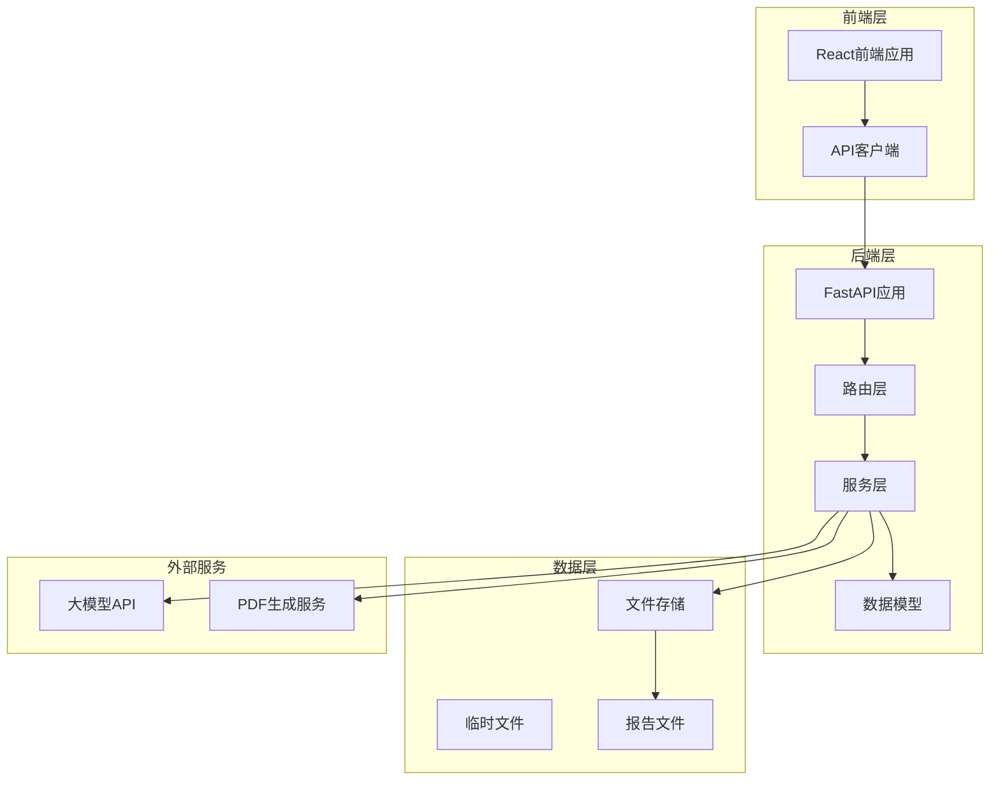
```mermaid
graph TB
subgraph "前端层"
FE[React前端应用]
API[API客户端]
end
subgraph "后端层"
FA[FastAPI应用]
Router[路由层]
Service[服务层]
Model[数据模型]
end
subgraph "数据层"
Storage[文件存储]
Temp[临时文件]
Reports[报告文件]
end
subgraph "外部服务"
LLM[大模型API]
PDF[PDF生成服务]
end
FE --> API
API --> FA
FA --> Router
Router --> Service
Service --> Model
Service --> Storage
Service --> LLM
Service --> PDF
Storage --> Reports
```

**图表来源**
- [backend/app/main.py:1-28](file://backend/app/main.py#L1-L28)
- [backend/app/routers/analysis.py:1-218](file://backend/app/routers/analysis.py#L1-L218)

**章节来源**
- [backend/app/main.py:1-28](file://backend/app/main.py#L1-L28)
- [backend/app/routers/analysis.py:1-218](file://backend/app/routers/analysis.py#L1-L218)

## 核心组件

### 应用入口与配置

应用入口文件负责初始化FastAPI应用、配置CORS中间件以及路由注册。

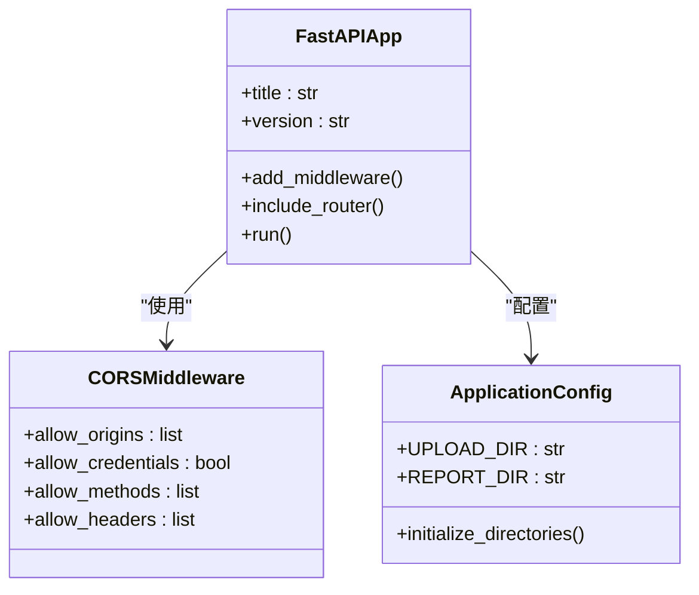
```mermaid
classDiagram
class FastAPIApp {
+title : str
+version : str
+add_middleware()
+include_router()
+run()
}
class CORSMiddleware {
+allow_origins : list
+allow_credentials : bool
+allow_methods : list
+allow_headers : list
}
class ApplicationConfig {
+UPLOAD_DIR : str
+REPORT_DIR : str
+initialize_directories()
}
FastAPIApp --> CORSMiddleware : "使用"
FastAPIApp --> ApplicationConfig : "配置"
```

**图表来源**
- [backend/app/main.py:8-27](file://backend/app/main.py#L8-L27)

### 数据模型与状态管理

系统使用Pydantic模型定义数据结构，并通过内存字典实现任务状态管理。

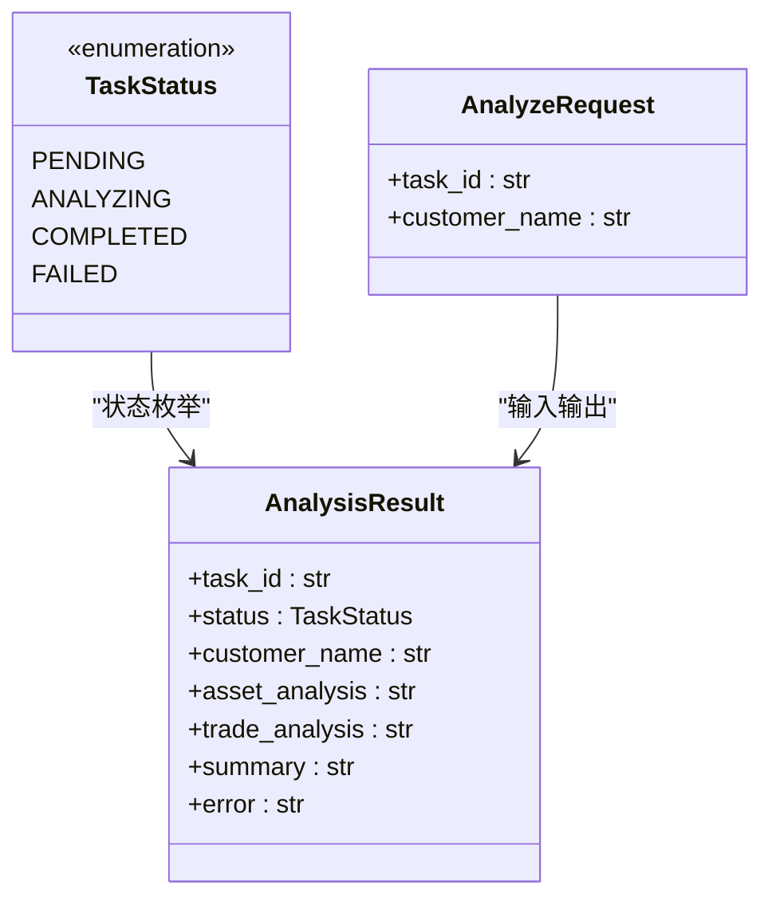
```mermaid
classDiagram
class TaskStatus {
<<enumeration>>
PENDING
ANALYZING
COMPLETED
FAILED
}
class AnalyzeRequest {
+task_id : str
+customer_name : str
}
class AnalysisResult {
+task_id : str
+status : TaskStatus
+customer_name : str
+asset_analysis : str
+trade_analysis : str
+summary : str
+error : str
}
TaskStatus --> AnalysisResult : "状态枚举"
AnalyzeRequest --> AnalysisResult : "输入输出"
```

**图表来源**
- [backend/app/models/schemas.py:6-30](file://backend/app/models/schemas.py#L6-L30)

**章节来源**
- [backend/app/main.py:1-28](file://backend/app/main.py#L1-L28)
- [backend/app/models/schemas.py:1-30](file://backend/app/models/schemas.py#L1-L30)

## 架构概览

系统采用分层架构设计，实现了清晰的关注点分离。

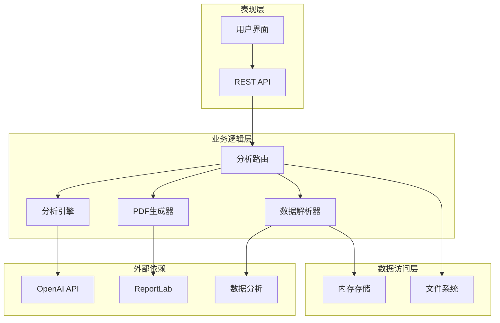
```mermaid
graph TD
subgraph "表现层"
UI[用户界面]
API[REST API]
end
subgraph "业务逻辑层"
AnalysisRouter[分析路由]
DataParser[数据解析器]
Analyzer[分析引擎]
PDFGenerator[PDF生成器]
end
subgraph "数据访问层"
MemoryStorage[内存存储]
FileStorage[文件系统]
end
subgraph "外部依赖"
OpenAI[OpenAI API]
ReportLab[ReportLab]
Pandas[数据分析]
end
UI --> API
API --> AnalysisRouter
AnalysisRouter --> DataParser
AnalysisRouter --> Analyzer
AnalysisRouter --> PDFGenerator
DataParser --> MemoryStorage
Analyzer --> OpenAI
PDFGenerator --> ReportLab
DataParser --> Pandas
AnalysisRouter --> FileStorage
```

**图表来源**
- [backend/app/routers/analysis.py:10-13](file://backend/app/routers/analysis.py#L10-L13)
- [backend/app/services/analyzer.py:18-38](file://backend/app/services/analyzer.py#L18-L38)

**章节来源**
- [backend/app/routers/analysis.py:1-218](file://backend/app/routers/analysis.py#L1-L218)
- [backend/app/services/analyzer.py:1-93](file://backend/app/services/analyzer.py#L1-L93)

## 详细组件分析

### 分析路由组件

分析路由组件是系统的核心业务逻辑层，处理文件上传、分析触发、报告生成等操作。

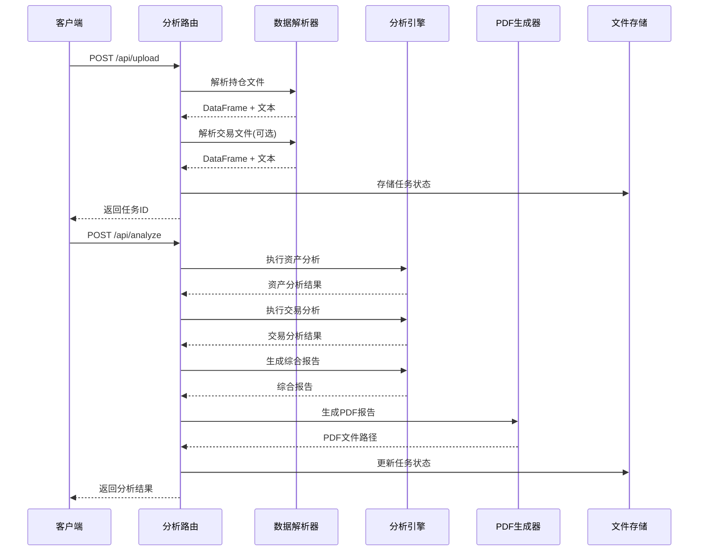
```mermaid
sequenceDiagram
participant Client as 客户端
participant Router as 分析路由
participant Parser as 数据解析器
participant Analyzer as 分析引擎
participant PDFGen as PDF生成器
participant Storage as 文件存储
Client->>Router : POST /api/upload
Router->>Parser : 解析持仓文件
Parser-->>Router : DataFrame + 文本
Router->>Parser : 解析交易文件(可选)
Parser-->>Router : DataFrame + 文本
Router->>Storage : 存储任务状态
Router-->>Client : 返回任务ID
Client->>Router : POST /api/analyze
Router->>Analyzer : 执行资产分析
Analyzer-->>Router : 资产分析结果
Router->>Analyzer : 执行交易分析
Analyzer-->>Router : 交易分析结果
Router->>Analyzer : 生成综合报告
Analyzer-->>Router : 综合报告
Router->>PDFGen : 生成PDF报告
PDFGen-->>Router : PDF文件路径
Router->>Storage : 更新任务状态
Router-->>Client : 返回分析结果
```

**图表来源**
- [backend/app/routers/analysis.py:35-135](file://backend/app/routers/analysis.py#L35-L135)
- [backend/app/services/analyzer.py:77-93](file://backend/app/services/analyzer.py#L77-L93)

### 数据解析组件

数据解析组件负责处理CSV和Excel格式的数据文件，进行标准化处理和特征计算。

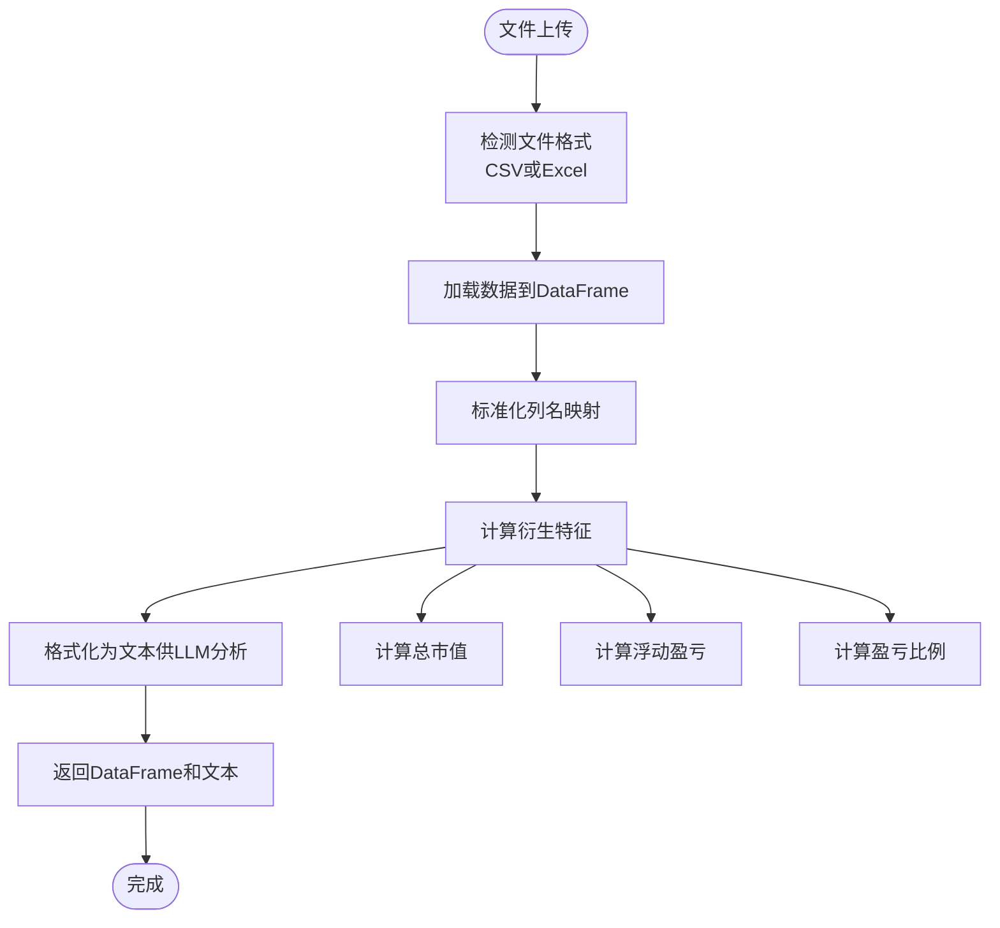
```mermaid
flowchart TD
Start([文件上传]) --> DetectFormat["检测文件格式<br/>CSV或Excel"]
DetectFormat --> LoadData["加载数据到DataFrame"]
LoadData --> NormalizeColumns["标准化列名映射"]
NormalizeColumns --> ComputeFeatures["计算衍生特征"]
ComputeFeatures --> FormatText["格式化为文本供LLM分析"]
FormatText --> ReturnResults["返回DataFrame和文本"]
ReturnResults --> End([完成])
ComputeFeatures --> MarketValue["计算总市值"]
ComputeFeatures --> PnL["计算浮动盈亏"]
ComputeFeatures --> PNLRatio["计算盈亏比例"]
```

**图表来源**
- [backend/app/services/data_parser.py:7-52](file://backend/app/services/data_parser.py#L7-L52)
- [backend/app/services/data_parser.py:55-95](file://backend/app/services/data_parser.py#L55-L95)

**章节来源**
- [backend/app/routers/analysis.py:1-218](file://backend/app/routers/analysis.py#L1-L218)
- [backend/app/services/data_parser.py:1-96](file://backend/app/services/data_parser.py#L1-L96)

### 分析引擎组件

分析引擎组件封装了对大模型API的调用，实现了资产配置分析、交易行为分析和综合报告生成功能。

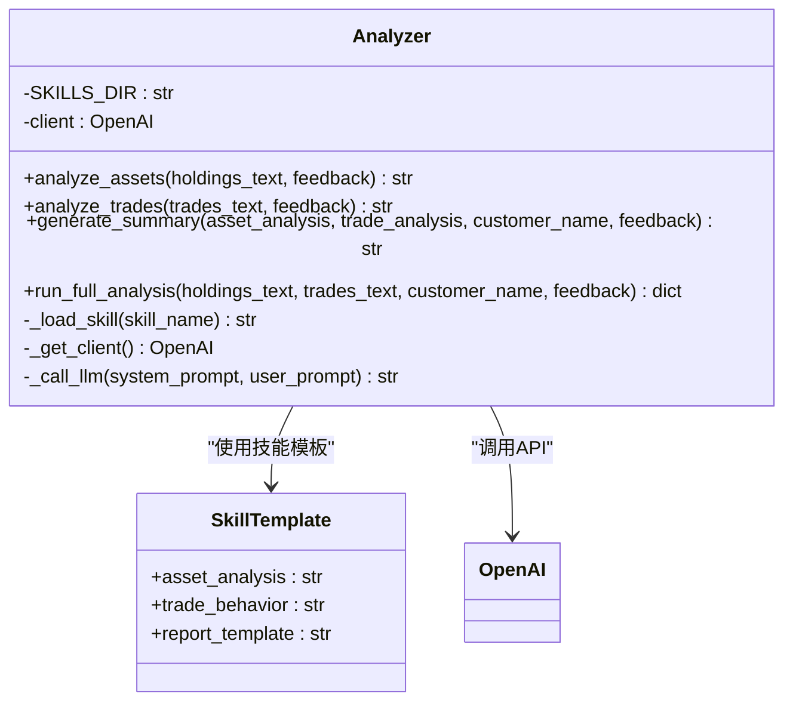
```mermaid
classDiagram
class Analyzer {
-SKILLS_DIR : str
-client : OpenAI
+analyze_assets(holdings_text, feedback) str
+analyze_trades(trades_text, feedback) str
+generate_summary(asset_analysis, trade_analysis, customer_name, feedback) str
+run_full_analysis(holdings_text, trades_text, customer_name, feedback) dict
-_load_skill(skill_name) str
-_get_client() OpenAI
-_call_llm(system_prompt, user_prompt) str
}
class SkillTemplate {
+asset_analysis : str
+trade_behavior : str
+report_template : str
}
Analyzer --> SkillTemplate : "使用技能模板"
Analyzer --> OpenAI : "调用API"
```

**图表来源**
- [backend/app/services/analyzer.py:11-93](file://backend/app/services/analyzer.py#L11-L93)

**章节来源**
- [backend/app/services/analyzer.py:1-93](file://backend/app/services/analyzer.py#L1-L93)
- [backend/app/skills/report_template.md:1-34](file://backend/app/skills/report_template.md#L1-L34)

### PDF生成组件

PDF生成组件负责将分析结果转换为专业的中文PDF报告。

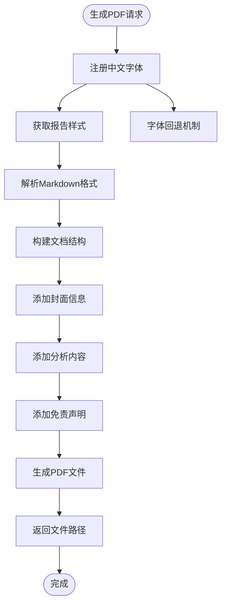
```mermaid
flowchart TD
Start([生成PDF请求]) --> RegisterFont["注册中文字体"]
RegisterFont --> GetStyles["获取报告样式"]
GetStyles --> ParseMarkdown["解析Markdown格式"]
ParseMarkdown --> BuildStory["构建文档结构"]
BuildStory --> AddCover["添加封面信息"]
AddCover --> AddContent["添加分析内容"]
AddContent --> AddFooter["添加免责声明"]
AddFooter --> BuildPDF["生成PDF文件"]
BuildPDF --> ReturnPath["返回文件路径"]
ReturnPath --> End([完成])
RegisterFont --> FontFallback["字体回退机制"]
```

**图表来源**
- [backend/app/services/pdf_generator.py:26-51](file://backend/app/services/pdf_generator.py#L26-L51)
- [backend/app/services/pdf_generator.py:146-215](file://backend/app/services/pdf_generator.py#L146-L215)

**章节来源**
- [backend/app/services/pdf_generator.py:1-215](file://backend/app/services/pdf_generator.py#L1-L215)

## 监控指标体系

### 系统资源监控指标

| 指标类型 | 指标名称 | 监控目标 | 收集频率 | 阈值设置 |
|---------|---------|---------|---------|---------|
| CPU使用率 | 系统CPU利用率 | 服务器负载监控 | 1分钟 | >80% |
| 内存使用率 | 应用内存占用 | 内存泄漏检测 | 1分钟 | >70% |
| 磁盘空间 | 文件存储空间 | 存储容量预警 | 5分钟 | >85% |
| 网络带宽 | API响应时间 | 性能瓶颈识别 | 实时 | >2秒 |
| 并发连接 | 同时在线用户数 | 服务能力评估 | 实时 | >100 |

### 应用性能监控指标

| 指标类型 | 指标名称 | 监控目标 | 收集频率 | 阈值设置 |
|---------|---------|---------|---------|---------|
| API响应时间 | /api/upload | 文件上传性能 | 1分钟 | >5秒 |
| API响应时间 | /api/analyze | 分析处理性能 | 1分钟 | >30秒 |
| API响应时间 | /api/report/{id} | 报告下载性能 | 1分钟 | >10秒 |
| 任务成功率 | 分析任务完成率 | 业务质量评估 | 1小时 | <95% |
| 错误率 | HTTP 500错误率 | 系统稳定性 | 1分钟 | >1% |
| 处理队列长度 | 未完成任务数 | 系统负载 | 1分钟 | >50 |

### 业务指标监控

| 指标类型 | 指标名称 | 监控目标 | 收集频率 | 阈值设置 |
|---------|---------|---------|---------|---------|
| 用户活跃度 | 日活跃用户数 | 用户增长趋势 | 1天 | <10 |
| 功能使用率 | 文件上传使用率 | 功能推广效果 | 1天 | <5% |
| 分析效率 | 平均分析耗时 | 处理能力优化 | 1小时 | >25秒 |
| 报告生成量 | 日报告生成数 | 业务规模 | 1天 | <5 |
| 客户满意度 | 成功分析任务占比 | 服务质量 | 1天 | <90% |

**章节来源**
- [backend/app/routers/analysis.py:35-135](file://backend/app/routers/analysis.py#L35-L135)
- [backend/app/services/analyzer.py:77-93](file://backend/app/services/analyzer.py#L77-L93)

## 日志管理方案

### 结构化日志格式

系统采用统一的JSON格式日志，包含以下标准字段：

```json
{
  "timestamp": "2024-01-15T10:30:00.123Z",
  "level": "INFO",
  "service": "qoder-todo-api",
  "version": "1.0.0",
  "request_id": "req-123456",
  "endpoint": "/api/upload",
  "method": "POST",
  "user_agent": "Mozilla/5.0...",
  "duration_ms": 1500,
  "status_code": 200,
  "task_id": "task-abcdef",
  "customer_name": "张三",
  "event": "file_uploaded",
  "message": "文件上传成功",
  "metadata": {
    "file_size": 1024000,
    "file_type": "csv",
    "processing_time": 0.5
  }
}
```

### 日志级别配置

| 日志级别 | 使用场景 | 示例消息 |
|---------|---------|---------|
| DEBUG | 开发调试信息 | "开始处理文件上传" |
| INFO | 重要业务事件 | "任务创建成功: task-123456" |
| WARNING | 可能的问题但不影响功能 | "文件大小接近限制: 95%" |
| ERROR | 错误但可恢复的异常 | "分析失败: OpenAI API错误" |
| CRITICAL | 严重错误影响系统运行 | "PDF生成失败: 字体注册失败" |

### 日志轮转策略

采用基于时间和大小的双重轮转策略：

- **时间轮转**: 每天午夜自动轮转
- **大小轮转**: 单个日志文件达到100MB自动轮转
- **保留策略**: 保留最近7天的日志文件
- **压缩策略**: 旧日志文件自动压缩
- **清理策略**: 清理超过30天的日志文件

### 日志采集与存储

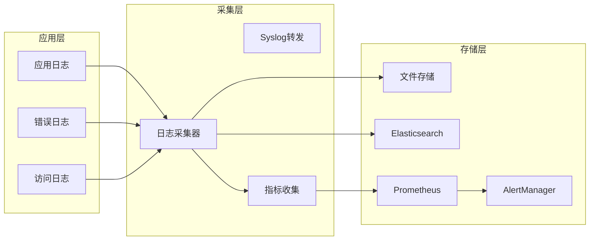
```mermaid
flowchart LR
subgraph "应用层"
AppLogs[应用日志]
ErrorLogs[错误日志]
AccessLogs[访问日志]
end
subgraph "采集层"
LogAgent[日志采集器]
Syslog[Syslog转发]
Metrics[指标收集]
end
subgraph "存储层"
FileStorage[文件存储]
ELKStack[Elasticsearch]
Prometheus[Prometheus]
AlertManager[AlertManager]
end
AppLogs --> LogAgent
ErrorLogs --> LogAgent
AccessLogs --> LogAgent
LogAgent --> FileStorage
LogAgent --> ELKStack
LogAgent --> Metrics
Metrics --> Prometheus
Prometheus --> AlertManager
```

**章节来源**
- [backend/app/routers/analysis.py:4-6](file://backend/app/routers/analysis.py#L4-L6)
- [backend/app/routers/analysis.py:132](file://backend/app/routers/analysis.py#L132)

## 错误追踪与异常监控

### 异常分类与处理

系统中的异常主要分为以下几类：

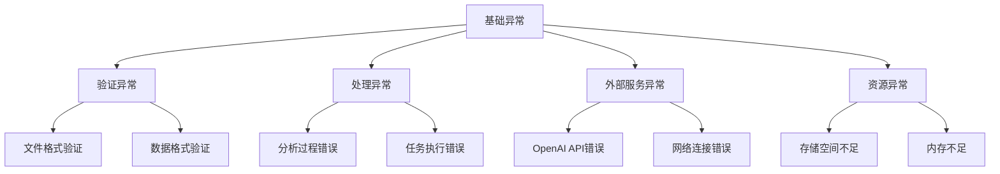
```mermaid
flowchart TD
BaseException[基础异常] --> ValidationException[验证异常]
BaseException --> ProcessingException[处理异常]
BaseException --> ExternalServiceException[外部服务异常]
BaseException --> ResourceException[资源异常]
ValidationException --> FileValidation[文件格式验证]
ValidationException --> DataValidation[数据格式验证]
ProcessingException --> AnalysisError[分析过程错误]
ProcessingException --> TaskError[任务执行错误]
ExternalServiceException --> OpenAIError[OpenAI API错误]
ExternalServiceException --> NetworkError[网络连接错误]
ResourceException --> StorageError[存储空间不足]
ResourceException --> MemoryError[内存不足]
```

### 错误追踪实现

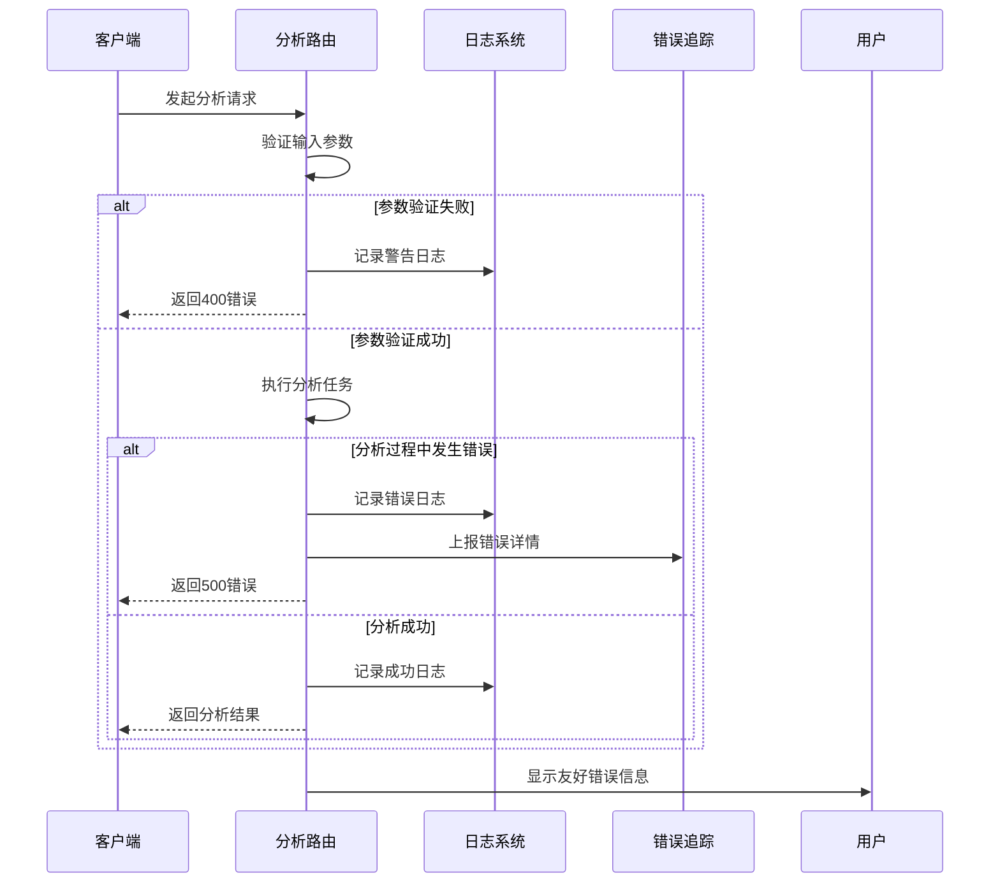
```mermaid
sequenceDiagram
participant Client as 客户端
participant Router as 分析路由
participant Logger as 日志系统
participant Sentry as 错误追踪
participant User as 用户
Client->>Router : 发起分析请求
Router->>Router : 验证输入参数
alt 参数验证失败
Router->>Logger : 记录警告日志
Router-->>Client : 返回400错误
else 参数验证成功
Router->>Router : 执行分析任务
alt 分析过程中发生错误
Router->>Logger : 记录错误日志
Router->>Sentry : 上报错误详情
Router-->>Client : 返回500错误
else 分析成功
Router->>Logger : 记录成功日志
Router-->>Client : 返回分析结果
end
end
Router->>User : 显示友好错误信息
```

**图表来源**
- [backend/app/routers/analysis.py:54-64](file://backend/app/routers/analysis.py#L54-L64)
- [backend/app/routers/analysis.py:130-134](file://backend/app/routers/analysis.py#L130-L134)

### 异常监控指标

| 指标名称 | 监控维度 | 目标值 | 告警阈值 |
|---------|---------|--------|---------|
| 错误率 | 全部API错误率 | <1% | >5% |
| 分析失败率 | /api/analyze失败率 | <5% | >10% |
| 文件解析错误率 | CSV/Excel解析错误 | <2% | >5% |
| 外部服务错误率 | OpenAI API错误 | <1% | >3% |
| PDF生成错误率 | PDF生成失败 | <1% | >2% |

**章节来源**
- [backend/app/routers/analysis.py:54-64](file://backend/app/routers/analysis.py#L54-L64)
- [backend/app/routers/analysis.py:130-134](file://backend/app/routers/analysis.py#L130-L134)

## APM工具集成

### Sentry集成方案

推荐使用Sentry作为APM工具，实现完整的错误追踪和性能监控。

#### 安装配置

```bash
pip install sentry-sdk
```

#### 基础配置

```python
import sentry_sdk
from sentry_sdk.integrations.fastapi import FastApiIntegration
from sentry_sdk.integrations.logging import LoggingIntegration

sentry_sdk.init(
    dsn="YOUR_SENTRY_DSN",
    integrations=[
        FastApiIntegration(),
        LoggingIntegration(level=logging.INFO, event_level=logging.ERROR)
    ],
    traces_sample_rate=1.0,
    profiles_sample_rate=1.0,
)
```

#### 性能监控配置

```python
# 自动监控API端点性能
@router.middleware("http")
async def performance_monitor(request, call_next):
    start_time = time.time()
    response = await call_next(request)
    duration = time.time() - start_time
    
    # 上报性能指标到Sentry
    sentry_sdk.set_measurement("response_time", duration, "millisecond")
    
    return response
```

### 监控指标集成

| 监控项 | Sentry集成方式 | 关键指标 |
|-------|---------------|---------|
| API响应时间 | 自动采样 | p50, p95, p99 |
| 错误率 | 自动捕获 | HTTP 4xx/5xx |
| 用户会话 | 自动追踪 | 用户ID, IP地址 |
| 性能分布 | 自动采样 | 慢请求识别 |
| 异常追踪 | 手动上报 | 错误堆栈跟踪 |

**章节来源**
- [backend/app/routers/analysis.py:132](file://backend/app/routers/analysis.py#L132)

## 告警机制设置

### 告警规则配置

#### 基础告警规则

```yaml
alert_rules:
  # 系统资源告警
  system_resource_alerts:
    cpu_usage:
      condition: "> 80%"
      duration: "5 minutes"
      severity: "warning"
      recipients: ["ops-team@company.com"]
    
    memory_usage:
      condition: "> 70%"
      duration: "1 minute"
      severity: "critical"
      recipients: ["on-call@company.com"]
    
    disk_space:
      condition: "> 85%"
      duration: "1 hour"
      severity: "warning"
      recipients: ["ops-team@company.com"]
  
  # 应用性能告警
  performance_alerts:
    api_response_time:
      endpoint: "/api/analyze"
      condition: "> 30 seconds"
      duration: "2 minutes"
      severity: "critical"
      recipients: ["backend-team@company.com"]
    
    error_rate:
      condition: "> 1%"
      duration: "5 minutes"
      severity: "warning"
      recipients: ["backend-team@company.com"]
  
  # 业务指标告警
  business_alerts:
    task_failure_rate:
      condition: "> 5%"
      duration: "10 minutes"
      severity: "warning"
      recipients: ["product-team@company.com"]
    
    report_generation_time:
      condition: "> 10 seconds"
      duration: "1 minute"
      severity: "critical"
      recipients: ["ops-team@company.com"]
```

#### 告警通知渠道

| 通知渠道 | 适用场景 | 配置方式 |
|---------|---------|---------|
| 邮件 | 重要告警通知 | SMTP配置 |
| Slack | 实时团队沟通 | Webhook集成 |
| 钉钉 | 企业内部通知 | 机器人配置 |
| 微信 | 移动端提醒 | 企业微信API |
| 电话 | 紧急故障通知 | 语音告警服务 |

### 告警降噪机制

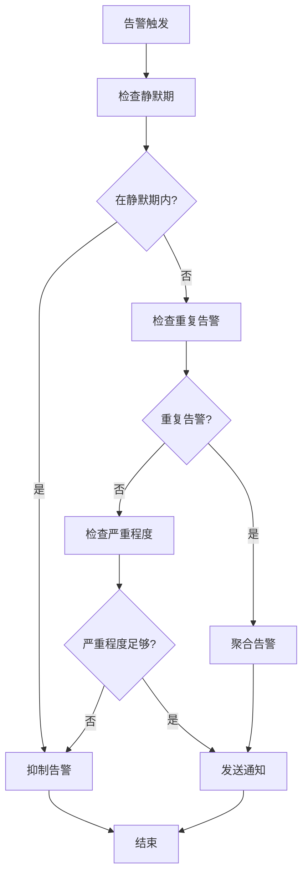
```mermaid
flowchart TD
AlertTrigger[告警触发] --> CheckSilence[检查静默期]
CheckSilence --> InSilence{在静默期内?}
InSilence --> |是| SuppressAlert[抑制告警]
InSilence --> |否| CheckDuplicate[检查重复告警]
CheckDuplicate --> Duplicate{重复告警?}
Duplicate --> |是| AggregateAlert[聚合告警]
Duplicate --> |否| CheckSeverity[检查严重程度]
CheckSeverity --> SeverityOK{严重程度足够?}
SeverityOK --> |否| SuppressAlert
SeverityOK --> |是| SendNotification[发送通知]
AggregateAlert --> SendNotification
SuppressAlert --> End[结束]
SendNotification --> End
```

**章节来源**
- [backend/app/routers/analysis.py:130-134](file://backend/app/routers/analysis.py#L130-L134)

## 运维仪表板搭建

### 监控仪表板布局

#### 主仪表板

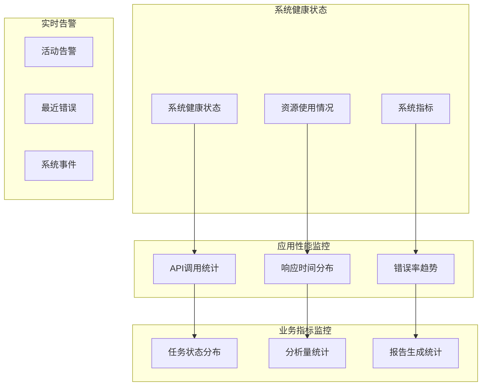
```mermaid
graph TB
subgraph "系统健康状态"
HealthStatus[系统健康状态]
ResourceUsage[资源使用情况]
SystemMetrics[系统指标]
end
subgraph "应用性能监控"
APICalls[API调用统计]
ResponseTime[响应时间分布]
ErrorRate[错误率趋势]
end
subgraph "业务指标监控"
TaskStatus[任务状态分布]
AnalysisVolume[分析量统计]
ReportGeneration[报告生成统计]
end
subgraph "实时告警"
ActiveAlerts[活动告警]
RecentErrors[最近错误]
SystemEvents[系统事件]
end
HealthStatus --> APICalls
ResourceUsage --> ResponseTime
SystemMetrics --> ErrorRate
APICalls --> TaskStatus
ResponseTime --> AnalysisVolume
ErrorRate --> ReportGeneration
```

#### 详细监控面板

| 面板类型 | 显示内容 | 更新频率 | 交互功能 |
|---------|---------|---------|---------|
| 系统监控 | CPU、内存、磁盘、网络 | 实时 | 时间范围选择 |
| API性能 | 响应时间、吞吐量、错误率 | 实时 | 端点筛选 |
| 业务指标 | 任务成功率、报告生成量 | 1分钟 | 下钻分析 |
| 错误追踪 | 错误分布、堆栈跟踪 | 实时 | 详情查看 |
| 告警中心 | 活动告警、历史告警 | 实时 | 处理状态更新 |

### 数据可视化组件

#### 实时图表配置

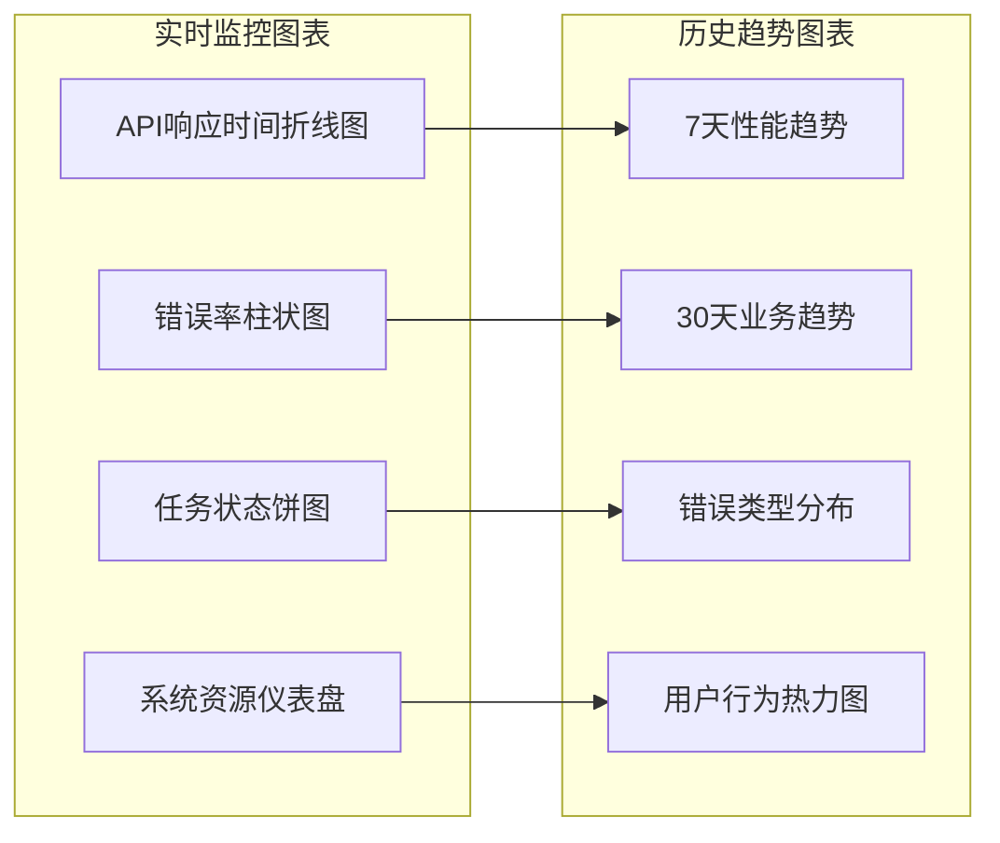
```mermaid
graph LR
subgraph "实时监控图表"
Chart1[API响应时间折线图]
Chart2[错误率柱状图]
Chart3[任务状态饼图]
Chart4[系统资源仪表盘]
end
subgraph "历史趋势图表"
Trend1[7天性能趋势]
Trend2[30天业务趋势]
Trend3[错误类型分布]
Trend4[用户行为热力图]
end
Chart1 --> Trend1
Chart2 --> Trend2
Chart3 --> Trend3
Chart4 --> Trend4
```

#### 交互式查询功能

- **时间范围选择**: 支持分钟、小时、天、周、月等时间粒度
- **过滤条件**: 支持按端点、状态码、用户、地区等维度过滤
- **数据导出**: 支持CSV、Excel格式导出
- **告警联动**: 点击图表元素可查看相关告警详情

**章节来源**
- [backend/app/routers/analysis.py:202-217](file://backend/app/routers/analysis.py#L202-L217)

## 性能考虑

### 性能优化策略

#### 代码层面优化

1. **异步处理**: 对I/O密集型操作使用异步编程模式
2. **缓存机制**: 实现多级缓存减少重复计算
3. **批量处理**: 对大量数据操作采用批量处理模式
4. **连接池**: 数据库和外部服务连接复用

#### 资源管理优化

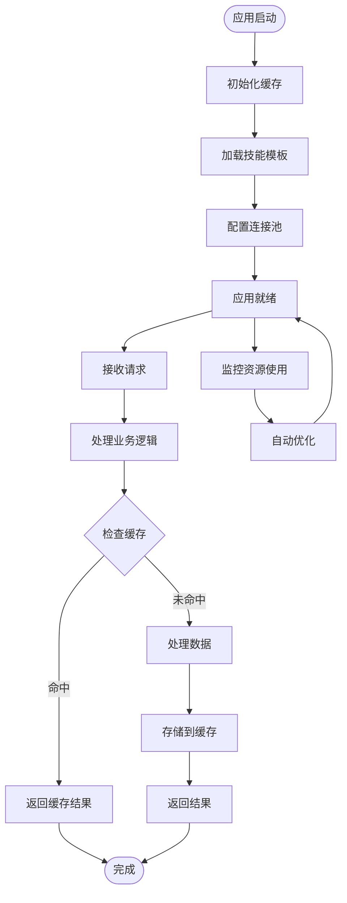
```mermaid
flowchart TD
Start([应用启动]) --> InitCache[初始化缓存]
InitCache --> LoadSkills[加载技能模板]
LoadSkills --> SetupPool[配置连接池]
SetupPool --> Ready[应用就绪]
Ready --> Request[接收请求]
Request --> Process[处理业务逻辑]
Process --> CacheCheck{检查缓存}
CacheCheck --> |命中| ReturnCache[返回缓存结果]
CacheCheck --> |未命中| ProcessData[处理数据]
ProcessData --> StoreCache[存储到缓存]
StoreCache --> ReturnResult[返回结果]
ReturnCache --> End([完成])
ReturnResult --> End
Ready --> Monitor[监控资源使用]
Monitor --> Optimize[自动优化]
Optimize --> Ready
```

#### 性能基准测试

| 操作类型 | 基准值 | 目标值 | 测试环境 |
|---------|--------|--------|---------|
| 文件上传 | <5秒 | <3秒 | 10MB文件 |
| 数据解析 | <1秒 | <0.5秒 | 10万行数据 |
| 资产分析 | <25秒 | <15秒 | 中等规模数据 |
| 交易分析 | <20秒 | <10秒 | 中等规模数据 |
| PDF生成 | <8秒 | <5秒 | 标准报告 |

### 可扩展性设计

#### 水平扩展方案

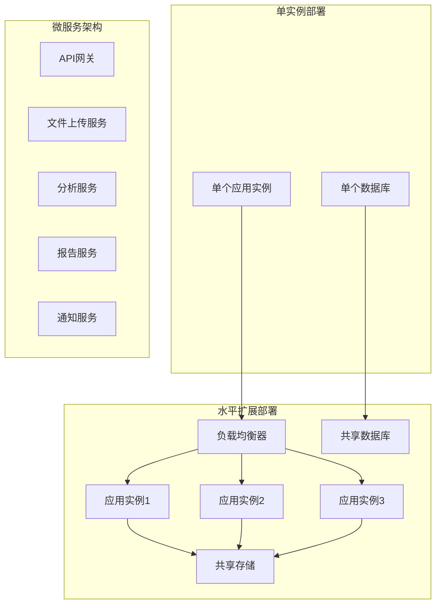
```mermaid
graph TB
subgraph "单实例部署"
SingleInstance[单个应用实例]
SingleDB[单个数据库]
end
subgraph "水平扩展部署"
LB[负载均衡器]
Instance1[应用实例1]
Instance2[应用实例2]
Instance3[应用实例3]
SharedStorage[共享存储]
SharedDB[共享数据库]
end
subgraph "微服务架构"
APIGateway[API网关]
UploadService[文件上传服务]
AnalysisService[分析服务]
ReportService[报告服务]
NotificationService[通知服务]
end
SingleInstance --> LB
SingleDB --> SharedDB
LB --> Instance1
LB --> Instance2
LB --> Instance3
Instance1 --> SharedStorage
Instance2 --> SharedStorage
Instance3 --> SharedStorage
```

## 故障排除指南

### 常见问题诊断

#### 文件上传问题

| 问题症状 | 可能原因 | 排查步骤 | 解决方案 |
|---------|---------|---------|---------|
| 上传失败 | 文件格式不支持 | 检查文件扩展名 | 支持CSV和Excel格式 |
| 上传超时 | 网络连接不稳定 | 检查网络状态 | 优化网络配置 |
| 内存溢出 | 文件过大 | 检查文件大小限制 | 实施分块上传 |
| 权限错误 | 文件写入权限不足 | 检查目录权限 | 设置正确的文件权限 |

#### 分析服务问题

| 问题症状 | 可能原因 | 排查步骤 | 解决方案 |
|---------|---------|---------|---------|
| 分析超时 | LLM API响应慢 | 检查API状态 | 实施超时重试机制 |
| 分析失败 | 输入数据格式错误 | 检查数据预处理 | 实施数据验证 |
| 结果不准确 | 模型参数配置错误 | 检查模型设置 | 调整模型参数 |
| 资源不足 | 内存/CPU使用过高 | 监控系统资源 | 增加硬件资源 |

#### PDF生成问题

| 问题症状 | 可能原因 | 排查步骤 | 解决方案 |
|---------|---------|---------|---------|
| 字体显示异常 | 中文字体缺失 | 检查字体注册 | 安装系统字体 |
| PDF生成失败 | 内存不足 | 检查内存使用 | 优化内存使用 |
| 格式错乱 | 样式配置错误 | 检查样式定义 | 修复样式配置 |
| 文件损坏 | IO操作异常 | 检查文件完整性 | 实施文件校验 |

### 调试工具与技巧

#### 开发环境调试

```bash
# 启用详细日志
export LOG_LEVEL=DEBUG
export OPENAI_LOG=debug

# 启用调试模式
uvicorn app.main:app --reload --log-level debug

# 使用Python调试器
python -m pdb app/main.py
```

#### 生产环境监控

```bash
# 实时查看日志
tail -f /var/log/qoder-todo/app.log

# 查看系统资源
htop
iostat -x 1
netstat -tulpn

# 监控API性能
curl -w "@curl-format.txt" -o /dev/null -s http://localhost:8000/api/health

# 检查文件系统
df -h
du -sh /var/www/uploads/*
```

### 性能分析工具

#### Python性能分析

```python
import cProfile
import pstats
from pstats import SortKey

# 性能分析装饰器
def profile_function(func):
    def wrapper(*args, **kwargs):
        pr = cProfile.Profile()
        pr.enable()
        result = func(*args, **kwargs)
        pr.disable()
        stats = pstats.Stats(pr)
        stats.sort_stats(SortKey.CUMULATIVE)
        stats.print_stats(10)
        return result
    return wrapper

# 使用示例
@profile_function
def analyze_files():
    # 分析逻辑
    pass
```

#### 系统性能监控

```bash
# 监控Python进程
ps aux | grep uvicorn
top -p $(pgrep uvicorn)

# 监控网络连接
ss -s
netstat -an | grep :8000

# 监控磁盘IO
iotop -a
iostat -x 1

# 监控内存使用
free -h
cat /proc/meminfo
```

**章节来源**
- [backend/app/routers/analysis.py:54-64](file://backend/app/routers/analysis.py#L54-L64)
- [backend/app/routers/analysis.py:130-134](file://backend/app/routers/analysis.py#L130-L134)

## 结论

Qoder-todo项目的监控与日志管理体系建设涵盖了从基础设施监控到应用性能监控的全方位需求。通过实施本文档提出的监控指标体系、日志管理方案、错误追踪机制、APM工具集成和告警机制，可以有效提升系统的可观测性和可靠性。

### 关键收益

1. **系统稳定性**: 通过全面的监控指标和告警机制，能够及时发现和解决潜在问题
2. **用户体验**: 实时性能监控和错误追踪确保用户获得稳定的服务体验
3. **运维效率**: 结构化的日志管理和自动化告警减少运维工作负担
4. **业务洞察**: 详细的业务指标监控帮助了解用户行为和业务发展趋势
5. **成本控制**: 资源使用监控和性能优化有助于降低运营成本

### 实施建议

1. **分阶段实施**: 按照监控重要性优先级逐步实施各项监控措施
2. **持续优化**: 根据实际运行情况调整监控指标和告警阈值
3. **团队培训**: 对运维和开发团队进行监控工具使用培训
4. **文档维护**: 保持监控文档的及时更新，确保知识传承
5. **定期评估**: 定期评估监控体系的有效性并进行改进

通过建立完善的监控与日志管理体系，Qoder-todo项目将具备更强的运维能力和更好的用户体验，为业务的持续发展提供坚实的技术保障。