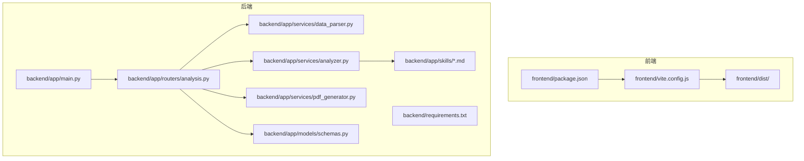
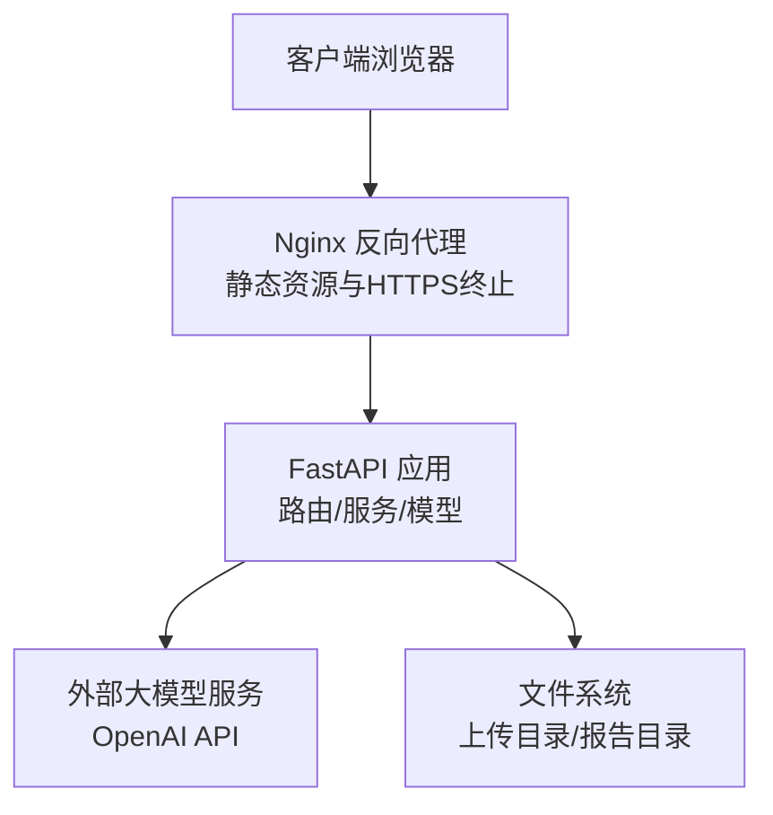
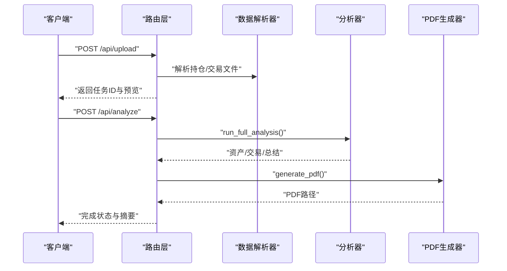
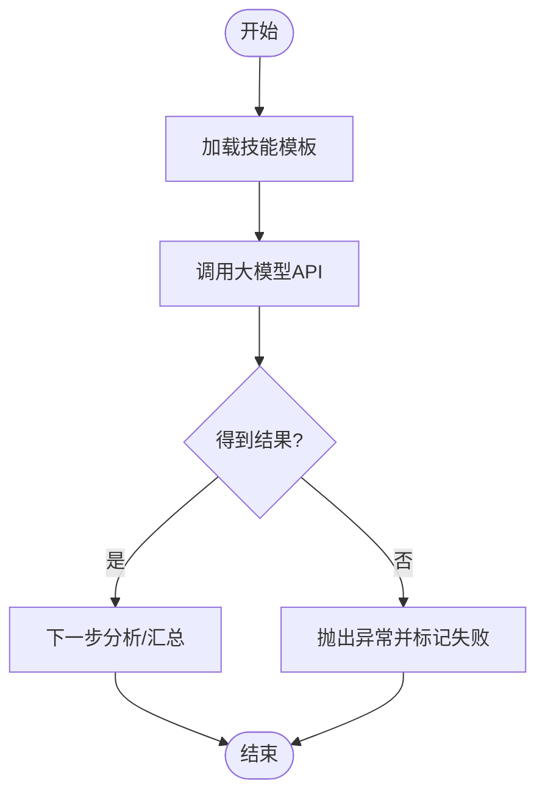
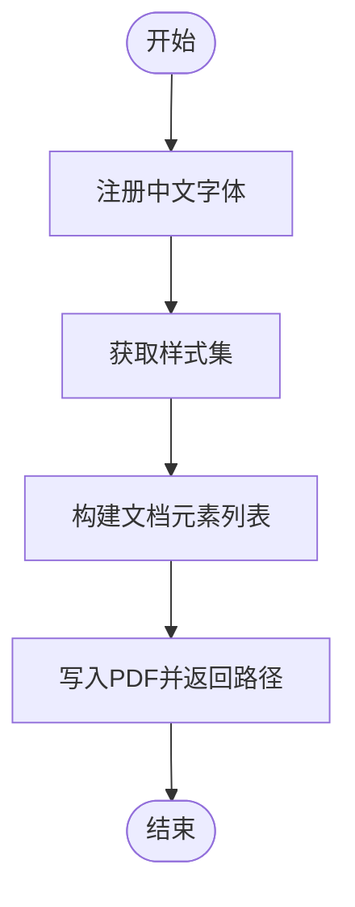
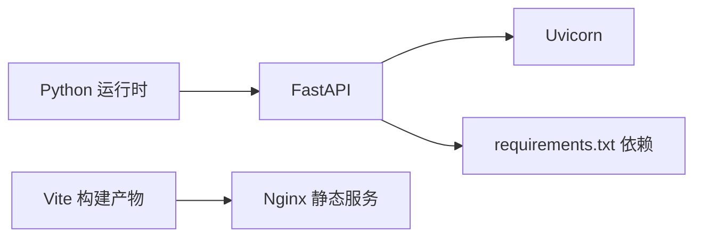

# 部署指南

<cite>
**本文引用的文件**
- [backend/app/main.py](file://backend/app/main.py)
- [backend/requirements.txt](file://backend/requirements.txt)
- [backend/app/routers/analysis.py](file://backend/app/routers/analysis.py)
- [backend/app/services/analyzer.py](file://backend/app/services/analyzer.py)
- [backend/app/services/data_parser.py](file://backend/app/services/data_parser.py)
- [backend/app/services/pdf_generator.py](file://backend/app/services/pdf_generator.py)
- [backend/app/models/schemas.py](file://backend/app/models/schemas.py)
- [backend/app/skills/report_template.md](file://backend/app/skills/report_template.md)
- [frontend/package.json](file://frontend/package.json)
- [frontend/vite.config.js](file://frontend/vite.config.js)
</cite>

## 目录
1. [简介](#简介)
2. [项目结构](#项目结构)
3. [核心组件](#核心组件)
4. [架构总览](#架构总览)
5. [详细组件分析](#详细组件分析)
6. [依赖分析](#依赖分析)
7. [性能考虑](#性能考虑)
8. [故障排查指南](#故障排查指南)
9. [结论](#结论)
10. [附录](#附录)

## 简介
本指南面向生产环境部署 Qoder-todo 项目，涵盖 Docker 容器化部署与传统服务器部署两种方案；提供 Nginx 反向代理与 SSL 证书配置建议；说明数据库与文件存储的部署要求；阐述并发处理、缓存与资源限制的性能优化策略；并给出监控与日志管理、负载均衡与高可用性建议。

## 项目结构
- 后端采用 FastAPI 应用，提供文件上传、分析与 PDF 下载接口，并内置内存任务状态存储。
- 前端基于 Vite + React 构建，产物输出至 dist 目录，可由后端静态文件服务统一对外提供。
- 分析链路依赖外部大模型服务（通过环境变量配置），并使用 ReportLab 生成 PDF 报告。

图表来源
- [backend/app/main.py:1-28](file://backend/app/main.py#L1-L28)
- [backend/requirements.txt:1-9](file://backend/requirements.txt#L1-L9)
- [backend/app/routers/analysis.py:1-218](file://backend/app/routers/analysis.py#L1-L218)
- [backend/app/services/analyzer.py:1-93](file://backend/app/services/analyzer.py#L1-L93)
- [backend/app/services/data_parser.py:1-96](file://backend/app/services/data_parser.py#L1-L96)
- [backend/app/services/pdf_generator.py:1-215](file://backend/app/services/pdf_generator.py#L1-L215)
- [backend/app/models/schemas.py:1-30](file://backend/app/models/schemas.py#L1-L30)
- [backend/app/skills/report_template.md:1-34](file://backend/app/skills/report_template.md#L1-L34)
- [frontend/package.json:1-32](file://frontend/package.json#L1-L32)
- [frontend/vite.config.js:1-8](file://frontend/vite.config.js#L1-L8)

章节来源
- [backend/app/main.py:1-28](file://backend/app/main.py#L1-L28)
- [backend/requirements.txt:1-9](file://backend/requirements.txt#L1-L9)
- [frontend/package.json:1-32](file://frontend/package.json#L1-L32)
- [frontend/vite.config.js:1-8](file://frontend/vite.config.js#L1-L8)

## 核心组件
- 应用入口与中间件
  - 应用初始化、CORS 配置、静态文件挂载、路由注册与开发运行入口。
- 路由与业务流程
  - 上传文件、触发分析、重新生成、查询任务状态、下载 PDF。
- 数据解析与分析
  - 解析 CSV/Excel 持仓与交易数据，调用大模型生成资产配置、交易行为与综合报告。
- PDF 生成
  - 基于 ReportLab 生成中文友好排版的 PDF 报告。
- 数据模型
  - 定义任务状态枚举、请求与响应模型。

章节来源
- [backend/app/main.py:1-28](file://backend/app/main.py#L1-L28)
- [backend/app/routers/analysis.py:1-218](file://backend/app/routers/analysis.py#L1-L218)
- [backend/app/services/data_parser.py:1-96](file://backend/app/services/data_parser.py#L1-L96)
- [backend/app/services/analyzer.py:1-93](file://backend/app/services/analyzer.py#L1-L93)
- [backend/app/services/pdf_generator.py:1-215](file://backend/app/services/pdf_generator.py#L1-L215)
- [backend/app/models/schemas.py:1-30](file://backend/app/models/schemas.py#L1-L30)

## 架构总览
下图展示生产部署时的典型拓扑：Nginx 作为反向代理与静态资源服务，后端 FastAPI 提供 API 与静态页面，分析服务依赖外部大模型 API，文件存储用于上传与报告生成。

图表来源
- [backend/app/main.py:1-28](file://backend/app/main.py#L1-L28)
- [backend/app/routers/analysis.py:1-218](file://backend/app/routers/analysis.py#L1-L218)
- [backend/app/services/analyzer.py:1-93](file://backend/app/services/analyzer.py#L1-L93)
- [backend/app/services/pdf_generator.py:1-215](file://backend/app/services/pdf_generator.py#L1-L215)

## 详细组件分析

### 后端应用与路由
- 应用启动与静态文件
  - 在应用入口中挂载静态文件目录，以便统一提供前端构建产物与报告下载。
- 路由职责
  - 上传：接收 CSV/Excel 文件，解析预览，生成任务 ID 并写入内存任务表。
  - 触发分析：读取任务上下文，调用分析服务与 PDF 生成服务，更新任务状态。
  - 重新生成：基于用户反馈再次生成分析与报告。
  - 查询任务：返回任务状态与结果摘要。
  - 下载 PDF：返回已生成的报告文件。

图表来源
- [backend/app/routers/analysis.py:35-135](file://backend/app/routers/analysis.py#L35-L135)
- [backend/app/services/data_parser.py:7-96](file://backend/app/services/data_parser.py#L7-L96)
- [backend/app/services/analyzer.py:77-93](file://backend/app/services/analyzer.py#L77-L93)
- [backend/app/services/pdf_generator.py:146-215](file://backend/app/services/pdf_generator.py#L146-L215)

章节来源
- [backend/app/main.py:1-28](file://backend/app/main.py#L1-L28)
- [backend/app/routers/analysis.py:1-218](file://backend/app/routers/analysis.py#L1-L218)

### 分析服务与技能模板
- 大模型客户端
  - 从环境变量读取 API 密钥与可选 base_url，支持自定义推理服务。
- 技能模板
  - 资产配置分析、交易行为分析与综合报告模板，分别位于 skills 目录。
- 分析流程
  - 依次调用资产分析、交易行为分析与综合报告生成，返回结构化结果。

图表来源
- [backend/app/services/analyzer.py:18-38](file://backend/app/services/analyzer.py#L18-L38)
- [backend/app/skills/report_template.md:1-34](file://backend/app/skills/report_template.md#L1-L34)

章节来源
- [backend/app/services/analyzer.py:1-93](file://backend/app/services/analyzer.py#L1-L93)
- [backend/app/skills/asset_analysis.md:1-35](file://backend/app/skills/asset_analysis.md#L1-L35)
- [backend/app/skills/report_template.md:1-34](file://backend/app/skills/report_template.md#L1-L34)

### PDF 生成与中文支持
- 字体注册
  - 尝试多平台常见中文字体路径，若失败则回退到 Helvetica。
- 文档结构
  - 封面标题、客户信息、分隔线、综合总结、资产配置分析、交易行为分析、免责声明。
- 输出
  - 返回 PDF 文件路径，供下载接口使用。

图表来源
- [backend/app/services/pdf_generator.py:26-106](file://backend/app/services/pdf_generator.py#L26-L106)
- [backend/app/services/pdf_generator.py:146-215](file://backend/app/services/pdf_generator.py#L146-L215)

章节来源
- [backend/app/services/pdf_generator.py:1-215](file://backend/app/services/pdf_generator.py#L1-L215)

### 数据模型与状态
- 任务状态枚举：pending、analyzing、completed、failed。
- 请求与响应模型：分析请求、重新生成请求、分析结果。

章节来源
- [backend/app/models/schemas.py:1-30](file://backend/app/models/schemas.py#L1-L30)

## 依赖分析
- 后端依赖
  - FastAPI、Uvicorn、OpenAI SDK、ReportLab、Pandas、OpenPyXL、Matplotlib、python-multipart。
- 前端依赖
  - React、Ant Design、Axios、Vite、ESLint 等。
- 运行时要求
  - Python 3.x 环境；可选支持多核并发的 ASGI 服务器（如 uvicorn）。

图表来源
- [backend/requirements.txt:1-9](file://backend/requirements.txt#L1-L9)
- [frontend/package.json:1-32](file://frontend/package.json#L1-L32)

章节来源
- [backend/requirements.txt:1-9](file://backend/requirements.txt#L1-L9)
- [frontend/package.json:1-32](file://frontend/package.json#L1-L32)

## 性能考虑
- 并发处理
  - 使用多进程/多实例部署（例如 uvicorn 多 worker），结合反向代理实现水平扩展。
- 缓存机制
  - 对热点分析结果与 PDF 文件进行短期缓存（建议使用 Redis 或本地磁盘缓存）。
  - 对大模型调用结果进行内容去重与缓存键设计，减少重复请求。
- 资源限制
  - 控制单次上传文件大小与并发任务数，防止内存与磁盘压力过大。
  - 为 PDF 生成设置超时与最大页数限制，避免长时间占用资源。
- I/O 优化
  - 将上传与报告目录置于高性能磁盘；对临时文件及时清理。
- 大模型调用
  - 合理设置温度与最大 token，避免过长响应；必要时启用流式输出或分段生成。

## 故障排查指南
- 常见错误与定位
  - 文件解析失败：检查上传文件格式与列名映射，确认编码与 Excel/CSV 读取逻辑。
  - 大模型调用失败：检查 OPENAI_API_KEY、OPENAI_BASE_URL、网络连通性与配额。
  - PDF 生成异常：确认字体注册路径与权限，确保输出目录存在且可写。
  - 任务状态异常：确认内存任务表未被重启清空，生产环境需替换为持久化存储。
- 日志与监控
  - 后端：开启 uvicorn 访问日志与结构化错误日志；记录任务状态变更与分析耗时。
  - 前端：收集网络错误与分析失败事件，上报至统一日志平台。
  - 监控指标：请求量、响应时间、错误率、队列长度、磁盘使用率、CPU/内存占用。
- 安全加固
  - 限制上传文件类型与大小；对输入参数进行严格校验；启用 HTTPS 与安全头部。

章节来源
- [backend/app/routers/analysis.py:50-64](file://backend/app/routers/analysis.py#L50-L64)
- [backend/app/services/analyzer.py:18-38](file://backend/app/services/analyzer.py#L18-L38)
- [backend/app/services/pdf_generator.py:26-51](file://backend/app/services/pdf_generator.py#L26-L51)

## 结论
Qoder-todo 的生产部署应以“反向代理 + 多实例后端 + 外部大模型 + 文件存储”为核心架构。通过合理的并发与缓存策略、严格的资源限制与监控告警，可在保证用户体验的同时提升稳定性与可维护性。对于需要更高可用性的场景，建议引入负载均衡与自动扩缩容机制。

## 附录

### 生产部署步骤（通用服务器）
- 准备工作
  - 安装 Python 3.x 与 pip；安装 Nginx。
  - 准备域名与 SSL 证书（推荐 Let’s Encrypt 自动续期）。
- 部署后端
  - 创建系统服务（如 systemd）或使用进程管理器（如 PM2、Supervisor）托管 uvicorn。
  - 设置环境变量：OPENAI_API_KEY、OPENAI_BASE_URL、OPENAI_MODEL。
  - 配置静态文件目录指向前端 dist 目录。
- 部署前端
  - 使用 Vite 构建生产包，将 dist 目录交由 Nginx 提供静态服务。
- 反向代理与 SSL
  - Nginx 将 /api 转发至后端；静态资源走本地 dist；启用 HTTPS 并配置安全头。
- 数据与文件存储
  - 上传目录与报告目录需具备持久化与备份能力；建议使用独立挂载盘。
- 监控与日志
  - 配置 Nginx 访问日志与后端结构化日志；接入统一日志平台；设置关键指标告警。

章节来源
- [backend/app/main.py:1-28](file://backend/app/main.py#L1-L28)
- [backend/requirements.txt:1-9](file://backend/requirements.txt#L1-L9)
- [frontend/package.json:1-32](file://frontend/package.json#L1-L32)

### Docker 容器化部署（建议）
- 构建镜像
  - 使用多阶段构建：前端构建产物复制至 Nginx 镜像；后端运行时镜像仅包含 Python 依赖。
- 容器编排
  - 使用 docker-compose 或 Kubernetes 部署：后端多副本 + Nginx 反代 + 持久化卷（上传/报告目录）。
- 环境变量
  - 通过配置文件注入 OPENAI_* 与基础路径等参数。
- 网络与安全
  - 仅暴露 Nginx 端口；内部后端服务不直接对外暴露；启用只读根文件系统与最小权限。

章节来源
- [backend/requirements.txt:1-9](file://backend/requirements.txt#L1-L9)
- [frontend/package.json:1-32](file://frontend/package.json#L1-L32)

### Nginx 反向代理与 SSL 配置要点
- 反向代理
  - 将 /api 前缀转发至后端服务；静态资源指向 dist 目录。
- SSL 证书
  - 使用 Let’s Encrypt 自动签发与续期；启用 TLS 1.3 与安全密码套件。
- 安全头
  - 添加 CSP、HSTS、X-Frame-Options、X-Content-Type-Options 等头。
- 超时与限速
  - 配置合理的 proxy_read_timeout、proxy_send_timeout；对上传与下载接口限速。

章节来源
- [backend/app/main.py:1-28](file://backend/app/main.py#L1-L28)

### 数据库与文件存储部署要求
- 数据库存储
  - 生产环境需将内存任务表替换为数据库（如 PostgreSQL/MySQL），并建立索引与分区策略。
- 文件存储
  - 上传与报告目录需具备高可用与备份；建议使用对象存储（如 S3）或共享文件系统。
- 缓存层
  - 引入 Redis 缓存热点数据与分析结果，降低后端压力。

章节来源
- [backend/app/routers/analysis.py:16-22](file://backend/app/routers/analysis.py#L16-L22)

### 负载均衡与高可用建议
- 负载均衡
  - 使用 Nginx/LVS/Tengine 实现四层/七层负载；后端多实例无状态部署。
- 自动扩缩容
  - 基于 CPU/内存/请求队列长度触发扩缩容；结合健康检查与优雅下线。
- 数据一致性
  - 任务状态与分析结果统一落库；报告文件统一存储与 CDN 加速。

章节来源
- [backend/app/routers/analysis.py:16-22](file://backend/app/routers/analysis.py#L16-L22)