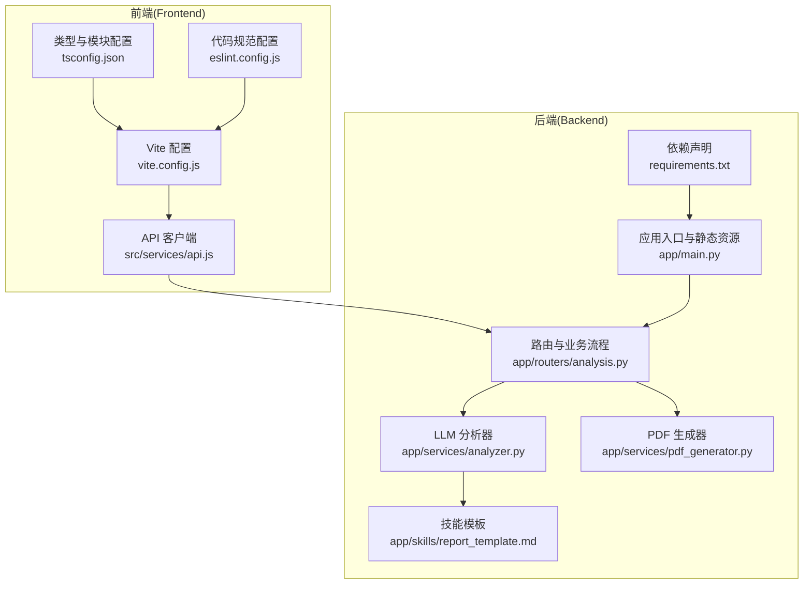
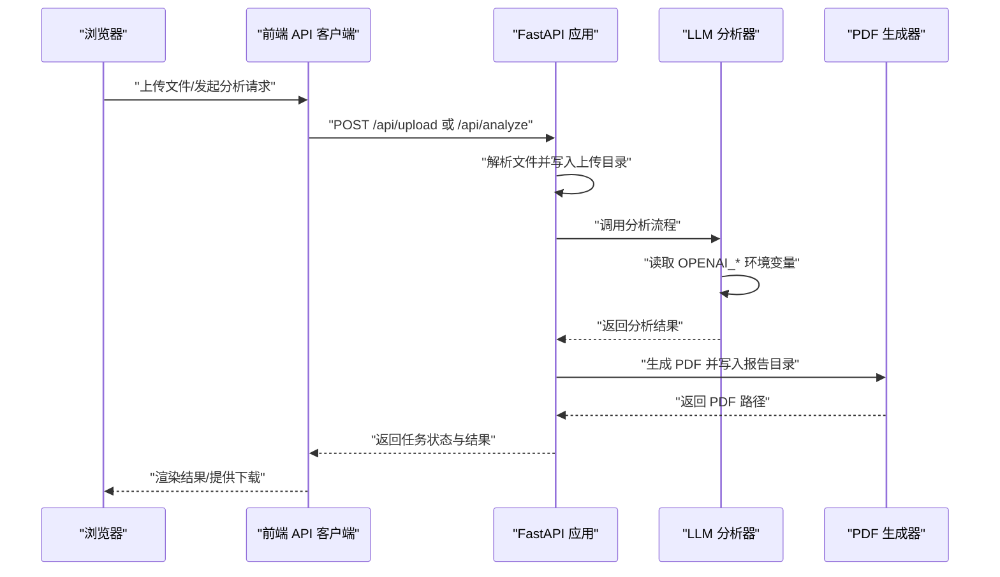
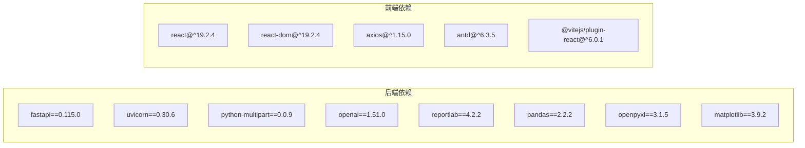

# 配置管理

<cite>
**本文引用的文件**
- [backend/app/main.py](file://backend/app/main.py)
- [backend/requirements.txt](file://backend/requirements.txt)
- [backend/app/services/analyzer.py](file://backend/app/services/analyzer.py)
- [backend/app/services/pdf_generator.py](file://backend/app/services/pdf_generator.py)
- [backend/app/routers/analysis.py](file://backend/app/routers/analysis.py)
- [backend/app/skills/report_template.md](file://backend/app/skills/report_template.md)
- [frontend/vite.config.js](file://frontend/vite.config.js)
- [frontend/package.json](file://frontend/package.json)
- [frontend/src/services/api.js](file://frontend/src/services/api.js)
- [frontend/tsconfig.json](file://frontend/tsconfig.json)
- [frontend/eslint.config.js](file://frontend/eslint.config.js)
</cite>

## 目录
1. [简介](#简介)
2. [项目结构](#项目结构)
3. [核心组件](#核心组件)
4. [架构总览](#架构总览)
5. [详细组件分析](#详细组件分析)
6. [依赖分析](#依赖分析)
7. [性能考虑](#性能考虑)
8. [故障排查指南](#故障排查指南)
9. [结论](#结论)
10. [附录](#附录)

## 简介
本文件系统性梳理 Qoder-todo 项目的配置管理，覆盖后端环境变量与目录配置、LLM 分析器的模型与参数配置、PDF 生成器的字体与样式配置、前端 Vite 构建配置与优化策略，并对开发与生产环境的配置差异进行对比，帮助读者快速上手并安全地部署。

## 项目结构
项目采用前后端分离架构，后端基于 FastAPI，前端基于 Vite + React。后端负责文件上传、解析、LLM 分析与 PDF 报告生成；前端负责用户交互与 API 调用。

图表来源
- [frontend/vite.config.js:1-8](file://frontend/vite.config.js#L1-L8)
- [frontend/tsconfig.json:1-24](file://frontend/tsconfig.json#L1-L24)
- [frontend/eslint.config.js:1-30](file://frontend/eslint.config.js#L1-L30)
- [frontend/src/services/api.js:1-48](file://frontend/src/services/api.js#L1-L48)
- [backend/app/main.py:1-28](file://backend/app/main.py#L1-L28)
- [backend/requirements.txt:1-9](file://backend/requirements.txt#L1-L9)
- [backend/app/routers/analysis.py:1-218](file://backend/app/routers/analysis.py#L1-L218)
- [backend/app/services/analyzer.py:1-93](file://backend/app/services/analyzer.py#L1-L93)
- [backend/app/services/pdf_generator.py:1-215](file://backend/app/services/pdf_generator.py#L1-L215)
- [backend/app/skills/report_template.md:1-34](file://backend/app/skills/report_template.md#L1-L34)

章节来源
- [backend/app/main.py:1-28](file://backend/app/main.py#L1-L28)
- [frontend/vite.config.js:1-8](file://frontend/vite.config.js#L1-L8)

## 核心组件
- 后端应用入口与静态资源托管：负责启动服务、注册 CORS、创建上传与报告目录、挂载路由。
- LLM 分析器：封装 OpenAI 客户端，支持自定义 base_url，读取模型名与默认温度、最大 token 等参数。
- PDF 生成器：基于 ReportLab，自动注册中文字体，定义标题、副标题、正文等样式，支持 Markdown 片段转 Flowable。
- 路由与业务流程：处理文件上传、解析预览、触发分析、生成 PDF、下载报告、根据反馈重分析。
- 前端 API 客户端：统一基地址与长超时，封装上传、分析、重分析、状态查询与下载链接。

章节来源
- [backend/app/main.py:18-21](file://backend/app/main.py#L18-L21)
- [backend/app/services/analyzer.py:18-38](file://backend/app/services/analyzer.py#L18-L38)
- [backend/app/services/pdf_generator.py:26-106](file://backend/app/services/pdf_generator.py#L26-L106)
- [backend/app/routers/analysis.py:35-135](file://backend/app/routers/analysis.py#L35-L135)
- [frontend/src/services/api.js:3-8](file://frontend/src/services/api.js#L3-L8)

## 架构总览
下图展示从浏览器到后端服务的关键配置点与调用链路。

图表来源
- [frontend/src/services/api.js:10-29](file://frontend/src/services/api.js#L10-L29)
- [backend/app/routers/analysis.py:86-135](file://backend/app/routers/analysis.py#L86-L135)
- [backend/app/services/analyzer.py:18-38](file://backend/app/services/analyzer.py#L18-L38)
- [backend/app/services/pdf_generator.py:146-215](file://backend/app/services/pdf_generator.py#L146-L215)

## 详细组件分析

### 环境变量与目录配置
- OpenAI 相关环境变量
  - OPENAI_API_KEY：用于初始化 OpenAI 客户端。
  - OPENAI_BASE_URL：可选，用于指定自定义网关或代理地址。
  - OPENAI_MODEL：可选，用于指定模型，默认 gpt-4o。
- 服务器端口
  - 默认监听 0.0.0.0:8000，可通过运行命令参数覆盖。
- 文件存储路径
  - 上传目录：后端 uploads 目录，用于保存上传的 CSV/Excel 文件。
  - 报告目录：后端 reports 目录，用于保存生成的 PDF 报告。
- 目录创建
  - 应用启动时会自动创建上传与报告目录，确保服务可用。

章节来源
- [backend/app/services/analyzer.py:20-22](file://backend/app/services/analyzer.py#L20-L22)
- [backend/app/main.py:18-21](file://backend/app/main.py#L18-L21)
- [backend/app/routers/analysis.py:19-22](file://backend/app/routers/analysis.py#L19-L22)

### LLM 分析器配置
- 模型选择
  - 通过环境变量 OPENAI_MODEL 指定模型，默认值为 gpt-4o。
- 参数调优
  - 温度：0.7（默认），用于平衡创造性与稳定性。
  - 最大 token：4000（默认），限制单次响应长度。
- 超时设置
  - 当前实现未显式设置 HTTP 层超时，但前端分析请求设置了较长超时（约 5 分钟），以适配长分析耗时场景。
- 系统提示与技能模板
  - 分析器从 skills 目录加载技能模板（如资产分析、交易行为、综合报告模板），作为 system prompt 的一部分注入。

章节来源
- [backend/app/services/analyzer.py:28](file://backend/app/services/analyzer.py#L28)
- [backend/app/services/analyzer.py:35-37](file://backend/app/services/analyzer.py#L35-L37)
- [backend/app/services/analyzer.py:11-15](file://backend/app/services/analyzer.py#L11-L15)
- [backend/app/skills/report_template.md:1-34](file://backend/app/skills/report_template.md#L1-L34)
- [frontend/src/services/api.js:7](file://frontend/src/services/api.js#L7)

### PDF 生成器配置
- 字体设置
  - 自动尝试注册常用中文字体（Windows、Linux、macOS 多平台路径），若均不可用则回退至 Helvetica。
- 页面布局
  - A4 页面尺寸，上下左右边距分别为 25mm、20mm、20mm、20mm。
- 样式定制
  - 定义标题、副标题、小节标题、正文等样式，包含字号、行高、对齐方式、颜色等。
- 内容处理
  - 支持将 Markdown 片段转换为 ReportLab Flowable，包括标题、列表、加粗等基础语法。
- 输出路径
  - 生成的 PDF 存放于 reports 目录，文件名包含任务 ID。

章节来源
- [backend/app/services/pdf_generator.py:26-51](file://backend/app/services/pdf_generator.py#L26-L51)
- [backend/app/services/pdf_generator.py:53-106](file://backend/app/services/pdf_generator.py#L53-L106)
- [backend/app/services/pdf_generator.py:146-215](file://backend/app/services/pdf_generator.py#L146-L215)

### 前端 Vite 配置与构建优化
- 插件与基础配置
  - 使用 @vitejs/plugin-react，提供 React 开发体验。
- 构建脚本
  - dev/build/preview/lint 等脚本，满足开发、构建、预览与代码规范检查。
- 类型与模块解析
  - tsconfig.json 使用现代目标与 bundler 模式，启用严格类型检查与仅打包模式。
- 代码规范
  - eslint.config.js 集成推荐规则与 React Hooks/React Refresh 规则，忽略 dist 目录。
- API 客户端
  - 基础 URL 指向后端 /api，超时设为 5 分钟，适配后端分析耗时。

章节来源
- [frontend/vite.config.js:1-8](file://frontend/vite.config.js#L1-L8)
- [frontend/package.json:6-11](file://frontend/package.json#L6-L11)
- [frontend/tsconfig.json:1-24](file://frontend/tsconfig.json#L1-L24)
- [frontend/eslint.config.js:1-30](file://frontend/eslint.config.js#L1-L30)
- [frontend/src/services/api.js:3-8](file://frontend/src/services/api.js#L3-L8)

### 生产环境与开发环境配置差异
- 端口与主机
  - 开发：默认 0.0.0.0:8000，适合本地联调。
  - 生产：建议通过反向代理（Nginx/Caddy）暴露 80/443，后端容器内监听 0.0.0.0:8000。
- 静态资源
  - 开发：Vite HMR 与本地预览。
  - 生产：前端构建产物 dist 部署至 Nginx，后端通过 StaticFiles 提供静态文件（如需）。
- 日志与错误
  - 开发：打印堆栈便于调试。
  - 生产：建议集中化日志与错误上报，屏蔽敏感信息。
- 环境变量
  - 开发：可在 .env 加载 OPENAI_* 变量。
  - 生产：通过容器编排或平台变量注入，避免硬编码。
- 性能与缓存
  - 开发：热更新优先。
  - 生产：开启静态资源缓存、Gzip/Brotli 压缩、CDN 加速。

## 依赖分析
后端依赖通过 requirements.txt 管理，前端依赖通过 package.json 管理。二者分别约束了框架版本与插件生态，保证构建与运行一致性。

图表来源
- [backend/requirements.txt:1-9](file://backend/requirements.txt#L1-L9)
- [frontend/package.json:12-19](file://frontend/package.json#L12-L19)
- [frontend/package.json:20-29](file://frontend/package.json#L20-L29)

章节来源
- [backend/requirements.txt:1-9](file://backend/requirements.txt#L1-L9)
- [frontend/package.json:1-32](file://frontend/package.json#L1-L32)

## 性能考虑
- LLM 调用
  - 控制温度与最大 token，避免过长响应导致延迟。
  - 对长文本分块或摘要化输入，减少上下文开销。
- 文件解析
  - 使用 pandas 批量处理，避免逐行读取；必要时限制预览行数。
- PDF 生成
  - 合理设置边距与样式，减少复杂表格渲染；避免重复字体注册。
- 前端请求
  - 为长分析请求设置合理超时；对并发请求进行节流与去重。
- 缓存与持久化
  - 任务状态与中间结果在内存中存储，生产环境建议替换为数据库或 Redis。

## 故障排查指南
- OpenAI 配置错误
  - 现象：分析接口报错或空响应。
  - 排查：确认 OPENAI_API_KEY 是否正确；若使用自定义网关，检查 OPENAI_BASE_URL。
- 模型不可用或超时
  - 现象：调用 LLM 时抛出网络或超时异常。
  - 排查：检查网络连通性与代理设置；适当提高前端超时或后端重试策略。
- 字体缺失导致 PDF 中文乱码
  - 现象：生成 PDF 文字显示异常。
  - 排查：确认系统已安装中文字体；或在部署环境提前准备字体文件。
- 目录权限不足
  - 现象：上传或生成 PDF 失败。
  - 排查：确保 reports 与 uploads 目录存在且具备写权限。
- 前端无法访问后端
  - 现象：跨域错误或 404。
  - 排查：确认前端 API 基础 URL 与后端端口一致；检查 CORS 配置。

章节来源
- [backend/app/services/analyzer.py:20-22](file://backend/app/services/analyzer.py#L20-L22)
- [backend/app/services/pdf_generator.py:31-51](file://backend/app/services/pdf_generator.py#L31-L51)
- [backend/app/main.py:18-21](file://backend/app/main.py#L18-L21)
- [frontend/src/services/api.js:3-8](file://frontend/src/services/api.js#L3-L8)

## 结论
本项目通过清晰的环境变量与目录配置、可扩展的 LLM 分析器与 PDF 生成器、以及简洁的前端 Vite 配置，实现了从数据上传到报告生成的完整闭环。建议在生产环境中完善日志、缓存与安全策略，并通过容器化与反向代理实现稳定部署。

## 附录
- 环境变量清单
  - OPENAI_API_KEY：OpenAI API 密钥
  - OPENAI_BASE_URL：OpenAI 兼容网关地址（可选）
  - OPENAI_MODEL：模型名称（可选，默认 gpt-4o）
- 目录清单
  - 上传目录：后端 uploads
  - 报告目录：后端 reports
- 前端 API 基础 URL：http://localhost:8000/api