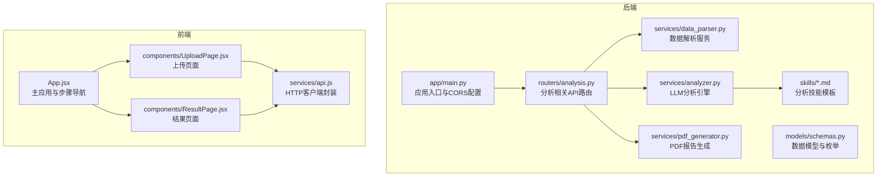
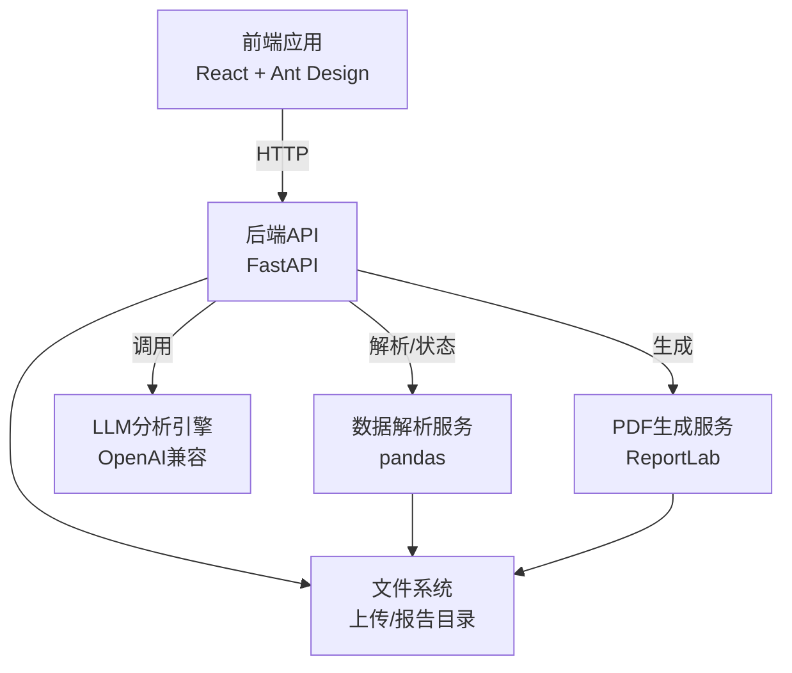
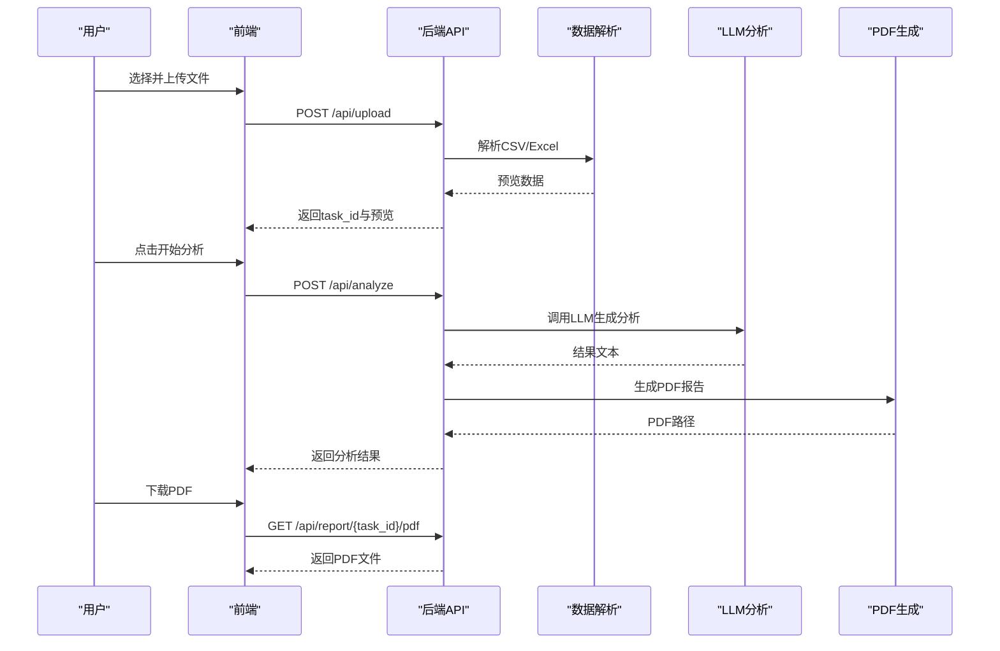
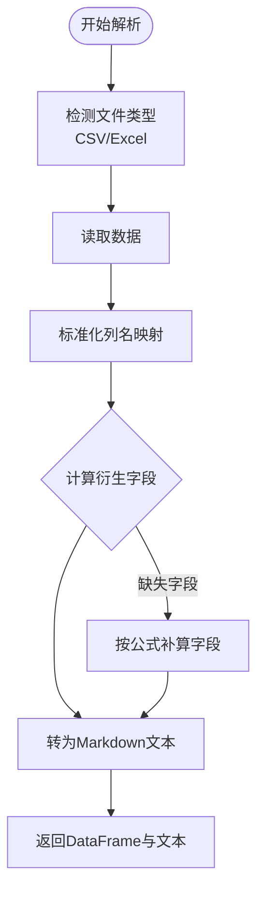
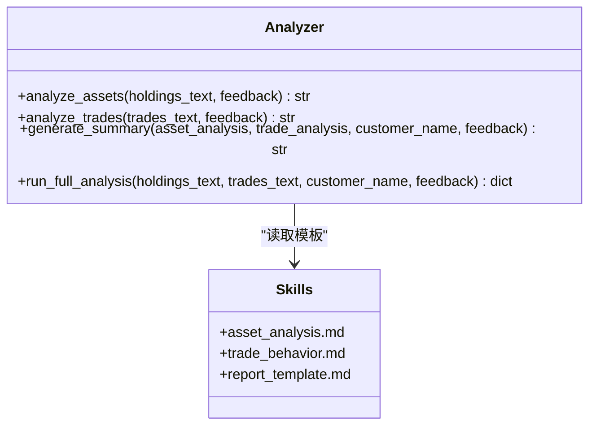
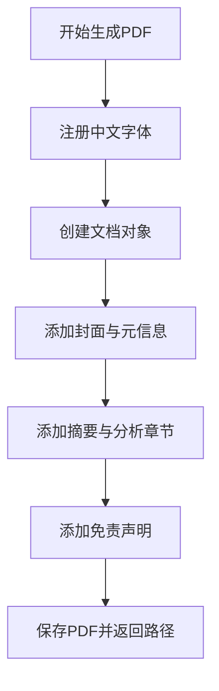
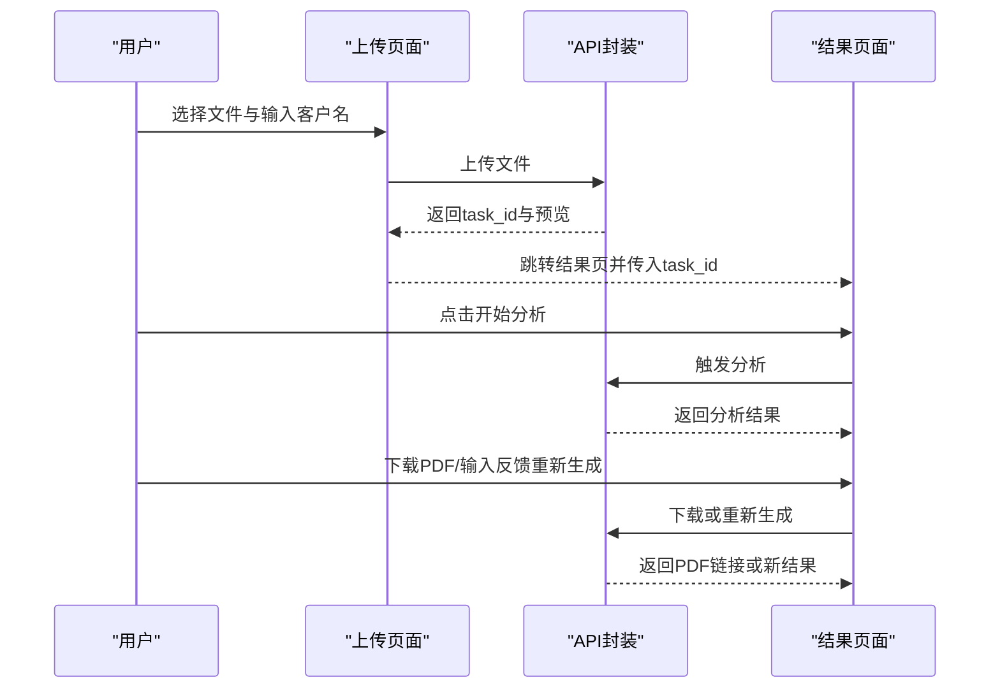
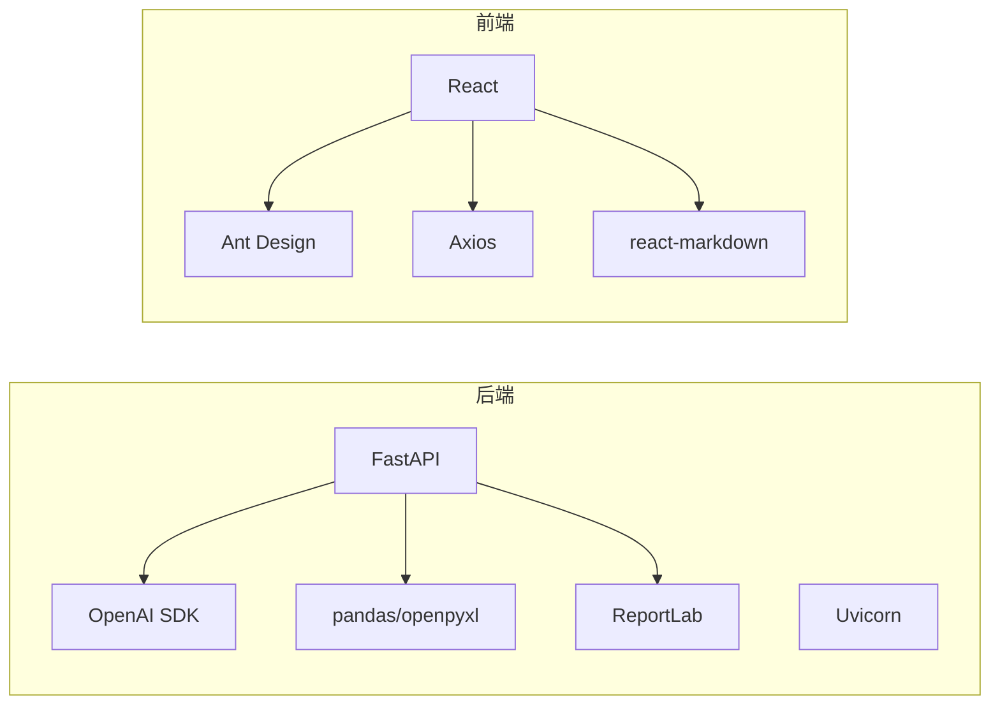

# 项目概述

<cite>
**本文档引用的文件**
- [backend/app/main.py](file://backend/app/main.py)
- [backend/app/routers/analysis.py](file://backend/app/routers/analysis.py)
- [backend/app/services/analyzer.py](file://backend/app/services/analyzer.py)
- [backend/app/services/data_parser.py](file://backend/app/services/data_parser.py)
- [backend/app/services/pdf_generator.py](file://backend/app/services/pdf_generator.py)
- [backend/app/models/schemas.py](file://backend/app/models/schemas.py)
- [backend/app/skills/report_template.md](file://backend/app/skills/report_template.md)
- [backend/app/skills/asset_analysis.md](file://backend/app/skills/asset_analysis.md)
- [backend/app/skills/trade_behavior.md](file://backend/app/skills/trade_behavior.md)
- [backend/requirements.txt](file://backend/requirements.txt)
- [frontend/src/App.jsx](file://frontend/src/App.jsx)
- [frontend/src/components/UploadPage.jsx](file://frontend/src/components/UploadPage.jsx)
- [frontend/src/components/ResultPage.jsx](file://frontend/src/components/ResultPage.jsx)
- [frontend/src/services/api.js](file://frontend/src/services/api.js)
- [frontend/package.json](file://frontend/package.json)
</cite>

## 目录
1. [引言](#引言)
2. [项目结构](#项目结构)
3. [核心组件](#核心组件)
4. [架构总览](#架构总览)
5. [详细组件分析](#详细组件分析)
6. [依赖分析](#依赖分析)
7. [性能考虑](#性能考虑)
8. [故障排除指南](#故障排除指南)
9. [结论](#结论)
10. [附录](#附录)

## 引言
本项目是一个基于大语言模型的客户资产分析平台，旨在帮助金融机构的客户经理高效地对个人或机构客户的资产状况进行深度分析，并生成专业的中文PDF分析报告。系统支持CSV/Excel文件上传，自动解析持仓与交易数据，通过内置的LLM分析技能生成资产配置与交易行为的综合分析，并提供可下载的PDF报告以及“根据反馈重新生成”的交互能力。

该平台采用前后端分离架构：后端使用FastAPI提供REST API，负责文件上传、数据解析、LLM分析调度与PDF报告生成；前端使用React + Ant Design构建用户界面，提供文件上传、分析进度展示与报告查看下载等功能。项目通过明确的模块划分与职责边界，确保了良好的可维护性与扩展性。

## 项目结构
项目分为两个主要子工程：
- 后端（Python/FastAPI）：提供API路由、数据分析服务、PDF生成与静态资源托管。
- 前端（React/Vite）：提供用户交互界面、文件上传、分析状态展示与报告下载。

图表来源
- [backend/app/main.py:1-28](file://backend/app/main.py#L1-L28)
- [backend/app/routers/analysis.py:1-218](file://backend/app/routers/analysis.py#L1-L218)
- [backend/app/services/analyzer.py:1-93](file://backend/app/services/analyzer.py#L1-L93)
- [backend/app/services/data_parser.py:1-96](file://backend/app/services/data_parser.py#L1-L96)
- [backend/app/services/pdf_generator.py:1-215](file://backend/app/services/pdf_generator.py#L1-L215)
- [backend/app/models/schemas.py:1-30](file://backend/app/models/schemas.py#L1-L30)
- [frontend/src/App.jsx:1-81](file://frontend/src/App.jsx#L1-L81)
- [frontend/src/components/UploadPage.jsx:1-145](file://frontend/src/components/UploadPage.jsx#L1-L145)
- [frontend/src/components/ResultPage.jsx:1-193](file://frontend/src/components/ResultPage.jsx#L1-L193)
- [frontend/src/services/api.js:1-48](file://frontend/src/services/api.js#L1-L48)

章节来源
- [backend/app/main.py:1-28](file://backend/app/main.py#L1-L28)
- [frontend/src/App.jsx:1-81](file://frontend/src/App.jsx#L1-L81)

## 核心组件
- 应用入口与中间件
  - 后端通过FastAPI创建应用实例，启用CORS以便前端跨域访问，并挂载静态文件目录用于报告下载。
  - 应用包含统一的上传与报告目录，确保文件持久化与安全访问。
- 分析API路由
  - 提供上传、分析、重新生成、状态查询与PDF下载等接口，支持CSV/Excel文件解析与预览。
  - 使用内存字典模拟任务状态存储（生产环境建议替换为数据库）。
- 数据解析服务
  - 自动识别CSV/Excel格式，标准化列名，计算衍生指标（如市值、浮盈浮亏、盈亏比例），并将数据转为LLM可读文本。
- LLM分析引擎
  - 加载技能模板（资产配置、交易行为、综合报告），调用OpenAI兼容的LLM接口，生成结构化分析结果。
- PDF报告生成
  - 使用ReportLab生成符合中文显示的PDF报告，包含封面、摘要、资产配置分析、交易行为分析与免责声明。
- 前端界面
  - 两步式流程：上传数据与查看结果；支持拖拽上传、文件预览、分析状态展示、Markdown渲染与PDF下载。
- 数据模型
  - 定义任务状态枚举与请求/响应模型，保证前后端数据契约一致。

章节来源
- [backend/app/main.py:1-28](file://backend/app/main.py#L1-L28)
- [backend/app/routers/analysis.py:1-218](file://backend/app/routers/analysis.py#L1-L218)
- [backend/app/services/data_parser.py:1-96](file://backend/app/services/data_parser.py#L1-L96)
- [backend/app/services/analyzer.py:1-93](file://backend/app/services/analyzer.py#L1-L93)
- [backend/app/services/pdf_generator.py:1-215](file://backend/app/services/pdf_generator.py#L1-L215)
- [frontend/src/components/UploadPage.jsx:1-145](file://frontend/src/components/UploadPage.jsx#L1-L145)
- [frontend/src/components/ResultPage.jsx:1-193](file://frontend/src/components/ResultPage.jsx#L1-L193)

## 架构总览
系统采用前后端分离架构，后端提供REST API，前端通过Axios调用接口实现完整的分析工作流。后端内部通过服务层解耦数据解析、LLM分析与PDF生成，便于独立演进与测试。

图表来源
- [backend/app/routers/analysis.py:1-218](file://backend/app/routers/analysis.py#L1-L218)
- [backend/app/services/data_parser.py:1-96](file://backend/app/services/data_parser.py#L1-L96)
- [backend/app/services/analyzer.py:1-93](file://backend/app/services/analyzer.py#L1-L93)
- [backend/app/services/pdf_generator.py:1-215](file://backend/app/services/pdf_generator.py#L1-L215)

## 详细组件分析

### 后端API与工作流
- 上传与预览
  - 接收持仓与可选交易文件，保存至本地临时目录，解析前10条数据作为预览。
- 触发分析
  - 读取已保存的文本内容，调用分析引擎生成资产配置、交易行为与综合报告。
- 生成与下载PDF
  - 将分析结果写入PDF并返回文件路径，前端通过GET接口下载。
- 重新生成
  - 支持根据客户经理反馈意见重新调用分析与PDF生成。
- 状态查询
  - 提供任务状态查询接口，便于前端轮询更新UI。

图表来源
- [backend/app/routers/analysis.py:35-152](file://backend/app/routers/analysis.py#L35-L152)
- [backend/app/services/analyzer.py:77-93](file://backend/app/services/analyzer.py#L77-L93)
- [backend/app/services/pdf_generator.py:146-215](file://backend/app/services/pdf_generator.py#L146-L215)

章节来源
- [backend/app/routers/analysis.py:1-218](file://backend/app/routers/analysis.py#L1-L218)

### 数据解析与标准化
- 持仓数据解析
  - 自动识别中文列名并重命名为统一英文字段，计算市值、浮盈浮亏与盈亏比例，生成Markdown文本。
- 交易数据解析
  - 标准化买卖方向、数量、价格、金额与时间字段，计算总交易笔数与衍生金额字段。
- 错误处理
  - 对解析失败的情况抛出HTTP异常，前端捕获并提示用户。

图表来源
- [backend/app/services/data_parser.py:7-52](file://backend/app/services/data_parser.py#L7-L52)
- [backend/app/services/data_parser.py:55-96](file://backend/app/services/data_parser.py#L55-L96)

章节来源
- [backend/app/services/data_parser.py:1-96](file://backend/app/services/data_parser.py#L1-L96)

### LLM分析与技能模板
- 技能加载
  - 从skills目录读取Markdown模板，作为system prompt注入LLM。
- 分析流程
  - 资产配置分析、交易行为分析与综合报告生成三阶段串联，支持反馈驱动的重新生成。
- 大模型调用
  - 通过OpenAI兼容客户端调用，支持自定义base_url与模型参数。

图表来源
- [backend/app/services/analyzer.py:18-93](file://backend/app/services/analyzer.py#L18-L93)
- [backend/app/skills/asset_analysis.md:1-35](file://backend/app/skills/asset_analysis.md#L1-L35)
- [backend/app/skills/trade_behavior.md:1-34](file://backend/app/skills/trade_behavior.md#L1-L34)
- [backend/app/skills/report_template.md:1-34](file://backend/app/skills/report_template.md#L1-L34)

章节来源
- [backend/app/services/analyzer.py:1-93](file://backend/app/services/analyzer.py#L1-L93)

### PDF报告生成
- 中文字体适配
  - 尝试注册多种系统中文字体，若失败则回退到默认字体。
- 结构化排版
  - 封面标题、客户信息、生成日期、分隔线、摘要、资产配置分析、交易行为分析与免责声明。
- Markdown渲染
  - 将LLM输出的Markdown转换为ReportLab可渲染元素，支持标题、列表与加粗标记。

图表来源
- [backend/app/services/pdf_generator.py:26-106](file://backend/app/services/pdf_generator.py#L26-L106)
- [backend/app/services/pdf_generator.py:146-215](file://backend/app/services/pdf_generator.py#L146-L215)

章节来源
- [backend/app/services/pdf_generator.py:1-215](file://backend/app/services/pdf_generator.py#L1-L215)

### 前端交互与状态管理
- 主应用
  - 使用Ant Design布局与主题，提供两步式流程导航（上传数据/分析报告）。
- 上传页面
  - 支持拖拽上传CSV/Excel，显示客户名称输入与文件预览表格。
- 结果页面
  - 展示分析完成状态、Markdown渲染的报告内容、PDF下载按钮与反馈重新生成功能。
- API封装
  - Axios封装基础URL、超时设置与常用方法，便于复用。

图表来源
- [frontend/src/components/UploadPage.jsx:20-38](file://frontend/src/components/UploadPage.jsx#L20-L38)
- [frontend/src/components/ResultPage.jsx:22-54](file://frontend/src/components/ResultPage.jsx#L22-L54)
- [frontend/src/services/api.js:10-45](file://frontend/src/services/api.js#L10-L45)

章节来源
- [frontend/src/App.jsx:1-81](file://frontend/src/App.jsx#L1-L81)
- [frontend/src/components/UploadPage.jsx:1-145](file://frontend/src/components/UploadPage.jsx#L1-L145)
- [frontend/src/components/ResultPage.jsx:1-193](file://frontend/src/components/ResultPage.jsx#L1-L193)
- [frontend/src/services/api.js:1-48](file://frontend/src/services/api.js#L1-L48)

## 依赖分析
- 后端依赖
  - FastAPI提供高性能异步Web框架，Uvicorn作为ASGI服务器。
  - python-multipart支持多部分表单上传。
  - OpenAI SDK用于调用大模型API。
  - ReportLab用于PDF生成。
  - pandas与openpyxl用于Excel解析。
  - matplotlib用于图表（预留）。
- 前端依赖
  - React与Ant Design提供UI组件与主题。
  - Axios封装HTTP请求。
  - react-markdown用于Markdown渲染。

图表来源
- [backend/requirements.txt:1-9](file://backend/requirements.txt#L1-L9)
- [frontend/package.json:12-30](file://frontend/package.json#L12-L30)

章节来源
- [backend/requirements.txt:1-9](file://backend/requirements.txt#L1-L9)
- [frontend/package.json:1-32](file://frontend/package.json#L1-L32)

## 性能考虑
- 文件解析
  - 使用pandas批量读取与计算，建议对超大数据集进行分块处理或限制文件大小。
- LLM调用
  - 控制消息长度与token上限，合理拆分长文本；在生产环境配置合适的并发与重试策略。
- PDF生成
  - 避免一次性渲染大量表格，必要时分页或延迟加载。
- 前端体验
  - 上传与分析过程提供明确的加载状态与错误提示，避免长时间无响应。

## 故障排除指南
- 上传失败
  - 检查文件格式是否为CSV/Excel，确认文件未损坏；查看后端解析异常信息。
- 分析失败
  - 确认OpenAI API密钥与base_url配置正确；检查网络连通性与模型可用性。
- PDF下载为空
  - 确认分析已完成且PDF已生成；检查后端报告目录权限。
- 字体显示异常
  - 确认系统中文字体存在或允许回退到默认字体；必要时手动指定字体路径。

章节来源
- [backend/app/routers/analysis.py:54-64](file://backend/app/routers/analysis.py#L54-L64)
- [backend/app/services/analyzer.py:18-38](file://backend/app/services/analyzer.py#L18-L38)
- [backend/app/services/pdf_generator.py:26-51](file://backend/app/services/pdf_generator.py#L26-L51)

## 结论
本项目通过前后端分离的设计，结合FastAPI与React的优势，构建了一个易用、可扩展的客户资产分析平台。后端以服务化方式组织数据解析、LLM分析与PDF生成，前端提供直观的交互流程与报告展示。项目具备清晰的扩展点，可在生产环境中接入数据库、缓存与任务队列，进一步提升稳定性与性能。

## 附录
- 技术栈说明
  - 后端：FastAPI、Uvicorn、OpenAI SDK、ReportLab、pandas、openpyxl、matplotlib
  - 前端：React、Ant Design、Axios、react-markdown、Vite
- 部署建议
  - 后端：使用Uvicorn部署，配置反向代理与静态文件服务；生产环境替换内存任务存储为数据库。
  - 前端：构建后部署至Nginx或CDN，确保与后端API域名一致以避免跨域问题。